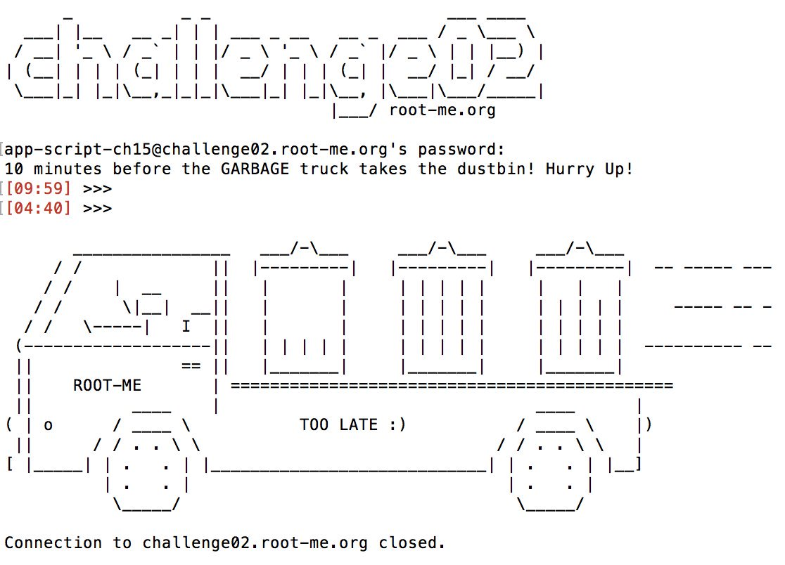
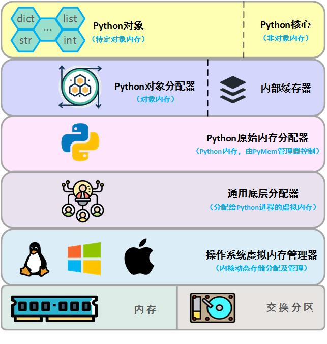
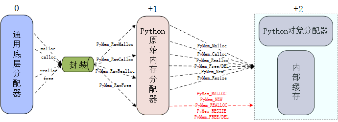
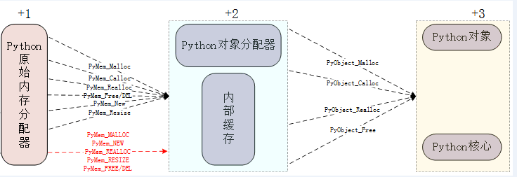
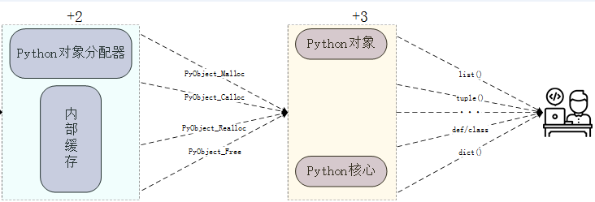
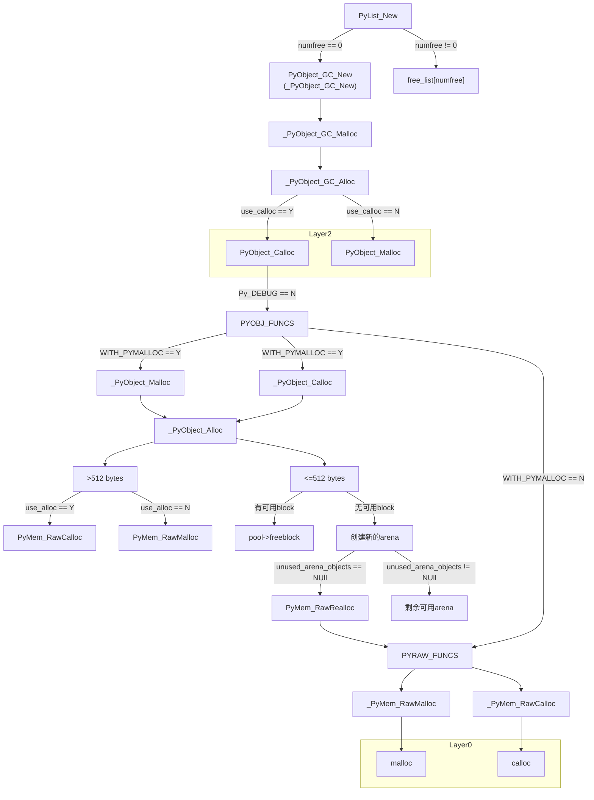

### 1. 概述

&emsp;&emsp;最近使用[Scapy](https://scapy.net/)在处理一个大约22G的数据集时，才处理了大约2G的数据就把我16G的内存撑爆了(OS: Win7)。于是换了个32G内存的机器跑(OS: Linux with Ubuntu-Sever)，跑了一段时间之后还是撑爆了(数据还远远没有处理完)。

&emsp;&emsp;使用`memory_profiler`进一步排查发现`Scapy(2.4.2)`在加载`pcap`报文时(使用`rdpcap`函数)，内存膨胀大约在$10～15$倍左右，如下图所示：

```bash
Line #    Mem usage    Increment   Line Contents
================================================
     5     67.5 MiB     67.5 MiB   @profile
     6                             def read_packet(pcap_path):
     7     67.5 MiB      0.0 MiB       try:
     8    113.6 MiB     46.1 MiB           rdpcap(pcap_path)
     9    113.6 MiB      0.0 MiB       except EOFError as err:
    10    113.6 MiB      0.0 MiB           pass
    11                                 except Exception as err:
    12                                     print(repr(err))
```

&emsp;&emsp;被测试报文大小为$3.4$MB，内存增加$46.1$MB(调用`rdpcap`)，膨胀比：$46.1/3.4 \approx 14$ 倍。

&emsp;&emsp;调用`rdpcap`这个函数还只是把报文加载进来了，如果加上后续的编辑、修改等动作，膨胀比可能会高达$20$倍以上，即假使有一个大小$2$GB的报文，则需要至少$20 \times 2 = 40$(GB)的内存！而我要处理的数据集中刚好有这样的大包，内存被撑爆也就在情理之中了。

&emsp;&emsp;不得不吐槽一句，`Scapy`库的这个`API`可以说是写的"四两拨千斤"了。不过吐槽归吐槽，问题还得解决。于是看了下`rdpcap`的实现代码：

```python
# utils.py
@conf.commands.register
def rdpcap(filename, count=-1):
    """Read a pcap or pcapng file and return a packet list
count: read only <count> packets
    """
    with PcapReader(filename) as fdesc:
        return fdesc.read_all(count=count)

class RawPcapReader(six.with_metaclass(PcapReader_metaclass)):
    """A stateful pcap reader. Each packet is returned as a string"""
	··· ···
    def read_all(self, count=-1):
        """return a list of all packets in the pcap file
        """
        res = []
        while count != 0:
            count -= 1
            try:
                p = self.read_packet()
            except EOFError:
                break
            res.append(p)
        return res
	··· ···
```

&emsp;&emsp;从上述代码可以看出问题的根源就在于调用`rdpcap`时，`Scapy`库会一股脑的把所有的报文全部解析加载进来，试想一个大小约$1$GB的报文，即使里面每个包都达到`MTU`($1500$)大小，也至少有约$70$万个。`Scapy`在解析的时候就要维护$70$万个这样的对象，想不爆都困难。

&emsp;&emsp;解决的办法就是分批读入，每次读入指定数量的报文，解析、处理后再加载下一批次的报文进来。

&emsp;&emsp;然而Python是我们众所周知的脚本语言，其内存由其内存管理模块控制，无需用户操心。这样虽然省去了内存管理的繁琐，却也有着诸多不便。

&emsp;&emsp;首先，其内存的自动回收相对于C/C++的人工精准控制肯定会滞后很多。其次，如果使用不当，会导致某些内存无法被垃圾回收器回收利用。因此，深入了解Python的内存回收机制就很有必要了。

### 2. Python内存管理
#### 2.1 Python内存结构
&emsp;&emsp;据CPython的[源代码](https://github.com/python/cpython/blob/7d6ddb96b34b94c1cbdf95baa94492c48426404e/Objects/obmalloc.c)可知，Python的内存管理结构为如下所示的分层模型：
```shell
# cpython/Objects/obmalloc.c

    Object-specific allocators
    _____   ______   ______       ________
   [ int ] [ dict ] [ list ] ... [ string ]       Python core         |
+3 | <----- Object-specific memory -----> | <-- Non-object memory --> |
    _______________________________       |                           |
   [   Python's object allocator   ]      |                           |
+2 | ####### Object memory ####### | <------ Internal buffers ------> |
    ______________________________________________________________    |
   [          Python's raw memory allocator (PyMem_ API)          ]   |
+1 | <----- Python memory (under PyMem manager's control) ------> |   |
    __________________________________________________________________
   [    Underlying general-purpose allocator (ex: C library malloc)   ]
 0 | <------ Virtual memory allocated for the python process -------> |
   =========================================================================
    _______________________________________________________________________
   [                OS-specific Virtual Memory Manager (VMM)               ]
-1 | <--- Kernel dynamic storage allocation & management (page-based) ---> |
    __________________________________   __________________________________
   [                                  ] [                                  ]
-2 | <-- Physical memory: ROM/RAM --> | | <-- Secondary storage (swap) --> |
```

&emsp;&emsp;上面文字描述版的介绍相当不友好，因此为大家准备了下面更易读易懂的中文版本：

<center>图2-1&emsp;Python内存层次结构模型</center>
&emsp;&emsp;由上图可知，Python的内存结构从上到下一共6层，除最低层外的每一层都依赖于其下一层所提供的服务。该模型自底向上编号分别为：+3、+2、+1、0、-1、-2。以0层为分界线，其上部分由Python解释器控制，其下部分由OS控制，0层刚好提供了Python解释器和OS之间交互的接口，如malloc。

&emsp;&emsp;对于OS控制的层(-1、-2)在操作系统的课里讲的很多了，这里就不赘述，主要说一下由Python解释器控制的这些层。

##### 2.1.1 +1层

&emsp;&emsp;原始内存分配器，属于Python内存管理的最底层。其主要作用是：通过与OS的内存管理器交互，确保Python解释器的私有堆空间(`private heap`)有充足的内存可用。它与OS交互的时候用到的接口函数一共有**4**个，如下：

- malloc()
- calloc()
- realloc()
- free()

&emsp;&emsp;Python在调用时针对这4个函数做了一层封装，封装后的函数如下所示：

```c
void* PyMem_RawMalloc(size_t n)
void* PyMem_RawCalloc(size_t nelem, size_t elsize)
void* PyMem_RawRealloc(void *p, size_t n)
void PyMem_RawFree(void *p)
```

&emsp;&emsp;这一层提供给上层(+2层)的API接口有**13**个，如下所示：

```C
/* 调用封装好的PyMem_RawMalloc/Calloc/Realloc/Free函数或pymalloc内存分配器 */
void* PyMem_Malloc(size_t n)
void* PyMem_Calloc(size_t nelem, size_t elsize)
void* PyMem_Realloc(void *p, size_t n)
void PyMem_Free(void *p)
TYPE* PyMem_New(TYPE, size_t n)
TYPE* PyMem_Resize(void *p, TYPE, size_t n)
void PyMem_Del(void *p)
/* 6个宏定义API，直接调用malloc/pymalloc */
PyMem_MALLOC(size)
PyMem_NEW(type, size)
PyMem_REALLOC(ptr, size)
PyMem_RESIZE(ptr, type, size)
PyMem_FREE(ptr)
PyMem_DEL(ptr)
```
&emsp;&emsp;上述调用/被调用API的示意图如下所示：



<center>图2-2&emsp;+1层调用及提供API接口示意图</center>
&emsp;&emsp;图中红色的**6**个宏定义接口直接调用Python的默认内存分配器malloc或pymalloc(Python-3.6版本以后pymalloc取代malloc成为默认内存分配器)而不是去调用上面封装的4个函数，但因为它们在不同的Python版本之间并不具备二进制文件的兼容性，因此不推荐在扩展模块中使用。

&emsp;&emsp;<font color="gray" size=1.5>注：1. 私有堆空间这一术语来源见[Python官方文档](https://docs.python.org/3/c-api/memory.html?highlight=memory)，它负责存储所有的Python对象和数据结构。该私有堆空间的管理是由Python的内存管理器在内部完成的。</font>

##### 2.1.2 +2层

&emsp;&emsp;Python对象分配器，负责直接为各种类型的Python对象以及Python的内部缓存器分配内存空间，同时为不同的Python对象提供不同的内存管理策略。

&emsp;&emsp;这一层则提供了**4**个API接口给+3层(面向用户层)使用，定义下：
```c
void* PyObject_Malloc(size_t n)
void* PyObject_Calloc(size_t nelem, size_t elsize)
void* PyObject_Realloc(void *p, size_t n)
void PyObject_Free(void *p)
```

&emsp;&emsp;其调用的API以及提供的API的示意图如下所示：


<center>图2-3&emsp;+2层调用及提供API接口示意图</center>
##### 2.1.3 +3层
&emsp;&emsp;Python对象和Python核心，这一层是Python面向用户的交互层。通过这层提供的API，用户(Coder)可以创建/销毁对象。
&emsp;&emsp;用户在编码时用来创建Python对象的接口(如调用`[]`创建列表)就属于这一层所提供的。该层调用的API以及提供的API的示意图如下所示：


<center>图2-4&emsp;+3层调用及提供API接口示意图</center>
此外，Python程序运行时候的非Python对象的内存也是由该层提供的。


