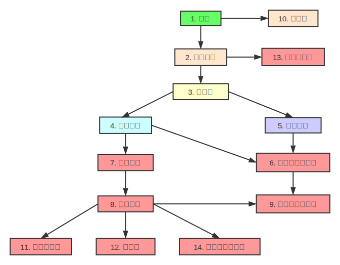
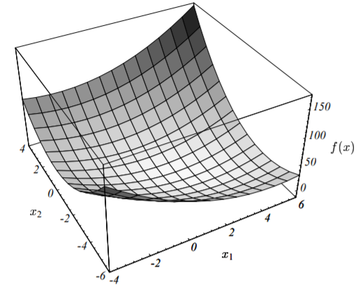
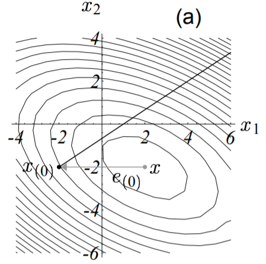
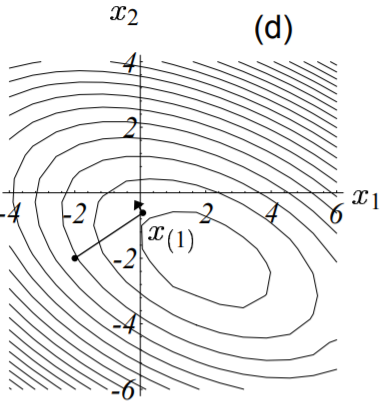
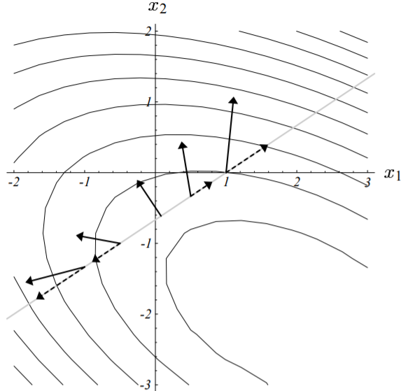
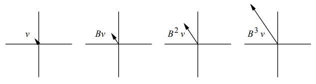
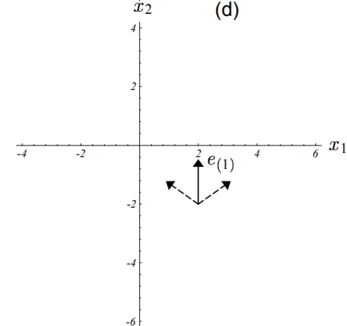
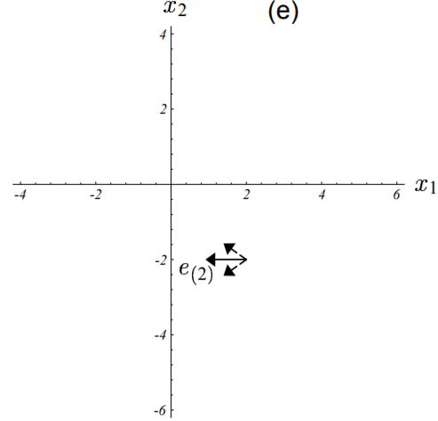

>Without the Agonizing Pain。 
——Edition $1 \frac{1}{4}$ · August 4, 1994 · Jonathan Richard Shewchuk

***

**版   &emsp;  权   &emsp;  申   &emsp;  明**

&emsp;&emsp;本文原始文章版权归**Jonathan Richard Shewchuk(jrs@cs.cmu.edu)**所有，中文翻译版版权归本博客主人所有。**英文原版及翻译版均可随意复制、分发，但请务必完整保留英文原版及本条版权声明信息。**

&emsp;&emsp;英文原版版权声明如下：
>&emsp;&emsp;&copy;1994 by Jonathan Richard Shewchuk. This article may be freely duplicated and distributed so long as no consideration is received in return, and this copyright notice remains intact.
&emsp;&emsp;This guide was created to help students learn Conjugate Gradient Methods as easily as possible. Please mail me (jrs@cs.cmu.edu) comments, corrections, and any intuitions I might have missed; some of these will be incorporated into a second edition. I am particularly interested in hearing about use of this guide for classroom teaching.

  

摘   &emsp;  要

&emsp;&emsp;共轭梯度法是稀疏线性方程组迭代求解法里面最优秀的方法。然而，大部分关于该算法的教科书即没有图示，讲解的也并不直观。因此，时至今日，仍然有许多这类教材的受害者在满是灰尘的图书馆角落里碎碎叨叨的胡诹一通。有鉴于此，几位睿智的精英们苦心孤诣的破解了前辈们留下的晦涩难懂的文字，并从几何角度深度的去阐释了这个算法。共轭梯度法本身也只是一个简单、优雅的复合方法。因此，睿智如你一定一学就会。

&emsp;&emsp;本文通过介绍[二次型（Quadratic Form）](https://en.wikipedia.org/wiki/Quadratic_form)，然后据此引出[最速下降（Steepest Descent）](https://en.wikipedia.org/wiki/Method_of_steepest_descent)、共轭方向以及共轭梯度。同时还对特征向量做了解释，并用于检验[雅可比方法（Jacobi Method）](https://en.wikipedia.org/wiki/Jacobi_method)、最速下降以及共轭梯度。此外，还包括预处理和非线性共轭梯度法的一些问题。为了使的本文易读易懂，我可谓是煞费苦心。本文廊括了66个图示，同时避免出现晦涩的词汇。同一个概念也分别用了几种不同的方式来解释，大多数等式都配有直观的解释说明。

关键字：共轭梯度法，预处理，收敛性分析，通俗讲义

 

&emsp;&emsp;对想要了解更多关于迭代算法的读者，我强烈推荐**William L.Briggs**所著的A Multigrid Tutorial 即《多重网格法》，这是我读过的最好的数学教材之一。

&emsp;&emsp;特别鸣谢**Omar Ghattas**，他给我讲了许多关于数值方法的知识，也给本文的初稿提出了许多宝贵的意见。同时还要感谢**James Epperson、David O'Hallaron、James Stichnoth、Nick Trefethen、Daniel Tunkelang**给本文提出的建议。

&emsp;&emsp;为了帮助读者可以跳跃式的阅读本文，下面整理了一张章节之间的依赖关系图，如下所示：

图 1-1　　本文章节关系图
 

&emsp;&emsp;本文适用于每一位像我一样喜欢大量使用图示说明同时工于计算的人。

**目 录**

### 1. 简介
&emsp;&emsp;当我决定学习共轭梯度法（简称**CG**，下同）时，读了有四种不同的关于该算法的描述文档，然而仍然分不清个子午卯酉，几乎是一无所获。这些文章大多数只是简单的“写”了下这个算法，然后对其特性做了推导证明。这些证明即没有任何直观的解释，也没有人提到CG算法的发明者灵感的来源。本文的诞生初衷正是源于本人在探索过程中所遭受的无数挫折，以期后人在学习CG算法的时候，学习的是一个全面、优雅的算法思想，而非一堆的公式证明。

&emsp;&emsp;CG是解决大型线性方程组问题最流行的迭代算法。它对于如下形式的问题特别有效：

$$
\textbf{A} \vec{x} = \vec{b}
\tag{1 - 1}
$$

&emsp;&emsp;式中，$\vec{x}$是我们要求解的未知向量，$\vec{b}$是一个已知的向量，$\textbf{A}$是一个对称的[正定](https://en.wikipedia.org/wiki/Positive-definite_matrix)方阵。如果你不记得什么是**正定矩阵**的话，没关系，我们在后面会对这个知识点进行回顾。上述等式应用的范围非常广，比如有限差分和有限元法求解偏微分方程、结构分析、电路分析以及数学作业。

&emsp;&emsp;像CG这样的迭代算法适合于稀疏矩阵。如果上式中的$\textbf{A}$是稠密的，最好的求解方法是先对$\textbf{A}$进行因式分解，然后用置换法回代求解。对稠密矩阵$\textbf{A}$进行因式分解所需要的时间大致与迭代求解方程的时间相同。一旦$\textbf{A}$分解完毕，即使存在多个不同的$b$的值，也能使用回代法快速的求解出方程组的解。

&emsp;&emsp;对比此稠密矩阵和一个规模更大但占用内存总量相同的稀疏矩阵，稀疏矩阵因式分解出来的三角阵的非零元素通常要比其原始矩阵的多。因式分解很多时候受限于内存大小将无法进行，并且耗时也非常久，即使是回代求解的过程也可能会比迭代求解法慢。换句话说，大多数的迭代算法在稀疏矩阵的求解上即节省内存、又高效快捷。

&emsp;&emsp;本文假定读者已经学过线性代数相关的课程，对矩阵乘法、线性无关有着深刻的理解（即使你现在对这些概念有些淡忘也没关系）。基于此，我方能为你清晰的构建CG知识体系的大厦。

### 2. 本文符号约定
&emsp;&emsp;我们从一些符号的定义和注释开始。
&emsp;&emsp;如未特别指出，本文符号及其表示内容如下：
- 1\. 大写字母表示矩阵；
- 2\. 小写字母表示向量；
- 3\. 希腊字母表示标量;
- 4\. $\vec{x}^T \cdot \vec{y} = \sum_{i=1}^{n} x_i y_i$表示两向量的内积，同时有$\vec{x}^T  \cdot \vec{y} = \vec{y}^T  \cdot \vec{x}$；
- 5\. $\vec{x}^T \cdot  \vec{y} = 0$表示向量$\vec x$与$\vec y$正交；
- 6\. $1 \times 1$的矩阵形如$\vec{x}^T \cdot  \vec{y}$以及$\vec{x}^T \textbf{A}  \vec{x}$视作标量。

&emsp;&emsp;假定$\textbf{A}$是一个$n \times n$的矩阵，$x、b$为向量（即$n \times 1$的矩阵），则有如下等式：

$$
\begin{bmatrix}
A_{11} & A_{12} & \cdots & A_{1n} \\
A_{21} & A_{22} & \cdots & A_{2n} \\
\vdots &        & \ddots & \vdots\\
A_{n1} & A_{n2} & \cdots & A_{nn}
\end{bmatrix}
\begin{bmatrix}
x_{11}\\
x_{21}\\
\vdots\\
x_{n1}
\end{bmatrix} = 
\begin{bmatrix}
b_{1}\\
b_{2}\\
\vdots\\
b_{n}
\end{bmatrix}
\tag{2 - 1}
$$

&emsp;&emsp;所谓**正定矩阵**，是指对任意非零向量$\vec x$，恒满足如下不等式的矩阵：

$$
\vec{x}^T \textbf{A} \vec{x} > 0
\tag{2 - 2}
$$

&emsp;&emsp;这个解释可能对你来说还是过于抽象，从这个式子很难直观的看出所谓的正定矩阵和非正定矩阵的区别。别灰心，后面我们看到正定矩阵是如何影响二次型的形状的时候，就能对这个概念有个直观的理解了。

&emsp;&emsp;最后，别忘了这两个重要特性：
- 1\. $\textbf{AB}^T = \textbf{B}^T \textbf{A}^T$;
- 2\. $\textbf{AB}^{-1} = \textbf{B}^{-1} \textbf{A}^{-1}$.

### 3. 二次型
&emsp;&emsp;所谓的**二次型**，是关于向量的二次数值型函数，形如：

$$
f(\vec{x}) = \frac{1}{2} \vec{x}^T \textbf{A} \vec{x} - \vec{b}^T \vec{x} + c
\tag{3 - 1}
$$

&emsp;&emsp;式中，$\textbf{A}$为一个矩阵，$\vec{x}、\vec{b}$为向量，$c$为一个常数。下面我先简单阐述一下，当$\textbf{A}$为**对称正定阵**的时候，$f(x)$的最小值由$\textbf{A} \vec{x} = \vec{b}$的解给出。

&emsp;&emsp;下面这个<a name="example">例子</a>将贯穿本文：

$$
\textbf{A} = 
\begin{bmatrix}
3 & 2 \\
2 & 6
\end{bmatrix}, \quad \quad
b = 
\begin{bmatrix}
2 \\
-8
\end{bmatrix}, \quad \quad
c = 0
\tag{3 - 2}
$$

&emsp;&emsp;方程$\textbf{A} \vec{x} = \vec{b}$对应的图形如下所示：

图 3-1　　二维线性方程组图示（方程组解为两直线交点）
 

&emsp;&emsp;更一般的，方程组的解$x$通常位于$n$维超平面（每一个是$n - 1$维）的交点处。就这个例子而言，解为：$\vec{x} = [2, \ -2]^T$。该例子对应的二次型的图像如下图所示：

图 3-2　　二次型$f(\vec{x})$的示意图（曲面的最低点对应方程$\textbf{A} \vec{x} = b$的解）
 

&emsp;&emsp;因为矩阵$\textbf{A}$是正定的，因此其对应的二次型函数$f(\vec{x})$的图形像一个抛物型的碗，后面我们我作更详细的介绍。

&emsp;&emsp;二次型$f(\vec{x})$的等高线图如下所示：

图 3-3　　二次型等高线示意图（每一条椭圆曲线对应一个固定的$f(\vec{x})$值）
 

&emsp;&emsp;二次型的梯度记作如下形式：

$$
f'(\vec{x}) = 
\begin{bmatrix}
\frac{\partial}{\partial_{x_1}} f(\vec{x}) \\
\frac{\partial}{\partial_{x_2}} f(\vec{x}) \\
\vdots \\
\frac{\partial}{\partial_{x_n}} f(\vec{x})
\end{bmatrix}
\tag{3 - 3}
$$

&emsp;&emsp;上述梯度实际上是[向量场](https://en.wikipedia.org/wiki/Vector_field)，对于任意给定的值$\vec{x}$，**梯度是使得二次型函数值$f(\vec{x})$增长最快的方向**。

	
点此查看译注

	
&emsp;&emsp;译者注：这里的梯度是二次型的梯度，和我们平时所说的[普通多元函数的梯度](https://en.wikipedia.org/wiki/Gradient)有所区别。

&emsp;&emsp;下图展示了上述二次型在给定式（3-2）的参数时的梯度向量：

图 3-4　　二次型梯度($f'(\vec{x})$)图（对每个$\vec{x}$，梯度指向$f(\vec{x})$增长最快速的方向）
 

&emsp;&emsp;结合图（3-2）、（3-4）可知，在图（3-2）的底部处，梯度为0，即图（3-4）中的小黑点。也就是说，将$f'(\vec {x})$设置为0并求解出对应的$\vec{x}$，我们就能求得二次型的最小值$f(\vec{x})_{min}$。

&emsp;&emsp;结合式（3-1）可以求出二次型的梯度为：

$$
f'(\vec{x}) = \frac{1}{2} \textbf{A}^T \vec{x} + \frac{1}{2} \textbf{A} \vec{x} - \vec{b}
\tag{3 - 4}
$$

	
点此查看译注

&emsp;&emsp;译者注：这里的求解过程原文没有给出，这个过程也并不简单，为了便于线性代数较差的读者理解，现给出详细的求解步骤，以供参考。
&emsp;&emsp;考察式（3-3）中的任意项：

$$
\begin{split}
\frac{\partial}{\partial_{x_i}} f(\vec{x}) &= \frac{ \partial{ (\frac{1}{2} \vec{x}^T \textbf{A} \vec{x} - \vec{b}^T \vec{x} + c) } } {\partial_{x_i}} \\
&= \frac{1}{2} \cdot \frac{\partial{ (\vec{x}^T \textbf{A} \vec{x}) }} {\partial_{x_i}}    -     \frac{\partial{ (\vec{b}^T \vec{x}) }} {\partial_{x_i}}     +     \underbrace{ \frac{\partial{c}} {\partial_{x_i}} }_{0}
\end{split}
\tag{3 - 4 - 1}
$$

&emsp;&emsp;先来看上式中的第一项：

$$
\begin{split}
\frac{\partial{ (\overbrace{ \underbrace{\vec{x}^T \textbf{A}}_{g(\vec x)} \underbrace{\vec{x}}_{h(\vec x)}   }^{f_1(\vec{x})}) }} {\partial_{x_i}} &=   \underbrace{ \frac{\partial{ (\vec{x}^T \textbf{A} ) }}  {\partial_{x_i}} }_{g'(\vec x)}  \cdot \vec{x} + \vec{x}^T \textbf{A} \cdot \underbrace{  \frac{\partial{\vec{x} }} {\partial_{x_i}} }_{h'(\vec x)}
\end{split}
\tag{3 - 4 - 2}
$$

&emsp;&emsp;上式转换的依据是把$f_1(\vec{x}) = \vec{x}^T \textbf{A} \vec{x}$看作一个复合函数，由两个函数$g(\vec{x}) = \vec{x}^T \textbf{A}, \ h(\vec{x}) = \vec{x}$复合而成，即$f_1(\vec{x}) = g(\vec{x})  \cdot  h(\vec{x})$，再由复合函数的求导法则即为上式。

&emsp;&emsp;上式右边仍然是由两部分组成，我们仍然一项一项来求解。对于第一项：

$$
\begin{split}
\frac{\partial{ (\vec{x}^T \textbf{A} ) }}  {\partial_{x_i}} &= \frac{\partial}{\partial_{x_i}}  
\Bigg (
[x_1, x_2, \cdots , x_n]
\times
\begin{bmatrix}
A_{11} & A_{12} & \cdots & A_{1n} \\
A_{21} & A_{22} & \cdots & A_{2n} \\
\vdots &        & \ddots & \vdots\\
A_{n1} & A_{n2} & \cdots & A_{nn}
\end{bmatrix}
\Bigg )
\\
&= \frac{\partial}{\partial_{x_i}} [ \underbrace{ x_1 \cdot A_{11} + \cdots + x_n \cdot A_{n1}, \ \cdots , \ x_1 \cdot A_{1n} + \cdots + x_n \cdot A_{nn} }_{1 \times n \quad vector} ]
\end{split}
\tag{3 - 4 - 3}
$$

&emsp;&emsp;再由向量对标量的求导法则（参见[这篇文章](https://flat2010.github.io/2017/05/12/%E6%A6%82%E5%BF%B5%E5%AE%9A%E4%B9%89%E6%9D%82%E8%AE%B0/)），上式最终变成：

$$
\begin{split}
\frac{\partial{ (\vec{x}^T \textbf{A} ) }}  {\partial_{x_i}} &= [ \frac{\partial}{\partial_{x_i}} (x_1 \cdot A_{11} + \cdots + x_n \cdot A_{n1} ), \ \cdots , \ \frac{\partial}{\partial_{x_i}}(x_1 \cdot A_{1n} + \cdots + x_n \cdot A_{nn}) ] \\
&= [A_{i1}, \ A_{i2}, \ \cdots, \ A_{in}]
\end{split}
\tag{3 - 4 - 4}
$$

&emsp;&emsp;于是第一项为：

$$
\begin{split}
\frac{\partial{ (\vec{x}^T \textbf{A} ) }}  {\partial_{x_i}}  \cdot \vec{x} &= [A_{i1}, \ A_{i2}, \ \cdots, \ A_{in}] \cdot  \vec{x} \\
&= A_{i1} \cdot x_1 + A_{i2} \cdot x_2 + \cdots + A_{in} \cdot x_n \\
&= \textbf{A}_{i, \*} \cdot \vec{x}
\end{split}
\tag{3 - 4 - 5}
$$

&emsp;&emsp;如上式中所示，我们用$\textbf{A}_{i, \*}$表示矩阵$\textbf{A}$的第$i$行的所有元素即$\textbf{A}$的第$i$个行向量。再来看式（3-4-2）的第二项，有：

$$
\begin{split}
\vec{x}^T \textbf{A} \cdot \frac{\partial{\vec{x}}} {\partial_{x_i}} &= \vec{x}^T \textbf{A} \cdot
[\frac{\partial{x_1}}{\partial{x_i}}, \ \cdots, \ \frac{\partial{x_n}}{\partial{x_i}}]^T \\
&= \vec{x}^T \textbf{A} \cdot [0, \ \cdots, \ \underbrace{1}_{  i^{th}  }, \ 0]^T \\
&= \vec{x}^T \bigg ( 
\begin{bmatrix}
A_{11} & A_{12} & \cdots & A_{1n} \\
A_{21} & A_{22} & \cdots & A_{2n} \\
\vdots &        & \ddots & \vdots\\
A_{n1} & A_{n2} & \cdots & A_{nn}
\end{bmatrix}
\times 
\begin{bmatrix}
0 \\
\vdots \\
\underbrace{1}_{  i^{th}  } \\
0
\end{bmatrix}
\bigg ) \\
&= [x_1, x_2, \cdots , x_n]   \times  
\begin{bmatrix}
A_{1i} \\
A_{2i} \\
\vdots \\
A_{ni}
\end{bmatrix} \\
&= x_1 \cdot A_{1i} + x_2 \cdot A_{2i} + \cdots + x_n \cdot A_{ni} \\
&= \textbf{A}_{\*, i}^T \cdot \vec{x}
\end{split}
\tag{3 - 4 - 6}
$$

&emsp;&emsp;如上式中所示，我们用$\textbf{A}_{\*, i}$表示矩阵$\textbf{A}$的第$i$列的所有元素即$\textbf{A}$的第$i$个列向量。于是有：

$$
\frac{\partial{ (\vec{x}^T \textbf{A}} \vec{x})} {\partial_{x_i}} = \textbf{A}_{i, \*} \cdot \vec{x} + \textbf{A}_{\*, i}^T \cdot \vec{x}
\tag{3 - 4 - 7}
$$

&emsp;&emsp;我们再来看式（3-4-1）的第二项，同样根据向量对标量的求导法则有：

$$
\begin{split}
\frac{\partial{ (\vec{b}^T \vec{x}) }} {\partial_{x_i}} &= \frac{\partial}{\partial_{x_i}}
\bigg(
[b_1, \ b_2, \ \cdots, b_n] \times
\begin{bmatrix}
x_1 \\
\vdots \\
\underbrace{x_i}_{  i^{th}  } \\
\vdots \\
x_n
\end{bmatrix} 
\bigg) \\
&= \frac{\partial (b_1 \cdot x_1 + \cdots + b_i \cdot x_i + \cdots + b_n \cdot x_n)} {\partial_{x_i}} \\
&= b_i
\end{split}
\tag{3 - 4 - 8}
$$

&emsp;&emsp;综合上式（3-4-7）、（3-4-8）有：

$$
\begin{split}
\frac{\partial}{\partial_{x_i}} f(\vec{x}) &= \frac{1}{2} (\textbf{A}_{i, \*} \cdot \vec{x} + \textbf{A}_{\*, i}^T \cdot \vec{x}) + b_i \\
&= \frac{1}{2} \textbf{A}_{i, \*} \cdot \vec{x} + \frac{1}{2} \textbf{A}_{\*, i}^T \cdot \vec{x} - b_i
\end{split}
\tag{3 - 4 - 9}
$$

&emsp;&emsp;于是(3-3)有：

$$
\begin{split}
f'(\vec{x}) &= 
\begin{bmatrix}
\frac{1}{2} \textbf{A}_{1, \*} \cdot \vec{x} + \frac{1}{2} \textbf{A}_{\*, 1}^T \cdot \vec{x} - b_1 \\
\vdots \\
\frac{1}{2} \textbf{A}_{i, \*} \cdot \vec{x} + \frac{1}{2} \textbf{A}_{\*, i}^T \cdot \vec{x} - b_i \\
\vdots \\
\frac{1}{2} \textbf{A}_{n, \*} \cdot \vec{x} + \frac{1}{2} \textbf{A}_{\*, n}^T \cdot \vec{x} - b_n
\end{bmatrix} \\
&= \frac{1}{2} \begin{bmatrix}
 \textbf{A}_{1, \*} \cdot \vec{x} \\
\vdots \\
\textbf{A}_{i, \*} \cdot \vec{x} \\
\vdots \\
\textbf{A}_{n, \*} \cdot \vec{x} 
\end{bmatrix}  + 
\frac{1}{2} \begin{bmatrix}
\textbf{A}_{\*, 1}^T \cdot \vec{x} \\
\vdots \\
\textbf{A}_{\*, i}^T \cdot \vec{x} \\
\vdots \\
\textbf{A}_{\*, n}^T \cdot \vec{x}
\end{bmatrix}  - 
\begin{bmatrix}
b_1 \\
\vdots \\
b_i \\
\vdots \\
b_n
\end{bmatrix} \\
&= \frac{1}{2} \begin{bmatrix}
 \textbf{A}_{1, \*} \\
\vdots \\
\textbf{A}_{i, \*} \\
\vdots \\
\textbf{A}_{n, \*} 
\end{bmatrix} \cdot \vec{x} + \frac{1}{2} \begin{bmatrix}
\textbf{A}_{\*, 1}^T \\
\vdots \\
\textbf{A}_{\*, i}^T \\
\vdots \\
\textbf{A}_{\*, n}^T
\end{bmatrix} \cdot \vec{x}  - \vec{b} \\
&= \frac{1}{2} \textbf{A} \vec{x} + \frac{1}{2} \textbf{A}^T \vec{x} - \vec{b}
\end{split}
\tag{3 - 4 - 10}
$$

&emsp;&emsp;求解完毕！

&emsp;&emsp;若$\textbf{A}$为对称阵即有$\textbf{A}^T = \textbf{A}$，则式（3-4）可进一步化简为：

$$
f'(\vec{x}) = \textbf{A}^T \vec{x} - \vec{b} = \textbf{A} \vec{x} - \vec{b}
\tag{3 - 5}
$$

&emsp;&emsp;再令上述梯度为0，即有我们要求解的线性方程（1-1）式。因此，通过上述的步骤，我们就把线性方程组$\textbf{A} \vec{x} = \vec{b}$的解和二次型函数图象的**驻点**联系起来了。如果$\textbf{A}$是对称正定阵，那么该驻点即为二次型函数$f(\vec{x})$的最小值点。因此，通过求解使得二次型函数$f(\vec{x})$值最小的点，我们就求出了线性方程组$\textbf{A} \vec{x} = \vec{b}$的解。

&emsp;&emsp;如果矩阵$\textbf{A}$为非对称阵，由于$\frac{1}{2}(\textbf{A}^T + \textbf{A})$为对称阵，因此(CG算法)让然能够求解出式（3-4）的解。

&emsp;&emsp;那么为何对称正定阵会有如此优良的特性呢？我们下面就来揭晓这个答案。考虑二次型函数$f(\vec{x})$曲面上的任意点$\vec{p}$以及最小值点$\vec{x} = \textbf{A}^{-1} \vec{b}$。将两个点$\vec{p}、\vec{x}$分别代入式（3-1），然后作差有如下结论：

$$
f(\vec{p}) = f(\vec{x}) + \frac{1}{2} (\vec{p} - \vec{x})^T \textbf{A} (\vec{p} - \vec{x}) 
\tag{3 - 5}
$$

&emsp;&emsp;关于上述结论困的证明，英文原版在文档的附录C1中给出了详细步骤，这里贴出我的证明思路，以供参考。

&emsp;&emsp;将两个点带入式（3-1），并且结合$\textbf{A} \vec{x} = \vec{b}$以及$\textbf{A}^T = \textbf{A}$，然后作差，有：

$$
\begin{split}
f(\vec{p}) - f(\vec{x}) &= (\frac{1}{2} \vec{p}^T \textbf{A} \vec{p} - \vec{b}^T \vec{x} + c) - (\frac{1}{2} \vec{x}^T \textbf{A} \vec{x} - \vec{b}^T \vec{x} + c)  \\
&= \frac{1}{2} \vec{p}^T \textbf{A} \vec{p} - \frac{1}{2} \vec{x}^T \textbf{A} \vec{x} - (\textbf{A} \vec{x})^T \vec{p} -  (\textbf{A} \vec{x})^T \vec{x} \\
&= \frac{1}{2} \vec{p}^T \textbf{A} \vec{p} - \frac{1}{2} \vec{x}^T \textbf{A} \vec{x} - \vec{x}^T \textbf{A} \vec{p} -  \vec{x}^T \textbf{A} \vec{x} \\
&= \frac{1}{2} \vec{p}^T \textbf{A} \vec{p} + \frac{1}{2} \vec{x}^T \textbf{A} \vec{x} - \vec{x}^T \textbf{A} \vec{p}
\end{split}
\tag{3 - 5 - 1}
$$

&emsp;&emsp;要进一步化简该式，还需要用到一个性质：若有矩阵$\textbf{A}^T = B$，且$\textbf{A}$为对称阵，则必有$\textbf{A} = \textbf{B}$。因为$(\vec{x}^T \textbf{A} \vec{p})^T = \vec{p} \textbf{A} \vec{x} $且$\vec{x}^T \textbf{A} \vec{p}$为标量（可视作$1 \times 1$的对称阵），所以必然有：$\vec{x}^T \textbf{A} \vec{p} = \vec{p} \textbf{A} \vec{x} $，于是上式可变成：

$$
\begin{split}
f(\vec{p}) - f(\vec{x}) &= \frac{1}{2} \vec{p}^T \textbf{A} \vec{p} + \frac{1}{2} \vec{x}^T \textbf{A} \vec{x} - \frac{1}{2} \vec{x}^T \textbf{A} \vec{p} - \frac{1}{2} \vec{x}^T \textbf{A} \vec{p} \\
&= \frac{1}{2} \vec{p}^T \textbf{A} \vec{p} + \frac{1}{2} \vec{x}^T \textbf{A} \vec{x} - \frac{1}{2} \vec{x}^T \textbf{A} \vec{p} - \frac{1}{2} \vec{p} \textbf{A} \vec{x} \\
&= \frac{1}{2}(\vec{p}^T \textbf{A} \vec{p} - \vec{p} \textbf{A} \vec{x}) + \frac{1}{2}(\vec{x}^T \textbf{A} \vec{x} - \vec{x}^T \textbf{A} \vec{p}) \\
&= \frac{1}{2} \vec{p}^T \textbf{A} (\vec{p} - \vec{x}) + \frac{1}{2} \vec{x}^T \textbf{A} (\vec{x} - \vec{p}) \\
&= \frac{1}{2} (\vec{p}^T \textbf{A} - \vec{x}^T \textbf{A}) (\vec{p} - \vec{x}) \\
&= \frac{1}{2} (\vec{p}^T - \vec{x}^T) \textbf{A} (\vec{p} - \vec{x}) \\
&= \frac{1}{2} (\vec{p} - \vec{x})^T \textbf{A} (\vec{p} - \vec{x})
\end{split}
\tag{3 - 5 - 2}
$$

&emsp;&emsp;证毕！

&emsp;&emsp;若$\textbf{A}$为正定阵，则由式（2-2）可知，若$\vec{p} \neq \vec{x}$，则上式（3-5）中的第二项恒为正，即有：

$$
\frac{1}{2} (\vec{p} - \vec{x})^T \textbf{A} (\vec{p} - \vec{x}) > 0, \ \vec{p} \neq \vec{x}
\tag{3 - 6}
$$

&emsp;&emsp;所以进一步有：$f(\vec{p}) > f(\vec{x}), \ \vec{p} \neq \vec{x}$。即点$\vec{x}$为二次型函数$f(\vec{x})$的全局最小值点。这就解释了为何对称正定阵会有如此优良的特性。

&emsp;&emsp;因此，**对于正定阵最直观的理解方式就是它的二次型函数的图形是一个开口向上的抛物面。**如果矩阵$\textbf{A}$非正定，那么其全局最小值点就可能不止一个。

&emsp;&emsp;如果$\textbf{A}$为负定矩阵，则其图形刚好为其对应的正定阵抛物面上下翻转后的图形。如果$\textbf{A}$为奇异矩阵（此时线性方程组解不唯一），解集为一条直线或超平面。如果$\textbf{A}$不属于上面情况中的任何一种，则其解$\vec{x}$为一个[鞍点(Saddle Point)](https://en.wikipedia.org/wiki/Saddle_point)，此时无论是最速下降法还是共轭梯度法都无法求解出来。

&emsp;&emsp;下图展示了上面所说的这些情况的二次型函数的图形。注意，函数中$\vec{b}、c$的取值仅仅影响图形最小值点的位置，但不会影响图形的状。

图 3-5　　不同情况下的二次型函数图 (a) 正定矩阵的二次型函数图形。 (b) 负定矩阵二次函数图。   (c) 正定奇异阵的函数图，过谷底的一条直线为解集。(d) [不定矩阵](http://mathworld.wolfram.com/IndefiniteMatrix.html)函数图  对于三维及以上的情况，奇异矩阵也可能会存在鞍点。
 

&emsp;&emsp;我们为什么要把解线性方程组的问题转换成一个貌似更棘手的问题呢？原因在于，我们研究的最速下降法和共轭梯度法均是由图（3-2）所示的求最小化的问题创造出来的，它远比图（3-1）所示的超平面相交问题更直观易懂。

### 4. 最速下降法
&emsp;&emsp;在最速下降法中，我们的目标是从任意一个点$\vec{ x_{(0)} }$开始，下降到抛物面的底部。中间会经过一系列的点$\vec{x_{(1)}}、\vec{x_{(2)}}、\cdots $，直到足够接近真正的最小值点$\vec{x}$。

&emsp;&emsp;之所以称这种方法为最速下降法，是因为每当我们前进一步时，选择的方向必然是使得函数值$f(\vec{x})$减少的最多的方向，也即梯度$f'(\vec{x_{(i)}})$的反方向。根据式（3-5），前进的方向为$-f'(\vec{x_{(i)}}) = \vec{b} - \textbf{A} \vec{x_{(i)}}$。

&emsp;&emsp;为了方便理解后文，有些定义可能需要读者铭记在心，分别记：
- 1\. $\vec{e_{(i)}} = \vec{x_{(i)}} - \vec{x}$，称**误差向量**，表示第$i$步时，离**最小值点($\vec{x}$)**的距离；
- 2\. $\vec{r_{(i)}} = \vec{b} - \textbf{A} \vec{x_{(i)}}$，称**残差向量**，表示第$i$步时，离**真实值($\vec{b}$)**的距离；

&emsp;&emsp;有上述两个定义还可以推出以下结论：

$$
\begin{split}
\begin{cases}
\vec{r_{(i)}} &= -\textbf{A} \vec{e_{(i)}} \\
\vec{r_{(i)}} &= -f'(\vec{x_{(i)}})
\end{cases}
\end{split}
\tag{4 - 1}
$$

&emsp;&emsp;因此，**我们既可以把残差向量视为误差向量$\vec{e_{(i)}}$经过矩阵$\textbf{A}$变换到与$\vec{b}$相同的向量空间后的结果，又可以把残差向量看作最速下降的方向。**对于非线性问题（我们将在第14章讨论），就只能把残差向量看作最速下降的方向了。因此，建议读者在看到“残差(向量)”这个词时，脑海里一定要跟“最快速的下降方向”关联起来。

&emsp;&emsp;以实际例子来说，假定我们从点$\vec{x_{(0)}} = [-2, \ -2]^T$开始。迈出第一步时，根据最速下降方向（**梯度反方向**，下图中粗实线），我们将落在下图所示的实线上的某个点处。

图 4-1　　最速下降第一步示意图
 

&emsp;&emsp;换句话说，我们将选择一个点，其函数值满足：

$$
\vec{x_{(1)}} = \vec{x_{(0)}} + \alpha \vec{r_{(0)}}
\tag{4 - 2}
$$

	
点此查看译注

&emsp;&emsp;&emsp;译者注：再次强调，看到$\vec{r_{(i)}}$就要想到最速下降方向，这样就容易理解了。

&emsp;&emsp;那么问题又来了，方向有了，步长呢？也即$\alpha$应该取什么值才能使得迈出的下一步的函数值在所有可能的步长中最小呢？

&emsp;&emsp;[线性搜索](https://en.wikipedia.org/wiki/Linear_search)就是用来解决这类问题的，它将沿着指定的直线，寻找到使得函数值$f(\vec{x_{(i)}} + \alpha \vec{r_{(i)}})$最小的$\alpha$。下图展示了这个搜索过程：
- 1\. 先过这条直线作与抛物面垂直的一个平面（图(b)）;
- 2\. 绘制出该平面与抛物面相交的抛物线（图(c)）;
- 3\. 抛物线底部点即对应于函数值最小值点，可据此求出对应的步长即为$\alpha$的值。

  

图 4-3　　线性搜索图示(b)、(c)
 

&emsp;&emsp;由微积分的知识我们知道，当且仅当方向导数$\frac{d}{d_\alpha} f(\vec{x_{(1)}}) = 0$的时候，$\alpha$使得$f$最小。再由链式求导法则有：

$$
\begin{split}
\frac{d}{d_\alpha} f(\vec{x_{(1)}}) &= f'(\vec{x_{(1)}})^T \frac{d}{d_\alpha} \vec{x_{(1)}} \\
&= f'(\vec{x_{(1)}})^T \cdot \vec{r_{(0)}} \\
&= -\vec{r_{(1)}}^T \cdot \vec{r_{(0)}}
\end{split}
\tag{4 - 3}
$$

	
点此查看译注

&emsp;&emsp;&emsp;译者注：注意上式中的$f'(\vec{x_{(1)}})^T$可不是笔误，$f'(\vec{x})$是一个$n \times 1$的向量，其转置则为$1 \times n$的向量。之所以这里会有转置，是因为函数的**梯度（向量）**是函数对每一个变量（标量）的偏导组成的向量。而函数的**方向导数（标量）**，则是函数对向量的导数。举例来说，有二元函数$f(x_1, x_2)$，则其梯度和沿着任意方向$\vec{d} = [\alpha, \ \beta]^T$方向导数分别为：

$$
\begin{split}
\begin{cases}
f_{grad} &= [\frac{\partial f}{\partial x_1}, \ \frac{\partial f}{\partial x_2}]^T \\
f_{dir-der} &= \frac{\partial f}{\partial \alpha} \alpha + \ \frac{\partial f}{\partial \beta} \beta  = [\frac{\partial f}{\partial \alpha}, \ \frac{\partial f}{\partial \beta}] \times [\alpha, \ \beta]^T = f_{grad}^T \cdot \vec{d} \\
\end{cases}
\end{split}
\tag{4 - 3 - 1}
$$

&emsp;&emsp;也就是说，方向导数等于梯度的转置与方向向量的内积。

&emsp;&emsp;令上式(4-3)等于0，可知，**当且仅当$\alpha$的取值使得两次残差向量（反向梯度向量）相互正交的时候，函数值最小**，如下图所示：

图 4-4　　残差向量正交示意图 抛物面最底部点的梯度/残差向量与前一步的梯度/残差向量正交。
 

&emsp;&emsp;我们之所以要求这些向量在函数最小值处严格正交，更为直观的解释如下图所示：

图 4-5　　梯度向量投影示意图示意图
 

&emsp;&emsp;图中展示了线性搜索直线上不同点（不同的点对应不同的移动步长）处的梯度向量（实线箭头）及其在该直线上的投影（虚线箭头）。梯度向量表示函数值$f$增长最快的方向，而其在搜索直线的投影则表示了其沿着搜索直线的增长的速度（大小）。由上图可以看出，在搜索直线上，当且仅当梯度方向与搜索直线正交的时候，函数值增加的最少。这个点对应的就是图（4-3(c)）的最小值点。此时投影的大小为0。

&emsp;&emsp;下面就来求$\alpha$的具体表达式：

$$
\begin{split}
\vec{r_{(1)}}^T \cdot \vec{r_{(0)}} &= (\vec{b} - \textbf{A} \vec{x_{(1)}})^T \cdot \vec{r_{(0)}} \\
&= [\vec{b} - \textbf{A} (\vec{x_{(0)}} + \alpha \vec{r_{(0)}})]^T \cdot \vec{r_{(0)}} \\
&= (\vec{b} - \textbf{A} \vec{x_{(0)}} + \alpha \textbf{A} \vec{r_{(0)}})^T \cdot \vec{r_{(0)}} \\
&= (\vec{b} - \textbf{A} \vec{x_{(0)}})^T \cdot \vec{r_{(0)}} - \alpha (\textbf{A} \vec{r_{(0)}})^T \cdot \vec{r_{(0)}} \\
&= \vec{r_{(0)}}^T \cdot \vec{r_{(0)}} - \alpha \cdot \vec{r_{(0)}}^T \textbf{A} \cdot \vec{r_{(0)}}
\end{split}
\tag{4 - 4}
$$

&emsp;&emsp;因为上式等于0，所以可解得：$\alpha = \frac{\vec{r_{(0)}}^T \cdot \vec{r_{(0)}}}   {\vec{r_{(0)}}^T \textbf{A} \cdot \vec{r_{(0)}}}$。

&emsp;&emsp;综上所述，最速下降的核心思想其实就两个，一个是移动的方向，另一个是移动的步长。**移动的方向通过梯度向量来确定，确保每次移动函数值都是在减小的。移动的步长则是通过移动前后梯度向量的正交性来确定的，确保每次移动函数值减小量是最大的**，即：
- 1\. 方向：$\vec{r_{(i)}} = \vec{b} - \textbf{A} \vec{x_{(i)}}$；
- 2\. 步长：$\alpha_{(i)} = \frac{\vec{r_{(i)}}^T \cdot \vec{r_{(i)}}}   {\vec{r_{(i)}}^T \textbf{A} \cdot \vec{r_{(i)}}}$；

&emsp;&emsp;另外，移动后的点的计算公式为：

$$
\vec{x_{(i + 1)}} = \vec{x_{(i)}} + \alpha_{(i)} \vec{r_{(i)}}
\tag{4 - 5}
$$

&emsp;&emsp;下图展示了我们上面举的实例的下降过程，其收敛路径之所以呈现出“Z”字形，就是因为我们上面证明出来的梯度的正交性。

&emsp;&emsp;在迭代计算时，据方向和步长的计算公式可以看出，每轮迭代都需要进行两次矩阵-向量乘法计算，因此整个算法的计算效率就由这两次矩阵-向量乘法运算决定。幸运的是，通过变换我们可以消除其中的一个，只保留一个矩阵·向量运算。变换方法就是，将式（4-5）等式两边同时左乘一个矩阵$-\textbf{A}$，再同时加上$\vec{b}$，于是有：

$$
\vec{r_{(i + 1)}} = \vec{r_{(i)}} - \alpha_{(i)} \textbf{A} \vec{r_{(i)}}
\tag{4 - 6}
$$

&emsp;&emsp;由上式可以看出，在迭代计算方向和步长时，虽然仍然需要计算一次$\vec{r_{(0)}}$，但不再需要计算中间结果$\vec{x_{(i + 1)}}$，每轮迭代只有在计算$\alpha_{(i)}$的时候会进行一次矩阵·向量计算（$\textbf{A} \vec{r_{(i)}}$同时出现在了$\alpha_{(i)}、\vec{r_{(i + 1)}}​$的公式中，只需要计算一次即可）。也即每轮迭代，只需要按照如下公式计算：

$$
\begin{split}
\begin{cases}
\alpha_{(i)} &= \frac{\vec{r_{(i)}}^T \cdot \vec{r_{(i)}}}   {\vec{r_{(i)}}^T \textbf{A} \cdot \vec{r_{(i)}}} \\
\vec{r_{(i + 1)}} &= \vec{r_{(i)}} - \alpha_{(i)} \textbf{A} \vec{r_{(i)}}
\end{cases}
\end{split}
\tag{4 - 7}
$$

&emsp;&emsp;上述递归计算的方式有个缺点，在计算式（4-6）的时候，完全不依赖于$\vec{x_{(i)}}$，这样由于迭代过程中浮点舍入误差的累积，最终只会收敛到最小值$\vec{x}$的附近，而不是最小值点本身。要避免这个问题也非常简单，定期使用$\vec{x_{(i)}}$计算残差向量$\vec{r_{(i)}}$。

&emsp;&emsp;讲完最速下降法的核心思想，在分析该算法的收敛性之前，我必须岔开主题先讲点其它的，以便确保读者对于特征向量有着深刻的理解。

### 5. 以特征向量和特征值的视角思考
&emsp;&emsp;我在上完第一节的线性代数课之后，就已经对特征值和特征向量了如指掌了。如果你的导师跟我导师一样，那么你现在仍然能回忆起解决问题的本征窍门(eigendoohickeys)，但你却从未真正理解到它们。不幸的是，如果对它们没有一个直观的理解，那你也无法理解CG算法。当然，如果你已经在这方面禀赋非凡，请自动跳过本章节。

&emsp;&emsp;特征向量主要用作分析工具，因此，作为算法的一部分，最速下降法以及CG算法都不会计算任何的特征向量。

#### 5.1 特征尝试
&emsp;&emsp;矩阵$\textbf{B}$的特征向量$\vec{\upsilon}$，是一个非零并且当矩阵$\textbf{B}$作用于它时其自身不会发生旋转的向量（作用后指向反方向这种情况除外）。特征向量$\vec{\upsilon}$可能会发生长度的改变或者变成反向向量，但不会发生侧向旋转。换句话说，存在常数$\lambda$，使得：$\textbf{B} \vec{\upsilon} = \lambda \vec{\upsilon}$，此常数$\lambda$即为（对应于特征向量$\vec{\upsilon}$的）矩阵$\textbf{B}$的特征值。对任意常数$\alpha$，向量$\alpha \vec{\upsilon}$也是特征值为$\lambda$的特征向量。因我们有：$\textbf{B}(\alpha \vec{\upsilon}) = \alpha \textbf{B} \vec{\upsilon} = \lambda \alpha \vec{\upsilon}$。换句话说，对一个特征向量进行缩放，并不会改变其特征向量的本质。

&emsp;&emsp;讲了半天，我们为什么要关心这个呢？原因就在于，迭代算法中通常会一次又一次的将一个矩阵$\textbf{B}$作用于一个向量。当矩阵$\textbf{B}$循环往复的作用于一个特征向量$\vec{\upsilon} $时，会有两种情况发生。

&emsp;&emsp;情况一：若$|\lambda| < 1$即特征值的绝对值小于1，则据等式$\textbf{B}^i \vec{\upsilon} = \lambda^i \vec{\upsilon} $可知，在$i \rightarrow + \infty$的过程中，$\textbf{B}^i \vec{\upsilon}$也将逐渐收缩减小，如下图所示：

图 5-1　　特征值绝对值小于1时迭代示意图 图中$\vec{\upsilon}$为矩阵$\textbf{B}$的特征值为-0.5的特征向量，$i$增加，$\textbf{B}^i \vec{\upsilon}$逐渐收缩至0。
 

&emsp;&emsp;情况二：若$|\lambda| > 1$即特征值的绝对值大于1，则据等式$\textbf{B}^i \vec{\upsilon} = \lambda^i \vec{\upsilon} $可知，在$i \rightarrow + \infty$的过程中，$\textbf{B}^i \vec{\upsilon}$也将逐渐伸张扩大，如下图所示：

图 5-2　　特征值绝对值大于1时迭代示意图 图中$\vec{\upsilon}$为矩阵$\textbf{B}$的特征值为2的特征向量，$i$增加，$\textbf{B}^i \vec{\upsilon}$逐渐增长至$\infty$。
 

&emsp;&emsp;若$\textbf{B}$为对称阵（通常情况下它都不是），那么矩阵$\textbf{B}$必然存在一组$n$个线性独立的特征向量，记作$\vec{\upsilon_1}, \ \vec{\upsilon_2}, \cdots, \ \vec{\upsilon_n}$。由于特征向量可以被任意非零常数缩放，因此这组特征向量并不唯一。与此同时，每一个特征向量有一个特征值与其对应，记作$\lambda_1, \ \lambda_2, \ \cdots, \ \lambda_n$。对于一个给定的矩阵，这些特征值是唯一的。特征值之间也许相同，也许不同。举例来说，单位阵$\textbf{I}$的特征值全为1，而其所有非零向量均为特征向量。

&emsp;&emsp;上面我们讨论了矩阵作用于特征向量的情况，那当矩阵$\textbf{B}$作用于一个非特征向量的普通向量时又会是什么样呢？理解线性代数的一个非常重要的技巧（当然也是本节要传授的技巧）就是，把一个行为未知的向量看作其它行为已知的向量的合成。考虑由一组特征向量${\vec{\upsilon_i}}$为基向量所构成的实数空间$\mathbb{R}^n$（因对称阵$\textbf{B}$必然存在$n$个线性无关的特征向量），任意$n$维向量都能由这些特征向量（基向量）表示，又由于矩阵·向量乘法满足分配率，因此我们可以通过单独分析矩阵$\textbf{B}$对每个特征向量的作用来分析矩阵$\textbf{B}$对整个向量的影响。

&emsp;&emsp;如下图所示，向量$\vec{x}$由两个特征向量$\vec{\upsilon_1}, \ \vec{\upsilon_2}$合成，即有$\vec{x} = \vec{\upsilon_1} + \vec{\upsilon_2}$。矩阵$\textbf{B}$作用于向量$\vec{x}$的效果等价于矩阵$\textbf{B}$分别作用于这两个特征向量的结果的合成。迭代应用这个结论我们有：$\textbf{B}^i \vec{x} = \textbf{B}^i {\vec{\upsilon_1}} + \textbf{B}^i {\vec{\upsilon_2}} = \lambda_1^i {\vec{\upsilon_1}} + \lambda_2^i {\vec{\upsilon_2}}$。

	
点此查看译注

&emsp;&emsp;&emsp;译者注：若$\vec{x} = k_1 \vec{\upsilon_1} + k_2 \vec{\upsilon_2}$，则有：
$$
\begin{split}
\textbf{B}^i \vec{x} &= \textbf{B}^i (k_1 \vec{\upsilon_1} + k_2 \vec{\upsilon_2}) \\
&= k_1 \textbf{B}^i \vec{\upsilon_1} + k_2 \textbf{B}^i \vec{\upsilon_2} \\
&= k_1 \lambda_1^i \vec{\upsilon_1} + k_2 \lambda_2^i \vec{\upsilon_2}
\end{split}
\tag{5 - 1 - 1}
$$

&emsp;&emsp;如果所有特征值的绝对值均小于1，由之前的结论可知，$\textbf{B}^i \vec{x}$最终依然会收敛至0（构成$\vec{x}$的特征向量由于$\textbf{B}$的迭代作用收敛至0）。而只要任意一个特征值的绝对值大于1，那么$\textbf{B}^T \vec{x}$长度将会发散至无穷大。这就是为何数值分析人员高度重视[矩阵谱半径](https://en.wikipedia.org/wiki/Spectral_radius)的原因。

图 5-3　　矩阵作用于任意向量的迭代示意图 图中任意向量$\vec{x}$（实线箭头）可视作两特征向量$\vec{\upsilon_1}、\vec{\upsilon_2}$（虚线箭头）的线性组合。其对应的特征值分别为$\lambda_1 = 0.7、\lambda_2 = -2$。当矩阵$\textbf{B}$迭代作用于向量$\vec{x}$时，其中的一个特征向量（特征值小于1那个）长度逐渐收敛至0，另一个则逐渐发散至$\infty$，因此$\textbf{B}^T \vec{x}$也是发散的。
 

&emsp;&emsp;对给定矩阵$\textbf{B}$，其谱半径定义为：

$$
\rho(\textbf{B}) = max|\lambda_i|, \quad \lambda_i为\textbf{B}的特征向量
\tag{5 - 1}
$$

	
点此查看译注

&emsp;&emsp;&emsp;译者注：原文中只讨论了迭代过程中$\textbf{B}^T \vec{x}$长度的变化情况，并没有明确的对其方向的变化进行探讨（虽然细心的读者能从上图（5-3）中看出来），会对读者理解后面的有些章节造成困扰。因此这里我们专门讨论下方向的变化情况。
&emsp;&emsp;由$\textbf{B}^i \vec{\upsilon} = \lambda^i \vec{\upsilon}$可知：
- 1\. 若$\lambda > 0$，即特征值为正，则恒有$\lambda^i > 0$。所以在迭代过程中，该特征值对应的特征向量方向的分量只会发生长度的变化，而不会有方向的改变，如上图（5-3）中的$\vec{\upsilon_1}$方向分量；
- 2\. 若$\lambda < 0$，即特征值为负，则当$i = 2k + 1, \  k=0, 1, 2, \cdots$即迭代奇数次时，$\lambda^i < 0$。此时该特征值对应的特征向量方向的分量不仅长度会发生改变，方向还会旋转180度。而当$i = 2k, \  k=0, 1, 2, \cdots$即迭代偶数次时，$\lambda^i > 0$，方向保持不变。在迭代过程中其表现就是，方向一正一反，不断的发生翻转，如上图（5-3）中的$\vec{\upsilon_2}$方向分量。

&emsp;&emsp;即一个矩阵$\textbf{B}$的谱半径为其特征值绝对值的最大值。如果我们希望$\textbf{B}^i \vec{x}$能够快速的收敛至0，那么谱半径$\rho(\textbf{B})$必须小于1，并且越小越好。

&emsp;&emsp;**即谱半径的大小直接决定了收敛速度的快慢！**

	
点此查看译注

&emsp;&emsp;&emsp;译者注：这里原文档5.1小节中有两处小错误：

> If one of the eigenvalues has magnitude greater than one, x will diverge to infinity.
> If we want x to converge to zero quickly, $\rho(B)$ should be less than one, and preferably as small as possible.

&emsp;&emsp;这里的`x`应该是$\textbf{B}^i \vec{x}$，`x`是给定的向量，不会发生改变。

&emsp;&emsp;上面我们讲的是实对称阵，由于实对称阵必然存在$n$个线性无关的特征向量，因此上述结论对实对称阵而言是恒成立的。那对于非实对称阵呢，情况又会如何？

&emsp;&emsp;实际上对大多数非实对称阵而言，上述结论也成立（存在$n$个线性无关的特征向量）。但是这里还有必要提一下的是，有一类非实对称阵，它们不具备$n$个线性独立的特征向量，这类矩阵我们称之为[退化矩阵(defective)](https://en.wikipedia.org/wiki/Defective_matrix)。光从这个名字你就可以看出那些因研究该类矩阵而受挫的线性代数学家们对它当之无愧的抵触。

&emsp;&emsp;关于这类矩阵的细节问题由于太过复杂因此无法在本文中详述，请自行参考相关资料。但是这类矩阵的特性可以通过[广义特征向量(generalized eigenvector)](https://en.wikipedia.org/wiki/Generalized_eigenvector)和广义特征值(generalized eigenvalue)来分析。对于退化矩阵，当且仅当其所有广义特征值的绝对值均小于1时，$\textbf{B}^i \vec{x}$方能收敛到0。要证明这点非常难，感兴趣可参考相关资料。

&emsp;&emsp;此外，还需要读者记住一条非常有用的结论：**正定阵的特征值必然全为正数**。

&emsp;&emsp;这点我们可利用特征值的定义来证明。据特征值定义有：$\textbf{B} \vec{\upsilon} = \lambda \vec{\upsilon} $，两边同时乘以特征向量的转置有：$\vec{\upsilon}^T \textbf{B} \vec{\upsilon} = \lambda \vec{\upsilon}^T \vec{\upsilon} $，又因为矩阵$\textbf{B}$为正定阵，因此由正定阵的定义有：

$$
\lambda \vec{\upsilon}^T \vec{\upsilon} = \vec{\upsilon}^T \textbf{B} \vec{\upsilon} > 0
\tag{5 - 2}
$$

&emsp;&emsp;因此必然有$\lambda > 0$（$\vec{\upsilon}^T \vec{\upsilon} = (||\vec{\upsilon}||_2)^2 > 0$），即正定阵的特征值必然全为正值。

#### 5.2 Jacobi迭代
&emsp;&emsp;显然，一个必然收敛到0的算法还不足以让你呼朋引伴。我们来介绍一个解决线性方程组$\textbf{A} \vec{x} = \vec{b}$更有用的算法：即[雅可比法](https://en.wikipedia.org/wiki/Jacobi_method)。在这个算法中，我们把矩阵$\textbf{A}$拆成两部分：
- 1\. 对角阵$\textbf{D}$，其对角线上的元素即为矩阵$\textbf{A}$对角线上的元素，非对角线上的元素则全为0；
- 2\. 矩阵$\textbf{E}$，其对角线上的元素全为0，而其非对角线上的元素即为矩阵$\textbf{A}$非对角线上的元素。

&emsp;&emsp;由上可知：$\textbf{A} = \textbf{D} + \textbf{E}$，并由此引出我们的雅可比法：

$$
\begin{split}
\because \qquad \qquad \qquad \textbf{A} \vec{x} &= \vec{b} \\
\\
\therefore \qquad \qquad (\textbf{D} + \textbf{E}) \vec{x} &= \vec{b} \\
\textbf{D} \vec{x} + \textbf{E} \vec{x} &=  \vec{b}\\
\textbf{D}^{-1} (\textbf{D} \vec{x} + \textbf{E} \vec{x}) &= \textbf{D}^{-1} \vec{b}\\
\vec{x} + \textbf{D}^{-1} \textbf{E} \vec{x} &=  \textbf{D}^{-1} \vec{b}\\ 
\vec{x} &= \underbrace{-\textbf{D}^{-1} \textbf{E}}_{\textbf{B}} \vec{x} +  \underbrace{\textbf{D}^{-1} \vec{b}}_{\vec{z}} \\
\vec{x} &= \textbf{B} \vec{x}  + \vec{z}
\end{split}
\tag{5 - 3}
$$

&emsp;&emsp;如上所示，分别记：$\textbf{B} = -\textbf{D}^{-1} \textbf{E}, \quad \vec{z} = \textbf{D}^{-1} \vec{b}$。由于$\textbf{D}$为对角阵，因此其逆矩阵非常容易求解。上述恒等式可以通过如下的递归方程转换为迭代算法：

$$
\vec{x_{(i + 1)}} = \textbf{B} \vec{x_{(i)}}  + \vec{z}
\tag{5 - 4}
$$

&emsp;&emsp;给定一个初始向量$\vec{x_{(0)}}$，利用上述递归方程就可以计算出一系列的向量。我们的期望是每一轮迭代新生成的向量都要比上一轮迭代生成的向量更接近于真实解$\vec{x}$。真实解$\vec{x}$我们称之为等式（5-4）的[稳态点/驻点(stationary point)](https://en.wikipedia.org/wiki/Stationary_point)，因为当$\vec{x_{(i)}} = \vec{x}$时，则必然有$\vec{x_{(i + 1)}} = \vec{x}$。

	
点此查看译注

&emsp;&emsp;&emsp;译者注：这里额外做些说明更容易理解。利用式（5-4）进行迭代时，如何判断我们已经找到了真实解了呢（即何时停止迭代）？因为只有真实解才必然满足上式的等号（注意，在迭代的时候，上式的等号应该理解为“赋值”操作。在判断解的时候，要理解为“等于”）。也就是说，迭代前后的值不再发生变化，此时的向量值即为真实解。

&emsp;&emsp;上面这个推导过程可能看起来比较随意（实际上也确实很随意）。我们可以用任意数量的关于$\vec{x}$的恒等式来代替上式。通过对矩阵$\textbf{A}$进行不同的拆解，也即选取不同的$\textbf{D}$和$\textbf{E}$，我们可以得到[高斯·赛德尔法](https://en.wikipedia.org/wiki/Gauss%E2%80%93Seidel_method)或者[逐次超松弛法（SOR）](https://en.wikipedia.org/wiki/Successive_over-relaxation)。而我们的预期则是选取一种合理的拆分方法，使得最终的矩阵$\textbf{B}$的谱半径较小。本文为了简单起见，随意选择了雅可比拆分法。

&emsp;&emsp;假设我们从任意向量$\vec{x_{(0)}}$开始，每一轮迭代中我们用矩阵$\textbf{B}$作用于该向量，然后加上一个$\vec{z}$。那么每一轮迭代中我们具体做了些什么呢？

&emsp;&emsp;要解答这个问题，在这里我们再一次应用矢量合成原则（把一个向量视作其它若干向量的和）。每一轮迭代时，我们把$\vec{x_{(i)}}$用真实解$\vec{x}$和误差项$\vec{e_i}$来表示，于是上式等价于：

$$
\begin{split}
\vec{x_{(i + 1)}} &= \textbf{B} \vec{x_{(i)}}  + \vec{z} \\
&= \textbf{B} (\vec{x} + \vec{e_{(i)}})  + \vec{z} \\
&= \underbrace{\textbf{B} \vec{x} + \vec{z}}_{据式5-3} + \textbf{B} \vec{e_{(i)}} \\
&= \vec{x} + \textbf{B} \vec{e_{(i)}}\\
\therefore \qquad \vec{e_{(i + 1)}} = \vec{x_{(i + 1)}} - \vec{x} &= \textbf{B} \vec{e_{(i)}}
\end{split}
\tag{5 - 5}
$$

&emsp;&emsp;根据上式可以这样来理解迭代过程：每一轮迭代时，不会影响迭代值$\vec{x_{(i)}}$对应于真实解的部分，而只是影响误差项。显见，若上式中矩阵$\textbf{B}$的谱半径$\rho(\textbf{B}) < 1$，则根据之前讨论的结果，误差项$\vec{e_{(i)}}$必然随着$i \rightarrow \infty$而收敛于0。

&emsp;&emsp;也就是说，**在迭代过程中，通过不断的减小误差项而实现向真实解逼近**。由此可知，初始向量$\vec{x_{(0)}}$的选择对于最终的结果没有任何影响。

&emsp;&emsp;当然，初始向量$\vec{x_{(0)}}$的选择也并非完全不重要。它虽然不影响最终的结果，但却会影响到收敛到给定误差范围内需要迭代的次数。跟谱半径$\rho(\textbf{B})$比起来，它的影响又要小一些，谱半径直接决定了收敛的速度。假设$\vec{\upsilon}_j$表示矩阵$\textbf{B}$的所有特征向量中特征值最大的那一个（即$\rho(\textbf{B}) = \lambda_j$）。若将初始误差向量$\vec{e_{(0)}}$用各个特征向量的线性组合表示，则误差向量沿$\vec{\upsilon}_j$那个方向的分量收敛速度是最慢的。

&emsp;&emsp;由于矩阵$\textbf{B}$并非总是对称阵（即使矩阵$\textbf{A}$是对称阵），甚至可能是退化矩阵。而雅可比算法的收敛速度又很大程度上依赖于谱半径$\rho(\textbf{B})$（而$\rho(\textbf{B})$又依赖于$\textbf{A}$），因此**雅可比方法并非对于所有的$\textbf{A}$都能收敛，甚至并非所有的正定阵$\textbf{A}$都不一定收敛。**

#### 5.3 实例说明
&emsp;&emsp;为了更好的展示该方法的思想，下面我们用本文最开始的例子[点此回看](#example)来计算一下。首先，我们要找到一种求解给定的矩阵的特征向量和特征值的方法。由定义可知对给定矩阵的任意特征向量$\vec{\upsilon}$及其特征值$\lambda$有：

$$
\begin{split}
&\because \qquad \textbf{A} \vec{\upsilon} = \lambda \vec{\upsilon} = \lambda \textbf{I} \vec{\upsilon} \\
\\
&\therefore \qquad (\lambda \textbf{I} - \textbf{A}) \underbrace{\vec{\upsilon}}_{\neq 0} = 0 \\
& \therefore \qquad det(\lambda \textbf{I} - \textbf{A}) = 0
\end{split}
\tag{5 - 6}
$$

&emsp;&emsp;上式中矩阵$\lambda \textbf{I} - \textbf{A}$对应的行列式（即$det(\lambda \textbf{I} - \textbf{A})$）称为[特征多项式(characteristic polynomial)](https://en.wikipedia.org/wiki/Characteristic_polynomial)。它是一个关于特征值$\lambda$的$n$阶多项式，它的所有根即对应所有特征值。则本文中矩阵$\textbf{A}$的特征多项式为：

$$
\begin{split}
det 
\begin{bmatrix}
\lambda - 3 & -2 \\
-2 & \lambda - 6 \\
\end{bmatrix} = \lambda^2 - 9\lambda + 14 = (\lambda - 7)(\lambda - 2)
\end{split}
\tag{5 - 7}
$$

&emsp;&emsp;于是可解出特征值：$\lambda_1 = 7, \ \lambda_2 = 2$。求出了特征值，将其回代入上式（5-6）即可求得特征向量。比如要求$\lambda_1 = 7$对应的特征向量，我们有：

$$
\begin{split}
(\lambda \textbf{I} - \textbf{A}) \vec{\upsilon} &= 
\begin{bmatrix}
4 & -2 \\
-2 & 1 \\
\end{bmatrix}
\begin{bmatrix}
\upsilon_1 \\
\upsilon_2 \\
\end{bmatrix}
= 0 \\
\\
\therefore \qquad \qquad \qquad \upsilon_2 &= 2 \upsilon_1
\end{split}
$$

&emsp;&emsp;任意满足上式的非零解都是$\lambda_1 = 7$对应的特征向量，比如$\vec{\upsilon} = [1, \ 2]^T$。同理可求得$\lambda_2 = 2$的特征向量如$\vec{\upsilon} = [-2, \ 1]^T$。由下图可以看出，这两个特征向量刚好与图中函数椭圆等高线的轴线相重合，同时大的特征值对应更陡的斜率（负的特征值表示函数值$f$沿着椭圆等高线轴向递减，如图（4-3b）、（4-4）所示）。

图 5-4　　A矩阵的特征值及特征向量示意图 图中特征向量与二次型函数的椭圆形等高线的轴重合，对应的特征值也已标出。 每个特征值的大小正比于该处二次型曲面的陡坡斜率大小。
 

&emsp;&emsp;现在我们来看看雅可比法的迭代过程是怎样的。由给定矩阵$\textbf{A}$可知：

$$
\begin{split}
\begin{cases}
\textbf{D} &= \begin{bmatrix}3 && 0 \\ 0 && 6 \end{bmatrix}, \quad \textbf{E} = \begin{bmatrix}0 && 2 \\ 2 && 0 \end{bmatrix} \\
\textbf{B} &= -\textbf{D}^{-1} \textbf{E} = -\begin{bmatrix}3 && 0 \\ 0 && 6 \end{bmatrix}^{-1} \times \begin{bmatrix}0 && 2 \\ 2 && 0 \end{bmatrix} = \begin{bmatrix}0 && -\frac{2}{3} \\ -\frac{1}{3} && 0 \end{bmatrix} \\
\vec{z} &= \textbf{D}^{-1} \vec{b} = \begin{bmatrix}3 && 0 \\ 0 && 6 \end{bmatrix}^{-1} \times \begin{bmatrix}2 \\ -8 \end{bmatrix} = \begin{bmatrix}\frac{2}{3} \\ -\frac{4}{3} \end{bmatrix}\\
\end{cases}
\end{split}
\tag{5 - 8}
$$

&emsp;&emsp;因此有：

$$
\vec{x_{(i + 1)}} = \underbrace{ \begin{bmatrix}0 && -\frac{2}{3} \\ -\frac{1}{3} && 0 \end{bmatrix} }_{\textbf{B}} \vec{x_{(i)}}  + \underbrace{ \begin{bmatrix}\frac{2}{3} \\ -\frac{4}{3} \end{bmatrix} }_{\vec{z}}
\tag{5 - 9}
$$

&emsp;&emsp;同理可以求出矩阵$\textbf{B}$的特征值及特征向量：

$$
\begin{split}
\begin{cases}
\vec{\upsilon_1} &= \begin{bmatrix}\sqrt{2} \\ 1 \end{bmatrix}, \qquad \lambda_1 = -\frac{\sqrt{2}}{3} \\
\vec{\upsilon_2} &= \begin{bmatrix}-\sqrt{2} \\ 1 \end{bmatrix}, \qquad \lambda_2 = \frac{\sqrt{2}}{3} \\
\end{cases}
\end{split}
\tag{5 - 10}
$$

&emsp;&emsp;矩阵$\textbf{B}$的特征值及特征向量如下图所示，需要注意的是，它的特征向量方向与矩阵$\textbf{A}$的并不重合，并且也与二次型函数的椭圆等高线的轴线没有必然联系。

图 5-5　　B矩阵的特征值及特征向量示意图 图中矩阵$\textbf{B}$的特征向量与二次型函数的椭圆形等高线的轴不重合。 每个特征向量对应的特征值也已标出。
 

&emsp;&emsp;下图展示了雅可比方法的收敛过程。

图 5-6　　雅可比方法迭代收敛过程示意图 本次雅可比迭代起始于点$[-2, -2]^T$，最终收敛于点$[2, -2]^T$。
 

&emsp;&emsp;上图中，算法走出来的谜一样的路线可以通过分析每一轮的迭代误差项$\vec{e_i}$在矩阵$\textbf{B}$各个特征向量方向上的构成情况来理解。如下图(c)、(d)、(e)所示：

   

图 5-7　　雅可比迭代过程中误差项与特征向量的关系示意图 图中误差向量以实线箭头标出，其在特征向量上的分量以虚线箭头标出 图(c)中，初始误差项为真实解所对应的点指向初始点的向量。 误差向量由真实解对应的点指向当前点。
 

&emsp;&emsp;下图把迭代过程中解的变化情况和误差向量的情况都绘制出来了。图中的收敛速率都是由其特征值定义的，如图（5-3）所示。

图 5-8　　雅可比收敛过程总示意图 图中前四次误差项向量的特征向量分量已由箭头示出。 每个特征向量都以其特征值大小的速率收敛至0。
 

	
点此查看译注

&emsp;&emsp;&emsp;译者注：这个图要彻底理解还是需要花点心思推导的，作者给这个图配的说明有点误导人。这个图里面的误差项在特征向量的分向量与图（5-7）的相比明显是反的。根据式（5-5），对任意两次连续的迭代我们有：

$$
\begin{split}
\begin{cases}
\vec{x_{(i + 1)}} &= \vec{x} + \textbf{B} \vec{e_{(i)}} \\
\vec{x_{(i + 2)}} &= \vec{x} + \textbf{B} \vec{e_{(i + 1)}} \\
\vec{e_{(i + 1)}} &= \textbf{B} \vec{e_{(i)}}
\end{cases} 
\end{split} \\
\begin{split}
\therefore \quad \vec{x_{(i + 2)}} - \vec{x_{(i + 1)}} &= (\vec{x} + \textbf{B} \vec{e_{(i + 1)}}) - (\vec{x} + \textbf{B} \vec{e_{(i)}}) \\
&= \textbf{B} \vec{e_{(i + 1)}} - \textbf{B} \vec{e_{(i)}} \\
&=\vec{e_{(i + 2)}} - \vec{e_{(i + 1)}} \\
\therefore \quad \vec{x_{(i + 2)}} &= \vec{x_{(i + 1)}} - \vec{e_{(i + 1)}} + \vec{e_{(i + 2)}}
\end{split}  
\tag{5 - 10 - 1}
$$

&emsp;&emsp;由上式可知，每当进行下一次迭代时，迭代后的解等于上一轮解与上一轮误差向量的反向向量之和，再加上本轮的误差向量。举例来说，第一轮迭代时，我们有：

$$
\vec{x_{(1)}} = \vec{x_{(0)}} - \vec{e_{(0)}} + \vec{e_{(1)}}
\tag{5 - 10 - 2}
$$

&emsp;&emsp;这也就是为什么上图中起始点处加了与该点处误差项向量相反的向量的原因，加上该误差向量后，就为点(2, -2)，然后再加上一个下一轮的误差项向量，即为路径点上的第二个点了。由此递推，每一轮迭代时，都会加上一个该点处的误差向量的反向向量。即为图上的浅色实线箭头。

&emsp;&emsp;希望本节的内容能充分的给读者证实特征向量是非常有用的工具，而不是你的导师用来花式虐学渣的工具（笑）。

### 6. 最速下降的收敛性分析
#### 6. 1 即时结果
&emsp;&emsp;为了立即最速下降法的收敛性，我们先来考虑误差项$\vec{e_{(i)}}$正好是特征值为$\lambda_e$的特征向量，则由式（4-1）有残差向量$\vec{r_{(i)}} = -\textbf{A} \vec{e_{(i)}} = -\lambda_e \vec{e_{(i)}}$，即残差向量此时也是一个特征向量。由式（4-5）及误差向量的定义$\vec{e_{(i)}} = \vec{x_{(i)}} - \vec{x}$有：

$$
\begin{split}
\because \qquad \vec{x_{(i + 1)}} &= \vec{x_{(i)}} + \alpha_{(i)} \vec{r_{(i)}} \\
\\
\therefore \qquad \vec{e_{(i + 1)}} + \vec{x} &= \vec{e_{(i)}} + \vec{x} + \alpha_{(i)} \vec{r_{(i)}} \\
\vec{e_{(i + 1)}} &= \vec{e_{(i)}} + \alpha_{(i)} \vec{r_{(i)}} \\
\\
\because \qquad \alpha_{(i)} &= \frac{\vec{r_{(i)}}^T \cdot \vec{r_{(i)}}}   {\vec{r_{(i)}}^T \textbf{A} \cdot \vec{r_{(i)}}} \\
&= \frac{\vec{r_{(i)}}^T \cdot \vec{r_{(i)}}} {(\textbf{A}  \vec{r_{(i)}})^T  \cdot \vec{r_{(i)}}} \\
&= \frac{\vec{r_{(i)}}^T \cdot \vec{r_{(i)}}} {-(\textbf{A} \lambda_e e_{(i)})^T  \cdot \vec{r_{(i)}}} \\
&= \frac{\vec{r_{(i)}}^T \cdot \vec{r_{(i)}}} {\lambda_e (-\textbf{A}  e_{(i)})^T  \cdot \vec{r_{(i)}}} \\
&= \frac{\vec{r_{(i)}}^T \cdot \vec{r_{(i)}}} {\lambda_e \vec{r_{(i)}}^T  \cdot \vec{r_{(i)}}} \\
&= \frac{1}{\lambda_e} \\
\\
\therefore \qquad \vec{e_{(i + 1)}} &= \vec{e_{(i)}} + \frac{1}{\lambda_e} \vec{r_{(i)}} \\
&= \vec{e_{(i)}} + \frac{1}{\lambda_e} (-\lambda_e \vec{e_{(i)}}) \\
&= 0
\end{split}
\label{error_iteration} \tag{6 - 1}
$$

&emsp;&emsp;下图展示了为何最速下降法只迭代了一次就收敛到了真实解$\vec{x}$：

图 6-1　　最速下降法一次即收敛示意图 若误差向量为特征向量，则最速下降法只需要一次迭代即可收敛。
 

&emsp;&emsp;如上图所示，若点$\vec{x_{(i)}}$位于椭圆等高线的一条轴上，则残差向量必然指向椭圆的中心点。取$\alpha_{(i)} = \lambda_e^{-1}$，则由上述推导可知，此时算法必然收敛。

	
点此查看译注

&emsp;&emsp;译者注：因此时误差向量为$\vec{e_{(i)}} = \vec{x_{(i)}} - \vec{x}$，即误差向量此时由最内层椭圆的中心点指向$ \vec{x_{(i)}}$点。又由上述误差向量和残差向量的关系式$\vec{r_{(i)}}  = -\lambda_e \vec{e_{(i)}}$可知，此时残差向量与误差向量共线。又由于$\textbf{A}$的两个特征值均大于0，所以此时残差向量方向与误差向量相反，由$ \vec{x_{(i)}}$点指向最内层椭圆的中心点，即为上图所示。

&emsp;&emsp;对于更一般的情况，我们则需要将误差项向量表示成特征向量的线性组合来分析，并且这些特征向量是[标准正交化的](https://en.wikipedia.org/wiki/Orthonormality)。若矩阵$\textbf{A}$为对称阵，则其必然存在$n$个正交的特征向量，关于该结论的证明见附录C2。由于我们可以对特征向量进行随意的缩放，因此这里我们取每个特征向量的长度为单位长度1。该技巧可以给我们提供如下的有用特性：

$$
\vec{\upsilon_j^T} \vec{\upsilon_k} = 
\begin{split}
\begin{cases}
&1, \qquad j &= k, \\
&0, \qquad j &\neq k,
\end{cases}
\end{split}
\tag{6 - 2}
$$

&emsp;&emsp;将误差项表示为特征向量的线性组合有：

$$
\vec{e_{(i)}} = \sum_{j = 1}^{n} \xi_j \vec{\upsilon_j}
\label{error_eigenvectors_relationship} \tag{6 - 3}
$$
&emsp;&emsp;式中，$\xi_j$表示第$j$个分量（$\vec{\upsilon_j}$）的长度。由上式（6-2）、（6-3）有如下结论：

$$
\begin{eqnarray}
\vec{r_{(i)}} = -\textbf{A} \vec{e_{(i)}} = -\sum_{j} \xi_j \lambda_j \vec{\upsilon_j} \label{residual} \tag{6 - 4}\\
||\vec{e_{(i)}}||^2 = \vec{e_{(i)}}^T \vec{e_{(i)}} = \sum_{j}^{} \xi_j^2 \label{error_norm} \tag{6 - 5}\\
\vec{e_{(i)}}^T \textbf{A} \vec{e_{(i)}} = (\sum_{j}^{} \xi_j \vec{\upsilon_j}^T) (\sum_{j}^{} \xi_j \lambda_j \vec{\upsilon_j}) = \sum_{j}^{} \xi_j^2 \lambda_j \label{residual_norm} \tag{6 - 6}\\
||\vec{r_{(i)}}||^2 = \vec{r_{(i)}}^T \vec{r_{(i)}} = \sum_{j}^{} \xi_j^2 \lambda_j^2 \label{residual_by_eigenvector} \tag{6 - 7}\\
\vec{r_{(i)}}^T \textbf{A} \vec{r_{(i)}} = \sum_{j}^{} \xi_j^2 \lambda_j^3 \label{residual_plus_a_matrix} \tag{6 - 8}\\
\end{eqnarray}
$$

&emsp;&emsp;由上式（$\ref{residual}$）可知，残差向量$\vec{r_{(i)}}$也可以表示为特征向量的线性组合，而其在每个特征向量分量上的长度为$-\xi_j \lambda_j$。而式（$\ref{error_norm}$）、（$\ref{residual_norm}$）为[毕达哥拉斯定理(Pythagorean Theorem)](https://en.wikipedia.org/wiki/Pythagorean_theorem)的应用。

&emsp;&emsp;有了这些结论，现在我们就可以开始分析了。由式（$\ref{error_iteration}​$）及上述结论我们有：

$$
\begin{split}
\vec{e_{(i + 1)}} &= \vec{e_{(i)}} + \frac{\vec{r_{(i)}}^T \cdot \vec{r_{(i)}}}   {\vec{r_{(i)}}^T \textbf{A} \cdot \vec{r_{(i)}}} \vec{r_{(i)}} \\
&= \vec{e_{(i)}} + \frac{ \sum_{j}^{} \xi_j^2 \lambda_j^2 }   { \sum_{j}^{} \xi_j^2 \lambda_j^3 } \vec{r_{(i)}}
\end{split}
\label{error_residual_relation} \tag{6 - 9}
$$

&emsp;&emsp;上面我们已经讨论了误差向量$\vec{e_{(i)}}$仅由一个特征向量组成的情况，这种情况下我们只需要令$\alpha_{(i)} = \lambda_e^{-1}$即可实现一次迭代就收敛。现在我们来考虑当误差向量$\vec{e_{(i)}}$为任意向量的情况，同时我们假定所有特征向量的特征值均相同且为$\lambda$，则等式$（\ref{error_residual_relation}）$变成：

$$
\begin{split}
\vec{e_{(i + 1)}} &= \vec{e_{(i)}} + \frac{\lambda^2 \sum_{j}^{} \xi_j^2 }   { \lambda^3 \sum_{j}^{} \xi_j^2 } (-\lambda \vec{e_{(i)}}) \\
&= 0
\end{split}
\label{error_vector_equals_zero} \tag{6 - 11}
$$

&emsp;&emsp;下图再次展示了为何迭代过程最终仍然会收敛。

图 6-2　　特征值相同时一次即收敛的示意图 若所有特征值的特征向量相同时，则最速下降法只需要一次迭代即可收敛。

&emsp;&emsp;如上图所示，由于所有特征向量的特征值都相同，二次型函数的椭圆函数等高线此时变成圆形的。因此无论我们从哪个点开始，残差向量也必然指向球心。如前所述，此时应取$\alpha_{(i)} = \lambda^{-1}$。

	
点此查看译注

	
&emsp;&emsp;&emsp;译者注： 因此时函数等高线为圆形，取任意点都必然位于圆的轴线上，由等高线为椭圆的情况可知，此时必然也能一步收敛。由式（$\ref{error_eigenvectors_relationship}$）及式（$\ref{residual}$）可知：

$$
\begin{split}
\vec{r_{(i)}} &= -\sum_{j} \xi_j \lambda_j \vec{\upsilon_j}\\
&= -\lambda \sum_{j} \xi_j \vec{\upsilon_j} \\
&= -\lambda \vec{e_{(i)}}
\end{split}
\tag{6 - 11 - 1}
$$
&emsp;&emsp;由于误差向量是过圆心的，因此该情况下残差向量也必然过圆心。

&emsp;&emsp;然而，当误差向量为任意向量，而此时又存在多个不相等的非零特征值时，找不到能同时消除所有特征向量方向分量的$\alpha_{(i)}$，此时我们在取$\alpha_{(i)}$的值的时候就不得不做一些妥协。实际上，我们最好是把上式（$\ref{error_residual_relation}$）中的分数看作对$\lambda_j^{-1}$的加权平均。权重系数$\xi_j^2$确保了误差向量$\vec{e_{(i)}}$的所有分量中，长度越长的分量，其所占的权重越高。

&emsp;&emsp;由此，在任意给定的迭代次数下，误差向量较短的特征向量上的分量实际上**可能**会变长（尽管不会特别长）。因此，最速下降法以及共轭梯度法通常被称作“粗糙算法”，相反雅可比法则是“平滑算法”，因为在每一轮迭代中每一个特征向量方向的分量都会收缩。尽管在数学文献中最速下降法以及共轭梯度法经常被错认，然而它们毕竟不是“平滑算法”。

  
点此查看译注

  
&emsp;&emsp;&emsp;译者注：由式（$\ref{error_eigenvectors_relationship}$）、（$\ref{residual}$）、（$\ref{residual_by_eigenvector}$）、（$\ref{residual_plus_a_matrix}$）、（$\ref{error_residual_relation}$）有：  
$$
\begin{split}
\vec{e_{(i + 1)}} &=  \vec{e_{(i)}} + \frac{ \sum_{j}^{} \xi_j^2 \lambda_j^2 }   { \sum_{j}^{} \xi_j^2 \lambda_j^3 } \vec{r_{(i)}} \\
&= \xi_1 \vec{\upsilon_1} + \cdots + \xi_n \vec{\upsilon_n} + \frac{ \xi_1^2 \lambda_1^2 + \cdots +  \xi_n^2 \lambda_n^2   }   {  \xi_1^2 \lambda_1^3 + \cdots +  \xi_n^2\lambda_n^3 } (-\xi_1 \lambda_1 \vec{\upsilon_1} - \cdots - \xi_n \lambda_n \vec{\upsilon_n}) \\
&= \xi_1 (1 - \lambda_1 \cdot \frac{ \xi_1^2 \lambda_1^2 + \cdots +  \xi_n^2 \lambda_n^2   }   {  \xi_1^2 \lambda_1^3 + \cdots +  \xi_n^2\lambda_n^3 }) \vec{\upsilon_1} + \cdots + \xi_n (1 - \lambda_n \cdot \frac{ \xi_1^2 \lambda_1^2 + \cdots +  \xi_n^2 \lambda_n^2   }   {  \xi_1^2 \lambda_1^3 + \cdots +  \xi_n^2\lambda_n^3 }) \vec{\upsilon_n} \\
&= \sum_{j}^{n} \xi_j (1 - \lambda_j \cdot \frac{ \xi_1^2 \lambda_1^2 + \cdots +  \xi_n^2 \lambda_n^2   }   {  \xi_1^2 \lambda_1^3 + \cdots +  \xi_n^2\lambda_n^3 }) \vec{\upsilon_j}
\end{split} 
\label{next_iter_error_and_eigenvector_relationship} \tag{6 - 11 - 1}
$$

&emsp;&emsp;&emsp;设$\xi_k、\xi_m$分别为第$i$轮迭代后误差向量在特征向量$\vec{\upsilon_k}、\vec{\upsilon_m}$(均不为0)方向上的分量大小，且有$|\xi_k| \ll |\xi_m| $(均不为0)，即第$k$个分量长度远小于第$m$个分量。第$i + 1$轮迭代结束后，较大的特征向量分量被大大削弱（或消除），便有：

$$
\xi_m \cdot ( 1 - \lambda_m \cdot \frac{ \xi_1^2 \lambda_1^2 + \cdots +  \xi_n^2 \lambda_n^2   }   {  \xi_1^2 \lambda_1^3 + \cdots +  \xi_n^2\lambda_n^3 } ) = \varepsilon, \quad |\varepsilon| \rightarrow 0
\label{eror_mth_component} \tag{6 - 11 - 2}
$$

&emsp;&emsp;&emsp;为了方便，我们用符号$\bigtriangleup$记上式中的分式，即：

$$
\bigtriangleup = \frac{ \xi_1^2 \lambda_1^2 + \cdots +  \xi_n^2 \lambda_n^2   }   {  \xi_1^2 \lambda_1^3 + \cdots +  \xi_n^2\lambda_n^3 }
\label{simple_express_of_frac} \tag{6 - 11 - 3}
$$

&emsp;&emsp;&emsp;于是有：
$$
\bigtriangleup =\frac{1}{\lambda_m}  \cdot (1 - \frac{\varepsilon} {\xi_m}), \quad \lambda_m \neq 0 ,\  \xi_m \neq 0
\label{frac_value_by_eigens} \tag{6 - 11 - 4}
$$

&emsp;&emsp;&emsp;则第$i + 1$轮迭代结束后，较小的特征向量$\vec{\upsilon_k}$上的分量值变为：
$$
\begin{split}
\xi_k \cdot ( 1 - \lambda_k \cdot \frac{ \xi_1^2 \lambda_1^2 + \cdots +  \xi_n^2 \lambda_n^2   }   {  \xi_1^2 \lambda_1^3 + \cdots +  \xi_n^2\lambda_n^3 } ) &= \xi_k \cdot ( 1 - \lambda_k \cdot \bigtriangleup) \\
&= \xi_k \cdot [1 - \frac{\lambda_k}{\lambda_m}  \cdot (1 - \frac{\varepsilon} {\xi_m})] \\
\end{split}
\label{error_kth_component_1} \tag{6 - 11 - 5}
$$

&emsp;&emsp;&emsp;第$i + 1$轮迭代和第$i$轮迭代后较小特征向量方向上的分量大小对比有：
$$
\require{cancel}
\begin{split}
\frac{|\xi_k \cdot [1 - \frac{\lambda_k}{\lambda_m}  \cdot (1 - \frac{\varepsilon} {\xi_m})]|}  {|\xi_k|} &= |\frac{\bcancel{\xi_k} \cdot [1 - \frac{\lambda_k}{\lambda_m}  \cdot (1 - \frac{\varepsilon} {\xi_m})]}  {\bcancel{\xi_k}}| \\
&= |1 - \frac{\lambda_k}{\lambda_m}  \cdot (1 - \frac{\varepsilon} {\xi_m})|
\end{split}
\label{error_kth_component_2} \tag{6 - 11 - 6}
$$

&emsp;&emsp;&emsp;由于$|\varepsilon| \rightarrow 0$，故必有$|\frac{\varepsilon}{\xi_m} |\rightarrow 0$，因此有：
$$
1 - \frac{\varepsilon} {\xi_m} \approx 1
\label{error_kth_component} \tag{6 - 11 - 7}
$$

&emsp;&emsp;&emsp;由此有：
$$
\xi_k \cdot ( 1 - \lambda_k \cdot \frac{ \xi_1^2 \lambda_1^2 + \cdots +  \xi_n^2 \lambda_n^2   }   {  \xi_1^2 \lambda_1^3 + \cdots +  \xi_n^2\lambda_n^3 } ) = |1 - \frac{\lambda_k}{\lambda_m}| 
\label{error_kth_component_final} \tag{6 - 11 - 8}
$$

&emsp;&emsp;&emsp;由上可知：
a). 当$\frac{\lambda_k}{\lambda_m} > 0$即小分量的特征向量的特征值与大分量的特征向量的特征值同号时，$|1 - \frac{\lambda_k}{\lambda_m}| < 1$，即此时小分量的特征向量长度（相比上一轮迭代后）也在同步缩短；
b). 当$\frac{\lambda_k}{\lambda_m} < 0$即小分量的特征向量的特征值与大分量的特征向量的特征值同号时，$|1 - \frac{\lambda_k}{\lambda_m}| > 1$，即此时小分量的特征向量长度（相比上一轮迭代后）在变长；
&emsp;&emsp;&emsp;同时我们还知道，并非所有的小分量的特性向量长度都会增大（这也是上面为什么用粗体字标出`可能`的原因），只有满足上述条件的部分小分量长度才会增大。另外，如果某个小分量长度增长后变成所有分量中较大的分量时，在下一轮迭代中会被削弱，因此这种增长不会持续太久，或者说这个长度不会增长的太大。
&emsp;&emsp;&emsp;感悟：这个结论的证明真是不太容易，我反反复复思考了两周才推敲出来。若有更简单的方法，请务必留言告知。

#### 6.2 一般收敛性

### 7. 共轭方向法
#### 7.1 共轭
#### 7.2 格莱姆-施密特共轭
#### 7.3 误差项的最优性

### 8. 共轭梯度法

### 9. 共轭梯度法的收敛性分析
#### 9.1 选择最佳的多项式
#### 9.2 切比雪夫多项式

### 10. 复杂度

### 11. 起迄
#### 11.1 起
#### 11.2 迄

### 12. 预处理

### 13. 标准方程的共轭梯度

### 14. 非线性共轭梯度法
#### 14.1 非线性共轭梯度法概述
#### 14.2 通用线性搜索法
#### 14.3 预处理

### A. 后记

### B. 罐头算法
#### B1. 最速下降
#### B2. 共轭梯度
#### B3. 预处理共轭梯度
#### B4. 非线性共轭梯度与Newton-Raphson以及Fletcher-Reeves
#### B5. 预处理非线性共轭梯度与Secant以及Polak-Ribiere

### C. 丑陋的证明
#### C1. $Ax = b$的解是二次型的最小值
#### C2. 任意对称阵有$n$个正交特征向量
#### C3. 切比雪夫多项式的最优性

### 背景知识

