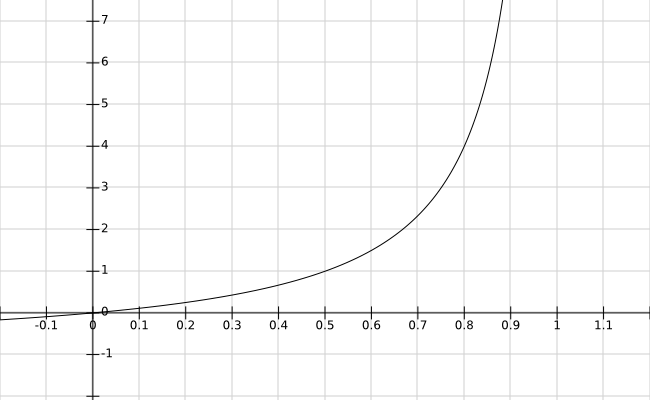

>Two heads are better than one.

***

## 一、简介

### 1.1 起源

&emsp;&emsp;[AdaBoost](https://en.wikipedia.org/wiki/AdaBoost)算法全称是**Adaptive Boosting（自适应提升）**，属于提升算法[Boosting](https://en.wikipedia.org/wiki/Boosting_(machine_learning))的一种。这个算法是常见的机器学习算法中比较容易理解和证明的。该算法于1995年由[Freund && Schapire](https://www.face-rec.org/algorithms/Boosting-Ensemble/decision-theoretic_generalization.pdf)提出，旨在提升[Probably Approximately Correct(PAC)](https://en.wikipedia.org/wiki/Probably_approximately_correct_learning)即概率近似准确框架下若学习器的表现。

### 1.2 术语和符号

&emsp;&emsp;本文中涉及的术语、符号、概念汇总如下，以供查阅：

#### 1.2.1 术语和概念

##### 1.2.1.1 PAC

&emsp;&emsp;是**Probably Approximately Correct**的缩写，即概率近似准确。

##### 1.2.1.2 指示函数

&emsp;&emsp;所谓的[指示函数](https://en.wikipedia.org/wiki/Indicator_function)，是指满足如下性质的函数：
$$
I(f(\vec{x_i}), y_i) = \begin{cases} 1, \quad f(\vec{x_i})=y_i \\ 0, \quad f(\vec{x_i}) \neq y_i \end{cases}
$$
&emsp;&emsp;式中：
&emsp;&emsp;&emsp;&emsp;$\vec{x_i}$——第$i$个样本；
&emsp;&emsp;&emsp;&emsp;$f(x)$——分类函数；
&emsp;&emsp;&emsp;&emsp;$y_i$——第$i$个样本的类别。

##### 1.2.1.3 强可学习
&emsp;&emsp;强可学习(**Strongly Learnable**)是指在PAC框架中，如果一个概念（或分类）可以用一个多项式的学习算法学习到，并且准确率很高，那么就称这个概念（或分类）是强可学习的。

##### 1.2.1.4 弱可学习

&emsp;&emsp;与强可学习对应，若多项式学习算法学习道德准确率跟随机猜测不相上下，那么这个概念（分类）就是弱可学习(**Weakly Learnable**)的。
&emsp;&emsp;**Schapire**证明了在PAC框架下，弱可学习是强可学习的充要条件。

##### 1.2.1.5 强分类器

&emsp;&emsp;准确率较高（至于多少算是比较高，没有明确的定义。我的理解是能满足实际应用的需求。）的分类器我们称之为强分类器(**Strong Classifier**)。

##### 1.2.1.6 弱分类器

&emsp;&emsp;准确率较差（与随机猜测不相上下）的分类器我们称之为弱分类器(**Weak Classifier**)。

#### 1.2.2 符号

- $N$：训练样本总数；
- $M$：要训练的基本分类器数（迭代轮数）；
- $T$：训练数据集$\lbrace(x_1,y_1),(x_2,y_2),\cdots,(x_i, y_i), \cdots,(x_N,y_N)\rbrace$；
- $\mathcal{X}$：样本空间（$x_i \in \mathcal{X} \subseteq \mathcal{R^n}$）；
- $\mathcal{Y}$：标记（样本标签）集合（$y_i \in \mathcal{Y}$，特别的，对于二分类问题有$\mathcal{Y}=\lbrace-1, +1\rbrace$；
- $G(x)$：最终训练出来的强分类器； 
- $h_m(x)$：第$m$轮训练的弱分类器；
- $D_m(x)$：第$m$轮时样本的权值分布$(w_{1}^m,\cdots,w_{i}^m,\cdots,w_{N}^m)$；
- $\varepsilon_m$：第m个基本分类器在训练数据集上的误分类权重累和（$=\sum\limits_{i=1}^{N}w_{i}^m \cdot I(h_m(\vec{x_i}),\ y_i)$），即为第$m$个基本分类器所有误分类样本的权值之和；
- $Z_m$：第$m$个基本分类器的规范化因子（$=\sum\limits_{i=1}^{N} w_{i}^m \cdot (\varepsilon_m)^{I(h_m(\vec{x_i}), \ y_i)}$）；
- $\alpha_m$：第$m$个基本分类器的权重系数（$=ln{\frac{1 - \varepsilon_m}{\varepsilon_m}}$）；
- $sign(x)$：[Signum](https://en.wikipedia.org/wiki/Sign_function)函数；

## 二、算法

### 2.1 核心思想

&emsp;&emsp;AdaBoost算法的思想非常贴合我们日常的想法，主要有两点：

- 集思广益，三个臭皮匠顶一个诸葛亮。
- 重点关注，避免一刀切。

#### 2.1.1 集思广益

&emsp;&emsp;所谓`智者千虑，必有一失；愚者千虑，必有一得。`凡事只有集思广益，广开言路，才能让我们获得相对更为全面的信息，做出更加精准的判断。

&emsp;&emsp;AdaBoost正是采用了这样的思想：训练出**多个弱分类器**，并为每个弱分类器学习一个权重，然后将这些弱分类器按权重组合成为一个强分类器。

&emsp;&emsp;之所以是组合多个弱分类器而不是组合多个强分类器，是因为对于很多实际问题来说，通常训练一个强分类器其成本往往是很高的，而弱分类器则相对更容易获取。

&emsp;&emsp;组合多个弱分类器的另外一原因是，弱分类器所对应的模型往往更加简单和粗糙，组合多个弱分类器不容易造成模型过拟合。

&emsp;&emsp;加入权重则是为了避免简单粗暴的一人一票机制，因为对于众多弱分类器来说其表现是参差不齐的。分类误差大的分类器我们应该增大其权值，使其在表决中拥有较大的话语权，分类误差大的应该减小其权值，使其在表决中影响力较小。

&emsp;&emsp;AdaBoost之所以被称为提升算法，实际上就是通过组合多个弱分类器，将多个弱分类器提升为一个强分类器，实现将弱可学习提升为强可学习的目的。

#### 2.1.2 重点关注

&emsp;&emsp;回顾我们复习备考的经验我们就会发现，每次考试完拿到试卷后，相比那些做对的题我们更关注错题，花更多的时间在错题对应的知识点的查漏补缺上。

&emsp;&emsp;AdaBoost也采用了这样的思想：每一轮训练时，我们会更加关注被上一轮弱分类器**分类错误**的样本。那如何让被误分类的样本受到更多的关注呢？

&emsp;&emsp;实现的方式有很多种，但比较自然的方式就是引入样本权重。每一轮训练时，增大误分类样本权重的同时减小正确分类样本的权重。样本权重通过作用于弱分类器的权重系数从而影响弱分类器的行为，使得下一轮的弱分类器更加专注于误分类样本。

&emsp;&emsp;通过引入样本权重，可以有效的避免一刀切的把有限的资源平均分配在每一个样本上。何恺明等人于2018年提出的[Focal Loss](https://arxiv.org/pdf/1708.02002.pdf)与这个想法有异曲同工之妙。

### 2.2 问题及方案

&emsp;&emsp;理解了AdaBoost的核心思想之后，接下来就要考虑如何去实现，对应的我们就有两个问题需要解决：

- 第一是如何组合多个弱分类器使其能成为一个强分类器；
- 第二是如何更新训练样本的权重使得误分类样本能被重点关注。

#### 2.2.1 组合问题

&emsp;&emsp;考虑我们现在训练出$M$个弱分类器$h_m(x)$，按照上述设计思想，每个弱分类器有一个对应的加权系数（记为$\alpha_m$），这$M$个弱分类器可以采用任意的组合形式，但采用线性组合是最为自然的一种，如下：

$$
\begin{split}
f_m(\vec{x}) &= \alpha_1 h_1(\vec{x}) + \alpha_2 h_2(\vec{x}) + \cdots + \alpha_M h_M(\vec{x}) \\
&= \sum \limits_{m=1}^{M} \alpha_m h_m(\vec{x})
\end{split}
\tag{2 - 2 - 1}
$$

#### 2.2.2 更新问题

&emsp;&emsp;通常机器学习中参数的更新都是乘以一个更新系数，以样本权重系数来说，其更新可以采用如下公式：

$$
w_i^{m+1} = \beta \cdot w_i^m
\label{update_weights}
\tag{2 - 2 - 2}
$$

&emsp;&emsp;Paper中正是采用了这样的更新方式而没有再去另辟蹊径。在确定了参数的更新方式之后，剩下需要考虑的问题是：

- $\beta$是采用定值还是在模型的迭代训练中动态更新；
- $\beta$如果采用定值，取值的依据是什么；
- $\beta$如果采用动态更新，又跟哪些变量有关；

&emsp;&emsp;通常来说，动态更新的参数要比定值参数更优，因为前者能更好的适应模型的变化，如深度学习中动态调整的学习率。

&emsp;&emsp;就我们分析的问题来说，要动态更新$\beta$最直接、最有效的依据是分类器当前的表现。总误差（记作$\varepsilon_m$）大时，增大$\beta$的值以便增大下一轮训练时样本的权重，反之则减小$\beta$的值。由此可知$\beta$与$\varepsilon_m$的定性关系为：$\beta \propto \varepsilon_m$，即权重更新系数正比于弱分类器当前总误差。

&emsp;&emsp;Paper中给出的样本权值更新系数的计算公式如下：

$$
\beta_m = \frac{\varepsilon_m}{1 - \varepsilon_m}, \quad \varepsilon_m \in [0, 1)
\tag{2 - 2 - 3}
$$

&emsp;&emsp;$\beta_m$关于$\varepsilon_m$的函数图象如下所示：

### 2.3 定量关系

&emsp;&emsp;确定了组合和更新问题的方案之后，我们就需要确定上述各个参数的定量表达式，最终解决这两个问题。由于二分类只是多分类的特列，因此下文针对的都是多分类的情况。

#### 2.3.1 样本权重

&emsp;&emsp;权重通常有两种：一种是满足概率分布的即$\sum\limits_{i=1}^{N} w_i= 1(w_i >= 0)$，另一种则是不满足的。Adaboost中没有对权重做限制，这样做的好处是算法的适用范围更广，劣势就是可解释性不强也不方便模型进行训练。因此对于给定的初始权重需要将其转换成概率分布，具体做法是：

$$
\vec{P^m_w} = \frac{\vec{W^m}}{\sum \limits_{i=1}^{N} w^m_i}
\tag{2 - 3 - 1}
$$

&emsp;&emsp;为方便叙述，下文中仍然用符号$\vec{W^m}$及$w^m_i$表示第$m$轮训练中服从概率分布（归一化后）的样本权重，而用符号$Z_m=\sum \limits_{i=1}^{N} w^m_i$表示第$m$轮训练的归一化因子。

&emsp;&emsp;需要说明的一点是，在整个模型的训练结束前，由于每轮训练结束后会更新权重系数（式$\ref{update_weights}$），导致权重系数的概率分布特性被破坏，因此每轮训练结束更新完样本权重后都需要重新执行一次归一化操作，如下所示：

$$
w^{m+1}_i = \frac{1}{Z_m} \cdot (\beta^m \cdot w^m_i)
\label{normalized_weights}
\tag{2 - 3 - 2}
$$

&emsp;&emsp;为了简化算法的描述，我们可以把样本权重的更新和归一化合并到一步来完成，即下式：

$$
w^{m+1}_i = \frac{\beta^m}{Z_m} \cdot w^m_i, \quad z_m = \sum \limits_{i=1}^{N} w^m_i
\tag{2 - 3 - 3}
\label{normalized_weights_simplyfied}
$$

点此查看注释

&emsp;&emsp;李航老师的《统计学习方法》中就将样本权重的更新和归一化放到了一步来做。这样的好处是算法的描述会更简洁，数学表达式看起来更优雅，而劣势就是不太方便读者理解为什么要这么做。

&emsp;&emsp;此外不得不提的一点是，李航老师关于Adaboost算法的描述（算法8.1）的第一步容易让人产生困惑：

&emsp;&emsp;为什么第一步是将训练数据的权值分布初始化成离散型均匀分布$w_1=\frac{1}{N}$？是算法本身的要求吗？其它分布不行吗？

&emsp;&emsp;实际上样本的初始权重分布可以是任意类型的，Adaboost算法对此并无苛求。显然只有当我们对于训练样本不具备先验知识时，将其初始化成离散均匀分布才是合理且自然的。

&emsp;&emsp;Adaboost的Paper中则是将更新和归一化分开的。因为我们要将样本权重送入弱学习器来得到弱分类器，因此样本在送入弱学习器之前其权重一定要满足概率分布。Paper中的描述更方便读者理解模型训练的整个过程，不会误导读者。

&emsp;&emsp;上式虽然解决了样本权重的分布问题，但仍不能满足要求。原因就在于上式对于那些被误分类的样本和被正确分类样本的更新是相同的，下一轮训练时无法突出被误分类的样本。

&emsp;&emsp;所以我们还要修改上式，以便区别更新正确分类和误分类样本的权重。实现方法有三种：

- 减小正确分类样本权重，误分类样本权重不变；

- 正确分类样本权重不变，增大误分类样本权重；

- 减小正确分类样本权重，同时增大误分类样本权重。

&emsp;&emsp;考虑到样本权重更新后还要做归一化，因此我们只需要简单的减小正确分类或者增大误分类样本权重即可，没必要同时去更新。这样在代码实现时可以减少计算量。

&emsp;&emsp;Paper中采用的是第一种即**减小正确分类样本权重，保持误分类样本权重不变**，如下式所示：
$$
w_i^{m+1} = \frac{(\beta^m)^{I(f(x_i), \ y_i)}}{z_m}w_i^m = 
\begin{split}
\begin{cases}
\frac{\beta^m}{z_m} \cdot w_i^m &\quad f(x_i) = y_i \\
\\
\frac{1}{z_m} \cdot w_i^m &\quad f(x_i) \neq y_i
\end{cases}
\end{split}
\tag{2 - 3 - 4}
$$
&emsp;&emsp;上式中虽然误分类样本的权重没变，但是由于权重归一化系数$z_m$的存在，误分类样本的权重实际上还是被增大了。

点此查看证明

&emsp;&emsp;假定第$m$轮训练时样本权重（已归一化）为：
 $$\vec{W^m} = (w_1^m, \cdots , w_i^m, \cdots, w_N^m), \quad \sum \limits_{i=1}^N w_i^m = 1$$
    &emsp;&emsp;同时假定该轮训练中正确分类样本数为$k(k \in [0, N])$个，则第$m+1$轮训练时未归一化的样本权重为：
$$
\vec{W^{m+1}} = (w_1^m, \cdots , \underbrace{\beta^m \cdot w_i^m, \cdots, \beta^m \cdot w_{i+k}^m}_{k}, \cdots, w_N^m), \quad \beta \in [0,1)    
$$
    &emsp;&emsp;第$m$轮训练的归一化因子为：
$$
\begin{split}
z^m &= w_1^m + \cdots + \underbrace{\beta^m \cdot w_i^m + \cdots + \beta^m \cdot w_{i+k}^m}_{k} + \cdots + w_N^m \\
    &\le w_1^m + \cdots + \underbrace{1 \cdot w_i^m + \cdots + 1 \cdot w_{i+k}^m}_{k} + \cdots + w_N^m \\
    &= 1 \\
\frac{1}{z^m} &\ge 1
\end{split}
$$
&emsp;&emsp;因此有：
$$
\begin{split}
\frac{z^m}{\beta_m} &= \frac{1}{\beta_m} \cdot w_1^m + \cdots + w_i^m + \cdots + w_{i+k} + \cdots + \frac{1}{\beta_m} \cdot w_N^m \\
    &\ge 1 \cdot w_1^m + \cdots + w_i^m + \cdots + w_{i+k}^m + \cdots + 1 \cdot w_N^m \\
    &= 1 \\
\frac{\beta_m}{z^m} &=\frac{1}{z^m/\beta^m} \le 1
\end{split}    
$$

&emsp;&emsp;则第$m+1$轮训练时归一化后的样本权重为：
$$
\vec{W^{m+1}} = (\frac{w_1^m}{z_m}, \cdots , \frac{\beta_m}{z_m} \cdot w_i^m, \cdots, \frac{\beta_m}{z_m} \cdot w_{i+k}^m, \cdots, \frac{w_N^m}{z_m}), \quad z_m \in (0,1]    
$$

&emsp;&emsp;由此可以看出，第$m+1$轮训练时，只要本轮有被正确分类的样本（$k>0$），则被误分类的样本其权重实际上将会被增大，而正确分类样本的权重实际上将会被减小。

#### 2.3.1 总误差

&emsp;&emsp;对任意一轮的弱分类器$h_m(x)$，其表现即准确率/误差率当然可以采用传统的正确/错误分类样本所占比例来度量，但这样弱分类器就无法利用样本的权重系数。

&emsp;&emsp;有鉴于此，原Paper中使用了**所有误分类样本的归一化权重之和**即总误差作为弱分类器的评估指标，如下：

$$
\begin{split}
\varepsilon_m &= \sum \limits_{i=1}^{M} w_i^m \cdot I(h_m(\vec{x_i}), \ y_i) \\
&= \sum \limits_{h_m(\vec{x_i}) \neq y_i}^{M} w_i^m
\end{split}
\tag{2 - 3 - 1}
$$

#### 2.3.2 弱分类器选择

&emsp;&emsp;对于上式中弱分类器$h_m(x)$的具体形式，AdaBoost并无要求，可以视具体情况选定，并且多个弱分类器可以分别选用不同的形式，互不干扰。

#### 2.3.3 分类器系数

&emsp;&emsp;由于弱分类器权重系数$\alpha_m$仅仅影响弱分类器系数在分类表决中的权值，准确率高的权值大，反之则小。因此$\alpha_m$也必然是是关于分类器表现即总误差$\varepsilon_m$的单变量函数。

&emsp;&emsp;

#### 2.3.4 最终分类器

&emsp;&emsp;由于弱分类器$G_m(x)$的取值范围取决于具体选择的函数，因此各个弱分类器的加权和不能直接作为最终分类器$G(x)$的输出，还需要套一层映射函数，本文中用$h(x)$表示。

&emsp;&emsp;函数$h(x)$的具体形式可根据实际情况选取，比如二分类问题可取用$sign$函数，而多分类问题则可选用深度学习中的$softmax$或$argmax$函数。则最终分类器的公式如下：

$$
G(x) = h \left( f_m(x) \right) = h \left( \sum \limits_{m=1}^{M} \alpha_m G_m(x) \right)
\tag{2 - 2}
$$

