### LeNet

### 模式识别的变迁

&emsp;&emsp;以手写字符为例，传统的方法是手工设计特征提取器，现在是基于像素直接操作的自动学习器。

&emsp;&emsp;以文本理解为例，传统的方法是独立设计各个模块，现在是统一的、有良好设计范式的图像转换网络GTN(Graph Transformer Networks)。

#### 传统模式识别存在的问题

1. 手动设计的特征提取器与任务相关，包含了大量与特定任务有关的先验知识，泛化能力弱；
2. 大量丰富多变的自然数据，使得手工设计一套精准的识别系统已不可能；
3. 识别的精度主要取决于手工设计的特征；
4. 各个模块由于设计上相互独立，其模块参数先各自训练，然后整合到一起后，再重新统一训练，导致这个过程费时费力并且最后还可能不是最优解;
5. 无法抵抗旋转、缩放、扭曲等变形操作；

### 三点因素推动

1. 具有高速数学计算能力的、低廉的电脑的产生，对巧妙设计的算法的依赖性大大降低，更多的转向了“蛮力”的数值计算方法；
2. 大型数据库对具有广阔市场和广泛兴趣的问题（比如手写体识别问题）的有力支持，使得大量设计人员更多的依赖于真实的数据而非手工设计的特征来构建识别系统。
3. 第三点也是特别重要的一点是，强大的能处理高维输入并生成复杂决策函数的机器学习技术的兴起，使得我们能处理这些大型数据集。

### 论文内容概览

1. 手写字符识别(1、2章)；
2. 手写数字识别测试性能（3章）；
3. 从单字符识别到文章中单词、句子识别（4章）；
4. 经典启发式方法在单词识别或者其他字符串识别中存在的过度分割问题（5章）；
5. 基于梯度的判别及非判别方法在无需手动分词及标注的情况下训练单词级别的识别器技术。（6章）；
6. 空间置换(Space-Displacement)神经网络通过在输入的所有可能位置扫描识别器消除了启发式分割的需要（7章）；
7. 基于一种统一的图像合成算法，可训练的GTN可以被公式化成多种广义转换；
8. 全局训练的GTN系统用于识别手写器的输入（在线手写体识别）；
9. 一套完全基于GTN的系统用于识别手写体及机打银行支票；

### 论文符号及术语概览

- $Y^p = F（Z^p， W）$：第$p$种字符经过神经网络后的输出；
- $Z^p$：第$p$种字符的输入图像；
- $W$：系统可变参数（要学习的参数）；
- $D^p$：第$p$种字符的正确输出；
- $E^p = \mathcal{D}（D^p， F（Z^p， W））$：关于第$p$种字符的损失函数（正确输出和神经网络输出的差异）；
- $E_{train}(W)​$：训练集上的平均损失函数；
- $H(w)​$：正则化函数；
- $a_i$：第$i$个神经元的输入（上一层所有与之相连的神经元的输入的权重累和加上偏置系数）；
- $x_i$：第$i$个神经元的输出（激活值，$a_i$经过`sigmoid`函数后的输出）；

#### 2. 术语

- GT(Graph transformer)：图像转换器；
- GTN(Graph tranformer network)：图像转换网络；
- HMM(Hidden Markov model)：隐马尔可夫模型；
- HOS(Heuristic oversegmentation)：启发式过度分割；
- K-NN(K-nearest neighbor)：K紧邻算法；
- NN(Neural network)：神经网络；
- OCR(Optical character recognition)：光符识别；
- PCA(Principal component analysis)：主成份分析；
- RBF(Radial basis function)：径向基函数；
- RS-SVM(Reduced-set support vector method)：约简支持向量法；
- SDNN(Space displacement neural network)：位移神经网络；
- SVM(Support vector method)：支持向量机；
- TDNN(Time delay neural network)：时延神经网络；
- V-SVM(Virtual support vector method)：虚支持向量法；
- MAP(Maximum a Posteriori)：最大后验概率；
- MMI(Maximum Mutual Information)：最大互信息；

### 训练

1. 随机梯度下降；
2. 反向梯度传播；

### CNN

三个关键思想：

1. 局部感受野；
2. 权值共享（或权重复制）；
3. 空间或时间降采样。

- `feature map`：多个共享相同权重系数的单元组成的平面；
- 一个完整的卷积层的输出由多个权重系数不同的`feature maps`组成；
- 随着层数的递进，由于图片分辨率越来越低，因此`feature map`的数量越来越多；
- 降低图片的分辨率是为了应对输入的几何变换（旋转、平移等），而为了补偿这种分辨率的损失，则通过增加表示的丰富性（特征图数量）；

### LeNet

#### LeNet架构

&emsp;&emsp;LeNet架构概览图如下所示：

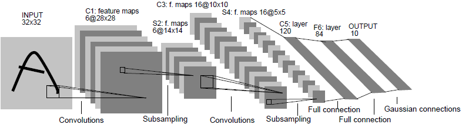

&emsp;&emsp;LeNet总共包含了 **8** 层（含输入层）：**1** 个输入层、 **3** 个卷积层、**2** 个池化/下采样层、**1**个全连接层、**1**个输出层组成。

#### 架构参数概览表

| 全局编号 | 名称 | 输入尺寸 |   核大小@步长@填充   | 输出尺寸 | 参数个数 |
| :---:  | :---: |  :---: |  :---:  |  :-----:  |  :-----:  |
| —— | 输入层 | * | —— | $32 \times 32$ |——|
| C1 | 第1个卷积层 | $32 \times 32$@1 | $5 \times 5$@1@VALID | $28 \times 28$@6 | 156 |
| S2 | 第1个池化/降采样层 | $28 \times 28$@6 | $2 \times 2$@2@VALID | $14 \times 14$@6 | 12 |
| C3 | 第2个卷积层 | $14 \times 14$@6 | $5 \times 5$@1@VALID | $10 \times 10$@16 | 1516 |
| S4 | 第2个池化/降采样层 | $10 \times 10$@16 | $2 \times 2$@2@VALID | $5 \times 5$@16 | 32 |
| C5 | 第3个卷积层 | $5 \times 5$@16 | $5 \times 5$@1@VALID | $1 \times 1$@120 | 48120 |
| F6 | 全连接层 | $1 \times 1$@120 | —— |  $1 \times 1$@84  | 10164 |
| —— | 输出层 | $1 \times 1$@84 |          ——          | * | —— |

#### 结构详解

##### 1. 输入层

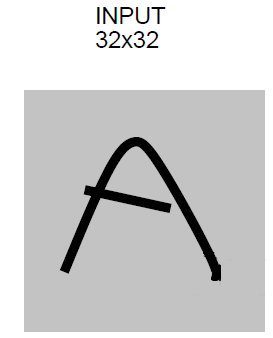

&emsp;&emsp;会把任意尺寸的图片缩放为$32 \times 32$的标准化图片，然后提供给LeNet神经网络。这个尺寸要明显大于数据库中存放的手写字符的图片大小（以$28 \times 28$大小的图片为中心，其像素仅为$20 \times 20$）。之所以要这样做，是为了让一些潜在的区别性的特征（比如箭头的端点或边缘）能够出现在高维特征检测器的感受野的中心。

&emsp;&emsp;输入图像的背景像素（白色）被标准化为-0.1，前景像素（黑色）设置为1.175。这样输入的均值约等于0，方差则近似为1，这样有助于加速整个网络的训练。

##### 2. C1层

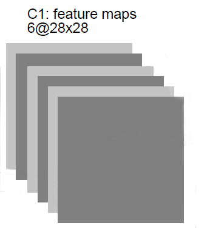

- 输入尺寸：$32 \times 32​$；
- 卷积核大小：$5 \times  5$；
- 卷积步长：1；
- 填充：不填充（VALID）；
- 卷积后尺寸：$\lfloor \frac{32 + 2*0 - 5}{1} + 1 \rfloor = 28​$；
- 特征图数量：6；
- 参数个数：$(\underbrace{5 \times 5}_{kernel\_size} + \underbrace{1}_{bias}) \times \underbrace{6}_{feature\_maps} = 156$；
- 连接数：$156 \times 28 \times 28 = 122304$（特征图上每一个像素有156个连接）。

##### 2. S2层

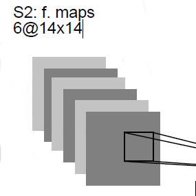

- 输入尺寸：$28 \times 28​$；
- 池化核大小：$2 \times  2$；
- 池化步长：2；
- 填充：不填充（VALID）；
- 池化后尺寸：$\lfloor \frac{28 + 2*0 - 2}{2} + 1 \rfloor = 14​$；
- 特征图数量：6；
- 参数个数：$(1 + \underbrace{1}_{bias}) \times \underbrace{6}_{feature\_maps} = 12$；
- 连接数：$(2 \times 2 + 1) \times 14 \times 14 \times 6 = 5880$（输出特征图的每个像素与原来的4个像素连接，再加上偏置）；
- 激活函数：sigmoid。

##### 3. C3层

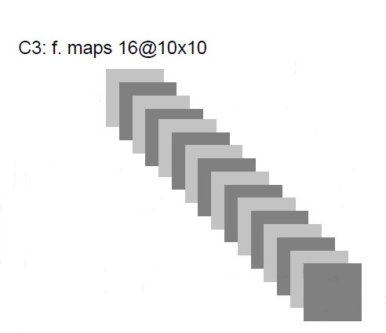

&emsp;&emsp;C3层比较特殊，因为它的特征图由输入的**6**个剧增到了输出的**16**个，输出特征图的每个像素对应好几个输入的$5 \times 5$大小的单元。这16个输出特征图的合成关系如下图所示：

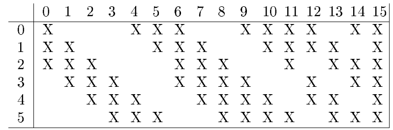

&emsp;&emsp;由上图可知，对于输出特征图：

1. 编号0～5的特征图，每张的每个像素由**3**张输入特征图上$5 \times 5$大小的像素组合而成，即只连接3张输入特征图；
2. 编号6～14的特征图，则由**4**张输入特征图上$5 \times 5​$大小的像素组合而成。其中6～11是由**连续的4张**输入特征组合的，而12～14则是由**不连续的4张**输入特征图组合而成；
3. 编号15的特征图，则由所有**6**张的输入特征图上​$5 \times 5$大小的像素组合而成；

&emsp;&emsp;为何不把所有输出特征图的跟所有输入的特征图连接起来呢？原因有两个，第一个是控制连接数在一个合理的范围内。第二个也是最重要的一个，这样做能强制性的打破网络的对称性。

- 输入尺寸：$14 \times 14​$；
- 卷积核大小：$5 \times  5$；
- 卷积步长：1；
- 填充：不填充（VALID）；
- 卷积后尺寸：$\lfloor \frac{14 + 2*0 - 5}{1} + 1 \rfloor = 10​$；
- 特征图数量：16；
- 参数个数：$\underbrace{(5 \times 5 \times 3 + 1) \times 6}_{0-5号输出特征图} + \underbrace{(5 \times 5 \times 4 + 1) \times 9}_{6-14号输出特征图} + \underbrace{(5 \times 5 \times 6 + 1) \times 1}_{15号输出特征图}= 1516$；
- 连接数：$1516 \times 10 \times 10 = 151600$；

##### 4. S4层

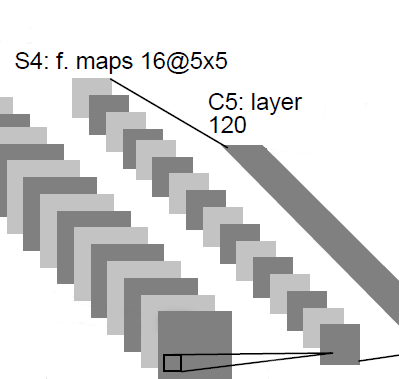

- 输入尺寸：$10 \times 10$；
- 池化核大小：$2 \times  2$；
- 池化步长：2；
- 填充：不填充（VALID）；
- 池化后尺寸：$\lfloor \frac{10 + 2*0 - 2}{2} + 1 \rfloor = 5​$；
- 特征图数量：16；
- 参数个数：$(1 + \underbrace{1}_{bias}) \times \underbrace{16}_{feature\_maps} = 32​$；
- 连接数：$(2 \times 2 + 1) \times 5 \times 5 \times 16 = 2000$；
- 激活函数：sigmoid。

##### 5. C5层

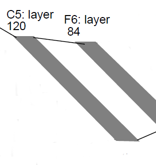

&emsp;&emsp;C5层的特征图由输入的**16**个剧增到了输出的**120**个，输出特征图的每个像素对应所有输入特征图的$5 \times 5$大小的单元。这一层被标记为**卷积层**而非**全连接层**是因为，如果LeNet-5网络的输入图像变大，但其它参数保持不变，那么这一层输出的特征图则会比$1\times 1$这个尺寸大，因此就不是全连接层。

- 输入尺寸：即为输入层图像的大小，$5 \times 5​$；
- 卷积核大小：$5 \times  5$；
- 卷积步长：1；
- 填充：不填充（VALID）；
- 卷积后尺寸：$\lfloor \frac{5 + 2*0 - 5}{1} + 1 \rfloor = 1$；
- 特征图数量：120；
- 参数个数：$(5 \times 5 \times 16 + 1) \times 120 = 48120$；
- 连接数：$48120 \times 1 \times 1 = 48120$（这一层的参数个数等于链接数）；

##### 6. F6层

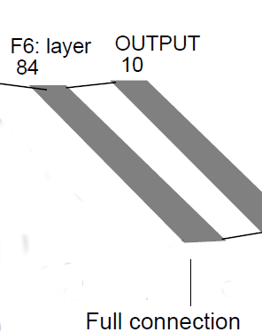

&emsp;&emsp;F6层为整个网络的全连接层，其输出的大小主要是根据输出层来确定的。
- 输入尺寸：$1 \times 1​$；
- 输出尺寸：$1 \times  1​$；
- 输出数量：84；
- 参数个数：$(120 + 1) \times 84 = 10164​$；
- 连接数：$10164 \times 1 \times 1 = 10164​$（这一层的参数个数也等于链接数）；

##### 7. 输出层

&emsp;&emsp;论文是针对0～9的手写字识别，因此输出类别总数为10。输出层一共有10个**径向基函数神经元**，每个类别对应一个神经元，每一个径向基函数神经元则有84个输入（由F6层传入）。第$i$个径向基函数神经元的输出由下式给出：
$$
y_i = \sum_{j}(x_j - w_{ij})^2
$$
&emsp;&emsp;上式实际上是计算的输入和向量和参数向量的欧几里德距离。对此作者提出了两种解释来看待：

- 第一种是看作输入模式和与某个类相关的RBF模型之间的误差罚项；
- 第二种是从概率的角度，可以看作是F6层的[配置空间](https://en.wikipedia.org/wiki/Configuration_space_(mathematics))的高斯分布的非归一化负对数似然函数。

&emsp;&emsp;对于RBF神经元的参数向量，并没有采用类似$\frac{1}{N}​$（即独热编码`one-hot`）这种**非分布式编码**，而是采用了**分布式编码**。具体做法是**把每种字符画在一张$7 \times 12​$（即84维，与F6的84个输出单元对应）的位图上**，然后用位图作为参数向量，参数向量的元素取值要么是-1，要么是1。

&emsp;&emsp;这种编码方式虽然在单个数字的识别上不是特别有用，但是用来识别从可打印ASCII集合中提取的字符却异常有效。作者说了几点原因：

- 使用分布式编码后，看起来相似容易混淆的字符（比如大写字母'O'和数字'0'、小写字母'l'和数字'1'）他们的RBF神经元输出是比较相似的（如果是`one-hot`编码就不可能相似）。这个时候只要再加一个语义校正器就可以大大提高准确率；
- 当$N$较大（比如到几十以上）时，`one-hot`这种非分布式编码表现会变差；
- 分布式编码方式不仅仅可以识别字符，还可以判别非字符的图形，而不会像`one-hot`那样把所有图形都判定成字符；
- 非分布式编码中，大部分输出单元在大多数时候的输出状态都要为0，这一点采用**Sigmoid**作为激活函数的神经元很难做到；
- 使用分布式编码的RBF在面对一些不太典型的非字符图形时，也能在严格受限的输入空间范围内被激活，而不会像**Sigmoid**那样落在这个范围外面。
- 参数向量的元素取-1或者1有效的避免了F6层的激活值落在**Sigmoid**非饱和区，这样可以迫使F6层的各个神经元在其最大限度的非线性范围内工作。

&emsp;&emsp;输出层分布式编码示意图如下所示：

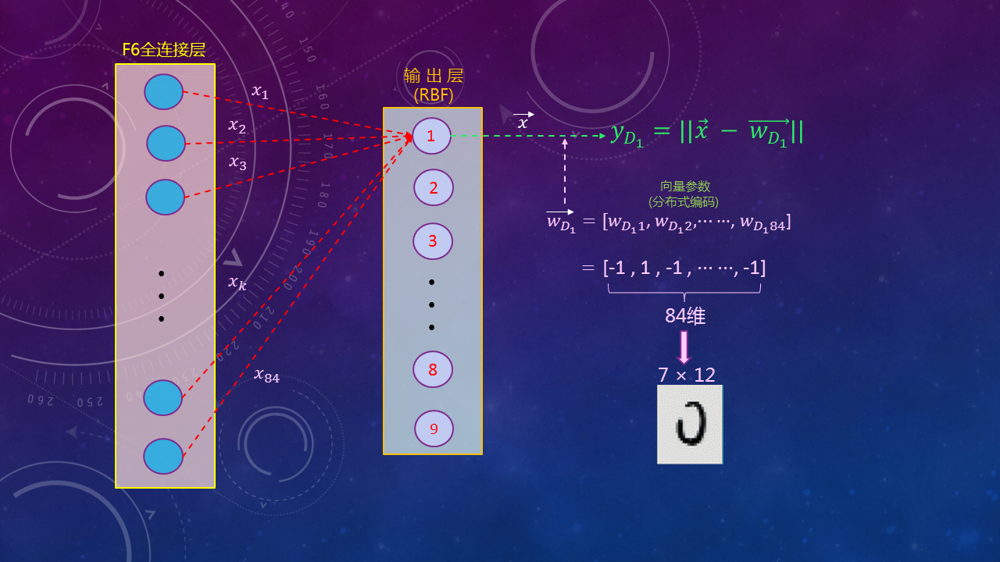

##### 8. 激活函数

&emsp;&emsp;从C1到F6，所有的神经元都经由**Sigmoid**函数（神经网络中喜欢称呼为**Sigmoid squashing**函数）。论文中采用的是如下的双曲正切（[hyperbolic tangent](https://en.wikipedia.org/wiki/Hyperbolic_function)）函数：
$$
f(a) = \textbf{A} tanh(\textbf{S} a)
$$
&emsp;&emsp;式中，$\textbf{A} $取1.7159，而$\textbf{S}$则取用$\frac{2}{3}$。作者在论文的附录A中阐述了，之所以选用双曲正切函数，是因为对称函数能取得更好的收敛性（即使在权重系数较小的时候学习过程将非常慢）。

&emsp;&emsp;而之所以$\textbf{A}、\textbf{S}$要取这样的值，作者也做了解释：这样取值能够满足$f(x) = 1$以及$f(-1) = -1$，也即在正常工作状态下，**Sigmoid​**变换的总增益保持在1左右。同时​$f$的二阶导数在点​$a = 1、a = -1$处均为最大值，加速了学习过程的收敛（梯度最大）。

&emsp;&emsp;特别要注意避免**Sigmoid**函数的饱和，它不仅会导致收敛过程异常慢，还可能会让损失函数的最小化演变成一个病态问题。

##### 9. 权重系数

&emsp;&emsp;作者在论文的附录A中还提到了关于权重系数的初始化，应随机化为$[-\frac{2.4}{F_i}， \frac{2.4}{F_i}]$上的**均匀分布**，其中$F_i$为第$i$个神经元的输入的数量。除以$F_i$是为了让每个神经元的加权和的初始标准差分布在相同的范围内。

&emsp;&emsp;作者还强调，初始权重系数过小，对应的梯度就很小，学习过程会非常慢。初始权重系数过大，则处于**Sigmoid**函数两端的饱和区，梯度也非常小。因此有必要设置一个合理的值，保证工作在**Sigmoid**的**非饱和区**，如下所示：

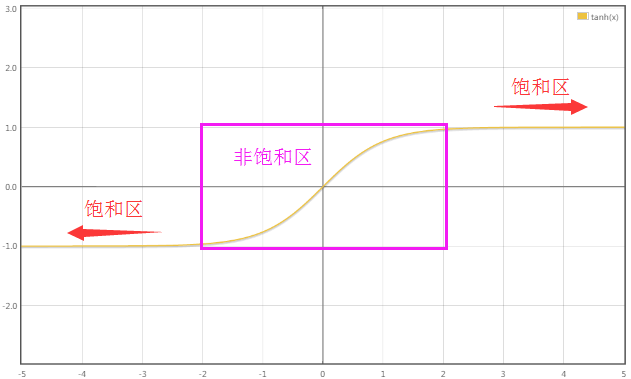

##### 10. 损失函数

&emsp;&emsp;论文中使用的损失函数为：
$$
\begin{split}
\begin{cases}
y_{D_p}(Z^p, W) &= \sum\limits_{j}^{}(Z^p - w_{D_pj})^2 \\
E(W) &= \frac{1}{P} \sum\limits_{p=1}^{P} \Big[ y_{D_p}(Z^p, W) + log(e^{-j} + \sum\limits_{i}e^{-y_i(Z^p, W)}) \Big] \\
&= \underbrace{\frac{1}{P} \sum\limits_{p=1}^{P} y_{D_p}(Z^p, W)}_{MSE} + \underbrace{\frac{1}{P}  \sum\limits_{p=1}^{P} log(e^{-j} + \sum\limits_{i}e^{-y_i(Z^p, W)})}_{罚项/正则项} 
\end{cases}
\end{split}
$$

&emsp;&emsp;式中，$y_{D_p}​$表示对应标准输出应该为$D_p​$的RBF神经元的输出（也即输入$Z^p​$所对应的正确分类的那个神经元）。$w_{D_pj}​$表示输出应该为$D_p​$的RBF神经元的与上一层第$j​$个神经元之间的权重系数。

&emsp;&emsp;如上式所示，该损失函数实际上是由两项组成的，一是最小均方误差(**MSE**)，另一个则是罚项（或正则项）。之所以加了后面这么一堆看起来特别复杂的东西而不只使用第一项的MSE，作者也做了解释，主要是基于如下三点原因：

1. 只使用**MSE**作为损失函数，如果我们允许RBF神经元调节其参数向量$\vec{w}$，则根据最小化原则（$y_{D_p}$的表达式），其所有参数向量必将强制性相等，而F6的所有输出也将恒定不变，并强制性的与这些参数向量相等。此时所有RBF的输出将被强制性的等于0，即误差为0（当然如果参数向量$\vec{w}$不允许改变就不会存在这种崩塌现象）；
2. 第二个存在的问题是，只使用**MSE**会导致类之间没有竞争性（缺乏类间竞争性的结果就是，最终多个类的输出概率相同或非常接近，导致模型无法确定究竟该属于  哪个类）。类间竞争性(competition between the classes)可以通过诸如**MAP**准则来实现。**MAP**实际上对应于最大化其正确分类$D_p$的概率（或最小化正确分类的概率似然函数）。从罚项的观点来看，它除了能降低正确分类（按照类似**MSE**的评判标准）的惩罚力度外，还能提高对错误分类的惩罚力度。

&emsp;&emsp;对于罚项而言，由于其绝对值恒小于等于第一项的绝对值，因此损失函数的值必然为正（确保损失函数有意义）。罚项中的常数$j > 0$，这样可以有效的避免本就已经较大的罚项的值被进一步提高的过大（**暂时还没有想明白**）。而垃圾分类的后验概率则等于如下比值：
$$
\alpha = \frac{e^{-j}}{e^{-j} + \sum\limits_{i}e^{-y_i(Z^p, W)}}
$$
&emsp;&emsp;由于罚项为负，因此在最小化损失函数的时候就可以有效的避免上面的崩塌现象。

&emsp;&emsp;计算损失函数对各层中的权重系数的梯度通过反向传播算法实现，不过由于共享权重的存在，在实际实现时通常会做些微小的改动。具体做法是，先把整个网络当作没有任何共享权重的传统网络，分别求出损失函数对网络中各个连接的偏导数，然后把共享了权重的那些连接的偏导数累加起来，作为对该共享权重的偏导数。

&emsp;&emsp;如此巨大的网络可以通过一些技术来实现高效的训练。作者提到了以下内容：

1. 附录A中的特殊的Sigmoid函数以及权重初始化；
2. 附录B和C中的最小化过程（[Levenberg-Marquardt](https://en.wikipedia.org/wiki/Levenberg%E2%80%93Marquardt_algorithm)过程对角近似的随即版本）。

### 数据集

&emsp;&emsp;论文中的数据集取自NIST的SD-1(Special-Database 1)和SD-3(Special-Database 3)，在原始的**NIST**数据集中，**SD3**的数据记录更干净也更容易识别，因此作为了训练数据集。而**SD1**则被作为测试数据集。**NIST**数据集的信息如下所示：

|  用途  | 数据集名称 | 数据记录数 | 书写者数量 |  数据来源  |
| :----: | :--------: | :--------: | :--------: | :--------: |
| 训练集 |    SD3     |   enough   |  unknown   | 统计局员工 |
| 测试集 |    SD1     |   58,527   |    500     |  高校学生  |

&emsp;&emsp;论文中则做了一些修改，把**SD1**的数据分成了两部分。前面250位书写者的数据加到了训练集，后面250位书写者的数据则加入了测试集，成为**MNIST**。该数据集的信息如下所示：

| 数据集    | 数据记录数 | 数据来组成 |
| :---------: | :----------: | :----------: |
| 训练集 |   60,000   | SD1($\approx 30,000$) + SD3 |
| 测试集 | 25,000     | SD1 + SD3 |

&emsp;&emsp;论文中用于实验的数据集（属于**MNIST**的子集）的信息如下：	

| 数据集 | 数据记录数 |      数据来组成       |
| :----: | :--------: | :-------------------: |
| 训练集 |   60,000   |       SD1 + SD3       |
| 测试集 |   10,000   | SD1(5000) + SD3(5000) |

&emsp;&emsp;MNIST的图像先被归一化为$20 \times 20$的标准图像，再中心化为$28 \times 28$的图片（以质心为中心），如下图所示：

### 训练和结果

&emsp;&emsp;每次训练执行总共20轮迭代。

#### 1. 学习率

- 1～2轮迭代，$\eta = 0.0005​$；

- 3～5轮迭代，$\eta = 0.0002$；
- 6～8轮迭代，$\eta = 0.0001$；
- 9～12轮迭代，$\eta = 0.00005$；
- 13～20轮迭代，$\eta = 0.00001$.

#### 2. $\mu$

&emsp;&emsp;$\mu$的值在迭代期间保持定值，为0.02。

#### 3. 过拟合

&emsp;&emsp;作者说其在模型的整个训练过程中没有观测到过拟合现象，他给出的一种可能性的解释是训练过程中学习率始终保持在一个比较大的值，导致权重参数始终在局部最小值附近震荡。训练集测试误差示意图如下：

&emsp;&emsp;另外作者顺便测试了训练样本数对模型准确率的提升效果，结果证实即便是对具体业务场景进行过精心设计的神经网络，样本数量也会显著的影响模型的精度，训练数据集大小与测试误差的关系如下图所示：

&emsp;&emsp;为了进一步证实该结论，作者通过扭曲原始数据集中的图像（扭曲参数随机选定）构造了540,000个新的样本用来训练模型，扭曲（平移、缩放、压缩的组合）后的图像如下所示：

&emsp;&emsp;所有训练参数保持不变，加入扭曲变形后的图像作为训练样本后，模型的测试准确率由之前的0.95%减小到了0.8%。

#### 4. 误分类

&emsp;&emsp;如下是一些模型误分类的图片，其中有些图片的的确确非常难以辨认，而有些对于人来说却很容易区分。

#### 5. 与其它算法对比

&emsp;&emsp;对比的算法涵盖了：

- 线性分类器、成对线性分类器；
- 最近邻分类器；
- 主成份分析、多项式分类器；
- 径向基函数网络；
- 仅包含1个隐藏层的全连接多层神经网络；
- 包含2个隐藏层的全连接多层神经网络；
- 小型卷积神经网络LeNet-1；
- LeNet-4；
- 提升LeNet-4；
- 正切距离分类器（TDC）；
- 支持向量机；
- 虚拟支持向量技术；

&emsp;&emsp;LeNet-5与上述算法在测试集上（10000个样本）的误差对比如下图所示：

&emsp;&emsp;某些系统为了实现0.5%的错误率，需要保证一定的拒绝率（测试集中一定数量的非字符样本需要被识别成非字符）。不同算法所需的拒绝率如下图所示：

&emsp;&emsp;不同算法所需的累乘操作数对比图如下所示：

&emsp;&emsp;不同算法的内存占用率以及自由参数数量对比图如下所示：

#### 6. 不变性及抗噪性

&emsp;&emsp;作者指出，尺度变化保持在2倍范围内、垂直位移变化在字符高度的一半范围内、旋转角度在$30^\circ$以内，LeNet-5都能精准识别出来。下图展示了在极端噪声条件下LeNet-5的鲁棒性的例子：

&emsp;&emsp;为了训练具有较强抗噪性的网络，训练数据使用对含[椒盐噪声](https://baike.baidu.com/item/%E6%A4%92%E7%9B%90%E5%99%AA%E5%A3%B0/3455958?fr=aladdin)的MNIST样本，图像的每个像素以0.1的概率进行反转。

#### 7. 图像转换网络(GTN)

&emsp;&emsp;多模块系统存在的一个显著的问题是，只能处理定长参数的向量。各个模块之间传输的向量维度是固定不变的，这就大大限制了其应用范围。图像转换网络(GTN)应运而生，它能处理一些变长的输入以及需要在状态信息中编码向量或符号序列的概率分布的业务场景。**GTN**网络中的各个模块之间通过有向图（边带有数值信息）来交换它们的状态及梯度。

#### 8. 启发式过度分割(HOS)

&emsp;&emsp;手写体识别的另外一个难点是，许多实际应用要求的不是识别孤立的单个字符，而是连续的多个字符组成的银行支票、单词等等。**HOS**方法应运而生，它能将存在多个字符的图形分割成多个候选图形（通过垂直投影轮廓最小化或上下轮廓距离最小化）。然后构建一个有向无环图(DAG)，图中的每一条边与相应的分割节点之间的候选图相关联。关于这个分割图片的DAG有以下几点需要说明：

- 并非所有分割节点之间都存在边，仅当分割器认为这两个分割之间的墨迹可以组成候选字符时才会在这两个节点之间新增一条边；
- 每一个候选分割图在一条完整的路径中只会出现一次（同一路径不重复）；
- 每一个候选图可能包含多个字符，除非有明显的比较大的间隔把它与其它字符分隔开；