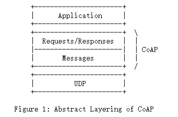
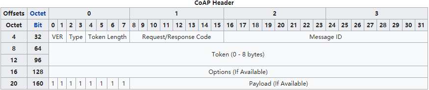
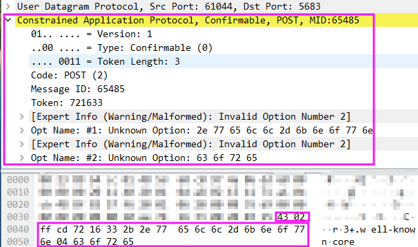
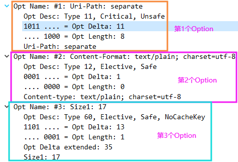

***

>Make everything connectable.

<br>
<centerhead>概念</centerhead><br>

##  1. 设计初衷
&emsp;&emsp;据[wikipedia](https://en.wikipedia.org/wiki/Constrained_Application_Protocol#CoAP_Fixed_Header:_Version,_Type,_Token_Length,_Request/Response_Code_and_Message_ID.)词条，`CoAP`协议是一种专用于[constrained devices](https://www.cisoplatform.com/profiles/blogs/classification-of-iot-devices)之间相互通信的物联网协议。其RFC文档编号为[7252](https://tools.ietf.org/html/rfc7252)，缺省端口号为`5683`。`CoAP`协议的设计初衷就是为了方便资源受限型的设备(如手机、网络摄像头等等)能够接入互联网，因为这种类型的设备无法直接使用已有的HTTP协议。


## 2. 协议特性

&emsp;&emsp;据`CoAP`的RFC文档，该协议的特性如下：

- web协议满足受限环境中的[M2M](https://en.wikipedia.org/wiki/Machine_to_machine)需求；
- **默认基于UDP协议**(可选的可靠性)，支持单播及多播请求；
- 异步消息交换；
- 低头部(报文头)开销及解析复杂度；
- URI及Content-Type支持；
- 提供简单的代理及缓存机制；
- 无状态的HTTP映射，允许通过HTTP以统一的方式提供对CoAP资源的访问或者通过CoAP交替实现HTTP的简单接口来构建代理；
- 提供可选的安全性，由[DTLS](https://en.wikipedia.org/wiki/Datagram_Transport_Layer_Security)保障；
- 支持观察模式及块传输方式；

&emsp;&emsp;值得强调的一点是，同一个`CoAP`设备即扮演客户端又承担服务器的角色。

## 3. 协议概览

&emsp;&emsp;`CoAP`协议结构概览如下图所示(摘自wikipedia)：



&emsp;&emsp;`CoAP`协议的实际报文则如下(wireshark解析结果)：



### 3.1 协议结构

&emsp;&emsp;就报文功能结构而言，`CoAP`协议由几个部分组成，即：报头(Header) + 令牌(Token) + 可选项(Options) + 定界符(Marker) + 负载(Payload)，如下所示：

```bash
+-+-+-+-+-+-+-+-+-+-+-+-+-+-+-+-+-+-+-+-+-+-+-+-+-+-+-+-+-+-+-+-+-+-+-+-+-+-+
| Header | Token(optional) | Options(optional) | Marker + Payload(optional) |
+-+-+-+-+-+-+-+-+-+-+-+-+-+-+-+-+-+-+-+-+-+-+-+-+-+-+-+-+-+-+-+-+-+-+-+-+-+-+
```

&emsp;&emsp;就报文长度特点而言，`CoAP`协议仍然采用定长+变长的方式。定长是为了方便解码器预判和识别，变长则是为了协议的可扩展性及功能保障。

&emsp;&emsp;对于`CoAP`报文而言，可选项和负载都非必须出现的，视具体情况而定。

#### 3.1.1 Header

&emsp;&emsp;协议报头是定长的，总共**4**个字节，其组成如下：

```xml
 0               1               2               3          
 0 1 2 3 4 5 6 7 0 1 2 3 4 5 6 7 0 1 2 3 4 5 6 7 0 1 2 3 4 5 6 7
+-+-+-+-+-+-+-+-+-+-+-+-+-+-+-+-+-+-+-+-+-+-+-+-+-+-+-+-+-+-+-+-+
|Ver| T |  TKL  |      Code     |           Message ID          |
+-+-+-+-+-+-+-+-+-+-+-+-+-+-+-+-+-+-+-+-+-+-+-+-+-+-+-+-+-+-+-+-+
```

&emsp;&emsp;从前往后依次为：版本号(2bit)、消息类型(2bit)、Token长度(4bit)、Code(8bit)、消息ID(8bit)。

&emsp;&emsp;TKL为0的时候即为最小头部(4字节)，由此可见`CoAP`报文的结构是相当简洁紧凑的，这就是我们上面提到的协议特性的第四点：低开销和解析复杂度。

#### 3.1.2 Token

&emsp;&emsp;协议中`Token`的长度由报头的`TKL`字段的值决定，取值范围是$[0, 8]$字节，属于变长字段。由于该值可以为0，因此我们把`Token`也视作是可选(optional)的。如果有的话，它紧跟在报头后面，如下所示：

```bash
 0                                                             3
+-+-+-+-+-+-+-+-+-+-+-+-+-+-+-+-+-+-+-+-+-+-+-+-+-+-+-+-+-+-+-+-+
|                             Header                            |
+-+-+-+-+-+-+-+-+-+-+-+-+-+-+-+-+-+-+-+-+-+-+-+-+-+-+-+-+-+-+-+-+
|   Token (if any, TKL bytes) ...
+-+-+-+-+-+-+-+-+-+-+-+-+-+-+-+-+-+-+-+-+-+-+-+-+-+-+-+-+-+-+-+-+
```

#### 3.1.2 Options

&emsp;&emsp;Options部分又可以拆分为五个部分，即：定长部分(前1个字节) + 变长的Delta/Length/Value。Options的整体结构如下：

```xml
     0   1   2   3   4   5   6   7
   +---------------+---------------+
   |               |               |
   |  Option Delta | Option Length |   1 byte
   |               |               |
   +---------------+---------------+
   \                               \
   /         Option Delta          /   0-2 bytes
   \          (extended)           \
   +-------------------------------+
   \                               \
   /         Option Length         /   0-2 bytes
   \          (extended)           \
   +-------------------------------+
   \                               \
   /                               /
   \                               \
   /         Option Value          /   0 or more bytes
   \                               \
   /                               /
   \                               \
   +-------------------------------+
```

&emsp;&emsp;其中，`Option Delta(extended)`的长度由第一个字节中的`Option Delta`的值决定，`Option Length(extended)`的长度则由第一个字节中的`Option Length`的值决定。`Option Value`的长度则由前面的`Option Delta`和`Option Legnth`共同决定，这部分较复杂，会在后续协议详解中详细阐释。

#### 3.1.3 Marker && Payload

&emsp;&emsp;Payload部分则完全是变长的了，除了前面的`Header`和`Options`，剩下的部分均被视作`CoAP`的`Payload`。为了正确识别`Payload`的起始位置，RFC规定在`Payload`前面必须要有一个字节的定界符(`Marker`)`0xFF`，如果没有则接收方会直接按错误消息处理(丢弃)，如下所示：

```xml
 0 1 2 3 4 5 6 7 0 1 2 ···  
+-+-+-+-+-+-+-+-+-+-+-+-+-+-+-+-+-+-+-+-+-+-+-+-+-+-+-+-+-+-+-+-+
|1 1 1 1 1 1 1 1|    Payload (if any) ...
+-+-+-+-+-+-+-+-+-+-+-+-+-+-+-+-+-+-+-+-+-+-+-+-+-+-+-+-+-+-+-+-+
```

### 3.2 消息模型

&emsp;&emsp;同样的，鉴于`CoAP`协议的使用场景，其消息模型势必也要设计的尽量简洁，这样才能减少不必要的开销。这就是为什么`CoAP`协议默认是基于`UDP`的原因，因为`UDP`协议是无连接的尽量交付方式。

&emsp;&emsp;同时，为了提供可靠性支持，`CoAP`协议的消息中引入了确认机制，确保消息可靠的传输到彼端。因此，`CoAP`中**请求方向**一共有**2种**类型的消息：`Confirmable`(简写为**CON**)和`Non-confirmable`(简写为**NON**)。前者要求接收方必须响应，后者则没有要求。

&emsp;&emsp;针对客户端发送来的请求消息，服务器端收到消息处理后也有**2种**类型的响应：`Acknowledgement`(简写为**ACK**)和`Reset`(简写为**RST**)。前者对客户端发送来的消息进行确认(对应**CON**消息)，后者表示客户端发送的消息存在错误(不管是**CON**消息还是**NON**消息，只要有错误服务器均会响应)。

#### 3.2.1 消息类型

&emsp;&emsp;综上所述，`CoAP`协议中一共有四种类型的消息(对应报头的`Type字段`)：

- 需要确认的消息**Confirmable**；
- 无需确认的消息**Non-confirmable**；
- 确认消息**Acknownledgement**；
- 重置消息**Reset**。

#### 3.2.2 传输模型
&emsp;&emsp;因此，`CoAP`中的消息传输模型如下：

```bash
Client              Server               Client              Server
   |                  |                     |                  |
   |   CON [0x7d34]   |                     |   NON [0x01a0]   |
   +----------------->|         vs          +----------------->|
   |                  |                     |                  |
   |   ACK [0x7d34]   |
   |<-----------------+
   |                  |
     可靠消息传输模式                        非可靠消息传输模式
```

&emsp;&emsp;对于**CON**类型的消息，接收者收到后，会返回**ACK**确认，一旦发送后，接收者无需去关心发送者是否收到**ACK**消息，因为如果发送者没有收到**ACK**确认，会自己重发一次请求。这种处理机制大大提高了处理效率。


<centerhead>深入</centerhead><br>

## 4. 协议详解

### 4.1 Header

&emsp;&emsp;报头各字段定义如下：

```bash
 0               1               2               3          
 0 1 2 3 4 5 6 7 0 1 2 3 4 5 6 7 0 1 2 3 4 5 6 7 0 1 2 3 4 5 6 7
+-+-+-+-+-+-+-+-+-+-+-+-+-+-+-+-+-+-+-+-+-+-+-+-+-+-+-+-+-+-+-+-+
|Ver| T |  TKL  |      Code     |           Message ID          |
+-+-+-+-+-+-+-+-+-+-+-+-+-+-+-+-+-+-+-+-+-+-+-+-+-+-+-+-+-+-+-+-+
```

#### 4.1.1 Version(Ver)
&emsp;&emsp;版本号，表示`CoAP`协议的版本号，2-bit无符号整数。将来可能会修改成其它值，但目前该字段必须置为`1`(二进制01)，若为其它值则报文会直接被忽略而没有任何提示。

#### 4.1.2 Type(T)
&emsp;&emsp;消息类型，表示当前消息所属的种类，2-bit无符号整数。目前共有四种，其中请求方向两种：**CON**和**NON**，响应方向两种：**ACK**和**RST**。
&emsp;&emsp;由于`CoAP`协议是基于`UDP`协议的，而`UDP`本身并不能提供类似`TCP`的可靠连接，所以为了确保传输的可靠性，`CoAP`协议自己实现了一套轻量级的可靠机制，其特点如下：

- 对于**CON**消息，采用简单的指数回退算法的`stop-and-wait`重传机制；
- 对于**CON**及**NON**消息，均提供了重复消息检测机制。

&emsp;&emsp;四种消息类型的详细信息如下表所示：
    
<table><tr><th colspan=4 style="text-align:center;">消息类型</th><th colspan=2 style="text-align:center;">Type字段值</th></tr><tr><td style="text-align:center;">消息方向</td><td style="text-align:center;">中文名称</td><td style="text-align:center;">英文全称</td><td style="text-align:center;">英文简称</td><td style="text-align:center;">十进制</td><td style="text-align:center;">二进制</td</tr><tr><td rowspan=2 style="text-align:center;">请求消息</td><td style="text-align:center;">需确认消息</td><td style="text-align:center;">Confirmable</td><td style="text-align:center;font-weight:bold;">CON</td><td style="text-align:center;">0</td><td style="text-align:center;">..00 ....</td></tr><tr><td style="text-align:center;">无需确认消息</td><td style="text-align:center;">None-confirmable</td><td style="text-align:center;font-weight:bold;">NON</td><td style="text-align:center;">1</td><td style="text-align:center;">..01 ....</td></tr><tr><td rowspan=2 style="text-align:center;">响应消息</td><td style="text-align:center;">确认消息</td><td style="text-align:center;">Acknowledgement</td><td style="text-align:center;font-weight:bold;">ACK</td><td style="text-align:center;">2</td><td style="text-align:center;">..10 ....</td></tr><tr><td style="text-align:center;">重置消息</td><td style="text-align:center;">Reset</td><td style="text-align:center;font-weight:bold;">RST</td><td style="text-align:center;">3</td><td style="text-align:center;">..11 ....</td></tr></table>
    

&emsp;&emsp;对于请求方向的**CON**和**NON**两种消息，因其用途不同，因此对这两种类型的消息有不同的要求。

##### 4.1.2.1 **CON**消息

&emsp;&emsp;对于**CON**类型的消息，它是实现可靠连接的基础，其具体要求列出如下：

- 必须包含请求/响应(用来触发**RST**消息的情况除外，这种情况可以为空)；
- 接收者必须返回**ACK**类型的消息进行确认(无法解析的需要发送拒绝消息)；
- 无法解析的**CON**消息(包括**CON**消息体为空、使用了保留的class类型1，6，7、或者消息格式错误)，接收方必须发送**RST**消息明确拒绝并忽略它；

- **ACK**消息必须包含与**CON**消息匹配的`Message ID`，消息内容可以为空，也可以包含有响应的响应；
- **RST**消息必须包含与**CON**消息匹配的`Message ID`，并且其消息内容**必须为空**；
- 未收到**ACK**或**RST**的**CON**消息，遵循时间间隔指数递增的方式进行重传，直到收到这两种消息或超过重试次数(由超时时常和重传计数器两项共同决定)为止；

##### 4.1.2.2 **NON**消息

&emsp;&emsp;对于**NON**类型的消息，没有可靠性要求，因此协议对其规定相比于**CON**消息要少的多，具体列出如下：

- 消息体**不能为空**，必须包含请求/响应；
- 接收者不能对其进行确认(**ACK**)；
- 对于无法解析的**NON**消息(包括**CON**消息体为空、使用了保留的class类型1，6，7、或者消息格式错误)，接收者需通过**RST**消息拒绝接受并忽略该消息；
- **NON**消息的发送者没有义务判断消息是否送达；

##### 4.1.2.3 其它要求

- 对于**ACK**和**RST**消息，不能通过发送**ACK**或**RST**消息来明确拒绝，只能采用忽略的方式委婉拒绝；
- 新建的**CON**消息，其初始超时时间为`[ACK_TIMEOUT, ACK_TIMEOUT * ACK_RANDOM_FACTOR]`之间的一个随机值，并且其重传计数器值为0；
- 超时触发后，若重传计数小于`MAX_RETRANSMIT`，消息立即重传，重传计数器值自增，超时时间设置为当前的两倍；
- 超时出发后，若重传计数达到`MAX_RETRANSMIT`或收到**RST**，则传输失败，重传取消；
- 某些情况下，**CON**消息的发送方可能会放弃**ACK**确认。比如，发送方的应用取消了请求、发送方通过其它途径获知消息已被接收、ICMP错误等等。

##### 4.1.2.4 组合表

&emsp;&emsp;综上，整理出下表所示的请求/响应与上述4种消息的组合使用情况表，如下所示：
<p style="text-align:center;">请求/响应与消息类型组合情况表 </p>
      
|          | CON     | NON  | ACK     | RST  |
| :--------: | :-------: | :----: | :-------: | :----: |
| **Request**  | <font color="green">&radic;</font> |  <font color="green">&radic;</font>   | <font color="red">&times;</font>  |   <font color="red">&times;</font>   |
| **Response** |   <font color="green">&radic;</font>       |   <font color="green">&radic;</font>    |   <font color="green">&radic;</font>    |  <font color="red">&times;</font>    |
| **Empty**    |    *     |   <font color="red">&times;</font>   |   <font color="green">&radic;</font>     |   <font color="green">&radic;</font>   |
     
&emsp;&emsp;表中符号说明：
- &radic; &emsp;可以组合使用；
- &times;&emsp;不能组合使用；
- \* &emsp;仅用于触发**RST**消息(`CoAP ping`)。

#### 4.1.3 Token Length(TKL)

&emsp;&emsp;Token长度，表示后面的token字段的长度，4-bit无符号整数。该字段目前取值范围为$[0, 9]$，表示目前支持的最大token长度为8字节，$[9, 15]$区间的值目前为保留值，不应出现在报文中，**凡是token字段出现这些值的报文均应被当作错误报文处理**。

#### 4.1.4 Code
&emsp;&emsp;请求/响应码，用来表示该消息属于请求还是响应，以及属于什么类型的请求/响应，8-bit无符号整数。该字段又包含了class`和`detail`两个子字段，如下所示：

```bash
  0               
  0 1 2 3 4 5 6 7
 +-+-+-+-+-+-+-+-+
 |class|  detail |
 +-+-+-+-+-+-+-+-+
```

&emsp;&emsp;由上可知，`class`占了3-bit，共$2^3=8$种可选值，`detail`各占了5-bit，均存在$2^5=32$种可选值。`class`目前有效的取值为0、2、4、5、7，其余的均为保留值(非法值)。不同的`class`所对应的`detail`的有效取值是不同的，我们将所有有效的`class`的`detail`的取值整理如下表所示：

<p style="text-align:center;">class和detail取值组合情况表 </p> 
    
<table><tr><th rowspan=2 colspan=3></th><th rowspan=1 colspan=5 style="text-align:center;">class</th></tr><tr><th style="text-align:center;">0<br>(Method)</th><th style="text-align:center;">2<br>(Success)</th><th style="text-align:center;">4<br>(Client Error)</th><th style="text-align:center;">5<br>(Server Error)</th><th style="text-align:center;">7<br>(Signaling Codes)</th></tr><tr><th rowspan=14 colspan=2>detail</th><td style="text-align:center;font-weight:bold;">0</td><td style="text-align:center;">EMPTY</td><td style="text-align:center;">--</td><td style="text-align:center;">Bad Request</td><td style="text-align:center;">Internal Server Error</td><td style="text-align:center;">Unassigned</td></tr><tr><td style="text-align:center;font-weight:bold;">1</td><td style="text-align:center;">GET</td><td style="text-align:center;">Created</td><td style="text-align:center;">Unauthorized</td><td style="text-align:center;">Not Implemented</td><td style="text-align:center;">CSM</td></tr><tr><td style="text-align:center;font-weight:bold;">2</td><td style="text-align:center;">POST</td><td style="text-align:center;">Deleted</td><td style="text-align:center;">Bad Option</td><td style="text-align:center;">Bad Gateway</td><td style="text-align:center;">Ping</td></tr><tr><td style="text-align:center;font-weight:bold;">3</td><td style="text-align:center;">PUT</td><td style="text-align:center;">Valid</td><td style="text-align:center;">Forbidden</td><td style="text-align:center;">Service Unavailable</td><td style="text-align:center;">Pong</td></tr><tr><td style="text-align:center;font-weight:bold;">4</td><td style="text-align:center;">DELETE</td><td style="text-align:center;">Changed</td><td style="text-align:center;">Not Found</td><td style="text-align:center;">Gateway Timeout</td><td style="text-align:center;">Release</td></tr><tr><td style="text-align:center;font-weight:bold;">5</td><td style="text-align:center;">FETCH</td><td style="text-align:center;">Content</td><td style="text-align:center;">Method Not Allowed</td><td style="text-align:center;">Proxying Not Supported</td><td style="text-align:center;">Abort</td></tr><tr><td style="text-align:center;font-weight:bold;">6</td><td style="text-align:center;">PATCH</td><td style="text-align:center;">--</td><td style="text-align:center;">Not Acceptable</td><td style="text-align:center;">--</td><td style="text-align:center;">--</td></tr><tr><td style="text-align:center;font-weight:bold;">7</td><td style="text-align:center;">iPATCH</td><td style="text-align:center;">--</td><td style="text-align:center;">--</td><td style="text-align:center;">--</td><td style="text-align:center;">--</td></tr><tr><td style="text-align:center;font-weight:bold;">8</td><td style="text-align:center;">--</td><td style="text-align:center;">--</td><td style="text-align:center;">Request Entity Incomplete</td><td style="text-align:center;">--</td><td style="text-align:center;">--</td></tr><tr><td style="text-align:center;font-weight:bold;">9</td><td style="text-align:center;">--</td><td style="text-align:center;">--</td><td style="text-align:center;">Conflict</td><td style="text-align:center;">--</td><td style="text-align:center;">--</td></tr><tr><td style="text-align:center;font-weight:bold;">12</td><td style="text-align:center;">--</td><td style="text-align:center;">--</td><td style="text-align:center;">Precondition Failed</td><td style="text-align:center;">--</td><td style="text-align:center;">--</td></tr><tr><td style="text-align:center;font-weight:bold;">13</td><td style="text-align:center;">--</td><td style="text-align:center;">--</td><td style="text-align:center;">Request Entity Too Large</td><td style="text-align:center;">--</td><td style="text-align:center;">--</td></tr><tr><td style="text-align:center;font-weight:bold;">15</td><td style="text-align:center;">--</td><td style="text-align:center;">--</td><td style="text-align:center;">Unsupported Content-Format</td><td style="text-align:center;">--</td><td style="text-align:center;">--</td></tr><tr><td style="text-align:center;font-weight:bold;">31</td><td style="text-align:center;">--</td><td style="text-align:center;">Continue</td><td style="text-align:center;">--</td><td style="text-align:center;">--</td><td style="text-align:center;">--</td></tr></table>
    
##### 4.1.4.1 class
&emsp;&emsp;`class`的所有取值中只有0表示请求，更准确的说，只有**GET(0.01)**、**POST(0.02)**、**PUT(0.03)**、**DELETE(0.04)**这几个`method`用来表示`CoAp`中的请求数据。而响应码则有三类，分别是2、4、5。
&emsp;&emsp;因此，更准确的说，一个报文是请求还是响应，取决于`Code`字段的前3-bit的值。

##### 4.1.4.2 detail
&emsp;&emsp;`detail`的取值并没有固定含义，需要与前面的`class`搭配，`detail`可以理解为`class`的子类，是对某种类型的`class`的进一步细分。

#### 4.1.5 Message ID
&emsp;&emsp;消息的ID(唯一标识)，16-bit无符号整数，**网络字节序**。`Message ID`用来检测重复消息以及用来匹配**CON/NON**和**ACK/RST**消息对。

&emsp;&emsp;这里需要强调的一点是：**`Message ID`是用来匹配`CoAP`中的四大类型的消息的，而消息中承载的请求/响应则是通过下面要讲的`token`来匹配的**。

##### 4.1.5.1 重复性检测

&emsp;&emsp;由于各种原因，接收者可能会多次向接收者发送相同的**CON**消息(因为**CON**需要回应，而**NON**不需要)，`Message ID`能有效的检测处这些重复的消息。

&emsp;&emsp;协议规定，对于重复的**CON**消息，每一条接收者都要逐一回应，但**对于该消息中表示的请求/响应命令，只能执行一次**。但如果消息中的请求是[幂等性](https://stackoverflow.com/questions/1077412/what-is-an-idempotent-operation)的或者可以按照幂等性的方式进行处理，这种约束可以放宽，比如：

- 对于[幂等性](https://stackoverflow.com/questions/1077412/what-is-an-idempotent-operation)的请求，为了保证只处理一次，接收者需要维护相应的状态信息，如果维护这些状态的开销远大于多次处理的开销，那么接收者可以对请求命令多次执行；
- 对于某些非幂等性的请求，如果应用层的语义允许折衷，某些受限服务器可能也会放宽对重复消息的约束要求(情况与上条类似)；

&emsp;&emsp;对于重复的**NON**消息，接收者可根据语义适当放宽上述一般性的原则并静默忽略这些重复消息，同时**对于该消息中表示的请求/响应命令，只能执行一次**。

##### 4.1.5.2 消息配对

&emsp;&emsp;此外，前面已经提到过，对于**CON**消息，接收者必须做出响应，即使用**ACK**表示已接收或者**RST**表示拒收。而对于**NON**消息则无需进行确认，但如果要拒收也必须要发送**RST**。`Message ID`就是用来匹配这些成对的消息的，使得发送者能够准确的知道接收者是在对哪条消息做出回应。

&emsp;&emsp;对于消息配对，还需要注意以下关键点：
- `Message ID`由**CON/NON**消息的发送者生成，随附在`CoAP`报文报头中；
-  接收者响应的消息中**必须包含`Message ID`**，并且必须保持与要回应的消息的一致；
-  在消息交换生命周期(`EXCHANGE_LIFETIME`，是指**CON**消息发出开始，到接收到响应的这个时间间隔)内，`Message ID`不可重用；
-  RFC文档并没有规定如何生成这个`Message ID`，但是为了避免`off-path attack`，建议保存这个ID的变量用随机值来初始化；
-  `Message ID`中还必须编码发送者的身份信息，因为接收者同一时间可能会收到来自不同发送者的具有相同ID的信息，如果发送者不把自己的信息编码进去，接收者无法区分发送者。


### 4.2 Token

&emsp;&emsp;`Token`是一个单一结构的字段，没有子字段，如下所示：

```bash
+-+-+-+-+-+-+-+-+-+-+-+-+-+-+-+-+-+-+-+-+-+-+-+-+-+-+-+-+-+-+-+-+
|   Token (if any, TKL bytes) ...
+-+-+-+-+-+-+-+-+-+-+-+-+-+-+-+-+-+-+-+-+-+-+-+-+-+-+-+-+-+-+-+-+
```

&emsp;&emsp;上面已经提到过，`Token`是用来匹配消息中承载的请求~响应对的。它是为了方便客户端区分发送的众多请求的标志，因此也可以称作**请求ID**。对于`Token`，协议做了如下明确规定：

- 每一条消息中都应该包含`Token`(长度为0的时候视作包含了一个空串)；
- 每一个请求中包含的由客户端生成的`Token`服务器在响应中都必须携带相同的`Token`(不能修改)；
- `Token`的生成应保证在同一对源~目的终端中是唯一的，不同的源-目的终端对(比如不同的源端口号)中则可以使用相同的`Token`；
- 对于未使用TLS的客户端，应该使用一个非显著可得的、随机的`Token`以确保响应不会被欺骗；
- 直接接入常规互联网的客户端应该确保`Token`至少具有32-bit的随机性；
- 服务器收到的未被生成的`Token`应被透明化处理，不对该数值做任何假设；
- 当且仅当客户端与服务器之间没有其它`Token`在用或者客户端的请求都是`piggybacked response`(即刻响应，几乎没有时延)时，`Token`才可以为空；

#### 4.2.1 请求/响应配对

&emsp;&emsp;请求~响应对的精确匹配原则如下：

- 响应的源端必须和请求的目的端严格一致；
- 对于`piggybacked response`，**CON**消息中的`Message ID`必须与其**ACK**响应中的`Message ID`严格一致，并且请求/响应中的`Token`必须严格一致。
- 对于单独的响应，则只要求响应与其原始请求中的`Token`一致即可；
- 若客户端收到的响应并非所预期，则应该直接拒绝。


### 4.3 Options

&emsp;&emsp;对于`CoAP`的报文来说，`Options`这个字段是可选的，可能有也可能没有。这个字段由2个定长的字段和3个变长的字段组成，如下所示：

```bash
     0   1   2   3   4   5   6   7
   +---------------+---------------+
   |  Option Delta | Option Length |   1 byte
   +---------------+---------------+
   |     Option Delta(extended)    |   0-2 bytes
   +-------------------------------+
   |     Option Length(extended)   |   0-2 bytes
   +-------------------------------+
   |         Option Value          |   0 or more bytes
   +-------------------------------+
```

&emsp;&emsp;其中`Option Delta`和`Option Length`为定长字段，分别占用了4-bit，无符号整数。

&emsp;&emsp;`Option Delta(extended)`和`Option Length(extended)`为变长字段，是前面`Option Delta`、`Option Length`的补充，其长度取决于前面`Option Delta`和`Option Length`的值，在$[0, 2]$字节范围内选取，无符号整数。

&emsp;&emsp;`Option Value`是`Option`的负载(真正内容)，变长字段，其长度取决于前面的`Option Length`和`Option Length(extended)`，其格式类型则取决于前面的`Option Delta`和`Option Delta(extended)`。

#### 4.3.1 Option Delta

&emsp;&emsp;`Option Delta`是`Option`中相当重要的字段，它决定了`Option`的负载(`Value`)该如何被解析以及数据的格式类型，同时还编码了一些额外的属性信息，它还决定了该`Option`在单个消息中是否能重复出现。

##### 4.3.1.1 Option Number

&emsp;&emsp;需要注意的是，`Option Delta`这个字段的值单独来看是没有意义的，需要与`Option Delta(extended)`字段(如果存在的话)的值结合，同时需要与之前出现过的所有`Option`的`Option Delta`、`Option Delta(extended)`的值做累和形成`Option Number`，用这个累和值用来判断`Option Value`表示的是什么数据。

&emsp;&emsp;因此`Option Number`是为了方便确定当前`Option`所属的类型而虚拟出来的概念，并非实际的字段。

&emsp;&emsp;假定要计算当前第$n$个`Option`时的`Option Numbers`值，则有：
$$
ONs = \sum_{i=1}^{n}ON_i = \sum_{i=1}^{n}(OD_i + OD^{ext}_{i})
\tag{4 - 3 - 2}
$$

&emsp;&emsp;式中：
&emsp;&emsp;&emsp;$ONs$—— 表示当前的`Option Numbers`的值；
&emsp;&emsp;&emsp;$ON_i$—— 表示第$i$个`Option`的`Option Number`的值；
&emsp;&emsp;&emsp;$OD_i$—— 表示第$i$个`Option`中`Option Delta`字段的值；
&emsp;&emsp;&emsp;$OD^{ext}_i$—— 表示第$i$个`Option`中`Option Delta(extended)`字段的值；

&emsp;&emsp;文字比较抽象，下面辅以图文说明：



<div style="text-align:center;font-weight:bold;">图4-1&emsp;&emsp;Wireshark解码出的Options示意图</div>
&emsp;&emsp;对应的`Option Number`的详细计算步骤如下所示：

```bash
Option Number(初始值)= 0
1# Option:
  Option Delta= 11
  Option Delta(extended)= 0(无)
  Option Number= Option Delta + Option Delta(extended) + Option Number
               = 11 + 0 + 0
               = 11(Uri-Path)
2# Option:
  Option Delta = 1
  Option Delta(extended)= 0(无)
  Option Number= 1 + 0 + 11(Uri-Path)
               = 12(Content-Format)
               
3# Option:
  Option Delta = 13
  Option Delta(extended)= 35
  Option Number= 13 + 35 + 12(Content-Format)
               = 60(Size1)                
```

&emsp;&emsp;`Option Number`的另一个用处是用来编码其它附加信息，准确点说是三类附加信息，其对应编码的结构如下所示：

```bash
  0   1   2   3   4   5   6   7
+---+---+---+---+---+---+---+---+
|           | NoCacheKey| U | C |
+---+---+---+---+---+---+---+---+
            Last Byte
```

&emsp;&emsp;第一类信息：当前`Option`是属于紧急(**Critical**)还是可选(**Elective**)的，用`Option Number`对应二进制最后一个字节的最后一个bit编码(上图中字母C位置)，若最后一位为1则是**Critical**，若为0则是**Elective**。即当`Option Number`为奇数时为**Critical**，偶数时则是`Elective`。

&emsp;&emsp;第二类信息：当前`Option`是否可以安全的进行转发。用`Option Number`对应二进制最后一个字节的倒数第二个bit编码(上图中字母U位置)，若为1则是**Unsafe**，若为0则是**Safe**。

&emsp;&emsp;第三类信息：当前`Option`是否为`Cache-Key`。用`Option Number`对应二进制最后一个字节的倒数第3~5(共3)个bit编码，当且仅当`Option`是`Safe`(即第6个bit为0)且这3个bit均置为1的时候，表示**NoCacheKey**，除此之外均为**Cache-Key**。

&emsp;&emsp;上述编码信息提取的代码如下：

```c++
bool is_critical = option_number & 1
bool is_safe = option_number & 2
bool is_cache_key = (option_number & 0x1E) == 0x1C
```

#### 4.3.2 Option Delta(extended)

&emsp;&emsp;由于`Option Delta`只占用了4-bit，其取值范围有限($[0, 16]$)，需要进行扩展，因此就有了这个字段。该字段的长度取决于`Option Delta`的值，如下表所示：
    
<table><tr><th rowspan=2 colspan=2></th><th colspan=2 rowspan=1 style="text-align:center;">Option Delta(extended)</th><th rowspan=2 style="text-align:center;">Option Delta值计算方式</th></tr><tr><th style="text-align:center;">长度(字节)</th><th style="text-align:center;">取值范围</th></tr><tr><th rowspan=4>Option Delta字段值</th><td style="text-align:center;font-weight:bold;">0~12</td><td style="text-align:center;">0</td><td style="text-align:center;">0</td><td style="text-align:center;">Option Delta</td></tr><tr><td style="text-align:center;font-weight:bold;">13</td><td style="text-align:center;">1</td><td style="text-align:center;">0~255</td><td style="text-align:center;">Option Delta(extended) + 13</td></tr><tr><td style="text-align:center;font-weight:bold;">14</td><td style="text-align:center;">2</td><td style="text-align:center;">0~65535</td><td style="text-align:center;">Option Delta(extended) + 269</td></tr><tr><td style="text-align:center;font-weight:bold;">15</td><td style="text-align:center;">未定义</td><td style="text-align:center;">未定义</td><td style="text-align:center;">保留值，暂不使用。<br>此时Delta Option所属字节必须为0xFF。</td></tr></table>


#### 4.3.3  Option Length

&emsp;&emsp;这个字段作用单一，仅仅用来表示`Option`中`Option Value`的实际长度，4-bit，无符号整数。与`Option Delta`类似，它也需要结合`Option Length(extended)`字段的值才能计算出最终`Option Value`的长度。

#### 4.3.4 Option Length(extended)

&emsp;&emsp;同样的，由于`Option Length`只占用了4-bit，其取值范围也是$[0, 16]$个字节，因此需要进行扩展，以便`Option`能承载长的数据。该字段的长度也取决于`Option Length`的值，如下表所示：
    
<table><tr><th rowspan=2 colspan=2></th><th colspan=2 rowspan=1 style="text-align:center;">Option Length(extended)</th><th rowspan=2 style="text-align:center;">Option Length值计算方式</th></tr><tr><th style="text-align:center;">长度(字节)</th><th style="text-align:center;">取值范围</th></tr><tr><th rowspan=4>Option Length字段值</th><td style="text-align:center;font-weight:bold;">0~12</td><td style="text-align:center;">0</td><td style="text-align:center;">0</td><td style="text-align:center;">Option Length</td></tr><tr><td style="text-align:center;font-weight:bold;">13</td><td style="text-align:center;">1</td><td style="text-align:center;">0~255</td><td style="text-align:center;">Option Length(extended) + 13</td></tr><tr><td style="text-align:center;font-weight:bold;">14</td><td style="text-align:center;">2</td><td style="text-align:center;">0~65535</td><td style="text-align:center;">Option Length(extended) + 269</td></tr><tr><td style="text-align:center;font-weight:bold;">15</td><td style="text-align:center;">未定义</td><td style="text-align:center;">未定义</td><td style="text-align:center;">保留值，暂不使用。<br>此时Delta Length所属字节必须为0xFF。</td></tr></table>


#### 4.3.5 Optioin Value
&emsp;&emsp;这个字段是`Option`的负载部分，它具体表示什么含义以及是什么数据类型需要根据累和求出的`Option Numer`来判断。RFC文档中目前定义了**15**种含义，**4**种数据格式。结合前面提到的`Option`三大属性有如下组合表：
```bash
+-----+---+---+---+---+----------------+--------+--------+------------------+
| No. | C | U | N | R | Name           | Format | Length | Default          |
+-----+---+---+---+---+----------------+--------+--------+------------------+
|   1 | √ |   |   | √ | If-Match       | opaque | 0-8    | (none)           |
|   3 | √ | √ | - |   | Uri-Host       | string | 1-255  | (dst IP(request) |
|   4 |   |   |   | √ | ETag           | opaque | 1-8    | (none)           |
|   5 | √ |   |   |   | If-None-Match  | empty  | 0      | (none)           |
|   7 | √ | √ | - |   | Uri-Port       | uint   | 0-2    | (dst UDP port)   |
|   8 |   |   |   | √ | Location-Path  | string | 0-255  | (none)           |
|  11 | √ | √ | - | √ | Uri-Path       | string | 0-255  | (none)           |
|  12 |   |   |   |   | Content-Format | uint   | 0-2    | (none)           |
|  14 |   | √ | - |   | Max-Age        | uint   | 0-4    | 60               |
|  15 | √ | √ | - | √ | Uri-Query      | string | 0-255  | (none)           |
|  17 | √ |   |   |   | Accept         | uint   | 0-2    | (none)           |
|  20 |   |   |   | √ | Location-Query | string | 0-255  | (none)           |
|  35 | √ | √ | - |   | Proxy-Uri      | string | 1-1034 | (none)           |
|  39 | √ | √ | - |   | Proxy-Scheme   | string | 1-255  | (none)           |
|  60 |   |   | √ |   | Size1          | uint   | 0-4    | (none)           |
+-----+---+---+---+---+----------------+--------+--------+------------------+
```

&emsp;&emsp;表中：

&emsp;&emsp;&emsp;No.——`Option Number`的累和值；
&emsp;&emsp;&emsp;C——`Option`是否`Critical`；
&emsp;&emsp;&emsp;U——`Option`是否`Unsafe`；
&emsp;&emsp;&emsp;N——`Option`是否`NoCacheKey`；
&emsp;&emsp;&emsp;R——`Option`在同条消息种是否可重复出现；
&emsp;&emsp;&emsp;Name——`Option Value`的含义；
&emsp;&emsp;&emsp;Format——`Option Value`的数据类型；
&emsp;&emsp;&emsp;Length——`Option Value`的有效长度范围；
&emsp;&emsp;&emsp;Default——`Option Value`的缺省值；

&emsp;&emsp;说明：
&emsp;&emsp;&emsp;1.  因为`NoCacheKey`只有在`Safe`的情况下才有意义，因此所有`Unsafe`的这部分用短横线填充，表示无意义；
&emsp;&emsp;&emsp;2.  上述表格中仅定义了部分`Option Number`，对于未定义的部分，如何处理需要根据`Option Delta`类型来判断，见下文。

&emsp;&emsp;对于上述表格中未出现的其它`Option Number`，如何处理需要根据`Option`是`Critical`还是`Elective`类型，处理准则如下：

- 未知的`Elective`类型的`Option`，接收方必须静默忽略，不做解析；
- **CON**请求消息中未知的`Critical`的`Option`，接收方必须返回4.02(Bad Option)响应，且该响应中必须包含无法识别的`Option(s)`描述信息；
- **CON**响应消息或**ACK**的`piggybacked`消息中未知的`Critical`的`Option`，必须被拒绝；
- **NON**消息中未知的`Critical`的`Option`，必须被拒绝；
- 上述所有准则仅适用于非代理端，至于代理端的，以后有时间再补充。


### 4.4 Marker && Payload

&emsp;&emsp;至此，`CoAP`报文只剩下最后一个部分：负载。这个部分是可选的，可能出现也可能不出现。为了准确的知道负载的起始位置，就在负载前设置一个字节的`Marker`标记。`CoAP`负载的长度为`Marker`后的第一个字节开始，到整个`UDP`报文负载的结尾，结构如下所示：

```bash
+-+-+-+-+-+-+-+-+-+-+-+-+-+-+-+-+-+-+-+-+-+-+-+-+-+-+-+-+-+-+-+-+-+-+-+-+-+-+-+-+-+-+
| UDP Header |                         UDP Payload                                  |
+-+-+-+-+-+-+-+-+-+-+-+-+-+-+-+-+-+-+-+-+-+-+-+-+-+-+-+-+-+-+-+-+-+-+-+-+-+-+-+-+-+-+
| UDP Header |  CoAP Header + Token + Options   |1 1 1 1 1 1 1 1| Payload (if any)  |
+-+-+-+-+-+-+-+-+-+-+-+-+-+-+-+-+-+-+-+-+-+-+-+-+-+-+-+-+-+-+-+-+-+-+-+-+-+-+-+-+-+-+
```

#### 4.4.1 Marker

&emsp;&emsp;定长字段，只占1个字节，内容也是固定值`0xFF`。`Marker`字段**当且仅当负载长度不为0才会出现**，否则消息应该被当作错误消息处理。

#### 4.4.2 Payload

&emsp;&emsp;RFC文档中只是对`CoAP`报文中消息大小的上限做了规定，并没有定义其下限。如果消息大小比IP报文大小大，就可能会生成一些无法预知的IP分片。

&emsp;&emsp;由上面的描述可知，`CoAP`报文的负载只是通过定界符`Marker`来标记起始位置，通过UDP报文负载的末尾来标记其结束位置。报文中并没有能反映这个具体长度的字段。如果`CoAP`的报文被IP分片或分布在多个UDP报文的负载中，那么将导致`CoAP`报文无法正常解析。

&emsp;&emsp;因此，一个被合理封装的`CoAP`消息应该能轻松的放进单个IP报文中以避免被分片，同时也能容纳在一个UDP报文中。

&emsp;&emsp;如果到某个目的地址的传输路径上的**MTU**值未知，RFC文档推荐将这个值假定为**1280**。如果无法获知UDP的头部长度，RFC推荐将`CoAP`报文的长度上限设置为**1152**字节，`CoAP`的负载大小上限设置为**1024**字节。

&emsp;&emsp;RFC同时指出，`CoAP`协议对于报文大小的选择在IPv6上以及大部分IPV4网络中都能工作的很好，但在IPv4网络中很难完全保证没有IP分片，因为某些非常规IPv4网络可能会将其MTU限制的非常非常低，比如68字节。这种情况只给UDP的负载留下了40个字节的空间。

&emsp;&emsp;`CoAP`报文的大小对于具体实现来说至关重要，大多数实现都会使用缓冲区来缓存报文。当某些受限设备可用资源过于捉襟见肘而无法分配上述大小的缓冲区时，可能会遵循如下策略原则放弃使用**DTLS**：

- 当报文被存入过小的缓冲区时，可根据自己需求决定是否丢弃剩下尚未接收的报文转而处理已接收部分，这样能确保报头以及`Option`能被解析，此时服务器应该中断正在处理的请求并返回4.13响应。


### 4.5 后记

&emsp;&emsp;RFC阅读起来耗时耗力，以上内容虽然没有囊括协议的所有细节，但已经足以对`CoAP`报文有较为全面的理解并编写解析代码，就暂时写到这里，后续有时间再来补充剩余部分。

### 4.6 参考文献
&emsp;&emsp;1.  [CoAP RFC](https://tools.ietf.org/html/rfc7252)；
&emsp;&emsp;2.  [物联网协议之CoAP协议开发学习笔记之协议详解](https://segmentfault.com/a/1190000011533594#item-4)；
&emsp;&emsp;3.  [物联网协议之CoAP协议开发学习笔记](https://segmentfault.com/a/1190000011516219)；
&emsp;&emsp;4.  [CoAP协议简介](https://www.jianshu.com/p/7fec0916a0d3)。

