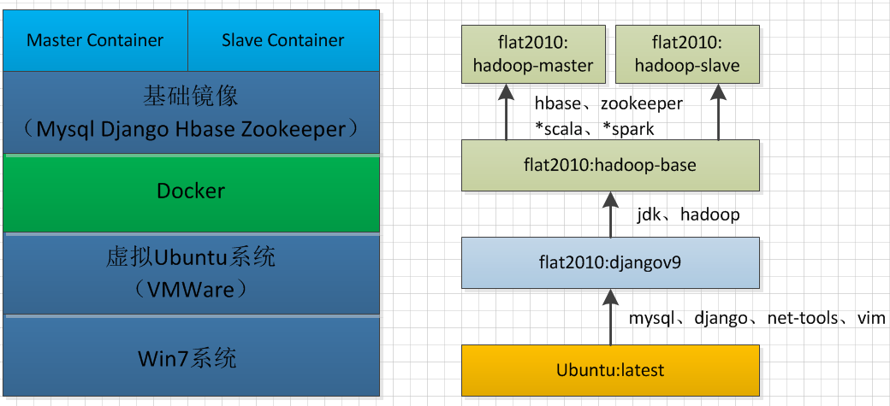
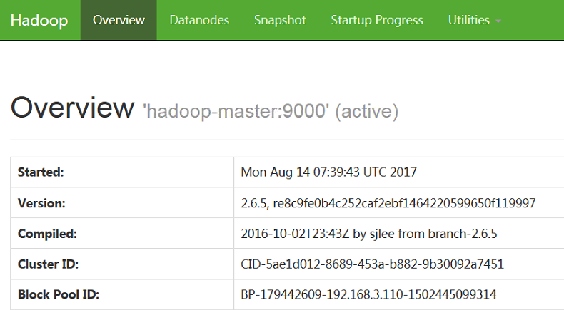
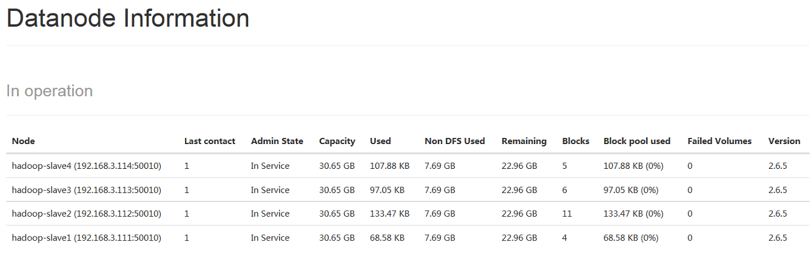
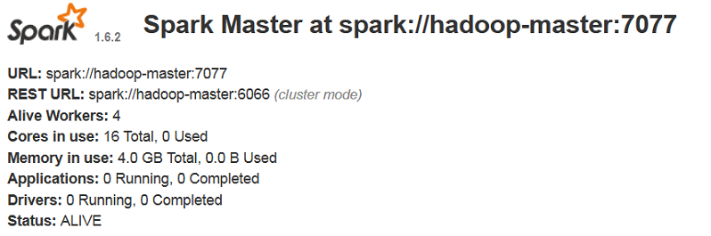
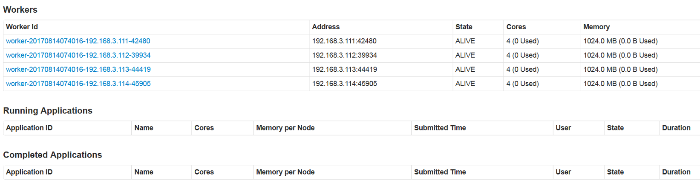
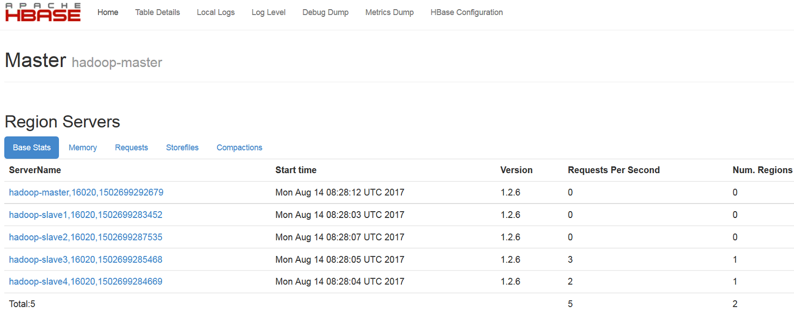
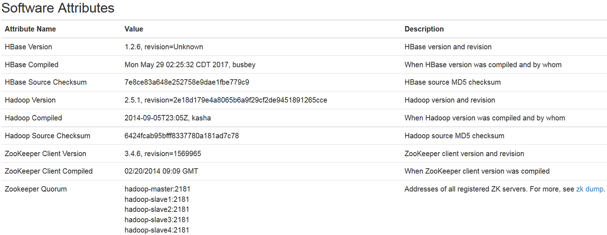

><font color=#0000FF face="微软雅黑" size=4>I wish life is just like a docker app, when U screwed it up, U can just start it over and nothing happened.</font>

## 一、Docker简介  
### 1. What is Docker?
&emsp;&emsp;<font color=#000000 size=5>**什**</font>么是[Docker？](https://www.docker.com/what-docker)用一句话来表述就是：<font color="blue">Docker is the world's leading software container platform</font>，即Docker是一种软件容器平台。对于个人开发者来说，它允许你把你的应用程序和所需的环境一起打包，然后在其它任意一个同样支持Docker的环境下重新部署。比如你辛辛苦苦在某台电脑上开发的程序，拿到另一台上却跑不起来（缺少库、依赖等等之类的），使用Docker就不会有这样的问题了。Docker的作用可以简单粗暴的理解为ghost装机。来自Docker官方的这个图或许能给你些提示。
<!-- more -->
<div style="text-align:center"  >

<div align='center'>图1-1　　What's Docker?</div> 
</div>

&emsp;&emsp;当然，对于运营商（Operator）以及企业（Enterprise）用户来说，其功能远超想象，作为普通使用者的我们并不关心，在此也不过多介绍，感兴趣的可以查阅官方网站。
### 2. Why Docker?
&emsp;&emsp;Docker的作用有点类似虚拟机软件如VMWare、Virtualbox等，这些产品功能已经十分强大了，那为何还要重复造轮子弄个虚拟化的软件？答案就在下面的传统虚拟机和Docker的架构对比图中：  
<div style="text-align:center"  >

<div align='center'>图1-2　　Docker架构图</div> 
</div>

<div align='center'>图1-3　　VM架构图</div> 

&emsp;&emsp;从上面的架构可以看出，相比于传统的虚拟机软件，Docker底层复用程度更高，所有的App共用**一套OS**，应用之间则通过所谓的**Container**实现隔离（解耦），而传统的VM要实现App的隔离，只能通过新增一套OS（也即重新创建一个虚拟机）实现。
&emsp;&emsp;Docker的优点就在于：
&emsp;&emsp;&emsp;&emsp;1. **轻量**，即使在一台配置一般的笔记本上，也可以轻轻松松创建和启动许多container；
&emsp;&emsp;&emsp;&emsp;2. 高效，其创建、启动、停止等操作速度都较快，毫不逊色于VMware等软件；
&emsp;&emsp;&emsp;&emsp;3. 免费，其社区版完全免费，并且对于个人使用来说，功能完全够用；
&emsp;&emsp;&emsp;&emsp;4. **便捷**，使用Docker你可以非常方便的打包、分发、部署你的应用，保证跨平台的一致性，实现持续部署和测试；
&emsp;&emsp;&emsp;&emsp;5. 云化，支持部署到云端，包括Amazon的AWS、Microsoft的Azure等等；

### 3. Which platforms?
&emsp;&emsp;截止到本文成稿时（2017-08-12）为止，已支持平台如下：

| | 桌面 | 服务器 | 云 |
| ------------- | :-------------: | :-------:| :------: |
| 社区版 | MacOS、Windows、</br> Linux(Desktop Distribution) | Windows Server、CentOS、Debian、Fedora、SLES、Ubuntu | AWS、Azure |
| 企业版 | 同社区版 | Windows Server、CentOS、Debian、Fedora、</br> Oracle Linux、RHEL、SLES、Ubuntu | 同社区版 |
&emsp;&emsp;从上面可以看出，就支持的平台而言，社区版相对于企业版仅仅少了两个商业化Linux操作系统RHEL、Oracle Linux的支持。

### 4. Basic terms?
&emsp;&emsp;要理解Docker的东西，可能需要掌握一些基本术语：

| 中文 | 英文 | 解释 | 备注 |
| :-------: | :-------------: | :-------:| :------: |
| 镜像 | Image | 可以理解为ISO文件，根据镜像我们可以创建一个实体的container | 也可以理解为面向对象编程中的类 |
| 容器 | Container | 可以理解为ISO文件安装好的系统 | 也可以理解为面向对象编程中的对象 |
| 仓库 | Repository | 存放镜像的地方，分私有和公有仓库，</br> 里面的镜像又分为官方和非官方 | 我们可以从仓库获取(pull)或向仓库上传(push)想要的镜像 |

## 二、Docker应用实践
&emsp;&emsp;鉴于Docker的优良特性，它目前已被个人开发者和企业广泛使用。最初接触Docker是在公司，当时我们需要在服务器上新增一些新功能，由于服务器太过重要，不敢轻易去动，新功能的开发又需要依赖于服务器上的一些应用和环境，然后就尝试把服务器上需要的应用和环境打包，用Docker在另一台机器上构建了一个开发环境，等开发、测试都OK后，再部署到生产服务器上。
&emsp;&emsp;用了之后发现这个功能蛮不错的，特别对于一些搭建和配置非常繁琐的app或环境（比如分布式计算平台），可以大大节省你的工作量。像分布式计算平台这种，不仅仅配置繁琐容易出错，对硬件要求也不低，比如你想构建一个5个节点的集群，要么在一台配置非常好的服务器上建五个独立的虚拟机实现，要么买五台配置一般的普通商用PC来搭建。这两种方案，不仅仅耗资较多，而且使用上不太方便，比如我想在公司也能用这个集群，你总不能把集群背到公司去吧。当然你可以给集群买个域名、弄个公网IP啥的，到哪都可以访问，但这也意味着把你的集群直接暴露在互联网上，其安全性不言而喻，况且公网IP也不是你想弄就能弄得，什么移动、爱普的渣网就别想了，花生壳免费版只支持电信，域名也是要花钱的。
&emsp;&emsp;有了Docker，所有的问题都不是问题了，一台配置稍好（内存4G+，推荐8G，CPU双核+，推荐酷睿2以后的）的笔记本或者台式机就能满足你的要求，黑威够，Cluster-In-Pocket！
### 2.1 需要软件
&emsp;&emsp;按本文部署所需软件列表及其依赖关系如下：

|  | 版本号 | 软件包全名 | 依赖软件或环境 | 作用 |
| :-------: | :-------:| :------: | :-------: | :-------: |
| Win7 | X86_64 | -- | 一台电脑 | 安装VMWare |
| *VMware | 12 | VMware12 | Win7</br> X86_64 | 创建一个Ubuntu虚拟机 |
| *Ubuntu | 16.04</br> X86_64 | ubuntu-16.04-desktop-amd64.iso | VMware12 | 给Docker提供寄生环境 |
| Docker | 1.30 | docker</br>（使用apt-get install docker安装） | Ubuntu16.04_X86_64</br> Kernel-4.4.0-21-generic | 分布式计算平台的基础 |
| latest | -- | ubuntu:latest | Docker</br> （通过Docker pull 命令从镜像站点拉取） | 所有后续Docker镜像之母 |
| *django | v9 | flat2010:djangov9 | ubuntu:latest | hadoop-base镜像的基础镜像，相比于latest镜像，安装了django、mysql等一些软件 |
| hadoop-base | -- | flat2010:hadoop-base | flat2010:djangov9</br> jdk-8u111-linux-x64.tar.gz</br> hadoop-2.6.5.tar.gz</br>  | 集群master和slave的共同基础镜像 |
| hadoop-master | -- | flat2010:hadoop-master | <font color="blue" size=4>@hadoop-base</br> <font color="blue" size=4>@zookeeper-3.4.10.tar.gz</br> hbase-1.2.6-bin.tar.gz</br> <font color="blue" size=4>@scala-2.10.6.tgz</font></br> <font color="blue" size=4>@spark-1.6.2-bin-hadoop2.6.tgz</font> | 创建Hadoop集群master节点，同时也是Spark Master的基础镜像 |
| hadoop-slave | -- |  flat2010:hadoop-slave | 同上  | 创建Hadoop集群slave节点，同时也是Spark Slave的基础镜像 |
| *docker-compose | 1.15.0 |  docker-compose</br> （通过pip install安装） | hadoop-slave</br>  hadoop-master</br> python2.7(with pip installed) | 创建Spark集群master、slave节点 |

&emsp;&emsp;<font color="red" >注：表格中第一列带“*”号的属于非必须的，你可以根据自己需求增删，依赖软件或环境中以@开头的软件包属于构建Spark平台要用到的或者属于非Hadoop必须的软件，也请根据自己需求定制。</font>

&emsp;&emsp;表格可能不太直观，可以结合下面两个图来理解：


### 2.2 部署说明
&emsp;&emsp;如果想跟着本教程一步一步安装部署，请务必先阅读下面的安装部署说明。如果觉得麻烦，可以直接拷贝相关文件，自己build镜像。当然最最省心的办法是，拷贝我已经构建好的镜像，直接运行即可，<font color="red">下载链接见文章末尾。</font>
#### 2.2.1 紧耦合问题
&emsp;&emsp;Docker的设计初衷就是为了便于隔离不同的App，实现松耦合，因此Docker镜像的构建原则基本上是一个App对应一个镜像，这样每一个Container仅仅包含一个独立的App，任何一个Container中的App出了问题都不会影响其他Container中的App。但是本教程并没有严格按照这个约束来做，而是把Hadoop、Spark、Hbase、Zookeeper整合到了一起，之所以这么做是考虑到一来本身这些软件耦合度就较高，分开部署反而不太方便（实际上Spark、Hbase的运行都要依赖Hadoop）。二来，我的主要需求是All-in-one，而并非应用之间的独立性，因此耦合性并非考虑重点。
#### 2.2.2 可选安装包
&emsp;&emsp;本教程中有些安装包并非必须的，请根据自己需求进行增删。比如Zookeeper可以用Hbase自带的，而如果不需要Spark平台的话，Scala和Spark的安装包都可以不要，还能减小构建出来的镜像的大小。

#### 2.2.3 集群规划
&emsp;&emsp;集群大小根据自己机器配置来，但是有一点务必要注意，规划集群的时候，集群数量（含master）最好是奇数，而不是偶数（因为Zookeeper的leader选举算法需要根据得票数来确定leader，偶数个节点很容易导致选票持平问题）。本教程集群规划如下表：

| 容器名 | 主机名 | IP地址 | 节点类型 | 所属网络 |
| :-------: | :-------: | :------: | :-------: | :-------: |
| spark-master | spark-master | 192.168.3.110 | Namenode | cluster/bridge |
| spark-slave1 | spark-slave1 | 192.168.3.111 | Datanode | cluster/bridge |
| spark-slave2 | spark-slave2 | 192.168.3.112 | Datanode | cluster/bridge |
| spark-slave3 | spark-slave3 | 192.168.3.113 | Datanode | cluster/bridge |
| spark-slave4 | spark-slave4 | 192.168.3.114 | Datanode | cluster/bridge |
&emsp;&emsp;<font color="blue">集群大小：5，所属网段：192.168.3.0/24。</font>

#### 2.2.4 静态IP问题
&emsp;&emsp;要用集群的话，肯定需要静态IP，并且需要指明hostname，需要在启动Container时指定Container的IP地址，以及hostanme。如果使用docker-compose的话，在yml文件中使用如下参数配置：
```YAML
# 指定容器IP，隶属于名为cluster的网络
networks:
  cluster:
    ipv4_address: 192.168.3.114
		  
# 定义名为cluster的网络
networks:
  cluster:
    driver: bridge  //网络类型为桥接
    ipam: //如果网络类型是bridge的话，需要同时定义ipam参数
      driver: default
      config:
      -
        subnet: 192.168.3.0/24 //网段是根据2.2.3节集群规划确定的
```

#### 2.2.5 *部署文件说明
&emsp;&emsp;**<font color="red">注意：如果是直接拷贝镜像或者配置文件去使用而不需要做修改的可以直接跳到安装部分</font>**。部署过程中所需要的文件，其存放目录及作用如下：
```bash
# 目录树图
../docker_hadoop
├── addfiles //yml配置文件中所有以ADD命令添加的文件，主要是一些软件的配置文件
├── autoscripts //一些自动化脚本，方便操作使用，包括集群环境配置，启动、停止等
├── copyfiles  //yml配置文件中所有以COPY命令添加的文件，包括软件配置文件，环境初始化脚本等
├── spark_compose //spark集群启动的docker-compose配置文件
├── tgzfiles //所有后缀为.tgz、.tar.gz的安装包
└── ymlfiles //构建集群所需镜像的yml格式的配置文件
```
&emsp;&emsp;文件的树形列表会比较长，其中大部分文件都是安装Hadoop、Hbase、Zookeeper、Spark所必须配置的文件，**本文不会对这些软件的安装做说明，需要的请自行百度相关资料。**
```bash
../docker_hadoop
├── addfiles
│   ├── core-site.xml  //Hadoop集群的HDFS、数据目录等参数配置文件
│   ├── hadoop-env.sh  //Hadoop集群的系统环境配置文件
│   ├── hdfs-site.xml  //HDFS的相关参数配置文件，相对hdfs-site.xml.std增加了一些参数
│   ├── hdfs-site.xml.std  //HDFS最开始配置文件
│   ├── mapred-env.sh  //Map-Reduce系统环境配置文件
│   ├── mapred-site.xml  //Map-Reduce端口等配置文件
│   ├── slaves  //slave节点配置文件
│   ├── spark-defaults.conf   //Spark启用history的配置文件
│   ├── spark-env.sh   //Spark系统环境配置文件
│   ├── yarn-env.sh   //Yarn系统环境配置文件
│   └── yarn-site.xml  //Yarn端口等参数配置文件
├── autoscripts
│   ├── assign_static_ip.sh  //使用pipwork给容器分配静态IP的脚本
│   ├── create_bridge.sh  //创建桥接网络的脚本（仅在用pipwork分配网络时需要）
│   ├── initial_hadoop_all.sh  //初次启动Hadoop前需要初始化的所有相关环境，包括格式化Namenode、设置Hadoop、Zookeeper的环境变量
│   ├── initial_spark_all.sh  //初次启动Spark前需要初始化的所有相关环境，包括格式化Namenode、设置Spark、Hadoop、Zookeeper的环境变量
│   ├── remove_all_containers.sh  //自动分析并删除与集群相关的Container脚本
│   ├── remove_cluster_images.sh  //自动分析并删除与集群相关的Images脚本（使用前务必看下代码，防止误删）
│   ├── start_all_in_order.sh  //按顺序启动集群（Hadoop -> Zookeeper -> HBase -> Spark）
│   ├── start_cluster_container.sh  //启动所有与集群有关的Contaner
│   ├── start_hadoop.sh  //仅仅启动Hadoop
│   ├── start_hbase.sh  //仅仅执行启动HBase命令（不会先启动Hadoop，不推荐手动执行，请封装在start_all_in_order.sh中来执行）
│   ├── start_spark.sh  //仅仅执行启动Spark命令（不会先启动Hadoop等，不推荐手动执行，请封装在start_all_in_order.sh中来执行）
│   ├── start_zookeeper.sh  //仅仅执行启动Zookeeper命令（不会先启动Hadoop等，不推荐手动执行，请封装在start_all_in_order.sh中来执行）
│   ├── stop_all_container.sh  //停止所有与集群有关的Contaner
│   ├── stop_all_in_order.sh  //按顺序停止集群（Spark -> HBase -> Zookeeper -> Hadoop）
│   ├── stop_hadoop.sh  //仅仅执行停止Hadoop命令（不会先停止HBase等，不推荐手动执行，请封装在stop_all_in_order.sh中来执行）
│   ├── stop_hbase.sh  //仅仅执行停止HBase命令（不会停止Hadoop等，不推荐手动执行，请封装在stop_all_in_order.sh中来执行）
│   ├── stop_spark.sh  //仅仅执行停止Spark命令（不会去停止Hadoop等，不推荐手动执行，请封装在stop_all_in_order.sh中来执行）
│   └── stop_zookeeper.sh  //仅仅执行停止Zookeeper命令（不会去停止Hadoop等，不推荐手动执行，请封装在stop_all_in_order.sh中来执行）
├── build_base.sh  //自动构建master和slave基础镜像脚本
├── build_master_and_server.sh  //自动构建master和slave镜像脚本
├── copyfiles
│   ├── format_hadoop.sh    //格式化Namenode配置文件
│   ├── hbase-env.sh    //HBase系统环境配置文件
│   ├── hbase-site.xml    //HBase其它参数配置文件
│   ├── hosts.bak    //集群主机列表文件
│   ├──regionservers    //HBase的regionservers列表
│   ├── initial_spark.sh    //初始化Spark环境脚本，封装在initial_spark_all.sh、initial_hadoop_all.sh中使用
│   ├── initial_zookeeper.sh    //初始化Zookeeper环境脚本，封装在initial_spark_all.sh、initial_hadoop_all.sh中使用
│   ├── master_bootstrap.sh  //Master容器启动后自动执行操作，完成集群主机列表设置、开启ssh守护进程
│   ├── setenv_hadoop.sh  //初始化Hadoop环境变量，封装在start_all_in_order.sh中使用
│   ├── slave_bootstrap.sh  //Slave容器启动后自动执行操作，完成集群主机列表设置、开启ssh守护进程
│   ├── ssh_config  //ssh的配置文件（关闭添加远程主题host需要确认功能）
│   └── zoo.cfg  //Zookeeper的配置文件
├── Dockerfile
├── spark_compose
│   └── docker-compose.yml  //使用docker-compose up命令启动Spark或者Hadoop集群的配置文件
├── tgzfiles
│   ├── hadoop-2.6.5.tar.gz  //Hadoop2.6.5安装包
│   ├── hbase-1.2.6-bin.tar.gz  //HBase1.2.6安装包
│   ├── jdk-8u111-linux-x64.tar.gz  //JDK1.8.111安装包
│   ├── scala-2.10.6.tgz  //Scala2.10.6安装包
│   ├── spark-1.6.2-bin-hadoop2.6.tgz  //Spark1.6.2安装包
│   └── zookeeper-3.4.10.tar.gz  //Zookeeper3.4.10安装包
└── ymlfiles
    ├── base.yml  //构建基础镜像yml配置文件
    ├── master.yml  //构建Master节点镜像配置文件
    └── slave.yml  //构建Slave节点镜像配置文件
```

### 2.3 部署步骤
&emsp;&emsp;在Docker上部署Hadoop完全分布式和在虚拟机或者实体机上部署其实大同小异，配置好相关文件，分发到相应的主机上，然后在Master节点上初始化和启动即可。只不过在Docker上部署时，这些工作都定义在**`Dockerfile`**中，通过构建所谓的**`镜像`**来实现。
#### 2.3.1 确定要安装软件
&emsp;&emsp;先确定自己需要哪些组件，配置好2.2.5节中对应的参数文件，放到2.2.5节所述的目录下。比如你只想安装Hadoop，只需要把hdfs-site.xml、mapred-env.sh等文件拷贝进去就是。
&emsp;&emsp;<font color="red" size=4>注意：如无特别说明，本节的命令、脚本执行均是在**Docker宿主机上**而非容器内完成的。</font>
#### 2.3.2 构建基础镜像
&emsp;&emsp;先修改**`ymlfiles`**目录下的**`base.yml`**，增删组件，再切换到**`build_base.sh`**脚本所在目录，并在当前目录下执行：
```bash
./build_base.sh
或者
bash build_base.sh
```
&emsp;&emsp;如果提示权限不足，请加**`sudo`**执行。**`build_base.sh`**代码如下：
```bash
#!/bin/bash
# build the base images for master and slave
cp ymlfiles/base.yml Dockerfile
sudo docker build -t="flat2010:hadoop-base" .
```
&emsp;&emsp;代码很简单，先拷贝**`ymlfiles`**目录下的**`base.yml`**文件到当前目录下覆盖已有的**`Dockerfile`**，然后根据这份拷贝出来的**`Dockerfile`**生成一个**`REPOSITORY:TAG`**为“flat2010:hadoop-base”的基础Docker镜像。**`base.yml`**的内容这里就不贴了，它的主要任务就是解压、拷贝相关文件，创建hadoop账户和群组（hadoop账户的初始密码设置为123456），启动ssh守护进程，设置ssh免密登录等等，网上随便搜下Docker的知识就能看懂了。**注意最后一行代码的最后还有个**`“.”`**，这可不是手误。**
&emsp;&emsp;<font color="red">这里需要强调的是，该基础镜像是基于我自己修改保存的“djangov9”镜像构建的，因为加了Mysql、Django等软件，所以构建出来的基础镜像会有些偏大，如果不需要的话可以直接基于官方最新镜像“ubuntu:latest”构建。</font>
&emsp;&emsp;构建结束并且提示成功的话，可以通过**`sudo docker images`**看到刚刚构建好的基础镜像：
```bash
REPOSITORY          TAG                 IMAGE ID            CREATED             SIZE
flat2010            hadoop-base         6b3d949f2d6a        4 days ago          1.99GB
flat2010            djangov9            9e21705da454        5 days ago          999MB
···           ···            ···            ···            ···            ···
flat2010/ubuntu     v1                  666037795a72        8 days ago          187MB
ubuntu              latest              14f60031763d        3 weeks ago         120MB

```
#### 2.3.3 构建集群镜像
&emsp;&emsp;同上，先修改**`ymlfiles`**目录下的**`master.yml`**、**`slave.yml`**文件，根据自己需求增删组件，再在**`build_master_and_slave.sh`**脚本所在目录下执行：
```bash
./build_master_and_slave.sh
或者
bash build_master_and_slave.sh
```
&emsp;&emsp;脚本会自动构建好集群所需的Master节点和Slave节点镜像。**`build_master_and_slave.sh`**脚本代码如下：
```bash
#!/bin/bash

cp ymlfiles/slave.yml Dockerfile
sudo docker build -t="flat2010:hadoop-slave" .

cp ymlfiles/master.yml Dockerfile
sudo docker build -t="flat2010:hadoop-master" .
```
&emsp;&emsp;这部分代码也不复杂，先拷贝**`ymlfiles`**目录下的**`slave.yml`**为**`Dockerfile`**，构建一个**`REPOSITORY:TAG`**为“flat2010:hadoop-slave”的Slave节点镜像，然后拷贝**`ymlfiles`**目录下的**`master.yml`**为**`Dockerfile`**，构建一个**`REPOSITORY:TAG`**为“flat2010:hadoop-master”的Master节点镜像。**`master.yml`**以及**`slave.yml`**的内容这里也不贴了，其作用也无非就是解压、拷贝相关文件，更改目录权限，设置环境变量等等。唯一需要说明的一点是，文件最后一行：
```bash
# 文件输出截断
ADD addfiles/spark-defaults.conf /usr/local/spark-1.6.2-bin-hadoop2.6/conf/
COPY copyfiles/initial_spark.sh /home/hadoop
ENTRYPOINT ["/home/hadoop/master_bootstrap.sh"]
```
&emsp;&emsp;该行代码会在利用Image实例化的Container启动时，去执行这个脚本。这个脚本的作用在前面也备注了，无非就是设置主机名、启动ssh守护进程，其代码如下：
```bash
#!/bin/bash  
sudo cp /tmp/hosts.bak /etc/hosts
sudo /usr/sbin/sshd -D
```
&emsp;&emsp;<font color="red">之所以单独使用一个脚本去执行这些工作，是因为最初我在Dockerfile中操作时死活不生效，主要是/etc/hosts文件无论如何不允许修改（加sudo依然），只有走曲线。</font>
&emsp;&emsp;**`master.yml`**相对于**`slave.yml`**只是多了些修改环境变量和启动集群的脚本文件，同时**`slave.yml`**暴露了一些Zookeeper通信需要的端口（2181、2888、3888）出来。
&emsp;&emsp;构建结束并且提示成功的话，同样通过**`sudo docker images`**查看刚刚构建好的基础镜像：
```bash
REPOSITORY          TAG                 IMAGE ID            CREATED             SIZE
flat2010            hadoop-master       9dd58e6f1180        2 days ago          3.49GB
flat2010            hadoop-slave        71d2a20b8a3e        2 days ago          3.49GB
flat2010            hadoop-base         6b3d949f2d6a        4 days ago          1.99GB
···            ···            ···            ···
ubuntu              latest              14f60031763d        3 weeks ago         120MB
```
&emsp;&emsp;可以看到，由于加了较多软件包，编译生成的集群镜像非常大（约3.5G），所以**强烈建议剔除一些不需要的软件。**

#### 2.3.4 创建并运行容器
&emsp;&emsp;先修改**`spark_compose`**目录下的**`docker-compose.yml`**，然后在该目录下执行：
```bash
sudo docker-compose up
```
&emsp;&emsp;成功执行后，使用命令**`sudo docker ps`**查看创建和启动起来的所有Container：
```bash
CONTAINER ID        IMAGE                    COMMAND                  CREATED             STATUS              PORTS                                                                                                                                                                                                                                                                                                                                                            NAMES
3ad515acbab3        flat2010:hadoop-master   "/home/hadoop/mast..."   2 days ago          Up 10 seconds       0.0.0.0:2181->2181/tcp, 0.0.0.0:4040->4040/tcp, 22/tcp, 0.0.0.0:7077->7077/tcp, 0.0.0.0:8042->8042/tcp, 0.0.0.0:8080->8080/tcp, 0.0.0.0:8088->8088/tcp, 0.0.0.0:9000-9001->9000-9001/tcp, 0.0.0.0:16010->16010/tcp, 0.0.0.0:16201->16201/tcp, 0.0.0.0:16301->16301/tcp, 0.0.0.0:18080->18080/tcp, 0.0.0.0:19888->19888/tcp, 8000/tcp, 0.0.0.0:50070->50070/tcp   spark-master
7e58661fa37f        flat2010:hadoop-slave    "/home/hadoop/slav..."   2 days ago          Up 12 seconds       22/tcp, 2181/tcp, 2888/tcp, 3888/tcp, 8000/tcp, 8080/tcp, 0.0.0.0:8071->8081/tcp                                                                                                                                                                                                                                                                                 spark-slave2
98a68bab400d        flat2010:hadoop-slave    "/home/hadoop/slav..."   2 days ago          Up 12 seconds       22/tcp, 2181/tcp, 2888/tcp, 3888/tcp, 8000/tcp, 8080/tcp, 0.0.0.0:8081->8081/tcp                                                                                                                                                                                                                                                                                 spark-slave1
31a94a5d40f8        flat2010:hadoop-slave    "/home/hadoop/slav..."   2 days ago          Up 12 seconds       22/tcp, 2181/tcp, 2888/tcp, 3888/tcp, 8000/tcp, 8080/tcp, 0.0.0.0:8061->8081/tcp                                                                                                                                                                                                                                                                                 spark-slave3
281ada44cd48        flat2010:hadoop-slave    "/home/hadoop/slav..."   2 days ago          Up 12 seconds       22/tcp, 2181/tcp, 2888/tcp, 3888/tcp, 8000/tcp, 8080/tcp, 0.0.0.0:8051->8081/tcp
```
&emsp;&emsp;上面的输出结果可以看出来，Master节点映射了许多端口出来，让我们即使在宿主机外面也能访问，关于端口映射（PORTS）和端口暴露（EXPOSE）的详细说明，参见后面章节。
&emsp;&emsp;对于**`docker-compose.yml`**，需要说明的有几点，首先是在启动时用参数**`ports`**指定要映射出来的端口：
```YAML
ports:
   - "8042:8042"
   - "19888:19888"
   - "50070:50070"  //Hadoop集群的webui地址
   - "8088:8088"  //Spark集群的webui地址
   - "9000:9000"
   - "9001:9001"
   - "2181:2181"
   - "16010:16010"  //HBase的webui地址
   - "16301:16301"
   - "16201:16201"
   - "4040:4040"
   - "8080:8080"
   - "7077:7077"  //提交作业需要
   - "18080:18080"
```
&emsp;&emsp;其次，考虑灾备，我把一些关键数据（比如HDFS数据、HBase数据）存放在宿主机上而非Container中，这样即使包含集群的Container删除或者损毁了，集群数据并不会丢失，重新创建好集群后，还能使用之前的集群数据。通过**`volumes`**参数，可以在容器中指定要挂载的外部目录：
```YAML
volumes:
   - /home/develop/hadoop_datas:/home/hadoop/hadoop_datas
   - /home/develop/spark_datas:/home/hadoop/spark_datas
```
&emsp;&emsp;另外，Slave节点也映射了一个端口8081，这是为了方便查看Spark集群各个节点的信息，这里又存在一个问题，每个Container的8081都需要映射出来，但是宿主机只有一个8081端口，所以这些Container中只能有一个可以映射到原生的8081端口，剩下的只能改用其它端口。这里采取的是把8081留给slave1，剩下的slave2、slave3、slave4分别对应8071、8061、8051端口。即访问 http://宿主机:8071 就相当于访问slave1的8081端口。

#### 2.3.5 初始化环境
&emsp;&emsp;进入**`autoscripts`**目录，执行脚本**`initial_spark_all.sh（安装了Spark集群）`**或者**`initial_hadoop_all.sh（安装了Hadoop集群）`**初始化Container的环境，这些脚本会先登录容器，然后执行容器里面的相应脚本，以**`initial_hadoop_all.sh`**代码来说，如下：

```bash
#!/bin/bash
# format namenode of hadoop
docker exec -ti `sudo docker ps | grep "flat2010:hadoop-master" | awk '{print $1}'` bash -c "source /home/hadoop/format_hadoop.sh;"

# set hadoop environment
docker exec `sudo docker ps | grep "flat2010:hadoop-master" | awk '{print $1}'` bash -c "source /home/hadoop/setenv_hadoop.sh"

# initial zookeeper
docker exec `sudo docker ps | grep "flat2010:hadoop-master" | awk '{print $1}'` bash -c "source /home/hadoop/initial_zookeeper.sh"
```

&emsp;&emsp;代码先是查找镜像名为**`flat2010:hadoop-master`**的Container，获取Container ID，然后使用**`exec`**命令进入该容器，执行容器中的**`format_hadoop.sh`**、**`setenv_hadoop.sh`**、**`initial_zookeeper.sh`**脚本，执行完成后，会自动退出容器（但不会停止或销毁），完成环境初始化配置。
&emsp;&emsp;**注意执行format_hadoop.sh脚本会格式化Namenode，所以一般是在第一次安装好Hadoop后尚未启动前调用上面两个initial_xxx脚本**。
&emsp;&emsp;此外，第一行进入容器的代码之所以要加入参数**`-ti`**，是因为如果不以这种交互方式执行，格式化Namenode提示输入**`YES/NO?`**时，容器将无法获取你的输入，从而一直卡在那个提示界面。
&emsp;&emsp;<font color="blue">当然如果你不嫌麻烦的话，这些初始化工作也可以先在宿主机上进入Master容器，然后手动敲代码，一条一条去执行，我比较懒，就整合到脚本里面了。</font>

#### 2.3.6 启动集群
&emsp;&emsp;进入**`autoscripts`**目录，执行脚本**`start_all_in_order.sh`**来启动集群，它会按照特定顺序（Hadoop ->Zookeeper -> HBase -> Spark）来确保集群正确的被启动。其代码如下：
```bash
#!/bin/bash
# start hadoop first
./start_hadoop.sh
	
# start zookeeper
./start_zookeeper.sh
	
# start hbase 
./start_hbase.sh
	
# start spark
./start_spark.sh
```
&emsp;&emsp;从代码来看，实际上是按先后顺序分别去调用了几个启动脚本。**一般情况下，不推荐单独去执行这几个脚本中的某个。**如果没有安装相应的软件的话，注掉就可以了。
&emsp;&emsp;执行脚本时，会有一些提示信息，比如Zookeeper选中了哪个节点作为**`leader`**，Worker的启动情况等等，如下：
```bash
# 输出截断
···
==========================================================================
==========================================================================
ZooKeeper JMX enabled by default
Using config: /usr/local/zookeeper-3.4.10/bin/../conf/zoo.cfg
inetaddr:192.168.3.112
inetaddr:127.0.0.1
Mode: leader
==========================================================================
==========================================================================
ZooKeeper JMX enabled by default
Using config: /usr/local/zookeeper-3.4.10/bin/../conf/zoo.cfg
inetaddr:192.168.3.111
inetaddr:127.0.0.1
Mode: follower
==========================================================================
==========================================================================
···
# 输出截断
```

#### 2.3.7 查看集群
&emsp;&emsp;启动完成后，可以在Docker宿主机或者VMWare宿主机上查看相应的集群信息，比如在访问 http://hadoop-master:50070 即可查看Hadoop集群信息，如下图2 -1 、2 - 2所示：





&emsp;&emsp;访问 http://hadoop-master:8080 即可查看Spark集群信息，如下图2 -3 、2 - 4所示：





&emsp;&emsp;访问 http://hadoop-master:16010 即可查看HBase信息，如下图2 -5 、2 - 6所示：





&emsp;&emsp;至此，集群部署完成！

### 2.4 集群管理
&emsp;&emsp;为了方便集群、Docker容器的管理，编写了一些批量自动化操作脚本，这些脚本都位于**`autoscripts`**目录下。脚本功能参见前面的**2.2节部署说明**。
#### 2.4.1 停止集群
&emsp;&emsp;进入**`autoscripts`**目录，执行脚本**`stop_all_in_order.sh`**来启动集群，它会按照特定顺序（HBase ->Zookeeper -> Spark -> Hadoop）来确保集群正确的被关闭。其代码如下：

```bash
#!/bin/bash
# stop hbase 
./stop_hbase.sh
    
# start zookeeper
./stop_zookeeper.sh
    
# stop spark 
./stop_spark.sh
    	
# stop hadoop at last 
./stop_hadoop.sh
```
&emsp;&emsp;同样的，**一般情况下，不推荐单独去执行这几个脚本中的某个。**执行脚本时，也会有相应的提示信息输出。

#### 2.4.2 停止容器
&emsp;&emsp;要停止容器，有几种方式：
&emsp;&emsp;&emsp;&emsp; 1. 进入**`autoscripts`**目录，执行脚本**`stop_all_container.sh`**，该脚本会停止Hadoop和Spark集群相关的所有容器；
&emsp;&emsp;&emsp;&emsp; 2.  进入**`spark_compose`**目录，执行命令**`sudo docker-compose stop`**，推荐使用该命令；
&emsp;&emsp;&emsp;&emsp; 3.  进入**`spark_compose`**目录，执行命令**`sudo docker-compose down`**，该命令会停止和**删除所有用yml文件编排启动的容器**，<font color="red" size=4>**谨慎使用！**</font>

#### 2.4.3 重启容器
&emsp;&emsp;要重启容器，有几种方式：
&emsp;&emsp;&emsp;&emsp; 1. 进入**`autoscripts`**目录，执行脚本**`start_cluster_container.sh`**，该脚本会重启Hadoop和Spark集群相关的所有容器；
&emsp;&emsp;&emsp;&emsp; 2. 进入**`spark_compose`**目录，执行命令**`sudo docker-compose start`**，推荐使用该命令，但该命令只能启动已存在的容器，无法新建；
&emsp;&emsp;&emsp;&emsp; 3. 进入**`spark_compose`**目录，执行命令**`sudo docker-compose up`**，创建（不存在、镜像有更新、被依赖容器重建）或启动（已有）容器，在启动容器前，会检查之前的容器，确保容器的唯一性（**`CONTAINER ID`**不变），并且会把旧容器的数据拷贝出来；

#### 2.4.4 删除容器
&emsp;&emsp;要删除容器，有几种方式：
&emsp;&emsp;&emsp;&emsp; 1.  进入**`spark_compose`**目录，执行命令**`sudo docker-compose down`**，该命令会停止和**删除所有用yml文件编排启动的容器**，<font color="red" size=4>**谨慎使用！**</font>
&emsp;&emsp;&emsp;&emsp; 2. 进入**`autoscripts`**目录，执行脚本**`remove_all_containers.sh`**，该脚本会**删除所有容器（不管是与集群有关还是无关）**，<font color="red" size=4>**谨慎使用！**</font>
&emsp;&emsp;&emsp;&emsp; 3. 执行**`sudo docker rm Name/ID`**命令，该命令会**删除指定名字或ID的容器**，<font color="blue" size=4>**推荐！**</font>

#### 2.4.5 删除镜像
&emsp;&emsp;进入**`spark_compose`**目录，执行脚本**`remove_cluster_images.sh`**，会删除**`TAG`**为hadoop-master和hadoop-slave的这两个Docker镜像。


### 2.5 遇到的问题
&emsp;&emsp;关于如何在Docker上部署Hadoop，网上有一些资料，但是都比较零散，并且我的需求跟大多数都不太一样，所以在折腾过程中还是填了不少坑，特此记录。
#### 2.5.1 免密登录问题
&emsp;&emsp;按照Hadoop安装教程指导，配置SSH远程免密登陆后，在启动集群时发现虽然不需要输入密码，但是每次启动集群、每登录一个节点都会提示有新的主机，是否添加公钥到信任列表，如下：
```bash
The authenticity of host 'spark-slave (192.168.3.111)' can't be established.
ECDSA key fingerprint is SHA256:XXXXXXXXXXXXXXXXXXXXXXXXXXXXXXXXXXXXXXXXXXXXXXXXXXX.
Are you sure you want to continue connecting (yes/no)?
```
&emsp;&emsp;每次都要手动确认，比较烦，所以就修改了ssh的相关配置文件，关闭了这个确认交互，改动的文件为**`ssh_config（该文件位于/etc/ssh目录下`**，在该文件中加入了两行代码：
```bash
    StrictHostKeyChecking no
    UserKnownHostsFile /dev/null
```
&emsp;&emsp;这样每次登陆远程主机就不会要求输入`yes`来确认了。**<font color="red" size=4>但是请务必注意，因为不做公钥检查，所以存在较大安全隐患，比如中间人攻击等等。</font>**

#### 2.5.2 网络冲突
&emsp;&emsp;最开始我并没有使用docker-compose来设定集群IP，就用到了**`brctl、pipwork`**工具来创建和管理桥接网络，后来使用docker-compose构建spark集群时，定义的静态网络与用brctl工具创建的网络因为网段相同而引发冲突，导致集群无法正常访问。解决办法是更改网段，或者删除**`brctl`**创建的网络即可。

#### 2.5.3 默认shell
&emsp;&emsp;创建hadoop账户时，之前没有指定默认shell类型，远程登陆仅容器后只有一个提示符$，执行命令：
```bash
$ echo $SHELL
```
&emsp;&emsp;可以看到当前的shell类型是**`/bin/sh`**而不是**`/bin/bash`**，使用**`chsh`**改变shell类型提示不能更改。解决办法是在构建基础镜像hadoop-base时，指定shell类型，原来的**`base.yml`**中创建用户代码为：
```bash
RUN useradd -m hadoop -g hadoop -p 123456
```
&emsp;&emsp;更改后为：
```bash
RUN useradd -m hadoop -g hadoop -p 123456  -s /bin/bash
```

#### 2.5.4 Docker-compose安装
&emsp;&emsp;Docker是没有自带Docker-compose命令的，需要先安装这个软件。Docker-compose的安装有多种方法，可以使用**`curl`**，也可以使用**`pip`**，我是用的**`pip`**安装的，安装好后版本号为**`docker-compose version 1.15.0, build e12f3b9`**，在Docker的宿主机上安装Docker-compose需要安装python及pip，执行命令如下：
```bash
$ sudo apt-get install python-pip python-dev build-essential 
$ sudo pip install --upgrade pip 
$ sudo pip install --upgrade virtualenv
$ sudo pip install docker-compose
```

#### 2.5.5 Spark的4040
&emsp;&emsp;Spark的4040网址只有在任务执行期间才能查看，要在任务结束后仍然可以查看，需要配置spark-history。

#### 2.5.6 环境脚本失效
&emsp;&emsp;shell中按照**`./xxx.sh 或 bash xx.sh`**方式运行脚本配置系统环境变量时（特别是一些命令别名alias）可能不生效，改用命令**`source xxx.sh`**即可。

#### 2.5.7 找不到资料
&emsp;&emsp;最开始用Docker-compose配置静态IP时，找了好多资料，都没有讲如何给容器创建指定网络并分配指定网段，有也是语焉不详，后来还是去官网**`Docs`**查到的，所以当百度或谷歌搜不到你要的资料时，不妨耐下性子啃啃官方英文文档，或许会有意想不到的收获。

## 三、结语
&emsp;&emsp;白天工作，晚上深夜加班赶稿，修修改改，缝缝补补，用了一周多才写完。也只有这样才不会有时间去想一些事吧！
### 3.1 待完善
&emsp;&emsp;由于时间仓促，所以一些自动化脚本写的比较粗糙，镜像规划也不是特别好，实际上Master和Slave节点可以共用一套Image，完全不需要为了几个小文件搞成单独的两套。后期优化和完善的地方有：
- Master和Slave镜像合并；
- 集群镜像精简；
- 自动化脚本细化、整合；


### 3.2 Docker知识
#### 3.2.1 常用命令分类
- 容器启停 — <font color="blue">docker [run|start|stop|restart|kill|rm|pause|unpause] </font>
- 容器运维 — <font color="blue">docker [ps|inspect|top|attach|events|logs|wait|export|port] </font>
- 容器更改 — <font color="blue">docker [commit|cp|diff] </font>
- 镜像仓库 — <font color="blue">docker [login|pull|push|search] </font>
- 镜像管理 — <font color="blue">docker [images|rmi|tag|build|history|save|import] </font>
- 其他 — <font color="blue">docker [info|version] </font>

#### 3.2.2 常用命令速查
- docker version | info 查看Docker版本 | 系统信息
- docker run -t -i container-name /bin/bash 以交互方式运行一个容器，运行后执行/bin/bash
- docker ps -a | -l 查看所有容器（包含停止的） | 最近一次启动的容器信息
- docker stop | start | kill | restart Name/ID 停止 | 启动 | 杀死 | 重启 指定容器
- docker logs Name/ID 从只等容器中读取日志
- docker diff Name/ID 查看指定容器中被改变的目录或文件（A.增加的 D.删除的 C.改变的）
- docker top Name/ID 显示指定容器的进程信息
- docker cp Name/ID : container_path outer_path 从指定容器中拷贝文件/目录到本地（宿主机）
- docker images 查看所有镜像信息
- docker pull repository:image 从网上指定仓库拉取指定镜像
- docke push username/repository:tag 推送名为标签为tag的镜像到用户username的仓库repository（推送前需要先使用docker tag local username/repository:tag给本地镜像打上对应TAG）
- docker save -o image.tgz image 导出指定镜像为压缩文件image.tgz
- docker load (--input image.tar) | (< image.tar) 从名为image.tar的压缩包加载一个镜像
- docker login 登录到docker hub
- docker rmi image 删除名为image的镜像
- docker rm container 删除名为container的容器，强制删除（运行中的无法删除）需要加参数-f。
- docker search image 在Docker hub中搜索名为image的镜像
- docker stats 查看容器占用资源情况，包括CPU、内存、带宽
- docker exec -ti/-d container /bin/bahs 使用exec以后台（-d）或交互方式（-ti）启动容器
- docker commit -m="my commit log" --author="flat2010" container_id repository/image 将容器ID为container_id的容器的修改保存为仓库名/镜像名为repository/image的新镜像，指定作者为flat2010，更新日志为"my commit log"
- docker attach contaner  挂在到名为contaner的容器中运行，一旦按下ctrl+c，容器就会停止
- docker built -t image dockerfile_dir 以dodkerfile_dir目录中的Dockerfile为蓝本构建一个名为image的镜像
- docker inspect image 查看镜像image的详细信息（**打印的信息会非常多**）

#### 3.2.3 暴露和映射区别
&emsp;&emsp;通过参数**`EXPOSE`**指定的端口称为暴露端口，这样的端口只能在容器之间相互访问时使用，在宿主机上式无法访问的。而通过参数**`PORT`**指定的端口称为映射端口，是允许在任意地方（比如宿主机）访问的。


### 3.3 相关文件
- 链接 https://pan.baidu.com/s/1mhJcR6g 密码: tp3e （Hadoop等相关安装包即配置文件）
- 链接 https://pan.baidu.com/s/1qXW2adQ 密码: 68d9 （Master、Slave镜像）

### 3.4参考文档
 - http://www.worldhello.net/2010/04/08/1026.html SSH公钥检查问题
 - http://www.linuxdiyf.com/linux/15953.html SHELL设置环境变量问题
 - http://blog.csdn.net/u012554102/article/details/47102433 Zookeeper完全分布式安装
 - http://blog.csdn.net/hwwn2009/article/details/40000881/ Zookeeper完全分布式安装
 - http://www.cnblogs.com/K-artorias/p/7153751.html  Hbase完全分布式安装
 - http://blog.csdn.net/hwwn2009/article/details/40015907 Hbase完全分布式安装
 - http://blog.csdn.net/javastart/article/details/43735343 Spark History安装配置
 - http://www.cnblogs.com/luogankun/p/3981645.html Spark History安装配置
 - http://blog.csdn.net/surp2011/article/details/53191570 Spark History安装配置
 - http://stark-summer.iteye.com/blog/2218995 Spark History安装配置

 - https://docs.docker.com/ Docker官方文档网站