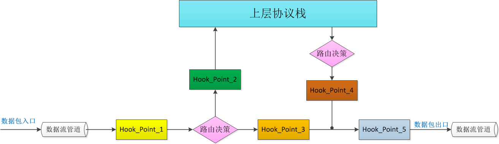
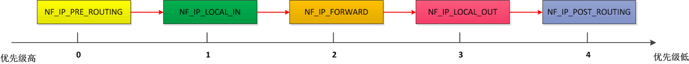
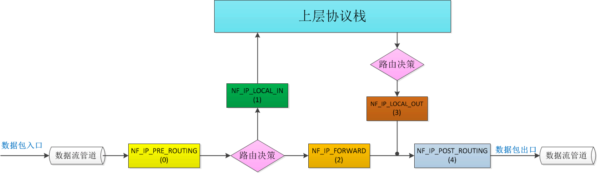
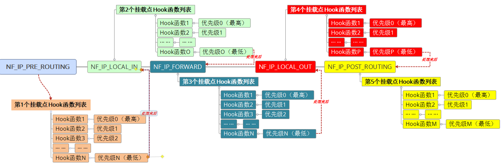
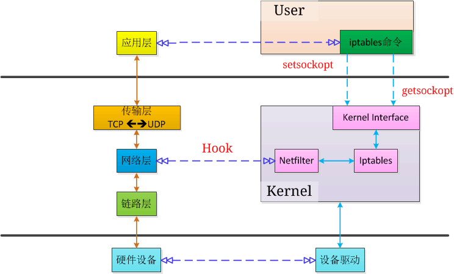

><font color=#0000FF face="微软雅黑" size=4>Read the fucking source code!</font>
***


## 一、概述
### 1.1 What's Netfilter？  
```bash
root@developer#:info netfilter
* Description:
    netfilter.org is home to the software of the packet filtering 
framework inside the Linux 2.4.x and later kernel series. Software 
commonly associated with netfilter.org is iptables.  

    Software inside this framework enables packet filtering, network 
address [and port] translation (NA[P]T) and other packet mangling. It 
is the re-designed and heavily improved successor of the previous Linux 
2.2.x ipchains and Linux 2.0.x ipfwadm systems.  

    netfilter is a set of hooks inside the Linux kernel that allows 
kernel modules to register callback functions with the network stack. 
A registered callback function is then called back for every packet 
that traverses the respective hook within the network stack.

    iptables is a generic table structure for the definition of rulesets. 
Each rule within an IP table consists of a number of classifiers (iptables 
matches) and one connected action (iptables target). 
 
    netfilter, ip_tables, connection tracking (ip_conntrack, nf_conntrack) 
and the NAT subsystem together build the major parts of the framework.

* Usage:
    ··· ···
```
　　<font color=#000000 size=3><font color=#000000 size=3>以上内容摘自netfilter项目官方网站 http://www.netfilter.org/index.html </font>
### 1.2 中文概述
　　<font color=#000000 size=3>从上面1.1的叙述中可以了解到，Netfilter是Linux上（≥2.4.X）继ipfwadm、ipchains之后的一个框架（防火墙）。三者在时间线上的关系为：</font>
　　<font color=#0000FF size=2>ipfwadm　　　　　　ipchains　　　　　　netfilter</font>
　　<font color=#000000 size=2>　　|　　　　　　　　　|　　　　　　　　　|</font>
　　<font color=#000000 size=2>=============================================></font>
　　<font color=#FF0000 size=2>　2.0.X　　　　　　　2.2.X　　　　　　　2.4.X</font>
　　<font color=#000000 size=3>其核心思想有两点：</br>　　1.Hook function（钩子/回调函数）。</br>　　2.Hook point（挂载点）。</font>
#### 1.2.1 HookPoint(挂载点)
　　<font color=#000000 size=3>它提供的挂载点均处于数据包传输流程中的关键位置，众多挂载点让用户可以在不同的地方对这些数据包进行操作，从而实现强大的数据包处理功能。下面是这些挂载点的一个示意图1-1：</font>

<div align='center'>图1-1　　挂载点示意图</div>
　　<font color=#FF0000 size=3>说明：本图参考自 http://blog.chinaunix.net/uid-23069658-id-3160506.html </br></font>
　　<font color=#000000 size=3>由上图可知共有5个挂载点，其中IPV4的五个挂载点在源代码(include/uapi/linux/netfilter_ipv4.h)中的定义如下：</font>
```c

Linux内核版本：3.10.0.327.36.3.el7.x86_64
发行版本：Centos7_1511_X64

****文件输出截断
42
43 /* IP Hooks */
44 /* After promisc drops, checksum checks. */
45 #define NF_IP_PRE_ROUTING		0
46 /* If the packet is destined for this box. */
47 #define NF_IP_LOCAL_IN		1
48 /* If the packet is destined for another interface. */
49 #define NF_IP_FORWARD		2
50 /* Packets coming from a local process. */
51 #define NF_IP_LOCAL_OUT		3
52 /* Packets about to hit the wire. */
53 #define NF_IP_POST_ROUTING		4
54 #define NF_IP_NUMHOOKS		5
55
****文件输出截断
```
　　<font color=#FF0000 size=3>说明：不同发行版本，不同内核版本中对这5个挂载点的宏定义所使用的名称前缀（比如上面使用的是NF）会有所差异，但后缀基本都是相同的。</font>
　　<font color=#000000 size=3>内核对每个数据包的处理都会按照这五个Hook点的先后顺序来进行，即这些Hook点之间也是有先后顺序的，如下图1-2所示：</br></font>

<div align='center'>图1-2　　Hook点优先级顺序示意图</div>
　　<font color=#000000 size=3>第54行中定义的宏“ NF_IP_NUMHOOKS”根据其名称推测为统计共定义了多少个挂载点（未证实，网上也未找到相关资料）。我们把图1-1中对应的HookPoint替换为上述宏定义，并在下方标注出其值，方便理解，如下图1-3所示：</font>

<div align='center'>图1-3　　挂载点宏定义替换后示意图</div>
　　<font color=#000000 size=3>通过在这些点上注册不同的函数（即hook函数），就可以实现对数据包的各种操作，满足我们不同的需求。每个hook点又可以注册多个hook函数，系统会按照这些hook函数的优先级顺序进行处理，而这些函数的优先级是跟他们所属的iptables表类型相关的，后面会详细说，这里先给出源代码中关于函数优先级的定义：</font>
```c
55
56
57 enum nf_ip_hook_priorities {
58 	NF_IP_PRI_FIRST = INT_MIN,
59 	NF_IP_PRI_CONNTRACK_DEFRAG = -400,
60 	NF_IP_PRI_RAW = -300,
61	NF_IP_PRI_SELINUX_FIRST = -225,
62	NF_IP_PRI_CONNTRACK = -200,
63	NF_IP_PRI_MANGLE = -150,
64	NF_IP_PRI_NAT_DST = -100,
65	NF_IP_PRI_FILTER = 0,
66	NF_IP_PRI_SECURITY = 50,
67	NF_IP_PRI_NAT_SRC = 100,
68	NF_IP_PRI_SELINUX_LAST = 225,
69	NF_IP_PRI_CONNTRACK_HELPER = 300,
70	NF_IP_PRI_CONNTRACK_CONFIRM = INT_MAX,
71	NF_IP_PRI_LAST = INT_MAX,
72 };
73
****文件输出截断
```
　　<font color=#000000 size=3>Hook点和Hook函数的优先级整合起来如下图1-4所示：</br></font>

<div align='center'>图1-4　　Hook点及Hook函数优先级示意图</div>
　　<font color=#000000 size=3>函数优先级的定义源代码在该发行版中紧接着HookPoint的代码，是一个枚举类型。既然同一个HP（HookPoint，下同）可以注册多个hook函数，并且这些hook函数的优先级并不相同，而系统要保证每一个hook函数都会被执行，那么就要求每一个hook函数在处理完数据包后，都必须向Netfilter报告处理结果。如果数据包在前面某个hook函数处理完后，被永久性的借走了，该hook函数又没有向Netfilter报告，那么后面的hook函数将不知道该如何处理。所有hook函数的返回值将只能是以下几个之一，这些值定义在include/uapi/linux/netfilter.h文件中，如下所示：</font>
```c
****文件输出截断
8
9 /* Responses from hook functions. */
10 #define NF_DROP 0      //丢弃
11 #define NF_ACCEPT 1    //保留
12 #define NF_STOLEN 2    //忘掉，报文不再往上传递，区别于NF_DROP，它没有调用kfree_skb()来释放skb
13 #define NF_QUEUE 3     //插入用户空间（队列中）
14 #define NF_REPEAT 4    //再次调用本hook函数
15 #define NF_STOP 5      //停止后面的hook函数的执行，直接返回
16 #define NF_MAX_VERDICT NF_STOP
17
****文件输出截断
```
　　<font color=#000000 size=3>由上述代码可知，一共定义了6个返回值。OK，点到即止，稍后再进行详细的分析。下面说说Iptables和Netfilter的关系。</font>

### 1.3 Netfilter与Iptables
　　<font color=#000000 size=3>要理清二者的关系，先来看一张图，如下图1-5所示：</font>

<div align='center'>图1-5　　netfilter和iptables关系示意图</div>
　　<font color=#FF0000 size=3>备注：上图中的分层对应关系只是为了便于理解，并不完全准确。</font>
　　<font color=#000000 size=3>从上图中可以看到，Netfilter位于内核中，是不能直接操作的，而Iptables位于用户态，直接提供给用户使用。如果没有Iptables，我们要增删一些功能，就需要修改源代码，然后重新编译内核，自己的PC折腾下还好，生产环境下的服务器不大可能让你这么玩。关于Iptables会在后面详细介绍。</font>
