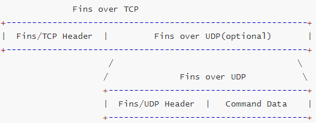
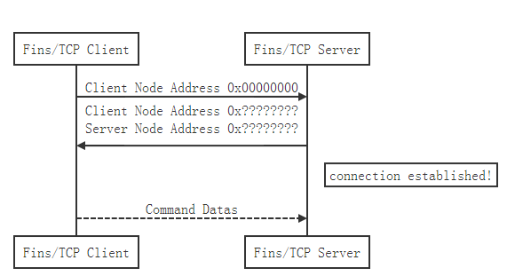
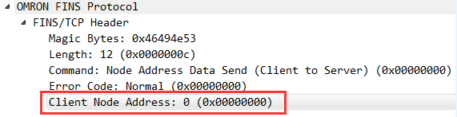
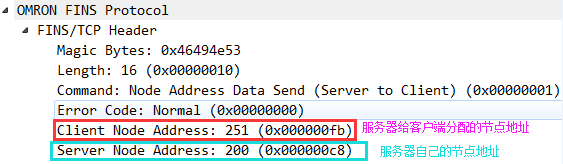

## 1. 协议概述

&emsp;&emsp;[欧姆龙(Omron)](https://www.omron.com/)是来自日本的知名电子和自控设备制造商，其中、小型PLC在国内市场有较高的占有率，有CJ、CM等系列。PLC可以支持Fins、Host link等协议进行通信。

&emsp;&emsp;支持以太网的欧姆龙PLC CPU、以太网通信模块根据型号的不同，一般都会支持[FINS(Factory Interface Network Service)](https://en.wikipedia.org/wiki/Factory_Interface_Network_Service)协议，一些模块也会支持EtherNet/IP协议。Omron fins协议缺省TCP/UDP端口号为9600。Fins协议封装在TCP/UDP之上，需要注意的是基于TCP的Fins数据包和基于UDP的包在头部上差异较大。协议的具体构造可以参考欧姆龙官方文档。

&emsp;&emsp;FINS协议实现了OMRON PLC与上位机以太网通信。Fins基于TCP/UDP的报文的概览如下：

```bash
              Fins over TCP
+-----------------------------------------------------------+
|  Fins/TCP Header  |         Fins over UDP(optional)       |
+-----------------------------------------------------------+
                     /                                    \
                    /              Fins over UDP           \  
                    +---------------------------------------+
                    |  Fins/UDP Header  |   Command Data    |
                    +---------------------------------------+
```

&emsp;&emsp;由上图可知，Fins/TCP实际上是将Fins/UDP报文作为其负载，在其前面加了一个Fins/TCP报头。需要注意的是，Fins/TCP报文中负载即Fins/UDP部分不一定会出现，它可以只有一个简单的Fins/TCP报头。

&emsp;&emsp;因此我们先介绍Fins/UDP报文的组成，然后再介绍Fins/TCP结构。


## 2. 协议详解

### 2.1 Fins over UDP

&emsp;&emsp;基于UDP的Fins协议的结构相对简单，整体结构由报头和数据两部分组成，如下所示：

```bash
         Fins over UDP
    +--------------------------+
    |      Fins/UDP Header     |
    +--------------------------+
    |  Command Data(opitonal)  |
    +--------------------------+
```

&emsp;&emsp;其中报头部分为必要组成部分，为固定长度**12个字节**，数据部分非必现。

#### 2.1.1 Fins/UDP Header

&emsp;&emsp;报头部分由11个**定长**字段组合而成，前面10个字段分别简称为：**ICF、RSV、GCT、DNA、DA1、DA2、SNA、SA1、SA2、SID**，如下所示：

```bash
    0         1           2          6                     7
    +---------+-----------+----------+---------------------+
    | Gateway | Data Type | Reserved |  Response setting   |
    +------------------------------------------------------+
    |                      Reserved                        |
    +------------------------------------------------------+
    |                    Gateway Counts                    |
    +------------------------------------------------------+
    |                Destination Network Address           |
    +------------------------------------------------------+
    |                Destination Node Number               |
    +------------------------------------------------------+
    |                Destination Unit Addres               |
    +------------------------------------------------------+
    |                 Source Network Address               |
    +------------------------------------------------------+
    |                   Source Node Number                 |
    +------------------------------------------------------+
    |                    Source Unit Addres                |
    +------------------------------------------------------+
    |                         Service Id                   |
    +------------------------------------------------------+
    |                       Command                        |
    +                                                      +
    |                       Code(2B)                       |
    +------------------------------------------------------+
```

&emsp;&emsp;上述11个字段中，除最后一个**Command Code**字段为**2个字节**外，其余所有字段均只占**1个字节**。

#### 2.1.2 ICF字段

&emsp;&emsp;第一个字段被称为**ICF**字段(即**Information control filed，信息控制字段**)，1个字节，由4个子字段组成，分述如下：

- 1... .... = Gateway bit，是否使用网关，`0x01`表示使用；
- .1.. .... = Data Type bit，数据类型比特位，`0x01`表示为响应，`0x00`表示命令；
- ..0. .... = Reserved bit，第一个保留比特位，默认置0；
- ...0 .... = Reserved bit，第二个保留比特位，默认置0；
- .... 0... = Reserved bit，第三个保留比特位，默认置0；
- .... .0.. = Reserved bit，第四个保留比特位，默认置0；
- .... ..0. = Reserved bit，第五个保留比特位，默认置0；
- .... ...1 = Response setting bit，第一个保留比特位响应标志为，`0x01`表示非必需回应，`0x00`表示必须进行回应。

#### 2.1.3 RSV字段

&emsp;&emsp;第二个字段被称为**RSV**(即**Reserved，保留字段**)，1个字节，置`0x00`。

#### 2.1.4 GCT字段

&emsp;&emsp;第三个字段被称为**GCT**(即**Gateway count ，网关计数**)，1个字节，置为`0x02`。

#### 2.1.5 DNA字段

&emsp;&emsp;第四个字段被称为**DNA**(即**Destination network adrress，目标网络地址**)，1个字节，取值如下：

- `00`：表示本地网络；
- `0x01`~`0x7F`：表示远程网络。

#### 2.1.6 DA1字段

&emsp;&emsp;第五个字段被称为**DA1**(即**Destination node number，目标节点编号**)，1个字节，取值如下：

- `0x01`~`0x3E`： `SYSMAC LINK`网络中的节点号；
- `0x01`~`0x7E`： `YSMAC NET`网络中的节点号；
- `0xFF`： 广播传输。

&emsp;&emsp;Omron的官方手册中，该字段只能取上述值，然而网上的实际抓包发现会有其它值出现，被wireshark标记为**unknown**，因此**暂时关闭解码器中对该字段的校验**。

#### 2.1.7 DA2字段

&emsp;&emsp;第六个字段被称为**DA2**(即**Destination unit address，目标单元地址**)，1个字节，取值如下：

- `0x00`：PC(CPU)；
- `0xFE`： SYSMAC NET Link Unit or SYSMAC LINK Unit connected to network；
- `0x10`~`0x1F`：CPU总线单元 ，其值等于10 + 单元号(前端面板中配置的单元号)。

&emsp;&emsp;Omron的官方手册中，该字段只能取上述值，然而网上的实际抓包发现会有其它值出现，被wireshark标记为**unknown**，同样的，**暂时关闭解码器中对该字段的校验**。

#### 2.1.8 SNA字段

&emsp;&emsp;第七个字段被称为**SNA**(即**Source network address，源网络地址**)，1个字节，取值及含义同**DNA**字段。

#### 2.1.9 SA1字段

&emsp;&emsp;第八个字段被称为**SA1**(即**Source node number，源节点编号**)，1个字节，取值及含义同**DA1**字段。

#### 2.1.10 SA2字段

&emsp;&emsp;第九个字段被称为**SA2**(即**Source unit addess，源单元地址**)，1个字节，取值及含义同**DA2**字段。

#### 2.1.11 SID字段

&emsp;&emsp;第十个字段被称为**SID(即**Service ID，服务ID**)，1个字节，取值`0x00`~`0xFF`，产生会话的进程的唯一标识。

#### 2.1.12 Command Code字段

&emsp;&emsp;这个字段占**2个字节**，其取值由第一个字节表示的大分类和第二个字节表示的子分类复合而成，取值及其含义如下表：

<table><!-- 标题栏 --><tr><th colspan=2 style="text-align:center;">Command Code</th><th rowspan=2 style="text-align:center;">英文释义</th><th rowspan=2 style="text-align:center;">中文释义</th></tr><!-- command code分栏 --><tr><td style="text-align:center;">1st Byte</td><td style="text-align:center;">2nd Byte</td><!-- 第1个类 --></tr><tr><td rowspan=5 style="text-align:center;">0x01</td><td style="text-align:center;">0x01</td><td style="text-align:center;">MEMORY AREA READ</td><td style="text-align:center;">内存区域读取</td></tr><tr><td style="text-align:center;">0x02</td><td style="text-align:center;">MEMORY AREA WRITE</td><td style="text-align:center;">内存区域写入</td></tr><tr><td style="text-align:center;">0x03</td><td style="text-align:center;">MEMORY AREA FILL</td><td style="text-align:center;">内存区域填充</td></tr><tr><td style="text-align:center;">0x04</td><td style="text-align:center;">MULTIPLE MEMORY AREA
READ</td><td style="text-align:center;">多内存区域读取</td></tr><tr><td style="text-align:center;">0x05</td><td style="text-align:center;">MEMORY AREA TRANSFER</td><td style="text-align:center;">内存区域传输</td></tr><!-- 第2类 --><tr><td rowspan=5 style="text-align:center;">0x02</td><td style="text-align:center;">0x01</td><td style="text-align:center;">PARAMETER AREA READ</td><td style="text-align:center;">参数区域读取</td></tr><tr><td style="text-align:center;">0x02</td><td style="text-align:center;">PARAMETER AREA WRITE</td><td style="text-align:center;">参数区域写入</td></tr><tr><td style="text-align:center;">0x03</td><td style="text-align:center;">PARAMETER AREA CLEAR</td><td style="text-align:center;">参数区域清除</td></tr><tr><td style="text-align:center;">0x20</td><td style="text-align:center;">DATA LINK TABLE READ</td><td style="text-align:center;">数据链表读取</td></tr><tr><td style="text-align:center;">0x21</td><td style="text-align:center;">DATA LINK TABLE WRITE</td><td style="text-align:center;">内存区域传输</td></tr><!-- 第3类 --><tr><td rowspan=5 style="text-align:center;">0x03</td><td style="text-align:center;">0x04</td><td style="text-align:center;">PROGRAM AREA PROTECT</td><td style="text-align:center;">程序区保护</td></tr><tr><td style="text-align:center;">0x05</td><td style="text-align:center;">PROGRAM AREA PROTECT CLEAR</td><td style="text-align:center;">程序区保护清除</td></tr><tr><td style="text-align:center;">0x06</td><td style="text-align:center;">PROGRAM AREA READ</td><td style="text-align:center;">程序区读取</td></tr><tr><td style="text-align:center;">0x07</td><td style="text-align:center;">PROGRAM AREA WRITE</td><td style="text-align:center;">程序区写入</td></tr><tr><td style="text-align:center;">0x08</td><td style="text-align:center;">PROGRAM AREA CLEAR</td><td style="text-align:center;">程序区清除</td></tr><!-- 第4类 --><tr><td rowspan=3 style="text-align:center;">0x04</td><td style="text-align:center;">0x01</td><td style="text-align:center;">RUN</td><td style="text-align:center;">执行</td></tr><tr><td style="text-align:center;">0x02</td><td style="text-align:center;">STOP</td><td style="text-align:center;">停止</td></tr><tr><td style="text-align:center;">0x03</td><td style="text-align:center;">RESET</td><td style="text-align:center;">重置</td></tr><!-- 第5类 --><tr><td rowspan=2 style="text-align:center;">0x05</td><td style="text-align:center;">0x01</td><td style="text-align:center;">CONTROLLER DATA READ</td><td style="text-align:center;">控制器数据读取</td></tr><tr><td style="text-align:center;">0x02</td><td style="text-align:center;">CONNECTION DATA READ</td><td style="text-align:center;">连接数据读取</td></tr><!-- 第6类 --><tr><td rowspan=4 style="text-align:center;">0x06</td><td style="text-align:center;">0x01</td><td style="text-align:center;">CONTROLLER STATUS
READ</td><td style="text-align:center;">控制器状态读取</td></tr><tr><td style="text-align:center;">0x02</td><td style="text-align:center;">NETWORK STATUS READ</td><td style="text-align:center;">网络状态读取</td></tr><tr><td style="text-align:center;">0x03</td><td style="text-align:center;">DATA LINK STATUS READ</td><td style="text-align:center;">数据连接状态读取</td></tr><tr><td style="text-align:center;">0x20</td><td style="text-align:center;">CYCLE TIME READ</td><td style="text-align:center;">循环次数读取</td></tr><!-- 第7类 --><tr><td rowspan=2 style="text-align:center;">0x07</td><td style="text-align:center;">0x01</td><td style="text-align:center;">CLOCK READ</td><td style="text-align:center;">时钟读取</td></tr><tr><td style="text-align:center;">0x02</td><td style="text-align:center;">CLOCK WRITE </td><td style="text-align:center;">时钟写入</td></tr><!-- 第8类 --><tr><td rowspan=3 style="text-align:center;">0x08</td><td style="text-align:center;">0x01</td><td style="text-align:center;">LOOP-BACK TEST/
INTERNODE ECHO TEST</td><td style="text-align:center;">环路测试/内部节点响应测试</td></tr><tr><td style="text-align:center;">0x02</td><td style="text-align:center;">BROADCAST TEST
RESULTS READ</td><td style="text-align:center;">广播测试/结果读取</td></tr><tr><td style="text-align:center;">0x03</td><td style="text-align:center;">BROADCAST TEST DATA
SEND</td><td style="text-align:center;">广播测试数据发送</td></tr><!-- 第9类 --><tr><td rowspan=3 style="text-align:center;">0x09</td><td rowspan=3 style="text-align:center;">0x20</td><td style="text-align:center;">MESSAGE READ</td><td style="text-align:center;">消息读取</td></tr><tr><td style="text-align:center;">MESSAGE CLEAR</td><td style="text-align:center;">消息清除</td></tr><tr><td style="text-align:center;">FAL/FALS READ</td><td style="text-align:center;">FAL/FALS读取</td></tr><!-- 第10类 --><tr><td rowspan=3 style="text-align:center;">0x0C</td><td style="text-align:center;">0x01</td><td style="text-align:center;">ACCESS RIGHT ACQUIRE </td><td style="text-align:center;">访问权限获取</td></tr><tr><td style="text-align:center;">0x02</td><td style="text-align:center;">ACCESS RIGHT FORCED
ACQUIRE</td><td style="text-align:center;">访问权限强制获取</td></tr><tr><td style="text-align:center;">0x03</td><td style="text-align:center;">ACCESS RIGHT RELEASE</td><td style="text-align:center;">访问权限释放</td></tr><!-- 第11类 --><tr><td rowspan=3 style="text-align:center;">0x21</td><td style="text-align:center;">0x01</td><td style="text-align:center;">ERROR CLEAR</td><td style="text-align:center;">错误清除</td></tr><tr><td style="text-align:center;">0x02</td><td style="text-align:center;">ERROR LOG READ</td><td style="text-align:center;">错误日志读取</td></tr><tr><td style="text-align:center;">0x03</td><td style="text-align:center;">ERROR LOG CLEAR</td><td style="text-align:center;">错误日志清除</td></tr><!-- 第12类 --><tr><td rowspan=15 style="text-align:center;">0x22</td><td style="text-align:center;">0x01</td><td style="text-align:center;">FILE NAME READ</td><td style="text-align:center;">文件名读取</td></tr><tr><td style="text-align:center;">0x02</td><td style="text-align:center;">SINGLE FILE READ</td><td style="text-align:center;">单文件读取</td></tr><tr><td style="text-align:center;">0x03</td><td style="text-align:center;">SINGLE FILE WRITE</td><td style="text-align:center;">单文件写入</td></tr><tr><td style="text-align:center;">0x04</td><td style="text-align:center;">MEMORY CARD FORMAT</td><td style="text-align:center;">记忆卡格式化</td></tr><tr><td style="text-align:center;">0x05</td><td style="text-align:center;">FILE DELETE</td><td style="text-align:center;">文件删除</td></tr><tr><td style="text-align:center;">0x06</td><td style="text-align:center;">VOLUME LABEL
CREATE/DELETE</td><td style="text-align:center;">卷标创建/删除</td></tr><tr><td style="text-align:center;">0x07</td><td style="text-align:center;">FILE COPY</td><td style="text-align:center;">文件复制</td></tr><tr><td style="text-align:center;">0x08</td><td style="text-align:center;">FILE NAME CHANGE</td><td style="text-align:center;">文件名更改</td></tr><tr><td style="text-align:center;">0x09</td><td style="text-align:center;">FILE DATA CHECK</td><td style="text-align:center;">文件数据校核</td></tr><tr><td style="text-align:center;">0x0A</td><td style="text-align:center;">MEMORY AREA FILE
TRANSFER</td><td style="text-align:center;">内存区域文件传输</td></tr><tr><td style="text-align:center;">0x0B</td><td style="text-align:center;">PARAMETER AREA FILE
TRANSFER/td><td style="text-align:center;">参数区域文件传输</td></tr><tr><td style="text-align:center;">0x0C</td><td style="text-align:center;">PROGRAM AREA FILE
TRANSFER</td><td style="text-align:center;">程序区域文件传输</td></tr><tr><td style="text-align:center;">0x0F</td><td style="text-align:center;">FILE MEMORY INDEX READ</td><td style="text-align:center;">文件内存索引读取</td></tr><tr><td style="text-align:center;">0x10</td><td style="text-align:center;">FILE MEMORY READ </td><td style="text-align:center;">文件内存块读取</td></tr><tr><td style="text-align:center;">0x11</td><td style="text-align:center;">FILE MEMORY WRITE</td><td style="text-align:center;">文件内存块写入</td></tr><!-- 第14类 --><tr><td rowspan=3 style="text-align:center;">0x23</td><td style="text-align:center;">0x01</td><td style="text-align:center;">FORCED SET/RESET</td><td style="text-align:center;">强制设置/重置</td></tr><tr><td style="text-align:center;">0x02</td><td style="text-align:center;">FORCED SET/RESET
CANCEL</td><td style="text-align:center;">取消强制设置/重置</td></tr><tr><td style="text-align:center;">0x0A</td><td style="text-align:center;">MULTIPLE FORCED STATUS
READ</td><td style="text-align:center;">多强制状态读取</td></tr><!-- 第15类 --><tr><td rowspan=3 style="text-align:center;">0x26</td><td style="text-align:center;">0x01</td><td style="text-align:center;">NAME SET</td><td style="text-align:center;">名称设置</td></tr><tr><td style="text-align:center;">0x02</td><td style="text-align:center;">NAME DELETE </td><td style="text-align:center;">名称删除</td></tr><tr><td style="text-align:center;">0x03</td><td style="text-align:center;">NAME READ</td><td style="text-align:center;">名称读取</td></tr></table>


&emsp;&emsp;合计：**14**个大类，**57**个子类，共**57**个**Command Code**。

### 2.2 Fins Over TCP

&emsp;&emsp;基于TCP的FINS报文结构也不复杂，无非就是一个FINS/TCP头部(必选)，加上FINS/UDP报文(可选)，如下所示：

```bash
                   Fins over TCP
    +----------------------------------------+
    |             Fins/TCP Header            |
    +----------------------------------------+
    |    Fins/UDP Header(not neccessary)     |
    +----------------------------------------+
    |      Command Data(not neccessary)       |
    +----------------------------------------+
```

#### 2.2.1 Fins/TCP Header

&emsp;&emsp;Fins/TCP的报头与Fins/UDP不同的是，它由**4个**固定字段和**2个**可选字段组成，如下所示：

```bash
                       Fins/TCP Header
    0                                                     31
    +---------+-----------+----------+---------------------+
    |                    Magic Bytes                       |
    +------------------------------------------------------+
    |                      Length                          |
    +------------------------------------------------------+
    |                      Command                         |
    +------------------------------------------------------+
    |                     Error Code                       |
    +------------------------------------------------------+
    |            Client Node Address(optional)             |
    +------------------------------------------------------+
    |            Server Node Address(optional)             |
    +------------------------------------------------------+
```

&emsp;&emsp;&emsp;因此Fins/TCP的头部长度范围为$[16, 24]$字节，每个字段的长度均为固定的**4个字节**。

#### 2.2.2 Magic字段

&emsp;&emsp;第一个字段为**Magic Bytes**字段，从字面意思看是魔数字段，其ASCII码(`0x46494E53`)刚好是**FINS**这个单词，因此可以推测这个字段的值是恒定的。

#### 2.2.3 Length字段

&emsp;&emsp;第二个字段为**Length**字段，这个字段的值表示其后所有字段(包括可能出现的Fins/UDP包)的总长度，用公式表达为：
$$
\begin{split}
Length &= len(TCP\_PAYLOAD) - len(Magic Bytes) - len(Length) \\
&= len(TCP\_PAYLOAD) - 4 - 4 \\
&= len(TCP\_PAYLOAD) - 8 \\
\end{split}
\tag{2 - 1}
$$

&emsp;&emsp;也就是说，该字段的值等于TCP负载的总长度减去8个字节。

#### 2.2.4 Command字段

&emsp;&emsp;第三个字段为**Command**字段，这个字段表示消息中随附的命令的类型。这个字段的取值直接决定了后续可选的字段**Client Node Address、Server Node Address**是否出现，具体情况如下所示：

- `0x00000000`：节点地址数据已发送(C->S)，此时仅有**Client Node Address**字段；
- `0x00000001`：节点地址数据已发送(S->C)，此时**Client/Server Node Address**字段均出现；
- 其它:不会出现上述两个字段。

#### 2.2.5 Error Code字段

&emsp;&emsp;第四个字段为**Error Code**字段，这个字段表示错误代码。根据[wireshark源代码](https://github.com/wireshark/wireshark/blob/master/epan/dissectors/packet-omron-fins.c)所提供的信息，错误代码目前共定义了10种类型，如下所示：

| 错误码 | 对应含义                                                     |
| :------: | :-------------------------------: |
| 0x00000000 | Normal |
| 0x00000001 | The header is not 'FINS' (ASCII code) |
| 0x00000002 | The data length is too long |
| 0x00000003 | The command is not supported |
| 0x00000020 | All connections are in use |
| 0x00000021 | The specified node is already connected |
| 0x00000022 | Attempt to access a protected node from an unspecified IP address |
| 0x00000023 | The client FINS node address is out of range |
| 0x00000024 | The same FINS node address is being used by the client and server |
| 0x00000025 | All the node addresses available for allocation have been used |

#### 2.2.6 Client/Server Node Address字段

&emsp;&emsp;这两个字段是Fins/TCP的客户端/服务器建立连接的时候的类似DHCP协议客户端获取IP地址的时候才会出现的，如下所示：


&emsp;&emsp;由上可以看出，Fins/TCP协议的客户端/服务器在传输有效的命令数据之前，由客户端先向服务器发送一个包含**Client Node Address**字段的报文申请节点地址，如下图所示：



&emsp;&emsp;类似DHCP协议，由于客户端申请的时候还没有节点地址，因此该字段被置为`0x00000000`。
&emsp;&emsp;服务器收到客户端请求后，给客户端分配相应的节点地址并通告给客户端，同时在报文中包含服务器自己的节点地址信息，如下所示：



&emsp;&emsp;客户端收到服务器的响应报文后，即使用分配的节点地址与服务器进行通信，由此客户端/服务器之间就建立起了有效的长连接。

### 2.3 Command Data

&emsp;&emsp;这个字段是Fins/UDP、Fins/TCP协议的实际负载部分，鉴于其涵盖内容较多（官方手册就有两百多页），目前未对其进行深入解析，后续根据需要再深入解析。

### 2.4 参考资料

&emsp;&emsp;1. [Omron-Fins官方手册](https://www.myomron.com/downloads/1.Manuals/Networks/W227E12_FINS_Commands_Reference_Manual.pdf)；

&emsp;&emsp;2. [Wireshark wiki关于Omron的简介](https://wiki.wireshark.org/OMRON-FINS)；

&emsp;&emsp;3. [安全客观与Omron-Fins协议的介绍(非常详细)](https://www.anquanke.com/post/id/188455)；