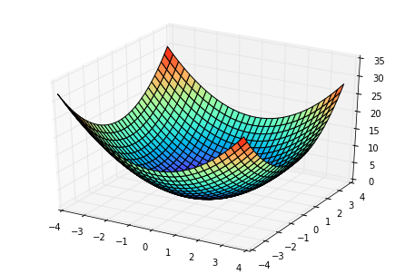
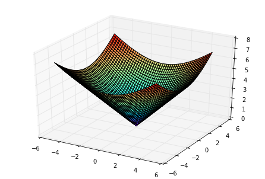
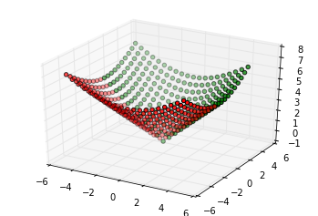

><font color=#0000FF face="微软雅黑" size=4>Just make it easier, easier to understand and beautiful！</font> 

## 一、基础篇  
&emsp;&emsp; <font color=#000000 size=5>**P**</font>ython绘图包括了2D和3D，不同的类型使用的库不同，本系列主要讲3D图形的绘制。包括3D曲面图、3D散点图以及在3D曲面图上绘制有向、无向线。
<!-- more -->
### 1.1 环境说明  
&emsp;&emsp;本文中软件运行环境如下：

| 项 | 参考值 | 备注|
| :-: | :-: | :-: |
| OS | Win7_X64 | 旗舰版 |
| Python | 3.4.3 | 32bit版 |
| IDE | WinPython-32bit | 3.4.3.7Qt5 |

### 1.2 3D曲面图  
&emsp;&emsp;3D曲面和散点的绘制用的都是**mpl_toolkits库**的**mplot3d模块**中的**Axes3D**来完成。曲面的绘制调用的是函数**plot_surface()**。下述代码将绘制一个3D锥面。
```python
# -*- coding: utf-8 -*-
"""
Created on Mon May  8 12:20:29 2017

@author: flat2010
"""

import numpy as np
from matplotlib import pyplot as plt
from mpl_toolkits.mplot3d import Axes3D

# 创建3D对象
fig = plt.figure()
ax = Axes3D(fig)

# 分别生成x、y坐标数据
xcord = np.arange(-5, 5, 0.2)
ycord = np.arange(-5, 5, 0.2)

# 将坐标向量转换成坐标矩阵(vectors -> matrices)
xcord, ycord = np.meshgrid(xcord, ycord)

# 生成z坐标数据
r = np.sqrt(xcord**2 + ycord**2)
zcord = r

# 绘制曲面图
ax.plot_surface(xcord, ycord, zcord, rstride=1, cstride=1, cmap='rainbow')
plt.show()
```

&emsp;&emsp;绘制成的图形如下图1-1所示：

<div align='center'>图1-1　　3D圆锥面图</div> 

&emsp;&emsp;**Axes3D.plot_surface(X, Y, Z, \*args, \*\*kwargs)函数**的常用参数官方解释如下：   

| 参数名 | 英文说明 | 中文解释 |
| :-: | :-: | :-: |
| X, Y, Z | Data values as 2D arrays | x、y、z三个坐标轴的数据，均为二维数组 |
| rstride	 | Array row stride (step size) | 二维数组行增量，如该值取2时，二维数组中只有序号为0、2、4···的数据才会被绘制 |
| lstride	 | Array row ltride (step size) | 二维数组列增量，作用同rstride |
| color	 | Color of the surface patches | 曲面图中像素块的颜色，如果同时设置了cmap参数该值会被cmap覆盖 |
| cmap	 | A colormap for the surface patches | 曲面图中像素块的颜色图，可提供多个值 |
| cmap	 | A colormap for the surface patches | 曲面图中像素块的颜色图，可提供多个值 |
| facecolors	 | Face colors for the individual patches | 指定像素块的颜色，二维数组\[rs][cs] |
| norm	 | An instance of Normalize to map values to colors | Normalize（标准化）对象，负责将不同的值映射为不同的颜色 |
| vmin	 | Minimum value to map | 规范化的最小值 |
| vmax	 | Maximum value to map | 规范化的最小值 |
| shade	 |  Whether to shade the facecolors | 是否屏蔽facecolors |

### 1.3 3D散点图  
&emsp;&emsp;3D散点图和3D曲面图有所不同的是，创建绘图对象时，使用的是**add_subplot()**函数（实测使用Axes3D也可以），代码如下：
```python
# -*- coding: utf-8 -*-
"""
Created on Mon May  8 12:20:29 2017

@author: flat2010
"""

import numpy as np
from matplotlib import pyplot as plt
from mpl_toolkits.mplot3d import Axes3D

# 创建3D对象
fig = plt.figure()
ax = fig.add_subplot(111, projection='3d')

# 分别生成x、y坐标数据
xcord = np.arange(-5, 5, 0.5)
ycord = np.arange(-5, 5, 0.5)

# 将坐标向量转换成坐标矩阵(vectors -> matrices)
xcord, ycord = np.meshgrid(xcord, ycord)

# 生成z坐标数据
r = np.sqrt(xcord**2 + ycord**2)
zcord = r

# 绘制散点图，将图形分成两部分，用不同颜色绘制
ax.scatter(xcord[:10], ycord[:10], zcord[:10], c='r')
ax.scatter(xcord[10:], ycord[10:], zcord[10:], c='g')
plt.show()
```

&emsp;&emsp;坐标点的数据仍然是上面的3D圆锥面。绘制形成的图形如下所示：

<div align='center'>图1-2　　3D散点图</div> 

&emsp;&emsp;**Axes3D.scatter(xs, ys, zs=0, zdir='z', s=20, c='b', \*args, \*\*kwargs)函数**的常用参数官方解释如下：   

| 参数名   | 英文说明 | 中文解释 |
| :-:    | :-: | :-: |
| xs, ys	 | Positions of data points | x、y两个个坐标轴的数据 |
| zs	 | Either an array of the same length as xs and ys or a single value to place all points in the same plane. Default is 0 | z轴数据，即可以是数组（与x、y等长），也可以是一个数字（即为二维图形） |
| zdir	 | Which direction to use as z (‘x’, ‘y’ or ‘z’) when plotting a 2D set | 若提供的是一个二维数据集时，使用哪个方向的数据作为z轴数据 |
| s	 | size in points^2. It is a scalar or an array of the same length as x and y | 数据点在图中的显示大小（标量或与x、y等维度的向量） |
| c | a color. c can be a single color format string, or a sequence of color specifications of length N, or a sequence of N numbers to be mapped to colors using the cmap and norm specified via kwargs (see below)... | 数据点颜色，即可以是字符串形式的标量，也可以是长度N的颜色序列，也可以是通过cmap或norm映射的长度为N的颜色序列，但不能是单个RGB值或序列，可以是二维数组。 |

### 1.4 其它图
&emsp;&emsp;该模块还提供了其它的一些常见图形，如：

 -  **Axes3D.plot(xs, ys, \*args, \*\*kwargs)即曲线图**；
 -  **Axes3D.plot_trisurf(\*args, \*\*kwargs)即三曲面图**；
 -  **Axes3D.contour(X, Y, Z, \*args, \*\*kwargs)即轮廓图**；
 -  **Axes3D.add_collection3d(col, zs=0, zdir='z')即多边形图**
 -  **Axes3D.bar(left, height, zs=0, zdir='z', \*args, \*\*kwargs)即直方图**。

&emsp;&emsp;详细用法及说明可参见[matplot官方文档](http://matplotlib.org/1.3.1/mpl_toolkits/mplot3d/tutorial.html)。