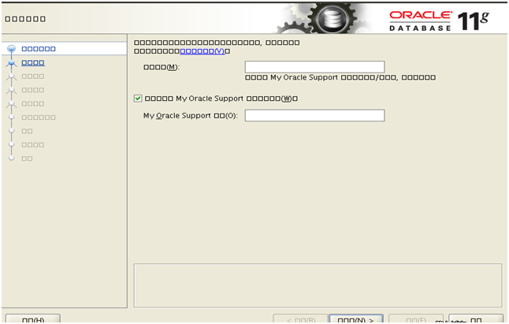
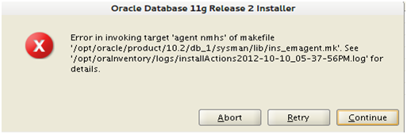
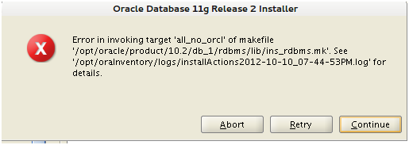
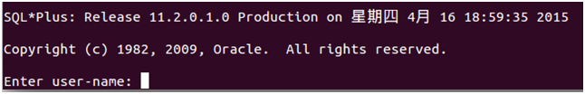

><font color=#0000FF face="微软雅黑" size=4>如果没有数据库，我们的互联网会是什么样？</font>
<div align='right'><font color=#FF4500 face="微软雅黑" size=2>Copyright © CUIT  Bigdata Research Lab</font></div>
<div align='center'><font color=#000000 face="微软雅黑" size=8>Oracle 11g R2 32位安装指南</font></div>
<div align='center'><font color=#000000 face="微软雅黑" size=5>On Ubuntu 14.04 x86</font></div>
<div align='center'><font color=#000000 face="微软雅黑" size=6>序</font></div>


　　<font color=#000000 size=4>本手册仅为在指定发行版上安装指定版本的Oracle数据库作参考，整个过程中涉及对操作系统关键区域、关键文件的修改，在进行安装前，请务必做好系统备份，因操作不当而带来的一切损失自负。本手册所推荐的软、硬件平台如下：</font>
```bash
            >>>    硬件配置    <<<
CPU: 32或64位均可，建议64位，双核及以上，多线程。
MEM: ≥2G，建议4G及以上。
DISK: ≥20G，建议40G及以上
```
```bash
            >>>    软件配置    <<<
OS: Ubuntu-14.04-X86
Soft: Oracle-11g-R2-32位
SQLClient: SQL/PLUS-11.2.0.1.0-32位
INSClient: Instantclient-11.2.0.1-32位。
```
<!-- more -->
　　<font color=#000000 size=4>安装前请务必核对自己的软硬件平台，确保满足安装需求后再进行。本教程一部分内容参考自互联网，加之编写时间仓促，纰漏在所难免，执行过程中，如发现手册中命令有误，请自行校正。</font>
　　<font color=#FF0000 size=4>本手册除部分内容参考自互联网外，其余均为本实验室原创，使用者可以随意修改、转载、分发，但严禁任何个人和单位用于商业用途。</font>
***


## 一、安装前期配置
### 1.1 需要安装的依赖包
　　<font color=#000000 size=4>安装前需要安装的所有依赖包如下表1-1所示（涉及二级依赖的，请先安装二级依赖包，在安装一级依赖包，最后安装第一列的包）：</font>


| 包名        | 一级依赖包           |   二级依赖包  |
| ------------- |:-------------:| -----:|
| automake      | auotoconf</br>autotools-dev | m4</br>—— |
| gawk      | libsigsegV2(>=2.9)      |   —— |
| pdksh | mksh(>=40.9.20120030)      |    —— |
|rpm | librpm3</br>librpmbuild3</br>librpmsign1</br>rpm2cpio</br>debugedit      |    librpmio3</br>——</br>——</br>rpm-common</br>—— |
| alien | dpkg-dev</br></br></br>debhelper      | libdpkg-perl(=1.17.5ubuntu5)</br></br>po-debconf</br>dh-apparmor |
| libaio-dev | libaio1      |    —— |
| language-pack-en-base_14.04+20140410_all | language-pack-en_14.04+20140410_all      |    —— |
| language-pack-gnome-zh-hans-base_14.04+20140410_all | language-pack-gnome-zh-hans-base_14.04+20140410_all      |    —— |
| locales_2.13+git20120306-12_all | ——      |    —— |
| localechooser-data_2.49ubuntu5_all | ——      |    —— |

<div align='center'>表1-1　　安装数据库前需要安装的依赖包</div>
### 1.2 创建安装账户(oracle)
　　<font color=#000000 size=4>该步骤可省略，直接使用当前用户即可(但要求当前账户最好具有执行sudo命令的权限，最好不要使用root账户操作。），新建账户的命令如下：</font>
```bash
用户名@主机名$: sudo groupadd oinstall
用户名@主机名$: sudo groupadd dba
用户名@主机名$: sudo useradd -g oinstall -G dba -d /opt/oracle -s /bin/bash oracle
用户名@主机名$: sudo passwd oracle
```
　　<font color=#000000 size=4>为方便操作，可将上述四条命令写入一个bash脚本(oracle_install_adduser.sh)中批量执行。</font>
### 1.3 检查系统参数
　　<font color=#000000 size=4>这一步要检查一些系统参数，命令执行后，最好复制出来，后面配置时需要用到。执行的命令如下：</font>
```bash
用户名@主机名$: /sbin/sysctl -a | grep sem
用户名@主机名$: /sbin/sysctl -a | grep shm
用户名@主机名$: /sbin/sysctl -a | grep file-max
用户名@主机名$: /sbin/sysctl -a | grep aio-max
用户名@主机名$: /sbin/sysctl -a | grep ip_local_port_range
用户名@主机名$: /sbin/sysctl -a | grep rmem_default
用户名@主机名$: /sbin/sysctl -a | grep rmem_max
用户名@主机名$: /sbin/sysctl -a | grep wmem_default
用户名@主机名$: /sbin/sysctl -a | grep wmem_max
```
　　<font color=#000000 size=4>同样的，可以将上述命令写入bash脚本(oracle_check_system_variable.sh)中，批量执行，简单快捷，省时省力。如果权限不够，加入sudo执行。</font>
### 1.4 修改系统配置文件
　　<font color=#000000 size=4>将上一步查询出来的结果追加到系统文件/etc/sysctl.conf的末尾，需要添加的内容有：</font>
```bash
****文件内容截断
net.core.rmem_default = 262144(修改为你的机器输出的结果)
net.core.rmem_max = 4194304(修改为你的机器输出的结果)
net.core.wmem_default = 262144(修改为你的机器输出的结果)
net.core.wmem_max = 1048586(修改为你的机器输出的结果)
```
　　<font color=#000000 size=4>追加完后保存，然后执行如下命令生效：</font>
```bash
用户名@主机名$: sudo sysctl -p
```
### 1.5 修改内核限制
　　<font color=#000000 size=4>在系统文件/etc/security/limits.conf尾部添加如下内容，以便取消内核对用户的一些限制：</font>
```bash
*****文件内容截断
oracle	soft	nproc	2047
oracle	hard	nproc	16384
oracle	soft	nofile	1024
oracle	hard	nofile	65536
oracle	soft	stack	10240
```
　　<font color=#FF0000 size=4>备注：如果没有执行1.2的操作(创建新用户oracle)，则上述内容每行的第一列的oracle应替换成当前登录用户名。</font>
　　<font color=#000000 size=4>追加完后，查看系统文件/etc/pam.d/login和/etc/pam.d/su中有没有如下内容：</font>
```bash
****文件内容截断
session required pam_limits.so
****文件内容截断
```
　　<font color=#000000 size=4>如果没有该行内容，则在文件尾部追加。</font>


### 1.6 创建安装所需文件夹并设置其访问权限
　　<font color=#000000 size=4>执行下面命令创建oracle安装所需的文件夹，并设置访问权限以便数据库在前期安装、后期执行的过程中能顺利进行：</font>
```bash
用户名@主机名$: sudo mkdir -p /opt/oracle
用户名@主机名$: sudo mkdir -p /opt/oraInventory
用户名@主机名$: sudo chown -R oracle:oinstall	/opt/oracle
用户名@主机名$: sudo chown -R oracle:oinstall	/opt/oraInventory
```
　　<font color=#FF0000 size=4>备注：同样的，如果没有执行1.2的操作（创建新用户oracle），则把上述内容最后两行中的用户和组修改为当前用户的名称和所属群组名称即可。</font>


### 1.7 JDK的安装以及环境变量的设置
　　<font color=#000000 size=4>数据库的安装及运行都需要java支持，用户可以仅仅安装JRE，但我们推荐安装JDK。首先去oracle官网下载最新的JDK安装包（官网提供了bin格式的二进制包和.gz格式的压缩包，这里我们分别对两种包的安装配置予以说明），然后按照下述步骤安装、配置：</font>


#### 1.7.1 bin格式安装包
　　<font color=#000000 size=4>对于bin格式安装包，需要执行如下命令：</font>
```bash
用户名@主机名$: sudo chmod 777 jdk-XX-XX-XX.bin	//更改下载的安装包权限以便安装
用户名@主机名$: sudo -s jdk-XX-XX-XX.bin /usr/lib/jdk	//安装JDK到/usr/lib目录下，用户可自行选择其他安装目录，但后面相应的操作也应修改
```
　　<font color=#FF0000 size=4>注意：如果用户在执行第二条命令时，所用账户没有访问/usr/lib的权限，则jdk会被安装到当前用户的主文件夹下，这时可使用命令将其全部复制到/usr/lib/jdk目录。</font>
#### 1.7.2 .tar.gz格式包
　　<font color=#000000 size=4>这种格式的安装包操作起来相对简单，只需要用相应的解压命令将该包解压缩，然后将解压后的文件夹复制到相应地方即可，这里我们假定用户将其解压缩至主目录下（/home/XX/jdk-xx）。</font>
#### 1.7.3 配置环境变量
　　<font color=#000000 size=4>按照上述步骤安装好jdk后，还需要配置环境变量，以便使java环境变量生效，这时需要修改用户主文件夹下的.bashrc配置文件，在文件末尾加入如下内容：</font>
```bash
****文件内容截断
#JAVA_HOME VARIABLE
JAVA_HOME=/home/XX-XX/jdkxx.xx
JRE_HOME=${JAVA_HOME}/jre
export ANDROID_JAVA_HOME=$JAVA_HOME
export CLASSPATH=.:${JAVA_HOME}/lib:$JRE_HOME/lib:$CLASSPATH
export JAVA_PATH=${JAVA_HOME}/bin:${JRE_HOME}/bin
export JAVA_HOME
export JRE_HOME
export CLASSPATH
HOME_BIN=~/bin/
export PATH=${PATH}:${JAVA_PATH}:${HOME_BIN}
```
　　<font color=#000000 size=4>请根据自己的操作结果修改JAVA_HOME的值，添加完毕后核对所有值是否正确，然后保存文件，并使用如下命令验证刚才的设置是否生效：</font>
```bash
用户名@主机名$: sudo source ~/.bashrc	//重新加载用户配置文件
用户名@主机名$: java -version	//检查java环境变量是否已经生效
```
　　<font color=#000000 size=4>如果第二条命令执行后，输出结果为刚才安装的JDK版本，说明已经生效，可以进行下面的操作，否则请检查之前的配置。</font>


### 1.8 配置oracle环境变量
　　<font color=#000000 size=4>Oracle的安装及运行都需要正确配置系统环境变量，我们仍然是在主目录下的.bashrc文件中追加配置，内容如下：</font>
```bash
****文件内容截断
#Oracle VARIABLE

#The directory created in step 6
export ORACLE_BASE=/opt/oracle

#You can set this value as your wish , but we recommend this value to you 
export ORACLE_HOME=$ORACLE_BASE/app/oracle/product/11.2.0/dbhome_1

#Oracle SID
export ORACLE_SID=orcl
export ORACLE_UNQNAME=orcl

#Default Charsets
export NLS_LANG="SIMPLIFIED CHINESE_CHINA.UTF8"

#System Variable
export PATH=${PATH}:${ORACLE_HOME}/bin/
export LD_LIBRARY_PATH=$ORACLE_HOME/lib:$LD_LIBRARY_PATH

#OCCI setings
export LD_LIBRARY_PATH=$LD_LIBRARY_PATH:/opt/oracle/instantclient_11_2
CPLUS_INCLUDE_PATH=$CPLUS_INCLUDE_PATH:/opt/oracle/instantclient_11_2/sdk/include
TNS_ADMIN=/opt/instantclient_11_2
```
　　<font color=#000000 size=4>添加完后，仍然要执行如下命令使该设置生效：</font>
```bash
用户名@主机名$: sudo source ~/.bashrc
```
### 1.9 连接库文件
　　<font color=#000000 size=4>因为Ubuntu将某些库文件根据32位系统和64位系统分别存放了，但Oracle只认/usr/lib和/lib目录，所以安装前要先把一些必要的库连接起来，执行如下命令：</font>
```bash
用户名@主机名$: sudo ln -s /etc /etc/rc.d
用户名@主机名$: sudo ln -s /lib/i386-linux-gnu/libgcc_s.so.1 /lib/
用户名@主机名$: sudo ln -s /usr/bin/awk /bin/awk
用户名@主机名$: sudo ln -s /usr/bin/basename /bin/basename
用户名@主机名$: sudo ln -s /usr/bin/rpm /bin/rpm
用户名@主机名$: sudo ln -s /usr/lib/i386-linux-gnu/libpthread_nonshared.a /usr/lib/libpthread_nonshared.a
用户名@主机名$: sudo ln -s /usr/lib/i386-linux-gnu/libc_nonshared.a /usr/lib/libc_nonshared.a
用户名@主机名$: sudo ln -s /usr/lib/i386-linux-gnu/libstdc++.so.6 /lib/
用户名@主机名$: sudo ln -s /usr/lib/i386-linux-gnu/libstdc++.so.6 /usr/lib/
用户名@主机名$: sudo ln -s /usr/lib/i386-linux-gnu/libstdc++.so.5 /lib/
用户名@主机名$: sudo ln -s /usr/lib/i386-linux-gnu/libstdc++.so.5 /usr/lib/
```
　　<font color=#000000 size=4>同样，为了减少用户的工作量，我们把上述命令集成在了名为oracle_link.sh的脚本文件中，用户只需要执行该文件即可。</font>
　　<font color=#FF0000 size=4>备注：以上连接命令是对应于32位Ubuntu安装32位Oracle的，如果是64位Ubuntu安装64位Oracle，上面的i386-linux-gnu应相应的修改为x86_64-linux-gnu，连接目标目录的lib也要改成lib64（如果没有lib64请先新建一个）。</font>

### 1.10 添加版本文件
　　<font color=#000000 size=4>oracle原生并不支持ubuntu安装，所以我们需要做一点小小的处理，以便能在ubuntu上安装，按照下面命令顺序执行：</font>
```bash
用户名@主机名$: sudo touch /etc/redhat-release	//新建发行版说明文件
用户名@主机名$: sudo echo ‘Red Hat Linux release 5’ > /etc/redhat-release //添加发行版版号
```

### 1.11 安装oracle
　　<font color=#000000 size=4>先去oracle官网下载对应的安装版本（11g-R2-32bit)，官方提供的安装包有两个linux_11gR2_database_1of2.zip和linux_11gR2_database_2of2.zip，下载完后将这两个包放到第6步创建的文件夹/opt/oracle中，然后在终端中顺序执行如下命令完成压缩包的解压：</font>
```bash
用户名@主机名$: sudo unzip linux_11gR2_database_1of2.zip
用户名@主机名$: sudo unzip linux_11gR2_database_2of2.zip
```
　　<font color=#000000 size=4>命令执行完后，/opt/oracle目录下会出现一个名为database的文件夹，这时还需要更改该目录的权限，以便能够顺利访问，执行如下命令：</font>
```bash
用户名@主机名$: sudo chown -R oracle:oinstall /opt/oracle/database
```
　　<font color=#000000 size=4>用户应根据自己的情况修改上述命令中的用户名和所属群组名（如果没有新建账户，改成当前用户名和所属群组名）。</br>　　以上命令执行后，修改安装脚本权限，执行安装：</font>
```bash
用户名@主机名$: cd /opt/oracle/database/	//切换到安装文件所在目录
用户名@主机名$: sudo chmod 777 ./runInstaller		//修改安装文件权限
用户名@主机名$: ./runInstaller		//运行安装程序
```
　　<font color=#000000 size=4>执行第三个命令后，可能会出现安装目录下部分文件的权限不足，导致安装程序无法启动的问题，根据提示修改这些文件权限为777即可。</font>
　　<font color=#000000 size=4>如果安装程序顺利运行，就会弹出安装界面，此时可能会出现安装界面显示的全是乱码的问题，如下图1-1所示：</font>：

<div align='center'>图1-1　　Oracle安装界面乱码</div>
　　<font color=#000000 size=4>这时退出安装界面，将系统语言修改为英语，日期格式也修改为美式，然后再运行安装程序，就不会出现乱码了。用户可以根据自己的需求修改相应选项来完成自定义安装，至此安装部分的前期配置就结束了，顺利的话，整个安装过程会持续几分钟到十几分钟不等（根据机器的配置不同会有所不同）。</font>
　　<font color=#FF0000 size=4>注意：在安装界面中可能会提示依赖检查失败，这个时候只需要选中右上角的“忽略”，然后点击下一步继续安装即可。</font>


## 二、安装中可能出现的问题及对应解决方法
### 2.1 安装中错误
#### 2.1.1 Checking monitor ... failed
　　<font color=#FF0000 size=4>运行runInstaller后，终端中显示Checking monitor: must be configured to display at least 256 colors.Actual XXX...failed.</font>
　　<font color=#0000FF size=4>解决方法：首先切换到root账户，使用如下命令获得相关参数：</font>
```bash
用户名@主机名$: xdpyinfo | grep name //提示权限不够请加入sudo执行
```
　　<font color=#0000FF size=4>执行后，终端会输出如下所示的一个参数：</font>
```bash
用户名@主机名$: xdpyinfo | grep name
****输出截断
name of display:	:0
```
　　<font color=#0000FF size=4>记住输出结果冒号后面的这个数字(不同机器上这个值会有所差异)，下面会用到。接下来顺序执行如下命令：</font>
```bash
root@主机名#: xhost + //必须使用root账户执行该命令
用户名@主机名$: export DISPLAY=:XX //执行该命令需要切换到oracle账户（如果没有创建，则退出root账户，回到刚才执行runInstaller的账户执行，XX为执行"xdpyinfo | grep name"命令所获得参数。
```
　　<font color=#0000FF size=4>执行完毕后，再次运行runInstaller安装程序，即可顺利通过参数检查。</font>

#### 2.1.2 Checking swap space ... failed
　　<font color=#FF0000 size=4>运行runInstaller后，终端中显示Checking swap space: must be greater than xxx MB.Actual xxx MB ... Failed.</font>
　　<font color=#0000FF size=4>解决方法：出现此错误的原因是在安装ubuntu系统时，没有创建swap分区，或者设置的swap分区过小，此时有两种解决方法，第一种是重灌系统，增加swap分区，但由于这种方法不太方便，我们推荐使用第二种，即使用系统文件来模拟swap分区，顺序执行如下命令即可：</font>
```bash
用户名@主机名$: dd if=/dev/zero of=/home/swapfile bs=1M count=1024
```
　　<font color=#0000FF size=4>上述命令中bs为块的大小，count即为块的数量，这样虚拟出来的swap分区大小=bs * count，这里即为1G，用户可以根据自己的硬件情况设置合理的值，我们推荐将这一值设置在2G左右。</font>


```bash
用户名@主机名$: mkswap /home/swapfile //创建swap文件
用户名@主机名$: swapon /home/swapfile //立即启用swap分区
用户名@主机名$: /home/swapfile swap swap defaults 0 0 //为了使系统重启后能自动启用swap分区，将该行添加到系统文件/etc/fstab中即可
```
　　<font color=#0000FF size=4>执行完毕后，再次运行runInstaller安装程序，即可顺利通过参数检查。</font>
　　
　　<font color=#FF0000 size=4>备注：同样的，执行上述命令时权限不够请使用sudo执行。</font>

#### 2.1.3 Error in invoking target 'install' of makefile
　　<font color=#FF0000 size=4>针对错误：“Error in invoking target 'install' of makefile” ... 'XX/XX/ctx/lib/ins_ctx.mk'. see '/XX/XX/XX-XX-XX.log' for details”.</font>
　　<font color=#0000FF size=4>解决方法：不要关闭该窗口，将libstdc++.so.5这个库文件放到/usr/lib下即可，如果系统中没有该库文件，请自行下载。完成后在弹出的错误提示框中点击”重试“继续安装过程。</font>

　　<font color=#FF0000 size=4>!!!　　备注：下面的错误处理中，如无特别说明，均不要关闭弹出的提示出错窗口。　　!!!</font>

#### 2.1.4 Error in invoking target 'agent_nmhs' of makefile
　　<font color=#FF0000 size=4>针对错误：“Error in invoking target 'agent_nmhs' of makefile” ... XX/XX/ctx/sysman/lib/ins_emagent.mk'. see '/XX/XX/XX-XX-XX.log' for details”.如下图1-2所示：</font>

<div align='center'>图2-1　　agent_nmhs错误</div>
　　<font color=#0000FF size=4>解决方法：根据提示到相关目录下找到文件ins_emagent.mk，打开并编辑，查找并替换如下内容：</font>
```bash
****文件内容截断
$(MK_EMAGENT_EMECTL) //替换前内容
****文件内容截断
```
```bash
****文件内容截断
$(MK_EMAGENT_EMECTL) -lnnz11 //替换后内容
****文件内容截断
```
　　<font color=#0000FF size=4>修改后保存，然后在弹出的错误提示框中点击”重试“继续安装过程。</font>

　　<font color=#FF0000 size=4>备注：后面添加的参数第一个字母不是1,是小写的l。</font>
#### 2.1.5 Error in invoking target 'all_no_orcl' of makefile
　　<font color=#FF0000 size=4>针对错误：“Error in invoking target 'all_no_orcl' of makefile” ... 'XX/XX/ctx/rdbms/lib/ins_rdbms.mk'. see '/XX/XX/XX-XX-XX.log' for details”.如下图1-3所示：</font>

<div align='center'>图2-2　　all_no_orcl错误</div>
　　<font color=#0000FF size=4>解决方法：出现这样的错误，需要修改四个安装文件的内容，文件修改的先后顺序可任意，但是一定要在修改完四个文件后再继续安装，否则还是会出错。先将四个安装文件的修改分述如下：</font>

　　<font color=#0000FF size=4>a.找到安装文件genorasdksh，查找并替换相关内容：</font>
```bash
****文件内容截断
$LD $LD_RUNTIME $D_OPT $LD_OUT... ... //替换前内容
****文件内容截断
```
```bash
****文件内容截断
$LD $LD_RUNTIME -Wl,--no-as-needed $D_OPT $LD_OUT... ... //替换后内容
****文件内容截断
```


　　<font color=#0000FF size=4>b.找到安装文件ins_srvm.mk，查找并替换相关内容：</font>
```bash
****文件内容截断
$(RDMSLIB) $(CDEBUG) $(OPT)$(GETCRSHOME_OBJ1) //替换前内容
****文件内容截断
```
```bash
****文件内容截断
$(RDMSLIB) $(CDEBUG) $(OPT)$(GETCRSHOME_OBJ1) -Wl,--no-as-needed //替换后内容
****文件内容截断
```

　　<font color=#0000FF size=4>c.找到安装文件en_network.mk，查找并替换相关内容：</font>
```bash
****文件内容截断
TNSLSNR_LINKLINE=$(LINK) $(TNSLSNR_OFILES) $(LINKTLIBS)... ... //替换前内容
****文件内容截断
```
```bash
****文件内容截断
TNSLSNR_LINKLINE=$(LINK) $(TNSLSNR_OFILES) -Wl,--no-as-needed $(LINKTLIBS)... ... //替换后内容
****文件内容截断
```

　　<font color=#0000FF size=4>d.找到安装文件env_rdbms.mk，查找并替换相关内容：</font>
```bash
****文件内容截断
$(ADE_DEL_FILE_CMD) $(PURECMDS) gcc $(OLAPPRELINKOPTS) $(LDFLAGS)... ... //替换前内容
****文件内容截断
```
```bash
****文件内容截断
$(ADE_DEL_FILE_CMD) $(PURECMDS) gcc -Wl,--no-as-needed $(OLAPPRELINKOPTS) $(LDFLAGS)... ... //替换后内容
****文件内容截断
```
　　<font color=#0000FF size=4>修改完上述文件后，保存，然后在弹出的错误提示框中点击”重试“继续安装过程，如果不出意外，数据库即可以顺利安装到系统中。</font>


## 三、完成所有的安装
### 3.1 完成数据库安装
　　<font color=#000000 size=4>上面的错误解决之后，数据库一般都可以顺利的完成安装，最后会弹出一个提示框，提示用户按照要求执行最后两个命令，完成数据库的安装，命令如下：</font>
```bash
用户名@主机名$: sudo /opt/oracle/oraInventory/orainstRoot.sh 
用户名@主机名$: sudo /opt/oracle/Oracle11gee/product/11.2.0/dbhome_1/root.sh
```
　　<font color=#FF0000 size=4>备注：在执行第二个命令的时候，会提示用户输入系统命令所在的目录，我们推荐设置为/usr/lib，当然用户可以根据自己的情况设置合理的值。在安装过程中，安装程序会提示设置数据库相关用户的登陆密码，用户可以根据自己需求设定，但一定要记清楚数据库用户名和对应的密码，以便在运行我们的程序时能够正确访问数据库。</font>
　　<font color=#000000 size=4>至此，数据库的安装已经彻底完成，用户可以通过在浏览器中键入地址 https://localhost:1158/em 来访问和管理数据库。</font>
### 3.2 完成sql/plus客户端的安装
　　<font color=#000000 size=4>Oracle安装完成后，可以在浏览器中进行管理维护，但是为了提高开发、管理、维护效率，我们还要安装相应的客户端。这里我们提供了sql/plus客户端的安装配置方法。首先去官网下载对应版本的客户端(本文中为11.2.0.1)，官方共提供了三个安装包，分别是：</br></font>
　　<font color=#000000 size=4>1.oracle-instantclient11.2-basic-11.2.0.1.0-1.i386.rpm</font>
　　<font color=#000000 size=4>2.oracle-instantclient11.2-devel-11.2.0.1.0-1.i386.rpm</font>
　　<font color=#000000 size=4>3.oracle-instantclient-basic-linux32-11.2.0.1.zip</br></font>
　　<font color=#000000 size=4>由于Ubuntu系统的包管理器只能识别.deb类型的安装包，所以要安装官方提供的.rpm包，我们必须借助中间工具alien软件，关于alien包我们在第一节中的表里已经列出来了，如果用户是严格按照我们的手册执行的，那么到这一步时，系统里就有alien软件了，可以通过执行一下命令将两个rpm包安装起来：</font>
```bash
用户名@主机名$: sudo alien -i oracle-instantclient11.2-basic-xx.rpm
用户名@主机名$: sudo alien -i oracle-instantclient11.2-devel-xx.rpm
```
　　<font color=#000000 size=4>执行完后，将instantclient-basic-linux32-11.2.0.1.zip这个压缩包解压到/opt/oracle目录下，然后在终端执行sqlplus命令应该会有如下图1-4所示输出结果：</font>

<div align='center'>图2-3　　执行sqlplus</div>　
　　<font color=#000000 size=4>这个时候输入数据库的用户名和密码，即可登陆到数据库。为了使我们开发的程序能够通过OCCI连接和操作数据库，用户还需要将我们提供的SDK压缩包解压到sqlplus的目录下，即/opt/oracle/instantclient_11_2文件夹下。</font>


## 四、后期运行可能遇到的问题及解决方法
### 4.1 启动数据库
　　<font color=#000000 size=4>第一次成功安装完成后，如果不重启系统，一般不会遇到什么问题，但如果重启了系统，再次启动数据库时就会遇到一些问题。重启系统后，用户可以通过使用如下两个命令启动数据库服务：</font>
```bash
用户名@主机名$: lsnrctl start //启动监听器
用户名@主机名$: emctl start dbconsole //启动控制台
用户名@主机名$: lsnrctl status //查看监听器状态，该命令非必须执行，用户可通过该命令查看目前数据库监听器状态，!!! 该命令非必须执行 !!!.
```
　　<font color=#FF0000 size=4>备注：也可以将上述命令加入启动项，重启后让系统自动去执行，具体教程请参考Linux相关命令。</font>
　　<font color=#000000 size=4>在启动数据库服务或者开启数据库实例时，用户可能会遇到一些问题，现对我们目前已经遇到的问题及对应解决方法分述如下：</font>
#### 4.1.1 权限不够
　　<font color=#000000 size=4>如果提示用户：ORA-01031:insufficient privileges，则表明权限不够，此时需要修改文件夹/var/tmp/.oracle的权限为775（或者777），或者登陆数据库通过grant命令放权给相关用户。</font>
#### 4.1.1 emctl关闭或启动dbcontrol出错
　　<font color=#FF0000 size=4>如果在使用emctl start(或者stop) dbconsole时提示：</font>
```bash
***输出截断
OC4J Configuration issue. 	/opt/oracle/product/11.2.0/dbhome_1/oc4j/j2ee/OC4J_DBConsole_XXXX_orcl not found.
EM Configuration issue. 	/opt/oracle/product/11.2.0/dbhome_1/XXXX_orcl not found.
***输出截断
```
　　<font color=#000000 size=4>出现这种错误的原因是Oracle会根据获取到的系统主机名来选择使用相应的EM资料库关闭或启动em控制器，例如在安装Ubunt系统时给主机起了个dev的名称，Oracle获取到的主机名就是dev，然后会寻找：</br></br>　　1.OC4J_DBConsole_dev_orcl</br>　　2.dev_orcl</br></font>
　　<font color=#000000 size=4>这两个资料库完成关闭或启动EM控制器的任务。但是Oracle本身只会根据</br></font>
　　<font color=#000000 size=4> 1.$ORACLE_HOME/network/admin/listener.ora</br></font>
　　<font color=#000000 size=4>文件中的主机名创建资料库。listener.ora中的HOST默认是localhost，所以Oracle默认创建的资料库是：</br></br>　　1.OC4J_DBConsole_localhost_orcl</br>　　2.localhost_orcl</br></font>
　　<font color=#000000 size=4>这就会导致上述找不到文件夹的问题。</font>
　　<font color=#000000 size=4>解决方法如下述步骤：</font>
```bash
用户名@主机名$: hostname //查询主机名
```
　　<font color=#000000 size=4>先执行上述命令，将$ORACLE_HOME/network/admin/listener.ora文件中的HOST=localhost等式右边的值localhost改为上述命令查询的结果。再分别执行下述两个命令：</font>
```bash
用户名@主机名$: cp -rp /opt/oracle/product/11.2.0/dbhome_1/oc4j/j2ee/OC4J_DBConsole_localhost_orcl   /opt/oracle/product/11.2.0/dbhome_1/oc4j/j2ee/OC4J_DBConsole_XX_orcl 
用户名@主机名$: cp -rp /opt/oracle/product/11.2.0/dbhome_1/localhost_orcl    /opt/oracle/product/11.2.0/dbhome_1/XX_orcl
```
　　<font color=#FF0000 size=4>备注：上面的XX修改为你的主机名。特别注意，如果修改了Ubuntu主机名或IP地址后同样会导致这样的问题，解决办法也是一样的，所以在修改了主机的相关信息后请记得及时修改相关配置。	</font>
### 4.2 使用数据库
#### 4.2.1 环境配置错误
　　<font color=#000000 size=4>a.如果在通过sqlplus连接数据库时提示：<font color=#FF0000 size=4>"... libsqlplus.so can not open shared object file:no such file or directory."</font>，则一般是之前的环境变量没有配置好，请认真核查。</font>
　　<font color=#000000 size=4>b.终端下使用“emctl start dbcontrol”命令启动em控制台时出现：<font color=#FF0000 size=4>"Environment variable ORACLE_UNQNAME not defined. Please set ORACLE_UNQNAME to database unique name."</font>则是由于环境变量ORACLE_UNQNAMEDE的配置不正确，可以通过如下命令设置：</font>
```bash
用户名@主机名$: export ORACLE_UNQNAME = XXX
```
#### 4.2.2 库文件加载错误
　　<font color=#000000 size=4>如果提示：<font color=#FF0000 size=4>"... error while loading shared libraries:libaio.so.1"</font>则是因为系统中没有该库文件，请自行下载安装。</font>
#### 4.2.3 游标数量不够
　　<font color=#000000 size=4>如果提示：<font color=#FF0000 size=4>"ORA-010000:maximium open cursors exceed." 以及 "ORA-00604:error occurred at recursive SQL level."</font>，则是因为数据库默认配置的游标数量不够，因为我们的数据挖掘部分程序是采用的多线程并行算法实现的，程序运行过程中会多线程并发访问数据库，因此需要大量游标资源，可通过如下命令更改数据库游标：</font>
```bash
SQL> show parameter open_cursors //查看数据库当前游标数量
SQL> alter system set OPEN_CURSORS = XXXX //修改数据库游标数量，该值用户可自由选择，据我们测试，该值设置为1200即可满足程序运行要求
```
　　<font color=#000000 size=4>备注：该设置在重启数据库后即失效，需要用户每次启动后手动设置，如果想要永久生效，请自行参考相关教程设置。</font>
#### 4.2.4 客户端乱码
　　<font color=#000000 size=4>如果用户在使用sqlplus客户端操作包含中文的txt文档时（例如加载为外表）可能会产生乱码，解决方法如下：</font>
　　<font color=#000000 size=4>1.设置oracle服务器端编码格式为：UTF8</font>
　　<font color=#000000 size=4>2.设置连接客户端sqlplus编码格式为：UTF8</font>
　　<font color=#000000 size=4>3.将该txt数据文件保存为编码格式：UTF8</font>
　　<font color=#000000 size=4>4.在将该txt数据文档导入外表时，编码格式设置为:UTF8</font>
#### 4.2.5 EM控制台乱码
　　<font color=#000000 size=4>如果出现EM控制台中的按钮都是乱码，而其他部分正常则是由于Java字体缺失导致的，因为EM的按钮都是Java生成的。</font>
　　<font color=#000000 size=4>解决办法是：在JDK(或JRE)的字体文件夹下新建中文字体目录fallback，并将Windows系统下的simsun.ttc字体文件复制到fallback下，然后将其改名为simsun.ttf并授予恰当权限，其执行命令如下：</font>
```bash
用户名@主机名$: sudo mkdir $ORACLE_HOME/jdk/jre/lib/fonts/fallback
用户名@主机名$: sudo cp simsun.ttc $ORACLE_HOME/jdk/jre/lib/fonts/fallback/
用户名@主机名$: sudo mv $ORACLE_HOME/jdk/jre/lib/fonts/fallback/simsun.ttc 	
用户名@主机名$: sudo $ORACLE_HOME/jdk/jre/lib/fonts/fallback/simsun.ttf
用户名@主机名$: sudo chmod 444 $ORACLE_HOME/jdk/jre/lib/fonts/fallback/simsun.ttf
```
　　<font color=#000000 size=4>执行完后需要清理一下缓存,然后再重启EM即可，命令如下：</font>
```bash
用户名@主机名$: sudo rm $ORACLE_HOME/oc4j/j2ee/oc4j_applications/applications/em/em/cabo/images/cache/zhs/*.gif
用户名@主机名$: emctl stop dbconsole
用户名@主机名$: emctl start dbconsole
```
　　<font color=#000000 size=4>然后再登陆Web页面查看,中文显示即正常了。</font>
#### 4.2.6 客户端连接出错
　　<font color=#000000 size=4>在终端运行sqlplus ／ as sysdba命令进入SQLPlus工具时可能出现错误：</font>
```bash
SQL> sqlplus ／ as sysdba
sqlplus: error while loading shared libraries:  
  /XX/app/oracle/product/11.1.0/db_1/lib/libnnz11.so: cannot restore segment prot after reloc: Permission denied
```
　　<font color=#000000 size=4>出现这个错误是由于SELinux导致的，解决办法是禁用SELinux，修改系统配置文件/etc/sysconfig/selinux内容SELINUX=disabled，或者使用chcon命令执行：</font>
```bash
用户名@主机名$: chcon -t texrel_shlib_t /usr/local/rsi/idl_6.1/bin/bin.linux.x86/*.so
```
　　<font color=#FF0000 size=4>备注：同样的，权限不够请使用sudo执行。</font>
## 五、 结束
### 5.1 结语
　　<font color=#000000 size=4>欢迎大家补充指正，我会及时把大家的意见加入。</br></font>
　　<font color=#000000 size=4>Have a nice day!</font>
　　<div align='center'><font color=#FF00FF face="微软雅黑" size=3>CUIT Bigdata Research Lab</font>
　　<font color=#000000 size=4></font>
　　<font color=#000000 size=4></font>
