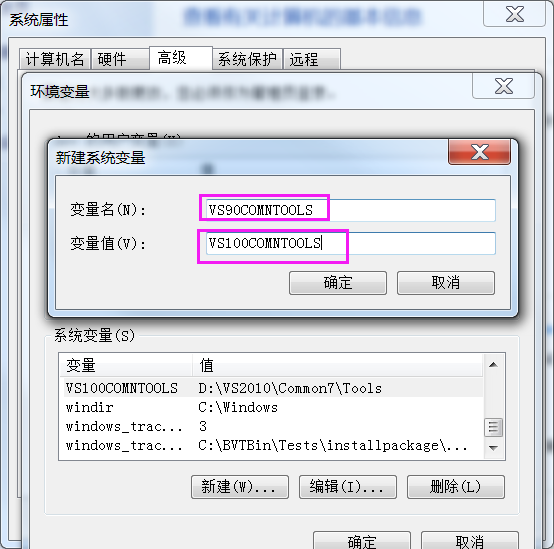
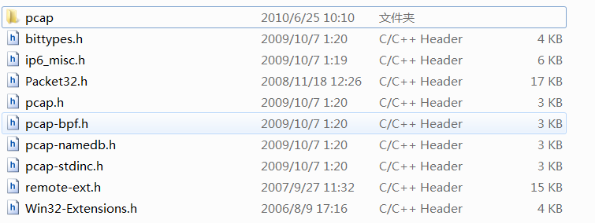

><font color=#0000FF face="微软雅黑" size=4>The more deep you dive , the more you will hear.</font>


***


#### 1、引言
　　这个需求是因为要在Windows系统上解析pcap文件（wireshark、tcpdump工具均可保存为这种格式），虽然之前也写了个脚本，但是自己代码水平太烂，功能也略单薄，所以还是用大神写的库吧。。。
<!-- more -->

#### 2、开工
　　这个安装还真是令人抓狂，各种报错，网上资料又少，折腾半天才搞定，记录一下方便以后安装使用，太蛋疼。先贴出参考过得比较有用的网址（其它的都是各种抄，各种转，根本不验证正确性。)：
　　1.http://blog.csdn.net/shouwangzhelv/article/details/50016577
　　2.http://blog.csdn.net/secretx/article/details/17472107
　　需要的工具包括（操作系统版本Win7_SP1_X64 6.1.7601.17514适用）：
　　1.VS2010专业旗舰版(VS2008也可以，但是个人用10最多，比较顺手，默认安装目录D:\VS2010)
　　2.WpdPack（下载地址http://www.winpcap.org/devel.htm，下载后的包解压待用）
　　3.python2.7（已安装pip，默认安装目录C:\python27）
##### 2.1、找不到vcvarsall.bat(或**make.bat，网上有人提到，但本次安装未遇到)文件
　　直接执行：
```bash
C:\Python27\Scripts>pip install pcapy
```
　　会报"*** unable to find vavarsall.bat ***"错误，如下所示（直接贴错误日志，方便复制、粘贴查询）：
```bash
C:\Python27\Scripts>pip install pcapy
Collecting pcapy
  Using cached pcapy-0.10.10.tgz
Installing collected packages: pcapy
  Running setup.py install for pcapy ... error
    Complete output from command c:\python27\python.exe -u -c "import setuptools
, tokenize;__file__='c:\\users\\dev\\appdata\\local\\temp\\pip-build-lsboh1\\pca
py\\setup.py';f=getattr(tokenize, 'open', open)(__file__);code=f.read().replace(
'\r\n', '\n');f.close();exec(compile(code, __file__, 'exec'))" install --record
c:\users\dev\appdata\local\temp\pip-umphoh-record\install-record.txt --single-ve
rsion-externally-managed --compile:
    running install
    running build
    running build_ext
    building 'pcapy' extension
    error: Microsoft Visual C++ 9.0 is required (Unable to find vcvarsall.bat).
Get it from http://aka.ms/vcpython27

    ----------------------------------------
Command "c:\python27\python.exe -u -c "import setuptools, tokenize;__file__='c:\
\users\\dev\\appdata\\local\\temp\\pip-build-lsboh1\\pcapy\\setup.py';f=getattr(
tokenize, 'open', open)(__file__);code=f.read().replace('\r\n', '\n');f.close();
exec(compile(code, __file__, 'exec'))" install --record c:\users\dev\appdata\loc
al\temp\pip-umphoh-record\install-record.txt --single-version-externally-managed
--compile" failed with error code 1 in c:\users\dev\appdata\local\temp\pip-buil
d-lsboh1\pcapy\
```
　　网上给的意见是设置VS90COMNTOOLS这个环境变量即可，但是在我电脑上设置后，再次执行，错误依旧，原因未知，懒得理了，反正有暴力方法解决→\_→。
　　然后就直接上 http://blog.csdn.net/secretx/article/details/17472107 给出的暴力解决方法，先贴出网上搜的比较多的设置环境变量的方法：
```bash
C:\Users\dev>SET VS90COMNTOOLS=%VS100COMNTOOLS%      ----VS2010版
```
或
```bash
C:\Users\dev>SET VS90COMNTOOLS=%VS110COMNTOOLS%      ----VS2012版
```
或
```bash
C:\Users\dev>SET VS90COMNTOOLS=%VS120COMNTOOLS%      ----VS2013版
```
　　这是比较讲道理的做法，但是有时候电脑它不跟你讲道理啊。那么这时候可以直接去配置你的系统环境变量VS90COMNTOOLS，如下图2-1所示（同时，需要根据你VS版本配置）：
  

<div align='center'>图2-1  直接配置环境变量VS90COMNTOOLS</div>

　　如果没有这个环境变量，需要新建一个（我当时就是没有注意，直接改的VS100COMNTOOLS这个环境变量，结果发现怎么改都不对，然后采用了第二种暴力方法解决了囧）。
　　如果执行了上述操作都还不生效（如果你不幸遇到了这种情况果断放弃吧，用Linux装，RP问题不解释。)，可以直接在python代码里面改，在C:\Python27\Lib\distutils找到文件msvc9compiler.py，下拉到第<font color=#FF0000 size=4> 243 </font>行（不同版本可能会有差异，可以直接搜），找到：
```python
toolskey = "VS%0.f0COMNTOOLS" % version
```
　　直接修改成“VS100COMNTOOLS”（2010版VS，其它请将数值修改为对应版本），如下所示：
```python
toolskey = "VS100COMNTOOLS"
```
　　修改后保存，再次执行安装命令不会报之前的错误。
##### 2.2、无法打开pcap.h(或其它任意**.h文件)
　　再次执行安装时，可能会出现如下错误：
```bash
***输出截断

    D:\VS2010\VC\BIN\cl.exe /c /nologo /Ox /MD /W3 /GS- /DNDEBUG -DWIN32=1 -Ic:\
devel\oss\wpdpack\Include -Ic:\python27\include -Ic:\python27\PC /Tppcapdumper.c
c /Fobuild\temp.win32-2.7\Release\pcapdumper.obj
    pcapdumper.cc
    pcapdumper.cc(11) : fatal error C1083: 无法打开包括文件:“pcap.h”: No such
file or directory
    error: command 'D:\\VS2010\\VC\\BIN\\cl.exe' failed with exit status 2

    ----------------------------------------
Command "c:\python27\python.exe -u -c "import setuptools, tokenize;__file__='c:\
\users\\dev\\appdata\\local\\temp\\pip-build-6yfc8p\\pcapy\\setup.py';f=getattr(
tokenize, 'open', open)(__file__);code=f.read().replace('\r\n', '\n');f.close();
exec(compile(code, __file__, 'exec'))" install --record c:\users\dev\appdata\loc
al\temp\pip-wh9p_o-record\install-record.txt --single-version-externally-managed
 --compile" failed with error code 1 in c:\users\dev\appdata\local\temp\pip-buil
d-6yfc8p\pcapy\
```
　　按照网上说法，造成这个错误的原因是缺乏WpdPack文件，百度搜出来这个文件的全名应该是"WinPcap Developer's Pack"，下载后解压（地址上面已给出），把解压后的文件夹里面的include
文件夹下的所有文档（不包含include这个根目录）整体拷贝到python的头文件目录(我的是C:\Python27\include)，如下图2-2所示：


<div align='center'>图2-2  拷贝头文件</div>

##### 2.3、无法打开wpcap.lib文件
　　解决第二个问题后，再次执行安装时，还会报如下错误：
```bash
***输出截断
    LINK : fatal error LNK1181: 无法打开输入文件“wpcap.lib”
    error: command 'D:\\VS2010\\VC\\BIN\\link.exe' failed with exit status 1181

    ----------------------------------------
Command "c:\python27\python.exe -u -c "import setuptools, tokenize;__file__='c:\
\users\\dev\\appdata\\local\\temp\\pip-build-6hkx5z\\pcapy\\setup.py';f=getattr(
tokenize, 'open', open)(__file__);code=f.read().replace('\r\n', '\n');f.close();
exec(compile(code, __file__, 'exec'))" install --record c:\users\dev\appdata\loc
al\temp\pip-ccidg9-record\install-record.txt --single-version-externally-managed
 --compile" failed with error code 1 in c:\users\dev\appdata\local\temp\pip-buil
d-6hkx5z\pcapy\
```
　　这个错误的原因与第二个类似，缺乏相应的lib库文件，只需要把刚才解压的文件夹下的lib目录里面的库文件拷贝到VC\lib文件夹下即可。
　　如果是64位系统，最好把x64这个文件夹下的.lib文件拷贝一份到VC\lib\amd64里面，其中VC\lib\文件夹在你的VS的安装目录中（我的是D:\VS2010\VC\lib），再次执行安装，一切正常。
##### 2.4、其它可能错误
　　根据网上的帖子，安装中可能还会遇到error C3163: “_vsnprintf”: 属性与以前的声明不一致错误，网友的说法是“现在执行的脚本里的定义和本来VC里面定义的这个变量冲突了”，修改执行脚本：
```c++
#if （_MSC_VER != 1500）   // 只针对VC++ 2008注释下面的代码行

#    define vsnprintf _vsnprintf

#endif
```
#### 3、结语
　　这个安装是在是太折腾，耗费了我一下午时间，不过那谁说的站在巨人的肩膀上就是好办事，感谢热爱折腾的网友们给出的建议，<font color=#FF0000 size=4>转载时请务必把上面两个链接帖进去</font>。