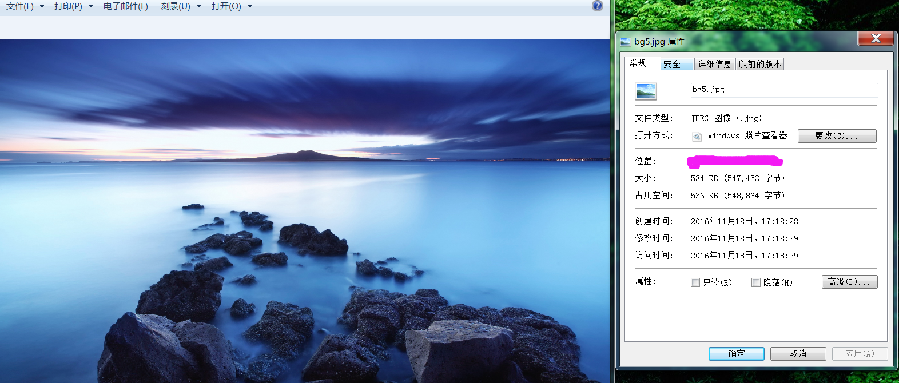
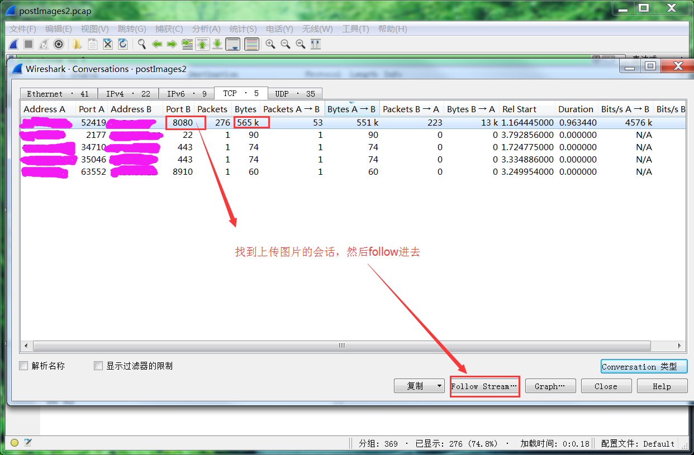
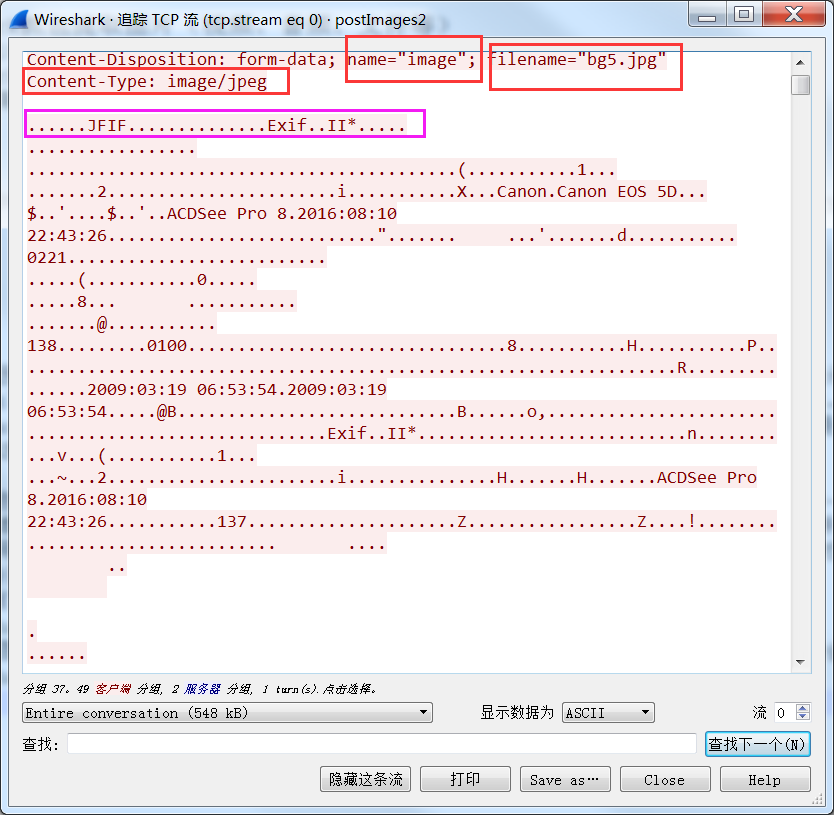
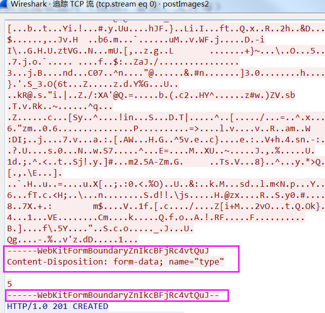
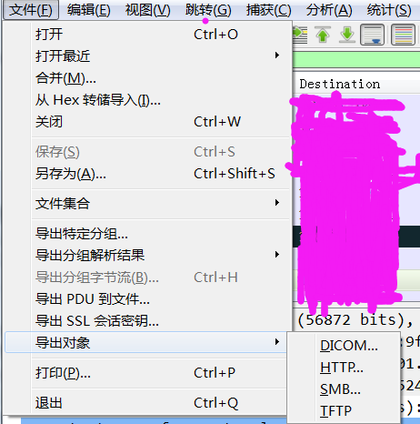
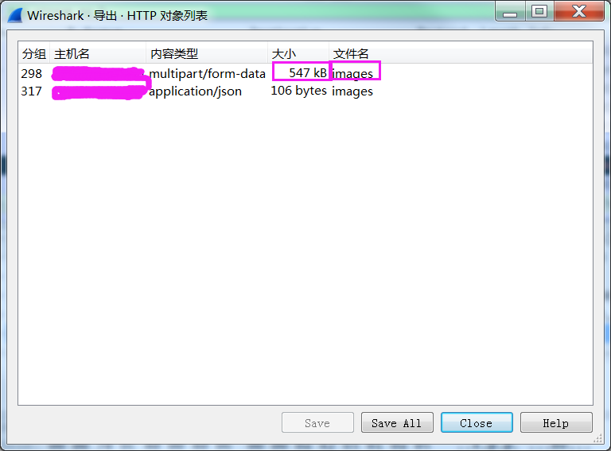
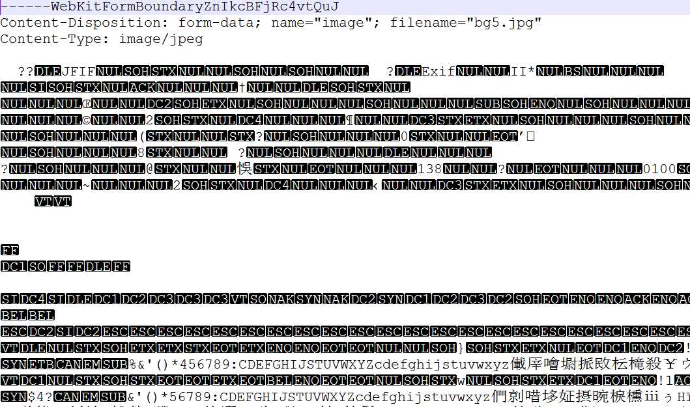
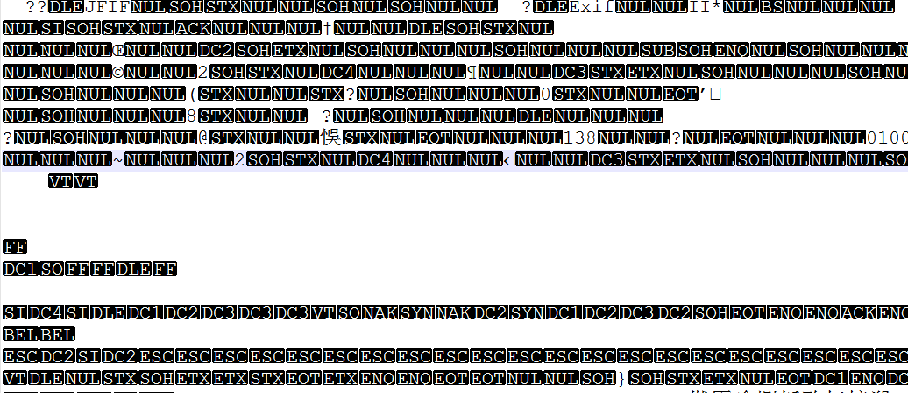
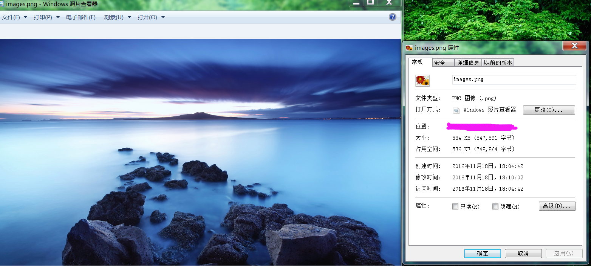

>The more deep you dive , the more you will hear.

***

#### 1、引言
　　这个需求是因为有个朋友在上传图片时遇到了问题，在上传后的设备上打开图片时提示图片已损坏，因为对wireshark不太熟悉，所以她抓到包之后一打开全是ascii码，不知道如何还原图片，然后来问我。
　　其实我对wireshark的很多功能也不太了解，不过好歹用了几个月了，不能让人竖中指啊是不是，一番百度和摸索之后解决了这个问题。
<!-- more -->

#### 2、开工
　　需要的工具包括：wireshark(最好是stable版，测试时用的Version 2.0.1(v2.0.1-0-g59ea380)
，已知≥2.0.2版本在解包时存在一些Bug，导致最后还原出来的图片被拆分成多个文件，并且不能follow stream)、notepad++(v7.1，推荐使用该工具编辑还原出来的图片文件，已知用sublime操作时会出现问题，导致图片不能还原，原因尚未知，应该是对编码处理的不同导致的问题)。
##### 2.1、上传图片、抓包分析
　　先来看看我们要上传的图片，如下图2-1所示：

图2-1  要上传的图片

　　注意上图中图片的大小，这个可以让我们在复杂的数据流中快速的定位到我们要找的会话。抓包后，在“统计”-->“对话”中去找我们的上传会话，如下图2-2所示：

图2-2  找出上传图片会话

　　follow进去之后，可以看到这是一个很明显的POST请求，稍微往下拖拽一点可以找到很多关键字提示正在上传的是一个图片文件，熟悉.png、.jpg等图片格式的看到开头的"......JFIF.............."就知道，我们上传的整个图片内容就从这里开始，如下图2-3所示：

图2-3  上传图片会话前部数据流

　　再往下一直拖到底部，可以看到非常明显的文件结束提示"------WebKitFormBoundary"，如下图所示2-4：

图2-4  上传图片会话尾部数据流

　　根据会话中交互数据大小以及这些提示信息，我们基本可以断定，刚才上传的图片就在这个会话中。
##### 2.2、导出HTTP对象
　　接下来回到wireshark界面（已经为我们选好了会话），把这个会话的数据导出为HTTP对象，如下图2-5所示：

图2-5  导出为HTTP对象1

　　选择后会弹出一个对话框，里面列举了该会话中所包含的images、files甚至音频、视频文件，因为我只传了一张图片，所所以这里就只有images文件，从该文件的大小判断，应该是刚才上传的。选中要导出的文件，然后点击"save"（如果是"save all"则这个对话框中列出来的所有文件都会被保存）导出我们的images文件，如下图2-6所示：

图2-6  导出为HTTP对象2

　　然后找到我们刚才导出的文件，添加后缀名（.png或者.jpg等，要与原始对象格式一致），一般来说就可以打开了。但是由于一些特殊原因，我发送的图片被添加了一些头部，直接添加后缀后并不能打开，还需要处理掉这些头部信息。
##### 2.3、处理头部信息
　　在处理之前，先不要修改文件后缀，直接用notepad++打开，可以看到有三行非常明显的头部数据，外加一行空白行。去掉这四行后，保存，再添加相关后缀即可打开了，对比还原后的文件和源文件，可以看到几乎是一模一样的。如下图2-7~2-9所示：

图2-7 修改头部信息前

图2-8 修改头部信息后

图2-9 最终还原的图片

##### 2.4、后记
　　整个图片的还原就到此结束了，但是由此我还想到了一些问题，比如如果图片在上传前经过了压缩或者加密，那么这种方法是无效的。
　　仅仅是压缩过的图片可能还好办，只要找到了其压缩方法，进行还原即可。对于加密过得数据流，几乎不可能破解。所以我们自己在设计或者选择应用时，尽量选择使用加密协议传输，避免被别有用心者窃取。