> 时光易逝，记忆也不会永恒。

***

##### 1.1 序
    　　在搭建这个个人博客之前，我所有的笔记都是以word、txt或者其它形式的本地文档保存的。这样存在两个主要的问题：  
	　　①各种文档的格式排版并不统一，即使是同一个软件如word文档，不同版本（03、07、10）兼容性也有问题，打开后会出现混乱的格式。  
	　　②本地文件容易丢失，并且不能异地编辑。  
	　　在参考一些网上教程后，也完成了自己博客的搭建，开启了新的装逼之旅。闲话少许，下面直接上图。
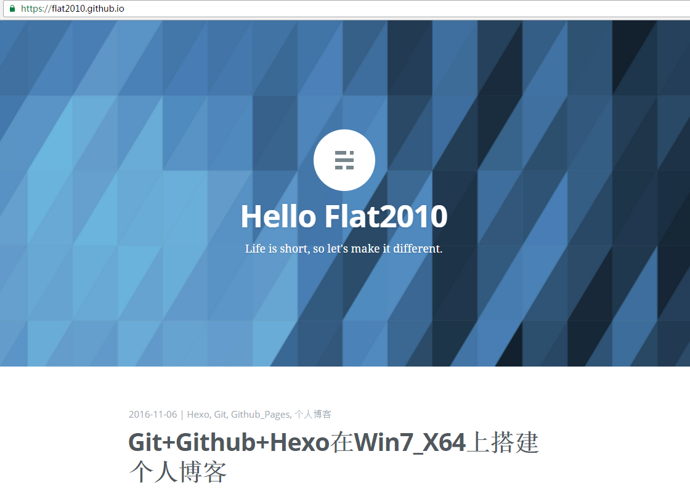
<!-- more -->

##### 1.2 前期准备
    　　软件：git、github、hexo、Node.js
    　　硬件：Win7_X64
    　　账号注册：需要申请一个github的账号
    　　注：我搭建时软件版本分别为git2.10.1.windows.1、github-3.3.2.0-570bd2e(Chocolate-Covered Yaks，桌面版)、hexo-1.0.2(hexo-cli)、Node.js-6.9.1，版本不同可能会略有些差异，请知晓。
	
##### 1.3 Step1：生成github_pages
    　　github账号申请好后，直接在登录，然后去新建一个仓库(new repository)，如果是第一次登陆好像会弹窗提示你新建仓库，如果已经建过其它仓库，可以在登陆后主页面的右下角找到，如下图所示：
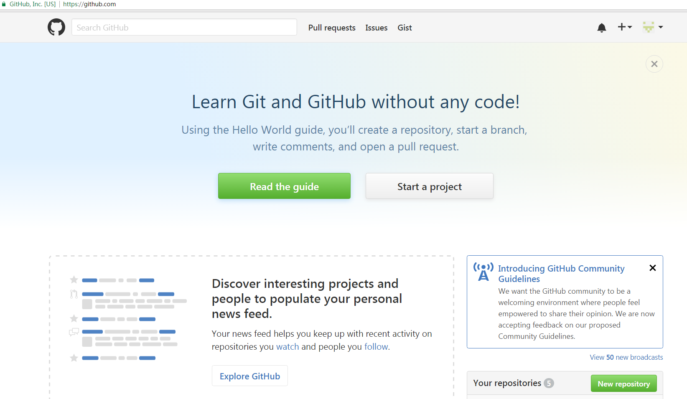
    　　注意这里新建的仓库的名字前缀一定要是你的github账号（即你的用户名），后缀为.github.io，我的用户名是flat2010，那么新建的时候我的repository的名字即为：flat2010.github.io。
    　　建好后，你的仓库的地址为：
https://你的用户名.github.io
    　　等下面我们生成githubpages后在浏览器中键入该地址就能访问了。创建好后，进入新建的仓库（项目），在上面的菜单中找到“settings”，如下图所示：
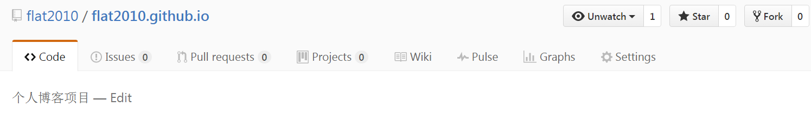
    　　点击进去后，一直往下拖，在页面中下部位置找到"Launch automatic page generator"，如下图所示：
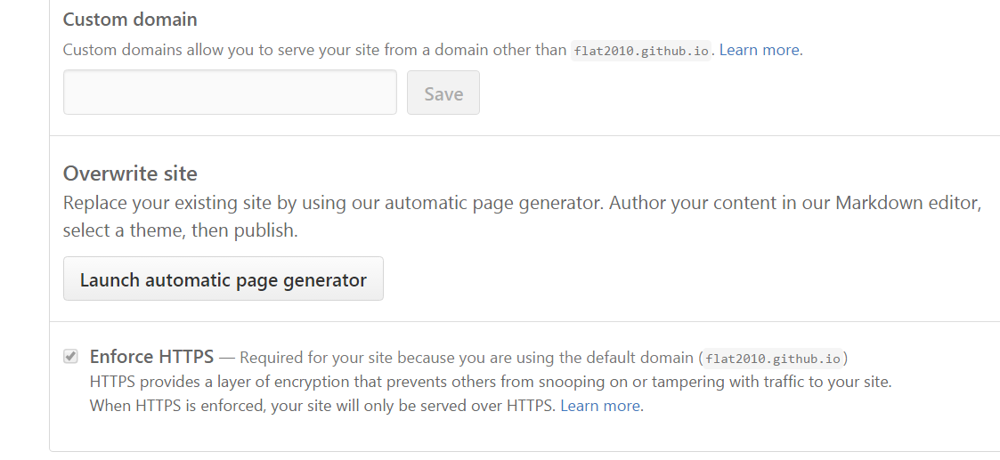
    　　进去后同样往下拖，在页面右下角找到"continue layouts"，如下图所示：
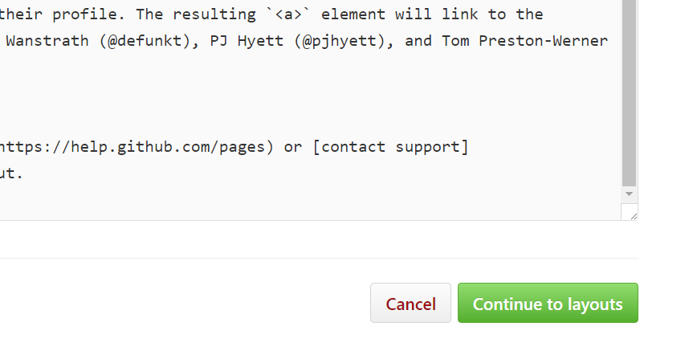
    　　点进去后，会让你选择你的首页的模板，选一个你喜欢的style，然后点击"publish page"即可（点击模板页面下方自动生成预览图哦），如下图所示：
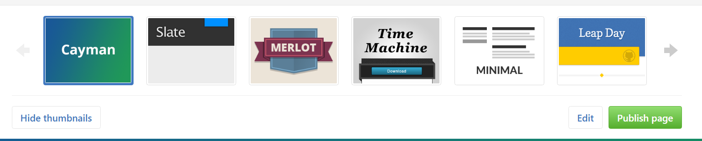
    　　这时候，在浏览器中键入你仓库的地址:
https://你的用户名.github.io
    　　看看效果吧，蛋定，这个还不是你的博客^--^。
	
##### 1.4 Step2：安装Node.js和Git
    　　Node.js的安装没有什么需要特别注意的地方，安装也挺简单的，就不多说了，重点说说Git安装时需要配置的地方，都在下面图中用红色方框和文字说明了。
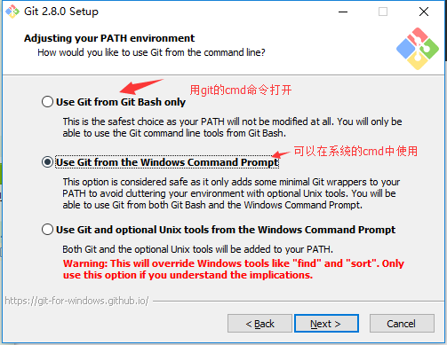
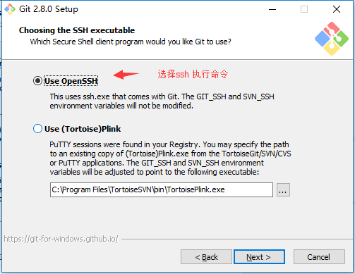
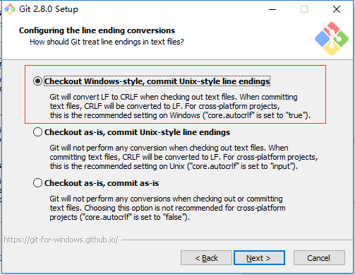
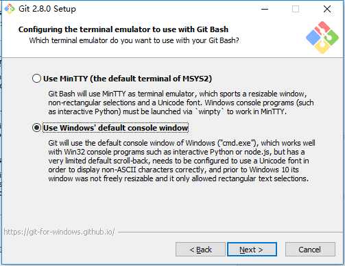
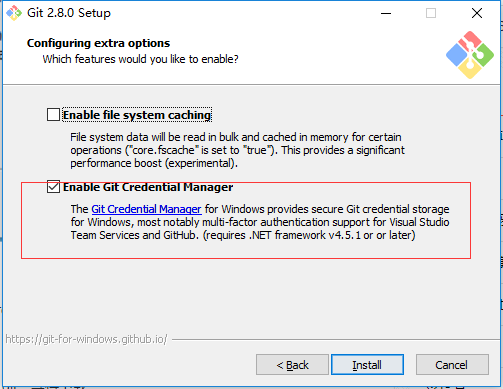
    　　版权说明：以上5个图摘自CSDN博客
http://blog.csdn.net/wx_jin/article/details/51027783
    　　转载请注明出处！！！（安装的时候忘了截图，只能借用别人的了。）
    　　安装完成后，在“所有程序”中找到Node.js,如下图所示：。
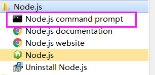
    　　点击图中红色方框内"Node.js command prompt"弹出终端，在最顶部一行会显示当前的Node.js版本号，键入"git version"命令，则会显示当前安装的Git版本信息，如下图所示：。
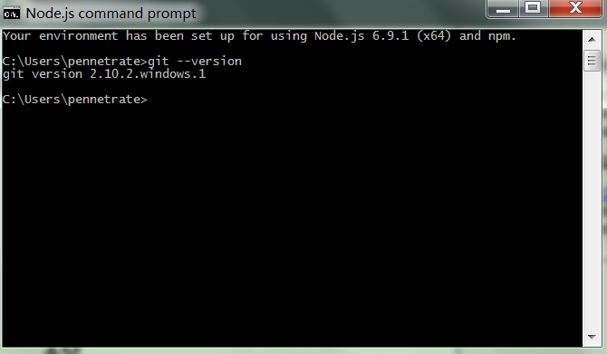

##### 1.5 Step3：配置SSH Key
    　　配置SSH Key是为了将你的机器和Github进行绑定，可以免密提交。首先仍然去“所有程序”中找到新安装的Git，如下图所示：
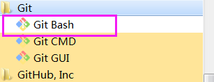
    　　点击"Git Bash"打开一个shell，键入"cd ~/.ssh"以及"ls -al"命令可以查看你的.ssh文件夹下的内容（如果你之前没有配置过，这个目录应该是空的），然后键入"ssh-keygen -t rsa -C 你的Gighub账号绑定的邮箱"成功后会在该目录下生成两个文件id_rsa、id_rsa.pub，如下图所示：
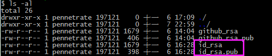
    　　下面我们就去Github上配置刚才生成的key，去Github登录后点击你的头像，然后找到最右上角的图标，点击然后选择"settings"-->"SSH and GPG keys"-->"New SSH key"，如下图所示：
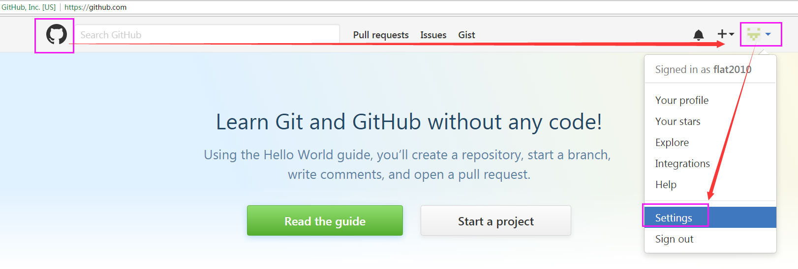
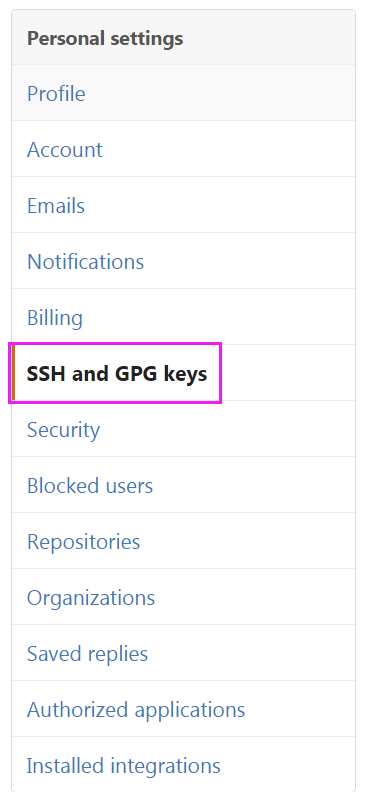
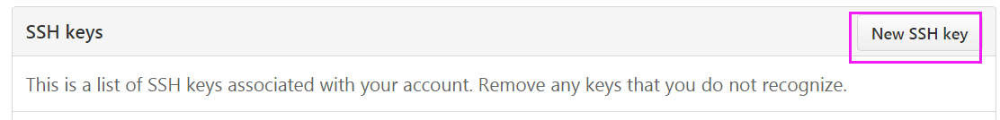
    　　然后按照下图说明，添加刚才生成的pub key：
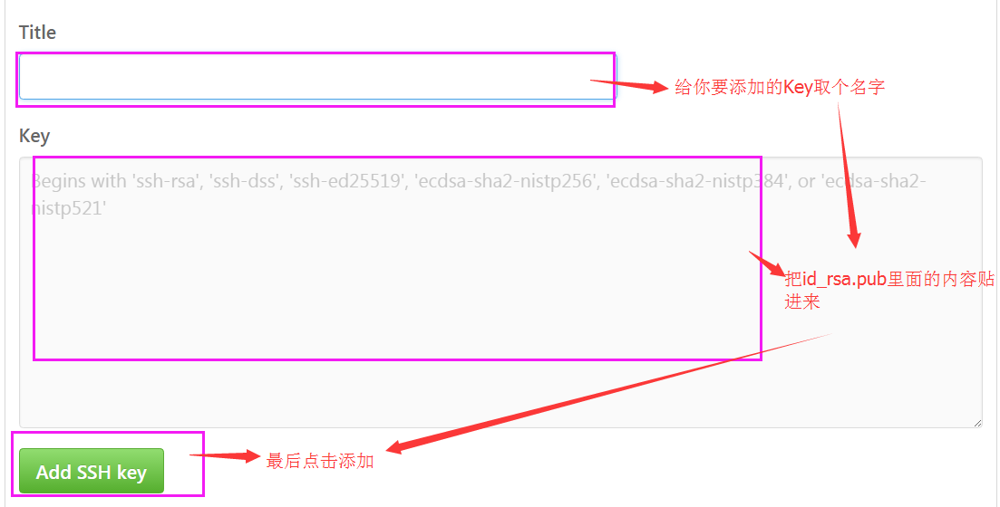
    　　现在你就可以在本机上提交代码（文档、图片）到Github上了。

##### 1.6 Step4：安装配置Hexo
    　　在本机上新建一个文档，用来存放你的个人博客相关的文件，然后打开这个文件夹，在这个文件夹中单击右键，在弹出的菜单中选择"Git Bash Here",这时会弹出一个"shell"，键入命令"npm install -g hexo"来自动完成Hexo的安装（需要联网），安装过程中可能会提示有错误，如下图示：
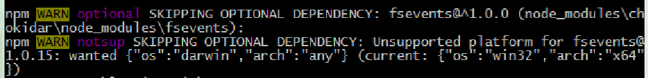
    　　如果除了这两个错误信息没有其它的，不要理会它（这个坑不小，让我折腾了很久，总以为没有安装成功->__->），键入"hexo"看是否出现帮助信息即可验证是否安装成功，如下图所示：
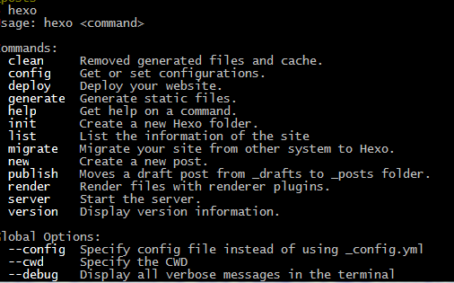
    　　安装成功后先不要关闭这个"shell"，我们还要对Hexo行初始化（init），键入"hexo init hexo"，初始化成功后会显示"INFO Start blogging with Hexo!"，如下图所示：
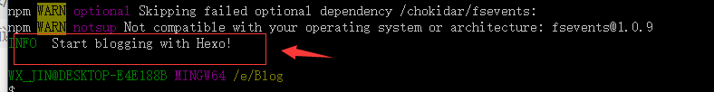
    　　版权说明：上图摘自CSDN博客
http://blog.csdn.net/wx_jin/article/details/51027783
    　　转载请注明出处！！！
    　　这时在你刚才新建的博客文件夹中会多出一个名为"hexo"的文件夹，在"shell"中分别键入"cd hexo"-->"npm install"-->"hexo generate"，以完成Hexo的依赖文件的安装以及部署。这个过程中可能也会有两条提示“不兼容”之类的错误信息，不要理会，等待安装、部署完成后，执行"hexo server"运行我们的Hexo服务，一切正常的话"shell"中会提示如下图所示信息：
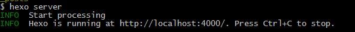
    　　如果没有成功，回头检查是哪步错了吧^--^。在浏览器中键入：
http://localhost:4000/
    　　即可看到我们的个人博客主页了（当然目前还是在本地运行的，别着急）。

##### 1.7 Step5：配置部署信息并托管到Github
    　　打开hexo文件夹下面的配置文件"_config.xml"，一直往下滚动，找到"deploy"配置字段（默认在最底部），配置如下图所示：

    　　说明：reopository的设置中，"github.com:"后面一定要改成你自己的Github账号名+Step1中新建的仓库地址。
    　　这个配置文件中的另外一些字段的配置如下图所示，根据你自己需要进行修改就好了，图中重要属性都进行了说明，如下图所示：
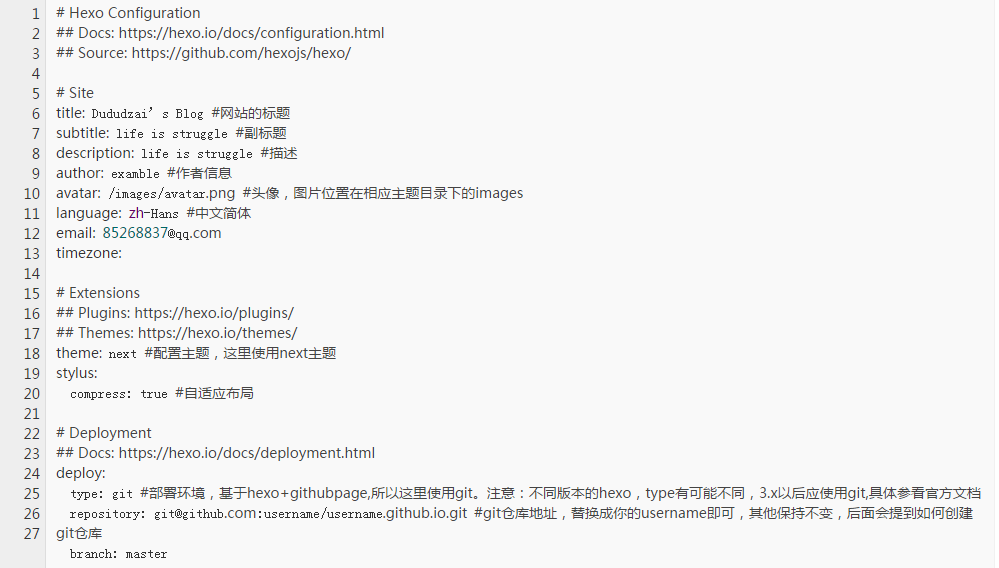
    　　配置完成后，安装hexo-deployer-git插件，如下图所示：
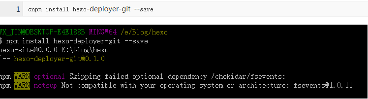
    　　安装完成后，先后执行"hexo clean"-->"hexo generator"-->"hexo deploy"完成部署（托管、提交）到Github上（如果在本地更换了Hexo主题的话，就要执行一遍这个过程），如下图所示：
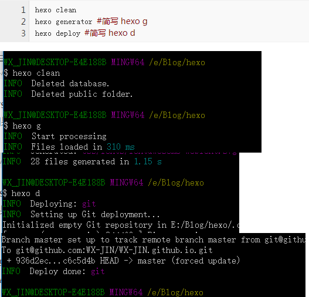
    　　版权说明：以上4个图摘自CSDN博客
http://blog.csdn.net/wx_jin/article/details/51027783
    　　转载请注明出处！！！

##### 1.8 Step6：大功告成
    　　至此，所有的安装、配置工作就结束了，如果一切正常，在浏览器中键入:https://第一步配置的Gitbhub仓库地址(一般是XXX.github.io)即可看到你的个人博客主页了，如下图所示：

##### 2.0 后记
    　　Hexo默认的主题（landscape）真心觉得非常一般，可以在github上搜索一些做的比较好的，推荐"next"和"casper"，我个人比较喜欢简约低调天蓝色，因此用的"casper"。
    　　这是我用md+hexo写的第一篇个人博文，之前完全没有接触过，真的是花了不少时间，因为工作比较忙，只能每天下班后加班到深夜一两点这样子一点一点的来完成，虽然累，但是做完之后的那种成就感，懂的人自然懂。
    　　但这只是万里长征第一步，后续准备把之前所有的读书笔记、心得全部搬上来，估计累的够呛。
    　　做技术也许就是这样子吧，累并快乐着，虽然很多时候都只是自娱自乐，“子非鱼，安知鱼之乐^--^"。

    　　Life is short, so let's make it different

    　　

