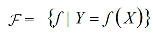
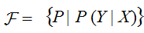
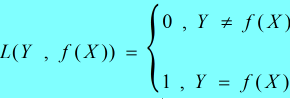
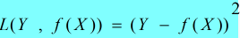
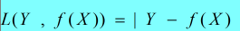
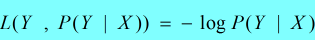

><font color=#0000FF face="微软雅黑" size=4>Every oak must be an acorn.</font>
***  

## 一、学习分类
&emsp;&emsp;统计学习主要由以下几种组成：  
&emsp;&emsp;  ①监督学习（Supervised learning）；  
&emsp;&emsp;  ②非监督学习（Unsupervised learning）；  
&emsp;&emsp;  ③半监督学习（Semi-supervised learning）；
&emsp;&emsp;  ④强化学习（Reinforcement learning）。  
&emsp;&emsp;在《统计学习方法》一书中，主要围绕**①监督学习（Supervised learning）**进行。
## 二、三要素
&emsp;&emsp;统计学习方法由如下三要素构成：  
&emsp;&emsp;①模型（model）；  
&emsp;&emsp;②策略（strategy）；  
&emsp;&emsp;③算法（algorithm）。  
&emsp;&emsp;统计学习方法可以简单的表述成：  
```shell
方法 = 模型 + 策略 + 算法
```

### 2.1 模型
&emsp;&emsp;**模型（model）就是所要学习的条件概率分布或决策函数。**其中由条件概率表示的模型称为**`概率模型`**，而由决策函数表示的模型则称为**`非概率模型`**。 
&emsp;&emsp;**模型的本质**是一个从输入到输出的**映射**。给定输入、输出数据的情况下，满足映射关系的模型是非常多的，这些映射关系所组成的集合就称为**`假设空间(hypothesis space)`**，而学习的目的则在于从假设空间中寻找到**最优**的模型。  

#### 2.1.1 决策函数
&emsp;&emsp;以决策函数的集合定义的假设空间表达式为：  

<div align='center'>图2-1　　决策函数表示的假设空间</div>

&emsp;&emsp;式中：  

&emsp;&emsp;&emsp;&emsp;X——是定义在输入空间上的变量；  
&emsp;&emsp;&emsp;&emsp;Y——是定义在输出空间上的变量。  

&emsp;&emsp;通常假设空间是由一个**`n(n ∈ R^n)`**维的参数向量θ控制的，称为**`参数空间(parameter space)`**。  

#### 2.1.2 条件概率
&emsp;&emsp;以条件概率的集合定义的假设空间表达式为：  

<div align='center'>图2-2　　条件概率表示的假设空间</div>  
&emsp;&emsp;式中X、Y含义同上。  

###  2.2 策略
&emsp;&emsp; **`策略`**是我们从假设空间选取最优模型的学习准则或者学习方法。包含**`损失函数`**和**`风险函数`**。  

#### 2.2.1 损失函数
&emsp;&emsp;**`损失函数(loss function)`**（也称作**`代价函数(cost function)`**），用来评估模型<font color=#FF0000 size=4>单次</font>预测的好坏。它是模型`f(x)`和输出`Y`的<font color=#FF0000 size=4>非负实值</font>函数，记作：**`L(Y , f(X))`**。  

&emsp;&emsp;常用损失函数：  

&emsp;&emsp;**①0 — 1损失函数(0-1 loss function) **   


<div align='center'>图2-3　　0—1损失函数</div>

&emsp;&emsp;**②平方损失函数(quadratic loss function) **   


<div align='center'>图2-4　　平方损失函数</div>  

&emsp;&emsp;**③绝对损失函数(absolute loss function) **      


<div align='center'>图2-5　　绝对损失函</div>  

&emsp;&emsp;**④对数损失函数(logarithmic loss function) **  或 **对数似然损失函数(log-likelihood loss function)**     


<div align='center'>图2-6　　对数损失函数</div>  

#### 2.2.2 风险函数 VS 经验风险
&emsp;&emsp;
