><font color=#0000FF face="微软雅黑" size=4>Every oak must be an acorn.</font>
***  

## 一、学习分类
&emsp;&emsp;统计学习主要由以下几种组成：  
&emsp;&emsp;  ①监督学习（Supervised learning）；  
&emsp;&emsp;  ②非监督学习（Unsupervised learning）；  
&emsp;&emsp;  ③半监督学习（Semi-supervised learning）；
&emsp;&emsp;  ④强化学习（Reinforcement learning）。  
&emsp;&emsp;在《统计学习方法》一书中，主要围绕**监督学习（Supervised learning）**进行。
<!-- more -->
## 二、三要素
&emsp;&emsp;统计学习方法由如下三要素构成：  
&emsp;&emsp;①模型（model）；  
&emsp;&emsp;②策略（strategy）；  
&emsp;&emsp;③算法（algorithm）。  
&emsp;&emsp;统计学习方法可以简单的表述成：  
```shell
方法 = 模型 + 策略 + 算法
```

### 2.1 模型
&emsp;&emsp;**模型（model）就是所要学习的条件概率分布或决策函数。**其中由条件概率表示的模型称为**`概率模型`**，而由决策函数表示的模型则称为**`非概率模型`**。 
&emsp;&emsp;**模型的本质**是一个从输入到输出的**映射**。给定输入、输出数据的情况下，满足映射关系的模型是非常多的，这些映射关系所组成的集合就称为**`假设空间(hypothesis space)`**，而学习的目的则在于从假设空间中寻找到**最优**的模型。  

#### 2.1.1 决策函数
&emsp;&emsp;以决策函数的集合定义的假设空间表达式为：  

<div align='center'>图2-1　　决策函数表示的假设空间</div>

&emsp;&emsp;式中：  

&emsp;&emsp;&emsp;&emsp;X——是定义在输入空间上的变量；  
&emsp;&emsp;&emsp;&emsp;Y——是定义在输出空间上的变量。  

&emsp;&emsp;通常假设空间是由一个**`n(n ∈ R^n)`**维的参数向量θ控制的，称为**`参数空间(parameter space)`**。

#### 2.1.2 条件概率
&emsp;&emsp;以条件概率的集合定义的假设空间表达式为（式中X、Y含义同上）：  

<div align='center'>图2-2　　条件概率表示的假设空间</div>

### 2.2 策略
&emsp;&emsp;所谓**`策略`**是我们从假设空间选取最优模型的学习准则或者学习方法。包含**`损失函数`**、**`风险函数`**、**`结构函数`**。  

#### 2.2.1 损失函数
&emsp;&emsp;**`损失函数(loss function)`**（也称作**`代价函数(cost function)`**），用来评估模型<font color=#FF0000 size=4>单次</font>预测的好坏。它是模型**`f(x)`**和输出**`Y`**的<font color=#FF0000 size=4>非负实值</font>函数，记作：**`L(Y , f(X))`**。常用损失函数如下：  

&emsp;&emsp;**①0 — 1损失函数(0-1 loss function) **   


<div align='center'>图2-3　　0—1损失函数</div>

&emsp;&emsp;**②平方损失函数(quadratic loss function) **   


<div align='center'>图2-4　　平方损失函数</div>  

&emsp;&emsp;**③绝对损失函数(absolute loss function) **      


<div align='center'>图2-5　　绝对损失函</div>  

&emsp;&emsp;**④对数损失函数(logarithmic loss function) **  或 **对数似然损失函数(log-likelihood loss function)**     


<div align='center'>图2-6　　对数损失函数</div>  

#### 2.2.2 风险函数 *VS* 经验风险
&emsp;&emsp;所谓**`风险函数(Risk Function)`**也称作**`期望损失(Expected Loss)`**，是对损失函数求期望，它是关于**联合分布`P(X,Y)`**的期望损失，**本质仍然是期望**，定义式为：   
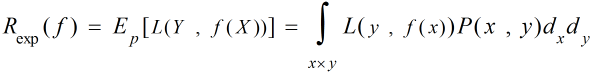
<div align='center'>图2-7　　风险函数定义</div>  

&emsp;&emsp;由上式可知，损失函数**`L(y,f(x))`**我们可以自己选择，但要求得模型的风险值，还需要知道输入**`X`**和输出**`Y`**两个随机变量的联合分布**`P(X,Y)`**，而这个联合分布又是未知的，所以直接求解风险函数是不现实的，通常是通过求解**经验风险**来实现模型评估的。  
&emsp;&emsp;所谓**`经验风险(Empirical Risk)`**也称作**`经验损失(Empirical Loss)`**，是对损失函数求平均值，它是关于**训练样本集**的平均损失，**本质是均值**，定义式为：  
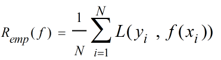
<div align='center'>图2-8　　经验风险函数定义</div>  

&emsp;&emsp;式中**`(xi,yi)`**表示第**i**个训练样本，**`N`**则表示训练集中样本总数，由大数定律可知，当训练样本总数**`N`**趋近于<font color=#000000 size=4>∞</font>时，经验风险**R<font color=#000000 size=1>emp</font>(f)**趋近于期望风险**R<font color=#000000 size=1>exp</font>(f)**。也即当我们手里有大量训练样本时，可以使用经验风险去估计期望风险，但是现实中往往训练样本数量有限，这个时候再使用经验风险去估计就会出现较大偏差，使得模型准确性较低，这个时候就需要对经验风险进行矫正，结构风险就应运而生了。  

#### 2.2.3 过拟合 *VS* 结构风险
&emsp;&emsp; 所谓**过拟合(Over-fitting)** ，是指我们根据已有数据建立的模型过于复杂，以至于该模型在已有数据上表现的非常完美而在新的数据集上却非常差，也即缺乏**泛化能力**。过拟合现象如下图所示：    
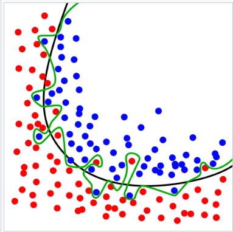
<div align='center'>图2-9　　过拟合示意图</div>  

&emsp;&emsp; 上图中黑色曲线是加入了正则化项的较好的拟合模型，而绿色曲线则是过拟合模型，可以看出两个模型中，过拟合模型对已有数据的拟合是相当完美的，成功的区分了每一个红色和蓝色圆点。但是当我们把这个模型用到新的数据集上时，新的样本稍微有点抖动，过拟合模型就会分类错误。对于噪声数据，也会相当敏感。
&emsp;&emsp;所谓 **结构风险(Structural Risk)**是在**经验风险**的基础上加了一个用来评估模型复杂度的**正则化项(Regularizer)**也称作**罚项(Penalty Term)**，用来约束模型的复杂度，其定义为：  
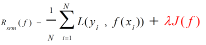
<div align='center'>图2-10　　结构风险函数定义</div>  

&emsp;&emsp;图中红色部分即为正则化项或罚项，其中**`J(f)`**为模型的复杂度函数，正比于模型复杂度。**`λ(≥0)`**为调节系数，用来调节经验风险和模型复杂度。  

#### 2.2.4 经验风险最小化 *VS* 结构风险最小化
&emsp;&emsp; 顾名思义，**`经验风险最小化(Empirical Risk Minimization)-简称ERM`**是对经验风险函数求最小值。因为经验风险正比于损失函数，所以最小化经验风险即是最小化损失，也就是最小化模型的误差或者说**最大化模型的精度**。按照ERM策略求解模型即是求：    
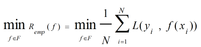
<div align='center'>图2-11　　经验风险最小化定义</div>  

&emsp;&emsp;前已述及，ERM策略适合样本容量较大的情况。ERM的一个典型例子是：**`极大似然估计(Maximum Likelihood Estimation)`**，它是**模型为条件概率分布**，**损失函数取对数损失**的情况。  
&emsp;&emsp;样本较少时，ERM策略选择出的模型并非是最优的，因为它通常会导致训练模型复杂化（过拟合）。为了控制这种风险，引入了结构风险最小化。  
&emsp;&emsp;顾名思义，**`结构风险最小化(Structural Risk Minimization)-简称SRM`**是对结构函数求最小值。因为结构函数中的正则化项正比于模型复杂度，所以最小化结构风险相当于平衡了模型复杂度和经验风险，使模型**泛化能力和准确率均最优**。按照SRM策略约束模型即是求：    
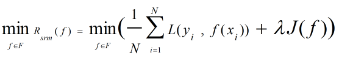
<div align='center'>图2-12　　结构风险最小化定义</div>    

#### 2.2.5 策略小结
&emsp;&emsp; 最后，用一张图来简单说明上述概念之间的关系，如下所示：  
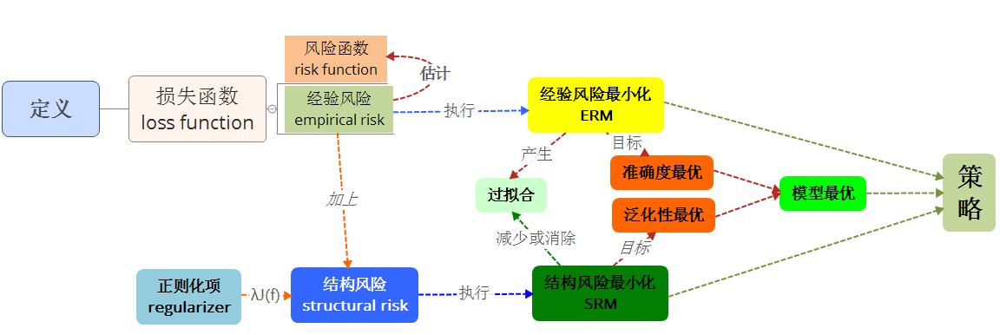
<div align='center'>图2-13　　策略小结</div>   

### 2.3 算法
&emsp;&emsp;所谓**算法**是指模型具体的计算方法，主要是求解最优化问题的算法。它要解决两个问题：一是**高效**，二是**全局最优**。这里先做个引子，后面会有大量篇幅讲解算法。

## 三、进阶
### 3.1 再谈模型
#### 3.1.1 训练误差 *VS* 测试误差
&emsp;&emsp;确定了损失函数后，通常就采用基于损失函数的**`训练误差(Traning Error)`**和**`测试误差(Test Error)`**来评估模型的优劣。顾名思义，前者是基于**训练数据集**的，而后者是基于**测试数据集**的。  
&emsp;&emsp;训练误差定义表达式为：  
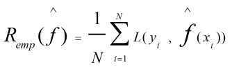
<div align='center'>图3-1　　训练误差定义式</div>    

&emsp;&emsp;式中N是训练数据集样本容量。**f^(X)**为我们学习到的模型。<font color=#FF0000 size=3>训练误差的大小对判定我们处理的问题是否容易学习得到对应的模型有意义，但也仅限于此，对模型的泛化能力无贡献。测试误差则反映了学习方法对未知的测试数据集的预测能力。</font>
&emsp;&emsp;测试误差定义表达式为：  

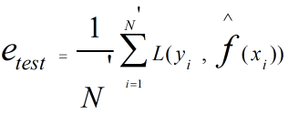
<div align='center'>图3-2　　测试误差定义式</div>   

&emsp;&emsp;式中N'则是测试数据集样本容量。  

#### 3.1.2 模型选择  
&emsp;&emsp;模型选择(Model Selection)是从假设空间中挑选出最逼近真实模型的假设模型。包含两个方面：一是**模型类型**（比如多项式模型、正弦模型），二是**参数个数**（比如二次多项式、三次多项式）。  
&emsp;&emsp;模型选择的宗旨是在尽量逼近真实模型的同时避免过拟合问题。  
&emsp;&emsp;模型复杂度、训练误差、测试误差三者的关系图如下所示：  

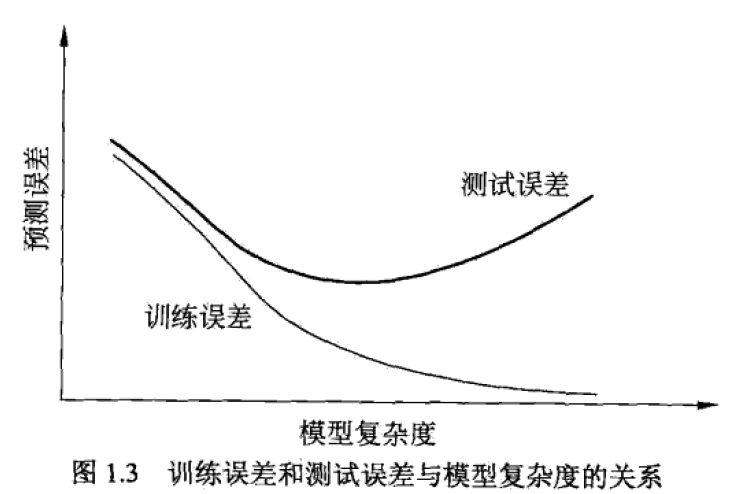
<div align='center'>图3-3　　训练和测试误差与模型复杂度关系（摘选自《统计学习方法》）</div>  

&emsp;&emsp;从上图可以明显看出，模型复杂度超过某个值之后，测试误差反而会越来越大，这就是过拟合造成的。

#### 3.1.3 生成模型 *VS* 判别模型
&emsp;&emsp;对于监督学习，其任务就是利用训练数据学习一个模型，其学习方法分成两类：一是**生成方法(Generative Approach)**，二是**判别方法(Discriminative Approach)**，对应学习到的模型分别称为**生成模型(Generative Model)**和**判别模型(Discriminative Model)**。  
&emsp;&emsp;**生成方法**是由训练数据学习<font color=#FF0000 size=3>**联合概率分布P(X,Y)**</font>，并藉此求出<font color=#FF0000 size=3>**条件概率分布P(Y|X)**</font>作为预测模型的方法。它表示了在给定输入**`X`**时，产生输出**`Y`**的生成关系，比如：**朴素贝叶斯**、**隐马尔科夫模型**。
&emsp;&emsp;**判别方法**则是由训练数据直接学习<font color=#FF0000 size=3>**决策函数f(X)或者条件概率分布P(X,Y)**</font>作为预测模型的方法。该方法关心的是**给定输入X**时，应该**预测什么样的输出Y**，比如：**K近邻法**，**感知机**，**决策树**等等。  
&emsp;&emsp;两种模型的优缺点如下：  
&emsp;&emsp;①生成方法：可还原**P(X,Y)**，判别方法不可以；收敛快；可用于**隐变量模型**，判别方法不可以。  
&emsp;&emsp;②判别方法：可直接得到**P(Y|X)**或**f(X)**；准确率更高；简化学习问题。

### 3.2 泛化
#### 3.2.1 正则化项
&emsp;&emsp;正则化是模型选择典型的方法，正则化项可以取不同的形式，以参数向量**`w`**为例，正则化项可以取**`w`**的**`N(≥0)`**范数，符合**`奥卡姆剃刀(Occam's Razor)`**原理。  
&emsp;&emsp;**奥卡姆剃刀原理**即为：如果关于同一个有许多种理论，每一种都能作出同样准确的预言，那么应该挑选其中使用假定最少的（即最简单的）。


#### 3.2.2 交叉验证
&emsp;&emsp;另一种常用的模型选择方法是**`交叉验证(Cross Validation)`**，它将给定数据集分成三部分（**通常是样本较为充足的情况下，如果样本不足则一般只分成训练和测试数据集**）：**`训练集(Training Set)`**——用于训练模型、**`验证集(Validation SET)`**——用于选择模型、**`测试集(Test Set)`**——用于最终对模型评估。其核心思想是**`重复利用数据`**，可分为：  
&emsp;&emsp;①简单交叉验证。对数据集的划分方法如下图（它没有验证集）：  

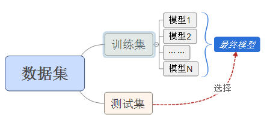
<div align='center'>图3-4　　简单交叉验证数据集划分</div>  

&emsp;&emsp;②**`S折交叉验证(S-fold cross validation)`**，对数据集的划分如下（应用最广）： 


<div align='center'>图3-5　　S折交叉验证数据集划分</div>  

&emsp;&emsp;③留一交叉验证(Leave-one-out Cross Validation)。本质上是**`S折交叉验证中S=N（划分数量等于样本数量，即每个样本作为一个数据集）`**的情况，通常在**`数据缺乏`**时使用。

#### 3.2.3 泛化误差
&emsp;&emsp;所谓**`泛化误差(Generalization Error)`**是指将学习到的模型**`f^`**对未知数据进行预测时的误差，表达式如下：  

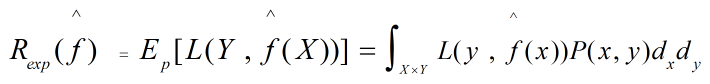
<div align='center'>图3-6　　泛化误差定义表达式</div>    

&emsp;&emsp;泛化误差的上界称为**`泛化误差上界(Generalization Error Bound)`**，它<font color=#FF0000 size=3>反比于**`样本容量`**（样本容量越大，泛化误差上界越小），正比于**`假设空间容量`**（假设空间越大，模型越难学习，泛化误差上界也越大）</font>。一个关于泛化误差上界的定理（**二分类**问题）如下：

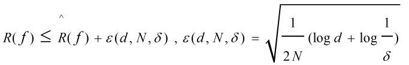
<div align='center'>图3-7　　泛化误差上界表达式</div>    

&emsp;&emsp;式中等号左端为泛化误差，右端为泛化误差上界（其中第一项为训练误差）,**`d`**表示假设空间中可能模型的数目,**`N`**为样本容量。上述不等式以**至少1-δ的概率**成立。  


### 3.3 监督学习
#### 3.3.1 三大问题
&emsp;&emsp;监督学习的三大问题包括：**`分类问题`**、**`标注问题`**、**`回归问题`**。分述如下： 
&emsp;&emsp;①**`分类问题`**是监督学习的一个**`核心问题`**，该类问题的输出变量**`Y`**必须是**`有限个离散值`**，输入变量则没有要求。按照输出类别数目可以分成**`二分类`**（输出只有两种类型）和**`多分类`**（输出类别在两种以上）。利用已有的数据学习到的模型称为**`分类器`**，关于分类器我们会在3.3.2节中进一步讲解。  
&emsp;&emsp;②**`回归问题`**是监督学习中另一个**`核心问题`**，它与分类问题相对应，它的输出变量**`Y`**则是**`连续型数值`**，它的本质是**`函数拟合`**。按照输入变量个数划分成**`一元回归`**（有且仅有一个输入变量）、**`多元回归`**（有多个输入变量）。按照输入变量和输出变量的关系又可以分为**`线性回归`**（线性关系）和**`非线性回归`**（非线性关系）。最常使用的是**`平方损失函数`**，可由著名的**`最小二乘法(Least Squares)`**求解。
&emsp;&emsp;③**`标注问题`**也属于监督学习的一个问题，它属于分类问题的一个推广，该类问题的输入时一个**`观测序列`**，而输出则是**`标记序列（或状态序列）`**，标注常用的学习方法有：**`隐马尔科夫模型`**和**`条件随机场`**。在信息抽取和自然语言处理中用的较多。

#### 3.3.2 分类器指标
&emsp;&emsp;评价分类器性能的指标一般是**`准确率(Accuracy)`**，定义为：给定测试数据集，正确分类样本数占样本总数比例。二分类问题用的更多的是<font color=#FF0000 size=3>**`精确率(Precision)`**和**`召回率(Recall)`**</font>。  
&emsp;&emsp;<font color=#FF0000 size=3>**精确率**</font>定义为：
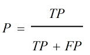
<div align='center'>图3-8　　精确率表达式</div>     

&emsp;&emsp;<font color=#FF0000 size=3>**召回率**</font>定义为：
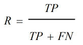
<div align='center'>图3-9　　召回率表达式</div>   

&emsp;&emsp;此外还有二者的调和均值<font color=#FF0000 size=3>**F1值**</font>：
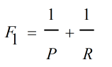
<div align='center'>图3-10　　F1值表达式</div>   

&emsp;&emsp;式中：  
&emsp;&emsp;&emsp;&emsp;**TP**（也称真阳）——表示**正类**预测为**正类**数量；  
&emsp;&emsp;&emsp;&emsp;**FN**（也称假阴）——表示**正类**预测为**负类**数量；  
&emsp;&emsp;&emsp;&emsp;**FP**（也称假阳）——表示**负类**预测为**正类**数量；  
&emsp;&emsp;&emsp;&emsp;**TN**（也称真阴）——表示**负类**预测为**负类**数量；

### 3.4 本章证明  
&emsp;&emsp;本章只有一个证明，就是前面**3.2.3节**中提到的泛化误差上界问题，因为涉及的公式和定理较多，篇幅较长，所以放在文章最后，供有兴趣的同学参考。
#### 3.4.1 Hoeffding's inequality（霍夫丁不等式）
&emsp;&emsp;对n个值域为**[a<font color=#000000 size=1>i</font> , b<font color=#000000 size=1>i</font>]**的独立随机变量**X<font color=#000000 size=1>i</font>，··· ···，X<font color=#000000 size=1>n</font>**，**`Hoeffding`**不等式定义如下：  
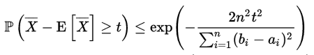
<div align='center'>图3-11　　Hoeffding不等式（经验均值表达式1）</div>     
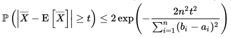
<div align='center'>图3-12　　Hoeffding不等式（经验均值表达式2）</div>     

&emsp;&emsp;上面的表达式是用这**n**个独立随机变量的经验均值表示的，即有：  
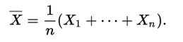
<div align='center'>图3-13　　n个独立随机变量经验均值表达式</div>     

&emsp;&emsp;如果用求和表达式来表示**`Hoeffding`**不等式，则有：  
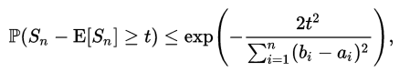
<div align='center'>图3-14　　Hoeffding不等式（累积和表达式1）</div>     
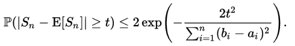
<div align='center'>图3-15　　Hoeffding不等式（累积和表达式2）</div>  

&emsp;&emsp;其中的**S<font color=#000000 size=1>n</font>**表达式为：
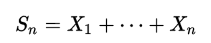
<div align='center'>图3-16　　n个独立随机变量求和表达式</div>   

&emsp;&emsp;<font color=#FF0000 size=3>备注：关于Hoeffding不等式的证明请参考维基百科链接[Hoeffding's_inequality](https://en.wikipedia.org/wiki/Hoeffding's_inequality)，在此不赘述。</font>  
&emsp;&emsp;**`Hoeffding`**不等式的**<font color=#FF0000 size=4>本质</font>**用大白话说就是**<font color=#009966 size=4>抽样计算中，样本容量取多大时，与真实情况的误差能足够小。它反映的是样本容量和这个误差（假设模型和真实模型之间）的数值关系。</font>**换在机器学习上来说，就是**<font color=#0099CC size=4>当我们用训练及验证数据集（抽样样本）找到一个符合要求的模型`f`后，这个模型在测试以及未来任意可能的数据集（整体）上的表现是否也符合要求。</font>**  

#### 3.4.2 泛化上界证明
&emsp;&emsp;对假设空间**`F`**中的任意函数**`f`**，记**R<sup>^</sup>(f)**为n个独立随机变量**`L(Y , f(X))`**的样本均值，**R(f)**为n个独立随机变量**`L(Y , f(X))`**的（总体）期望值。  
&emsp;&emsp;再设对所有随机变量，其值域**[a<sub>i</sub> , b<sub>i</sub>]** = **[0 , 1]**，则有**(b<sub>i</sub> - a<sub>i</sub>)<sup>2</sup> = 1**，代入图3-11的Hoeffding不等式有：  
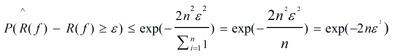
<div align='center'>图3-17　　上述条件代入Hoeffding不等式后</div>  

&emsp;&emsp;同时假定假设空间是有限的集合，**F = {f<sub>1</sub> , f<sub>2</sub> , ··· , f<sub>d</sub>}** ，故对假设空间中的所有函数有：    
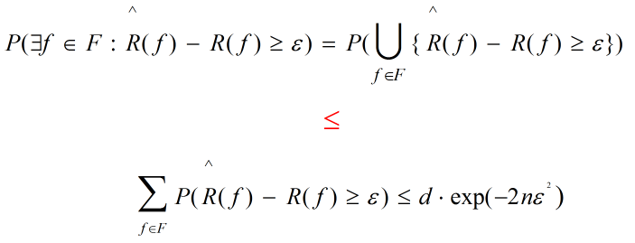
<div align='center'>图3-18　　对假设空间中的所有函数（假设）</div>  

&emsp;&emsp;也可以等价为：  
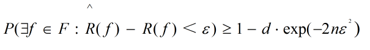
<div align='center'>图3-19　　3-18等价表达式（假设）</div>    

&emsp;&emsp;再另**δ = d·exp(-2nε<sup>2</sup>)**，则有：  

<div align='center'><font color=#FF0000 size=4>P(R<sup>^</sup>(f) - R(f) < ε) <==> P(R<sup>^</sup>(f) < R(f) + ε) ≥ 1 - δ</font></div>  

&emsp;&emsp;即假设与真实模型差异控制在在**`ε`**范围内的概率（把握）至少有**`1 - δ`**。 
&emsp;&emsp;式中**`ε`**的值可由等式<font color=#000000 size=4>**δ = d·exp(-2nε<sup>2</sup>) = d·e<sup>-2nε<sup>2</sup></sup>**</font>，将系数**d**移至**δ**侧，然后两边同时取对数有：  
&emsp;&emsp;<div align='center'><font color=#000000 size=4>**log(δ/d) = loge<sup>-2nε</sup> = -2nε<sup>2</sup></sup>**</font></div>  
&emsp;&emsp;所以有：  
<div align='center'><font color=#000000 size=4>**-log(δ/d) = log(d/δ) = logd - logδ =  2nε<sup>2</sup></sup>**</font></div>   
&emsp;&emsp;然后有：  
<div align='center'><font color=#000000 size=4>** logd - logδ =  logd + log1/δ = 2nε<sup>2</sup></sup>**</font></div>   
&emsp;&emsp;最后有：  
<div align='center'><font color=#000000 size=4>**ε = [(logd + log1/δ) / 2n]<sup>1/2</sup> **</font></div>  
&emsp;&emsp;<font color=#FF0000 size=4>证毕！</font>

