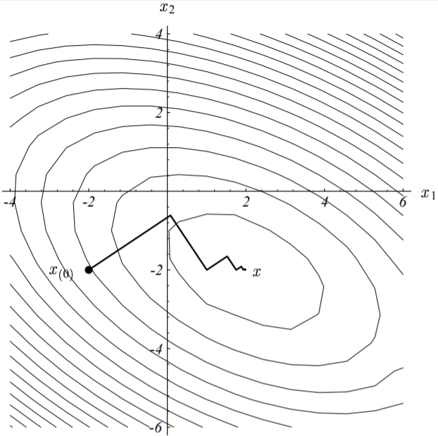
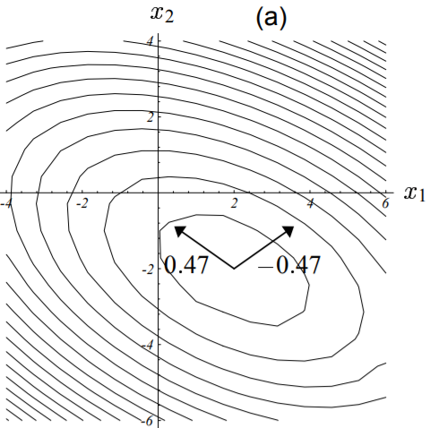
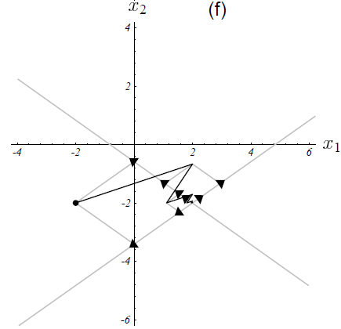

>Without the Agonizing Pain。 
——Edition $1 \frac{1}{4}$ · August 4, 1994 · Jonathan Richard Shewchuk

***

**版   &emsp;  权   &emsp;  申   &emsp;  明**

&emsp;&emsp;本文[原始文章](http://120.52.51.17/www.cs.cmu.edu/~quake-papers/painless-conjugate-gradient.pdf)版权归**Jonathan Richard Shewchuk(jrs@cs.cmu.edu)**所有，中文翻译版版权归本博客主人所有。**英文原版及翻译版均可随意复制、分发，但请务必完整保留英文原版及本条版权声明信息。**

&emsp;&emsp;英文原版版权声明如下：
>&emsp;&emsp;&copy;1994 by Jonathan Richard Shewchuk. This article may be freely duplicated and distributed so long as no consideration is received in return, and this copyright notice remains intact.
&emsp;&emsp;This guide was created to help students learn Conjugate Gradient Methods as easily as possible. Please mail me (jrs@cs.cmu.edu) comments, corrections, and any intuitions I might have missed; some of these will be incorporated into a second edition. I am particularly interested in hearing about use of this guide for classroom teaching.

  

摘   &emsp;  要

&emsp;&emsp;共轭梯度法是稀疏线性方程组迭代求解法里面最优秀的方法。然而，大部分关于该算法的教科书即没有图示，讲解的也并不直观。因此，时至今日，仍然有许多这类教材的受害者在满是灰尘的图书馆角落里碎碎叨叨的胡诹一通。有鉴于此，几位睿智的精英们苦心孤诣的破解了前辈们留下的晦涩难懂的文字，并从几何角度深度的去阐释了这个算法。共轭梯度法本身也只是一个简单、优雅的复合方法。因此，睿智如你一定一学就会。

&emsp;&emsp;本文通过介绍[二次型（Quadratic Form）](https://en.wikipedia.org/wiki/Quadratic_form)，然后据此引出[最速下降（Steepest Descent）](https://en.wikipedia.org/wiki/Method_of_steepest_descent)、共轭方向以及共轭梯度。同时还对特征向量做了解释，并用于检验[雅可比方法（Jacobi Method）](https://en.wikipedia.org/wiki/Jacobi_method)、最速下降以及共轭梯度。此外，还包括预处理和非线性共轭梯度法的一些问题。为了使的本文易读易懂，我可谓是煞费苦心。本文廊括了66个图示，同时避免出现晦涩的词汇。同一个概念也分别用了几种不同的方式来解释，大多数等式都配有直观的解释说明。

关键字：共轭梯度法，预处理，收敛性分析，通俗讲义

 

&emsp;&emsp;对想要了解更多关于迭代算法的读者，我强烈推荐**William L.Briggs**所著的A Multigrid Tutorial 即《多重网格法》，这是我读过的最好的数学教材之一。

&emsp;&emsp;特别鸣谢**Omar Ghattas**，他给我讲了许多关于数值方法的知识，也给本文的初稿提出了许多宝贵的意见。同时还要感谢**James Epperson、David O'Hallaron、James Stichnoth、Nick Trefethen、Daniel Tunkelang**给本文提出的建议。

&emsp;&emsp;为了帮助读者可以跳跃式的阅读本文，下面整理了一张章节之间的依赖关系图，如下所示：

图 1-1　　本文章节关系图
 

&emsp;&emsp;本文适用于每一位像我一样喜欢大量使用图示说明同时工于计算的人。

**目 录**

### 1. <a name="introduction" />简介
&emsp;&emsp;当我决定学习共轭梯度法（简称**CG**，下同）时，读了有四种不同的关于该算法的描述文档，然而仍然分不清个子午卯酉，几乎是一无所获。这些文章大多数只是简单的“写”了下这个算法，然后对其特性做了推导证明。这些证明即没有任何直观的解释，也没有人提到CG算法的发明者灵感的来源。本文的诞生初衷正是源于本人在探索过程中所遭受的无数挫折，以期后人在学习CG算法的时候，学习的是一个全面、优雅的算法思想，而非一堆的公式证明。

&emsp;&emsp;CG是解决大型线性方程组问题最流行的迭代算法。它对于如下形式的问题特别有效：

$$
\textbf{A} \vec{x} = \vec{b}
\tag{1 - 1}
$$

&emsp;&emsp;式中，$\vec{x}$是我们要求解的未知向量，$\vec{b}$是一个已知的向量，$\textbf{A}$是一个对称的[正定](https://en.wikipedia.org/wiki/Positive-definite_matrix)方阵。如果你不记得什么是**正定矩阵**的话，没关系，我们在后面会对这个知识点进行回顾。上述等式应用的范围非常广，比如有限差分和有限元法求解偏微分方程、结构分析、电路分析以及数学作业。

&emsp;&emsp;像CG这样的迭代算法适合于稀疏矩阵。如果上式中的$\textbf{A}$是稠密的，最好的求解方法是先对$\textbf{A}$进行因式分解，然后用置换法回代求解。对稠密矩阵$\textbf{A}$进行因式分解所需要的时间大致与迭代求解方程的时间相同。一旦$\textbf{A}$分解完毕，即使存在多个不同的$b$的值，也能使用回代法快速的求解出方程组的解。

&emsp;&emsp;对比此稠密矩阵和一个规模更大但占用内存总量相同的稀疏矩阵，稀疏矩阵因式分解出来的三角阵的非零元素通常要比其原始矩阵的多。因式分解很多时候受限于内存大小将无法进行，并且耗时也非常久，即使是回代求解的过程也可能会比迭代求解法慢。换句话说，大多数的迭代算法在稀疏矩阵的求解上即节省内存、又高效快捷。

&emsp;&emsp;本文假定读者已经学过线性代数相关的课程，对矩阵乘法、线性无关有着深刻的理解（即使你现在对这些概念有些淡忘也没关系）。基于此，我方能为你清晰的构建CG知识体系的大厦。

### 2. 本文符号约定
&emsp;&emsp;我们从一些符号的定义和注释开始。
&emsp;&emsp;如未特别指出，本文符号及其表示内容如下：
- 1\. 粗体大写字母表示矩阵，形如$\textbf{A}$；
- 2\. 带箭头字母表示向量，形如$\vec{\omega}、\vec{x}$；
- 3\. 普通字母表示标量，形如$\alpha、a$;
- 4\. $\vec{x}^T \cdot \vec{y} = \sum_{i=1}^{n} x_i y_i$表示两向量的内积，同时有$\vec{x}^T  \cdot \vec{y} = \vec{y}^T  \cdot \vec{x}$；
- 5\. $\vec{x}^T \cdot  \vec{y} = 0$表示向量$\vec x$与$\vec y$正交；
- 6\. $1 \times 1$的矩阵形如$\vec{x}^T \cdot  \vec{y}$以及$\vec{x}^T \textbf{A}  \vec{x}$视作标量。

&emsp;&emsp;假定$\textbf{A}$是一个$n \times n$的矩阵，$x、b$为向量（即$n \times 1$的矩阵），则有如下等式：

$$
\begin{bmatrix}
A_{11} & A_{12} & \cdots & A_{1n} \\
A_{21} & A_{22} & \cdots & A_{2n} \\
\vdots &        & \ddots & \vdots\\
A_{n1} & A_{n2} & \cdots & A_{nn}
\end{bmatrix}
\begin{bmatrix}
x_{11}\\
x_{21}\\
\vdots\\
x_{n1}
\end{bmatrix} = 
\begin{bmatrix}
b_{1}\\
b_{2}\\
\vdots\\
b_{n}
\end{bmatrix}
\tag{2 - 1}
$$

&emsp;&emsp;所谓**正定矩阵**，是指对任意非零向量$\vec x$，恒满足如下不等式的矩阵：

$$
\vec{x}^T \textbf{A} \vec{x} > 0
\tag{2 - 2}
$$

&emsp;&emsp;这个解释可能对你来说还是过于抽象，从这个式子很难直观的看出所谓的正定矩阵和非正定矩阵的区别。别灰心，后面我们看到正定矩阵是如何影响二次型的形状的时候，就能对这个概念有个直观的理解了。

&emsp;&emsp;最后，别忘了这两个重要特性：
- 1\. $\textbf{AB}^T = \textbf{B}^T \textbf{A}^T$;
- 2\. $\textbf{AB}^{-1} = \textbf{B}^{-1} \textbf{A}^{-1}$.

### 3. 二次型
&emsp;&emsp;所谓的**二次型**，是关于向量的二次数值型函数，形如：

$$
f(\vec{x}) = \frac{1}{2} \vec{x}^T \textbf{A} \vec{x} - \vec{b}^T \vec{x} + c
\label{quadratic_form_expression} \tag{3 - 1}
$$

&emsp;&emsp;式中，$\textbf{A}$为一个矩阵，$\vec{x}、\vec{b}$为向量，$c$为一个常数。下面我先简单阐述一下，当$\textbf{A}$为**对称正定阵**的时候，$f(x)$的最小值由$\textbf{A} \vec{x} = \vec{b}$的解给出。

&emsp;&emsp;下面这个<a name="example">例子</a>将贯穿本文：

$$
\textbf{A} = 
\begin{bmatrix}
3 & 2 \\
2 & 6
\end{bmatrix}, \quad \quad
b = 
\begin{bmatrix}
2 \\
-8
\end{bmatrix}, \quad \quad
c = 0
\tag{3 - 2}
$$

&emsp;&emsp;方程$\textbf{A} \vec{x} = \vec{b}$对应的图形如下所示：

图 3-1　　二维线性方程组图示（方程组解为两直线交点）
 

&emsp;&emsp;更一般的，方程组的解$x$通常位于$n$维超平面（每一个是$n - 1$维）的交点处。就这个例子而言，解为：$\vec{x} = [2, \ -2]^T$。该例子对应的二次型的图像如下图所示：

图 3-2　　二次型$f(\vec{x})$的示意图（曲面的最低点对应方程$\textbf{A} \vec{x} = b$的解）
 

&emsp;&emsp;因为矩阵$\textbf{A}$是正定的，因此其对应的二次型函数$f(\vec{x})$的图形像一个抛物型的碗，后面我们我作更详细的介绍。

&emsp;&emsp;二次型$f(\vec{x})$的等高线图如下所示：

图 3-3　　二次型等高线示意图（每一条椭圆曲线对应一个固定的$f(\vec{x})$值）
 

&emsp;&emsp;二次型的梯度记作如下形式：

$$
f'(\vec{x}) = 
\begin{bmatrix}
\frac{\partial}{\partial_{x_1}} f(\vec{x}) \\
\frac{\partial}{\partial_{x_2}} f(\vec{x}) \\
\vdots \\
\frac{\partial}{\partial_{x_n}} f(\vec{x})
\end{bmatrix}
\tag{3 - 3}
$$

&emsp;&emsp;上述梯度实际上是[向量场](https://en.wikipedia.org/wiki/Vector_field)，对于任意给定的值$\vec{x}$，**梯度是使得二次型函数值$f(\vec{x})$增长最快的方向**。

	
点此查看译注

	
&emsp;&emsp;译者注：这里的梯度是二次型的梯度，和我们平时所说的[普通多元函数的梯度](https://en.wikipedia.org/wiki/Gradient)有所区别。

&emsp;&emsp;下图展示了上述二次型在给定式（3-2）的参数时的梯度向量：

图 3-4　　二次型梯度($f'(\vec{x})$)图（对每个$\vec{x}$，梯度指向$f(\vec{x})$增长最快速的方向）
 

&emsp;&emsp;结合图（3-2）、（3-4）可知，在图（3-2）的底部处，梯度为0，即图（3-4）中的小黑点。也就是说，将$f'(\vec {x})$设置为0并求解出对应的$\vec{x}$，我们就能求得二次型的最小值$f(\vec{x})_{min}$。

&emsp;&emsp;结合式（3-1）可以求出二次型的梯度为：

$$
f'(\vec{x}) = \frac{1}{2} \textbf{A}^T \vec{x} + \frac{1}{2} \textbf{A} \vec{x} - \vec{b}
\tag{3 - 4}
$$

	
点此查看译注

&emsp;&emsp;译者注：这里的求解过程原文没有给出，这个过程也并不简单，为了便于线性代数较差的读者理解，现给出详细的求解步骤，以供参考。
&emsp;&emsp;考察式（3-3）中的任意项：

$$
\begin{split}
\frac{\partial}{\partial_{x_i}} f(\vec{x}) &= \frac{ \partial{ (\frac{1}{2} \vec{x}^T \textbf{A} \vec{x} - \vec{b}^T \vec{x} + c) } } {\partial_{x_i}} \\
&= \frac{1}{2} \cdot \frac{\partial{ (\vec{x}^T \textbf{A} \vec{x}) }} {\partial_{x_i}}    -     \frac{\partial{ (\vec{b}^T \vec{x}) }} {\partial_{x_i}}     +     \underbrace{ \frac{\partial{c}} {\partial_{x_i}} }_{0}
\end{split}
\tag{3 - 4 - 1}
$$

&emsp;&emsp;先来看上式中的第一项：

$$
\begin{split}
\frac{\partial{ (\overbrace{ \underbrace{\vec{x}^T \textbf{A}}_{g(\vec x)} \underbrace{\vec{x}}_{h(\vec x)}   }^{f_1(\vec{x})}) }} {\partial_{x_i}} &=   \underbrace{ \frac{\partial{ (\vec{x}^T \textbf{A} ) }}  {\partial_{x_i}} }_{g'(\vec x)}  \cdot \vec{x} + \vec{x}^T \textbf{A} \cdot \underbrace{  \frac{\partial{\vec{x} }} {\partial_{x_i}} }_{h'(\vec x)}
\end{split}
\tag{3 - 4 - 2}
$$

&emsp;&emsp;上式转换的依据是把$f_1(\vec{x}) = \vec{x}^T \textbf{A} \vec{x}$看作一个复合函数，由两个函数$g(\vec{x}) = \vec{x}^T \textbf{A}, \ h(\vec{x}) = \vec{x}$复合而成，即$f_1(\vec{x}) = g(\vec{x})  \cdot  h(\vec{x})$，再由复合函数的求导法则即为上式。

&emsp;&emsp;上式右边仍然是由两部分组成，我们仍然一项一项来求解。对于第一项：

$$
\begin{split}
\frac{\partial{ (\vec{x}^T \textbf{A} ) }}  {\partial_{x_i}} &= \frac{\partial}{\partial_{x_i}}  
\Bigg (
[x_1, x_2, \cdots , x_n]
\times
\begin{bmatrix}
A_{11} & A_{12} & \cdots & A_{1n} \\
A_{21} & A_{22} & \cdots & A_{2n} \\
\vdots &        & \ddots & \vdots\\
A_{n1} & A_{n2} & \cdots & A_{nn}
\end{bmatrix}
\Bigg )
\\
&= \frac{\partial}{\partial_{x_i}} [ \underbrace{ x_1 \cdot A_{11} + \cdots + x_n \cdot A_{n1}, \ \cdots , \ x_1 \cdot A_{1n} + \cdots + x_n \cdot A_{nn} }_{1 \times n \quad vector} ]
\end{split}
\tag{3 - 4 - 3}
$$

&emsp;&emsp;再由向量对标量的求导法则（参见[这篇文章](https://flat2010.github.io/2017/05/12/%E6%A6%82%E5%BF%B5%E5%AE%9A%E4%B9%89%E6%9D%82%E8%AE%B0/)），上式最终变成：

$$
\begin{split}
\frac{\partial{ (\vec{x}^T \textbf{A} ) }}  {\partial_{x_i}} &= [ \frac{\partial}{\partial_{x_i}} (x_1 \cdot A_{11} + \cdots + x_n \cdot A_{n1} ), \ \cdots , \ \frac{\partial}{\partial_{x_i}}(x_1 \cdot A_{1n} + \cdots + x_n \cdot A_{nn}) ] \\
&= [A_{i1}, \ A_{i2}, \ \cdots, \ A_{in}]
\end{split}
\tag{3 - 4 - 4}
$$

&emsp;&emsp;于是第一项为：

$$
\begin{split}
\frac{\partial{ (\vec{x}^T \textbf{A} ) }}  {\partial_{x_i}}  \cdot \vec{x} &= [A_{i1}, \ A_{i2}, \ \cdots, \ A_{in}] \cdot  \vec{x} \\
&= A_{i1} \cdot x_1 + A_{i2} \cdot x_2 + \cdots + A_{in} \cdot x_n \\
&= \textbf{A}_{i, \*} \cdot \vec{x}
\end{split}
\tag{3 - 4 - 5}
$$

&emsp;&emsp;如上式中所示，我们用$\textbf{A}_{i, \*}$表示矩阵$\textbf{A}$的第$i$行的所有元素即$\textbf{A}$的第$i$个行向量。再来看式（3-4-2）的第二项，有：

$$
\begin{split}
\vec{x}^T \textbf{A} \cdot \frac{\partial{\vec{x}}} {\partial_{x_i}} &= \vec{x}^T \textbf{A} \cdot
[\frac{\partial{x_1}}{\partial{x_i}}, \ \cdots, \ \frac{\partial{x_n}}{\partial{x_i}}]^T \\
&= \vec{x}^T \textbf{A} \cdot [0, \ \cdots, \ \underbrace{1}_{  i^{th}  }, \ 0]^T \\
&= \vec{x}^T \bigg ( 
\begin{bmatrix}
A_{11} & A_{12} & \cdots & A_{1n} \\
A_{21} & A_{22} & \cdots & A_{2n} \\
\vdots &        & \ddots & \vdots\\
A_{n1} & A_{n2} & \cdots & A_{nn}
\end{bmatrix}
\times 
\begin{bmatrix}
0 \\
\vdots \\
\underbrace{1}_{  i^{th}  } \\
0
\end{bmatrix}
\bigg ) \\
&= [x_1, x_2, \cdots , x_n]   \times  
\begin{bmatrix}
A_{1i} \\
A_{2i} \\
\vdots \\
A_{ni}
\end{bmatrix} \\
&= x_1 \cdot A_{1i} + x_2 \cdot A_{2i} + \cdots + x_n \cdot A_{ni} \\
&= \textbf{A}_{\*, i}^T \cdot \vec{x}
\end{split}
\tag{3 - 4 - 6}
$$

&emsp;&emsp;如上式中所示，我们用$\textbf{A}_{\*, i}$表示矩阵$\textbf{A}$的第$i$列的所有元素即$\textbf{A}$的第$i$个列向量。于是有：

$$
\frac{\partial{ (\vec{x}^T \textbf{A}} \vec{x})} {\partial_{x_i}} = \textbf{A}_{i, \*} \cdot \vec{x} + \textbf{A}_{\*, i}^T \cdot \vec{x}
\tag{3 - 4 - 7}
$$

&emsp;&emsp;我们再来看式（3-4-1）的第二项，同样根据向量对标量的求导法则有：

$$
\begin{split}
\frac{\partial{ (\vec{b}^T \vec{x}) }} {\partial_{x_i}} &= \frac{\partial}{\partial_{x_i}}
\bigg(
[b_1, \ b_2, \ \cdots, b_n] \times
\begin{bmatrix}
x_1 \\
\vdots \\
\underbrace{x_i}_{  i^{th}  } \\
\vdots \\
x_n
\end{bmatrix} 
\bigg) \\
&= \frac{\partial (b_1 \cdot x_1 + \cdots + b_i \cdot x_i + \cdots + b_n \cdot x_n)} {\partial_{x_i}} \\
&= b_i
\end{split}
\tag{3 - 4 - 8}
$$

&emsp;&emsp;综合上式（3-4-7）、（3-4-8）有：

$$
\begin{split}
\frac{\partial}{\partial_{x_i}} f(\vec{x}) &= \frac{1}{2} (\textbf{A}_{i, \*} \cdot \vec{x} + \textbf{A}_{\*, i}^T \cdot \vec{x}) + b_i \\
&= \frac{1}{2} \textbf{A}_{i, \*} \cdot \vec{x} + \frac{1}{2} \textbf{A}_{\*, i}^T \cdot \vec{x} - b_i
\end{split}
\tag{3 - 4 - 9}
$$

&emsp;&emsp;于是(3-3)有：

$$
\begin{split}
f'(\vec{x}) &= 
\begin{bmatrix}
\frac{1}{2} \textbf{A}_{1, \*} \cdot \vec{x} + \frac{1}{2} \textbf{A}_{\*, 1}^T \cdot \vec{x} - b_1 \\
\vdots \\
\frac{1}{2} \textbf{A}_{i, \*} \cdot \vec{x} + \frac{1}{2} \textbf{A}_{\*, i}^T \cdot \vec{x} - b_i \\
\vdots \\
\frac{1}{2} \textbf{A}_{n, \*} \cdot \vec{x} + \frac{1}{2} \textbf{A}_{\*, n}^T \cdot \vec{x} - b_n
\end{bmatrix} \\
&= \frac{1}{2} \begin{bmatrix}
 \textbf{A}_{1, \*} \cdot \vec{x} \\
\vdots \\
\textbf{A}_{i, \*} \cdot \vec{x} \\
\vdots \\
\textbf{A}_{n, \*} \cdot \vec{x} 
\end{bmatrix}  + 
\frac{1}{2} \begin{bmatrix}
\textbf{A}_{\*, 1}^T \cdot \vec{x} \\
\vdots \\
\textbf{A}_{\*, i}^T \cdot \vec{x} \\
\vdots \\
\textbf{A}_{\*, n}^T \cdot \vec{x}
\end{bmatrix}  - 
\begin{bmatrix}
b_1 \\
\vdots \\
b_i \\
\vdots \\
b_n
\end{bmatrix} \\
&= \frac{1}{2} \begin{bmatrix}
 \textbf{A}_{1, \*} \\
\vdots \\
\textbf{A}_{i, \*} \\
\vdots \\
\textbf{A}_{n, \*} 
\end{bmatrix} \cdot \vec{x} + \frac{1}{2} \begin{bmatrix}
\textbf{A}_{\*, 1}^T \\
\vdots \\
\textbf{A}_{\*, i}^T \\
\vdots \\
\textbf{A}_{\*, n}^T
\end{bmatrix} \cdot \vec{x}  - \vec{b} \\
&= \frac{1}{2} \textbf{A} \vec{x} + \frac{1}{2} \textbf{A}^T \vec{x} - \vec{b}
\end{split}
\tag{3 - 4 - 10}
$$

&emsp;&emsp;求解完毕！

&emsp;&emsp;若$\textbf{A}$为对称阵即有$\textbf{A}^T = \textbf{A}$，则式（3-4）可进一步化简为：

$$
f'(\vec{x}) = \textbf{A}^T \vec{x} - \vec{b} = \textbf{A} \vec{x} - \vec{b}
\tag{3 - 5}
$$

&emsp;&emsp;再令上述梯度为0，即有我们要求解的线性方程（1-1）式。因此，通过上述的步骤，我们就把线性方程组$\textbf{A} \vec{x} = \vec{b}$的解和二次型函数图象的**驻点**联系起来了。如果$\textbf{A}$是对称正定阵，那么该驻点即为二次型函数$f(\vec{x})$的最小值点。因此，通过求解使得二次型函数$f(\vec{x})$值最小的点，我们就求出了线性方程组$\textbf{A} \vec{x} = \vec{b}$的解。

&emsp;&emsp;如果矩阵$\textbf{A}$为非对称阵，由于$\frac{1}{2}(\textbf{A}^T + \textbf{A})$为对称阵，因此(CG算法)让然能够求解出式（3-4）的解。

&emsp;&emsp;那么为何对称正定阵会有如此优良的特性呢？我们下面就来揭晓这个答案。考虑二次型函数$f(\vec{x})$曲面上的任意点$\vec{p}$以及最小值点$\vec{x} = \textbf{A}^{-1} \vec{b}$。将两个点$\vec{p}、\vec{x}$分别代入式（3-1），然后作差有如下结论：

$$
f(\vec{p}) = f(\vec{x}) + \frac{1}{2} (\vec{p} - \vec{x})^T \textbf{A} (\vec{p} - \vec{x}) 
\label{function_of_point_p} \tag{3 - 5}
$$

&emsp;&emsp;关于上述结论困的证明，英文原版在文档的附录C1中给出了详细步骤，这里贴出我的证明思路，以供参考。

	
点此查看译注

&emsp;&emsp;将两个点带入式（3-1），并且结合$\textbf{A} \vec{x} = \vec{b}$以及$\textbf{A}^T = \textbf{A}$，然后作差，有：

$$
\begin{split}
f(\vec{p}) - f(\vec{x}) &= (\frac{1}{2} \vec{p}^T \textbf{A} \vec{p} - \vec{b}^T \vec{x} + c) - (\frac{1}{2} \vec{x}^T \textbf{A} \vec{x} - \vec{b}^T \vec{x} + c)  \\
&= \frac{1}{2} \vec{p}^T \textbf{A} \vec{p} - \frac{1}{2} \vec{x}^T \textbf{A} \vec{x} - (\textbf{A} \vec{x})^T \vec{p} -  (\textbf{A} \vec{x})^T \vec{x} \\
&= \frac{1}{2} \vec{p}^T \textbf{A} \vec{p} - \frac{1}{2} \vec{x}^T \textbf{A} \vec{x} - \vec{x}^T \textbf{A} \vec{p} -  \vec{x}^T \textbf{A} \vec{x} \\
&= \frac{1}{2} \vec{p}^T \textbf{A} \vec{p} + \frac{1}{2} \vec{x}^T \textbf{A} \vec{x} - \vec{x}^T \textbf{A} \vec{p}
\end{split}
\tag{3 - 5 - 1}
$$

&emsp;&emsp;要进一步化简该式，还需要用到一个性质：若有矩阵$\textbf{A}^T = B$，且$\textbf{A}$为对称阵，则必有$\textbf{A} = \textbf{B}$。因为$(\vec{x}^T \textbf{A} \vec{p})^T = \vec{p} \textbf{A} \vec{x} $且$\vec{x}^T \textbf{A} \vec{p}$为标量（可视作$1 \times 1$的对称阵），所以必然有：$\vec{x}^T \textbf{A} \vec{p} = \vec{p} \textbf{A} \vec{x} $，于是上式可变成：

$$
\begin{split}
f(\vec{p}) - f(\vec{x}) &= \frac{1}{2} \vec{p}^T \textbf{A} \vec{p} + \frac{1}{2} \vec{x}^T \textbf{A} \vec{x} - \frac{1}{2} \vec{x}^T \textbf{A} \vec{p} - \frac{1}{2} \vec{x}^T \textbf{A} \vec{p} \\
&= \frac{1}{2} \vec{p}^T \textbf{A} \vec{p} + \frac{1}{2} \vec{x}^T \textbf{A} \vec{x} - \frac{1}{2} \vec{x}^T \textbf{A} \vec{p} - \frac{1}{2} \vec{p} \textbf{A} \vec{x} \\
&= \frac{1}{2}(\vec{p}^T \textbf{A} \vec{p} - \vec{p} \textbf{A} \vec{x}) + \frac{1}{2}(\vec{x}^T \textbf{A} \vec{x} - \vec{x}^T \textbf{A} \vec{p}) \\
&= \frac{1}{2} \vec{p}^T \textbf{A} (\vec{p} - \vec{x}) + \frac{1}{2} \vec{x}^T \textbf{A} (\vec{x} - \vec{p}) \\
&= \frac{1}{2} (\vec{p}^T \textbf{A} - \vec{x}^T \textbf{A}) (\vec{p} - \vec{x}) \\
&= \frac{1}{2} (\vec{p}^T - \vec{x}^T) \textbf{A} (\vec{p} - \vec{x}) \\
&= \frac{1}{2} (\vec{p} - \vec{x})^T \textbf{A} (\vec{p} - \vec{x})
\end{split}
\tag{3 - 5 - 2}
$$

&emsp;&emsp;证毕！

&emsp;&emsp;若$\textbf{A}$为正定阵，则由式（2-2）可知，若$\vec{p} \neq \vec{x}$，则上式（3-5）中的第二项恒为正，即有：

$$
\frac{1}{2} (\vec{p} - \vec{x})^T \textbf{A} (\vec{p} - \vec{x}) > 0, \ \vec{p} \neq \vec{x}
\tag{3 - 6}
$$

&emsp;&emsp;所以进一步有：$f(\vec{p}) > f(\vec{x}), \ \vec{p} \neq \vec{x}$。即点$\vec{x}$为二次型函数$f(\vec{x})$的全局最小值点。这就解释了为何对称正定阵会有如此优良的特性。

&emsp;&emsp;因此，**对于正定阵最直观的理解方式就是它的二次型函数的图形是一个开口向上的抛物面。**如果矩阵$\textbf{A}$非正定，那么其全局最小值点就可能不止一个。

&emsp;&emsp;如果$\textbf{A}$为负定矩阵，则其图形刚好为其对应的正定阵抛物面上下翻转后的图形。如果$\textbf{A}$为奇异矩阵（此时线性方程组解不唯一），解集为一条直线或超平面。如果$\textbf{A}$不属于上面情况中的任何一种，则其解$\vec{x}$为一个[鞍点(Saddle Point)](https://en.wikipedia.org/wiki/Saddle_point)，此时无论是最速下降法还是共轭梯度法都无法求解出来。

&emsp;&emsp;下图展示了上面所说的这些情况的二次型函数的图形。注意，函数中$\vec{b}、c$的取值仅仅影响图形最小值点的位置，但不会影响图形的状。

图 3-5　　不同情况下的二次型函数图 (a) 正定矩阵的二次型函数图形。 (b) 负定矩阵二次函数图。   (c) 正定奇异阵的函数图，过谷底的一条直线为解集。(d) [不定矩阵](http://mathworld.wolfram.com/IndefiniteMatrix.html)函数图  对于三维及以上的情况，奇异矩阵也可能会存在鞍点。
 

&emsp;&emsp;我们为什么要把解线性方程组的问题转换成一个貌似更棘手的问题呢？原因在于，我们研究的最速下降法和共轭梯度法均是由图（3-2）所示的求最小化的问题创造出来的，它远比图（3-1）所示的超平面相交问题更直观易懂。

### 4. 最速下降法
&emsp;&emsp;在最速下降法中，我们的目标是从任意一个点$\vec{ x_{(0)} }$开始，下降到抛物面的底部。中间会经过一系列的点$\vec{x_{(1)}}、\vec{x_{(2)}}、\cdots $，直到足够接近真正的最小值点$\vec{x}$。

&emsp;&emsp;之所以称这种方法为最速下降法，是因为每当我们前进一步时，选择的方向必然是使得函数值$f(\vec{x})$减少的最多的方向，也即梯度$f'(\vec{x_{(i)}})$的反方向。根据式（3-5），前进的方向为$-f'(\vec{x_{(i)}}) = \vec{b} - \textbf{A} \vec{x_{(i)}}$。

&emsp;&emsp;为了方便理解后文，有些定义可能需要读者铭记在心，分别记：
- 1\. $\vec{e_{(i)}} = \vec{x_{(i)}} - \vec{x}$，称**误差向量**，表示第$i$步时，离**最小值点($\vec{x}$)**的距离；
- 2\. $\vec{r_{(i)}} = \vec{b} - \textbf{A} \vec{x_{(i)}}$，称**残差向量**，表示第$i$步时，离**真实值($\vec{b}$)**的距离；

&emsp;&emsp;有上述两个定义还可以推出以下结论：

$$
\begin{split}
\begin{cases}
\vec{r_{(i)}} &= -\textbf{A} \vec{e_{(i)}} \\
\vec{r_{(i)}} &= -f'(\vec{x_{(i)}})
\end{cases}
\end{split}
\tag{4 - 1}
$$

&emsp;&emsp;因此，**我们既可以把残差向量视为误差向量$\vec{e_{(i)}}$经过矩阵$\textbf{A}$变换到与$\vec{b}$相同的向量空间后的结果，又可以把残差向量看作最速下降的方向。**对于非线性问题（我们将在第14章讨论），就只能把残差向量看作最速下降的方向了。因此，建议读者在看到“残差(向量)”这个词时，脑海里一定要跟“最快速的下降方向”关联起来。

&emsp;&emsp;以实际例子来说，假定我们从点$\vec{x_{(0)}} = [-2, \ -2]^T$开始。迈出第一步时，根据最速下降方向（**梯度反方向**，下图中粗实线），我们将落在下图所示的实线上的某个点处。

图 4-1　　最速下降第一步示意图
 

&emsp;&emsp;换句话说，我们将选择一个点，其函数值满足：

$$
\vec{x_{(1)}} = \vec{x_{(0)}} + \alpha \vec{r_{(0)}}
\tag{4 - 2}
$$

	
点此查看译注

&emsp;&emsp;&emsp;译者注：再次强调，看到$\vec{r_{(i)}}$就要想到最速下降方向，这样就容易理解了。

&emsp;&emsp;那么问题又来了，方向有了，步长呢？也即$\alpha$应该取什么值才能使得迈出的下一步的函数值在所有可能的步长中最小呢？

&emsp;&emsp;[线性搜索](https://en.wikipedia.org/wiki/Linear_search)就是用来解决这类问题的，它将沿着指定的直线，寻找到使得函数值$f(\vec{x_{(i)}} + \alpha \vec{r_{(i)}})$最小的$\alpha$。下图展示了这个搜索过程：
- 1\. 先过这条直线作与抛物面垂直的一个平面（图(b)）;
- 2\. 绘制出该平面与抛物面相交的抛物线（图(c)）;
- 3\. 抛物线底部点即对应于函数值最小值点，可据此求出对应的步长即为$\alpha$的值。

  

图 4-3　　线性搜索图示(b)、(c)
 

&emsp;&emsp;由微积分的知识我们知道，当且仅当方向导数$\frac{d}{d_\alpha} f(\vec{x_{(1)}}) = 0$的时候，$\alpha$使得$f$最小。再由链式求导法则有：

$$
\begin{split}
\frac{d}{d_\alpha} f(\vec{x_{(1)}}) &= f'(\vec{x_{(1)}})^T \frac{d}{d_\alpha} \vec{x_{(1)}} \\
&= f'(\vec{x_{(1)}})^T \cdot \vec{r_{(0)}} \\
&= -\vec{r_{(1)}}^T \cdot \vec{r_{(0)}}
\end{split}
\label{directional_derivative_of_quadratic_function} \tag{4 - 3}
$$

	
点此查看译注

&emsp;&emsp;&emsp;译者注：注意上式中的$f'(\vec{x_{(1)}})^T$可不是笔误，$f'(\vec{x})$是一个$n \times 1$的向量，其转置则为$1 \times n$的向量。之所以这里会有转置，是因为函数的**梯度（向量）**是函数对每一个变量（标量）的偏导组成的向量。而函数的**方向导数（标量）**，则是函数对向量的导数。举例来说，有二元函数$f(x_1, x_2)$，则其梯度和沿着任意方向$\vec{d} = [\alpha, \ \beta]^T$方向导数分别为：

$$
\begin{split}
\begin{cases}
f_{grad} &= [\frac{\partial f}{\partial x_1}, \ \frac{\partial f}{\partial x_2}]^T \\
f_{dir-der} &= \frac{\partial f}{\partial \alpha} \alpha + \ \frac{\partial f}{\partial \beta} \beta  = [\frac{\partial f}{\partial \alpha}, \ \frac{\partial f}{\partial \beta}] \times [\alpha, \ \beta]^T = f_{grad}^T \cdot \vec{d} \\
\end{cases}
\end{split}
\tag{4 - 3 - 1}
$$

&emsp;&emsp;也就是说，方向导数等于梯度的转置与方向向量的内积。

&emsp;&emsp;令上式(4-3)等于0，可知，**当且仅当$\alpha$的取值使得两次残差向量（反向梯度向量）相互正交的时候，函数值最小**，如下图所示：

图 4-4　　残差向量正交示意图 抛物面最底部点的梯度/残差向量与前一步的梯度/残差向量正交。
 

&emsp;&emsp;我们之所以要求这些向量在函数最小值处严格正交，更为直观的解释如下图所示：

图 4-5　　梯度向量投影示意图示意图
 

&emsp;&emsp;图中展示了线性搜索直线上不同点（不同的点对应不同的移动步长）处的梯度向量（实线箭头）及其在该直线上的投影（虚线箭头）。梯度向量表示函数值$f$增长最快的方向，而其在搜索直线的投影则表示了其沿着搜索直线的增长的速度（大小）。由上图可以看出，在搜索直线上，当且仅当梯度方向与搜索直线正交的时候，函数值增加的最少。这个点对应的就是图（4-3(c)）的最小值点。此时投影的大小为0。

&emsp;&emsp;下面就来求$\alpha$的具体表达式：

$$
\begin{split}
\vec{r_{(1)}}^T \cdot \vec{r_{(0)}} &= (\vec{b} - \textbf{A} \vec{x_{(1)}})^T \cdot \vec{r_{(0)}} \\
&= [\vec{b} - \textbf{A} (\vec{x_{(0)}} + \alpha \vec{r_{(0)}})]^T \cdot \vec{r_{(0)}} \\
&= (\vec{b} - \textbf{A} \vec{x_{(0)}} + \alpha \textbf{A} \vec{r_{(0)}})^T \cdot \vec{r_{(0)}} \\
&= (\vec{b} - \textbf{A} \vec{x_{(0)}})^T \cdot \vec{r_{(0)}} - \alpha (\textbf{A} \vec{r_{(0)}})^T \cdot \vec{r_{(0)}} \\
&= \vec{r_{(0)}}^T \cdot \vec{r_{(0)}} - \alpha \cdot \vec{r_{(0)}}^T \textbf{A} \cdot \vec{r_{(0)}}
\end{split}
\tag{4 - 4}
$$

&emsp;&emsp;因为上式等于0，所以可解得：$\alpha = \frac{\vec{r_{(0)}}^T \cdot \vec{r_{(0)}}}   {\vec{r_{(0)}}^T \textbf{A} \cdot \vec{r_{(0)}}}$。

&emsp;&emsp;综上所述，最速下降的核心思想其实就两个，一个是移动的方向，另一个是移动的步长。**移动的方向通过梯度向量来确定，确保每次移动函数值都是在减小的。移动的步长则是通过移动前后梯度向量的正交性来确定的，确保每次移动函数值减小量是最大的**，即：
- 1\. 方向：$\vec{r_{(i)}} = \vec{b} - \textbf{A} \vec{x_{(i)}}$；
- 2\. 步长：$\alpha_{(i)} = \frac{\vec{r_{(i)}}^T \cdot \vec{r_{(i)}}}   {\vec{r_{(i)}}^T \textbf{A} \cdot \vec{r_{(i)}}}$；

&emsp;&emsp;另外，移动后的点的计算公式为：

$$
\vec{x_{(i + 1)}} = \vec{x_{(i)}} + \alpha_{(i)} \vec{r_{(i)}}
\label{point_after_moved} \tag{4 - 5}
$$

&emsp;&emsp;下图展示了我们上面举的实例的下降过程，其收敛路径之所以呈现出“Z”字形，就是因为我们上面证明出来的梯度的正交性。

图 4-6　　最速下降法收敛过程示意图 图中，算法起始于点$[-2, -2]^T$，收敛于点$[2, -2]^T$。
 

&emsp;&emsp;在迭代计算时，据方向和步长的计算公式可以看出，每轮迭代都需要进行两次矩阵-向量乘法计算，因此整个算法的计算效率就由这两次矩阵-向量乘法运算决定。幸运的是，通过变换我们可以消除其中的一个，只保留一个矩阵·向量运算。变换方法就是，将式（4-5）等式两边同时左乘一个矩阵$-\textbf{A}$，再同时加上$\vec{b}$，于是有：

$$
\vec{r_{(i + 1)}} = \vec{r_{(i)}} - \alpha_{(i)} \textbf{A} \vec{r_{(i)}}
\tag{4 - 6}
$$

&emsp;&emsp;由上式可以看出，在迭代计算方向和步长时，虽然仍然需要计算一次$\vec{r_{(0)}}$，但不再需要计算中间结果$\vec{x_{(i + 1)}}$，每轮迭代只有在计算$\alpha_{(i)}$的时候会进行一次矩阵·向量计算（$\textbf{A} \vec{r_{(i)}}$同时出现在了$\alpha_{(i)}、\vec{r_{(i + 1)}}​$的公式中，只需要计算一次即可）。也即每轮迭代，只需要按照如下公式计算：

$$
\begin{split}
\begin{cases}
\alpha_{(i)} &= \frac{\vec{r_{(i)}}^T \cdot \vec{r_{(i)}}}   {\vec{r_{(i)}}^T \textbf{A} \cdot \vec{r_{(i)}}} \\
\vec{r_{(i + 1)}} &= \vec{r_{(i)}} - \alpha_{(i)} \textbf{A} \vec{r_{(i)}}
\end{cases}
\end{split}
\label{formula_of_step_size} \tag{4 - 7}
$$

&emsp;&emsp;上述递归计算的方式有个缺点，在计算式（4-6）的时候，完全不依赖于$\vec{x_{(i)}}$，这样由于迭代过程中浮点舍入误差的累积，最终只会收敛到最小值$\vec{x}$的附近，而不是最小值点本身。要避免这个问题也非常简单，定期使用$\vec{x_{(i)}}$计算残差向量$\vec{r_{(i)}}$。

&emsp;&emsp;讲完最速下降法的核心思想，在分析该算法的收敛性之前，我必须岔开主题先讲点其它的，以便确保读者对于特征向量有着深刻的理解。

### 5. 以特征向量和特征值的视角思考
&emsp;&emsp;我在上完第一节的线性代数课之后，就已经对特征值和特征向量了如指掌了。如果你的导师跟我导师一样，那么你现在仍然能回忆起解决问题的本征窍门(eigendoohickeys)，但你却从未真正理解到它们。不幸的是，如果对它们没有一个直观的理解，那你也无法理解CG算法。当然，如果你已经在这方面禀赋非凡，请自动跳过本章节。

&emsp;&emsp;特征向量主要用作分析工具，因此，作为算法的一部分，最速下降法以及CG算法都不会计算任何的特征向量。

#### 5.1 特征尝试
&emsp;&emsp;矩阵$\textbf{B}$的特征向量$\vec{\upsilon}$，是一个非零并且当矩阵$\textbf{B}$作用于它时其自身不会发生旋转的向量（作用后指向反方向这种情况除外）。特征向量$\vec{\upsilon}$可能会发生长度的改变或者变成反向向量，但不会发生侧向旋转。换句话说，存在常数$\lambda$，使得：$\textbf{B} \vec{\upsilon} = \lambda \vec{\upsilon}$，此常数$\lambda$即为（对应于特征向量$\vec{\upsilon}$的）矩阵$\textbf{B}$的特征值。对任意常数$\alpha$，向量$\alpha \vec{\upsilon}$也是特征值为$\lambda$的特征向量。因我们有：$\textbf{B}(\alpha \vec{\upsilon}) = \alpha \textbf{B} \vec{\upsilon} = \lambda \alpha \vec{\upsilon}$。换句话说，对一个特征向量进行缩放，并不会改变其特征向量的本质。

&emsp;&emsp;讲了半天，我们为什么要关心这个呢？原因就在于，迭代算法中通常会一次又一次的将一个矩阵$\textbf{B}$作用于一个向量。当矩阵$\textbf{B}$循环往复的作用于一个特征向量$\vec{\upsilon} $时，会有两种情况发生。

&emsp;&emsp;情况一：若$|\lambda| < 1$即特征值的绝对值小于1，则据等式$\textbf{B}^i \vec{\upsilon} = \lambda^i \vec{\upsilon} $可知，在$i \rightarrow + \infty$的过程中，$\textbf{B}^i \vec{\upsilon}$也将逐渐收缩减小，如下图所示：

图 5-1　　特征值绝对值小于1时迭代示意图 图中$\vec{\upsilon}$为矩阵$\textbf{B}$的特征值为-0.5的特征向量，$i$增加，$\textbf{B}^i \vec{\upsilon}$逐渐收缩至0。
 

&emsp;&emsp;情况二：若$|\lambda| > 1$即特征值的绝对值大于1，则据等式$\textbf{B}^i \vec{\upsilon} = \lambda^i \vec{\upsilon} $可知，在$i \rightarrow + \infty$的过程中，$\textbf{B}^i \vec{\upsilon}$也将逐渐伸张扩大，如下图所示：

图 5-2　　特征值绝对值大于1时迭代示意图 图中$\vec{\upsilon}$为矩阵$\textbf{B}$的特征值为2的特征向量，$i$增加，$\textbf{B}^i \vec{\upsilon}$逐渐增长至$\infty$。
 

&emsp;&emsp;若$\textbf{B}$为对称阵（通常情况下它都不是），那么矩阵$\textbf{B}$必然存在一组$n$个线性独立的特征向量，记作$\vec{\upsilon_1}, \ \vec{\upsilon_2}, \cdots, \ \vec{\upsilon_n}$。由于特征向量可以被任意非零常数缩放，因此这组特征向量并不唯一。与此同时，每一个特征向量有一个特征值与其对应，记作$\lambda_1, \ \lambda_2, \ \cdots, \ \lambda_n$。对于一个给定的矩阵，这些特征值是唯一的。特征值之间也许相同，也许不同。举例来说，单位阵$\textbf{I}$的特征值全为1，而其所有非零向量均为特征向量。

&emsp;&emsp;上面我们讨论了矩阵作用于特征向量的情况，那当矩阵$\textbf{B}$作用于一个非特征向量的普通向量时又会是什么样呢？理解线性代数的一个非常重要的技巧（当然也是本节要传授的技巧）就是，把一个行为未知的向量看作其它行为已知的向量的合成。考虑由一组特征向量${\vec{\upsilon_i}}$为基向量所构成的实数空间$\mathbb{R}^n$（因对称阵$\textbf{B}$必然存在$n$个线性无关的特征向量），任意$n$维向量都能由这些特征向量（基向量）表示，又由于矩阵·向量乘法满足分配率，因此我们可以通过单独分析矩阵$\textbf{B}$对每个特征向量的作用来分析矩阵$\textbf{B}$对整个向量的影响。

&emsp;&emsp;如下图所示，向量$\vec{x}$由两个特征向量$\vec{\upsilon_1}, \ \vec{\upsilon_2}$合成，即有$\vec{x} = \vec{\upsilon_1} + \vec{\upsilon_2}$。矩阵$\textbf{B}$作用于向量$\vec{x}$的效果等价于矩阵$\textbf{B}$分别作用于这两个特征向量的结果的合成。迭代应用这个结论我们有：$\textbf{B}^i \vec{x} = \textbf{B}^i {\vec{\upsilon_1}} + \textbf{B}^i {\vec{\upsilon_2}} = \lambda_1^i {\vec{\upsilon_1}} + \lambda_2^i {\vec{\upsilon_2}}$。

	
点此查看译注

&emsp;&emsp;&emsp;译者注：若$\vec{x} = k_1 \vec{\upsilon_1} + k_2 \vec{\upsilon_2}$，则有：
$$
\begin{split}
\textbf{B}^i \vec{x} &= \textbf{B}^i (k_1 \vec{\upsilon_1} + k_2 \vec{\upsilon_2}) \\
&= k_1 \textbf{B}^i \vec{\upsilon_1} + k_2 \textbf{B}^i \vec{\upsilon_2} \\
&= k_1 \lambda_1^i \vec{\upsilon_1} + k_2 \lambda_2^i \vec{\upsilon_2}
\end{split}
\tag{5 - 1 - 1}
$$

&emsp;&emsp;如果所有特征值的绝对值均小于1，由之前的结论可知，$\textbf{B}^i \vec{x}$最终依然会收敛至0（构成$\vec{x}$的特征向量由于$\textbf{B}$的迭代作用收敛至0）。而只要任意一个特征值的绝对值大于1，那么$\textbf{B}^T \vec{x}$长度将会发散至无穷大。这就是为何数值分析人员高度重视[矩阵谱半径](https://en.wikipedia.org/wiki/Spectral_radius)的原因。

图 5-3　　矩阵作用于任意向量的迭代示意图 图中任意向量$\vec{x}$（实线箭头）可视作两特征向量$\vec{\upsilon_1}、\vec{\upsilon_2}$（虚线箭头）的线性组合。其对应的特征值分别为$\lambda_1 = 0.7、\lambda_2 = -2$。当矩阵$\textbf{B}$迭代作用于向量$\vec{x}$时，其中的一个特征向量（特征值小于1那个）长度逐渐收敛至0，另一个则逐渐发散至$\infty$，因此$\textbf{B}^T \vec{x}$也是发散的。
 

&emsp;&emsp;对给定矩阵$\textbf{B}$，其谱半径定义为：

$$
\rho(\textbf{B}) = max|\lambda_i|, \quad \lambda_i为\textbf{B}的特征向量
\tag{5 - 1}
$$

	
点此查看译注

&emsp;&emsp;&emsp;译者注：原文中只讨论了迭代过程中$\textbf{B}^T \vec{x}$长度的变化情况，并没有明确的对其方向的变化进行探讨（虽然细心的读者能从上图（5-3）中看出来），会对读者理解后面的有些章节造成困扰。因此这里我们专门讨论下方向的变化情况。
&emsp;&emsp;由$\textbf{B}^i \vec{\upsilon} = \lambda^i \vec{\upsilon}$可知：
- 1\. 若$\lambda > 0$，即特征值为正，则恒有$\lambda^i > 0$。所以在迭代过程中，该特征值对应的特征向量方向的分量只会发生长度的变化，而不会有方向的改变，如上图（5-3）中的$\vec{\upsilon_1}$方向分量；
- 2\. 若$\lambda < 0$，即特征值为负，则当$i = 2k + 1, \  k=0, 1, 2, \cdots$即迭代奇数次时，$\lambda^i < 0$。此时该特征值对应的特征向量方向的分量不仅长度会发生改变，方向还会旋转180度。而当$i = 2k, \  k=0, 1, 2, \cdots$即迭代偶数次时，$\lambda^i > 0$，方向保持不变。在迭代过程中其表现就是，方向一正一反，不断的发生翻转，如上图（5-3）中的$\vec{\upsilon_2}$方向分量。

&emsp;&emsp;即一个矩阵$\textbf{B}$的谱半径为其特征值绝对值的最大值。如果我们希望$\textbf{B}^i \vec{x}$能够快速的收敛至0，那么谱半径$\rho(\textbf{B})$必须小于1，并且越小越好。

&emsp;&emsp;**即谱半径的大小直接决定了收敛速度的快慢！**

	
点此查看译注

&emsp;&emsp;&emsp;译者注：这里原文档5.1小节中有两处小错误：

> If one of the eigenvalues has magnitude greater than one, x will diverge to infinity.
> If we want x to converge to zero quickly, $\rho(B)$ should be less than one, and preferably as small as possible.

&emsp;&emsp;这里的`x`应该是$\textbf{B}^i \vec{x}$，`x`是给定的向量，不会发生改变。

&emsp;&emsp;上面我们讲的是实对称阵，由于实对称阵必然存在$n$个线性无关的特征向量，因此上述结论对实对称阵而言是恒成立的。那对于非实对称阵呢，情况又会如何？

&emsp;&emsp;实际上对大多数非实对称阵而言，上述结论也成立（存在$n$个线性无关的特征向量）。但是这里还有必要提一下的是，有一类非实对称阵，它们不具备$n$个线性独立的特征向量，这类矩阵我们称之为[退化矩阵(defective)](https://en.wikipedia.org/wiki/Defective_matrix)。光从这个名字你就可以看出那些因研究该类矩阵而受挫的线性代数学家们对它当之无愧的抵触。

&emsp;&emsp;关于这类矩阵的细节问题由于太过复杂因此无法在本文中详述，请自行参考相关资料。但是这类矩阵的特性可以通过[广义特征向量(generalized eigenvector)](https://en.wikipedia.org/wiki/Generalized_eigenvector)和广义特征值(generalized eigenvalue)来分析。对于退化矩阵，当且仅当其所有广义特征值的绝对值均小于1时，$\textbf{B}^i \vec{x}$方能收敛到0。要证明这点非常难，感兴趣可参考相关资料。

&emsp;&emsp;此外，还需要读者记住一条非常有用的结论：**正定阵的特征值必然全为正数**。

&emsp;&emsp;这点我们可利用特征值的定义来证明。据特征值定义有：$\textbf{B} \vec{\upsilon} = \lambda \vec{\upsilon} $，两边同时乘以特征向量的转置有：$\vec{\upsilon}^T \textbf{B} \vec{\upsilon} = \lambda \vec{\upsilon}^T \vec{\upsilon} $，又因为矩阵$\textbf{B}$为正定阵，因此由正定阵的定义有：

$$
\lambda \vec{\upsilon}^T \vec{\upsilon} = \vec{\upsilon}^T \textbf{B} \vec{\upsilon} > 0
\tag{5 - 2}
$$

&emsp;&emsp;因此必然有$\lambda > 0$（$\vec{\upsilon}^T \vec{\upsilon} = (||\vec{\upsilon}||_2)^2 > 0$），即正定阵的特征值必然全为正值。

#### 5.2 Jacobi迭代
&emsp;&emsp;显然，一个必然收敛到0的算法还不足以让你呼朋引伴。我们来介绍一个解决线性方程组$\textbf{A} \vec{x} = \vec{b}$更有用的算法：即[雅可比法](https://en.wikipedia.org/wiki/Jacobi_method)。在这个算法中，我们把矩阵$\textbf{A}$拆成两部分：
- 1\. 对角阵$\textbf{D}$，其对角线上的元素即为矩阵$\textbf{A}$对角线上的元素，非对角线上的元素则全为0；
- 2\. 矩阵$\textbf{E}$，其对角线上的元素全为0，而其非对角线上的元素即为矩阵$\textbf{A}$非对角线上的元素。

&emsp;&emsp;由上可知：$\textbf{A} = \textbf{D} + \textbf{E}$，并由此引出我们的雅可比法：

$$
\begin{split}
\because \qquad \qquad \qquad \textbf{A} \vec{x} &= \vec{b} \\
\\
\therefore \qquad \qquad (\textbf{D} + \textbf{E}) \vec{x} &= \vec{b} \\
\textbf{D} \vec{x} + \textbf{E} \vec{x} &=  \vec{b}\\
\textbf{D}^{-1} (\textbf{D} \vec{x} + \textbf{E} \vec{x}) &= \textbf{D}^{-1} \vec{b}\\
\vec{x} + \textbf{D}^{-1} \textbf{E} \vec{x} &=  \textbf{D}^{-1} \vec{b}\\ 
\vec{x} &= \underbrace{-\textbf{D}^{-1} \textbf{E}}_{\textbf{B}} \vec{x} +  \underbrace{\textbf{D}^{-1} \vec{b}}_{\vec{z}} \\
\vec{x} &= \textbf{B} \vec{x}  + \vec{z}
\end{split}
\tag{5 - 3}
$$

&emsp;&emsp;如上所示，分别记：$\textbf{B} = -\textbf{D}^{-1} \textbf{E}, \quad \vec{z} = \textbf{D}^{-1} \vec{b}$。由于$\textbf{D}$为对角阵，因此其逆矩阵非常容易求解。上述恒等式可以通过如下的递归方程转换为迭代算法：

$$
\vec{x_{(i + 1)}} = \textbf{B} \vec{x_{(i)}}  + \vec{z}
\tag{5 - 4}
$$

&emsp;&emsp;给定一个初始向量$\vec{x_{(0)}}$，利用上述递归方程就可以计算出一系列的向量。我们的期望是每一轮迭代新生成的向量都要比上一轮迭代生成的向量更接近于真实解$\vec{x}$。真实解$\vec{x}$我们称之为等式（5-4）的[稳态点/驻点(stationary point)](https://en.wikipedia.org/wiki/Stationary_point)，因为当$\vec{x_{(i)}} = \vec{x}$时，则必然有$\vec{x_{(i + 1)}} = \vec{x}$。

	
点此查看译注

&emsp;&emsp;&emsp;译者注：这里额外做些说明更容易理解。利用式（5-4）进行迭代时，如何判断我们已经找到了真实解了呢（即何时停止迭代）？因为只有真实解才必然满足上式的等号（注意，在迭代的时候，上式的等号应该理解为“赋值”操作。在判断解的时候，要理解为“等于”）。也就是说，迭代前后的值不再发生变化，此时的向量值即为真实解。

&emsp;&emsp;上面这个推导过程可能看起来比较随意（实际上也确实很随意）。我们可以用任意数量的关于$\vec{x}$的恒等式来代替上式。通过对矩阵$\textbf{A}$进行不同的拆解，也即选取不同的$\textbf{D}$和$\textbf{E}$，我们可以得到[高斯·赛德尔法](https://en.wikipedia.org/wiki/Gauss%E2%80%93Seidel_method)或者[逐次超松弛法（SOR）](https://en.wikipedia.org/wiki/Successive_over-relaxation)。而我们的预期则是选取一种合理的拆分方法，使得最终的矩阵$\textbf{B}$的谱半径较小。本文为了简单起见，随意选择了雅可比拆分法。

&emsp;&emsp;假设我们从任意向量$\vec{x_{(0)}}$开始，每一轮迭代中我们用矩阵$\textbf{B}$作用于该向量，然后加上一个$\vec{z}$。那么每一轮迭代中我们具体做了些什么呢？

&emsp;&emsp;要解答这个问题，在这里我们再一次应用矢量合成原则（把一个向量视作其它若干向量的和）。每一轮迭代时，我们把$\vec{x_{(i)}}$用真实解$\vec{x}$和误差项$\vec{e_i}$来表示，于是上式等价于：

$$
\begin{split}
\vec{x_{(i + 1)}} &= \textbf{B} \vec{x_{(i)}}  + \vec{z} \\
&= \textbf{B} (\vec{x} + \vec{e_{(i)}})  + \vec{z} \\
&= \underbrace{\textbf{B} \vec{x} + \vec{z}}_{据式5-3} + \textbf{B} \vec{e_{(i)}} \\
&= \vec{x} + \textbf{B} \vec{e_{(i)}}\\
\therefore \qquad \vec{e_{(i + 1)}} = \vec{x_{(i + 1)}} - \vec{x} &= \textbf{B} \vec{e_{(i)}}
\end{split}
\tag{5 - 5}
$$

&emsp;&emsp;根据上式可以这样来理解迭代过程：每一轮迭代时，不会影响迭代值$\vec{x_{(i)}}$对应于真实解的部分，而只是影响误差项。显见，若上式中矩阵$\textbf{B}$的谱半径$\rho(\textbf{B}) < 1$，则根据之前讨论的结果，误差项$\vec{e_{(i)}}$必然随着$i \rightarrow \infty$而收敛于0。

&emsp;&emsp;也就是说，**在迭代过程中，通过不断的减小误差项而实现向真实解逼近**。由此可知，初始向量$\vec{x_{(0)}}$的选择对于最终的结果没有任何影响。

&emsp;&emsp;当然，初始向量$\vec{x_{(0)}}$的选择也并非完全不重要。它虽然不影响最终的结果，但却会影响到收敛到给定误差范围内需要迭代的次数。跟谱半径$\rho(\textbf{B})$比起来，它的影响又要小一些，谱半径直接决定了收敛的速度。假设$\vec{\upsilon}_j$表示矩阵$\textbf{B}$的所有特征向量中特征值最大的那一个（即$\rho(\textbf{B}) = \lambda_j$）。若将初始误差向量$\vec{e_{(0)}}$用各个特征向量的线性组合表示，则误差向量沿$\vec{\upsilon}_j$那个方向的分量收敛速度是最慢的。

&emsp;&emsp;由于矩阵$\textbf{B}$并非总是对称阵（即使矩阵$\textbf{A}$是对称阵），甚至可能是退化矩阵。而雅可比算法的收敛速度又很大程度上依赖于谱半径$\rho(\textbf{B})$（而$\rho(\textbf{B})$又依赖于$\textbf{A}$），因此**雅可比方法并非对于所有的$\textbf{A}$都能收敛，甚至并非所有的正定阵$\textbf{A}$都不一定收敛。**

#### 5.3 实例说明
&emsp;&emsp;为了更好的展示该方法的思想，下面我们用本文最开始的例子[点此回看](#example)来计算一下。首先，我们要找到一种求解给定的矩阵的特征向量和特征值的方法。由定义可知对给定矩阵的任意特征向量$\vec{\upsilon}$及其特征值$\lambda$有：

$$
\begin{split}
&\because \qquad \textbf{A} \vec{\upsilon} = \lambda \vec{\upsilon} = \lambda \textbf{I} \vec{\upsilon} \\
\\
&\therefore \qquad (\lambda \textbf{I} - \textbf{A}) \underbrace{\vec{\upsilon}}_{\neq 0} = 0 \\
& \therefore \qquad det(\lambda \textbf{I} - \textbf{A}) = 0
\end{split}
\tag{5 - 6}
$$

&emsp;&emsp;上式中矩阵$\lambda \textbf{I} - \textbf{A}$对应的行列式（即$det(\lambda \textbf{I} - \textbf{A})$）称为[特征多项式(characteristic polynomial)](https://en.wikipedia.org/wiki/Characteristic_polynomial)。它是一个关于特征值$\lambda$的$n$阶多项式，它的所有根即对应所有特征值。则本文中矩阵$\textbf{A}$的特征多项式为：

$$
\begin{split}
det 
\begin{bmatrix}
\lambda - 3 & -2 \\
-2 & \lambda - 6 \\
\end{bmatrix} = \lambda^2 - 9\lambda + 14 = (\lambda - 7)(\lambda - 2)
\end{split}
\tag{5 - 7}
$$

&emsp;&emsp;于是可解出特征值：$\lambda_1 = 7, \ \lambda_2 = 2$。求出了特征值，将其回代入上式（5-6）即可求得特征向量。比如要求$\lambda_1 = 7$对应的特征向量，我们有：

$$
\begin{split}
(\lambda \textbf{I} - \textbf{A}) \vec{\upsilon} &= 
\begin{bmatrix}
4 & -2 \\
-2 & 1 \\
\end{bmatrix}
\begin{bmatrix}
\upsilon_1 \\
\upsilon_2 \\
\end{bmatrix}
= 0 \\
\\
\therefore \qquad \qquad \qquad \upsilon_2 &= 2 \upsilon_1
\end{split}
$$

&emsp;&emsp;任意满足上式的非零解都是$\lambda_1 = 7$对应的特征向量，比如$\vec{\upsilon} = [1, \ 2]^T$。同理可求得$\lambda_2 = 2$的特征向量如$\vec{\upsilon} = [-2, \ 1]^T$。由下图可以看出，这两个特征向量刚好与图中函数椭圆等高线的轴线相重合，同时大的特征值对应更陡的斜率（负的特征值表示函数值$f$沿着椭圆等高线轴向递减，如图（4-3b）、（4-4）所示）。

图 5-4　　A矩阵的特征值及特征向量示意图 图中特征向量与二次型函数的椭圆形等高线的轴重合，对应的特征值也已标出。 每个特征值的大小正比于该处二次型曲面的陡坡斜率大小。
 

&emsp;&emsp;现在我们来看看雅可比法的迭代过程是怎样的。由给定矩阵$\textbf{A}$可知：

$$
\begin{split}
\begin{cases}
\textbf{D} &= \begin{bmatrix}3 && 0 \\ 0 && 6 \end{bmatrix}, \quad \textbf{E} = \begin{bmatrix}0 && 2 \\ 2 && 0 \end{bmatrix} \\
\textbf{B} &= -\textbf{D}^{-1} \textbf{E} = -\begin{bmatrix}3 && 0 \\ 0 && 6 \end{bmatrix}^{-1} \times \begin{bmatrix}0 && 2 \\ 2 && 0 \end{bmatrix} = \begin{bmatrix}0 && -\frac{2}{3} \\ -\frac{1}{3} && 0 \end{bmatrix} \\
\vec{z} &= \textbf{D}^{-1} \vec{b} = \begin{bmatrix}3 && 0 \\ 0 && 6 \end{bmatrix}^{-1} \times \begin{bmatrix}2 \\ -8 \end{bmatrix} = \begin{bmatrix}\frac{2}{3} \\ -\frac{4}{3} \end{bmatrix}\\
\end{cases}
\end{split}
\tag{5 - 8}
$$

&emsp;&emsp;因此有：

$$
\vec{x_{(i + 1)}} = \underbrace{ \begin{bmatrix}0 && -\frac{2}{3} \\ -\frac{1}{3} && 0 \end{bmatrix} }_{\textbf{B}} \vec{x_{(i)}}  + \underbrace{ \begin{bmatrix}\frac{2}{3} \\ -\frac{4}{3} \end{bmatrix} }_{\vec{z}}
\tag{5 - 9}
$$

&emsp;&emsp;同理可以求出矩阵$\textbf{B}$的特征值及特征向量：

$$
\begin{split}
\begin{cases}
\vec{\upsilon_1} &= \begin{bmatrix}\sqrt{2} \\ 1 \end{bmatrix}, \qquad \lambda_1 = -\frac{\sqrt{2}}{3} \\
\vec{\upsilon_2} &= \begin{bmatrix}-\sqrt{2} \\ 1 \end{bmatrix}, \qquad \lambda_2 = \frac{\sqrt{2}}{3} \\
\end{cases}
\end{split}
\tag{5 - 10}
$$

&emsp;&emsp;矩阵$\textbf{B}$的特征值及特征向量如下图所示，需要注意的是，它的特征向量方向与矩阵$\textbf{A}$的并不重合，并且也与二次型函数的椭圆等高线的轴线没有必然联系。

图 5-5　　B矩阵的特征值及特征向量示意图 图中矩阵$\textbf{B}$的特征向量与二次型函数的椭圆形等高线的轴不重合。 每个特征向量对应的特征值也已标出。
 

&emsp;&emsp;下图展示了雅可比方法的收敛过程。

图 5-6　　雅可比方法迭代收敛过程示意图 本次雅可比迭代起始于点$[-2, -2]^T$，最终收敛于点$[2, -2]^T$。
 

&emsp;&emsp;上图中，算法走出来的谜一样的路线可以通过分析每一轮的迭代误差项$\vec{e_i}$在矩阵$\textbf{B}$各个特征向量方向上的构成情况来理解。如下图(c)、(d)、(e)所示：

   

图 5-7　　雅可比迭代过程中误差项与特征向量的关系示意图 图中误差向量以实线箭头标出，其在特征向量上的分量以虚线箭头标出 图(c)中，初始误差项为真实解所对应的点指向初始点的向量。 误差向量由真实解对应的点指向当前点。
 

&emsp;&emsp;下图把迭代过程中解的变化情况和误差向量的情况都绘制出来了。图中的收敛速率都是由其特征值定义的，如图（5-3）所示。

图 5-8　　雅可比收敛过程总示意图 图中前四次误差项向量的特征向量分量已由箭头示出。 每个特征向量都以其特征值大小的速率收敛至0。
 

	
点此查看译注

&emsp;&emsp;&emsp;译者注：这个图要彻底理解还是需要花点心思推导的，作者给这个图配的说明有点误导人。这个图里面的误差项在特征向量的分向量与图（5-7）的相比明显是反的。根据式（5-5），对任意两次连续的迭代我们有：

$$
\begin{split}
\begin{cases}
\vec{x_{(i + 1)}} &= \vec{x} + \textbf{B} \vec{e_{(i)}} \\
\vec{x_{(i + 2)}} &= \vec{x} + \textbf{B} \vec{e_{(i + 1)}} \\
\vec{e_{(i + 1)}} &= \textbf{B} \vec{e_{(i)}}
\end{cases} 
\end{split} \\
\begin{split}
\therefore \quad \vec{x_{(i + 2)}} - \vec{x_{(i + 1)}} &= (\vec{x} + \textbf{B} \vec{e_{(i + 1)}}) - (\vec{x} + \textbf{B} \vec{e_{(i)}}) \\
&= \textbf{B} \vec{e_{(i + 1)}} - \textbf{B} \vec{e_{(i)}} \\
&=\vec{e_{(i + 2)}} - \vec{e_{(i + 1)}} \\
\therefore \quad \vec{x_{(i + 2)}} &= \vec{x_{(i + 1)}} - \vec{e_{(i + 1)}} + \vec{e_{(i + 2)}}
\end{split}  
\tag{5 - 10 - 1}
$$

&emsp;&emsp;由上式可知，每当进行下一次迭代时，迭代后的解等于上一轮解与上一轮误差向量的反向向量之和，再加上本轮的误差向量。举例来说，第一轮迭代时，我们有：

$$
\vec{x_{(1)}} = \vec{x_{(0)}} - \vec{e_{(0)}} + \vec{e_{(1)}}
\tag{5 - 10 - 2}
$$

&emsp;&emsp;这也就是为什么上图中起始点处加了与该点处误差项向量相反的向量的原因，加上该误差向量后，就为点(2, -2)，然后再加上一个下一轮的误差项向量，即为路径点上的第二个点了。由此递推，每一轮迭代时，都会加上一个该点处的误差向量的反向向量。即为图上的浅色实线箭头。

&emsp;&emsp;希望本节的内容能充分的给读者证实特征向量是非常有用的工具，而不是你的导师用来花式虐学渣的工具（笑）。

### 6. 最速下降的收敛性分析
#### 6.1 <a name="instant_result">瞬时收敛
&emsp;&emsp;为了立即最速下降法的收敛性，我们先来考虑误差项$\vec{e_{(i)}}$正好是特征值为$\lambda_e$的特征向量，则由式（4-1）有残差向量$\vec{r_{(i)}} = -\textbf{A} \vec{e_{(i)}} = -\lambda_e \vec{e_{(i)}}$，即残差向量此时也是一个特征向量。由式（4-5）及误差向量的定义$\vec{e_{(i)}} = \vec{x_{(i)}} - \vec{x}$有：

$$
\begin{split}
\because \qquad \vec{x_{(i + 1)}} &= \vec{x_{(i)}} + \alpha_{(i)} \vec{r_{(i)}} \\
\\
\therefore \qquad \vec{e_{(i + 1)}} + \vec{x} &= \vec{e_{(i)}} + \vec{x} + \alpha_{(i)} \vec{r_{(i)}} \\
\vec{e_{(i + 1)}} &= \vec{e_{(i)}} + \alpha_{(i)} \vec{r_{(i)}} \\
\\
\because \qquad \alpha_{(i)} &= \frac{\vec{r_{(i)}}^T \cdot \vec{r_{(i)}}}   {\vec{r_{(i)}}^T \textbf{A} \cdot \vec{r_{(i)}}} \\
&= \frac{\vec{r_{(i)}}^T \cdot \vec{r_{(i)}}} {(\textbf{A}  \vec{r_{(i)}})^T  \cdot \vec{r_{(i)}}} \\
&= \frac{\vec{r_{(i)}}^T \cdot \vec{r_{(i)}}} {-(\textbf{A} \lambda_e e_{(i)})^T  \cdot \vec{r_{(i)}}} \\
&= \frac{\vec{r_{(i)}}^T \cdot \vec{r_{(i)}}} {\lambda_e (-\textbf{A}  e_{(i)})^T  \cdot \vec{r_{(i)}}} \\
&= \frac{\vec{r_{(i)}}^T \cdot \vec{r_{(i)}}} {\lambda_e \vec{r_{(i)}}^T  \cdot \vec{r_{(i)}}} \\
&= \frac{1}{\lambda_e} \\
\\
\therefore \qquad \vec{e_{(i + 1)}} &= \vec{e_{(i)}} + \frac{1}{\lambda_e} \vec{r_{(i)}} \\
&= \vec{e_{(i)}} + \frac{1}{\lambda_e} (-\lambda_e \vec{e_{(i)}}) \\
&= 0
\end{split}
\label{error_iteration} \tag{6 - 1}
$$

&emsp;&emsp;下图展示了为何最速下降法只迭代了一次就收敛到了真实解$\vec{x}$：

图 6-1　　最速下降法一次即收敛示意图 若误差向量为特征向量，则最速下降法只需要一次迭代即可收敛。
 

&emsp;&emsp;如上图所示，若点$\vec{x_{(i)}}$位于椭圆等高线的一条轴上，则残差向量必然指向椭圆的中心点。取$\alpha_{(i)} = \lambda_e^{-1}$，则由上述推导可知，此时算法必然收敛。

	
点此查看译注

&emsp;&emsp;译者注：因此时误差向量为$\vec{e_{(i)}} = \vec{x_{(i)}} - \vec{x}$，即误差向量此时由最内层椭圆的中心点指向$ \vec{x_{(i)}}$点。又由上述误差向量和残差向量的关系式$\vec{r_{(i)}}  = -\lambda_e \vec{e_{(i)}}$可知，此时残差向量与误差向量共线。又由于$\textbf{A}$的两个特征值均大于0，所以此时残差向量方向与误差向量相反，由$ \vec{x_{(i)}}$点指向最内层椭圆的中心点，即为上图所示。

&emsp;&emsp;对于更一般的情况，我们则需要将误差项向量表示成特征向量的线性组合来分析，并且这些特征向量是[标准正交化的](https://en.wikipedia.org/wiki/Orthonormality)。若矩阵$\textbf{A}$为对称阵，则其必然存在$n$个正交的特征向量，关于该结论的证明见附录C2。由于我们可以对特征向量进行随意的缩放，因此这里我们取每个特征向量的长度为单位长度1。该技巧可以给我们提供如下的有用特性：

$$
\vec{\upsilon_j^T} \vec{\upsilon_k} = 
\begin{split}
\begin{cases}
&1, \qquad j &= k, \\
&0, \qquad j &\neq k,
\end{cases}
\end{split}
\tag{6 - 2}
$$

&emsp;&emsp;将误差项表示为特征向量的线性组合有：

$$
\vec{e_{(i)}} = \sum_{j = 1}^{n} \xi_j \vec{\upsilon_j}
\label{error_eigenvectors_relationship} \tag{6 - 3}
$$
&emsp;&emsp;式中，$\xi_j$表示第$j$个分量（$\vec{\upsilon_j}$）的长度。由上式（6-2）、（6-3）有如下结论：

$$
\begin{eqnarray}
\vec{r_{(i)}} = -\textbf{A} \vec{e_{(i)}} = -\sum_{j} \xi_j \lambda_j \vec{\upsilon_j} \label{residual} \tag{6 - 4}\\
||\vec{e_{(i)}}||^2 = \vec{e_{(i)}}^T \vec{e_{(i)}} = \sum_{j}^{} \xi_j^2 \label{error_norm} \tag{6 - 5}\\
\vec{e_{(i)}}^T \textbf{A} \vec{e_{(i)}} = (\sum_{j}^{} \xi_j \vec{\upsilon_j}^T) (\sum_{j}^{} \xi_j \lambda_j \vec{\upsilon_j}) = \sum_{j}^{} \xi_j^2 \lambda_j \label{residual_norm} \tag{6 - 6}\\
||\vec{r_{(i)}}||^2 = \vec{r_{(i)}}^T \vec{r_{(i)}} = \sum_{j}^{} \xi_j^2 \lambda_j^2 \label{residual_by_eigenvector} \tag{6 - 7}\\
\vec{r_{(i)}}^T \textbf{A} \vec{r_{(i)}} = \sum_{j}^{} \xi_j^2 \lambda_j^3 \label{residual_plus_a_matrix} \tag{6 - 8}\\
\end{eqnarray}
$$

&emsp;&emsp;由上式（$\ref{residual}$）可知，残差向量$\vec{r_{(i)}}$也可以表示为特征向量的线性组合，而其在每个特征向量分量上的长度为$-\xi_j \lambda_j$。而式（$\ref{error_norm}$）、（$\ref{residual_norm}$）为[毕达哥拉斯定理(Pythagorean Theorem)](https://en.wikipedia.org/wiki/Pythagorean_theorem)的应用。

&emsp;&emsp;有了这些结论，现在我们就可以开始分析了。由式（$\ref{error_iteration}​$）及上述结论我们有：

$$
\begin{split}
\vec{e_{(i + 1)}} &= \vec{e_{(i)}} + \frac{\vec{r_{(i)}}^T \cdot \vec{r_{(i)}}}   {\vec{r_{(i)}}^T \textbf{A} \cdot \vec{r_{(i)}}} \vec{r_{(i)}} \\
&= \vec{e_{(i)}} + \frac{ \sum_{j}^{} \xi_j^2 \lambda_j^2 }   { \sum_{j}^{} \xi_j^2 \lambda_j^3 } \vec{r_{(i)}}
\end{split}
\label{error_residual_relation} \tag{6 - 9}
$$

&emsp;&emsp;上面我们已经讨论了误差向量$\vec{e_{(i)}}$仅由一个特征向量组成的情况，这种情况下我们只需要令$\alpha_{(i)} = \lambda_e^{-1}$即可实现一次迭代就收敛。现在我们来考虑当误差向量$\vec{e_{(i)}}$为任意向量的情况，同时我们假定所有特征向量的特征值均相同且为$\lambda$，则等式$（\ref{error_residual_relation}）$变成：

$$
\begin{split}
\vec{e_{(i + 1)}} &= \vec{e_{(i)}} + \frac{\lambda^2 \sum_{j}^{} \xi_j^2 }   { \lambda^3 \sum_{j}^{} \xi_j^2 } (-\lambda \vec{e_{(i)}}) \\
&= 0
\end{split}
\label{error_vector_equals_zero} \tag{6 - 11}
$$

&emsp;&emsp;下图再次展示了为何迭代过程最终仍然会收敛。

图 6-2　　特征值相同时一次即收敛的示意图 若所有特征值的特征向量相同时，则最速下降法只需要一次迭代即可收敛。

&emsp;&emsp;如上图所示，由于所有特征向量的特征值都相同，二次型函数的椭圆函数等高线此时变成圆形的。因此无论我们从哪个点开始，残差向量也必然指向球心。如前所述，此时应取$\alpha_{(i)} = \lambda^{-1}$。

	
点此查看译注

	
&emsp;&emsp;&emsp;译者注： 因此时函数等高线为圆形，取任意点都必然位于圆的轴线上，由等高线为椭圆的情况可知，此时必然也能一步收敛。由式（$\ref{error_eigenvectors_relationship}$）及式（$\ref{residual}$）可知：

$$
\begin{split}
\vec{r_{(i)}} &= -\sum_{j} \xi_j \lambda_j \vec{\upsilon_j}\\
&= -\lambda \sum_{j} \xi_j \vec{\upsilon_j} \\
&= -\lambda \vec{e_{(i)}}
\end{split}
\tag{6 - 11 - 1}
$$
&emsp;&emsp;由于误差向量是过圆心的，因此该情况下残差向量也必然过圆心。

&emsp;&emsp;然而，当误差向量为任意向量，而此时又存在多个不相等的非零特征值时，找不到能同时消除所有特征向量方向分量的$\alpha_{(i)}$，此时我们在取$\alpha_{(i)}$的值的时候就不得不做一些妥协。实际上，我们最好是把上式（$\ref{error_residual_relation}$）中的分数看作对$\lambda_j^{-1}$的加权平均。权重系数$\xi_j^2$确保了误差向量$\vec{e_{(i)}}$的所有分量中，长度越长的分量，其所占的权重越高。

&emsp;&emsp;由此，在任意给定的迭代次数下，误差向量较短的特征向量上的分量实际上**可能**会变长（尽管不会特别长）。因此，最速下降法以及共轭梯度法通常被称作“粗糙算法”，相反雅可比法则是“平滑算法”，因为在每一轮迭代中每一个特征向量方向的分量都会收缩。尽管在数学文献中最速下降法以及共轭梯度法经常被错认，然而它们毕竟不是“平滑算法”。

  
点此查看译注

  
&emsp;&emsp;&emsp;译者注：由式（$\ref{error_eigenvectors_relationship}$）、（$\ref{residual}$）、（$\ref{residual_by_eigenvector}$）、（$\ref{residual_plus_a_matrix}$）、（$\ref{error_residual_relation}$）有：  
$$
\begin{split}
\vec{e_{(i + 1)}} &=  \vec{e_{(i)}} + \frac{ \sum_{j}^{} \xi_j^2 \lambda_j^2 }   { \sum_{j}^{} \xi_j^2 \lambda_j^3 } \vec{r_{(i)}} \\
&= \xi_1 \vec{\upsilon_1} + \cdots + \xi_n \vec{\upsilon_n} + \frac{ \xi_1^2 \lambda_1^2 + \cdots +  \xi_n^2 \lambda_n^2   }   {  \xi_1^2 \lambda_1^3 + \cdots +  \xi_n^2\lambda_n^3 } (-\xi_1 \lambda_1 \vec{\upsilon_1} - \cdots - \xi_n \lambda_n \vec{\upsilon_n}) \\
&= \xi_1 (1 - \lambda_1 \cdot \frac{ \xi_1^2 \lambda_1^2 + \cdots +  \xi_n^2 \lambda_n^2   }   {  \xi_1^2 \lambda_1^3 + \cdots +  \xi_n^2\lambda_n^3 }) \vec{\upsilon_1} + \cdots + \xi_n (1 - \lambda_n \cdot \frac{ \xi_1^2 \lambda_1^2 + \cdots +  \xi_n^2 \lambda_n^2   }   {  \xi_1^2 \lambda_1^3 + \cdots +  \xi_n^2\lambda_n^3 }) \vec{\upsilon_n} \\
&= \sum_{j}^{n} \xi_j (1 - \lambda_j \cdot \frac{ \xi_1^2 \lambda_1^2 + \cdots +  \xi_n^2 \lambda_n^2   }   {  \xi_1^2 \lambda_1^3 + \cdots +  \xi_n^2\lambda_n^3 }) \vec{\upsilon_j}
\end{split} 
\label{next_iter_error_and_eigenvector_relationship} \tag{6 - 11 - 1}
$$

&emsp;&emsp;&emsp;设$\xi_k、\xi_m$分别为第$i$轮迭代后误差向量在特征向量$\vec{\upsilon_k}、\vec{\upsilon_m}$(均不为0)方向上的分量大小，且有$|\xi_k| \ll |\xi_m| $(均不为0)，即第$k$个分量长度远小于第$m$个分量。第$i + 1$轮迭代结束后，较大的特征向量分量被大大削弱（或消除），便有：

$$
\xi_m \cdot ( 1 - \lambda_m \cdot \frac{ \xi_1^2 \lambda_1^2 + \cdots +  \xi_n^2 \lambda_n^2   }   {  \xi_1^2 \lambda_1^3 + \cdots +  \xi_n^2\lambda_n^3 } ) = \varepsilon, \quad |\varepsilon| \rightarrow 0
\label{eror_mth_component} \tag{6 - 11 - 2}
$$

&emsp;&emsp;&emsp;为了方便，我们用符号$\bigtriangleup$记上式中的分式，即：

$$
\bigtriangleup = \frac{ \xi_1^2 \lambda_1^2 + \cdots +  \xi_n^2 \lambda_n^2   }   {  \xi_1^2 \lambda_1^3 + \cdots +  \xi_n^2\lambda_n^3 }
\label{simple_express_of_frac} \tag{6 - 11 - 3}
$$

&emsp;&emsp;&emsp;于是有：
$$
\bigtriangleup =\frac{1}{\lambda_m}  \cdot (1 - \frac{\varepsilon} {\xi_m}), \quad \lambda_m \neq 0 ,\  \xi_m \neq 0
\label{frac_value_by_eigens} \tag{6 - 11 - 4}
$$

&emsp;&emsp;&emsp;则第$i + 1$轮迭代结束后，较小的特征向量$\vec{\upsilon_k}$上的分量值变为：
$$
\begin{split}
\xi_k \cdot ( 1 - \lambda_k \cdot \frac{ \xi_1^2 \lambda_1^2 + \cdots +  \xi_n^2 \lambda_n^2   }   {  \xi_1^2 \lambda_1^3 + \cdots +  \xi_n^2\lambda_n^3 } ) &= \xi_k \cdot ( 1 - \lambda_k \cdot \bigtriangleup) \\
&= \xi_k \cdot [1 - \frac{\lambda_k}{\lambda_m}  \cdot (1 - \frac{\varepsilon} {\xi_m})] \\
\end{split}
\label{error_kth_component_1} \tag{6 - 11 - 5}
$$

&emsp;&emsp;&emsp;第$i + 1$轮迭代和第$i$轮迭代后较小特征向量方向上的分量大小对比有：
$$
\require{cancel}
\begin{split}
\frac{|\xi_k \cdot [1 - \frac{\lambda_k}{\lambda_m}  \cdot (1 - \frac{\varepsilon} {\xi_m})]|}  {|\xi_k|} &= |\frac{\bcancel{\xi_k} \cdot [1 - \frac{\lambda_k}{\lambda_m}  \cdot (1 - \frac{\varepsilon} {\xi_m})]}  {\bcancel{\xi_k}}| \\
&= |1 - \frac{\lambda_k}{\lambda_m}  \cdot (1 - \frac{\varepsilon} {\xi_m})|
\end{split}
\label{error_kth_component_2} \tag{6 - 11 - 6}
$$

&emsp;&emsp;&emsp;由于$|\varepsilon| \rightarrow 0$，故必有$|\frac{\varepsilon}{\xi_m} |\rightarrow 0$，因此有：
$$
1 - \frac{\varepsilon} {\xi_m} \approx 1
\label{error_kth_component} \tag{6 - 11 - 7}
$$

&emsp;&emsp;&emsp;由此有：
$$
\xi_k \cdot ( 1 - \lambda_k \cdot \frac{ \xi_1^2 \lambda_1^2 + \cdots +  \xi_n^2 \lambda_n^2   }   {  \xi_1^2 \lambda_1^3 + \cdots +  \xi_n^2\lambda_n^3 } ) = |1 - \frac{\lambda_k}{\lambda_m}| 
\label{error_kth_component_final} \tag{6 - 11 - 8}
$$

&emsp;&emsp;&emsp;由上可知：
a). 当$\frac{\lambda_k}{\lambda_m} > 0$即小分量的特征向量的特征值与大分量的特征向量的特征值同号时，$|1 - \frac{\lambda_k}{\lambda_m}| < 1$，即此时小分量的特征向量长度（相比上一轮迭代后）也在同步缩短；
b). 当$\frac{\lambda_k}{\lambda_m} < 0$即小分量的特征向量的特征值与大分量的特征向量的特征值同号时，$|1 - \frac{\lambda_k}{\lambda_m}| > 1$，即此时小分量的特征向量长度（相比上一轮迭代后）在变长；
&emsp;&emsp;&emsp;同时我们还知道，并非所有的小分量的特性向量长度都会增大（这也是上面为什么用粗体字标出`可能`的原因），只有满足上述条件的部分小分量长度才会增大。另外，如果某个小分量长度增长后变成所有分量中较大的分量时，在下一轮迭代中会被削弱，因此这种增长不会持续太久，或者说这个长度不会增长的太大。
&emsp;&emsp;&emsp;感悟：这个结论的证明真是不太容易，我反反复复思考了两周才推敲出来。若有更简单的方法，请务必留言告知。

#### 6.2 一般收敛
&emsp;&emsp;为了讨论一般情况下最速下降法的收敛性，我们需要定义如下所示的误差向量的能量范式：
$$
||\vec{e}||_\textbf{A} = (\vec{e}^T \textbf{A} \vec{e})^\frac{1}{2}
\label{energe_norm} \tag{6 - 12}
$$
&emsp;&emsp;误差向量能量范式的示意图如下：

图 6-3　　误差向量的能量范式示意图 上图中两个误差向量的能量范式相等（处在同一条等势线上）。
 

&emsp;&emsp;这种范式要比欧几里德范式更容易处理，并且从某种意义上来说，它是一种更为自然的表现形式。考察等式（$\ref{function_of_point_p}$）可知，最小化$||\vec{e_{(i)}}||_\textbf{A}$即等价于最小化$f(\vec{x_{(i)}})$。结合能量范式我们有：

$$
\begin{split}
||\vec{e_{(i+1)}}||_\textbf{A}^2 &= \vec{e_{(i+1)}}^T \textbf{A} \vec{e_{(i+1)}} \\
&= (\vec{e_{(i)}}^T + \alpha_{(i)} \vec{r_{(i)}}^T) \textbf{A} (\vec{e_{(i)}} + \alpha_{(i)} \vec{r_{(i)}}) \quad \quad (据等式\ref{point_after_moved})\\
&= \vec{e_{(i)}}^T \textbf{A} \vec{e_{(i)}} + 2 \alpha_{(i)} \vec{r_{(i)}}^T \textbf{A} \vec{e_{(i)}} + \alpha_{(i)}^2 \vec{r_{(i)}}^T \textbf{A} \vec{r_{(i)}} \quad \quad (由\textbf{A}的对称性) \\
&= ||\vec{e_{(i)}}||_\textbf{A}^2 + 2 \frac{ \vec{r_{(i)}}^T \vec{r_{(i)}} }{ \vec{r_{(i)}}^T \textbf{A} \vec{r_{(i)}} }(-\vec{r_{(i)}}^T \vec{r_{(i)}}) + (\frac{ \vec{r_{(i)}}^T \vec{r_{(i)}} }{ \vec{r_{(i)}}^T \textbf{A} \vec{r_{(i)}} })^2 \vec{r_{(i)}}^T \textbf{A} \vec{r_{(i)}} \\
&= ||\vec{e_{(i)}}||_\textbf{A}^2 - \frac{ (\vec{r_{(i)}}^T \vec{r_{(i)}})^2 }{ \vec{r_{(i)}}^T \textbf{A} \vec{r_{(i)}} } \\
&= ||\vec{e_{(i)}}||_\textbf{A}^2 (1 - \frac{ (\vec{r_{(i)}}^T \vec{r_{(i)}})^2 }{ (\vec{r_{(i)}}^T \textbf{A} \vec{r_{(i)}}) (\underbrace{\vec{e_{(i)}}^T \textbf{A} \vec{e_{(i)}}}_{||\vec{e_{(i)}}||_\textbf{A}^2})}) \\
\\
&= ||\vec{e_{(i)}}||_\textbf{A}^2 (\underbrace{1 - \frac{ (\sum_{j} \xi_j^2 \lambda_j^2)^2 }{ (\sum_{j} \xi_j^2 \lambda_j^3) (\sum_{j} \xi_j^2 \lambda_j)}}_{\omega^2}) \quad \quad (据等式\ref{residual_norm}、\ref{residual_by_eigenvector}、\ref{residual_plus_a_matrix}) \\
&= ||\vec{e_{(i)}}||_\textbf{A}^2 \omega^2
\end{split}
\label{next_iter_energe_norm} \tag{6 - 13}
$$

&emsp;&emsp;上式中，$\omega^2 = 1 - \frac{ (\sum_{j} \xi_j^2 \lambda_j^2)^2 }{ (\sum_{j} \xi_j^2 \lambda_j^3) (\sum_{j} \xi_j^2 \lambda_j)}$。

&emsp;&emsp;由此可知，一般情况的收敛性分析关键在于找到$w$的一个上界。为了展示权重系数和特征值是如何影响收敛性的，我需要先推导出$n = 2$（即有两个特征向量）情况下的结果。假定$\lambda_1  \ge \lambda_2$，矩阵$\textbf{A}$的**谱条件数定义为$\kappa = \frac{\lambda_1}{\lambda_2} \ge 1$**（即特征值的比）。误差向量$\vec{e_{(i)}}$的**斜率（相对于由特征向量组成的坐标系而言）取决于起点，记为$\mu = \frac{\xi_2}{\xi_1}​$**（即其沿特征向量上的分量也即权重系数的反比），由此我们有：
$$
\begin{split}
\omega^2 &= 1 - \frac{(\xi_1^2 \lambda_1^2 + \xi_2^2 \lambda_2^2)^2}{ (\xi_1^2 \lambda_1 + \xi_2^2 \lambda_2) (\xi_1^2 \lambda_1^3 + \xi_2^2 \lambda_2^3) } \\
&= 1 - \frac{(\kappa^2 + \mu^2)^2} {(\kappa + \mu^2) (\kappa^3 + \mu^2)}	\quad \quad （分子分母同时除以\xi_1^4 \lambda_1^4） \\
\end{split}
\label{omega_expressed_by_weights_and_eigenvalues} \tag{6 - 13}
$$

&emsp;&emsp;上式中的$\omega$的值决定了最速下降法收敛的速度（其作用就相当于一个收敛因子），通过上述定义我们把$\omega$表示成了关于$\mu$和$\kappa$的函数，如下图所示：

图 6-4　　最速下降法收敛因子函数图 最速下降法的收敛因子$\omega$是关于$\mu$（斜率）和$\kappa$（条件数）的函数。 $\mu$和$\kappa$越小，收敛速度越快。对给定的矩阵，当$\mu = \pm{\kappa}$时收敛性最差。
 

&emsp;&emsp;上图也佐证了我前面列举的两个例子。若$\vec{e_{(0)}}$为一个特征向量，（由于此时误差向量与由特征向量组成的坐标系的坐标轴重合）则此时的斜率$\mu$为0（或者$\infty$），这种情况对应图（6-1）的例子。
&emsp;&emsp;由图可知，当$\omega$为0时，收敛几乎是瞬间完成的（即只需要一轮迭代）。若特征值均相等，则条件数$\kappa = 1$，查上图我们同样可得$\omega = 0$，即此时收敛也只需要一轮迭代，这种情况对应图（6-2）的例子。

&emsp;&emsp;下图展示了上图中四个角附近的例子。这些二次型函数的图像均绘制在其特征向量组成的坐标系中。其中图(a)和图(b)为大条件数的例子。这种情况下，如果初始点选的够好（图(a)所示，此时起始点位于山腰），那么最速下降法仍然能够快速的收敛。但通常情况下，大条件数时收敛性都是最糟的（图(b)所示）。图(b)给我们直观的展示了为何大条件数时收敛性如此之差：此时由于二次型函数$f(x)$的图像形状为山谷（而起始点又刚好位于谷底附近，斜率小），最速下降法在收敛过程中朝着波谷方向曲折而缓慢的前进，导致其前进速度非常慢（沿某坐标轴前进长度非常短）。
&emsp;&emsp;图(c)和图(d)则展示了小条件数的情况，此时由于其二次型函数图象为球形（山峰），因此不管初始点如何选择，由于斜率较大，因此其收敛速度都是非常迅速的。

图 6-5　　收敛因子取不同值时收敛速度分析示意图 图中四个例子分别对应上图四个角附近的点情况。 (a) $\kappa$取大值，$\mu$取小值，对应上图底部左上角。 (b) 差收敛性示例，$\kappa$和$\mu$均取大值，对应上图顶部右上角。 (c) $\kappa$和$\mu$均取小值，对应上图底部左下角。 (d) $\kappa$取小值，$\mu$均取大值，对应上图底部右上角。
 

&emsp;&emsp;固定$\kappa$的值（因矩阵$\textbf{A}$已给定），通过计算我们可得式（$\ref{omega_expressed_by_weights_and_eigenvalues}$）在$\mu = \pm \kappa$时取得最大值。

  
点此查看译注

  
&emsp;&emsp;&emsp;译者注：要计算式（$\ref{omega_expressed_by_weights_and_eigenvalues}$）的最大值，只需要找到其极值点。这个式子因为包含了高次幂，要求解其极值点需要一定的技巧，否则计算起来非常繁琐还容易出错，这里简单说一下计算过程。
  &emsp;&emsp;&emsp;上式展开后有：
$$
\begin{split}
\omega^2 &= 1 - \frac{(\kappa^2 + \mu^2)^2} {(\kappa + \mu^2) (\kappa^3 + \mu^2)} \\
&= \frac{ (\kappa^4 + \kappa \mu^2 + \kappa^3  \mu^2 + \mu^4) - (\mu^4 + 2 \kappa^2 \mu^2 + \kappa^4)} {\mu^4 + (\kappa + \kappa^3) \mu^2 + \kappa^4} \\
&= \underbrace{(\kappa + \kappa^3 - 2 \kappa^2)}_{常量，用c表示}  \cdot \frac{ \mu^2 } {\mu^4 + (\kappa + \kappa^3) \mu^2 + \kappa^4} \\
&= c \cdot \frac{ \mu^2 } {\mu^4 + (\kappa + \kappa^3) \mu^2 + \kappa^4}
\end{split}
\label{omega_simply_expressed_by_weights_and_eigenvalues} \tag{6 - 13 - 1}
$$

&emsp;&emsp;&emsp;因为$\kappa$为定值，因此$\kappa + \kappa^3 - 2 \kappa^2$为常量，对求偏导没有影响，因此上式中我们用符号$c$来表示这个系数，方便计算。上式对$\mu$求偏导有：

$$
\require{cancel}
\begin{split}
\frac{\partial \omega^2} {\partial \mu} &= \frac{\partial(c \cdot \frac{ \mu^2 } {\mu^4 + (\kappa + \kappa^3) \mu^2 + \kappa^4})} {\partial \mu} \\
&= -c \cdot \frac{2 \mu [\mu^4 + (\kappa + \kappa^3) \mu^2 + \kappa^4] - \mu^2 [4 \mu^3 + 2 (\kappa + \kappa^3) \mu]} {[\mu^4 + (\kappa + \kappa^3) \mu^2 + \kappa^4]} \\
&= -c \cdot \frac{2 \mu [\bcancel{\mu^4} + \bcancel{(\kappa + \kappa^3) \mu^2} + \kappa^4 - \bcancel{2} \mu^4 - \bcancel{ (\kappa + \kappa^3) \mu^2 }]} {[\mu^4 + (\kappa + \kappa^3) \mu^2 + \kappa^4]} \\
&= c \cdot \frac{2 \mu(\mu^4 - \kappa^4)} {[\mu^4 + (\kappa + \kappa^3) \mu^2 + \kappa^4]}
\end{split}
\label{omega_simply_expressed_by_weights_and_eigenvalues2} \tag{6 - 13 - 2}
$$

&emsp;&emsp;&emsp;令上式等于0，即可求出所有的极值点。由于$\kappa > 0$恒成立，因此上式中的分母也恒为正值。因此我们只需考虑系数和分子为0的情况：
&emsp;&emsp;a). 若系数$c = 0$，此时可解出$\kappa = 0或1$，则$\omega^2 = 0$；
&emsp;&emsp;b). 若系数$c \neq 0$即$\kappa \neq 0, \ \kappa \neq 1$，此时可由$\mu(\mu^4 - \kappa^4) = 0$解出$\mu = \pm \kappa$（$\mu = 0$舍去），则$\omega^2 = (\frac{\kappa - 1}{\kappa + 1})^2 > 0$；

&emsp;&emsp;&emsp;因此可知，当且仅当$\mu = \pm \kappa$时，式（$\ref{omega_expressed_by_weights_and_eigenvalues}$）取得最大值。
  

&emsp;&emsp;上图（6-4）中隐约可见由这两条直线（$\mu = \pm \kappa$）所定义的山脊。下图绘制出了我们前面给定的矩阵$\textbf{A}$的最差的收敛性的起始点。这些点落在由$\frac{\xi_2}{\xi_1} = \pm \kappa$所定义的直线上（或者反过来想也成立，这些收敛性最差的点组成的直线即为$\frac{\xi_2}{\xi_1} = \pm \kappa$）。

图 6-6　　收敛性最差的点组成的直线示意图 图中实线即表示了最速下降法中收敛性最差的这些点。途中虚线表示迭代收敛的路径。 如果起始点是一个收敛性最差的点，那么其后续的所有迭代过程中的点也必然是。 每一步迭代的路径与椭圆等高线的轴（图中灰色箭头线）相交成精确的$45^{\circ}$（因为斜率为$\pm1$）。 图中的条件数$\kappa = 3.5$。
 

&emsp;&emsp;通过将$\mu$的值置为$\mu^2 = \kappa^2$，我们即可得到$\omega$的上界（对应于收敛性最差时候的起点），如下所示：

$$
\require{cancel}
\begin{split}
\omega^2 &\le 1 - \frac{4 \kappa^4}{\kappa^5 + 2 \kappa^4 + \kappa^3} \\
&= \frac{\kappa^5 - 2 \kappa^4 + \kappa^3}{\kappa^5 + 2 \kappa^4 + \kappa^3} \\
&= \frac{\bcancel{\kappa^3} \(\kappa - 1)^2}{\bcancel{\kappa^3} \(\kappa + 1)^2} \\
&= (\frac{\kappa - 1}{\kappa + 1})^2
\end{split}
\label{omega_power_expressed_by_kappa} \tag{6 - 14}
$$

&emsp;&emsp;进而有：
$$
\omega \le \frac{\kappa - 1}{\kappa + 1}
\label{omega_expressed_by_kappa} \tag{6 - 15}
$$

&emsp;&emsp;我们将上述不等式绘制成图像如下所示：

图 6-7　　收敛系数关于条件数的函数图 随着条件数$\kappa$值增大，最速下降法（每一轮迭代）的收敛性也越来越差。
 

&emsp;&emsp;给定的矩阵越[病态](https://en.wikipedia.org/wiki/Condition_number)（即其条件数$\kappa$越大），最速下降法收敛速度就越慢。在后面的第[9.2节](#Chebyshev_polynomials)中我们还证明了，当$n \ge 2$的时候，等式（$\ref{omega_expressed_by_kappa}$）依然成立。若我们将对称正定阵的[条件数](https://en.wikipedia.org/wiki/Condition_number)定义为其最大特征值与其最小特征值之比：
$$
\kappa = \frac{\lambda_{max}} {\lambda_{min}}
\label{condition_number_of_symmetric_positive_matrix} \tag{6 - 16}
$$

&emsp;&emsp;则最速下降法的收敛结果可表示为：
$$
||\vec{e_{(i)}}||_\textbf{A} \le (\frac{\kappa - 1}{\kappa + 1})^i ||\vec{e_{0}}||_\textbf{A}
\label{convergence_result} \tag{6 - 17}
$$

&emsp;&emsp;同时由等式（$\ref{function_of_point_p}$）有：
$$
\require{cancel}
\begin{split}
\frac{f(\vec{x_{(i)}}) - f(\vec{x})}{f(\vec{x_{(0)}}) - f(\vec{x})} &= \frac{ \frac{1}{2} \vec{e_{(i)}}^T \textbf{A} \vec{e_{(i)}} }  {\frac{1}{2} \vec{e_{(0)}}^T \textbf{A} \vec{e_{(0)}} } \\
&\le (\frac{\kappa - 1}{\kappa + 1})^{2i}
\end{split}
\label{quaratic_form_convergence_result} \tag{6 - 18}
$$

  
点此查看译注

  
&emsp;&emsp;&emsp;译者注：为了方便读者理解，这里多写一步，给出上式的来源。

$$
\require{cancel}
\begin{split}
f(\vec{x_{(i)}}) - f(\vec{x}) &= [\bcancel{ f(\vec{x}) } + \frac{1}{2} (\vec{ x_{(i)} } - \vec{x})^T \textbf{A} (\vec{ x_{(i)} } - \vec{x})] - [\bcancel{ f(\vec{x}) } + \frac{1}{2} (\vec{ x } - \vec{x})^T \textbf{A} (\vec{ x } - \vec{x})] \\
&=  \frac{1}{2} (\vec{ x_{(i)}} - \vec{x})^T \textbf{A} (\vec{ x_{(i)} } - \vec{x}) \\
&= \frac{1}{2} \vec{e_{i}}^T \textbf{A} \vec{e_{i}}
\end{split}
\label{prove_of_convergence_result} \tag{6 - 18 - 1}
$$

&emsp;&emsp;上式中，$\vec{x}$为二次型函数的最小值点。
  

### 7. 共轭方向法
#### 7.1 <a name="conjugacy" />共轭性
&emsp;&emsp;如前述图（4-6）所示，最速下降法在收敛中其早期的迭代步骤往往在沿着同一个方向。如果我们每次迭代前，都能选择正确的方向迈出去，效果不是会更好吗？一个可行的想法是：我们选择一系列**（相互）正交**的搜索方向$\vec{d\_{(0)}}, \vec{d\_{(1)}}, \cdots, \vec{d\_{(n-1)}}$，在每一个搜索方向上我们都只移动一步，而这一步的长度又刚好能够均匀的对齐到最小值点$\vec{x}$（其实就是刚好能够消除误差向量在这个方向上的分量），$n$步之后，迭代结束，到达最小值点。

&emsp;&emsp;下图展示了该想法：

图 7-1　　最速下降法优化方法示意图 正交方向法示收敛过程示意图。不幸的是，当且仅当你已经知道解$\vec{x}$时有效。
 

&emsp;&emsp;上图中，利用了两个（正交的）坐标轴作为搜索方向。第一步（水平向）指向正确的$x_1$坐标轴方向，第二步即（垂直向）直捣黄龙。注意第一轮迭代后的误差向量$\vec{e_{1}}$与$第一步的搜索方向\vec{d_{(0)}}$正交。一般的，每一步我们按照下式选择下一个前进的点：

$$
\vec{x_{(i+1)}} = \vec{x_{(i)}} + \alpha_{(i)} \cdot \vec{d_{(i)}}
\label{choose_next_point} \tag{7 - 1}
$$

&emsp;&emsp;上式中，$\vec{x_{(i+1)}}$为我们下一步要移动到的位置（点），$\vec{x_{(i)}}$为当前位置点。$\alpha_{(i)}$为下一步移动的步长，$\vec{d_{(i)}}$为下一步的移动方向（搜索方向）。有了这些说明，上式就很好理解了。

&emsp;&emsp;为了确定步长$\alpha_{(i)}$的值，我们需要利用误差向量$\vec{e_{(i+1)}}$与搜索方向向量$\vec{d_{(i)}}$正交的这一关系，同时我们还能避免后面的过程中再次往$\vec{d_{(i)}}$这个方向搜索。据此条件我们有：
$$
\begin{split}
\vec{d_{(i)}}^T \vec{e_{(i+1)}} &= 0 \\
\vec{d_{(i)}}^T ( \vec{e_{(i)}} + \alpha_{(i)} \vec{d_{(i)}}) &= 0 \qquad (据式\ref{choose_next_point})\\
\alpha_{(i)} &= -\frac{\vec{d_{(i)}}^T \vec{e_{(i)}}}  {\vec{d_{(i)}}^T \vec{d_{(i)}}}
\end{split}
\label{step_expressed_by_direction_and_error} \tag{7 - 2}
$$

  
点此查看译注

  
&emsp;&emsp;&emsp;译者注：上面提到了第$i+1$轮迭代时的误差向量$\vec{e_{(i+1)}}$与第$i$轮的搜索方向向量$\vec{d_{(i)}}$正交，这个结论对某些读者来说由于没有足够的背景铺垫而显得有点突兀，导致很难理解。我们这里简单给个证明。
&emsp;&emsp;&emsp;由于这个求解方法的核心思想是：给定一个起始点后，沿着一系列相互正交的方向$\vec{d_{(i)}}$前进，最终就能到达我们的目标值（最小值）点$\vec{x}$。也就是说，从起点指向目标值点的向量，等于这一系列相互正交的方向向量的和，假定有$n$个正交的方向向量，则有：

$$
\vec{e_{(0)}} = \vec{x} - \vec{x_{(0)}} = \alpha_{(0)} \cdot \vec{d_{(0)}} + \cdots + \alpha_{(n)} \cdot \vec{d_{(n)}}
\label{initial_error_composed_by_directions} \tag{7 - 2 - 1}
$$

&emsp;&emsp;&emsp;上式也可以理解为：初始误差向量是由各个搜索方向向量复合而成。求解目标值的整个过程，也就是沿着这一系列搜索路径不断向终点靠拢的过程。第一轮迭代（迈第一步）后，从起始点$\vec{x_{(0)}}$到达整个搜索路径的第一个点$\vec{x_{(1)}}$，于是有：

$$
\begin{split}
\vec{x_{(1)}} &= \vec{x_{(0)}} + \alpha_{(0)} \cdot \vec{d_{(0)}} \\
\vec{x} -  \vec{x_{(1)}} &= \vec{x} - (\vec{x_{(0)}} + \alpha_{(0)} \cdot \vec{d_{(0)}}) \\
&= (\vec{x} - \vec{x_{(0)}}) - \alpha_{(0)} \cdot \vec{d_{(0)}} \\
&= \vec{e_{(0)}} - \alpha_{(0)} \cdot \vec{d_{(0)}} \\
\vec{e_{(1)}} &= \vec{e_{(0)}} - \alpha_{(0)} \cdot \vec{d_{(0)}} = \alpha_{(1)} \cdot \vec{d_{(1)}} + \cdots + \alpha_{(n)} \cdot \vec{d_{(n)}}\\
\vec{e_{(0)}} - \vec{e_{(1)}} &=  \alpha_{(0)} \cdot \vec{d_{(0)}}
\end{split}
\label{relationship_between_initial_1st_error} \tag{7 - 2 - 2}
$$
&emsp;&emsp;&emsp;由上式可以看出，每一轮迭代的作用，就是刚好把该轮搜索方向上的误差分量消除。据此可知，在第$i+1$轮迭代时的误差向量：
$$
\begin{split}
\vec{e_{(i+1)}} &= \vec{e_{(0)}} - \alpha_{(0)} \cdot \vec{d_{(0)}} - \cdots - \alpha_{(i)} \cdot \vec{d_{(i)}} \\
&= \alpha_{(i+1)} \cdot \vec{d_{(i+1)}} + \cdots + \alpha_{(n)} \cdot \vec{d_{(n)}}
\end{split}
\label{ith_itered_components_of_directions} \tag{7 - 2 - 3}
$$

&emsp;&emsp;&emsp;考察此时的误差向量和上一轮搜索方向的关系有：
$$
\begin{split}
\vec{d_{(i)}} \cdot \vec{e_{(i+1)}} &= \vec{d_{(i)}} \cdot [ \alpha_{(i+1)} \cdot \vec{d_{(i+1)}} + \cdots + \alpha_{(n)} \cdot \vec{d_{(n)}} ] \\
&= \alpha_{(i+1)} \cdot \underbrace{ \vec{d_{(i)}} \cdot \vec{d_{(i+1)}} }_{0} + \cdots + \alpha_{(n)} \cdot  \underbrace{ \vec{d_{(i)}} \cdot \vec{d_{(n)}} }_{0} \\
&= 0 \qquad \vec{d_{(i)}} \cdot \vec{d_{(j)}} = 
\begin{cases}
0, \ i \ne j \\
||\vec{d_{(i)}}||^2, \ i = j
\end{cases}
\end{split}
\label{relation_between_last_direction_and_current_error} \tag{7 - 2 - 4}
$$
&emsp;&emsp;&emsp;即本轮的误差向量和上一轮的搜索方向必然正交。
  

&emsp;&emsp;上式中我们已经求得了步长$\alpha_{(i)}$的解析式，然而这还不是最终的解，因为不知道误差向量$\vec{e_{(i)}}$的值，我们仍然是无法求出$\alpha_{(i)}$的。

&emsp;&emsp;解决办法就是用**矩阵·向量正交(A-orthogonal)**替代**向量正交(orthogonal)**。所谓的矩阵·向量正交（或共轭），是指存在两个向量$\vec{d_{(i)}}、\vec{d_{(j)}}$，满足：
$$
\vec{d_{(i)}}^T \textbf{A} \vec{d_{(j)}} = 0 , \quad i \ne j
\label{a_orthogonal} \tag{7 - 3}
$$

  
点此查看译注

  
&emsp;&emsp;&emsp;译者注：上式中后面的限制条件$i \ne j$在作者原文中并没有直接给出，但是根据其上下文的叙述可以得出此结论。此结论在后面公式（$\ref{mathematical_trick_to_solve_deltas}$）的推断中需要用到，这里先给出来好让读者心里有数。
  

&emsp;&emsp;下图展示了与矩阵正交的向量的样子。

图 7-2　　与矩阵正交的向量示意图 图中所示向量对均为矩阵正交的。
 

&emsp;&emsp;如上图所示，可以明显看出这些向量对并非正交的。想象一下，如果我们把上图印在一块泡泡糖上，然后拉着泡泡糖的上下两边向两边轻轻的撕扯直到泡泡糖上椭圆形的图案变成圆形为止。这个时候图形中的向量对就变成正交的了，看起来也更为清爽，如下图所示：

图 7-3　　变换过后的与矩阵正交的向量对示意图 图中所示向量对为正交的。
 

  
点此查看译注

  
&emsp;&emsp;&emsp;译者注：这里作者之所以举一个拉扯泡泡糖的例子，其实是想说明，拉扯泡泡糖这个动作就对应于向量$\vec{d_{(i)}}$和矩阵$\textbf{A}$的乘积。这个乘积的本质是对向量$\vec{d_{(i)}}$进行变换（变换无非就是线性和非线性两种，变换的效果也无非就是平移、旋转、缩放等等这些效果的复合）。
  

&emsp;&emsp;由此我们的前提条件就不再是要求搜索方向两两正交，而是变成了本轮迭代后的误差向量和上轮的搜索方向向量两两矩阵正交即$\vec{d_{(i)}} \textbf{A} \vec{e_{(i+1)}} = 0$。真是无巧不成书，这种矩阵正交性条件刚好与最速下降法中沿着搜索方向找寻最小值点等价。为了证实这一结论，我们令第$i+1$轮迭代时二次型函数的方向导数为0，如下：

$$
\begin{split}
\frac{d}{d_\alpha} f(\vec{x_{(i+1)}}) &= f'(\vec{x_{(i+1)}})^T \frac{d}{d_\alpha} \vec{x_{(i+1)}} &\qquad (据式\ref{directional_derivative_of_quadratic_function})\\
&= -\vec{r_{(i+1)}}^T \vec{d_{(i)}} \\
&= -(\vec{d_{(i)}}^T \vec{r_{(i+1)}})^T \\
&= （\vec{d_{(i)}}^T \textbf{A} \vec{e_{(i+1)}})^T = 0 &\qquad (据式\ref{residual}) \\
\therefore \quad \vec{d_{(i)}}^T \textbf{A} \vec{e_{(i+1)}} &= 0
\end{split}
\label{set_directional_derivative_to_zero} \tag{7 - 4}
$$

&emsp;&emsp;由上式我们可以得到步长在矩阵·向量正交的条件下的表达式，如下所示：
$$
\begin{split}
\alpha_{(i)} &= -\frac{\vec{d_{(i)}}^T \textbf{A} \vec{e_{(i)}}} {\vec{d_{(i)}}^T \textbf{A} \vec{d_{(i)}}} \\
&= \frac{\vec{d_{(i)}}^T \vec{r_{(i)}}} {\vec{d_{(i)}}^T \textbf{A} \vec{d_{(i)}}}
\end{split}
\label{alpha_expressed_by_residual_and_direction} \tag{7 - 5}
$$

  
点此查看译注

  
&emsp;&emsp;&emsp;译者注：要得到上述结论，只需要把式（$\ref{step_expressed_by_direction_and_error}$）中的正交条件换成矩阵·向量正交条件即能推导出上述结论。推导过程非常简单，在此不赘述。
  

&emsp;&emsp;与式（$\ref{step_expressed_by_direction_and_error}$）所不同的是，上式我们是可以直接进行计算的。注意，当搜索方向向量$\vec{d_{(i)}}$即为残差向量时，上式与最速下降法的计算公式（$\ref{formula_of_step_size}$）完全等价。

&emsp;&emsp;为了求证上述方法对最小值点的计算刚好在$n$步内完成，不多不少。我们现在用搜索方向向量的线性组合来表示误差向量，即：

$$
\vec{e_{(0)}} = \sum\limits_{j=0}^{n-1} \delta_{j} d_{(j)} \\
\label{error_expressed_by_directions} \tag{7 - 6}
$$

&emsp;&emsp;式中分量值$\delta_{j}$的确定可以通过使用一些小小的数学技巧完成。由于搜索方向为两两矩阵·向量正交的，因此将上式（$\ref{error_expressed_by_directions}$）左右两边同时左乘$\vec{d_{(k)}}^T \textbf{A}$即可消除$\delta_{k}$以外的所有分量值。整个过程如下所示：
$$
\begin{split}
\vec{d_{(k)}}^T \textbf{A} \vec{e_{(0)}} &= \sum\limits_{j=0}^{n-1} \delta_{j} \vec{d_{(k)}}^T \textbf{A} \vec{d_{(j)}} \\
&= \delta_{0} \underbrace{ \vec{d_{(k)}}^T \textbf{A} \vec{d_{(0)}} }_{0} + \cdots + \delta_{k} \vec{d_{(k)}}^T \textbf{A} \vec{d_{(k)}} + \cdots + \delta_{n} \underbrace{ \vec{d_{(k)}}^T \textbf{A} \vec{d_{(n)}} }_{0} \\
&= \delta_{k} \vec{d_{(k)}}^T \textbf{A} \vec{d_{(k)}} \\
\therefore \qquad \delta_{k} &= \frac{\vec{d_{(k)}}^T \textbf{A} \vec{e_{(0)}}} {\vec{d_{(k)}}^T \textbf{A} \vec{d_{(k)}}} \\
&= \frac{ \vec{d_{(k)}}^T \textbf{A} \vec{e_{(0)}} + \underbrace{ \sum\limits_{i=0}^{k-1} \alpha_{(i)} \overbrace{ \vec{d_{(k)}}^T \textbf{A} \vec{d_{(i)}} }^{矩阵·向量正交性} }_{0} } {\vec{d_{(k)}}^T \textbf{A} \vec{d_{(k)}}} \\
&= \frac{ \vec{d_{(k)}}^T \textbf{A} ( \vec{e_{(0)}} +  \sum\limits_{i=0}^{k-1} \alpha_{(i)} \vec{d_{(i)}} )  } {\vec{d_{(k)}}^T \textbf{A} \vec{d_{(k)}}} \\
&= \frac{\vec{d_{(k)}}^T \textbf{A} \vec{e_{(k)}}} {\vec{d_{(k)}}^T \textbf{A} \vec{d_{(k)}}}
\end{split}
\label{mathematical_trick_to_solve_deltas} \tag{7 - 7}
$$

&emsp;&emsp;据上式及式子（$\ref{alpha_expressed_by_residual_and_direction}$）可得到步长$\alpha_{(i)}$的计算公式：$\alpha_{(i)} = -\delta_{(i)} $。这个结论让我们可以以一种全新的视角来审视误差向量：从给定的起始点开始，逐项重构目标值$\vec{x}$的分量去逼近目标值$\vec{x}$的整个过程也可以看作是逐项消除误差向量的分量的过程，如下式所示：
$$
\begin{split}
\vec{e_{(i)}} &= \vec{e_{(0)}} + \sum\limits_{j=0}^{i-1} \underbrace{\alpha_{(j)}}_{-\delta{(j)}} \vec{d_{(j)}} \\
&= \sum\limits_{j=0}^{n-1} \delta_{(j)} \vec{d_{(j)}} - \sum\limits_{j=0}^{i-1} \delta_{(j)} \vec{d_{(j)}} \\
&= \sum\limits_{j=i}^{n-1} \delta_{(j)} \vec{d_{(j)}}
\end{split}
\label{building_up_x_component_by_component} \tag{7 - 8}
$$

&emsp;&emsp;上述过程更为直观的图示展示如下：

图 7-4　　目标值分量逐项重构与误差项分量逐项消除示意图 共轭方向法必然在$n$步之内收敛。 图(a)  第一步沿$\vec{d_{(0)}}$前进。点$\vec{x_{(1)}}$的选择由$\vec{e_{(1)}}$必须与$\vec{d_{(0)}}$矩阵·向量正交这一约束条件确定。  图(b)  $\vec{e_{(0)}}$可表示为矩阵·向量正交的分量（灰色箭头线）的复合。共轭方向法每一步消除一个分量。
 

&emsp;&emsp;由上图及公式可知，当且仅当$n$轮迭代完成后，误差向量的每一个分量都已经被消除，此时$\vec{e_{(n)}} = 0$，算法收敛。结论得证！

#### 7.2 格莱姆-施密特共轭
&emsp;&emsp;由上节可知，要求的目标值，我们现在唯一需要的就是一组**矩阵·向量**正交的搜索方向向量${ \vec{d_{(i)}} }$的集合。幸运的是，存在一种非常简单的方法计算这些向量，这种方法我们称之为**[共轭格莱姆-施密特过程](https://en.wikipedia.org/wiki/Gram%E2%80%93Schmidt_process)**。

&emsp;&emsp;假定我们现在有一组$n$个维线性无关（线性独立）的向量$\vec{u_{(0)}}, \vec{u_{(1)}}, \cdots, \vec{u_{(n-1)}}$。为了构建向量$\vec{d_{(i)}}$，我们先取一个向量$\vec{u_{(i)}}$，然后减掉该向量的所有分量中**与之前的所有搜索方向向量$\vec{d_{(i-1)}}$都不成矩阵·向量正交关系**的那些（即只保留与之前的**所有搜索方向均矩阵·向量正交**的分量）。换句话说，对第一步（$i = 0$）的搜索方向向量我们取$\vec{d_{(i)}} = \vec{u_{(0)}}$。而对于之后的每一步（$i > 0$），取：
$$
\vec{d_{(i)}} = \vec{u_{(i)}} + \sum\limits_{k=0}^{i-1} \beta_{(ik)} \vec{d_{(k)}} \\
\label{construct_value_of_d} \tag{7 - 9}
$$

  
点此查看译注

  
&emsp;&emsp;&emsp;译者注：这里的几句话读起来可能有点拗口，原文写的更简单，给充分理解这个方法的思想制造了不小的难度。其实这个共轭格莱姆-施密特过程的思想很简单。
  &emsp;&emsp;&emsp;Step:1  先找一组线性无关的向量。在这些向量里面任取一个，作为第一步的搜索方向向量（因为是第一步，不需要考虑正交性，因此可直接使用该向量作为搜索向量）。
  &emsp;&emsp;&emsp;Step:2  再在剩下的这些线性无关的向量中取一个出来进行向量分解。我们知道一个向量可以有很多种分解方式，那么怎么决定如何分解呢？首先找到与上一步的搜索向量成矩阵·向量正交的方向，该方向即作为这个要分解的向量的一个分量方向，这个方向的分量也将保留下来作为本轮迭代的搜索方向向量。其它方向的分量因为对我们没有用，自然就要消除掉。
  &emsp;&emsp;&emsp;Step:3  再在剩下的线性无关的向量中取一个出来进行向量分解。分解的方法就是，首先找一个与之前**所有搜索向量均矩阵·向量正交**的方向，留下这个方向的向量作为本轮的搜索方向向量。其余的分量同样消除掉。
  &emsp;&emsp;&emsp;Step:4  重复第3)步的过程，直到所有的线性无关的向量都抽完为止。
  &emsp;&emsp;&emsp;可以看出，通过上述步骤，每一步所保留下来的分量均与之前的所有搜索向量矩阵·向量正交。
  

&emsp;&emsp;式中，系数$\beta_{(ik)}$仅定义在$i > k$的情况。为了求得这些系数的值，我们可采用前面求解$\delta_{(j)}$的时候的小技巧，整个求解过程如下所示：
$$
\begin{split}
\vec{d_{(i)}}^T \textbf{A} \vec{d_{(j)}} &= \vec{u_{(i)}} \textbf{A} \vec{d_{(j)}} + \sum\limits_{k=0}^{i-1} \beta_{(ik)} d\vec{_{(k)}}^T \textbf{A} \vec{d_{(j)}} \\
&= \vec{u_{(i)}} \textbf{A} \vec{d_{(j)}} + \beta_{(ij)} d\vec{_{(j)}}^T \textbf{A} \vec{d_{(j)}}, \qquad i > j = 0 \\
\therefore \qquad \beta_{(ij)} &= -\frac{\vec{u_{(i)}} \textbf{A} \vec{d_{(j)}}} {d\vec{_{(j)}}^T \textbf{A} \vec{d_{(j)}}}
\end{split}
\label{trick_to_solve_beta} \tag{7 - 10}
$$

&emsp;&emsp;整个过程的示意图如下（图示为二维向量）：

图 7-5　　共轭格莱姆-施密特过程示意图 两个向量的共轭格莱姆-施密特过程示意图。包含两个线性无关的向量$\vec{u_{0}}、\vec{u_{1}}$。 取$\vec{d_{(0)}} = \vec{u_{(0)}}$，向量$\vec{u_{1}}$由两个向量复合而成。 一个是与$\vec{d_{(0)}}$矩阵·共轭正交的$\vec{u^\*}$。一个是与$\vec{d_{(0)}}$平行的$\vec{u^+}$  共轭后，这两个分量中仅与$\vec{d_{(0)}}$矩阵·共轭正交的分量保留下来，此时$\vec{d_{(1)}} = \vec{u^\*}$。
 

&emsp;&emsp;在共轭方向法中使用`共轭格莱姆-施密特过程`（计算搜索向量）的一个不利的地方是，每一轮新的迭代之前的所有搜索向量都需要保存下来，以便用来计算本轮的搜索方向，这就导致要计算出所有的搜索向量，其操作的复杂度为$\mathcal{O}(n^3)$。实际上，如果搜索向量由轴向单位向量的共轭组成，那么共轭方向等价于进行[高斯消元法](https://en.wikipedia.org/wiki/Gaussian_elimination)，如下图所示：

图 7-6　　轴向单位向量构建搜索向量示意图 共轭方向法使用轴向单位向量来构建搜索向量，这一方法也即我们熟知的高斯消元法。
 

&emsp;&emsp;正因如此，直到**CG**算法发明之前，共轭方向法都不太受人重视。**CG**算法弥补了共轭方向法的诸多缺点。

&emsp;&emsp;理解共轭方向法以及共轭梯度法的一个关键点就在于，要能够看出来上图实际上只是图（7-1）的更一般的情况（等高线为椭圆形）。总之，当我们在使用共轭方向法（包括**CG**算法）时，我们同时也是在一个缩放的空间里执行正交方向法。

#### 7.3 <a name="optimality_of_the_error_term">误差项的最优性
&emsp;&emsp;共轭方向法有一个非常有趣的特性：在每一轮迭代的过程中，在其允许的搜索范围内，它总能找到最优解。那么我们不禁要问，允许的搜索范围又是什么？我们记$\mathcal{D_i}$为$i$维的[张成空间](https://en.wikipedia.org/wiki/Linear_span)$Span \lbrace \vec{d_{(0)}}, \vec{d_{(1)}}, \cdots, \vec{d_{(i-1)}} \rbrace$。误差项$\vec{e_{(i)}}$的值从$\vec{e_{(0)}} + \mathcal{D_i}$中选取。

&emsp;&emsp;那么我们上面提到的**最优解**是指什么呢？这里的最优解实际上是指共轭方向法从$\vec{e_{(0)}} + \mathcal{D_i}$中选取的能让其误差向量的能量范式$||\vec{e_{(i)}}||_\textbf{A}$最小（即能量最低）的误差向量，如下图所示：

图 7-7　　共轭方向法从张成空间取得最优解示意图 图中阴影区域为$\vec{e_{(0)}} + \mathcal{D_2} = \vec{e_{(0)}} + Span \lbrace \vec{d_{(0)}}, \vec{d_{(1)}} \rbrace$。 椭圆是能量范式等高线。第二轮迭代后共轭方向法找到$\vec{e_{(0)}} + \mathcal{D_2}$上的点$\vec{e_{(2)}}$，使得$||\vec{e_{(i)}}||_\textbf{A}$最小。
 

&emsp;&emsp;实际上，某些作者喜欢通过在张成空间$\vec{e_{(0)}} + \mathcal{D_i}$上最小化$||\vec{e_{(i)}}||_\textbf{A}$的方法来推导出**CG**算法。

&emsp;&emsp;与误差项向量可以表示为搜索方向向量的线性组合类似（式$\ref{building_up_x_component_by_component}$），误差向量的能量范式也可以表示为累和的形式，如下所示：

$$
\begin{split}
||\vec{e_{(i)}}||_\textbf{A}^2 &= ||\vec{e_{(i)}}||^T \textbf{A} ||\vec{e_{(i)}}|| &\qquad (据式\ref{energe_norm})\\
&= (\sum\limits_{j=i}^{n-1} \delta_{(j)} \vec{d_{(j)}})^T \textbf{A} (\sum\limits_{k=i}^{n-1} \delta_{(k)} \vec{d_{(k)}}) &\quad (据式\ref{building_up_x_component_by_component})\\
&= (\sum\limits_{j=i}^{n-1} \delta_{(j)} \vec{d_{(j)}^T}) \textbf{A} (\sum\limits_{k=i}^{n-1} \delta_{(k)} \vec{d_{(k)}}) \\
&= \underbrace{ \underbrace{ (\delta_{(i)} \vec{d_{(i)}}^T \textbf{A} + \cdots + \delta_{(n-1)} \vec{d_{(n-1)}}^T) }_{n-i项} \cdot \underbrace{ (\delta_{(i)} \vec{d_{(i)}}^T + \cdots + \delta_{(n-1)} \vec{d_{(n-1)}}^T) }_{n-i项} }_{(n-i) \times (n-i) = (n-i)^2项} \\
&= \sum\limits_{j=i}^{n-1} \sum\limits_{k=i}^{n-1} \delta_{(j)} \delta_{(k)} \vec{d_{(j)}}^T \textbf{A} \vec{d_{(k)}} \\
&= \sum\limits_{j=i}^{n-1} \delta_{(j)}^2  \vec{d_{(j)}}^T \textbf{A} \vec{d_{(j)}} &\quad (据矩阵·向量正交性)\\
\end{split}
\label{summation_express_of_error_energe_norm} \tag{7 - 11}
$$

&emsp;&emsp;上述累和项中的每一项都与一项尚未使用过的搜索向量相关联。所有从$\vec{e_{(0)}} + \mathcal{D_i}$中选择的任意向量$\vec{e}$的展开式同样也是包含上述这些项，因此$\vec{e_{(i)}}$必然具有最小的能量范式（因任意两个方向向量的矩阵乘积全为0，原累和项变成各个方向向量的线性组合）。

&emsp;&emsp;通过方程证明了解的最优性之后，我们来点更直观的东西。也许最好的可视化展示共轭方向法原理的途径是通过对比我们正在使用的空间和上图（7-3）所示被拉伸过的空间。下图(a)和(c)演示了在二维($\mathbb{R}^2$)及三维($\mathbb{R}^3$)空间中的共轭方向法的样子，这些图中看起来垂直的线是正交的，如下所示：
  

图 7-8　　共轭方向法最优解示意图 共轭方向法的最优性示意图。 (a) 示例为一个二维问题。图中看起来垂直的线是正交的。  (c) 示例为一个三维问题。图中展示了两个同心椭圆体，点$\vec{x}$位于两圆的圆心。 直线$\vec{x_{(0)}} + \mathcal{D_1}$是外部椭圆在点$\vec{x_{(1)}}$处的切线。 平面$\vec{x_{(0)}} + \mathcal{D_2}$是内部椭圆在点$\vec{x_{(2)}}$处的切面。
 

&emsp;&emsp;下图(b)和(d)则分别对应上图(a)、(c)经过拉伸（沿着特征向量轴向）后等高线由椭圆变成圆的情况，这些图中看起来垂直的线是矩阵·向量正交的，如下图所示：
  

图 7-9　　共轭方向法最优解示意图2 拉伸后的空间中的共轭方向法的最优性示意图。 (b) 对应上图(a)。图中看起来垂直的线是矩阵·向量正交的。  (d) 对应上图(c)。三维问题拉伸后的视角。 
 

&emsp;&emsp;如上图(a)所示，共轭方向法起始于点$\vec{x_{(0)}}$，沿着方向$\vec{d_{(0)}}$前进了一步然后停留在点$\vec{x_{(1)}}$处，该点处的误差向量$\vec{e_{(1)}}$与向量$\vec{d_{(0)}}$矩阵·向量正交。那么我们何以肯定该点即为$\vec{x_{(0)}} + \mathcal{D_1}$上的最小值点呢？

&emsp;&emsp;答案就在于图(b)中：在图(b)所示的拉伸空间中，第一轮迭代后的误差向量$\vec{e_{(1)}}$由于与第一轮的方向向量$\vec{d_{(0)}}$矩阵·向量正交，因此他们是垂直的。此时误差向量$\vec{e_{(1)}}$为能量范式$||\vec{e}||_\textbf{A}$为定值的等高线所对应的一系列同心圆的半径。因此$\vec{x_{(0)}} + \mathcal{D_1}$必然与过点$\vec{x_{(1)}}$的圆相切与点$\vec{x_{(1)}}$处。因此$\vec{x_{(1)}}$为平面$\vec{x_{(0)}} + \mathcal{D_1}$上使得$||\vec{e_{(1)}}||_\textbf{A}$取的最小值的点。

  
点此查看译注

  
&emsp;&emsp;&emsp;译者注：这里原作者的意思其实是，**在给定目标点$\vec{x}$和起始点$\vec{x_{(0)}}$、前进方向$\vec{x_{(0)}} + \mathcal{D}_1$的条件下**，如何确定前进的步长才能使前进的路径是最短的。实际上就是等价于点到直线的最短距离（垂线）。
&emsp;&emsp;&emsp;这里最开始我理解成给定目标点和起始点，如何确定最短路径，导致卡了很久。  
  

&emsp;&emsp;这个似乎并没有什么惊奇之处。在前面的[7.1节](#conjugacy)中我们已经讲了搜索方向向量和误差项的共轭性等价于沿着搜索方向最小化二次型函数$f$（也即$||\vec{e}||_{\textbf{A}}$）的值。然而，在共轭方向法迈出第二步时，当我们在第二搜索方向$\vec{d_1}$上最小化$||\vec{e}||_{\textbf{A}}$的时候，为何还有信心确保$||\vec{e}||_{\textbf{A}}$在上一轮的搜索方向$\vec{d_0}$上式最小的呢？同理，在我们迈出第$i$步的时候，$f(\vec{x_{(i)}})$为何仍然能在所有的$\vec{x_{(0)}} + \mathcal{D}_i$上保持最小值呢？

&emsp;&emsp;在图7-9(b)中，由于$\vec{d_{(0)}}$和$\vec{d_{(1)}}$是矩阵·向量正交的，因此他们看起来像是垂直的。毫无疑问，由于$\vec{d_{(0)}}$与圆心为$\vec{x}$的圆相切于点$\vec{x_{(1)}}$，所以$\vec{d_{(1)}}$必定指向解$\vec{x}$（因此即使迈出了第二步，在$\vec{d_0}$方向上$||\vec{e}||_{\textbf{A}}$依然是最小的）。在三维例子中可能更为直观，图7-8(c)和图7-9(d)均展示了两个同心圆。点$\vec{x_{(1)}}$位于外面的圆上，点$\vec{x_{(2)}}$则位于里面的圆上。仔细观察这两幅图我们可以发现：平面$\vec{x_{(0)}} + \mathcal{D}_2$穿过较大的椭圆（外面的圆），同时与较小（里面的圆）的圆相切于点$\vec{x_{(2)}}$。点$\vec{x}$为椭圆中心，位于割平面$\vec{x_{(0)}} + \mathcal{D}_2$下。

&emsp;&emsp;据图7-8(c)，我们重新描述我们的问题：假定我们站在点$\vec{x_{(1)}}$，我们想到达平面$\vec{x_{(0)}} + \mathcal{D}_2$上使得$||\vec{e}||$最小的点，但同时我们移动的方向只能限制在$\vec{d_{(1)}}$上。如果$\vec{d_{(1)}}$本身就指向最小值点，沿着这个方向我们自然能到达最小值点。那$\vec{d_{(1)}}$凭什么就一定会指向最小值点的方向呢？

&emsp;&emsp;图7-9(d)给出了答案。由于$\vec{d_{(1)}}$与$\vec{d_{(0)}}$矩阵·向量正交，因此在此图中两个向量相互垂直。现在假定我们正在俯瞰平面$\vec{x_{(0)}} + \mathcal{D}_2$，就好像它是一张纸，那么我们所看到的与图7-9(b)是一样的。点$\vec{x_{(2)}}$为整张纸的中心点，而点$\vec{x}$则刚好位于$\vec{x_{(2)}}$的正下方。由于$\vec{d_{(0)}}$和$\vec{d_{(1)}}$相互垂直，因此$\vec{d_{(1)}}$必然指向点$\vec{x_{(2)}}$（过切点且垂直于切线的线必然经过圆心，这里点$\vec{x_{(2)}}$既然是整张纸的中心，自然也是圆心。），该点$\vec{x_{(2)}}$也是平面$\vec{x_{(0)}} + \mathcal{D}_2$上距离$\vec{x}$最近的点。平面$\vec{x_{(0)}} + \mathcal{D}_2$与点$\vec{x_{(2)}}$所在的球体（以点$\vec{x}$为圆心，点$\vec{x_{(2)}}$到$\vec{x}$的距离为半径的球）相切。这时候如果要迈出第三步，必然是从点$\vec{x_{(2)}}$处直接下降到点$\vec{x}$，这个方向与$\mathcal{D}_2$矩阵·向量正交。

  
点此查看译注

  
&emsp;&emsp;&emsp;译者注：要理解上面这段话关键在于以下几点：
- 1\. 图7-8(c)、图7-9(d)都要看成三维而非二维图形；
- 2\. 点$\vec{x_{(2)}}$位于点$\vec{x}$正上方而不是都在$\vec{x_{(0)}} + \mathcal{D}_2$平面上；
  

&emsp;&emsp;另外一种理解图7-9(d)的思路是，想象自己站在目标值点$\vec{x}$处，拽一根串到
$\vec{x_{(0)}} + \mathcal{D}_i$上的一颗珠子上的线。每次张成子空间$\mathcal{D}$维度增加1，珠子就能自由的移动到离你更近的地方（维度增加了，珠子移动的方向也就更多了，就能更靠近你）。最后你再把该图拉伸来变成图7-8(c)的样子，那就是我们说的共轭方向法了。

&emsp;&emsp;共轭方向的另一个非常重要的特性在上述图示中也是非常显见的。我们知道，每一步中的超平面$\vec{x_{(0)}} + \mathcal{D}_i$均与点$\vec{d_{(i)}}$所在的椭球体相切。回顾一下第四章中我们提到的，任意点的残差向量均与该点处的椭球面正交。于是有残差向量$\vec{r_{(i)}}$与$\mathcal{D}_i$也正交。为了证明这个特性，我们将等式$\ref{building_up_x_component_by_component}$左右两边同时左乘$-\vec{d_{(i)}}^T \textbf{A}$有：

$$
\begin{split}
-\vec{d_{(i)}^T} \textbf{A} \vec{e_{(j)}} &= -\sum\limits_{j=i}^{n-1} \delta_{(j)} \vec{d_{(i)}}^T \textbf{A} \vec{d_{(j)}} \\
\vec{d_{(i)}}^T \vec{r_{(j)}} &= 0 , \qquad i < j
\end{split}
\label{math_equation_of_residual_orthogonal_to_sllipsoidal_surface} \tag{7 - 12}
$$

&emsp;&emsp;我们还可以用另外的方法推导出这个结论。回顾之前我们讲的，每当我们沿着某个方向迈出一步之后，后续过程中就不再会往这个方向走了。则误差项与之前的所有搜索方向永远是矩阵·向量正交的。又因为$\vec{r_{(j)}} = - \textbf{A} \vec{e_{(j)}}$，故残差向量也必定与已经搜索过的方向正交。

&emsp;&emsp;由于搜索向量是由$\vec{u}$向量构建的，$\mathcal{D_i}$即为向量$\vec{u_0}, \cdots, \vec{u_{i-1}}$张成的子空间，由此残差向量$\vec{r_{(j)}}$与这些$\vec{u}$向量均正交（下图所示）:

图 7-10　　搜索向量$\vec{d_{(0)}}, \vec{d_{(1)}}$由$\vec{u_{(0)}}, \vec{u_{(1)}}$组成示意图 由于搜索向量$\vec{d_{(0)}}, \vec{d_{(1)}}$由$\vec{u_{(0)}}, \vec{u_{(1)}}$组成，因此它们张成相同的子空间$\mathcal{D}_2$（灰色平面）。 误差项$\vec{e_{(2)}}$与$\mathcal{D}_2$矩阵·向量正交，残差向量$\vec{r_{(2)}}$则与$\mathcal{D}_2$正交。 图中构造了一个与$\mathcal{D}_2$矩阵·向量正交的新搜索方向$\vec{d_{(2)}}$（由$\vec{u_{(2)}}$构建）。 由于$\vec{d_{(2)}}$是由$\vec{u_{(2)}}$根据格莱姆·施密特共轭法构建的，因此向量$\vec{u_{(2)}}$和$\vec{d_{(2)}}$的终点均位于平行于$\mathcal{D}_2$的一个平面上。
 

&emsp;&emsp;该结论的证明只需要将等式$\ref{construct_value_of_d}$左右两边分别与残差向量$\vec{r_{(j)}}$取内积即可，如下所示：
$$
\begin{split}
\vec{d_{(i)}}^T \vec{r_{(j)}} &= \vec{u_{(i)}}^T \vec{r_{(j)}} + \sum\limits_{k=0}^{i-1} \beta_{(ik)} \vec{d_{(k)}}^T \vec{r_{(j)}} \\
0 &= \vec{u_{(i)}}^T \vec{r_{(j)}}, \qquad i < j \quad(据式\ref{math_equation_of_residual_orthogonal_to_sllipsoidal_surface})
\end{split}
\label{residual_orthogonal_to_u_vectors} \tag{7 - 13}
$$

&emsp;&emsp;还有一个我们稍后会用到的公式，如下所示（由等式$\ref{residual_orthogonal_to_u_vectors}$及图7-10所得）：
$$
\vec{d_{(i)}}^T \vec{r_{(i)}} = \vec{u_{(i)}}^T \vec{r_{(i)}}
\label{equation_from_figure28} \tag{7 - 14}
$$

&emsp;&emsp;作为本章的小节，我要特别注明的一点是：与最速下降法相比，共轭方向法在每一轮迭代中所需的矩阵·向量乘积计算数量可以通过递归求解残差向量直接减少到一次，如下所示：
$$
\begin{split}
\vec{r_{(i+1)}} &= -\textbf{A} \vec{e_{(i+1)}} \\
&= -\textbf{A}(\vec{e_{(i)}} + \alpha_{(i)} \vec{d_{(i)}})\\
&= \vec{r_{(i)}} - \alpha_{(i)} \textbf{A} \vec{d_{(i)}}
\end{split}
\label{recurrence_to_find_residual} \tag{7 - 15}
$$

### 8. 共轭梯度法
&emsp;&emsp;一篇专门讲述**CG**算法的文章到第七章结束了都还没见到**CG**算法的影子，着实有点奇怪。刚好，到现在为止，要充分学习和理解**CG**算法所需要的背景知识都准备就绪了。实际上，**CG**算法就是搜索方向由残差的共轭（即令$\vec{u_i} = \vec{r_{(i)}}$）组成的共轭方向法。

&emsp;&emsp;之所以这样选择有诸多原因。首先，既然残差在最速下降法中工作的相当好，那共轭方向法里面也没理由不好啊对吧？其次，残差有一个非常好的特性，即它总是与之前的搜索方向正交（等式$\ref{math_equation_of_residual_orthogonal_to_sllipsoidal_surface}$）。因此，只要残差向量不为0，那么我们根据残差向量必然能够生成一个全新的、线性无关的搜索方向。而当残差向量为0的时候，目标解已经求出，无需再构造搜索向量。接下来我们将看到，之所以做出这样的选择，是因为还有一个更好的理由。

&emsp;&emsp;我们首先来考虑选择残差的共轭构建搜索方向的具体实现。由于搜索向量由残差向量构建，因此张成子空间$\mathcal{D}_i$即为$\lbrace \vec{r_{(0)}}, \vec{r_{(1)}}, \cdots, \vec{r_{(i-1)}} \rbrace$。由于每一个残差向量都与它之前迭代过程中的搜索方向向量正交，因此它也必然与之前的残差向量正交，如下图所示：

图 8-1　　**CG**算法中搜索向量由残差向量构建示意图 共轭梯度法中，每一个新的残差向量均与之前的所有残差和搜索向量正交。 每个新的搜索向量（由残差向量构建）与之前的所有残差向量和搜索向量矩阵·向量正交。 $ \vec{r_{(2)}}$和$ \vec{d_{(2)}}$的终点均位于平行于$\mathcal{D}_2$（图中灰色部分）的一个平面上。 在**CG**算法中，$ \vec{d_{(2)}}$是$ \vec{r_{(2)}}$和$ \vec{d_{(1)}}$的线性组合。
 

&emsp;&emsp;此时，等式$\ref{residual_orthogonal_to_u_vectors}$变成：

$$
\vec{r_{(i)}}^T \vec{r_{(j)}} = 0, \qquad i \neq j
\label{orthogonal_property_of_residuals} \tag{8 - 1}
$$

&emsp;&emsp;有趣的是，等式（$\ref{recurrence_to_find_residual}$）表明每一个新的残差向量$\vec{r_{(i)}}$刚好是其上一轮迭代的残差向量$\vec{r_{(i-1)}}$和矩阵·搜索向量乘积$\textbf{A} \vec{d_{(i-1)}}$的线性组合。回顾下我们之前讲的$\vec{d_{(i-1)}} \in \mathcal{D}_i$，那么由此可知新的张成子空间$\mathcal{D}_{i+1}$等于上一轮迭代的张成子空间$\mathcal{D}_{i}$和子空间$\textbf{A} \mathcal{D}_{i}$的并集。因此我们有：

$$
\begin{split}
\mathcal{D}_i &= span \lbrace \vec{d_{(0)}}, \textbf{A} \vec{d_{(0)}}, \textbf{A}^2 \vec{d_{(0)}}, \cdots, \textbf{A}^{i-1} \vec{d_{(0)}} \rbrace \\
&= span \lbrace \vec{r_{(0)}}, \textbf{A} \vec{r_{(0)}}, \textbf{A}^2 \vec{r_{(0)}}, \cdots, \textbf{A}^{i-1} \vec{r_{(0)}} \rbrace
\end{split}
\label{Krylov_subspace} \tag{8 - 2}
$$

  
点此查看译注

  
&emsp;&emsp;&emsp;译者注：这里简单说一下上述结论的来源（推导过程），以便读者理解。由式（$\ref{recurrence_to_find_residual}$）可知，第$i+1$轮迭代后的残差向量$\vec{r_{(i+1)}}$，实际上是由上一轮的残差向量$\vec{r_{(i)}}$和上一轮搜索向量经过矩阵变换后的向量$\textbf{A} \vec{d_{(i)}}$的线性组合（复合）。因此$\vec{r_{(i+1)}}$所在的张成子空间必然是由$\vec{r_{(i)}}$所在的子空间和$\textbf{A} \vec{d_{(i)}}$所在的子空间的并集。

&emsp;&emsp;&emsp;由于$\vec{d_{(i)}}$所在的张成子空间为$\mathcal{D}_{i+1}$（即$\vec{d_{(i)}} \in \mathcal{D}_{i+1}$），所以$\textbf{A} \vec{d_{(i)}}$所在的张成子空间为$\textbf{A} \mathcal{D}_{i+1}$（即$\textbf{A} \vec{d_{(i)}} \in \textbf{A}  \mathcal{D}_{i+1}$）。

&emsp;&emsp;&emsp;又由于$\vec{r_{(i+1)}}$所在的子空间为$\mathcal{D}_{i+2}$（即$\vec{r_{(i+1)}} \in \mathcal{D}_{i+2}$），所以我们有：

$$
\mathcal{D}_{i+2} = \mathcal{D}_{i+1} \cup \textbf{A}  \mathcal{D}_{i+1}
\label{relationship_of_current_subspace_and_last_subspace} \tag{8 - 2 - 1}
$$
&emsp;&emsp;&emsp;由上式我们取$i=2,3$可得定值情况下的张成子空间：

$$
\begin{split}
\mathcal{D}_{2} &= \mathcal{D}_{1} \cup \textbf{A}  \mathcal{D}_{1} \\ 
&= \lbrace \vec{d_{(0)}}  \rbrace \cup \lbrace \textbf{A} \vec{d_{(0)}}  \rbrace \\
&=  span \lbrace \vec{d_{(0)}}, \textbf{A} \vec{d_{(0)}} \rbrace \\
\mathcal{D}_{3} &= \mathcal{D}_{2} \cup \textbf{A}  \mathcal{D}_{2} \\
&= \lbrace \vec{d_{(0)}}, \textbf{A} \vec{d_{(0)}} \rbrace \cup \lbrace \textbf{A} \vec{d_{(0)}}, \textbf{A}^2 \vec{d_{(0)}} \rbrace \\
&= span  \lbrace \vec{d_{(0)}}, \textbf{A} \vec{d_{(0)}},  \textbf{A}^2 \vec{d_{(0)}} \rbrace \\
\end{split}
\tag{8 - 2 - 2}
$$
&emsp;&emsp;&emsp;更一般的，利用递归性，可以推导出：
$$
\begin{split}
\mathcal{D}_{i} &= \mathcal{D}_{i-1} \cup \textbf{A}  \mathcal{D}_{i-1} \\
&= (\mathcal{D}_{i-2} \cup \textbf{A}  \mathcal{D}_{i-2}) \cup \textbf{A}  (\mathcal{D}_{i-2} \cup \textbf{A}  \mathcal{D}_{i-2}) \\
&= \mathcal{D}_{i-2} \cup \textbf{A}  \mathcal{D}_{i-2} \cup \textbf{A} \mathcal{D}_{i-2} \cup \textbf{A}^2  \mathcal{D}_{i-2} \\
&= \underbrace{ \mathcal{D}_{i-2} \cup \textbf{A}  \mathcal{D}_{i-2} \cup \textbf{A}^2  \mathcal{D}_{i-2}  }_{3项}\\
&= (\mathcal{D}_{i-3} \cup \textbf{A}  \mathcal{D}_{i-3}) \cup \textbf{A} (\mathcal{D}_{i-3} \cup \textbf{A}  \mathcal{D}_{i-3}) \cup \textbf{A}^2  (\mathcal{D}_{i-3} \cup \textbf{A}  \mathcal{D}_{i-3}) \\
&= \mathcal{D}_{i-3} \cup \textbf{A}  \mathcal{D}_{i-3} \cup \textbf{A} \mathcal{D}_{i-3} \cup \textbf{A}^2  \mathcal{D}_{i-3} \cup \textbf{A}^2 \mathcal{D}_{i-3} \cup \textbf{A}^3  \mathcal{D}_{i-3} \\
&= \underbrace{ \mathcal{D}_{i-3} \cup \textbf{A}  \mathcal{D}_{i-3} \cup \textbf{A}^2  \mathcal{D}_{i-3} \cup \textbf{A}^3  \mathcal{D}_{i-3} }_{4项}\\
&\qquad \qquad \qquad  \qquad  \qquad \vdots \\
&= \mathcal{D}_{i-(i-1)} \cup \textbf{A}  \mathcal{D}_{i-(i-1)} \cup \textbf{A}^2  \mathcal{D}_{i-(i-1)} \cup \textbf{A}^3  \mathcal{D}_{i-(i-1)}\\
&= \underbrace{ \mathcal{D}_{1} \cup \textbf{A}  \mathcal{D}_{1} \cup \textbf{A}^2  \mathcal{D}_{1} \cup \cdots \cup \textbf{A}^{i-1}  \mathcal{D}_{1} }_{i项} \\
&= span \lbrace \vec{d_{(0)}}, \textbf{A} \vec{d_{(0)}}, \textbf{A}^2 \vec{d_{(0)}}, \cdots, \textbf{A}^{i-1} \vec{d_{(0)}} \rbrace
\end{split}
\tag{8 - 2 - 3}
$$
&emsp;&emsp;&emsp;又由于$ \vec{r_{(0)}} =  \vec{d_{(0)}}$，代入上式即可得式子（$\ref{Krylov_subspace}$）。要证明这个结论，需要利用本轮迭代和上一轮迭代张成子空间的关系及其递归性，如果从式子（$\ref{recurrence_to_find_residual}$）本身来推导则是非常难甚至不可能的（笔者未推导处）。
  

&emsp;&emsp;上述子空间称为**Krylov子空间**，它是一个通过将一个矩阵反复左乘一个向量构建起来的子空间。它有一个令人愉悦的特性：
&emsp;&emsp;由于$\textbf{A} \mathcal{D}_{i} \subsetneqq \mathcal{D}_{i+1}$，因此下一轮迭代的残差向量$\vec{r_{(i+1)}}$与$\mathcal{D}_{i+1}$正交（等式$\ref{math_equation_of_residual_orthogonal_to_sllipsoidal_surface}$）实际上也就意味着$\vec{r_{(i+1)}}$与$\mathcal{D}_{i}$矩阵·向量正交（$\vec{r_{(i+1)}} \mathcal{D}_{i+1} = 0 \ \Longrightarrow \ \vec{r_{(i+1)}} \textbf{A} \mathcal{D}_{i} = 0$）。
&emsp;&emsp;由于$\vec{r_{(i+1)}}$已经与之前的所有搜索方向矩阵·向量正交（$\vec{d_{(i)}}$除外，因为$\vec{d_{(i)}} \notin \textbf{A} \mathcal{D}_{i}$），此时再运用格莱姆·施密特共轭方法自然就非常容易了。

&emsp;&emsp;回忆一下等式（$\ref{trick_to_solve_beta}$）中的格莱姆·施密特常量：$\beta_{ij} = -\frac{\vec{u_{(i)}} \textbf{A} \vec{d_{(j)}}} {d\vec{_{(j)}}^T \textbf{A} \vec{d_{(j)}}} = -\frac{\vec{r_{(i)}} \textbf{A} \vec{d_{(j)}}} {d\vec{_{(j)}}^T \textbf{A} \vec{d_{(j)}}}$，让我们来化简一下这个式子，先将等式（$\ref{recurrence_to_find_residual}$）左右两边与向量$\vec{r_{(i)}}$取内积有：

$$
\begin{split}
\vec{r_{(i)}}^T \vec{r_{(j+1)}} &= \vec{r_{(i)}}^T \vec{r_{(j)}} - \alpha_{(j)} \vec{r_{(i)}}^T \textbf{A} \vec{d_{(j)}} \\
\\
\therefore \qquad \alpha_{(j)} \vec{r_{(i)}}^T \textbf{A} \vec{d_{(j)}} &= \vec{r_{(i)}}^T \vec{r_{(j)}} - \vec{r_{(i)}}^T \vec{r_{(j+1)}} \\
\\
\therefore \qquad \vec{r_{(i)}}^T \textbf{A} \vec{d_{(j)}} &= 
\begin{cases}
\frac{1}{\alpha_{(i)}} \vec{r_{(i)}}^T \vec{r_{(i)}}, \qquad &i = j\\
-\frac{1}{\alpha_{(i-1)}} \vec{r_{(i)}}^T \vec{r_{(i)}}, \qquad &i = j + 1 \qquad (据式\ref{orthogonal_property_of_residuals})\\
0, &其它 \qquad
\end{cases}
\end{split}
\label{inner_product_of_recurrence_to_find_residual} \tag{8 - 3}
$$

&emsp;&emsp;将上式回代入格莱姆·施密特常量的表达式中有：
$$
\begin{split}
\beta_{ij} &= 
\begin{cases}
\frac{1}{\alpha_{(i-1)}} \frac{\vec{r_{(i)}}^T \vec{r_{(i)}}} {\vec{d_{(i-1)}}^T \textbf{A} \vec{d_{(i-1)}}}, \qquad &i = j + 1 \qquad\\
0, & i > j+1 \qquad
\end{cases}
\end{split}
\label{simplified_gram_schmidt_constants} \tag{8 - 4}
$$

&emsp;&emsp;从上式可以看出，大多数的常量系数项$\beta_{ij}$魔法般的被消失掉了（变成了0）。由此我们不再需要存储之前的搜索方向向量来确保新的搜索向量是严格矩阵·向量正交的了。这一优点也正是**CG**为何成为一个重要算法的原因。这个优点也让**CG**算法在每轮迭代中的空间和时间复杂度均从$\mathcal{O}(n^2)$降低到了$\mathcal{O}(m)$，其中$m$为矩阵$\textbf{A}$中的非零项的数量。后文中，我都将使用$\beta_{(i)}$这样的缩写方式来表示 $\beta_{i,i-1}$。对上式进行进一步化简有：
$$
\begin{split}
\beta_{ij} &=
\frac{\bcancel{ \vec{d_{(i-1)}}^T \textbf{A} \vec{d_{(i-1)}} }} {\vec{d_{(i-1)}}^T \vec{r_{(i-1)}}} \cdot \frac{\vec{r_{(i)}}^T \vec{r_{(i)}}} {\bcancel{ \vec{d_{(i-1)}}^T \textbf{A} \vec{d_{(i-1)}}} } \qquad (据式\ref{alpha_expressed_by_residual_and_direction})\\
&= \frac{\vec{r_{(i)}}^T \vec{r_{(i)}}} {\vec{d_{(i-1)}}^T \vec{r_{(i-1)}}} \\
&= \frac{\vec{r_{(i)}}^T \vec{r_{(i)}}} {\vec{r_{(i-1)}}^T \vec{r_{(i-1)}}} \qquad (据式\ref{math_equation_of_residual_orthogonal_to_sllipsoidal_surface})\\
\end{split}
\label{final_simplified_gram_schmidt_constants} \tag{8 - 5}
$$

&emsp;&emsp;我们把之前的这些结论、公式放到一起，则**CG**算法实际上就是以下公式：
$$
\begin{split}
\vec{d_{(0)}} &= \vec{r_{(0)}} = \vec{b_{(0)}} - \textbf{A} \vec{x_{(0)}} \\
\alpha_{(i)} &= \frac{\vec{r_{(i)}}^T \vec{r_{(i)}}} {\vec{d_{(i)}}^T \textbf{A} \vec{d_{(i)}}} \qquad (据式\ref{alpha_expressed_by_residual_and_direction}、\ref{math_equation_of_residual_orthogonal_to_sllipsoidal_surface}) \\
\vec{x_{(i+1)}} &= \vec{x_{(i)}} + \alpha_{(i)} \vec{d_{(i)}} \\
\vec{r_{(i+1)}} &= \vec{r_{(i)}} - \alpha_{(i)} \textbf{A} \vec{d_{(i)}} \\
\beta_{(i+1)} &= \frac{\vec{r_{(i+1)}}^T \vec{r_{(i+1)}}} {\vec{r_{(i)}}^T \vec{r_{(i)}}} \\
\vec{d_{(i+1)}} &= \vec{r_{(i+1)}} + \beta_{(i+1)} \vec{d_{(i)}}
\end{split}
\label{cg_algorithm_equations} \tag{8 - 6}
$$

&emsp;&emsp;**CG**算法在我们的例子上的执行过程如下图所示：

图 8-2　　**CG**算法执行过程示意图
 

&emsp;&emsp;**共轭梯度法(Conjugate Gradients)**这个名字听起来多少有点措辞不当的感觉，因为梯度并非共轭的，共轭的（方向向量）也并非都是梯度。使用**Conjugated Gradients**这个名字会更加精准。

### 9. 共轭梯度法的收敛性分析
&emsp;&emsp;**CG**算法在$n$论迭代后就结束了，那我们为何还要关心它的收敛性呢？实际上，累积浮点舍入误差会导致残差逐渐的失准，同时删除误差（**cancellation error**）还会导致搜索向量逐渐丧失矩阵·向量正交性。前一个问题可以像最速下降法中那样处理（定期使用$\vec{x_i}$计算残差向量），可是后面这个问题就没那么容易处理了。正是由于这种共轭性的丧失，数学界在19世纪60年代时摒弃了**CG**算法。直到70年代有人发表了它作为迭代过程的有效性的证据时，人们才重新对它感兴趣起来。
&emsp;&emsp;正所谓此一时彼一时，现今对其进行收敛性分析是相当重要的，因为**CG**算法常常用来解决几乎不可能完整的执行$n$轮迭代的大型问题。而今进行收敛性分析更多的是提供一种证据来证明**CG**算法对一些精准算法无法处理的问题是行之有效的，而很少被看作是消除浮点舍入误差的手段。
&emsp;&emsp;**CG**算法的第一轮迭代与**SD(Steepest Descent)**的第一轮迭代完全一样。因此，无需做任何变动，[6.1节](#instant_result)同样描述了**CG**算法在第一轮迭代中收敛需要满足的条件。

#### 9.1 <a name="picking_perfect_polynomials" />选择最佳的多项式
&emsp;&emsp;从前面的内容我们已经知道了，在**CG**算法每一轮迭代过程中 ，误差向量$\vec{e_{(i)}}$是从$\vec{e_{(i)}} + \mathcal{D}_i$中选择的，$\mathcal{D}_i$的值如下：
$$
\begin{split}
\mathcal{D}_i &= span \lbrace \vec{r_{(0)}}, \textbf{A} \vec{r_{(0)}}, \textbf{A}^2 \vec{r_{(0)}}, \cdots, \textbf{A}^{i-1} \vec{r_{(0)}} \rbrace \\
&= span \lbrace \textbf{A} \vec{e_{(0)}}, \textbf{A} \cdot \textbf{A}  \vec{e_{(0)}}, \textbf{A} \cdot \textbf{A}^2 \vec{e_{(0)}}, \cdots, \textbf{A} \cdot \textbf{A}^{i-1} \vec{e_{(0)}} \rbrace \qquad (据式\ref{residual})\\
&= span \lbrace \textbf{A} \vec{e_{(0)}}, \textbf{A}^2 \vec{e_{(0)}}, \textbf{A}^3 \vec{e_{(0)}}, \cdots, \textbf{A}^{i} \vec{e_{(0)}} \rbrace
\end{split}
\label{Krylov_subspace_expressed_by_error_vector} \tag{9 - 1}
$$

&emsp;&emsp;类似这样的**Krylov张成子空间**还有些其他令人非常愉悦的特性。比如，当给定$i$的值，误差项可以表示成如下形式（用上述张成子空间描述）：

$$
\vec{e_{(i)}} = \Big ( I + \sum\limits_{j=1}^{i} \psi_j \textbf{A}^j \Big ) \vec{e_{(0)}}
\label{another_expression_of_error_term} \tag{9 - 2}
$$

&emsp;&emsp;上式中的系数$\psi_j$跟$\alpha_{(i)}、\beta_{(i)}$的值有关，至于他们之间确切的关系表达式在这里并不重要，重要的是在[7.3节](#optimality_of_the_error_term)关于**CG**算法选择的系数$\psi_j$总能最小化$||\vec{e_{(i)}}||_{\textbf{A}}$的证据。

&emsp;&emsp;上述等式中圆括号的部分可以表示成一个多项式。记$P_i(\lambda)$为一个$i$阶多项式。$P_i$既可以以一个标量作为其参数，又可以用一个矩阵作为其参数，其效果是一样的。举例来说，如果$P_2(\lambda) = 2 \lambda^2 + 1$，则$P_2(\textbf{A}) = 2 \textbf{A}^2 + I$。这种灵活的记法对于特征向量非常方便，因为$P_i(\textbf{A})  \vec{v} = P_i(\lambda) \vec{v}$（因为$\textbf{A} \vec{v} = \lambda \vec{v}, \textbf{A}^2 \vec{v} = \lambda^2 \vec{v}, \cdots$）。

&emsp;&emsp;现在，我们可以把误差项表示为：
$$
\begin{split}
\vec{e_{(i)}} &= \Big ( \underbrace{ I + \sum\limits_{j=1}^{i} \psi_j \textbf{A}^j }_{P_i(\textbf{A})} \Big ) \vec{e_{(0)}} \\
&= P_i(\textbf{A}) \vec{e_{(0)}}
\end{split}
\label{error_term_expressed_by_polynomial} \tag{9 - 3}
$$

&emsp;&emsp;同时令$P_i(0) = 1$。当**CG**算法确定了系数$\psi_I$时，上述多项式也随之确定了。我们先来看看该多项式应用到$\vec{e_{(0)}}$的效果。正如我们在最速下降法中的分析一样，这里我们仍然将误差项$\vec{e_{(0)}}$表示为两两正交的**单位特征向量**的线性组合，如下：
$$
\begin{split}
\vec{e_{(0)}} = \sum\limits_{j=1}^{n} \xi_j \vec{v_j}
\end{split}
\label{error_term_expressed_by_eigenvectors} \tag{9 - 4}
$$

&emsp;&emsp;据此我们有：
$$
\begin{split}
\vec{e_{(i)}} &= \sum\limits_{j=1} \xi_j P_i(\lambda_j) \vec{v_j} \\
\therefore \qquad \textbf{A} \vec{e_{(i)}} &= \sum\limits_{j=1} \xi_j P_i(\lambda_j) \lambda_j \vec{v_j} \\
\therefore \qquad ||\vec{e_{(i)}}||_\textbf{A}^2 &= \vec{e_{(i)}}^T \textbf{A} \vec{e_{(i)}} \\
&= \sum\limits_{j=1} \xi_j^2 [P_i(\lambda_j)]^2 \lambda_j \qquad (单位特征向量的正交性)
\end{split}
\label{error_term_expressed_by_polynomial_and_eigenvectors} \tag{9 - 5}
$$

  
点此查看译注

  
&emsp;&emsp;&emsp;译者注：这里简单说一下第一个等式的推导过程，如下所示：
$$
\begin{split}
\vec{e_{(i)}} &= P_i(\textbf{A}) \vec{e_{(0)}} \\
&= \sum\limits_{j=1} \xi_j P_i(\textbf{A}) \vec{v_j} \\
&= \sum\limits_{j=1} \xi_j \underbrace{ (I + \psi_1 \textbf{A} + \psi_2 \textbf{A}^2 + \cdots + \psi_n \textbf{A}^n ) }_{P_i(\textbf{A})} \vec{v_j} \\
&= \sum\limits_{j=1} \xi_j (I \vec{v_j} + \psi_1 \textbf{A} \vec{v_j} + \cdots + \psi_n \textbf{A}^n \vec{v_j}) \\
&= \sum\limits_{j=1} \xi_j (I \vec{v_j} + \psi_1 \lambda_j \vec{v_j} + \cdots + \psi_n \lambda_j^n \vec{v_j}) \\
&= \sum\limits_{j=1} \xi_j \underbrace{ (I + \psi_1 \lambda_j + \cdots + \psi_n \lambda_j^n ) }_{P_i(\lambda_j)} \vec{v_j} \\
&= \sum\limits_{j} \xi_j P_i(\lambda_j) \vec{v_j}
\end{split}
\label{inferrence_of_first_equation} \tag{9 - 5 - 1}
$$
  

&emsp;&emsp;**CG**算法找到了使该表达式最小化的多项式，但是其收敛性和最坏的特征向量的收敛性一致。记$\Lambda(\textbf{A})$为矩阵$\textbf{A}$的特征值的集合，据此我们有：

  
点此查看译注

  
&emsp;&emsp;&emsp;译者注：下式中先求最大实际上体现的就是最坏的特征向量的情况，再取最小就是在最坏的特征向量情况下多项式最小，这样才能理解下式。
  

$$
\begin{split}
||\vec{e_{(i)}}||_\textbf{A}^2 &\le \min_{P_i} \max_{\lambda \in \Lambda(\textbf{A})} [P_i(\lambda)]^2 \sum\limits_{j} \xi_j^2  \lambda_j \\
&=  \min_{P_i} \max_{\lambda \in \Lambda(\textbf{A})} [P_i(\lambda)]^2 \sum\limits_{j} \xi_j^2  [\underbrace{P_i(0)}_{1}]^2 \lambda_j \\
&= \min_{P_i} \max_{\lambda \in \Lambda(\textbf{A})} [P_i(\lambda)]^2 ||\vec{e_{(0)}}||_\textbf{A}^2
\end{split}
\label{boundary_of_error_term_norm} \tag{9 - 6}
$$

&emsp;&emsp;下图展示了不同阶数$i$（**迭代次数**）时，$P_i$对于我们之前给定的特征值为2、7的例子让上述表达式取最小值的过程示意图，如下图所示：

图 9-1　　不同特征值时能量范式取值示意图 **CG**算法在$i$轮迭代后的收敛情况取决于其对应的$i$阶多项式$P_i$在限定条件$P_i(0) = 1$下，其在各个特征值上趋近于0的程度。
 

&emsp;&emsp;由上可知，0阶多项式中有且仅有一个满足$P_0(0) = 1$，即$P_0(\lambda) = 1$，如上图(a)所示。最优的1阶多项式则为$P_1(\lambda) = 1 - 2x/9$，如上图(b)所示。注意到$P_1(2) = 5/9, P_1(7) = -5/9$，因此**CG**算法在第一轮迭代之后，误差项的能量范式将小于其初始值5/9。图(c)展示了两轮迭代后，上式（$\ref{boundary_of_error_term_norm}$）将能够取到0。这是因为，一个二阶（二次）多项式的图形可以拟合这三个点（$P_2(0) = 1, \ P_2(2) = 0, \ P_2(7) = 0$）。一般的，$n$阶多项式可以拟合$n+1$个点，从而可以拟合$n$个不同的特征值。

  
点此查看译注

  
&emsp;&emsp;&emsp;译者注：要理解原作者的这段话确实还不太容易，写的有点绕。结合我们之前讲的，$P_i$要使得式子（$\ref{boundary_of_error_term_norm}$）最小化，则其对应的所有特征向量情况下必然一致收敛（最坏的特征向量的情况下都已经收敛），此时对于任意$\lambda \in \Lambda(\textbf{A})$，必然有$P_i(\lambda) = 0$。由上面的图(b)可知，如果这一轮迭代时能够收敛，那么此时的一阶多项式（直线）必然需要同时拟合$P_2(0) = 1, \ P_2(2) = 0, \ P_2(7) = 0$这三个点，显然是无法做到的，因此第一轮的时候不可能收敛。
&emsp;&emsp;&emsp;第二轮迭代时，如上图(c)所示，由于此时已经变成了二阶多项式，因此能够顺利的拟合上述三个关键点，对式（$\ref{boundary_of_error_term_norm}$）求最小值也必然会得到上述三个点。
  

&emsp;&emsp;前面的论述巩固了我们对**CG**算法在$n$轮迭代后必然取得精确解的理解，此外还证明了**CG**算法在特征值存在重复的情况下收敛是非常快的。在给定足够浮点精度的情况下，迭代的次数将不超过不同特征值的数目（当然还有一种情况可能会导致提前结束：那就是$\vec{x_{(0)}}$已经与矩阵$\textbf{A}$的某个特征向量矩阵·向量正交了。如果$\vec{x_{(0)}}$的展开式中存在缺失的特征向量，则这些特征向量对应的特征值在式（$\ref{boundary_of_error_term_norm}$）中可以直接忽略掉。然而对这些特征向量千万别掉以轻心，因为它们可能会因为浮点舍入误差而被重新引入）。

&emsp;&emsp;此外我们还发现，相较于特征值在$\lbrack \lambda_{min}, \ \lambda_{max} \rbrack$之间不规则分布的情况而言，当他们分布较为集中时（如上图(d)所示），**CG**算法收敛更快，因为此时**CG**算法更容易找到一个多项式来使得式（$\ref{boundary_of_error_term_norm}$）最小化。

&emsp;&emsp;如果我们知道$\textbf{A}$的特征值的一些特征，我们甚至可以提出一个能够使得算法快速收敛的多项式。然而，在收敛性分析的剩下部分，我将针对一般性的情况：即特征值在$\lbrack \lambda_{min}, \ \lambda_{max} \rbrack$之间均匀分布，不同特征值的数量也非常大，并且还有浮点舍入误差。

#### 9.2 <a name="Chebyshev_polynomials"/>切比雪夫多项式
&emsp;&emsp;一个有用的方法是在范围$\lbrack \lambda_{min}, \ \lambda_{max} \rbrack$内最小化等式（$\ref{boundary_of_error_term_norm}$），而不是在有限的点上。能做到这点的多项式是基于**切比雪夫多项式(Chebyshev polynomials)**多项式。

&emsp;&emsp;$i$阶切比雪夫多项式如下所示：
$$
T_i(\omega) = \frac{1}{2} \Big [ (\omega + \sqrt{\omega^2 - 1})^i + (\omega - \sqrt{\omega^2 - 1})^i]
\label{Chebyshev_polynomials} \tag{9 - 7}
$$

&emsp;&emsp;如果你感觉上面这个式子压根儿就不像个多项式，你可以尝试着令$i=1, 2$，然后展开看看。下图展示了一些切比雪夫多项式的图形，如下所示：

图 9-2　　2、5、10、49阶切比雪夫多项式
 

&emsp;&emsp;切比雪夫多项式有如下特性：
- 1\. $T_i(\omega) \le 1$，实际上，在其定义域$\omega \in [-1, 1]$范围内，其函数值在$[-1, 1]$之间振荡；
- 2\. 在$\omega \in [-1, 1]$之外的定义域范围内，所有类型的多项式中，切比雪夫多项式的值$T_i(\omega)$最大；
- 3\. 图中的方框范围外，$T_i(\omega)$的值尽其可能的迅速增长。

&emsp;&emsp;[附录C3](#appendix_c3)证明了当选择如下多项式时，能够最小化等式（$\ref{boundary_of_error_term_norm}$）：
$$
P_i(\lambda) = \frac{T_i \Big( \frac{\lambda_{max} + \lambda_{min} - 2\lambda} {\lambda_{max} - \lambda_{min}} \Big )}  {T_i \Big( \frac{\lambda_{max} + \lambda_{min}} {\lambda_{max} - \lambda_{min}} \Big)} \\
\label{polynomials_minimizes_energe_norm} \tag{9 - 8}
$$

&emsp;&emsp;上述多项式在定义域$\lambda_{min} \le \lambda \le \lambda_{max}$上具有同切比雪夫多项式相同的振荡特性，如下图所示：

图 9-3　　一般情况下最小化能量范式二阶多项式示意图 上图中$\lambda_{min} = 2, \lambda_{max} = 7$。该曲线为二阶切比雪夫多项式曲线的缩放图。 与图9-1(c)只有两个特征值的情况对比可知，这种情况下两轮迭代后还不能收敛，误差项的能量范式将不大于其初始值的0.183倍。
 

&emsp;&emsp;上式中的分母要求$P_i(0) = 1$。分子在$\lbrack \lambda_{min}, \ \lambda_{max} \rbrack$区间内取得最大值，因此据式（$\ref{boundary_of_error_term_norm}$）我们有：
$$
\begin{split}
||\vec{e_{(i)}}||_\textbf{A} &\le T_i \Big( \frac{\lambda_{max} + \lambda_{min}} {\lambda_{max} - \lambda_{min}} \Big)^{-1} ||\vec{e_{(0)}}||_\textbf{A} \\
&= T_i \Big( \frac{\kappa + 1} {\kappa - 1} \Big)^{-1} ||\vec{e_{(0)}}||_\textbf{A} \qquad (据式\ref{condition_number_of_symmetric_positive_matrix}) \\
&= 2 \Bigg[ \Big( \frac{\sqrt{\kappa} + 1} {\sqrt{\kappa} - 1} \Big )^i + \Big( \frac{\sqrt{\kappa} - 1} {\sqrt{\kappa} + 1} \Big )^i \Bigg]^{-1} ||\vec{e_{(0)}}||_\textbf{A}
\end{split}
\label{energe_norm_expressed_by_kappa} \tag{9 - 9}
$$

&emsp;&emsp;上式方括号中的第二项将随着$i$的增加而逐渐收敛到0，因此我们更多的时候会用下面的弱不等式来表述**CG**算法的收敛性：

$$
||\vec{e_{(i)}}||_\textbf{A} \le 2 \Big( \frac{\sqrt{\kappa} - 1} {\sqrt{\kappa} + 1} \Big )^i ||\vec{e_{(0)}}||_\textbf{A} \\
\label{weaker_inequality_of_cg_convergence} \tag{9 - 10}
$$

&emsp;&emsp;**CG**算法的第一步与**SG**算法的第一步相同。令式（$\ref{energe_norm_expressed_by_kappa}$）中的$i = 1$，我们即得到等式（$\ref{convergence_result}$），即**SG**算法的收敛结果。这对应如图9-1(b)所示的线性多项式的情况。

&emsp;&emsp;下图绘制了**CG**算法每一轮迭代的收敛情况，图中略掉了上式（$\ref{weaker_inequality_of_cg_convergence}$）的系数项`2`：

图 9-4　　**CG**算法（每轮迭代）收敛性关于条件数$\kappa$的函数图（对比图6-7）
 

&emsp;&emsp;实际应用中，由于较好的特征值分布或者比较理想的起始点的存在，**CG**算法通常收敛的比式（$\ref{weaker_inequality_of_cg_convergence}$）所描述的还要快。对比等式（$\ref{weaker_inequality_of_cg_convergence}$）和等式（$\ref{convergence_result}$）明显可以看出，**CG**算法远比**SG**算法收敛（如下图所示）的快：

图 9-5　　匹配**CG**算法的一次迭代所需的**SG**算法迭代次数图
 

&emsp;&emsp;然而，并非**CG**算法的每一轮迭代（相对于**SG**算法）都能具备更快的收敛性。比如说，**CG**算法的第一轮迭代即为**SG**算法的第一轮迭代。同时，等式（$\ref{weaker_inequality_of_cg_convergence}$）中的系数`2`允许**CG**算法在较差的迭代轮中放缓收敛速度。

### 10. 复杂度
&emsp;&emsp;无论是**CG**还是**SG**算法，在其迭代过程中的关键性操作均为`矩阵·向量`乘积。一般来说，`矩阵·向量`乘积需要$\mathcal{O}(m)$次操作，其中$m$为矩阵非零元素的个数。对于许多问题而言，包括[引言](#introduction)部分所例举的这些，矩阵**A**都是稀疏的，因此有$m \in \mathcal{O}(n)$。

&emsp;&emsp;假设我们希望执行足够多的迭代次数来把误差的能量范式减少到其初始值的$\epsilon$倍，即$||\vec {e_{(i)}}|| = \epsilon ||\vec {e_{(0)}}||$。据等式（$\ref{convergence_result}$）我们可推导出**SG**算法要实现这个边界条件所需要的最大迭代次数，如下所示：
$$
i \le \Big \lceil \frac{1}{2} \kappa ln \Big( \frac{1}{\epsilon} \Big) \Big \rceil
\label{maximum_iterations_of_steepest_descent} \tag{9 - 11}
$$

&emsp;&emsp;而根据等式（$\ref{weaker_inequality_of_cg_convergence}$）则可以推导出**CG**算法所需要的最大迭代次数为：
$$
i \le \Big \lceil \frac{1}{2} \sqrt{\kappa} ln \Big( \frac{2}{\epsilon} \Big) \Big \rceil
\label{maximum_iterations_of_conjugate_gradient} \tag{9 - 12}
$$

  
点此查看译注

  
&emsp;&emsp;&emsp;译者注：此处结论的推导过程笔者暂时还没有想到。
  

&emsp;&emsp;据此我们做一个总结：
- 1\. 时间复杂度，**SG**算法为$\mathcal{O(m \kappa)}$，而**CG**算法为$\mathcal{O(m \sqrt{\kappa})}$；
- 2\. 空间复杂度，均为$\mathcal{O(m)}$。

&emsp;&emsp;二阶椭圆边值问题在d维域上的有限差分和有限元逼近通常有：$\kappa \in \mathcal{O(n^{2/d})}$。因此，**SG**算法在二维问题上的时间复杂度为$\mathcal{O(n^2)}$，而**CG**算法则是$\mathcal{O(n^{3/2})}$。在三维问题上，两者的时间复杂度分别为：$\mathcal{O(n^{5/3})}、\mathcal{O(n^{4/3})}$。

### 11. 起迄
&emsp;&emsp;前面演示的**SG**和**CG**算法我们略过了一些细节，具体来说就是如何选择起始点，以及何时应当停止。
#### 11.1 起
&emsp;&emsp;关于起始点的选择真没太多要讲的。如果你对解$\vec{x}$的值有一个粗略的估计，那你就可以直接用它作为起始点$\vec{x}_{(0)}$。如果没有，那就直接取#$\vec{x}_{(0)} = 0$。不管是**SG**算法还是**CG**算法，用他们解决线性问题，最终都必然收敛。然而非线性最小化问题（第[14章](#non_linear_conjugate_gradient)马上会讲）却是非常棘手的，因为通常这种情况下都会存在好几个局部最小值。此时，起始点的选择将决定收敛到这些局部最小值中的哪一个，或者压根儿就不收敛。
#### 11.2 迄
&emsp;&emsp;当**SG**或者**CG**算法到达最小值点时，残差必然为0，如果等式（$\ref{formula_of_step_size}$）或者（$\ref{cg_algorithm_equations}$）是在迭代之后再进行求值，那么必然会发生除0错误。因此，在残差向量等于0时，应立即停止迭代。然而，让事情复杂化的一件事是，等式（$\ref{cg_algorithm_equations}$）中的递归求解方程由于舍入误差的影响可能会产生一个假的零残差。当然这个问题前面我们已经讲过了，可以通过使用式（$\ref{cg_algorithm_equations}$）中的第一个等式来解决。

&emsp;&emsp;然而，通常我们都会希望在收敛之前结束迭代。因为误差项并不可靠，对此我们通常的做法是在残差向量的范式小于某个给定阈值的时候就停下来。通常这个阈值为初始残差的一小部分（$||\vec{r_{(i)}}|| < \epsilon ||\vec{r_{(0)}}||$），具体例子可参见[附录B](#appendix_b)的示例代码。

### 12. 预处理
&emsp;&emsp;预处理是一项改善矩阵条件数的技术。假定矩阵**M**为一更方便求解逆矩阵的近似矩阵**A**的对称正定阵。我们可以通过间接的求解下式来求解$\textbf{A} \vec{x} = \vec{b}$：
$$
\textbf{M}^{-1} \textbf{A} \vec{x} = \textbf{M}^{-1} \vec{b} \\
\label{solve_a_by_solving_m} \tag{12 - 1}
$$

&emsp;&emsp;若$\kappa(\textbf{M}^{-1} \textbf{A}) \ll \kappa(\textbf{A})$，或者说$\textbf{M}^{-1} \textbf{A}$的特征值分布比$\textbf{A}$集中，我们递归求解上式要远比求解原始问题快。问题在于$\textbf{M}^{-1} \textbf{A}$通常并非对称或者正定的，即使$\textbf{M}$和$\textbf{A}$都是。

&emsp;&emsp;我们可以绕过这个棘手的问题，因为对于任意对称正定阵**M**，必然存在矩阵（并不一定唯一）**E**满足$\textbf{E} \textbf{E}^T = \textbf{M}$（像这样的矩阵**E**可以通过诸如[Cholesky factorizationi/decomposition](https://en.wikipedia.org/wiki/Cholesky_decomposition)方法获得）。矩阵$\textbf{M}^{-1} \textbf{A}$和$\textbf{E}^{-1} \textbf{A} \textbf{E}^{-T}$具有相同的特征值。该结论之所以成立，是因为若$\vec{v}$为矩阵$\textbf{M}^{-1} \textbf{A}$的一个特征值为$\lambda$的特征向量，那么$\textbf{E}^{-T} \vec{v}$则为矩阵$\textbf{E}^{-1} \textbf{A} \textbf{E}^{-T}$特征值为$\lambda$的特征向量，推导如下所示：

$$
(\textbf{E}^{-1} \textbf{A} \textbf{E}^{-T}) (\textbf{E}^{T} \vec{v}) = (\textbf{E}^{T} \textbf{E}^{-T}) \textbf{E}^{-1} \textbf{A} \vec{v} = \textbf{E}^{T} \textbf{M}^{-1} \textbf{A} \vec{v} = \lambda \textbf{E}^{T} \vec{v}
\label{Cholesky_factorization_matrix_eigenvalues} \tag{12 - 2}
$$

&emsp;&emsp;由此，线性方程组$\textbf{A} \vec{x} = \vec{b}$可变换为如下问题：
$$
\textbf{E}^{-1} \textbf{A} \textbf{E}^{-T} \hat{\vec{x}} = \textbf{E}^{-1} \vec{b}, \qquad \hat{\vec{x}} = \textbf{E}^{T} \vec{x}
\label{linear_system_transformed} \tag{12 - 3}
$$

&emsp;&emsp;针对上述方程我们先求解$\vec{\hat{x}}$，再求解$\vec{x}$。由于$\textbf{E}^{-1} \textbf{A} \textbf{E}^{-T}$是对称正定阵，$\vec{\hat{x}}$即可通过**SG**或**CG**算法解出。利用**CG**算法求解上述方程的过程我们称作**预处理变换共轭梯度法(Transformed Preconditioned Conjugate Gradient Method)**，根据式（$\ref{cg_algorithm_equations}$）可得预处理变换后的求解式子如下所示：

$$
\begin{split}
\vec{\hat{d}_{(0)}} &= \vec{\hat{r}_{(0)}} = \textbf{E}^{-1} \vec{b} - \textbf{E}^{-1} \textbf{A} \textbf{E}^{-T} \vec{\hat{x}_{(0)}} \\
\alpha_{(i)} &= \frac{\vec{\hat{r}_{(i)}}^T \vec{\hat{r}_{(i)}}} {\vec{\hat{d}_{(i)}}^T \textbf{E}^{-1} \textbf{A} \textbf{E}^{-T} \vec{\hat{d}_{(i)}}} \\
\vec{\hat{x}_{(i+1)}} &= \vec{\hat{x}_{(i)}} + \alpha_{(i)} \vec{\hat{d}_{(i)}} \\
\vec{\hat{r}_{(i+1)}} &= \vec{\hat{r}_{(i)}} - \alpha_{(i)} \textbf{E}^{-1} \textbf{A} \textbf{E}^{-T} \vec{\hat{d}_{(i)}} \\
\beta_{(i+1)} &= \frac{\vec{\hat{r}_{(i+1)}}^T \vec{\hat{r}_{(i+1)}}} {\vec{\hat{r}_{(i)}}^T \vec{\hat{r}_{(i)}}} \\
\vec{\hat{d}_{(i+1)}} &= \vec{\hat{r}_{(i+1)}} + \beta_{(i+1)} \vec{\hat{d}_{(i)}}
\end{split}
\label{transformed_preconditioned_conjugate_gradient_method} \tag{12 - 4}
$$

&emsp;&emsp;该方法有一个不大让人喜欢的特点是，需要计算矩阵$\textbf{E}$。不过，我们可以通过审慎的替换一些变量来达到消除矩阵$\textbf{E}$的目的。令$\vec{\hat{r}_{(i)}} = \textbf{E}^{-1} \vec{r_{(i)}}$以及$\vec{\hat{d}_{(i)}} = \textbf{E}^{T} \vec{d_{(i)}}$，同时结合等式$\vec{\hat{x}_{(i)}} = \textbf{E}^{T} \vec{x_{(i)}}$以及$\textbf{E}^{-T} \textbf{E}^{-1} = \textbf{M} ^{-1}$，我们可以推导出**预处理未变换共轭梯度法(Untransformed Preconditioned Conjugate Gradient Method)**的计算公式如下：

$$
\begin{split}
\vec{r_{(0)}} &= \vec{b} - \textbf{A} \vec{x_{(0)}} \\
\vec{d_{(0)}} &=  \textbf{M}^{-1} \vec{r_{(0)}} \\
\alpha_{(i)} &= \frac{\vec{r_{(i)}}^T \textbf{M}^{-1} \vec{r_{(i)}}} {\vec{d_{(i)}}^T \textbf{A} \vec{d_{(i)}}} \\
\vec{x_{(i+1)}} &= \vec{x_{(i)}} + \alpha_{(i)} \vec{d_{(i)}} \\
\vec{r_{(i+1)}} &= \vec{r_{(i)}} - \alpha_{(i)} \textbf{A} \vec{d_{(i)}} \\
\beta_{(i+1)} &= \frac{\vec{r_{(i+1)}}^T \textbf{M}^{-1} \vec{r_{(i+1)}}} {\vec{r_{(i)}}^T \textbf{M}^{-1} \vec{r_{(i)}}} \\
\vec{d_{(i+1)}} &= \textbf{M}^{-1} \vec{r_{(i+1)}} + \beta_{(i+1)} \vec{d_{(i)}}
\end{split}
\label{untransformed_preconditioned_conjugate_gradient_method} \tag{12 - 5}
$$

&emsp;&emsp;可以看出，矩阵$\textbf{E}$不再出现，取而代之的是$\textbf{M}^{-1}$。同理我们可以推导出不需要矩阵$\textbf{E}$即可计算的**预处理最速下降法(Preconditioned Steepest Descent Method)**。

&emsp;&emsp;预处理器$\textbf{M}$的效果取决于$\textbf{M}^{-1} \textbf{A}$的条件数，少数情况下则是由其特征值的分布情况决定。剩下的问题就是找到一个能足够近似$\textbf{A}$的预处理器来提高收敛性，以便弥补在每一轮迭代中因计算内积$\textbf{M}^{-1} \vec{r_{(i)}}$所造成的性能损失。（没有必要显式的去计算$\textbf{M}$或者$\textbf{M}^{-1}$，只需要能计算出$\textbf{M}^{-1}$作用于一个向量的效果即可。）在这些约束框架内，（这样的预处理器）就有许许多多的可能性了，我们这里也仅仅出击皮毛而已。

&emsp;&emsp;直观的来讲，预处理实际上是尝试着对二次型的图形进行拉伸，使其更接近于球形，以便它的特征值彼此之间更加靠近。最完美的预处理器当然是$\textbf{M} = \textbf{A}$，对于这个预处理器来说，$\textbf{M}^{-1} \textbf{A}$的条件数为1，其二次型是完美的球形，只需要一轮迭代即可获得其解。然而不幸的是，这个预处理器压根没什么用，因为经过预处理之后，我们还是要解$\textbf{M} \vec{x} = \vec{b}$（即与原始问题等价）。

&emsp;&emsp;最简单的预处理器莫过于与$\textbf{A}$对应的对角阵了（对角元素为矩阵$\textbf{A}$的对角元素），使用此预处理器的过程，即我们熟知的**对角阵预处理(diagonal preconditioning)**或者**[雅可比预处理(Jacobi preconditioning)](https://en.wikipedia.org/wiki/Preconditioner)**，实际上相当于把二次型沿着坐标轴进行缩放（作为对比，前面说的完美预处理器$\textbf{M} = \textbf{A}$则是沿着其特征向量方向对二次型进行缩放）。虽然对角阵的逆矩阵很好求，但它总归只是个中规中矩的预处理器。
&emsp;&emsp;下图展示了我们所举的示例的矩阵经过对角阵预处理之后的等高线的样子，如下所示：

图 12-1　　对角矩阵预处理之后的等高线示意图
 

&emsp;&emsp;对比图3-3可以明显看出已经有了较大的改善，条件数从原来的**3.5**减小到了大约**2.8**左右。当然，对于$n \gg 2$的高阶问题，改善的效果将更显著。一种更复杂、精细的预处理器是**不完备Cholesky预处理器(incomplete Cholesky preconditioning)**。Cholesky分解是一种可将矩阵$\textbf{A}$分解为形如$\textbf{L} \textbf{L}^T$的方法，其中$\textbf{L}$为下三角阵。**[不完备Cholesky分解](https://en.wikipedia.org/wiki/Incomplete_Cholesky_factorization)**则是该分解法的一种变体，它只允许少量填充或者不允许填充。我们通常通过乘积$\hat{\textbf{L}} \hat{\textbf{L}}^T$来近似$\textbf{A}$，式中$\hat{\textbf{L}}$可能会被限制为与$\textbf{A}$有相同非零元素的形式，此时$\textbf{L}$的其它元素则会被直接丢弃掉（因为$\hat{\textbf{L}} \hat{\textbf{L}}^T$只是近似$\textbf{A}$）。如果使用$\hat{\textbf{L}} \hat{\textbf{L}}^T$作为预处理器，则$\hat{\textbf{L}} \hat{\textbf{L}}^T w = z$的解通过反向替代来计算（不会显式的去计算$\hat{\textbf{L}} \hat{\textbf{L}}^T$的逆）。然而不幸的是，不完备Cholesky分解并非一直都是稳定可靠的。

&emsp;&emsp;因此，人们发明了许多预处理器，有些还相当复杂。不管你的选择如何，对于大型应用而言，将**CG**算法和预处理器搭配使用是一个普遍接受的事实。

### 13. 标准方程的共轭梯度
&emsp;&emsp;**CG**算法还可以用来解决$\textbf{A}$非对称、非正定，甚至非方阵的问题。对给定的最小二乘问题，如下所示：
$$
\begin{split}
\min_{\vec{x}} ||\textbf{A} \vec{x} - \vec{b}||^2
\end{split}
\label{leat_squres_problem} \tag{13 - 1}
$$

&emsp;&emsp;其解可以通过令上式的导出式为0求得，如下所示：
$$
\begin{split}
\textbf{A}^T \textbf{A} \vec{x} = \textbf{A}^T \vec{b}
\end{split}
\label{derivative_of_leat_squres_problem} \tag{13 - 2}
$$

&emsp;&emsp;若$\textbf{A}$为非奇异的方阵，上式的解即为$\textbf{A} \vec{x} = \vec{b}$的解。若$\textbf{A}$为非方阵，则$\textbf{A} \vec{x} = \vec{b}$过约束（线性无关的方程数量超过了自变量数量），那么$\textbf{A} \vec{x} = \vec{b}$必定无解，但我们总有可能找到一个向量$\vec{x}$使得等式（$\ref{leat_squres_problem}$）也即每个线性方程的误差的平方和最小化。

&emsp;&emsp;$\textbf{A}^T \textbf{A}$是对称并且正定的（对任意给定的$\vec{x}$，均有$\vec{x}^T \textbf{A}^T \textbf{A} \vec{x} = ||\textbf{A} \vec{x}||^2 \ge 0$）。若$\textbf{A} \vec{x} = \vec{b}$并非欠约束的，则$\textbf{A}^T \textbf{A}$就是非奇异的，我们就可以使用类似**SG**以及**CG**算法来求解式（$\ref{derivative_of_leat_squres_problem}$）。唯一比较讨厌的一点就是，$\textbf{A}^T \textbf{A}$的条件数是$\textbf{A}$条件数的平方，因此其收敛速度会明显慢很多。

&emsp;&emsp;一个重要的技术点是，我们并不会显式的去构建矩阵$\textbf{A}^T \textbf{A}$，因为它远比$\textbf{A}$稀疏。取而代之的是，先用$\textbf{A}^T \textbf{A}$乘以$\vec{d}$求出乘积$\textbf{A} \vec{d}$，再求出$\textbf{A}^T \textbf{A} \vec{d}$。如果用$\textbf{A} \vec{d}$与其自身的乘积来计算$\vec{d}^T \textbf{A}^T \textbf{A} \vec{d}$的值，可以提高数值的稳定性。

### 14. <a name="non_linear_conjugate_gradient" />非线性共轭梯度法
&emsp;&emsp;**CG**算法不仅仅是用来找到二次型的最小值点，还可以用于任意梯度$f'(x)$值能计算的连续函数$f(x)$的最小化。其实际应用包括工程设计、神经网络训练、非线性回归等等。
#### 14.1 非线性共轭梯度法概述
&emsp;&emsp;为了推导**非线性CG**算法，线性算法有三点改变：
- 残差向量的递归方程式无法再使用；
- 步长$\alpha$的计算将变得更加复杂化；
- $\beta$将有多个不同的可选值。

&emsp;&emsp;在**非线性CG**算法中，残差向量通常设为梯度的相反数：$\vec{r_{(i)}} = -f'(\vec{x_{(i)}})$。搜索方向仍然是采用与**线性CG**算法相同，由残差向量的格莱姆·施密特共轭计算。沿着这些搜索方向进行线性搜索要远比在**线性CG**算法中困难的多，而且有各种各样的手段可以使用。至于**线性CG**算法，能最小化$f(\vec{x_{(i)}} + \alpha_{(i)} \vec{d_{(i)}})$的值$\alpha_{(i)}$是通过确保梯度与搜索向量正交来找到的（我们可以使用任意能找到表达式$f'(\vec{x_{(i)}} + \alpha_{(i)} \vec{d_{(i)}})^T \vec{d_{(i)}}$等于0的算法）。

&emsp;&emsp;在**线性CG**算法中，$\beta$的值有几个等价的表达式。然而在**非线性CG**算法中，这几个表达式不再等价，学者们正致力于最佳选择的调研。目前有两种选择，一种是[Fletcher-Reeves](http://www.mymathlib.com/optimization/nonlinear/unconstrained/fletcher_reeves.html)方程，由于其计算的便捷性，我们通常用在**线性CG**算法中。另一种是**Polak-Ribière**方程，分别如下所示：

$$
\begin{split}
\beta_{(i+1)}^{F·R} &= \frac{\vec{r_{(i+1)}^T} \vec{r_{(i+1)}}} {\vec{r_{(i)}^T} \vec{r_{(i)}} }  \\
\beta_{(i+1)}^{P·R} &= \frac{\vec{r_{(i+1)}^T} (\vec{r_{(i+1)}} - \vec{r_{(i)}})} {\vec{r_{(i)}^T} \vec{r_{(i)}}}  \\
\end{split}
\label{FR_and_PR_equation} \tag{14 - 1}
$$

&emsp;&emsp;在起始点足够接近我们想要求解的最小值点的情况下，**F·R(Fletcher-Reeves)**算法能够收敛，然而**P·R(Polak-Ribière)**算法在少数情况下却会无限循环而不收敛。但是**P·R**算法通常收敛的速度会快的多。

&emsp;&emsp;幸运的是，通过取$\beta = max \lbrace \beta^{P·R}, 0 \rbrace$，我们可以保证**P·R**算法的收敛性。使用这种取值方法就相当于在$\beta^{P·R} < 0$的时候重新开始**CG**算法。重启**CG**算法就是忘记之前的所有搜索方向，然后再在最陡的方向上重新开始**CG**算法。

&emsp;&emsp;如下即为**非线性CG**算法几乎没有**非线性CG**算法的一个大纲：

$$
\begin{split}
\vec{d_{(0)}} &= \vec{r_{(0)}} = -f'(\vec{x_{(0)}}) \\
\min_{\alpha_{(i)}} &f(\vec{x_{(i)}} + \alpha_{(i)} \vec{d_{(i)}}) \\
\vec{x_{(i+1)}} &= \vec{x_{(i)}} + \alpha_{(i)} \vec{d_{(i)}} \\
\vec{r_{(i+1)}} &= -f'( \vec{x_{(i+1)}} ) \\
\beta_{(i+1)} = \frac{ \vec{r_{(i+1)}^T} \vec{r_{(i+1)}} } { \vec{r_{(i)}^T} \vec{r_{(i)}} } \quad &or \quad \beta_{(i+1)} = max \Big \lbrace \frac{\vec{r_{(i+1)}^T} (\vec{r_{(i+1)}} - \vec{r_{(i)}})} {\vec{r_{(i)}^T} \vec{r_{(i)}}}, 0 \Big \rbrace \\
\vec{d_{(i+1)}} &= \vec{r_{(i+1)}} + \beta_{(i+1)} \vec{d_{(i)}} \\
\end{split}
\label{outline_of_nonlinear_cg_method} \tag{14 - 2}
$$

&emsp;&emsp;**非线性CG**算法几乎没有像**线性CG**算法的收敛性保证。函数$f$和二次型函数越不像，搜索方向失去共轭性的速度越快（很快我们就会明白，即使在**非线性CG**算法中，"共轭"这个词仍然有一定的意义）。另一个问题是，一般性的函数$f$可能会存在多个局部最小值点。**CG**算法并不保证能收敛到全局最小值点，若$f$没有下界的话，甚至都找不到局部最小值点。

&emsp;&emsp;下图展示了**非线性CG**算法：

图 14-1　　**非线性CG**算法收敛性示意图 图(a) 一个有多个局部最小和最大值的复杂函数。 图(b) 采用**F·R**的**CG**算法的收敛路径 ，与**线性CG**不同的是，两步后并没有收敛。 图(c) 第一次线性搜索的曲面横截面图。 图(d) 采用**P·R**的**CG**算法的收敛路径。
 

&emsp;&emsp;如上图所示，图(a)是一个有多个最小值点的函数的图像。图(b)展示了使用**F·R**方程时的**非线性CG**算法的收敛性。在这个例子中，**CG**算法没有线性情况下那么有效，这个函数看起来很难最小化。图(c)展示了图(b)中第一次线性搜索过程中的曲面的横切面。注意图中有好几个最小值点，线性搜索找到了一个较近的最小点对应的$\alpha$的值。图(d)展示了使用**P·G**的**CG**算法的收敛过程的优越性。

&emsp;&emsp;由于在一个$n$维的空间中，**CG**算法仅仅能计算出$n$个共轭的向量，因此在$n$轮迭代后重启**CG**算法就很有必要了，尤其是当$n$较小的时候。下图展示了每辆轮迭代后就重启**非线性CG**算法的收敛过程（对这个特殊的例子，**F·R**方法和**P·R**方法表现一致）。

图 14-2　　**非线性CG**算法周期性重启收敛示意图 **非线性CG**算法在迭代过程中如果能定期重启将更有效。
 

#### 14.2 通用线性搜索法
&emsp;&emsp;根据$f'$的值，我们可以选择一种快速的算法来找到$f'^T \vec{d}$等于0的解。举例来说，若$f'$是关于$\alpha$的多项式，那么这时候就可以使用一个高效的多项式零点求解（求根）算法。然而，我们这里仅仅会考虑通用的算法。
&emsp;&emsp;有两种求解零点的迭代算法，一种是[牛顿法(Newton-Raphson)](https://en.wikipedia.org/wiki/Newton%27s_method)，另一种则是[割线法(Secant-method)](https://en.wikipedia.org/wiki/Secant_method)。两种算法都要求$f$必须是二阶连续可微的。牛顿法还要求能够计算出$f(\vec{x} + \alpha \vec{d})$对$\alpha$的二阶导数。
&emsp;&emsp;牛顿法依赖于泰勒级数近似，如下所示：
$$
\begin{split}
f(\vec{x} + \alpha \vec{d}) &\approx f(\vec{x}) + \alpha \Big [ \frac{d} {d_{\alpha}} f(\vec{x} + \alpha \vec{d}) \Big]_{\alpha = 0} + \frac{\alpha^2}{2} \Big[ \frac{d^2} {d_{\alpha^2}} f(\vec{x} + \alpha \vec{d}) \Big]_{\alpha=0} \\
&= f(\vec{x}) + \alpha [f'(\vec{x})]^T \vec{d} + \frac{\alpha^2}{2} \vec{d}^T f''(\vec{x}) \vec{d} \\
\end{split}
\label{Newton_method_expressed_by_Taylor_series} \tag{14 - 3}
$$

&emsp;&emsp;上述级数展开式对$\alpha$求导有：
$$
\begin{split}
\frac{d} {d_{\alpha}} f(\vec{x} + \alpha \vec{d}) &\approx [f'(\vec{x})]^T \vec{d} + \alpha \vec{d}^T f''(\vec{x}) \vec{d}
\end{split}
\label{partial_of_Newton_method} \tag{14 - 4}
$$

&emsp;&emsp;上式中，$f''(\vec{x})$为黑塞矩阵：
$$
f''(\vec{x}) = \begin{bmatrix}
\frac{\partial^2 f}{\partial x_1 \partial x_1} & \frac{\partial^2 f}{\partial x_1 \partial x_2} & \cdots & \frac{\partial^2 f}{\partial x_1 \partial x_n}\\
\frac{\partial^2 f}{\partial x_2 \partial x_1} & \frac{\partial^2 f}{\partial x_2 \partial x_2} &  & \frac{\partial^2 f}{\partial x_2 \partial x_n}\\
\vdots & & \ddots & \vdots \\
\frac{\partial^2 f}{\partial x_n \partial x_1} & \frac{\partial^2 f}{\partial x_n \partial x_2} & \cdots & \frac{\partial^2 f}{\partial x_n \partial x_n}\\
\end{bmatrix}
\label{Hessian_matrix} \tag{14 - 5}
$$

&emsp;&emsp;通过令上式（$\ref{partial_of_Newton_method}$）等于0，可以求得函数$f(\vec{x} + \alpha \vec{d})$的近似最小值，于是可求出此时$\alpha$的值：
$$
\alpha = - \frac{f'^T \vec{d}} {\vec{d}^T f'' \vec{d}}\\
\label{alpha_value_minimized_Newton_function} \tag{14 - 6}
$$

&emsp;&emsp;上述截断的泰勒级数以抛物线形式近似$f(\vec{x} + \alpha \vec{d})$，我们到达该抛物线的底部时，即到达了近似最小点，如下图所示：

图 14-3　　最小化一维函数的牛顿法（实线）示意图 从点$\vec{x}$开始，计算一、二阶导数，然后用它们来构造原函数的二次逼近（虚线）。 然后在抛物线底部选择一个新的点$\vec{z}$（重新计算），这个过程会一直迭代进行，直到收敛为止。
 

&emsp;&emsp;实际上，如果$f$本身就是一个二次型，那么这个抛物线近似就是准确的的，因为$f''$刚好就是我们所熟悉的矩阵$\textbf{A}$。一般来说，如果这些搜索向量是**$f''$-正交**的，那么它们必然是共轭的。然而，`共轭`的含义却在不断改变，因为$f''$随着$\vec{x}$而不断在变化。$f''$随着$\vec{x}$变化的越快，搜索向量失去共轭性的速度就越快。另一方面，$\vec{x_{(i)}}$越接近目标解，$f''$在前后迭代中改变的越少。起始点越接近目标解，此时**非线性CG**算法和**线性CG**算法的收敛性也越接近。

&emsp;&emsp;为了对非二次型函数精准的进行线性搜索，我们需要在搜索过程沿着搜索方向不断重复，直到$f'^T \vec{d}$等于0为止。因此，**CG**算法的每一轮迭代可能会包含多轮牛顿法的迭代。每一步中我们都需要计算$f'^T \vec{d}$和$\vec{d}^T f'' \vec{d}$的值。如果$\vec{d}^T f'' \vec{d}$能被分析简化，那么这些值的计算开销就会小很多，但是如果整个矩阵$f''$都需要重复计算的话，算法就会相当慢。对于某些应用，我们可以通过仅使用$f''$的对角元素来进行近似的线性搜索，从而绕开这个问题。当然，有些函数根本就无法求解出$f''$的值。

&emsp;&emsp;为了在不计算$f''$的情况下进行精准的线性搜索，割线法通过求点$\alpha = 0$和$\alpha = \sigma$处的一阶导数来近似$f(\vec{x} + \alpha \vec{d})$的二阶导数，其中$\sigma$为任意足够小的非0值，如下所示：
$$
\begin{split}
\frac{d^2} {d_{\alpha^2}} f(\vec{x} + \alpha \vec{d}) &\approx \frac{ [ \frac{d} {d_{\alpha}} f(\vec{x} + \alpha \vec{d}) ]_{\alpha = \sigma} - [ \frac{d} {d_{\alpha}} f(\vec{x} + \alpha \vec{d}) ]_{\alpha = 0} } {\sigma} \qquad \sigma \ne 0 \\
&= \frac{ [ f'(\vec{x} + \sigma \vec{d}) ]^T \vec{d} - [ f'(\vec{x}) ]^T \vec{d} } {\sigma}
\end{split}
\label{Secamt_method_approximates_by_first_derivative} \tag{14 - 7}
$$

&emsp;&emsp;当$\alpha$和$\sigma$均趋近于0的时候，上式是对二阶导数更好的近似。如果我们用上式替换等式（$\ref{Newton_method_expressed_by_Taylor_series}$）中的泰勒展开式的第三项有：
$$
\begin{split}
\frac{d} {d_{\alpha}} f(\vec{x} + \alpha \vec{d}) &\approx [f'(\vec{x})]^T \vec{d} + \frac{\alpha}{\sigma} \big \lbrace [f'(\vec{x} + \sigma \vec{d})]^T \vec{d} - [f'(\vec{x})]^T \vec{d} \big \rbrace
\end{split}
\label{Taylor_expansion_third_term_replaced} \tag{14 - 8}
$$

&emsp;&emsp;通过令上式等于0，即可最小化$f(\vec{x} + \alpha \vec{d})$，可求得此时的$\alpha$的解如下：
$$
\alpha = - \sigma \frac{[f'(\vec{x})]^T \vec{d}} {[f'(\vec{x} + \sigma \vec{d})]^T \vec{d} - [f'(\vec{x})]^T \vec{d}}
\label{alpha_value_of_function_minimized} \tag{14 - 9}
$$

&emsp;&emsp;与牛顿法类似，割线法也使用抛物线来近似$f(\vec{x} + \alpha \vec{d})$，但是与牛顿法通过计算一个点的一阶和二阶导数来选择抛物线不同的是，割线法选择在两个不同的点分别计算一阶导数来确定抛物线，如下图所示：

图 14-4　　最小化一维函数的割线法（实线）示意图 从点$\vec{x}$开始，分别在两个点$\alpha = 0、\alpha = 2$计算一阶导数，然后用它们来构造原函数的二次逼近（虚线）。 注意两条曲线（实线和虚线）分别在点$\alpha = 0、\alpha = 2$处的斜率是相同的。 与牛顿法类似，随后在抛物线底部选择一个新的点$\vec{z}$（重新计算），这个过程会一直迭代进行，直到收敛为止。
 

&emsp;&emsp;通常我们会在割线法的第一轮迭代中将$\sigma$取一个任意值，而在随后的迭代过程中，我们会从前一轮的迭代中选取$\vec{x} + \sigma \vec{d}$作为$\vec{x}$的值。换句话说，如果我们记$\alpha_{[i]}$为割线法第$i$轮迭代时$\alpha$的值，那么有：$\sigma_{[i+1]} = -\alpha_{[i]}$。

&emsp;&emsp;不管是牛顿法还是割线法，都应当在$\vec{x}$足够接近目标解的时候结束迭代。如果精度要求过低，可能会导致无法收敛。而如果精度要求过高，由于$f''(\vec{x})$随着$\vec{x}$变化较大将导致共轭性很快丧失，那么计算速度则会不必要的变慢，最终还一无所获。因此，通常快速但并不特别准确的线性搜索会是较好的策略（举例来说，只进行固定迭代次数的牛顿法或割线法）。不幸的是，不特别准确的线性搜索可能会导致构建出来的搜索方向并非下降方向。一种通用的解决方案是测试这种可能性（$\vec{r}^T \vec{d}$是否非正？），并且在必要的时候通过令$\vec{d} = \vec{r}$来重启**CG**算法。

&emsp;&emsp;两种方法还有个更大的问题，那就是他们无法辨别最小值和最大值。**非线性CG**算法的结果通常强烈依赖于初始点的选择，并且如果使用牛顿法或割线法的**CG**算法起始点接近于一个局部最大值点，那么它很可能就会收敛到这个点。

&emsp;&emsp;这些方法都各有千秋。牛顿法拥有更好的收敛速度，并且如果$\vec{d}^T f'' \vec{d}$（或其近似）计算起来比较快（比如$\mathcal{O}(n)$的时间复杂度），那么更偏向于使用该算法。割线法则只需要计算函数$f$的一阶导数，但其最终是否能成功则取决于参数$\sigma$的取值是否够好。据此也很容易推导出其他算法。举例来说，通过在$f$上三个不同的点进行采样，甚至都不需要计算$f$的一阶导数我们也能获的$f(\vec{x} + \alpha \vec{d})$的近似抛物线。

#### 14.3 预处理
&emsp;&emsp;通过选择一个近似$f''(\textbf{A})$，同时$\textbf{M}^{-1} \vec{r}$比较容易计算的预处理器$\textbf{M}$，**非线性CG**算法同样可以做一些预处理。在**线性CG**算法中，预处理器尝试将整个二次型的图形变换为近似球形，而**非线性CG**算法预处理器则只在$\vec{x_{(i)}}$附近的区域内执行这种变换。
&emsp;&emsp;即使计算整个黑塞矩阵$f''$的开销很大，我们通常也需要计算其对角阵来作为一个预处理器。然而，如果$\vec{x}$离任意一个局部最小值点足够远的话，你就要有心理准备了，因为此时黑塞矩阵的对角线上的元素可能并非全都是正的。一个预处理器应该是正定的，因此我们不允许对角元素存在非正值。一种保守的解决方案是，当我们无法确定黑塞矩阵的对角元素均为正定的时候，不进行预处理（即令$\textbf{M} = \textbf{I}$）。下图展示了对角矩阵预处理过得**非线性CG**算法的收敛过程，如下所示：

图 14-6　　经过预处理的**非线性CG**算法收敛过程示意图 使用**P·R**方程式以及对角矩阵预处理器。 为了展示最小值点附近的等高线的圆度的改善，上述空间被拉伸了。
 

&emsp;&emsp;上图也可在图14-1中看到。这里，用$f''$在目标解$\vec{x}$处的对角矩阵来对每一轮迭代进行预处理，连我自己都看不出原图的样子了。

### A. 后记
&emsp;&emsp;**共轭方向法(conjugate direction method)**最早大约是在1908年由**Schmidt**[\[14\]](#reference14)发表的，**Fox,Huskey,Wilkinson**[\[7\]](#reference7)于1948年又再次独立的发明出来。在五十年代早期，**CG**算法由**Hestenes**[\[10\]](#reference10)以及**Stiefel**[\[15\]](#reference15)独立发现。用切比雪夫多项式来表示**CG**算法的收敛边界则是由**Kaniel**[\[12\]](#reference12)提出的。对**CG**算法收敛性更为全面的分析则是由**van der Sluis**和**van der Vorst**[\[16\]](#reference16)提供的。**CG**算法被**Reid**[\[13\]](#reference13)推广为大型稀疏矩阵的一种迭代方法则是在1971年。

&emsp;&emsp;**CG**算法被泛化到非线性问题则是由**Fletcher**和**Reeves**[\[6\]](#reference6)在1964年基于**Davidon**[\[4\]](#reference4)和**Fletcher**、**Powell**[\[5\]](#reference5)的工作完成的。**非线性CG**算法的非精准线性搜索的收敛性则是由**Daniel**[\[3\]](#reference3)完成。**Gilbert**和**Nocedal**[\[8\]](#reference8)两人则讨论了**非线性CG**算法的$\beta$的取值。

&emsp;&emsp;**CG**算法一直到70年代中期的历史性和广泛性的注释资料则是由**Golub**和**O'Leary**[\[9\]](#reference9)提供的。自那时起，大多数的研究工作都聚焦在非对称系统上。**Barrett et al**[\[1\]](#reference1)对线性系统求解的迭代方法进行了综述。

### B. <a name="appendix_b" />罐头算法
&emsp;&emsp;本章中分别针对前面讨论的算法给出了有效的伪代码实现。
#### B1. <a name="appendix_b1" />最速下降算法
&emsp;&emsp;给定输入$\textbf{A}$，起始点$\vec{x}$，最大迭代次数$i_{max}$以及可接受误差$\varepsilon < 1$，有：
$$
\begin{split}
&\textbf{Input:} \quad \textbf{A}, \ \vec{b}, \ \vec{x}, \ i_{max}, \ \varepsilon \\
&\textbf{Output:} \quad \vec{x} \\
&\textbf{Algorithm:} \\
&\qquad i \Leftarrow 0 \\
&\qquad \vec{r} \Leftarrow \vec{b} - \textbf{A} \vec{x} \\
&\qquad \delta \Leftarrow \vec{r}^T \vec{r} \\
&\qquad \delta_0 \Leftarrow \delta \\
&\qquad \textbf{while} \quad i < i_{max} \quad \textbf{and} \quad \delta > \varepsilon^2 \delta_{0} \quad \textbf{do} \\
&\qquad \qquad \qquad \vec{q} \Leftarrow \textbf{A} \vec{r} \\
&\qquad \qquad \qquad \alpha \Leftarrow \frac{\delta}{\vec{r}^T \vec{q} } \\
&\qquad \qquad \qquad \vec{x} \Leftarrow \vec{x} + \alpha \vec{r} \\
&\qquad \qquad \qquad \textbf{if} \quad (i \ \% \ 50) == 0 \\
&\qquad \qquad \qquad \qquad \vec{r} \Leftarrow \vec{b} - \textbf{A} \vec{x} \\
&\qquad \qquad \qquad \textbf{else} \\
&\qquad \qquad \qquad \qquad \vec{r} \Leftarrow \vec{r} - \alpha \vec{q} \\
&\qquad \qquad \qquad \delta \Leftarrow \vec{r}^T \vec{x} \\
&\qquad \qquad \qquad i \Leftarrow i + 1 \\
\end{split}
$$

&emsp;&emsp;上述算法在迭代次数达到$i_{max}$或者误差满足$||\vec{r_{(i)}}|| \le \varepsilon ||\vec{r_{(0)}}||$。

&emsp;&emsp;从上述伪代码我们可以看出，通常我们都会使用残差的快速递归计算公式，但是每50次迭代后，我们将重新计算精确的残差值以便消除浮点误差。当然，50这个值是任意的，可以根据需要自己指定。如果$n$较大，那么这个值指定为$\sqrt{n}$是较为合适的。如果误差的容忍度较大，那就不需要去校正残差了（在实际应用中，这种校正也很少使用）。如果误差容忍度接近浮点精度的极限，那么在计算出$\delta$的值后，需要检查$\delta \le \varepsilon^2 \delta_0$是否成立，如果成立，那么残差的精确值和$\delta$就应该重新进行计算。这样就能避免因浮点舍入误差导致的迭代过程提早结束问题。

#### B2. <a name="appendix_b2" />共轭梯度算法
&emsp;&emsp;输入同上面的最速下降法一样。
$$
\begin{split}
&\textbf{Input:} \quad \textbf{A}, \ \vec{b}, \ \vec{x}, \ i_{max}, \ \varepsilon \\
&\textbf{Output:} \quad \vec{x} \\
&\textbf{Algorithm:} \\
&\qquad i \Leftarrow 0 \\
&\qquad \vec{r} \Leftarrow \vec{b} - \textbf{A} \vec{x} \\
&\qquad \vec{d} \Leftarrow \vec{r} \\
&\qquad \delta_{new} \Leftarrow \vec{r}^T \vec{r} \\
&\qquad \delta_0 \Leftarrow \delta_{new} \\
&\qquad \textbf{while} \quad i < i_{max} \quad \textbf{and} \quad \delta_{new} > \varepsilon^2 \delta_{0} \quad \textbf{do} \\
&\qquad \qquad \qquad \vec{q} \Leftarrow \textbf{A} \vec{d} \\
&\qquad \qquad \qquad \alpha \Leftarrow \frac{\delta_{new}}{\vec{d}^T \vec{q} } \\
&\qquad \qquad \qquad \vec{x} \Leftarrow \vec{x} + \alpha \vec{d} \\
&\qquad \qquad \qquad \textbf{if} \quad (i \ \% \ 50) == 0 \\
&\qquad \qquad \qquad \qquad \vec{r} \Leftarrow \vec{b} - \textbf{A} \vec{x} \\
&\qquad \qquad \qquad \textbf{else} \\
&\qquad \qquad \qquad \qquad \vec{r} \Leftarrow \vec{r} - \alpha \vec{q} \\
&\qquad \qquad \qquad \delta_{old} \Leftarrow \delta_{new} \\
&\qquad \qquad \qquad \delta_{new} \Leftarrow \vec{r}^T \vec{r} \\
&\qquad \qquad \qquad \beta \Leftarrow \frac{\delta_{new}}{\delta_{old}} \\
&\qquad \qquad \qquad \vec{d} \Leftarrow \vec{r} + \beta \vec{d} \\
&\qquad \qquad \qquad i \Leftarrow i + 1 \\
\end{split}
$$

&emsp;&emsp;详细注释说明见上节[B1](#appendix_b1)的说明。

#### B3. <a name="appendix_b3" />预处理共轭梯度算法
&emsp;&emsp;输入同上，另外多了预处理器$\textbf{M}$（可能是非显式定义的）。
$$
\begin{split}
&\textbf{Input:} \quad \textbf{A}, \ \textbf{M}, \ \vec{b}, \ \vec{x}, \ i_{max}, \ \varepsilon \\
&\textbf{Output:} \quad \vec{x} \\
&\textbf{Algorithm:} \\
&\qquad i \Leftarrow 0 \\
&\qquad \vec{r} \Leftarrow \vec{b} - \textbf{A} \vec{x} \\
&\qquad \vec{d} \Leftarrow \textbf{M}^{-1} \vec{r} \\
&\qquad \delta_{new} \Leftarrow \vec{r}^T \vec{d} \\
&\qquad \delta_0 \Leftarrow \delta_{new} \\
&\qquad \textbf{while} \quad i < i_{max} \quad \textbf{and} \quad \delta_{new} > \varepsilon^2 \delta_{0} \quad \textbf{do} \\
&\qquad \qquad \qquad \vec{q} \Leftarrow \textbf{A} \vec{d} \\
&\qquad \qquad \qquad \alpha \Leftarrow \frac{\delta_{new}}{\vec{d}^T \vec{q} } \\
&\qquad \qquad \qquad \vec{x} \Leftarrow \vec{x} + \alpha \vec{d} \\
&\qquad \qquad \qquad \textbf{if} \quad (i \ \% \ 50) == 0 \\
&\qquad \qquad \qquad \qquad \vec{r} \Leftarrow \vec{b} - \textbf{A} \vec{x} \\
&\qquad \qquad \qquad \textbf{else} \\
&\qquad \qquad \qquad \qquad \vec{r} \Leftarrow \vec{r} - \alpha \vec{q} \\
&\qquad \qquad \qquad \vec{s} \Leftarrow \textbf{M}^{-1} \vec{r} \\
&\qquad \qquad \qquad \delta_{old} \Leftarrow \delta_{new} \\
&\qquad \qquad \qquad \delta_{new} \Leftarrow \vec{r}^T \vec{s} \\
&\qquad \qquad \qquad \beta \Leftarrow \frac{\delta_{new}}{\delta_{old}} \\
&\qquad \qquad \qquad \vec{d} \Leftarrow \vec{s} + \beta \vec{d} \\
&\qquad \qquad \qquad i \Leftarrow i + 1 \\
\end{split}
$$

&emsp;&emsp;上述伪代码中的$\vec{s} \Leftarrow \textbf{M}^{-1} \vec{r}$表示在迭代过程中我们需要使用预处理器，当然，预处理器不一定非的是矩阵的形式。其它的注释见[B1](#appendix_b1)的说明。

#### B4. <a name="appendix_b4" />使用牛顿法以及**F·R**方程的非线性共轭梯度算法
&emsp;&emsp;给定输入$f$（函数），起始点$\vec{x}$，最大迭代次数$i_{max}$以及**CG**算法可接受误差$\varepsilon < 1$，牛顿法最大迭代次数$j_{max}$，牛顿法可接受误差$\epsilon < 1$有：
$$
\begin{split}
&\textbf{Input:} \quad f, \ \vec{x}, \ i_{max}, \ j_{max}, \ \varepsilon, \ \epsilon \\
&\textbf{Output:} \quad \vec{x} \\
&\textbf{Algorithm:} \\
&\qquad i \Leftarrow 0 \\
&\qquad k \Leftarrow 0 \\
&\qquad \vec{r} \Leftarrow -f'(\vec{x}) \\
&\qquad \vec{d} \Leftarrow \vec{r} \\
&\qquad \delta_{new} \Leftarrow \vec{r}^T \vec{r} \\
&\qquad \delta_0 \Leftarrow \delta_{new} \\
&\qquad \textbf{while} \quad i < i_{max} \quad \textbf{and} \quad \delta_{new} > \varepsilon^2 \delta_{0} \quad \textbf{do} \\
&\qquad \qquad \qquad j \Leftarrow 0 \\
&\qquad \qquad \qquad \delta_{\vec{d}} \Leftarrow \vec{d}^T \vec{d} \\
&\qquad \qquad \qquad \textbf{Do} \\
&\qquad \qquad \qquad \qquad \alpha \Leftarrow -\frac{[f'(\vec{x})]^T \vec{d}}{\vec{d}^T f''(\vec{x}) \vec{d} } \\
&\qquad \qquad \qquad \qquad \vec{x} \Leftarrow \vec{x} + \alpha \vec{d} \\
&\qquad \qquad \qquad \qquad j \Leftarrow j + 1 \\
&\qquad \qquad \qquad \textbf{while} \quad j < j_{max} \quad \textbf{and} \quad \alpha^2 \delta_{\vec{d}} > \epsilon^2 \\
&\qquad \qquad \qquad \vec{r} \Leftarrow -f'(\vec{x}) \\
&\qquad \qquad \qquad \delta_{old} \Leftarrow \delta_{new} \\
&\qquad \qquad \qquad \delta_{new} \Leftarrow \vec{r}^T \vec{r} \\
&\qquad \qquad \qquad \beta \Leftarrow \frac{\delta_{new}}{\delta_{old}} \\
&\qquad \qquad \qquad \vec{d} \Leftarrow \vec{r} + \beta \vec{d} \\
&\qquad \qquad \qquad k \Leftarrow k + 1 \\
&\qquad \qquad \qquad \textbf{if} \quad k == n \quad \textbf{or} \quad \vec{r}^T \vec{d} \le 0 \\
&\qquad \qquad \qquad \qquad \vec{d} \Leftarrow \vec{r} \\
&\qquad \qquad \qquad \qquad k \Leftarrow 0 \\
&\qquad \qquad \qquad i \Leftarrow i + 1 \\
\end{split}
$$

&emsp;&emsp;上述算法在迭代次数达到$i_{max}$或者误差满足$||\vec{r_{(i)}}|| \le \varepsilon ||\vec{r_{(0)}}||$。

&emsp;&emsp;每一轮**Newton-Raphson**迭代都将$\vec{x}$的值增加$\alpha \vec{d}$。当每次更新的$\alpha \vec{d}$低于我们给定的可容忍误差（即$||\alpha \vec{d}|| \le \epsilon$）或者迭代次数达到$j_{max}$时，迭代终止。快速非精确线性搜索可以通过使用较小的$j_{max}$值和/或黑塞矩阵$f''(\vec{x})$的近似来完成。

&emsp;&emsp;每当计算出来的新搜索方向不是下降方向时，**非线性CG**算法即重启（通过令$\vec{d} \Leftarrow \vec{r}$）。为了在$n$值较小的情况下改善收敛性，算法通常也会在每执行完$n$轮迭代后重启。

&emsp;&emsp;在计算$\alpha$的时候可能会发生除0错误。当起始点$\vec{x_{(0)}}$不够接近接近我们想要的最小值点或者$f$并非连续二阶可微的时候就会发生这种错误。在前一种情况下，解决的办法是选择一个较好的起始点或执行更为复杂的线性搜索。在后面的一种情况下，**CG**算法可能并非最合适的最小化算法。

#### B5. <a name="appendix_b5" />使用割线法及**P·R**方程的预处理非线性共轭梯度算法
&emsp;&emsp;给定输入$f$（函数），起始点$\vec{x}$，最大迭代次数$i_{max}$以及**CG**算法可接受误差$\varepsilon < 1$，割线法每步执行参数$\delta_{0}$，割线法最大迭代次数$j_{max}$，割线法可接受误差$\epsilon < 1$有：
$$
\begin{split}
&\textbf{Input:} \quad f, \ \vec{x}, \ \delta_0, \ i_{max}, \ j_{max}, \ \varepsilon, \ \epsilon \\
&\textbf{Output:} \quad \vec{x} \\
&\textbf{Algorithm:} \\
&\qquad i \Leftarrow 0 \\
&\qquad k \Leftarrow 0 \\
&\qquad \vec{r} \Leftarrow -f'(\vec{x}) \\
&\qquad \textbf{M} \approx f''(\vec{x}) \\
&\qquad \vec{s} \Leftarrow \textbf{M}^{-1} \vec{r} \\
&\qquad \vec{d} \Leftarrow \vec{s} \\
&\qquad \delta_{new} \Leftarrow \vec{r}^T \vec{d} \\
&\qquad \delta_0 \Leftarrow \delta_{new} \\
&\qquad \textbf{while} \quad i < i_{max} \quad \textbf{and} \quad \delta_{new} > \varepsilon^2 \delta_{0} \quad \textbf{do} \\
&\qquad \qquad \qquad j \Leftarrow 0 \\
&\qquad \qquad \qquad \delta_{\vec{d}} \Leftarrow \vec{d}^T \vec{d} \\
&\qquad \qquad \qquad \alpha \Leftarrow -\sigma_{0} \\
&\qquad \qquad \qquad \eta_{prev} \Leftarrow [f'(\vec{x} + \sigma_{0} \vec{d})]^T \vec{d} \\
&\qquad \qquad \qquad \textbf{Do} \\
&\qquad \qquad \qquad \qquad \eta \Leftarrow [f'(\vec{x})]^T \vec{d} \\
&\qquad \qquad \qquad \qquad \alpha \Leftarrow \alpha \frac{\eta}{\eta_{prev} - \eta} \\
&\qquad \qquad \qquad \qquad \vec{x} \Leftarrow \vec{x} + \alpha \vec{d} \\
&\qquad \qquad \qquad \qquad \eta_{prev} \Leftarrow \eta \\
&\qquad \qquad \qquad \qquad j \Leftarrow j + 1 \\
&\qquad \qquad \qquad \textbf{while} \quad j < j_{max} \quad \textbf{and} \quad \alpha^2 \delta_{\vec{d}} > \epsilon^2 \\
&\qquad \qquad \qquad \vec{r} \Leftarrow -f'(\vec{x}) \\
&\qquad \qquad \qquad \delta_{old} \Leftarrow \delta_{new} \\
&\qquad \qquad \qquad \delta_{mid} \Leftarrow \vec{r}^T \vec{s} \\
&\qquad \qquad \qquad \textbf{M} \approx f''(\vec{x}) \\
&\qquad \qquad \qquad \vec{s} \Leftarrow \textbf{M}^{-1} \vec{r} \\
&\qquad \qquad \qquad \delta_{new} \Leftarrow \vec{r}^T \vec{s} \\
&\qquad \qquad \qquad \beta \Leftarrow \frac{\delta_{new} - \delta_{mid}}{\delta_{old}} \\
&\qquad \qquad \qquad k \Leftarrow k + 1 \\
&\qquad \qquad \qquad \textbf{if} \quad k == n \quad \textbf{or} \quad \beta \le 0 \\
&\qquad \qquad \qquad \qquad \vec{d} \Leftarrow \vec{s} \\
&\qquad \qquad \qquad \qquad k \Leftarrow 0 \\
&\qquad \qquad \qquad \textbf{else} \\
&\qquad \qquad \qquad \qquad \vec{d} \Leftarrow \vec{s} + \beta \vec{d} \\
&\qquad \qquad \qquad i \Leftarrow i + 1 \\
\end{split}
$$

&emsp;&emsp;上述算法在迭代次数达到$i_{max}$或者误差满足$||\vec{r_{(i)}}|| \le \varepsilon ||\vec{r_{(0)}}||$。

&emsp;&emsp;每一轮**割线法**迭代都将$\vec{x}$的值增加$\alpha \vec{d}$。当每次更新的$\alpha \vec{d}$低于我们给定的可容忍误差（即$||\alpha \vec{d}|| \le \epsilon$）或者迭代次数达到$j_{max}$时，迭代终止。参数$\delta_{0}$决定了等式（$\ref{alpha_value_of_function_minimized}$）中$\sigma$的值，它用于每种割线最小化方法的第一步。然而不幸的是，为了算法能够顺利收敛，我们有时候可能不得不调整该参数的值。

&emsp;&emsp;**P·R**方程的$\beta$参数的计算公式为：
$$
\beta = \frac{\delta_{new} - \delta_{mid}}{\delta_{old}} = \frac{\vec{r_{(i+1)}}^T \vec{s_{(i+1)}} - \vec{r_{(i+1)}}^T \vec{s_{(i)}} } {\vec{r_{(i)}}^T \vec{s_{(i)}}} = \frac{ \vec{r_{(i+1)}}^T \textbf{M}^{-1} (\vec{r_{(i+1)}} - \vec{r_{(i)}}) } { \vec{r_{(i)}}^T \textbf{M}^{-1} \vec{r_{(i)}} }
\label{beta_expression_of_appendix_b5} \tag{B5 - 1}
$$

&emsp;&emsp;应用上述公式需要注意，预处理器$\textbf{M}$必须要是正定的，并且其形式也并非一定要是矩阵。

&emsp;&emsp;当**P·R**方程的$\beta$参数为负的时候，我们就需要重启**非线性CG**算法（通过令$\vec{d} = \vec{r}$）。同样的，当$n$较小的时候，为了改善收敛性，每执行$n$轮我们就需要重启算法。

&emsp;&emsp;**非线性CG**算法提供了多种选择：是否进行预处理、牛顿法或割线法或其它方法、**F·R**方程或**P·R**方程。从上面的版本中应该可以衍生出其它变形算法。

### C. <a name="appendix_c" />丑陋的证明
#### C1. <a name="appendix_c1" />$Ax = b$的解是二次型的最小值
&emsp;&emsp;假定矩阵$\textbf{A}$是对称阵。设点$\vec{x}$为满足$\textbf{A} \vec{x} = \vec{b}$并且使得二次型（等式$\ref{quadratic_form_expression}$）最小化的点，$\vec{e}$为误差项，则我们有：
$$
\begin{split}
f(\vec{x} + \vec{e}) &= \frac{1}{2} (\vec{x} + \vec{e})^T \textbf{A} (\vec{x} + \vec{e}) - \vec{b}^T (\vec{x} + \vec{e}) + c \quad (据等式\ref{quadratic_form_expression}) \\
&= \frac{1}{2} \vec{x}^T \textbf{A} \vec{x} + \vec{e}^T \textbf{A} \vec{x} + \frac{1}{2} \vec{e}^T \textbf{A} \vec{e} - \vec{b}^T \vec{x} - \vec{b}^T \vec{e} + c \quad (由\textbf{A}对称性) \\
&= \underbrace{ \frac{1}{2} \vec{x}^T \textbf{A} \vec{x} - \vec{b}^T \vec{x} + c }_{f(\vec{x})} + \bcancel{\vec{e}^T \vec{b}} + \frac{1}{2} \vec{e}^T \textbf{A} \vec{e} - \bcancel{\vec{b}^T \vec{e}} \\
&= f(\vec{x}) + \frac{1}{2} \vec{e}^T \textbf{A} \vec{e}
\end{split}
\label{equation_of_appendix_c1} \tag{C1 - 1}
$$

&emsp;&emsp;若矩阵$\textbf{A}$为正定阵，则上式最后一项$\frac{1}{2} \vec{e}^T \textbf{A} \vec{e}$对于任意的$\vec{e} \ne 0$都为正，因此$\vec{x}$使得$f$最小（即误差$\vec{e} = 0$的时候）。

#### C2. <a name="appendix_b2" />任意对称阵有$n$个正交特征向量
&emsp;&emsp;任意矩阵至少有一个特征向量。为了证明这点，我们记$det(\textbf{A} - \lambda \textbf{I})$是关于$\lambda$的多项式，并且至少存在一个零点/根（可能是复数），记为$\lambda_{\textbf{A}}$。由此矩阵$\textbf{A} - \lambda_{\textbf{A}} \textbf{I}$的行列式为0，该矩阵为奇异矩阵。因此必然存在一个非零向量$\vec{v}$满足$(\textbf{A} - \lambda_{\textbf{A}} \textbf{I}) \vec{v} = 0$。则向量$\vec{v}$即为一个特征向量，因为有$\textbf{A} \vec{v} = \lambda_{\textbf{A}} \vec{v}$，结论得证！

&emsp;&emsp;任意一个（$n$维）对称阵都有$n$个正交特征向量。为了证明这一点，我会用一个$4 \times 4$的矩阵$\textbf{A}$来演示，同时能让大家推广到任意尺寸的矩阵上去。上面我们已经证明了矩阵$\textbf{A}$至少一个特征向量$\vec{v}$，同时其对应的特征值为$\lambda_{\textbf{A}}$。令$\vec{x_1} = \frac{\vec{v}} {||\vec{v}||}$，其长度为单位长度。另选三个任意向量$\vec{x_2}、\vec{x_3}、\vec{x_4}$以便这些向量之间两两相互正交，同时向量长度均为单位长度（这些向量可以通过格莱姆·施密特正交化方法求得）。再令$\textbf{X} = [\vec{x_1}  \ \vec{x_2} \ \vec{x_3} \ \vec{x_4}]$，因为这些向量两两正交，因此有$\textbf{X}^T \textbf{X} = \textbf{I}$以及$\textbf{X}^T = \textbf{X}^{-1}$。同时我们注意到对$i \ne 1$有$\vec{x_1}^T \textbf{A} \vec{x_i} = \vec{x_i}^T \textbf{A} \vec{x_1} = \vec{x_i}^T \lambda_{\textbf{A}} \vec{x_1} = 0$，由此我们有：
$$
\begin{split}
\textbf{X}^T \textbf{A} \textbf{X} &= \begin{bmatrix}
\vec{x_1}^T \\
\vec{x_2}^T \\
\vec{x_3}^T \\
\vec{x_4}^T \\
\end{bmatrix} \textbf{A} 
\begin{bmatrix}
\vec{x_1} & \vec{x_2} & \vec{x_3} & \vec{x_4} \\
\end{bmatrix} \\
&= \begin{bmatrix}
\vec{x_1}^T \\
\vec{x_2}^T \\
\vec{x_3}^T \\
\vec{x_4}^T \\
\end{bmatrix} 
\begin{bmatrix}
\lambda_{\textbf{A}} \vec{x_1} & \textbf{A} \vec{x_2} & \textbf{A} \vec{x_3} & \textbf{A} \vec{x_4} \\
\end{bmatrix} \\
&= 
\begin{bmatrix}
\lambda_{\textbf{A}} & 0 & 0 & 0 \\
0 & & & \\
0 & & \textbf{B} & \\
0 & & & \\
\end{bmatrix}
\end{split}
\label{equation_of_appendix_c2} \tag{C2 - 1}
$$

&emsp;&emsp;上式中$\textbf{B}$为一个$3 \times 3$的对称阵。则$\textbf{B}$必然有特征值为$\lambda_{\textbf{B}}$的特征向量$\vec{w}$（前面我们证明了任意一个矩阵必然存在至少一个特征向量）。令$\vec{\hat{w}}$为一个首个元素为0其它三个元素为$w$的元素的4维向量，显然我们有：
$$
\textbf{X}^{-1} \textbf{A} \textbf{X} \vec{\hat{w}} = \textbf{X}^T \textbf{A} \textbf{X} \vec{\hat{w}} = \begin{bmatrix}
\lambda_{\textbf{A}} & 0 & 0 & 0 \\
0 & & & \\
0 & & \textbf{B} & \\
0 & & & \\
\end{bmatrix} \vec{\hat{w}} = \lambda_{\textbf{B}} \vec{\hat{w}}
\label{equation2_of_appendix_c2} \tag{C2 - 2}
$$

&emsp;&emsp;换句话说，$\textbf{A} \textbf{X} \vec{\hat{w}} = \lambda_{\textbf{B}} \textbf{X} \vec{\hat{w}}$，因此$ \textbf{X} \vec{\hat{w}}$为矩阵$ \textbf{A}$的一个特征向量。此外，由于$\vec{x_1}^T \textbf{X} \vec{\hat{w}} = [1 \ \ 0 \ \ 0 \ \ 0] \vec{\hat{w}} = 0$，因此$\vec{x_1}$与$ \textbf{X} \vec{\hat{w}}$正交。所以，（当矩阵$ \textbf{B}$至少有一个特征向量时）矩阵 \textbf{A}$至少有两个相互正交的向量。

&emsp;&emsp;关于（$n$维）对称阵必定存在$n$个相互正交的特征向量的更一般的论述是通过归纳法证明的。比如上面的例子，假定任意一个$3 \times 3$的矩阵（比如$\textbf{B}$）有3个正交的特征向量，分别记作$\vec{\hat{w_1}}、\vec{\hat{w_2}}、\vec{\hat{w_3}}$，则$\textbf{X} \vec{\hat{w_1}}、\textbf{X} \vec{\hat{w_2}}、\textbf{X} \vec{\hat{w_3}}$均为矩阵$ \textbf{A}$的特征向量并且他们相互正交，因为$\textbf{X}$的列向量相互正交，这样就把原本正交的向量映射为了新的正交向量。因此，矩阵$ \textbf{A}$有4个相互正交的特征向量。

	
点此查看译注

	
&emsp;&emsp;译者注：这里原文是`eigenvalue w`，应该是作者笔误。结合上下文，这里$w$应该是特征向量才对。

#### C3. <a name="appendix_c3" />切比雪夫多项式的最优性
&emsp;&emsp;对于像式（$\ref{boundary_of_error_term_norm}$）这种表达式的最小化求解，切比雪夫不等式是最优的，因为相比其它在定义域$[-1, 1]$内增长速度不超过1的多项式，它在定义域$[-1, 1]$之外的范围内增长得更快。

&emsp;&emsp;$i$阶（次）切比雪夫多项式的公式如下：

$$
T_i(\omega) = \frac{1}{2} \Big [ (\omega + \sqrt{\omega^2 - 1})^i + (\omega - \sqrt{\omega^2 - 1})^i]
\label{expression1_of_appendix_c3} \tag{C3 - 1}
$$

&emsp;&emsp;上式在定义域$[-1, 1]$内还可以用如下式子来表示：
$$
T_i(\omega) = cos(i cos^{-1} \omega) \qquad -1 \le \omega \le 1
\label{expression2_of_appendix_c3} \tag{C3 - 2}
$$

&emsp;&emsp;由上式及图9-2，我们可以推断出切比雪夫多项式有如下特性：

$$
|T_i(\omega)| \le 1  \qquad -1 \le \omega \le 1
\label{expression3_of_appendix_c3} \tag{C3 - 3}
$$

&emsp;&emsp;并且其值在-1和1之间高频率的震荡：
$$
T_i \Big( cos \Big( \frac{k \pi}{i} \Big) \Big) = (-1)^k \qquad k=0,1,\cdots,i
\label{expression4_of_appendix_c3} \tag{C3 - 4}
$$
&emsp;&emsp;注意，$T_i$的$i$个零点必然落在定义域$[-1, 1]$内的$i + 1$个极值点之间。具体示例可以参见图9-2的$T_5(\omega)$的5个零点。

&emsp;&emsp;类似的，函数：
$$
P_i(\lambda) = \frac{T_i \Big( \frac{\lambda_{max} + \lambda_{min} - 2\lambda} {\lambda_{max} - \lambda_{min}} \Big )}  {T_i \Big( \frac{\lambda_{max} + \lambda_{min}} {\lambda_{max} - \lambda_{min}} \Big)} \\
\label{expression5_of_appendix_c3} \tag{C3 - 5}
$$

&emsp;&emsp;在定义域$[\lambda_{min}, \lambda_{max}]$内其函数值则在$\pm T_i(\frac{\lambda_{max} + \lambda_{min}} {\lambda_{max} - \lambda_{min}})^{-1}$之间震荡。同时$P_i(\lambda)$还满足$P_i(0) = 1$的条件。

&emsp;&emsp;上述结论的证明需要一个小小的技巧：即在定义域$[\lambda_{min}, \lambda_{max}]$内没有比$P_i$更好的满足$Q_i(0) = 1$的$i$阶多项式$Q_i(\lambda)$。为了证明这点，我们假设存在这样的一个多项式，则在定义域$[\lambda_{min}, \lambda_{max}]$内必然有$Q_i(\lambda) < T_i(\frac{\lambda_{max} + \lambda_{min}} {\lambda_{max} - \lambda_{min}})^{-1}$。我们注意到由于多项式$P_i - Q_i$在$\lambda = 0$处存在一个零点（因为$P_i(0) = 1、Q_i(0) = 1$），同时在$[\lambda_{min}, \lambda_{max}]$内有$i$个零点。因此，多项式$P_i - Q_i$是一个至少有$i + 1$个零点的$i$阶多项式，这与事实违背，所以原假设不成立。由此可以推导出我们的结论：对于像式（$\ref{boundary_of_error_term_norm}$）这种表达式的最小化求解，切比雪夫不等式是最优的。
### 思维锤炼
&emsp;&emsp;对于下面这些问题，假定（除非另作说明）你使用的算法是精准的，没有浮点舍入误差：
1. （困难度：&diams;）证明：若对预处理矩阵进行缩放，预处理共轭梯度算法不受影响。换句话说，对任意非零常量$\gamma$，使用预处理器$\gamma \textbf{M}$处理后的迭代过程中的一些列点$\vec{x_{(0)}},\vec{x_{(1)}}, \cdots$与使用预处理器$ \textbf{M}$处理之后的是相同的。
2. （困难度：&diams;&diams;&diams;）假定对一个对称正定的$n \times n$矩阵$\textbf{A}$，你想解$\textbf{A} \vec{x} = \vec{b}$。然而不幸的是，由于现代课的心理阴影，你已经想不起共轭梯度算法了。这时候善良的特征仙女帮助你把矩阵$\textbf{A}$的$d$个不同的特征值（不是特征向量）找出来了，然而，你并不知道这些特征值每一个都重复了多少次（矩阵可能会存在相同的特征值）。
&emsp;&emsp;聪明如你的人在早上睡觉的时候，悟出了下面这么一个模模糊糊的算法：

$$
\begin{split}
&Choose \ an \ starting \ porint \ \vec{x_{(0)}}\\
&\textbf{for} \quad i \Leftarrow 0 \quad \textbf{to} \quad d - 1 \\
&\qquad \vec{r_{(i)}} \Leftarrow \vec{b} - \textbf{A} \vec{x_{(i)}} \\
&\qquad Remove \ an \ arbitrary \ eigenvalue \ from \ the \ list \ and \ call \ it \ \lambda_i \\
&\qquad \vec{x_{(i+1)}} \Leftarrow \vec{x_{(i)}} + \lambda_i^{-1} \vec{r_{(i)}} \\
\end{split}
$$

&emsp;&emsp;如上伪代码中，每个特征值均只使用1次，迭代结束后，特征值列表也取空了。
&emsp;&emsp;&emsp;(a) 证明在上述算法迭代终止时，$\vec{x_{(d)}}$是$\textbf{A} \vec{x} = \vec{b}$的解。
&emsp;&emsp;&emsp;提示：仔细阅读[6.1节](#instant_result)，画出二维例子的收敛过程。作出特征向量轴，并先尝试使用每个特征值（直观的展示算法干了些什么是至关重要的，如果你可以的话，也可以用等式来证明。）。
&emsp;&emsp;&emsp;(b) 尽管在$d$轮迭代后，上述搜索路径精准的找到了目标解，但你仍然希望迭代过程中的每个中间解$\vec{x_{(i)}}$都能尽可能的靠近目标解。请总结出一条粗略的经验法则，如何从特征值列表中取特征才能达到这个目标（换句话说，如何确定特征值的使用顺序）。
&emsp;&emsp;&emsp;(c) 如果发生了浮点舍入误差，会导致上述算法产生什么样的严重后果？
&emsp;&emsp;&emsp;(d) 请总结出一条粗略的经验法则，如何从特征值列表中选择特征值才能有效的避免浮点舍入误差被逐步放大？
&emsp;&emsp;&emsp;提示：这个问题的答案与(b)问题的答案并不一样。

### 参考文献
<a name="reference1">[1] </a> Richard Barrett, Michael Berry, Tony Chan, James Demmel, June Donato, Jack Dongarra, Victor Eijkhout, Roldan Pozo, Charles Romine, and Henk van der Vorst, Templates for the Solution of Linear Systems: Building Blocks for Iterative Methods, SIAM, Philadelphia, Pennsylvania, 1993.
<a name="reference2">[2] </a> William L. Briggs, A Multigrid Tutorial, SIAM, Philadelphia, Pennsylvania, 1987.
<a name="reference3">[3] </a> James W. Daniel, Convergence of the Conjugate Gradient Method with Computationally Convenient Modifications, Numerische Mathematik 10 (1967), 125–131.
<a name="reference4">[4] </a> W. C. Davidon, Variable Metric Method for Minimization, Tech. Report ANL-5990, Argonne National Laboratory, Argonne, Illinois, 1959.
<a name="reference5">[5] </a> R. Fletcher and M. J. D. Powell, A Rapidly Convergent Descent Method for Minimization, Computer Journal 6 (1963), 163–168.
<a name="reference6">[6] </a> R. Fletcher and C. M. Reeves, Function Minimization by Conjugate Gradients, Computer Journal 7 (1964), 149–154.
<a name="reference7">[7] </a> L. Fox, H. D. Huskey, and J. H. Wilkinson, Notes on the Solution of Algebraic Linear Simultaneous Equations, Quarterly Journal of Mechanics and Applied Mathematics 1 (1948), 149–173.
<a name="reference8">[8] </a> Jean Charles Gilbert and Jorge Nocedal, Global Convergence Properties of Conjugate Gradient Methods for Optimization, SIAM Journal on Optimization 2 (1992), no. 1, 21–42.
<a name="reference9">[9] </a> Gene H. Golub and Dianne P. O’Leary, Some History of the Conjugate Gradient and Lanczos Algorithms: 1948–1976, SIAM Review 31 (1989), no. 1, 50–102.
<a name="reference10">[10] </a> Magnus R. Hestenes, Iterative Methods for Solving Linear Equations, Journal of Optimization Theory and Applications 11 (1973), no. 4, 323–334, Originally published in 1951 as NAML Report No. 52-9, National Bureau of Standards, Washington, D.C.
<a name="reference11">[11] </a> Magnus R. Hestenes and Eduard Stiefel, Methods of Conjugate Gradients for Solving Linear Systems, Journal of Research of the National Bureau of Standards 49 (1952), 409–436.
<a name="reference12">[12] </a> Shmuel Kaniel, Estimates for Some Computational Techniques in Linear Algebra, Mathematics of Computation 20 (1966), 369–378.
<a name="reference13">[13] </a> John K. Reid, On the Method of Conjugate Gradients for the Solution of Large Sparse Systems of Linear Equations, Large Sparse Sets of Linear Equations (London and New York) (John K. Reid, ed.), Academic Press, London and New York, 1971, pp. 231–254.
<a name="reference14">[14] </a> E. Schmidt, Title unknown, Rendiconti del Circolo Matematico di Palermo 25 (1908), 53–77.
<a name="reference15">[15] </a> Eduard Stiefel, Uber ¨ einige Methoden der Relaxationsrechnung, Zeitschrift fur¨ Angewandte Mathematik und Physik 3 (1952), no. 1, 1-33.
<a name="reference16">[16] </a> A. van der Sluis and H. A. van der Vorst, The Rate of Convergence of Conjugate Gradients, Numerische Mathematik 48 (1986), no. 5, 543–560.

### 译者后记
&emsp;&emsp;相信很多读者读完之后会对本文的标题产生疑问，既然"通俗"，有些地方为何读起来还是不太容易理解。“通俗”$\ne$ “简单”，数学的东西，尤其是理论的东西从来就没有简单这一说。“通俗”是指尽量具象化、实例化，以便读者更为直观的去理解其中的奥妙。我认为“通俗”二字才是对原作者标题中`painless`这个词最好的诠释。
&emsp;&emsp;翻译这篇英文文献最大的感触就是，要读懂一篇文章相对来说还算比较容易的，但要用自己的话、用专业的术语、用流畅的文风把它娓娓道来，孰非易事。由此也深深感到自己英语能力的匮乏。
&emsp;&emsp;翻译此文也给我留下很大的疑问，为何这种基础性理论的东西，只有国外的这些人愿意花时间去做，不仅做了，还做的非常好。
&emsp;&emsp;前前后后利用两个多月的空闲时间终于把这篇文章翻译完了。文中许多内容是几经删改，用词遣句也是反复推敲，生怕丢失了作者的原意。虽说如此，鉴于作者自身的能力有限，加之成文时间仓促，疏漏在所难免，若能及时指正，感激不尽！
&emsp;&emsp;两个多月的时间，同时也是对自己毅力的一种考验。最后，借乔帮主最喜欢的一句话送给诸位读者共勉：
> Stay hungry, Stay foolish!

### 版本更新记录
- 2019-01-25 V1