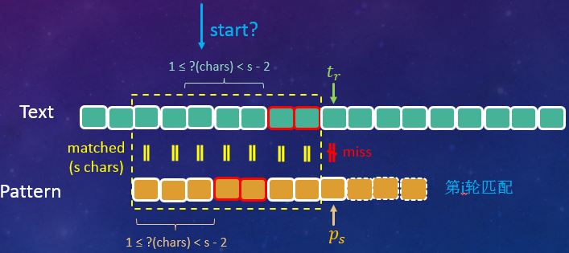
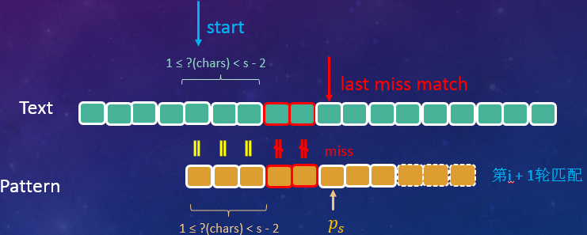

>Wisdom in the mind is better than money in the hand.

***

## 一、引言
### 1.1 反馈之殇
&emsp;&emsp;今年年初的时候，组内接到个反馈，客户很早之前购买的咱们公司的一款产品系统无法正常启动。公司经初步排查后确定故障原因是由于咱们应用识别模块占用的内存偏高，而这款产品又属于比较老的型号，硬件配置较低，启动时内存不足引起的。
&emsp;&emsp;我们经过深入分析发现，导致应用识别模块内存占用率居高不下的一个主要原因是AC引擎的具体代码实现上有些问题，有很大的优化空间。经过重新设计和实现后，单class内存占用率直接降低了100多M，未优化前应用识别模块内存占用率为？？MB，优化后占用？？MB，优化率??%，效果可以说是相当显著的。
&emsp;&emsp;深入排查的时候，少不了要去过N遍引擎代码，而AC多模匹配算法自然也成了我们的重点关注对象。经过我们不懈的努力，最终解决了这个问题，在此分享出来，以供大家参考。

### 1.2 系列文章
&emsp;&emsp;其实最开始的时候并没有想写成系列的文章，因为后续的引擎演进会迁移到其它更高效的字符串匹配算法上，因此我们决定把一些常见/常用的字符串匹配算法都分享出来，方便对这方面感兴趣的同学学习了解，同时也作为我们组的一种技术积累，欢迎大家积极跟我们探讨交流。

### 1.3 前注
&emsp;&emsp;本系列文章的目标是让没有任何字符串匹配/算法背景的同学也能轻松理解，在行文上可能会丧失一定的专业和简洁性，如有不妥，请多多指正。

## 二、字符串匹配算法
### 2.1 简介
&emsp;&emsp;字符串匹配算法自提出至今，可以说是硕果累累。无数业界大佬前赴后继的投入到了算法的研究中。时至今日，已经有大量成熟的匹配算法（及其变异体），对这些算法我们总结出一张概览表如下所示（仅仅覆盖了大部分算法）：

|  算法名称  |  主要作者  | 提出年份 | 分类I | 分类II | 备注 |
| :-----: | :-----: | :-----: | :-----: | :-----: | :--------: |
| Naive Algorithm (Brute Force)  | —— | —— | 单模匹配 | —— | —— |
| KMP  | DONALD E. KNUTHf JAMES H. MORRIS, JR. VAUGHAN R. PRATT | 1977 | 单模匹配 | 前缀搜索 | [Paper下载地址](http://www.cin.ufpe.br/~paguso/courses/if767/bib/KMP_1977.pdf) |
| BM  | Stanford Researc Xerox Palo Alto R | 1977 | 单模匹配 | 后缀搜索 | [Paper下载地址](https://www.cs.utexas.edu/~moore/publications/fstrpos.pdf) |
| Horspool  | R. NIGEL HORSPOOL | 1980 | 单模匹配 | 后缀搜索 | [Paper下载地址](http://webhome.cs.uvic.ca/~nigelh/Publications/stringsearch.pdf) |
| Rabin-Karp  | Richard M. Karp Michael O. Rabin | 1987 | 单模匹配 | —— | [Paper下载地址](https://pdfs.semanticscholar.org/c47d/151f09c567013761632c89e237431c6291a2.pdf) |
| Sunday  | Daniel M.Sunday | 1990 | 单模匹配 | 前缀搜索 | [Paper下载地址](https://csclub.uwaterloo.ca/~pbarfuss/p132-sunday.pdf) |
| Shift-And/Or  | Ricardo A. Baeza-Yates | 1992 | 单模匹配 | 前缀搜索 | [Paper下载地址](http://citeseerx.ist.psu.edu/viewdoc/download?doi=10.1.1.53.88&rep=rep1&type=pdf) |
| BDM  | Maxime Crochemore | 1994 | 单模匹配 | 子串搜索 | [Paper下载地址](https://www.researchgate.net/profile/Thierry_Lecroq/publication/226574953_Speeding_up_two_string-matching_algorithms/links/0f3175320a580a8da4000000/Speeding-up-two-string-matching-algorithms.pdf?origin=publication_detail) |
| BNDM  | Gonzalo Navarro | 2000 | 单模匹配 | 子串搜索 | [Paper下载地址](https://www.dcc.uchile.cl/TR/1998/TR_DCC-1998-004.pdf) |
| BLIM  | M. Oguzhan Külekci | 2010 | 单模匹配 | 子串搜索 | [Paper下载地址](https://www.researchgate.net/profile/M_Kuelekci/publication/225104238_BLIM_A_New_Bit-Parallel_Pattern_Matching_Algorithm_Overcoming_Computer_Word_Size_Limitation/links/004635396b507e4e86000000/BLIM-A-New-Bit-Parallel-Pattern-Matching-Algorithm-Overcoming-Computer-Word-Size-Limitation.pdf?origin=publication_detail) |
| Commentz-Walter  | Beate Commentz-Walter | 1979 | 多模匹配 | 后缀搜索 | [Paper下载地址](https://www.hs-albsig.de/studium/wirtschaftsinformatik/Documents/commentzwalterextab.pdf) |
| Wu-Manber  | Sun Wu Udi Manber | 1994 | 多模匹配 | 后缀搜索 | [Paper下载地址](http://webglimpse.net/pubs/TR94-17.pdf) |
| SBDM  | A. BLUMER | 1986 | 多模匹配 | 子串搜索 | [Paper下载地址](http://www.cs.colostate.edu/pubserv/pubs/Blumer-rmm-invertedFiles.pdf) |
| SBOM  | Maxime Crochemore | 1999 | 多模匹配 | 子串搜索 | [Paper下载地址](http://musicweb.ucsd.edu/~sdubnov/CATbox/Reader/allauzen99factor.pdf) |

&emsp;&emsp;注：表格中仅仅列出了一些Paper能找到的算法，其它的则没有在此列出。

### 2.2 术语&&约定
&emsp;&emsp;为了尽量保持语言的简洁，我们在此对一些术语及约定做一个介绍。
#### 2.2.1 目标串
&emsp;&emsp;给定一串字符，比如"Sometimes, the everlasting hate have no unique period."，我们要在这串字符里面寻找某个/某些单词/字母，我们称这串字符为**目标串(Text)**，其长度记为**$n$**，指向目标串的索引变量我们用$r,\  r=1,2,3,...$表示。
&emsp;&emsp;即$t\_r$表示目标串的第$r$个字符，目标串为：$Text = t\_1 t\_2 t\_3 ...  t\_r ...t\_n$。

#### 2.2.2 特征串
&emsp;&emsp;接上面说的，我们要寻找的某个/某些单词/字母（比如我要找"unique"），我们称之为**特征串(Pattern)**，其长度记为**$m$**，指向特征串的索引变量我们用$s, \ s=1,2,3,...$表示。
&emsp;&emsp;即$p\_s$表示特征串的第$s$个字符，特征串为：$Pattern = p\_1 p\_2 p\_3 ... p\_s ... p\_m$。

### 2.3 Naive Algorithm(Brute Force)算法
&emsp;&emsp;对于IT开发人员来说，字符串匹配/检索可以说是使用频率比较高的一种操作了。即使我们的400妹子，每天也会有大量的字符匹配操作，比如使用Windows自带的搜索文件功能。
&emsp;&emsp;对于字符匹配的这一系列算法，我们先来介绍最简单，最易懂，但也是效率最低的一种。由于这种算法跟我们大脑的思维模式比较贴近，因此在不需要任何算法、计算机等的相关知识的情况下，也能想出来。这就是我们要介绍的Naive Algorithm（朴素算法，名字果然很朴素）或者称为Brute Force（暴力算法，我想这个名字是缘于其实现思路简单粗暴）。
&emsp;&emsp;结合实际例子来讲，有一串字符`aabcabcabcacabc`（即我们的目标串），要让你在里面找`abcabcacab`（即我们的特征串），并且告诉你完全不用考虑效率，能找出来就算完成任务，目标串和特征串如下所示：

$$
\begin{split}
Text&: \qquad aabcabcabcacabc \\\\
Pattern&: \qquad abcabcacab \\\\
\end{split}
$$

&emsp;&emsp;该怎么做呢？聪明的你略加思索就找到了答案，我拿着特征串，比对着目标串，从前往后，挨个挨个去比较。虽然很简单，我们还是把这个过程画一下（**为了方便对比，我们用正方形小框代替空格，图中绿色表示匹配成功字符，红色表示匹配失败字符。**），如下所示：

$$
\begin{split}
&I \Box love \Box you. \\\\
step1: \ &\boxed{a} \boxed{bcacca}  \qquad &\color{red}{miss}\\\\
step2: \ &\ \ \color{red}{o} v \qquad &\color{red}{miss}\\\\
step3: \ &\ \ \ \ \color{red}{o} v \qquad &\color{red}{miss}\\\\
step4: \ &\ \ \ \ \ \ \color{green}{o} \color{green}{v} \qquad &\color{green}{match!}\\\\
& \ldots \qquad \qquad \ldots
\end{split}
$$

| Index | 1 | 2 | 3 | 4 | 5 | 6 | 7 | 8 | 9 | 10 | 11 | 12 | 13 | 14 | 15 |
| :--: | :--: | :--: | :--: | :--: | :--: | :--: | :--: | :--: | :--: | :--: | :--: | :--: | :--: | :--: | :--: |
| Text | $a$ | $a$ | $b$ | $c$ | $a$ | $b$ | $c$ | $a$ | $b$ | $c$ | $a$ | $c$ | $a$ | $b$ | $c$ |
| Step1| $\color{green}{a}$ | $\color{red}{b}$ | $c$ | $a$ | $b$ | $c$ | $a$ | $c$ | $a$ | $b$ |  |  |  |  |  |
| Step2|  | $\color{green}{a}$ | $\color{green}{b}$ | $\color{green}{c}$ | $\color{green}{a}$ | $\color{green}{b}$ | $\color{green}{c}$ | $\color{green}{a}$ | $\color{green}{c}$ | $\color{green}{a}$ | $ \color{red}{b}$ |  |  |  |  |
| Step3|  |  | $\color{red}{a}$ | $b$ | $c$ | $a$ | $b$ | $c$ | $a$ | $c$ | $a$ | $b$ |  |  |  |
| Step4|  |  |  | $\color{red}{a}$ | $b$ | $c$ | $a$ | $b$ | $c$ | $a$ | $c$ | $a$ | $b$ |  |  |
| Step5|  |  |  |  | $\color{green}{a}$ | $\color{green}{b}$ | $\color{green}{c}$ | $\color{green}{a}$ | $\color{green}{b}$ | $\color{green}{c}$ | $\color{green}{a}$ | $\color{green}{c}$ | $\color{green}{a}$ | $ \color{green}{b}$ |  |
| Step6|  |  |  |  |  | $\color{red}{a}$ | $b$ | $c$ | $a$ | $b$ | $c$ | $a$ | $c$ | $a$ | $b$ |
| Done! | | | | | | | | | | | | | | | | |

&emsp;&emsp;可以看出，直到第5次的时候，我们才找到了一个完全匹配。这个算法非常简单直白，就不多说，其时间复杂度（最坏情况下）为$\color{red}{O((n - m + 1)m)}$。
&emsp;&emsp;关于时间复杂度，考虑到有少数同学没有学过算法分析，在这里就多说几句。时间复杂度是用来**定性（注意非定量）**描述算法运行时间（效率）的一个参数，常用记号$O$(ooxx)来表示，我们常用的时间复杂度有：

$$
\underbrace{O(1)}\_{常数} < \underbrace{O(logN)}\_{对数} < \underbrace{O(N)}\_{线性} < \underbrace{O(N \cdot logN)}\_{线性对数} < \underbrace{O(N^{m=2,3,...})}\_{m次方} < \underbrace{O(2^N)}\_{指数级} < \underbrace{O(N!)}\_{阶乘}
$$

&emsp;&emsp;从左往右，时间复杂度越来越高，而算法的效率越来越低。

### 2.4 KMP(Knuth–Morris–Pratt)算法
&emsp;&emsp;KMP算法属于字符串匹配中比较经典的算法，它后面提出来的很多算法都借鉴它的一些想法。
&emsp;&emsp;前面的BF算法实在是太繁琐了，每次只能跳一格来开始新一轮的匹配，每一轮的匹配还需要逐个逐个字符去比较，简直累死个人，这也是它效率极低的原因所在。那么有没有什么方法可以改进呢？几个大牛琢磨一番之后，就找到了办法，并且这个办法还比较好使。

图2-1　　Donald Ervin Knuth</img>

&emsp;&emsp;提出这个算法的几个人里面，有一位叫**Donald Ervin Knuth**的神人（上图2-1），不得不八卦一下。他是1974年的图灵奖获得者，这样的大牛平时写写书出个版、敲敲代码跑个软件跟玩儿似的，《计算机程序设计的艺术》就是他写的。这本书被《美国科学家》杂志列为20世纪最重要的12本物理科学类专著之一，与《相对论》、《量子力学》等经典齐名。另外Tex排版系统也是他搞出来的。大神的其它辉煌事迹就不扒了，说多了自卑。

#### 2.4.1 KMP核心思想之一
&emsp;&emsp;我们回过头去看上面的例子，第3、4步对首字符进行检测时就发生了失配（我们简称匹配失败为失配，下同）。如果有这么一位“智者”，他在我们第2步发生失配的时候就告诉我们特征串往前挪动3格，即跳过第3、4步直接进入第5步的匹配，那我们只需要3步操作就能顺利的找到我们想要的字符串，效率是不是提高了很多？推而广之，如果我们每次失配的时候都去请教这位“智者”，让他告诉我们应该往前挪动几格，那么我们很快就能完成整个目标串的检索。

&emsp;&emsp;在KMP算法中，这位“智者”就是咱们的Next数组，它详细的记载了当我们在某个位置发生失配时，应该往前“跳跃”几步。

#### 2.4.2 KMP核心思想之二
&emsp;&emsp;再来看第2步匹配，这一步是最殇的。我们从索引号为2的目标字符$t\_2=a$开始，一路绿灯逛飚，直到最后一个字符了才发现不匹配。这一步我们一共进行了10次匹配操作。而在第5步的时候，我们还得老老实实从索引号为5的目标字符$t\_5=a$，匹配到索引号为14的目标字符$t\_{14}=b$。也就是说，索引号5~10的总共6个目标字符$t\_5 \ t\_6...t\_{10}=abcabc$，每个字符我们都去执行了两次匹配操作，如下所示（为了方便观察，我只列出了这些字符的索引号）。

| Index |  |  |  |  | 5 | 6 | 7 | 8 | 9 | 10 |  |  |  |  |  |
| :--: | :--: | :--: | :--: | :--: | :--: | :--: | :--: | :--: | :--: | :--: | :--: | :--: | :--: | :--: | :--: |
| Text | $a$ | $a$ | $b$ | $c$ | $a$ | $b$ | $c$ | $a$ | $b$ | $c$ | $a$ | $c$ | $a$ | $b$ | $c$ |
| Step2|  | $\color{green}{a}$ | $\color{green}{b}$ | $\color{green}{c}$ | $\color{green}{a}$ | $\color{green}{b}$ | $\color{green}{c}$ | $\color{green}{a}$ | $\color{green}{c}$ | $\color{green}{a}$ | $ \color{red}{b}$ |  |  |  |  |
| Step5|  |  |  |  | $\color{green}{a}$ | $\color{green}{b}$ | $\color{green}{c}$ | $\color{green}{a}$ | $\color{green}{b}$ | $\color{green}{c}$ | $\color{green}{a}$ | $\color{green}{c}$ | $\color{green}{a}$ | $ \color{green}{b}$ |  |

&emsp;&emsp;如果我们的“智者”在我们进行第5步的匹配操作时告诉我们，你直接从目标串第11个字符$t\_{11}=a$开始，前面的你都甭管，都是匹配的。那么我们在这一步只需要匹配剩下的10 - 6 = 4个字符即可。这样是不是又进一步提高了匹配效率？

&emsp;&emsp;在KMP算法中，这个信息同样是存放在我们的Next数组中的。也就是说这个Next数组它兼具了两个功能：

- 每一轮匹配失败后，Next数组会告诉你沿着目标串（Text）往前跳跃几步，从指定位置处开始新一轮的匹配；
图2-2　　KMP算法在目标串上的跳跃示意图</img>

- 在新一轮的匹配操作中，Next数组会告诉你忽略特征串（Pattern）开头的多少个字符不用做匹配，从指定位置处开始逐个比对目标串字符和特征串字符；
图2-3　　KMP算法在特征串上的跳跃示意图</img>

#### 2.4.3 Next数组之谜
&emsp;&emsp;KMP算法的核心思想就是借助一个三方工具（Next数组，存放在内存中）去记录一些关键性的信息，实现匹配过程中的不断跳跃前进，从而有效的减少匹配次数。后面我们会看到还有许多算法都是这种套路，只不过玩法上有所差异。比如有个算法觉得这些关键信息放在内存中还是不够快，它干脆直接放到了寄存器里面，也算是玩出了新高度。
&emsp;&emsp;只要充分理解了上面的两点核心思想，KMP算法咱也就掌握了一半了。理解了KMP算法的思想之后，一些疑问也随之而来。
 - Next数组中存放的信息为何就能精准、高效的帮我们定位到下一轮匹配的开始位置？
 - 这个Next数组的值又是如何计算的？

&emsp;&emsp;这两个问题我们一个个来解答。

##### 2.4.3.1 定位之谜一
&emsp;&emsp;如下图所示，假定我们在第$i$轮匹配时，目标串和特征串前面的$s - 1$个字符已经匹配（图中黄色虚线框内部分），而在第$s$个字符处发生了失配（图中红色不等号对应的两个方框），我们需要确定在$i + 1$轮匹配时，跳到前面已经匹配的$s - 1$个字符中的哪一个开始。

图2-4　　KMP算法在目标串上的跳跃示意图2</img>

&emsp;&emsp;假如第$i + 1$轮匹配时，我们从这几个字符中的某个字符处开始，那就要求从这个字符开始的前$c（1 \leq c \leq s - 2)$个目标串字符（上图及下图中浅蓝色花括号所指部分）必然和我们特征串开始的$c$个字符（上图及下图中浅橘色花括号所指部分）匹配，只有这样中间才可能出现完全匹配的情况。

&emsp;&emsp;当$c = 0$时表示可以直接跳到失配处开始下一轮匹配了，先不考虑这种情况，我们会在后面讨论。
&emsp;&emsp;当$c = s - 1$时，即为本轮的匹配情况，所以$c$最大只能取到$(s - 1) - 1 = s -2$个字符。

&emsp;&emsp;更进一步，如果这$c$个字符的最后一个字符与失配字符之间的所有字符（上图及下图中红色外框部分）不匹配的话，也是无法产生一次完全匹配的，如下图所示：

图2-5　　第i + 1轮匹配失败示意图</img>

&emsp;&emsp;也就是说，目标串（必须）从失配处的前一个字符往前开始计算，特征串从首字符往后开始计算，当且仅当有不少于1个字符匹配时（**我们称之为预匹配**），才有可能产生一次完全匹配，我们才需要做一次尝试，否则直接跳到目标串失配的字符处开始下一轮匹配。
&emsp;&emsp;在[2.2节](#provision)中我们约定分别用$r、s$表示当前匹配操作时，指向的目标串、特征串，由此可得预匹配的条件（$c \neq 0$）为：

$$
p\_1...p\_c = t\_{r - c}...t\_{r - 1}, \quad c \in [1, s - 2]
\tag{2 - 1}
$$

&emsp;&emsp;文字说起来可能有点绕，我们直接上图：

图2-6　　预匹配的情况示意图</img>

&emsp;&emsp;图中黄色虚线内的部分（有黄色等号部分）即为我们上一次已经匹配了的字符，红色不等号处字符即为上一次失配的位置。图中同一种颜色的虚线箭头所包含的字符即表示应该预匹配的部分。
&emsp;&emsp;$min = 1$表示预匹配最少应保证有一个目标串字符和特征串字符匹配，这种情况下，特征串就跳到失配字符的前一个字符处，开始下一轮匹配。$max= s - 2$表示预匹配最多可以有$s - 2$个目标串字符和特征串字符匹配，这种情况下，特征串仅仅会往前挪动一个字符，然后开始下一轮匹配。
&emsp;&emsp;一般的，我们有下面这个预匹配示意图：

图2-7　　预匹配的情况示意图2</img>

&emsp;&emsp;图中虚线箭头所指部分即为预匹配字符。**对于预匹配字符，目标串上的部分我们给它取个名字叫后缀，特征串上的部分我们则称作前缀**（上图已标注）。由此，预匹配的条件我们也可以表达为$suffix = prefix$。
&emsp;&emsp;由此可以看出，只要我们保存前缀/后缀的大小（长度），我们就能在下一轮匹配时准确定位到匹配开始的位置。而Next数组正是因为保存了这个关键信息，所以能实现目标串上的定位！

##### 2.4.3.2 关于前后缀
&emsp;&emsp;接上文，记前缀/后缀的长度为$c(c\  = \ surffix.length \ = \ prefix.length)$，第$i$轮匹配时目标串、特征串已经匹配的字符数为$s - 1$，则根据$c$的值我们有：

- $c = 0$，已匹配的字符中没有预匹配发生，第$i + 1$轮匹配应从失配处开始，示例如下；

| index| 1| 2| 3| 4| 5| 6| 7| 8| 9| 10| 11| 12| 13|
| :--: | :--: | :--: | :--: | :--: | :--: | :--: | :--: | :--: | :--: | :--: | :--: | :--: | :--: |
| Text | $a$ | $a$ | $b$ | $c$ | $a$ | $a$ | $c$ | $a$ | $c$ | $c$ | $a$ | $c$ | $a$ |
| i'th iter|  | $\color{green}{a}$ | $\color{green}{b}$ | $\color{green}{c}$ | $\color{green}{a}$ | $\color{green}{a}$ | $\color{green}{c}$ | $\color{green}{a}$ | $\color{green}{c}$ | $\color{red}{b}$ |  |  |  |  |
| (i+1)'th iter|  |  |  |  |  |  |  |  |  |$\color{red}{a}$ | $b$ | $c$ | $...$ |
&emsp;&emsp;索引号为5、6、8处的字符虽然匹配了特征串首字符，但他们均不满足**预匹配**的定义，因此不可能存在全匹配的情况。

- $c = 1$，第$i + 1$轮匹配时，则从失配处的前一个字符开始，示例如下；

| index| 1| 2| 3| 4| 5| 6| 7| 8| 9| 10| 11| 12| 13|
| :--: | :--: | :--: | :--: | :--: | :--: | :--: | :--: | :--: | :--: | :--: | :--: | :--: | :--: |
| Text | $a$ | $a$ | $b$ | $c$ | $c$ | $b$ | $c$ | $b$ | $a$ | $c$ | $a$ | $c$ | $a$ |
| i'th iter|  | $\color{green}{a}$ | $\color{green}{b}$ | $\color{green}{c}$ | $\color{green}{c}$ | $\color{green}{b}$ | $\color{green}{c}$ | $\color{green}{b}$ | $\color{green}{a}$ | $\color{red}{b}$ |  |  |  |  |
| (i+1)'th iter|  |  |  |  |  |  |  |  |$\color{green}{a}$ | $\color{red}{b}$ | $c$ | $c$ | $...$ |

- $1 < c < s - 1$，第$i + 1$轮匹配时，则从中间的某一个字符开始，示例如下；

| index| 1| 2| 3| 4| 5| 6| 7| 8| 9| 10| 11| 12| 13|
| :--: | :--: | :--: | :--: | :--: | :--: | :--: | :--: | :--: | :--: | :--: | :--: | :--: | :--: |
| Text | $a$ | $a$ | $b$ | $c$ | $c$ | $b$ | $a$ | $b$ | $c$ | $c$ | $a$ | $c$ | $a$ |
| i'th iter|  | $\color{green}{a}$ | $\color{green}{b}$ | $\color{green}{c}$ | $\color{green}{c}$ | $\color{green}{b}$ | $\color{green}{a}$ | $\color{green}{b}$ | $\color{green}{c}$ | $\color{red}{b}$ |  |  |  |  |
| (i+1)'th iter|  |  |  |  |  |  |$\color{green}{a}$ | $\color{green}{b}$ | $\color{green}{c}$ | $\color{green}{c}$ | $\color{red}{b}$ | $a$ | $...$ |

&emsp;&emsp;索引号为7处满足了预匹配的条件，因此我们需要在这里停下来做一轮匹配，即使最终没有完全匹配（索引号11处发生失配），但是我们并不能跳过这一步。
&emsp;&emsp;原因就在于上一轮匹配时我们的特征串最右边只对齐到了索引号为10的目标串（$c$），也就是说到这一步为止我们只知道目标串前面的10个字符是什么，它后面有些什么字符我们并不知道，所以还得老老实实走一波。

- $c = s - 2$，第$i + 1$轮匹配时，则特征串往右移动一格，开始新一轮匹配，这是最特殊的情况，**这种情况下要求特征串的前面$s - 1(s \in [2, m])$个字符都完全相同**，如下图所示：

图2-8　　特殊情况的匹配示意图</img>

当然这种情况在实际生活中出现的概率是比较小的，示例如下；

| index| 1| 2| 3| 4| 5| 6| 7| 8| 9| 10| 11| 12| 13|
| :--: | :--: | :--: | :--: | :--: | :--: | :--: | :--: | :--: | :--: | :--: | :--: | :--: | :--: |
| Text | $a$ | $a$ | $a$ | $a$ | $a$ | $a$ | $a$ | $a$ | $a$ | $a$ | $b$ | $c$ | $a$ |
| i'th iter|  | $\color{green}{a}$ | $\color{green}{a}$ | $\color{green}{a}$ | $\color{green}{a}$ | $\color{green}{a}$ | $\color{green}{a}$ | $\color{green}{a}$ | $\color{green}{a}$ | $\color{red}{c}$ |  |  |  |  |
| (i+1)'th iter|  |  | $\color{green}{a}$ | $\color{green}{a}$ | $\color{green}{a}$ | $\color{green}{a}$ | $\color{green}{a}$ | $\color{green}{a}$ | $\color{green}{a}$ | $\color{green}{a}$ | $\color{red}{c}$ |  |  |  |
&emsp;&emsp;上图中红色双向箭头对应的是我们目标串和特征串已匹配的字符，蓝色虚线部分对应的是预匹配部分字符。
&emsp;&emsp;上面说的特征串前$s - 1$个字符都要完全相同这个结论要证明是比较简单的，拿张纸随便画一画就明白了。这里我们还是给出理论证明过程，供有兴趣的参考。由于特征串与目标串已经匹配了前面$s - 1$个字符，所以有：

$$
\underbrace{p\_1...p\_{s-1}}\_{(s - 1) - 1 + 1 = s - 1个字符} = \underbrace{t\_{r-s+1}...t\_{r-1}}\_{(r - 1) - (r - s + 1) + 1 = s - 1个字符}
\tag{2 - 2}
$$

&emsp;&emsp;即：

$$
\begin{cases}
p\_1 = t\_{r - s + 1} \\\\
p\_2 = t\_{r - s + 2} \\\\
\cdots \cdots \\\\
p\_{s - 1} = t\_{r - 1} \\\\
\end{cases}
\tag{2 - 3}
$$

&emsp;&emsp;再由预匹配的条件我们有：

$$
\underbrace{p\_1...p\_{s-2}}\_{(s - 2) - 1 + 1 = s - 2个字符} = \underbrace{t\_{r-s+2}...t\_{r-1}}\_{(r - 1) - (r - s + 2) + 1 = s - 2个字符}
\tag{2 - 4}
$$

&emsp;&emsp;即：

$$
\begin{cases}
p\_1 = t\_{r - s + 2} \\\\
p\_2 = t\_{r - s + 3} \\\\
\cdots \qquad \cdots \\\\
p\_{s - 2} = t\_{r - 1} \\\\
\end{cases}
\tag{2 - 5}
$$

&emsp;&emsp;再由式（2-3）、（2-5）有：

$$
\underset{\triangle}{p\_1} = t\_{r - s + 1} = t\_{r - s + 2} = \underset{\triangle}{p\_2} = t\_{r - s + 3} = \cdots  = \underset{\triangle}{p\_{s - 2}} = t\_{r - 1} = \underset{\triangle}{p\_{s - 1}}\\\\
$$

&emsp;&emsp;证毕！
&emsp;&emsp;**对给定的前缀$c$，我们可求出，下一轮匹配时，应该沿着目标串往前移动$(s - 1) - c = s - c + 1$个字符。**这是我们目标串上的跳跃值计算公式。
&emsp;&emsp;另外还有一点需要说明的是，当已匹配的这些字符串中产生了多个预匹配时（也即有不同大小的前缀/后缀，如图2-6所示），我们在下一轮匹配操作时，应该选择哪一个预匹配？能否跳过中间的某些预匹配？
&emsp;&emsp;答案是：**有多个预匹配时，为避免漏匹配，应选择匹配长度$c$最大的那一个（即最大前缀/后缀）作为下一轮匹配的跳转依据**。

##### 2.4.3.3 定位之谜二
&emsp;&emsp;上面我们得到了目标串上的跳跃值计算公式。那么特征串上跳跃值计算公式又怎么求呢？
&emsp;&emsp;这个问题要比目标串上的跳跃简单的多，第$i + 1$轮匹配的时候，根据预匹配的定义，特征串和目标串前面的$c$个字符已经逐一匹配了，所以我们只需要比对目标串上的$t\_r$（即为上一轮失配的字符）和特征串上的第$c + 1$个字符$p\_{c + 1}$即可。也就是说，在新一轮的匹配中，我们可以直接把指向特征串的指针$s$置为$c + 1$，这就是特征串上的跳跃值计算公式。
&emsp;&emsp;也就是说，要实现特征串上的定位，只需要使用前缀/后缀信息即可。

&emsp;&emsp;综上所述，Next数组正是存储了这些信息，使得我们可以精准的同时在目标串和特征串上跳跃匹配。

$$
\begin{split}
& \overline{\underline{\textbf{Algorithm  1    KMP} \qquad \qquad \qquad \qquad \qquad \qquad \qquad \qquad \qquad \qquad \qquad}} \\\\
& \textbf{Input:    text(n chars), pattern(m chars), next(m elements array)} \\\\
& \textbf{Output:   index(matched) or false(no match)} \\\\
& \textbf{function} \quad kmp\\_algorithm(text, \ pattern, \ next): \\\\
&1 \qquad  n \ = \ text.length \\\\
&2 \qquad  m \ = \ pattern.length \\\\
&3 \qquad  j= \ k=\  1 \\\\
&4 \qquad  \textbf{while} \  j \  \leq \ m \ \textbf{and} \ k \ \leq \ n \\\\
&5 \qquad  \qquad\textbf{while} \ j \  > \ 0 \ \textbf{and} \ text[k] \ \neq \ pattern[j] \\\\
&6 \qquad  \qquad  \qquad //update \ j \\\\
&7 \qquad  \qquad  \qquad j:=\ next[j] \\\\
&8 \qquad  \qquad k:=\ k \ + \ 1 \\\\
&9 \qquad  \qquad j:=\ j \ + \ 1 \\\\
& \underline{\textbf{end function} \qquad \qquad \qquad \qquad \qquad \qquad \qquad \qquad \qquad \qquad \qquad} \\\\
\end{split}
$$

