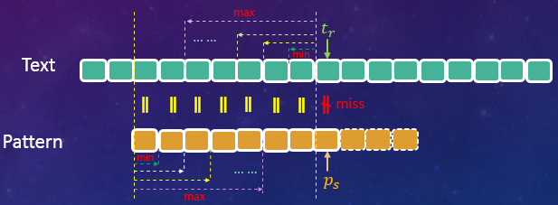

><font color=#0000FF face="微软雅黑" size=4>Wisdom in the mind is better than money in the hand.</font>

***

## 一、引言
### 1.1 反馈之殇
&emsp;&emsp;今年年初的时候，组内接到个反馈，客户很早之前购买的咱们公司的一款产品系统无法正常启动。公司经初步排查后确定故障原因是由于咱们应用识别模块占用的内存偏高，而这款产品又属于比较老的型号，硬件配置较低，启动时内存不足引起的。
&emsp;&emsp;我们经过深入分析发现，导致应用识别模块内存占用率居高不下的一个主要原因是AC引擎的具体代码实现上有些问题，有很大的优化空间。经过重新设计和实现后，单class内存占用率直接降低了100多M，未优化前应用识别模块内存占用率为？？MB，优化后占用？？MB，优化率??%，效果可以说是相当显著的。
&emsp;&emsp;深入排查的时候，少不了要去过N遍引擎代码，而AC多模匹配算法自然也成了我们的重点关注对象。经过我们不懈的努力，最终解决了这个问题，在此分享出来，以供大家参考。

### 1.2 系列文章
&emsp;&emsp;其实最开始的时候并没有想写成系列的文章，因为后续的引擎演进会迁移到其它更高效的字符串匹配算法上，因此我们决定把一些常见/常用的字符串匹配算法都分享出来，方便对这方面感兴趣的同学学习了解，同时也作为我们组的一种技术积累，欢迎大家积极跟我们探讨交流。

### 1.3 前注
&emsp;&emsp;本系列文章的目标是让没有任何字符串匹配/算法背景的同学也能轻松理解，在行文上可能会丧失一定的专业和简洁性，如有不妥，请多多指正。

## 二、字符串匹配算法
### 2.1 简介
&emsp;&emsp;字符串匹配算法自提出至今，可以说是硕果累累。无数业界大佬前赴后继的投入到了算法的研究中。时至今日，已经有大量成熟的匹配算法（及其变异体），对这些算法我们总结出一张概览表如下所示（仅仅覆盖了大部分算法）：

|  算法名称  |  主要作者  | 提出年份 | 分类I | 分类II | 备注 |
| :-----: | :-----: | :-----: | :-----: | :-----: | :--------: |
| Naive Algorithm</br>(Brute Force)  | —— | —— | 单模匹配 | —— | —— |
| KMP  | DONALD E. KNUTHf</br>JAMES H. MORRIS, JR.</br>VAUGHAN R. PRATT | 1977 | 单模匹配 | 前缀搜索 | [Paper下载地址](http://www.cin.ufpe.br/~paguso/courses/if767/bib/KMP_1977.pdf) |
| BM  | Stanford Researc</br>Xerox Palo Alto R | 1977 | 单模匹配 | 后缀搜索 | [Paper下载地址](https://www.cs.utexas.edu/~moore/publications/fstrpos.pdf) |
| Horspool  | R. NIGEL HORSPOOL | 1980 | 单模匹配 | 后缀搜索 | [Paper下载地址](http://webhome.cs.uvic.ca/~nigelh/Publications/stringsearch.pdf) |
| Rabin-Karp  | Richard M. Karp</br>Michael O. Rabin | 1987 | 单模匹配 | —— | [Paper下载地址](https://pdfs.semanticscholar.org/c47d/151f09c567013761632c89e237431c6291a2.pdf) |
| Sunday  | Daniel M.Sunday | 1990 | 单模匹配 | 前缀搜索 | [Paper下载地址](https://csclub.uwaterloo.ca/~pbarfuss/p132-sunday.pdf) |
| Shift-And/Or  | Ricardo A. Baeza-Yates | 1992 | 单模匹配 | 前缀搜索 | [Paper下载地址](http://citeseerx.ist.psu.edu/viewdoc/download?doi=10.1.1.53.88&rep=rep1&type=pdf) |
| BDM  | Maxime Crochemore | 1994 | 单模匹配 | 子串搜索 | [Paper下载地址](https://www.researchgate.net/profile/Thierry_Lecroq/publication/226574953_Speeding_up_two_string-matching_algorithms/links/0f3175320a580a8da4000000/Speeding-up-two-string-matching-algorithms.pdf?origin=publication_detail) |
| BNDM  | Gonzalo Navarro | 2000 | 单模匹配 | 子串搜索 | [Paper下载地址](https://www.dcc.uchile.cl/TR/1998/TR_DCC-1998-004.pdf) |
| BLIM  | M. Oguzhan Külekci | 2010 | 单模匹配 | 子串搜索 | [Paper下载地址](https://www.researchgate.net/profile/M_Kuelekci/publication/225104238_BLIM_A_New_Bit-Parallel_Pattern_Matching_Algorithm_Overcoming_Computer_Word_Size_Limitation/links/004635396b507e4e86000000/BLIM-A-New-Bit-Parallel-Pattern-Matching-Algorithm-Overcoming-Computer-Word-Size-Limitation.pdf?origin=publication_detail) |
| Commentz-Walter  | Beate Commentz-Walter | 1979 | 多模匹配 | 后缀搜索 | [Paper下载地址](https://www.hs-albsig.de/studium/wirtschaftsinformatik/Documents/commentzwalterextab.pdf) |
| Wu-Manber  | Sun Wu</br>Udi Manber | 1994 | 多模匹配 | 后缀搜索 | [Paper下载地址](http://webglimpse.net/pubs/TR94-17.pdf) |
| SBDM  | A. BLUMER | 1986 | 多模匹配 | 子串搜索 | [Paper下载地址](http://www.cs.colostate.edu/pubserv/pubs/Blumer-rmm-invertedFiles.pdf) |
| SBOM  | Maxime Crochemore | 1999 | 多模匹配 | 子串搜索 | [Paper下载地址](http://musicweb.ucsd.edu/~sdubnov/CATbox/Reader/allauzen99factor.pdf) |
| AC  | Alfred V.Aho</br>Margaret J.Corasick | 1975 | 多模匹配 | 前缀搜索 | [Paper下载地址](https://biit.cs.ut.ee/~vilo/edu/2002-03/Tekstialgoritmid_I/Articles/Exact/Aho-Corasick.pdf) |

&emsp;&emsp;注：表格中仅仅列出了一些Paper能找到的算法，其它的则没有在此列出。

### 2.2 <a name="provision"></a>术语&&约定
&emsp;&emsp;为了尽量保持语言的简洁，我们在此对一些术语及约定做一个介绍。
#### 2.2.1 目标串
&emsp;&emsp;给定一串字符，比如"Sometimes, the everlasting hate have no unique period."，我们要在这串字符里面寻找某个/某些单词/字母，我们称这串字符为**目标串(Text)**，其长度记为**$n$**，指向目标串的索引变量我们用$r,\  r=1,2,3,...,n$表示。
&emsp;&emsp;即$t\_r$表示目标串的第$r$个字符，目标串为：$Text = t\_1 t\_2 t\_3 ...  t\_r ...t\_n$。

#### 2.2.2 特征串
&emsp;&emsp;接上面说的，我们要寻找的某个/某些单词/字母（比如我要找"unique"），我们称之为**特征串(Pattern)**，其长度记为**$m$**，指向特征串的索引变量我们用$s, \ s=1,2,3,...,m$表示。
&emsp;&emsp;即$p\_s$表示特征串的第$s$个字符，特征串为：$Pattern = p\_1 p\_2 p\_3 ... p\_s ... p\_m$。

### 2.3 Naive Algorithm(Brute Force)算法
&emsp;&emsp;对于IT开发人员来说，字符串匹配/检索可以说是使用频率比较高的一种操作了。即使我们的400妹子，每天也会有大量的字符匹配操作，比如使用Windows自带的搜索文件功能。
&emsp;&emsp;对于字符匹配的这一系列算法，我们先来介绍最简单，最易懂，但也是效率最低的一种。由于这种算法跟我们大脑的思维模式比较贴近，因此在不需要任何算法、计算机等的相关知识的情况下，也能想出来。这就是我们要介绍的Naive Algorithm（朴素算法，名字果然很朴素）或者称为Brute Force（暴力算法，我想这个名字是缘于其实现思路简单粗暴）。
&emsp;&emsp;结合实际例子来讲，有一串字符`aabcabcabcacabc`（即我们的目标串），要让你在里面找`abcabcacab`（即我们的特征串），并且告诉你完全不用考虑效率，能找出来就算完成任务，目标串和特征串如下所示：

$$
\begin{split}
Text&: \qquad aabcabcabcacabc \\\\
Pattern&: \qquad abcabcacab \\\\
\end{split}
$$

&emsp;&emsp;该怎么做呢？聪明的你略加思索就找到了答案，我拿着特征串，比对着目标串，从前往后，挨个挨个去比较。虽然很简单，我们还是把这个过程画一下（**为了方便对比，我们用正方形小框代替空格，图中绿色表示匹配成功字符，红色表示匹配失败字符。**），如下所示：

$$
\begin{split}
&I \Box love \Box you. \\\\
step1: \ &\boxed{a} \boxed{bcacca}  \qquad &\color{red}{miss}\\\\
step2: \ &\ \ \color{red}{o} v \qquad &\color{red}{miss}\\\\
step3: \ &\ \ \ \ \color{red}{o} v \qquad &\color{red}{miss}\\\\
step4: \ &\ \ \ \ \ \ \color{green}{o} \color{green}{v} \qquad &\color{green}{match!}\\\\
& \ldots \qquad \qquad \ldots
\end{split}
$$


| Index | 1 | 2 | 3 | 4 | 5 | 6 | 7 | 8 | 9 | 10 | 11 | 12 | 13 | 14 | 15 |
| :--: | :--: | :--: | :--: | :--: | :--: | :--: | :--: | :--: | :--: | :--: | :--: | :--: | :--: | :--: | :--: |
| Text | $a$ | $a$ | $b$ | $c$ | $a$ | $b$ | $c$ | $a$ | $b$ | $c$ | $a$ | $c$ | $a$ | $b$ | $c$ |
| Step1| $\color{green}{a}$ | $\color{red}{b}$ | $c$ | $a$ | $b$ | $c$ | $a$ | $c$ | $a$ | $b$ |  |  |  |  |  |
| Step2|  | $\color{green}{a}$ | $\color{green}{b}$ | $\color{green}{c}$ | $\color{green}{a}$ | $\color{green}{b}$ | $\color{green}{c}$ | $\color{green}{a}$ | $\color{green}{c}$ | $\color{green}{a}$ | $ \color{red}{b}$ |  |  |  |  |
| Step3|  |  | $\color{red}{a}$ | $b$ | $c$ | $a$ | $b$ | $c$ | $a$ | $c$ | $a$ | $b$ |  |  |  |
| Step4|  |  |  | $\color{red}{a}$ | $b$ | $c$ | $a$ | $b$ | $c$ | $a$ | $c$ | $a$ | $b$ |  |  |
| Step5|  |  |  |  | $\color{green}{a}$ | $\color{green}{b}$ | $\color{green}{c}$ | $\color{green}{a}$ | $\color{green}{b}$ | $\color{green}{c}$ | $\color{green}{a}$ | $\color{green}{c}$ | $\color{green}{a}$ | $ \color{green}{b}$ |  |
| Step6|  |  |  |  |  | $\color{red}{a}$ | $b$ | $c$ | $a$ | $b$ | $c$ | $a$ | $c$ | $a$ | $b$ |
| Done! | | | | | | | | | | | | | | | | |

&emsp;&emsp;可以看出，直到第5次的时候，我们才找到了一个完全匹配。这个算法非常简单直白，就不多说，其时间复杂度（最坏情况下）为$\color{red}{O((n - m + 1)m)}$。
&emsp;&emsp;关于时间复杂度，考虑到有少数同学没有学过算法分析，在这里就多说几句。时间复杂度是用来**定性（注意非定量）**描述算法运行时间（效率）的一个参数，常用记号$O$(ooxx)来表示，我们常用的时间复杂度有：

$$
\underbrace{O(1)}\_{常数} < \underbrace{O(logN)}\_{对数} < \underbrace{O(N)}\_{线性} < \underbrace{O(N \cdot logN)}\_{线性对数} < \underbrace{O(N^{m=2,3,...})}\_{m次方} < \underbrace{O(2^N)}\_{指数级} < \underbrace{O(N!)}\_{阶乘}
$$

&emsp;&emsp;从左往右，时间复杂度越来越高，而算法的效率越来越低。

### 2.4 KMP(Knuth–Morris–Pratt)算法
&emsp;&emsp;KMP算法属于字符串匹配中比较经典的算法，它后面提出来的很多算法都借鉴它的一些想法。
&emsp;&emsp;前面的BF算法实在是太繁琐了，每次只能跳一格来开始新一轮的匹配，每一轮的匹配还需要逐个逐个字符去比较，简直累死个人，这也是它效率极低的原因所在。那么有没有什么方法可以改进呢？几个大牛琢磨一番之后，就找到了办法，并且这个办法还比较好使。

<div  style="text-align:center;"><font size=1.8>图2-1　　Donald Ervin Knuth</font></img></div>

&emsp;&emsp;<font size=1.8>提出这个算法的几个人里面，有一位叫**Donald Ervin Knuth**的神人（上图2-1），不得不八卦一下。他是1974年的图灵奖获得者，这样的大牛平时写写书出个版、敲敲代码跑个软件跟玩儿似的，《计算机程序设计的艺术》就是他写的。这本书被《美国科学家》杂志列为20世纪最重要的12本物理科学类专著之一，与《相对论》、《量子力学》等经典齐名。另外Tex排版系统也是他搞出来的。大神的其它辉煌事迹就不扒了，说多了自卑。</font>

#### 2.4.1 KMP核心思想之一
&emsp;&emsp;我们回过头去看上面的例子，第3、4步对首字符进行检测时就发生了失配（我们简称匹配失败为失配，下同）。如果有这么一位“智者”，他在我们第2步发生失配的时候就告诉我们特征串往前挪动3格，即跳过第3、4步直接进入第5步的匹配，那我们只需要3步操作就能顺利的找到我们想要的字符串，效率是不是提高了很多？推而广之，如果我们每次失配的时候都去请教这位“智者”，让他告诉我们应该往前挪动几格，那么我们很快就能完成整个目标串的检索。

&emsp;&emsp;在KMP算法中，这位“智者”就是咱们的Next数组，它详细的记载了当我们在某个位置发生失配时，应该往前“跳跃”几步。

#### 2.4.2 KMP核心思想之二
&emsp;&emsp;再来看第2步匹配，这一步是最殇的。我们从索引号为2的目标字符$t\_2=a$开始，一路绿灯逛飚，直到最后一个字符了才发现不匹配。这一步我们一共进行了10次匹配操作。而在第5步的时候，我们还得老老实实从索引号为5的目标字符$t\_5=a$，匹配到索引号为14的目标字符$t\_{14}=b$。也就是说，索引号5~10的总共6个目标字符$t\_5 \ t\_6...t\_{10}=abcabc$，每个字符我们都去执行了两次匹配操作，如下所示（为了方便观察，我只列出了这些字符的索引号）。

| Index |  |  |  |  | 5 | 6 | 7 | 8 | 9 | 10 |  |  |  |  |  |
| :--: | :--: | :--: | :--: | :--: | :--: | :--: | :--: | :--: | :--: | :--: | :--: | :--: | :--: | :--: | :--: |
| Text | $a$ | $a$ | $b$ | $c$ | $a$ | $b$ | $c$ | $a$ | $b$ | $c$ | $a$ | $c$ | $a$ | $b$ | $c$ |
| Step2|  | $\color{green}{a}$ | $\color{green}{b}$ | $\color{green}{c}$ | $\color{green}{a}$ | $\color{green}{b}$ | $\color{green}{c}$ | $\color{green}{a}$ | $\color{green}{c}$ | $\color{green}{a}$ | $ \color{red}{b}$ |  |  |  |  |
| Step5|  |  |  |  | $\color{green}{a}$ | $\color{green}{b}$ | $\color{green}{c}$ | $\color{green}{a}$ | $\color{green}{b}$ | $\color{green}{c}$ | $\color{green}{a}$ | $\color{green}{c}$ | $\color{green}{a}$ | $ \color{green}{b}$ |  | |

&emsp;&emsp;如果我们的“智者”在我们进行第5步的匹配操作时告诉我们，你直接从目标串第11个字符$t\_{11}=a$开始，前面的你都甭管，都是匹配的。那么我们在这一步只需要匹配剩下的10 - 6 = 4个字符即可。这样是不是又进一步提高了匹配效率？

&emsp;&emsp;在KMP算法中，这个信息同样是存放在我们的Next数组中的。也就是说这个Next数组它兼具了两个功能：

- 每一轮匹配失败后，Next数组会告诉你沿着目标串（Text）往前跳跃几步，从指定位置处开始新一轮的匹配；<div  style="text-align:center;">图2-2　　KMP算法在目标串上的跳跃示意图</img></div>
- 在新一轮的匹配操作中，Next数组会告诉你忽略特征串（Pattern）开头的多少个字符不用做匹配，从指定位置处开始逐个比对目标串字符和特征串字符；<div  style="text-align:center;">图2-3　　KMP算法在特征串上的跳跃示意图</img></div>

#### 2.4.3 Next数组之谜
&emsp;&emsp;KMP算法的核心思想就是借助一个三方工具（Next数组，存放在内存中）去记录一些关键性的信息，实现匹配过程中的不断跳跃前进，从而有效的减少匹配次数。后面我们会看到还有许多算法都是这种套路，只不过玩法上有所差异。比如有个算法觉得这些关键信息放在内存中还是不够快，它干脆直接放到了寄存器里面，也是会玩。
&emsp;&emsp;只要充分理解了上面的两点核心思想，KMP算法咱也就掌握了一半了。理解了KMP算法的思想之后，一些疑问也随之而来，主要体现在以下两点：
 - Next数组中存放的信息为何就能精准、高效的帮我们定位到下一轮匹配的开始位置？
 - Next数组的大小跟什么有关，是只需要计算一次，还是需要在匹配过程中反复计算？
 - Next数组里面存放的值又是如何计算的？

&emsp;&emsp;这几个问题我们一个个来解答，首先我们来看看是如何做到定位的。

##### 2.4.3.1 定位之谜一
&emsp;&emsp;如下图所示，假定我们在第$i$轮匹配时，目标串和特征串前面的$s - 1$个字符已经匹配（图中黄色虚线框内部分），而在第$s$个字符处发生了失配（图中红色不等号对应的两个方框），我们需要确定在$i + 1$轮匹配时，跳到前面已经匹配的$s - 1$个字符中的哪一个开始。
<div  style="text-align:center;">图2-4　　KMP算法在目标串上的跳跃示意图2</img></div>

&emsp;&emsp;假如第$i + 1$轮匹配时，我们从这几个字符中的某个字符处开始，那就要求从这个字符开始的前$c（1 \leq c \color{red}{<} s - 2)$个目标串字符（上图及下图中浅蓝色花括号所指部分）必然和我们特征串开始的$c$个字符（上图及下图中浅橘色花括号所指部分）匹配，只有这样中间才可能出现完全匹配的情况。

&emsp;&emsp;<font color="red" size=1.8>当$c = 0$时表示可以直接跳到失配处开始下一轮匹配了，先不考虑这种情况，我们会在后面讨论。</font>
&emsp;&emsp;<font color="red" size=1.8>当$c = s - 1$时，即为本轮的匹配情况，所以$c$最大只能取到$(s - 1) - 1 = s -2$个字符。</font>
&emsp;&emsp;<font color="red" size=1.8>当$c = s - 2$时，可以证明这种情况并不存在，这也是为什么我们的$c$取值范围的右边是一个开区间，详细证明我们后面给出，所以实际上对于$s  \geq 3$的情况来说，$c$最大只能取到$(s - 1) - 1 - 1 = s -3$个字符。</font>

&emsp;&emsp;更进一步，如果这$c$个字符的最后一个字符与失配字符之间的所有字符（上图及下图中红色外框部分）不匹配的话，也是无法产生一次完全匹配的，如下图所示：
<div  style="text-align:center;">图2-5　　第i + 1轮匹配失败示意图</img></div>

&emsp;&emsp;也就是说，<font color="red">目标串（必须）从失配处的前一个字符往前开始计算，特征串从首字符往后开始计算</font>，当且仅当有不少于1个字符匹配时（**我们称之为预匹配**），才有可能产生一次完全匹配，我们才需要做一次尝试，否则直接跳到目标串失配的字符处开始下一轮匹配。
&emsp;&emsp;在[2.2节](#provision)中我们约定分别用$r、s$表示当前匹配操作时，指向的目标串、特征串，由此可得预匹配的条件（$c \neq 0$）为：

$$
p\_1...p\_c = t\_{r - c}...t\_{r - 1}, \quad c \in [1, s - 2]
\tag{2 - 1}
$$

&emsp;&emsp;文字说起来可能有点绕，我们直接上图：
<div  style="text-align:center;">图2-6　　预匹配的情况示意图</img></div>

&emsp;&emsp;图中黄色虚线内的部分（有黄色等号部分）即为我们上一次已经匹配了的字符，红色不等号处字符即为上一次失配的位置。图中同一种颜色的虚线箭头所包含的字符即表示应该预匹配的部分。
&emsp;&emsp;$Min = 1$表示预匹配最少应保证有一个目标串字符和特征串字符匹配，这种情况下，特征串就跳到失配字符的前一个字符处，开始下一轮匹配。$Max= s - 3$表示预匹配最多可以有$s - 3$个目标串字符和特征串字符匹配。
&emsp;&emsp;更一般的，我们有下面这张预匹配示意图：

<div  style="text-align:center;">图2-7　　预匹配的情况示意图2</img></div>

&emsp;&emsp;图中虚线箭头所指部分即为预匹配字符。**对于预匹配字符，目标串上的部分我们给它取个名字叫后缀，特征串上的部分我们则称作前缀**（上图已标注）。由此，预匹配的条件我们也可以表达为$suffix = prefix$。
&emsp;&emsp;由此可以看出，只要我们保存失配处前面的前缀/后缀的大小（长度），我们就能在下一轮匹配时准确定位到匹配开始的位置。而Next数组正是因为保存了这个关键信息，所以能实现目标串上的定位！

##### 2.4.3.2 关于前后缀
&emsp;&emsp;接上文，记前缀/后缀的长度为$c(c\  = \ surffix.length \ = \ prefix.length)$，第$i$轮匹配时目标串、特征串已经匹配的字符数为$s - 1$，则根据$c$取值的不同分别讨论如下：

- $c = 0$，已匹配的字符中没有预匹配发生，第$i + 1$轮匹配应从失配处开始，示例如下；

| index| 1| 2| 3| 4| 5| 6| 7| 8| 9| 10| 11| 12| 13|
| :--: | :--: | :--: | :--: | :--: | :--: | :--: | :--: | :--: | :--: | :--: | :--: | :--: | :--: |
| Text | $a$ | $a$ | $b$ | $c$ | $a$ | $a$ | $c$ | $a$ | $c$ | $c$ | $a$ | $c$ | $a$ |
| i'th iter|  | $\color{green}{a}$ | $\color{green}{b}$ | $\color{green}{c}$ | $\color{green}{a}$ | $\color{green}{a}$ | $\color{green}{c}$ | $\color{green}{a}$ | $\color{green}{c}$ | $\color{red}{b}$ |  |  |  |  |
| (i+1)'th iter|  |  |  |  |  |  |  |  |  |$\color{red}{a}$ | $b$ | $c$ | $...$ |
&emsp;&emsp;索引号为5、6、8处的字符虽然匹配了特征串首字符，但他们均不满足**预匹配**的定义，因此不可能存在全匹配的情况。

- $c = 1$，第$i + 1$轮匹配时，则从失配处的前一个字符开始，示例如下；

| index| 1| 2| 3| 4| 5| 6| 7| 8| 9| 10| 11| 12| 13|
| :--: | :--: | :--: | :--: | :--: | :--: | :--: | :--: | :--: | :--: | :--: | :--: | :--: | :--: |
| Text | $a$ | $a$ | $b$ | $c$ | $c$ | $b$ | $c$ | $b$ | $a$ | $c$ | $a$ | $c$ | $a$ |
| i'th iter|  | $\color{green}{a}$ | $\color{green}{b}$ | $\color{green}{c}$ | $\color{green}{c}$ | $\color{green}{b}$ | $\color{green}{c}$ | $\color{green}{b}$ | $\color{green}{a}$ | $\color{red}{b}$ |  |  |  |  |
| (i+1)'th iter|  |  |  |  |  |  |  |  |$\color{green}{a}$ | $\color{red}{b}$ | $c$ | $c$ | $...$ |

- $1 < c < s - 1$，第$i + 1$轮匹配时，则从中间的某一个字符开始，示例如下；

| index| 1| 2| 3| 4| 5| 6| 7| 8| 9| 10| 11| 12| 13|
| :--: | :--: | :--: | :--: | :--: | :--: | :--: | :--: | :--: | :--: | :--: | :--: | :--: | :--: |
| Text | $a$ | $a$ | $b$ | $c$ | $c$ | $b$ | $a$ | $b$ | $c$ | $c$ | $a$ | $c$ | $a$ |
| i'th iter|  | $\color{green}{a}$ | $\color{green}{b}$ | $\color{green}{c}$ | $\color{green}{c}$ | $\color{green}{b}$ | $\color{green}{a}$ | $\color{green}{b}$ | $\color{green}{c}$ | $\color{red}{b}$ |  |  |  |  |
| (i+1)'th iter|  |  |  |  |  |  |$\color{green}{a}$ | $\color{green}{b}$ | $\color{green}{c}$ | $\color{green}{c}$ | $\color{red}{b}$ | $a$ | $...$ |

&emsp;&emsp;索引号为7处满足了预匹配的条件，因此我们需要在这里停下来做一轮匹配，即使最终没有完全匹配（索引号11处发生失配），但是我们并不能跳过这一步。
&emsp;&emsp;原因就在于上一轮匹配时我们的特征串最右边只对齐到了索引号为10的目标串（$c$），也就是说到这一步为止我们只知道目标串前面的10个字符是什么，它后面有些什么字符我们并不知道，所以还得老老实实走一波。

- $c = s - 2$，这种情况比较特殊，**这种情况下要求特征串的前面$s - 1(s \in [2, m])$个字符都完全相同**，如下图所示：

<div  style="text-align:center;">图2-8　　特殊情况的匹配示意图</img></div>


&emsp;&emsp;上图中红色双向箭头对应的是我们目标串和特征串已匹配的字符，蓝色虚线部分对应的是预匹配部分字符。当然这种情况在实际生活中出现的概率是比较小的，示例如下；

| index| 1| 2| 3| 4| 5| 6| 7| 8| 9| 10| 11| 12| 13|
| :--: | :--: | :--: | :--: | :--: | :--: | :--: | :--: | :--: | :--: | :--: | :--: | :--: | :--: |
| Text | $a$ | $a$ | $a$ | $a$ | $a$ | $a$ | $a$ | $a$ | $a$ | $a$ | $b$ | $c$ | $a$ |
| i'th iter|  | $\color{green}{a}$ | $\color{green}{a}$ | $\color{green}{a}$ | $\color{green}{a}$ | $\color{green}{a}$ | $\color{green}{a}$ | $\color{green}{a}$ | $\color{green}{a}$ | $\color{red}{c}$ |  |  |  |  |
| (i+1)'th iter|  |  | $\color{green}{a}$ | $\color{green}{a}$ | $\color{green}{a}$ | $\color{green}{a}$ | $\color{green}{a}$ | $\color{green}{a}$ | $\color{green}{a}$ | $\color{green}{a}$ | $\color{red}{c}$ |  |  |  |


&emsp;&emsp;<font size=1.8>上面说的特征串前$s - 1$个字符都要完全相同这个结论要证明是比较简单的，拿张纸随便画一画就明白了。这里我们还是给出理论证明过程，供有兴趣的参考。由于特征串与目标串已经匹配了前面$s - 1$个字符，所以有：

$$
\underbrace{p\_1...p\_{s-1}}\_{(s - 1) - 1 + 1 = s - 1个字符} = \underbrace{t\_{r-s+1}...t\_{r-1}}\_{(r - 1) - (r - s + 1) + 1 = s - 1个字符}
\tag{2 - 2}
$$

&emsp;&emsp;</font><font size=1.8>即：

$$
\begin{cases}
p\_1 = t\_{r - s + 1} \\\\
p\_2 = t\_{r - s + 2} \\\\
\cdots \cdots \\\\
p\_{s - 1} = t\_{r - 1} \\\\
\end{cases}
\tag{2 - 3}
$$

&emsp;&emsp;</font><font size=1.8>再由预匹配的条件我们有：

$$
\underbrace{p\_1...p\_{s-2}}\_{(s - 2) - 1 + 1 = s - 2个字符} = \underbrace{t\_{r-s+2}...t\_{r-1}}\_{(r - 1) - (r - s + 2) + 1 = s - 2个字符}
\tag{2 - 4}
$$

&emsp;&emsp;</font><font size=1.8>即：

$$
\begin{cases}
p\_1 = t\_{r - s + 2} \\\\
p\_2 = t\_{r - s + 3} \\\\
\cdots \qquad \cdots \\\\
p\_{s - 2} = t\_{r - 1} \\\\
\end{cases}
\tag{2 - 5}
$$

&emsp;&emsp;</font><font size=1.8>再由式（2-3）、（2-5）有：

$$
\underset{\triangle}{p\_1} = t\_{r - s + 1} = t\_{r - s + 2} = \underset{\triangle}{p\_2} = t\_{r - s + 3} = \cdots  = \underset{\triangle}{p\_{s - 2}} = t\_{r - 1} = \underset{\triangle}{p\_{s - 1}}\\\\
$$

&emsp;&emsp;</font><font size=1.8>证毕！</font>

&emsp;&emsp;我们给定的是最大前/后缀为$c = s - 2$，但实际上可以得出$c = s - 1$，与已知条件矛盾，因此这种情况不存在。**实际上Paper中在定义的时候就规定，最大前缀必须是已匹配字符的子串。并且Paper中使用的是f值（最大前/后缀大小 + 1），因为f值能更平滑的过渡到Next值的求解。**

&emsp;&emsp;Paper中关于f值的定义原文如下：

>Let f[j] be the largest i less than j such that pattern[1]...pattern[i - 1] = pattern[j - i + 1]...pattern[j- 1]

&emsp;&emsp;为了平滑的与Paper的概念衔接起来，我们对一些特殊情况做些约定。**<a name="rule1"></a>对于$s \geq 3$的情况，c值可以直接用$c = s - 3$公式计算，对于$s = 1$时，规定$c = -1$（这样对应的f值即为0）。对于$s = 2$时，规定$c = 0$（这样对应的f值即为1）。**
&emsp;&emsp;<font color="red" size=1.8>注：Paper中是用$j$来指向失配的特征串字符，我们用的是$s$。</font>

&emsp;&emsp;**于是，对给定的前后缀，其大小（长度）为$c$，我们可求出，下一轮匹配时，特征串应该沿着目标串往前移动$(s - 1) - c = s - c - 1$个字符。**这是我们目标串上的跳跃值计算公式，如下所示：

<div  style="text-align:center;">图2-9　　目标串上跳跃值计算示意图</img></div>

&emsp;&emsp;另外还有一点需要说明的是，当已匹配的这些字符串中产生了多个预匹配时（也即有不同大小的前缀/后缀，如图2-6所示），我们在下一轮匹配操作时，应该选择哪一个预匹配？能否跳过中间的某些预匹配？
&emsp;&emsp;答案是：**有多个预匹配时，为避免漏匹配，应选择匹配长度$c$最大的那一个（即最大前缀/后缀）作为下一轮匹配的跳转依据**。

##### 2.4.3.3 定位之谜二
&emsp;&emsp;上面我们得到了目标串上的跳跃值计算公式。那么特征串上跳跃值又怎么计算公呢？
&emsp;&emsp;这个问题要比目标串上的跳跃简单的多，第$i + 1$轮匹配的时候，根据预匹配的定义，特征串和目标串前面的$c$个字符已经逐一匹配了，所以我们只需要比对目标串上的$t\_r$（即为上一轮失配的字符）和特征串上的第$c + 1$个字符$p\_{c + 1}$即可。也就是说，在新一轮的匹配中，我们跳过特征串的前面$c$个字符，如下图所说：

<div  style="text-align:center;">图2-10　　特征串上跳跃值计算示意图</img></div>

&emsp;&emsp;也就是说，要实现特征串上的重定位，只需要使用前缀/后缀信息即可。

&emsp;&emsp;综上所述，Next数组正是存储了这些信息，使得我们可以精准的在目标串和特征串上跳跃匹配。

##### 2.4.3.4 Next数组大小
&emsp;&emsp;解开了Next数组的定位之谜，我们来看Next数组的大小是跟什么有关，是目标串还是特征串？是只需要计算一次，还是要在匹配过程中重复计算？只有确定了这两个问题，我们才能继续讨论下一步如何计算的问题。
&emsp;&emsp;我们知道Next数组保存的是当目标串和特征串发生失配的时候的跳转信息，也就是说，有多少种失配的情况，就需要保存多少条跳转记录。尽管目标串长度不定，内容也未知，但是特征串是固定和已知的。对长度为$m$的特征串，不管当前匹配到了目标串的什么位置，失配肯定是特征串的$p\_0...p\_m$中的某个字符与目标串不匹配，失配的情形也只有有限的$m$种，我们只需要把特征串每一个字符失配时对应的跳转信息保存起来就可以了。
&emsp;&emsp;**即Next数组大小只跟特征串长度有关，它的大小即为特征串长度。**
&emsp;&emsp;假定特征串的某一个字符在目标串不同位置上前后两次发生了失配，我们只需要考察这两种情况下的跳跃值是否有差异，就知道Next数组是否需要反复计算了，如下图所示：

<div  style="text-align:center;">图2-11　　不同位置匹配失败示意图.png</img></div>

&emsp;&emsp;如上图所示，假定任意两次失配均是在索引号为$s$的特征串处，即前面均匹配了$s - 1$个字符。由前面的内容可知，第$i + 1$轮匹配时应跳跃的字符数，取决于第$i$轮已匹配的$s - 1$个字符的最大前缀/后缀，我们记为$c\_{s-1}^{i}$（第$i$轮匹配，特征串位置$s - 1$处发生失配的最大前缀/后缀) 。同理，第$(i + k )+ 1$轮匹配时应跳跃的字符数，仍然取决于第$i + k$轮已匹配的$s - 1$个字符的最大前缀/后缀，我们记为$c\_{s-1}^{i + k}$（第$i+k$轮匹配，特征串位置$s - 1$处发生失配的最大前缀/后缀）。

&emsp;&emsp;由于两次失配时的特征串字符是相同的（已经匹配的字符数和字符内容均相同），即有$c\_{s-1}^{i} = c\_{s-1}^{i + k}$（因为相同特征串同一位置处其最大前缀/后缀必然是一样的），因此其在目标串上的跳跃值、在特征串上的跳跃值必然也是相同的。

&emsp;&emsp;**即Next数组存放的跳跃值，只需要在开始进行匹配前计算一次，只要我们要匹配的特征串不变，这些值就不会变。**

##### 2.4.3.5 Next数组计算
&emsp;&emsp;解开了Next数组的前两个问题，现在只剩下最后一个，即如何计算。现在我们已经知道了Next数组存放的是特征串在其某个字符处失配时候的最大前/后缀信息，那么，只要我们先找到最大前/后缀，我们就能求出相应的Next值。
&emsp;&emsp;**最大前后缀（包括Next数组）的计算，用到了递归的思想：除特征串前2个字符外的每一个字符，其最大前/后缀的计算都是根据其上一个字符的最大前/后缀推算出来的。**

&emsp;&emsp;我们仍然以$s$指向当前要计算最大前缀的特征串字符，用$p\_s$表示这个字符，**为了跟Paper结合起来，我们也采用$f[t]$表示特征串索引号为t的字符的最大前/后缀长度值 + 1（也即下一个待匹配字符）。**

&emsp;&emsp;假定我们现在已经计算好了$p\_s$的最大前缀为$c\_s$（即有$f[s] = c\_{s + 1} + 1$），现在要计算其下一个字符$p\_{s+1}$的最大前缀$c\_{s+1}$（即有$f[s+1] = c\_s + 1$），如下图所示：

<div  style="text-align:center;">图2-12　　最大前后缀递归计算示意图1.png</img></div>

&emsp;&emsp;由图可知，要计算$p\_{s+1}$对应的最大前/后缀$c\_{s+1}$，只需要把$p\_s$加入后缀，然后去寻找相应的前缀即可。这个时候我们的后缀（大小为$c\_{s+1}$）即为：

$$
suffix' = suffix + p\_s
$$

&emsp;&emsp;从图上可以看出，如果$p\_s$对应的前缀的后一个字符满足$p\_{c\_s + 1}(pattern[f[s]]) = p\_s$，那么这个字符加到之前的前缀里面去就是我们要找的前缀，即有：

$$
\begin{cases}
f[s + 1] = f[s] + 1\\\\
\\\\
preffix' = preffix + p\_{c\_s + 1}
\end{cases}
$$

&emsp;&emsp;此时的匹配情况如下图所示：

<div  style="text-align:center;">图2-13　　最大前后缀递归计算示意图2.png</img></div>

&emsp;&emsp;当不满足$p\_{c\_s + 1}(pattern[f[s]]) = p\_s$时，求解稍微复杂一点，这种情况实际上可以等价为如下图所示的样子：

<div  style="text-align:center;">图2-14　　最大前后缀递归计算示意图3.png</img></div>

&emsp;&emsp;这个时候，特征串即是目标串，又是特征串。没错，特征串自己跟自己玩了起来！**这个时候的$p\_{c\_s + 1} \neq p\_s$其实就是特征串在$p\_{c\_s + 1}$处发生了失配（其最大前/后缀为$f[c\_s + 1] - 1$）！**而这个位置失配时的最大前/后缀我们是已知的（因为我们已经求出了前面$s$个字符的最大前缀，而$c\_s + 1 < s$）。

&emsp;&emsp;而这个时候我们取出这个最大前缀，把这个前缀的后一个字符（即为$pattern[f[c\_s+1]]$）和$p\_s$比较，如果相同，则开始的$f[c\_s+1]$个字符即为我们最终的$preffix'$。如果不相同，那么再以特征串索引号为$f[c\_s+1]$的字符为失配字符，找到其f值，再用这个f值对应的字符和$p\_s$比较。如此重复，直到找到匹配的字符或者耗尽了所有字符（不存在匹配的前缀，此时置其f值为1），如下图所示：

<div  style="text-align:center;">图2-15　　最大前后缀递归计算示意图4.png</img></div>

&emsp;&emsp;综上，给定特征串后，其f值的计算可归纳为下式：

$$
f[s + 1] = \begin{cases}
f[s] + 1, \quad if \ pattern[s] \ = \ pattern[f[s]] \\\\
\\\\
f[f[s]], \quad if \ pattern[s] \ \neq \ pattern[f[s]] \\\\
\end{cases}
\tag{2 - 6}
$$


&emsp;&emsp;求最大前/后缀的算法伪代码（**相较于Paper略有改动**）如下：

$$
\begin{split}
& \overline{\underline{\textbf{Algorithm  1    } \qquad \qquad \qquad \qquad \qquad \qquad \qquad \qquad \qquad \qquad \qquad}} \\\\
& \textbf{Input:    pattern} \\\\
& \textbf{Output:   f[m]} \\\\
& \textbf{function} \quad preffix\\_suffix\\_algorithm(pattern): \\\\
&1 \qquad  m \ = \ pattern.length \\\\
&2 \qquad  f[1] \ = \ 0, \quad k= \ 1\\\\
&3 \qquad  \textbf{while} \ \ k \  <  \ m \\\\\
&4 \qquad  \qquad t:= \ f[k]\\\\
&5 \qquad  \qquad \textbf{while} \  \ t \  > \ 0 \ \ \textbf{and} \ \ pattern[t] \ \neq \ pattern[k] \\\\
&6 \qquad  \qquad  \qquad t:=\ f[t] \\\\
&7 \qquad  \qquad f[k + 1]:=\ t \ + \ 1 \\\\
&8 \qquad  \qquad  k:=\ k \ + \ 1 \\\\
&9 \qquad  \textbf{return} \ \ f \\\\
& \underline{\textbf{end    function} \qquad \qquad \qquad \qquad \qquad \qquad \qquad \qquad \qquad \qquad \qquad} \\\\
\end{split}
$$

&emsp;&emsp;**注意：前面我们已经提到了，对于特征串的第1、2个字符，其f值比较特殊，分别置为0、1。**

&emsp;&emsp;<font color="red">上式（2-6）以及其伪代码中的递归的思想其实可以用一句话来总结：既然长的后缀字符在已匹配的字符中找不到对应的前缀字符，那么我不断缩短后缀大小，就有可能在已匹配的字符中找到对应的前缀了，而缩短后缀字符最高效的办法就是利用失配（以特征串同时作为目标串和特征串）找到其对应的f值（当然你也可以一个字符一个字符的缩减，这样的话效率就会非常低了）。</font>

&emsp;&emsp;我们仍以之前所述的特征串为例，其最终的f值计算结果如下表：

| k| 1| 2| 3| 4| 5| 6| 7| 8| 9| 10|
| :--: | :--: | :--: | :--: | :--: | :--: | :--: | :--: | :--: | :--: | :--: |
| Pattern[k] | $a$ | $b$ | $c$ | $a$ | $b$ | $c$ | $a$ | $c$ | $a$ | $b$ |
| f[k] | 0 | 1 | 1 | 1 | 2 | 3 | 4 | 5| 1 | 2 |

&emsp;&emsp;表中索引号5、6、7、8的字符其f值计算都比较简单，因为它们都满足式（2 - 6）的第一个条件，所以直接在前一个字符的f值上递增1就可以了。这里主要讲一下索引号为9的字符串，它的f值没有延续之前的递增趋势。

&emsp;&emsp;如前所述，要计算$f[9] = f[8 + 1]$，先判断$pattern[8] = c$和$pattern[ \underbrace{f[8]}\_{=5} ] = pattern[5] = b$是否相同，很明显两者不相同，也就是说以Pattern为目标串，以滑动后的Pattern为特征串进行匹配，在特征串索引号为5的字符$b$处发生了失配，所以$p\_4...p\_8 = abcac$不可能成为$p\_9 = a$的最大后缀（表中蓝色字符），如下所示：

| k| 1| 2| 3| 4| 5| 6| 7| 8| 9| 10| |
| :--: | :--: | :--: | :--: | :--: | :--: | :--: | :--: | :--: | :--: | :--: | :--: |
| Pattern(Text) | $a$ | $b$ | $c$ | $\color{blue}{a}$ | $\color{blue}{b}$ | $\color{blue}{c}$ | $\color{blue}{a}$ | $\color{blue}{c}$ | $a$ | $b$ | |
| Pattern |  |  |  | $\color{green}{a}$ | $\color{green}{b}$ | $\color{green}{c}$ | $\color{green}{a}$ | $\color{red}{b}$ | $c$ | $a$ | ··· |

&emsp;&emsp;如前所述，既然找不到长度为5的前缀，我们就利用失配（红色字符$p\_5 = b$处）找到其f值从而缩减要找寻的前缀的长度。据上面的f值表可知$f[5] = 2$，这个时候后缀已经缩减到了2个字符，再次比较$pattern[8] = c$和$pattern[  f[ \underbrace{f[8]}\_{=5}] ]  = pattern[ \underbrace{f[5]}\_{=2}] = pattern[2] = b$是否相同，如下图所示：

| k| 1| 2| 3| 4| 5| 6| 7| 8| 9| 10| |
| :--: | :--: | :--: | :--: | :--: | :--: | :--: | :--: | :--: | :--: | :--: | :--: |
| Pattern(Text) | $a$ | $b$ | $c$ | $a$ | $b$ | $c$ | $\color{blue}{a}$ | $\color{blue}{c}$ | $a$ | $b$ | |
| Pattern |  |  |  |  |  |  | $\color{green}{a}$ | $\color{red}{b}$ | $c$ | $a$ | ··· |

&emsp;&emsp;对比后可知，$p\_7p\_8 = ac$仍然找不到对应的前缀。我们只好重复刚才的操作，得到$f[[f5]] = f[2] = 1$，这个时候后缀已经缩减到了仅仅1个字符，再次比较$pattern[8] = c$和$pattern[f[f[\underbrace{f[8]}\_{=5}]] = pattern[f[\underbrace{f[5]}\_{=2}]] = pattern[\underbrace{f[2]}\_{=1}] = pattern[1] = a$是否相同，如下图所示：

| k| 1| 2| 3| 4| 5| 6| 7| 8| 9| 10| |
| :--: | :--: | :--: | :--: | :--: | :--: | :--: | :--: | :--: | :--: | :--: | :--: |
| Pattern(Text) | $a$ | $b$ | $c$ | $a$ | $b$ | $c$ | $a$ | $\color{red}{c}$ | $a$ | $b$ | |
| Pattern |  |  |  |  |  |  |  | $\color{red}{a}$ | $b$ | $c$ | ··· |

&emsp;&emsp;对比后可知，$p\_8 = c$仍然找不到对应的前缀，再次重复操作，得到$f[1] = 0$，这个时候表示前面已经匹配的字符耗尽了，因此f值计算结束，并以0 + 1 = 1作为该字符的f值，即有$f[9] = 0 + 1 = 1$。

&emsp;&emsp;求出f值数组后，只需要做一点小小的处理就能变成我们的Next数组了。我们先给出Next数组的求解表达式，如下所示：

$$
next[s] = \begin{cases}
f[s], \quad if \ pattern[s] \ \neq \ pattern[f[s]] \\\\
\\\\
next[f[s]], \quad if \ pattern[s] \ = \ pattern[f[s]] \\\\
\end{cases}
\tag{2 - 7}
$$

&emsp;&emsp;Next数组的求解也用到了递归的思想，只是它对应的条件和求解f值刚好相反。这点是最让人费解的，我们结合例子来讲，先给出f值及next值表如下：

| k| 1| 2| 3| 4| 5| 6| 7| 8| 9| 10|
| :--: | :--: | :--: | :--: | :--: | :--: | :--: | :--: | :--: | :--: | :--: |
| Pattern[k] | $a$ | $b$ | $c$ | $a$ | $b$ | $c$ | $a$ | $c$ | $a$ | $b$ |
| f[k] | 0 | 1 | 1 | 1 | 2 | 3 | 4 | 5| 1 | 2 |
| next[k] | 0 | 1 | 1 | $\color{red}{0}$ | $\color{red}{1}$ | $\color{red}{1}$ | $\color{red}{0}$ | 5| $\color{red}{0}$ | $\color{red}{1}$ |

&emsp;&emsp;表中，next值与f值不同的部分均已标红。我们先来看看索引号为4的字符为什么next值变成了0，假定该特征串索引号为4这个字符处发生了失配，如下所示：

| k| 1| 2| 3| 4| 5| 6| 7| 8| 9| 10 | 11 | 12 |
| :--: | :--: | :--: | :--: | :--: | :--: | :--: | :--: | :--: | :--: | :--: | :--: | :--: |
| Text | $a$ | $b$ | $c$ | $b$ | $b$ | $c$ | $a$ | $c$ | $a$ | $b$ | $a$ | $b$ |
| Pattern | $\color{green}{a}$ | $\color{green}{b}$ | $\color{green}{c}$ | $\color{red}{a}$ | $b$ | $c$ | $a$ | $c$ | $a$ | $b$ | | | |

&emsp;&emsp;失配后，我们取得其f值$f[4] = 1$，该值对应的特征串字符为$p\_1 = a$，这个字符和我们的失配字符是相同的，即有：$p\_1 = p\_4 = a$，既然$p\_4$在这里发生了失配，我们根据求得的f值移动特征串($s - f[s] = 4 - 1 = 3$个字符)后再次进行匹配时，也必然会发生失配，如下所示：

| k| 1| 2| 3| 4| 5| 6| 7| 8| 9| 10 | 11 | 12 |
| :--: | :--: | :--: | :--: | :--: | :--: | :--: | :--: | :--: | :--: | :--: | :--: | :--: |
| Text | $a$ | $b$ | $c$ | $b$ | $b$ | $c$ | $a$ | $c$ | $a$ | $b$ | $a$ | $b$ |
| Pattern | $\color{green}{a}$ | $\color{green}{b}$ | $\color{green}{c}$ | $\color{red}{a}$ | $b$ | $c$ | $a$ | $c$ | $a$ | $b$ | | |
| Pattern(Shifted) | | | | $\color{red}{a}$ | $b$ | $c$ |$a$ | $b$ | $c$ | $a$ | $c$ | $a$ |

&emsp;&emsp;既然发生了失配，必然会有跳转操作，如果我们不对这个f值进一步处理，匹配的时候就避不开这一步不必要的操作，而处理后我们可以直接跳过4个字符，然后开始下一轮的匹配。这就是为什么我们算出了f值，还要进一步算next值的原因。如果你事先了解一些NFA和DFA的知识的话，f值的作用就有点类似我们的NFA，而next值则是DFA。

&emsp;&emsp;那这里跳过4个字符是怎么得出来的呢？首先特征串第一个字符处发生失配后，其f值为$f[1] = 0$，因此我们要跳过$s - f[s] = 1 - 0 = 1$个字符，再开始下一轮新的匹配。再结合之前跳过的3个字符，一共就是4个！

&emsp;&emsp;结合式（2-7）的第二条来看，$next[4] = next[f[4]] = next[1] = 0$。索引号7、9的字符其next值为0的原因也是一样的，大家可以自己推导一下。

&emsp;&emsp;我们再来看索引号为6的特征串字符$p\_6 = c$，假定在该字符处发生了失配，如下所示：

| k| 1| 2| 3| 4| 5| 6| 7| 8| 9| 10 | 11 | 12 |
| :--: | :--: | :--: | :--: | :--: | :--: | :--: | :--: | :--: | :--: | :--: | :--: | :--: |
| Text | $a$ | $b$ | $c$ | $a$ | $b$ | $b$ | $a$ | $c$ | $a$ | $b$ | $a$ | $b$ |
| Pattern | $\color{green}{a}$ | $\color{green}{b}$ | $\color{green}{c}$ | $\color{green}{a}$ | $\color{green}{b}$ | $\color{red}{c}$ | $a$ | $c$ | $a$ | $b$ | | | |

&emsp;&emsp;失配后，我们取得其对应的f值$f[6] = 3$，该值对应的特征串字符为$pattern[f[6]] = pattern[3] = c$，这个字符和我们的失配字符是不相同的，即有：$p\_3 \neq p\_6$，**既然这个字符与发生失配的字符不相同，那么跳转后下一轮匹配时，就有可能不会失配，因此我们就使用这个值作为next值，这就是式（2-7）的第一个条件的来源！**

&emsp;&emsp;当然我们举得这个例子里面，跳转后在原来发生失配的地方还会再一次发生失配，如下所示：

| k| 1| 2| 3| 4| 5| 6| 7| 8| 9| 10 | 11 | 12 |
| :--: | :--: | :--: | :--: | :--: | :--: | :--: | :--: | :--: | :--: | :--: | :--: | :--: |
| Text | $a$ | $b$ | $c$ | $a$ | $b$ | $b$ | $a$ | $c$ | $a$ | $b$ | $a$ | $b$ |
| Pattern | $\color{green}{a}$ | $\color{green}{b}$ | $\color{green}{c}$ | $\color{green}{a}$ | $\color{green}{b}$ | $\color{red}{c}$ | $a$ | $c$ | $a$ | $b$ | | | |
| Pattern(Shifted) | | | | $\color{green}{a}$ | $\color{green}{b}$ | $\color{red}{c}$ | $a$ | $b$ | $c$ | $a$ | $c$ | ··· |

&emsp;&emsp;其实这里还有一个问题，可能会让人有些困惑，既然跳转后的特征串我们知道了是$c$，发生失配的目标串字符是$b$，两者不相同，再次发生了失配，为什么不进一步处理以获得最终的next值呢？

&emsp;&emsp;原因就在于，我们要匹配的目标串是动态变化并且是不可预知的，这里发生失配后经过一次跳转再次发生了失配，但是在目标串的其它地方，跳转后可能就匹配上了！

&emsp;&emsp;至此，式（2-7）的两个条件我们就解答完了，这里我们再对比下next数组值和f数组值的异同：
- 两者均可在失配发生后，计算移动的字符数；
- f数组值没有对失配后的跳转做进一步判断，Next数组值对能处理的都做了处理，计算出其最高效的跳转值；
- 特征串第一个字符失配后，其f值和Next值均为0；
- 特征串除第一个字符外的所有字符发生失配后，如果前面找不到有效的前缀，f值为1，而next值为0；

&emsp;&emsp;在实际实现上，我们完全可以把next值和f值的求解融合在一起，而完全不需要单独存储f值，也不需要等所有f值求解完了之后再来转换成next值。算法（**相较于Paper略有改动**）伪代码如下：

$$
\begin{split}
& \overline{\underline{\textbf{Algorithm  2    } \qquad \qquad \qquad \qquad \qquad \qquad \qquad \qquad \qquad \qquad \qquad}} \\\\
& \textbf{Input:    pattern} \\\\
& \textbf{Output:   next[m]} \\\\
& \textbf{function} \quad next\\_precompile(pattern): \\\\
&1 \qquad  m \ = \ pattern.length \\\\
&2 \qquad  next[1] \ = \ 0 , \quad k = 1 , \quad t= \ 0\\\\
&3 \qquad  \textbf{while} \ \ k \  <  \ m \\\\\
&4 \qquad  \qquad \textbf{while} \ \ t \  > \ 0 \ \ \textbf{and} \ \ pattern[t] \ \neq \ pattern[k] \\\\
&5 \qquad  \qquad  \qquad t:=\ next[t] \\\\
&6 \qquad  \qquad t:=\ t \ + \ 1 , \quad k:=\ k \ + \ 1 \\\\
&7 \qquad  \qquad \textbf{if} \ \ pattern[t] \ = \ pattern[k] \\\\
&8  \qquad  \qquad \qquad next[k]:= \ next[t] \\\\
&9  \qquad  \qquad \textbf{else} \\\\
1&0  \qquad  \qquad  \qquad \ next[k]:= \ t \\\\
1&1 \qquad  \textbf{return} \ \ next \\\\
& \underline{\textbf{end    function} \qquad \qquad \qquad \qquad \qquad \qquad \qquad \qquad \qquad \qquad \qquad} \\\\
\end{split}
$$

&emsp;&emsp;分析可知，计算f数组以及Next数组的时间复杂度均为$O(m)$，这里不做展开，在Paper第6页有详细的分析说明，感兴趣请自行参阅。

#### 2.4.4 完整KMP代码
&emsp;&emsp;在本节的最后，我们给出完整的KMP算法伪代码，如下所示：

$$
\begin{split}
& \overline{\underline{\textbf{Algorithm  3    KMP} \qquad \qquad \qquad \qquad \qquad \qquad \qquad \qquad \qquad \qquad \qquad}} \\\\
& \textbf{Input:    text,    pattern} \\\\
& \textbf{Output:   index(1st match)  or  -1(no match)} \\\\
& \textbf{function} \quad kmp\\_algorithm(text, \ pattern): \\\\
&1 \qquad  m \ = \ pattern.length, \quad  s \ = \ 1(ptr \ of \ pattern)\\\\
&2 \qquad  n \ = \ text.length, \quad   r \ = \ 1(ptr \ of \ text)\\\\
&3 \qquad  next \ = \ next\\_precompile(pattern)\\\\
&4 \qquad  \textbf{while} \ \ s \leq  \ m  \ \ \textbf{and} \ \ r \leq n\\\\\
&5 \qquad  \qquad \textbf{while} \ \ s \  > \ 0 \ \ \textbf{and} \ \ pattern[s] \ \neq \ text[r] \\\\
&6 \qquad  \qquad  \qquad s:=\ next[s] \\\\
&7 \qquad  \qquad s:=\ s \ + \ 1 , \quad r:=\ r \ + \ 1 \\\\\
&8  \qquad \textbf{if} \ \ s \ > \ m\\\\
&9  \qquad  \qquad \textbf{return} \ \  r - 1\\\\
1&0 \qquad  \textbf{else}\\\\
1&1 \qquad   \qquad \textbf{return} \ \ -1\\\\
& \textbf{end    function} \qquad \qquad \qquad \qquad \qquad \qquad \qquad \qquad \qquad \qquad \qquad \\\\
\\\\
& \textbf{function} \quad next\\_precompile(pattern): \\\\
1&2 \qquad  m \ = \ pattern.length \\\\
1&3 \qquad  next[1] \ = \ 0 , \quad k = 1 , \quad t= \ 0\\\\
1&4 \qquad  \textbf{while} \ \ k \  <  \ m \\\\\
1&5 \qquad  \qquad \textbf{while} \ \ t \  > \ 0 \ \ \textbf{and} \ \ pattern[t] \ \neq \ pattern[k] \\\\
1&6 \qquad  \qquad  \qquad t:=\ next[t] \\\\
1&7 \qquad  \qquad t:=\ t \ + \ 1 , \quad k:=\ k \ + \ 1 \\\\
1&8 \qquad  \qquad \textbf{if} \ \ pattern[t] \ = \ pattern[k] \\\\
1&9  \qquad  \qquad \qquad next[k]:= \ next[t] \\\\
2&0  \qquad  \qquad \textbf{else} \\\\
2&1  \qquad  \qquad  \qquad \ next[k]:= \ t \\\\
2&2 \qquad  \textbf{return} \ \ next \\\\
& \underline{\textbf{end    function} \qquad \qquad \qquad \qquad \qquad \qquad \qquad \qquad \qquad \qquad \qquad} \\\\
\end{split}
$$

&emsp;&emsp;KMP算法总的时间复杂度（包括预计算Next数组）为$O(m + n)$，如果只考虑匹配/搜索部分的话，为$O(n)$。这些无论是《算法导论》还是原始Paper中都有详细的分析，限于篇幅，这里就不再展开。

### 2.5 KMP优化和扩展
&emsp;&emsp;KMP算法的实现不可谓不精妙，尤其是前/后缀的引进，犹如神来之笔，然而即使这样，上面的算法匹配性能也还有许多可优化之处。
&emsp;&emsp;此外，上面的代码检测到第一个特征串之后就停止了，也即只能检测出目标串中最左边的特征串，稍做处理之后，KMP可以把整个目标串中的特征串都检索出来。

#### 2.5.1 性能优化
&emsp;&emsp;KMP算法在其Paper中提到，在实际的应用场景中，上述没有优化过的KMP算法实际的表现性能可能还不如暴力匹配算法，原话是这么说的：

>In fact, the algorithm as presented above would probably not be competitive with the naive algorithm on realistic data, even though the naive algorithm has a worst-case time of order m times n instead of m plus n, because the chance of this worst case is rather slim.

&emsp;&emsp;作者的意思很明确，虽然KMP理论上的时间复杂度为线性$O(m + n)$，而BF算法最坏情况下为$O(m \cdot n)$，但毕竟这种情况在实际应用中是极难遇到的。针对上述算法存在的问题，作者从以下几个方面入手，分别介绍了问题的根源，以及对应的解决办法。

##### 2.5.1.1 Large alphabet of characters
&emsp;&emsp;当我们字符串中的字母很多的时候，我们很难得到一次部分匹配(partial match)，几乎都是在特征串第一个字符处就发生了失配，比如有目标串$bc...xyz$，特征串$ac...$，特征串每次在首字符就发生失配，然后查Next数组有$next[1] = 0$，于是用这个值更新特征串指针$s:= next[s]$，然后判断这个指针是否越界$s \leq m$。我们每次都只能往右移动$1 - 0 = 1$个字符，然后去进行各种各样的判断，导致效率异常底下，这种情况下KMP的效率与我们的BF算法其实是一样的。

&emsp;&emsp;解决的办法是，将$s = 1$这种情况作为特殊例子来处理。具体做法是，当在特征串的首字符处失配时，不去查Next表，也不用去更新$s$以及判断其是否越界，直接将目标串指针$r$自增1再判断（即指向下一个目标串字符）即可，部分伪代码如下：

$$
\begin{split}
& \underline{ \qquad \qquad \qquad \qquad \qquad \qquad \qquad \qquad \qquad \qquad \qquad \qquad \qquad \qquad \qquad} \\\\
&1 \qquad  \textbf{while} \ \  s = 1 \ \ \textbf{and}\ \ text[r] \neq  \ pattern[1] \\\\
&2 \qquad  \qquad r:= \ r \ + \ 1 \\\\
&3 \qquad  \qquad \textbf{if} \ \ r > n \\\\
&4 \qquad  \qquad  \qquad break \\\\
& \underline{ \qquad \qquad \qquad \qquad \qquad \qquad \qquad \qquad \qquad \qquad \qquad \qquad \qquad \qquad \qquad} \\\\
\end{split}
$$

##### 2.5.1.2 全匹配检测
&emsp;&emsp;每一轮新的匹配开始前，我们都要对目标串以及特征串的指针做越界检测（即检测$s \leq m, \ r \leq n$是否满足），以便判断是否已经找到了满足要求的特征串（全匹配），从而浪费了大量不必要的时间。

&emsp;&emsp;处理办法是特征串的最后增加一个永远不会被匹配的字符，比如“@”，以此判断指针已经到达了字符串的尾部边界处，同时置该字符的next值为-1，即$next[m + 1] = -1$。于是就可以把对$s > 0$的判断放在执行不那么频繁的代码段中。

&emsp;&emsp;当然，我们还可以对目标串我们也采用类似的方法，比如在其尾部添加一个字符“$\perp$”作为边界标志，同时添加特征串首字符$pattern[1]$从而避免频繁的去做越界检测，即$text[n + 1] = \perp, \ text[n+2] = pattern[1]$。

##### 2.5.1.3 预编译机器码
&emsp;&emsp;上面给出的例子是一种通用的解决方案，但是在某些应用场景下，效率还不是最高的。比如在文本编辑器中使用查找功能时，我们输入的特征串都是比较短的，因此我们预先把特征串（隐式的包含了Next数组）编译成机器码，就可以大大的提高效率。

&emsp;&emsp;比如可以编译成如下的机器码：

```x86asn
L0:    k:= k + 1
L1:    if text[k] $neq$ b then go to L0:
           k:= k + 1
       if k > 0 then go to L3:
            ··· ···
L3:    ··· ···
```

#### 2.5.2 扩展
&emsp;&emsp;KMP算法没有扩展前只能匹配目标串最左边的第一个特征串，并且只是单模匹配。要实现更强大的功能就需要做一些改进。

##### 2.5.2.1 全部检索
&emsp;&emsp;要想把所有特征串都检索出来，作者提到了一种方法，那就是新增一个resume变量同时结合上面提到的在特征串尾部添加越界标识字符的方法。添加越界字符后，计算这个越界字符的Next值$next[m + 1]$，然后将这个值赋给resume，最后再将$next[m + 1]$置为-1。当我们检测到一次完全的匹配之后，使用resume的值更新特征串指针$s$的值，从而恢复执行。

&emsp;&emsp;但需要注意的是resume的值一定不能为0（这样匹配算法中内存循环的$s > 0$就无法满足）。

##### 2.5.2.3 多模匹配
&emsp;&emsp;KMP要实现多模匹配，需要做大量的工作，都可以再单独写一篇分析的文章了，感兴趣可自行参考Paper。

## 三、结语
&emsp;&emsp;能够坚持看到这里，我相信你一定会有所收获。其实KMP算法是众多匹配算法中最难理解的之一，我没在开篇的时候提出来，就是不希望给读者带来太大压力。要搞懂KMP的精髓，真的是需要花大量时间反复的去揣摩、推导。本文为了兼顾一些没有相关背景的同事，所以有点偏长，疏漏也在所难免，希望及时指正。

&emsp;&emsp;如果你没看懂，不要怀疑自己，一定是我没有讲清楚，请务必在评论中指出（目前查看、回复评论均需要代理）。

&emsp;&emsp;我们一直坚信，授人以鱼远不如授人渔。