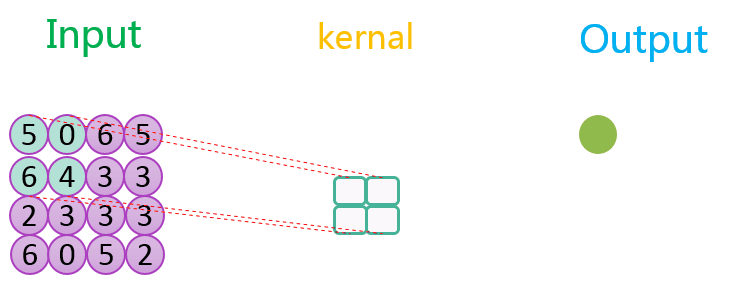

><font color=#0000FF face="微软雅黑" size=4>Talk is cheap, explain me the Paper.</font>

## 一、引言
&emsp;&emsp;设计深度学习模型的时候，不管是自己从头搭建还是修改别人的，都离不开相关参数的计算，主要是输入图形先后经过卷积、池化层后输出尺寸的变化，尤其是涉及多个卷积或池化层时，如果对这两种操作的原理不清楚，就会对网络的各个参数产生困惑，不知道如何去修改以便适配自己的业务场景。
&emsp;&emsp;这里对CNN（卷积神经网络）中的主要参数的计算做一个归纳整理，方便参考。我们先用图示的方式给出这两种操作的运行过程，最后再归纳出数学公式。
&emsp;&emsp;注意：本文主要是结合Tensorflow来讲的，不同的平台会有所差异。


## 二、术语解释
&emsp;&emsp;CNN网络的主要参数有下面这么几个：
 - 卷积核Kernal（在Tensorflow中称为filter）；
 - 填充Padding；
 - 滑动步长Strides；
 - 池化核Kernal（在Tensorflow中称为filter）；
 - 通道数Channels。

### 2.1 卷积核
&emsp;&emsp;顾名思义，卷积核是在进行[卷积](https://en.wikipedia.org/wiki/Cross-correlation)操作的时候使用的，在Tensorflow中，被称为filter，通过一个四元列表传递。文档中对该参数的说明如下：

```python
"""
filter: A `Tensor`. Must have the same type as `input`.
A 4-D tensor of shape
`[filter_height, filter_width, in_channels, out_channels]`
"""
# 定义一个大小为3*2，输入channel为3，输出channel为64的filter
conv_kernal = [3, 2, 3, 64]
```

&emsp;&emsp;卷积核的示意图如下图中间部分（这里的卷积核大小为3*3）所示：


<center> 图2-1　　卷积核示意图 </center>

&emsp;&emsp;由上图可知，卷积这一步的操作，实际上是在输入数据上取与卷积核大小相同的矩阵，然后与卷积核矩阵进行[哈达马达乘积](https://en.wikipedia.org/wiki/Hadamard_product_(matrices))，然后求这个乘积矩阵所有元素的和，作为**卷积**的结果。

&emsp;&emsp;需要说明的是，这里的**卷积**跟我们信号与系统里面的卷积有所差异。

&emsp;&emsp;上面提到的通道数（in_channels、out_channels）实际上就是我们的feature_map的数量。因为不同的卷积核卷积出来的feature_map是不一样的，**因此有多少个out_channels，就有多少个不同的卷积核**。关于这点，会在后边的通道参数里面解释。

&emsp;&emsp;对于直接与输入层连接的卷积层来说，输入通道数in_channels，图片通常为3（因为包含R、G、B三色矩阵），文本则通常为1。

### 2.2 填充
&emsp;&emsp;填充在**卷积**和**池化**这两个操作里面都可能会用到，填充的作用主要是尽可能充分的保留和使用输入特征（如果不使用填充，网络层数越深，所丢失的边缘数据就越多，到最后可能无特征可用），同时也应注意填充的尺寸不宜过大，避免引入过多无用的数据。
&emsp;&emsp;关于填充作用的说明还可以参考知乎上的[这篇文章](https://zhuanlan.zhihu.com/p/36278093)。Tensorflow中的填充只有两种类型，说明如下：

```python
"""
padding: A `string` from: `"SAME", "VALID"`.
         The type of padding algorithm to use.
"""
# VALID 对应的是不填充，即不做任何处理。
# SAME  这种填充方式在strides=1的情况下，使得输出能够保持和输入尺寸一致。
```
&emsp;&emsp;Theano中的填充则有**不填充、半填充、全填充**[三种](http://deeplearning.net/software/theano/tutorial/conv_arithmetic.html)，它的半填充对应Tensorflow的`SAME`。

&emsp;&emsp;`SAME`类型以`0`进行填充的示意图如下：

<center> 图2-2　　'SAME'类型填零示意图 </center>

&emsp;&emsp;可以看到，这个操作实际上是在原始数据外面`包裹`了一层填充数据。


### 2.3 滑动步长
&emsp;&emsp;滑动步长决定了在卷积或者池化的过程中，每次操作后移动的步数。在Tensorflow中，该参数也是一个四元列表，关于该参数的解释如下：

```python
"""
strides: A list of `ints`.
  1-D tensor of length 4.  The stride of the sliding window for each
  dimension of `input`. The dimension order is determined by the value of `data_format`, see below for details.
  strides = [batch, height, width, channels]
"""
# 定义一个不跳过任何样本、不跳过任何颜色通道，垂直方向步长为2，水平方向步长为2的strides
strides = [1, 2, 2, 1]
```

&emsp;&emsp;它的第2、3个参数分别对应在数据垂直和水平方向上的滑动步长。第1个参数表示在样本上的跳跃幅度，**一般都是置为1（表示不会跳过任何样本）**。第4个参数表示在通道上的跳跃幅度，**通常也是置为1**。更详细的可参见[Stackoverflow上的讨论](https://stackoverflow.com/questions/34642595/tensorflow-strides-argument)以及[该博客](https://blog.csdn.net/lanchunhui/article/details/61615714)。

&emsp;&emsp;卷积过程中的滑动过程示意如下：

<center> 图2-3　　步长为1时的滑动示意图 </center>

&emsp;&emsp;由上图可知，卷积核在输入数据上的操作顺序是先沿着水平方向，再沿着垂直方向。因为水平方向上步长为1，所以卷积核在水平方向上每操作一次，就往右移动一格，再进行下一次操作。当水平方向上操作完了以后，就回到最左边，在垂直方向向下移动一格，然后进行操作，如此往复循环，直到所有数据均处理完。

<font color="red">&emsp;&emsp;此外需要说明的是，由于卷积核中值为0的部分对最终的结果没有任何贡献，因此在动图中卷积的时候没有高亮（黄色）显示，并不代表它们没有参与卷积。另外输入和卷积核的元素可以是任意值（上图只是为方便举的简单例子）。</font>

&emsp;&emsp;如果你**把卷积核看做单反的取景框，把输入数据当作我们的风景**，卷积核在输入上的移动过程就类似于我们拍全景照的过程，从左往右，从上往下。

&emsp;&emsp;我们再来看看水平、垂直方向上滑动步长均为2并且使用了`SAME`方式填充的情况，如下图所示：

<center> 图2-4　　步长为2时的滑动示意图 </center>

&emsp;&emsp;由上图可知，其操作流程与步长为1时并没有区别，只不过每次沿水平/垂直方向挪动的步长为2。另外不太一样的地方是，对于有填充的数据，卷积核的`取景`（取值）范围不会超出填充数据（第一行最后一次移动）。

### 2.4 池化核
&emsp;&emsp;池化核则是在进行池化操作时候的Kernal，池化的作用类似于[PCA](https://en.wikipedia.org/wiki/Principal_component_analysis)，可以有效的对数据降维同时保留关键特征。常用的池化核有如下几种类型：
- 最大池化核，取池化数据（`取景`框取出来的所有数据）的最大值；
- 平均池化核，取池化数据的平均值；
- 最小池化核，取池化数据的最小值；
- L2池化核，取池化数据的L2范数；

&emsp;&emsp;下图分别展示了步长分别为1、2时的最大池化过程：

<center> 图2-5　　步长为1时的最大池化示意图 </center>


<center> 图2-6　　步长为2时的最大池化示意图 </center>


&emsp;&emsp;关于池化的作用可参考[该CSDN博客](https://blog.csdn.net/u010402786/article/details/51541465)。

### 2.5 通道数
&emsp;&emsp;从上面的介绍我们可以看出，对于同一个输入矩阵，改变卷积核的元素值，将会产生不同的输出。因此，卷积核的数量决定了卷积操作之后生成的**feature map（卷积核在输入上卷积后的输出矩阵我们称为feature map）**数量。

&emsp;&emsp;对于CNN来说，其隐藏层部分，上一层的卷积核（即为该层的输出通道数out_channels）数量决定了下一层的输入通道数(in_channels)。输入层部分，输入的类型决定了第一个隐藏层的输入通道数。对于图片数据来说，会拆分成**3**个输入矩阵，分别对应**RGB**三原色，如下图所示：


<center> 图2-7　　彩色图片三通道示意图（图片摘自[网络](https://www.dpreview.com/forums/post/58158483)） </center>


<center> 图2-8　　彩色图片三通道输入矩阵示意图（图片摘自[网络博客](http://www.cnblogs.com/ranjiewen/p/7868372.html) ）</center>

&emsp;&emsp;当然图片如果是以**CMYK**格式存储的，那么输入通道数就会变成**4**个。而对于文本类的输入，其通道数则只有**1**个。当然，也可以通过reshape操作后把文本输入变成3通道的数据（将文本数据模拟成图像，360曾经把网络流量转换成黑白图片，并用来训练DNN模型，从而判别是否包含恶意数据，这个想法真的是非常有创意。详见[这里](http://www.infoq.com/cn/articles/deep-learning-and-app-flow-identification)）。

&emsp;&emsp;总之，数据是死的，人脑是活的，怎么玩，就靠你自己去发挥想象力了。下图是步长为2，卷积核数量为2上的卷积过程示意图：


<center> 图2-9　　步长为2、卷积核数量为2无填充情况的卷积示意图 </center>

## 三、参数计算
&emsp;&emsp;主要有两个部分的参数需要计算，一个是卷积后的尺寸，另一个是池化后的尺寸。先看一些具体的比较简单的例子，方便去数。最后再给出通用的计算公式。

### 3.1 卷积后的尺寸
#### 3.1.1 无填充、步长为1
&emsp;&emsp;整个过程如下所示：

<center> 图3-1　　无填充步长为1卷积示意图 </center>

&emsp;&emsp;如上图所示，相关数据如下表所示：

| 输入通道数</br>（个）| 输入尺寸</br>（高*宽） | 卷积核数量</br>（个） | 卷积核尺寸</br>（高*宽） | 步长</br>（步） | 输出通道数</br>（个） | 输出尺寸</br>（高*宽） | 填充 |
| :--: | :--: | :--: | :--: | :--: | :--: | :--: | :--: |
| 1 | 6 * 6 | 1 | 3 * 3 | 1 | 1 | 4 * 4| **VALID** |

#### 3.1.2 无填充、步长为2
&emsp;&emsp;整个过程如下所示：

<center> 图3-2　　无填充步长为2卷积示意图 </center>

&emsp;&emsp;如上图所示，相关数据如下表所示：

| 输入通道数</br>（个）| 输入尺寸</br>（高*宽） | 卷积核数量</br>（个） | 卷积核尺寸</br>（高*宽） | 步长</br>（步） | 输出通道数</br>（个） | 输出尺寸</br>（高*宽） | 填充 |
| :--: | :--: | :--: | :--: | :--: | :--: | :--: | :--: |
| 1 | 6 * 6 | 1 | 3 * 3 | 2 | 1 | 2 * 2| **VALID** |

&emsp;&emsp;由上述两图、表可知，除卷积核大小外其它所有条件都不变的情况下，第二种情况相较于第一种情况，其输出的尺寸缩小了$\frac{2}{4} * \frac{2}{4} = \frac{1}{4}$，高、宽各自方向上则缩小了$\frac{2}{4} = \frac{1}{2}$。

#### 3.1.3 有填充、步长为2
&emsp;&emsp;整个过程如下所示：

<center> 图3-3　　有填充步长为2卷积示意图 </center>

&emsp;&emsp;如上图所示，相关数据如下表所示：

| 输入通道数</br>（个）| 输入尺寸</br>（高*宽） | 卷积核数量</br>（个） | 卷积核尺寸</br>（高*宽） | 步长</br>（步） | 输出通道数</br>（个） | 输出尺寸</br>（高*宽） | 填充 |
| :--: | :--: | :--: | :--: | :--: | :--: | :--: | :--: |
| 1 | 6 * 6 | 1 | 3 * 3 | 2 | 1 | 3 * 3| **SAME(8*8)** |

### 3.2 池化后的尺寸
#### 3.2.1 无填充、步长为1
&emsp;&emsp;整个过程如下所示：

<center> 图3-4　　无填充步长为1池化示意图 </center>

&emsp;&emsp;如上图所示，相关数据如下表所示：

| 输入通道数</br>（个）| 输入尺寸</br>（高*宽） | 池化核数量</br>（个） | 池化核尺寸</br>（高*宽） | 步长</br>（步） | 输出通道数</br>（个） | 输出尺寸</br>（高*宽） | 填充 |
| :--: | :--: | :--: | :--: | :--: | :--: | :--: | :--: |
| 1 | 4 * 4 | 1 | 2 * 2 | 1 | 1 | 3 * 3| **VALID** |

#### 3.2.2 无填充、步长为2
&emsp;&emsp;整个过程如下所示：

<center> 图3-5　　无填充步长为2池化示意图 </center>

&emsp;&emsp;如上图所示，相关数据如下表所示：

| 输入通道数</br>（个）| 输入尺寸</br>（高*宽） | 池化核数量</br>（个） | 池化核尺寸</br>（高*宽） | 步长</br>（步） | 输出通道数</br>（个） | 输出尺寸</br>（高*宽） | 填充 |
| :--: | :--: | :--: | :--: | :--: | :--: | :--: | :--: |
| 1 | 4 * 4 | 1 | 2 * 2 | 2 | 1 | 2 * 2| **VALID** |

#### 3.2.3 有填充、步长为2
&emsp;&emsp;整个过程如下所示：

<center> 图3-6　　有填充步长为2池化示意图 </center>

&emsp;&emsp;如上图所示，相关数据如下表所示：

| 输入通道数</br>（个）| 输入尺寸</br>（高*宽） | 池化核数量</br>（个） | 池化核尺寸</br>（高*宽） | 步长</br>（步） | 输出通道数</br>（个） | 输出尺寸</br>（高*宽） | 填充 |
| :--: | :--: | :--: | :--: | :--: | :--: | :--: | :--: |
| 1 | 4 * 4 | 1 | 2 * 2 | 2 | 1 | 3 * 3| **SAME(8*8)** |

### 3.3 计算公式
&emsp;&emsp;卷积后的参数无非就三个，通道数、高、宽。其中通道数不用计算，就等于卷积核数量。为方便叙述，记：
 - $H_{in}$，输入矩阵行数（像素高度）；
 - $H_{out}$，输出矩阵行数（像素高度）；
 - $W_{in}$，输入矩阵列数（像素宽度）；
 - $W_{out}$，输出矩阵列数（像素宽度）；
 - $H_{ker}$，卷积/池化核矩阵行数（高度）；
 - $W_{ker}$，卷积/池化核矩阵列数（宽度）；
 - $CH_{in}$，输入通道数；
 - $CH_{out}$，输出通道数；
 - $S$，步长；
 - $K$,卷积/池化核数量；
 - $P$，填充数量（**VALID**时为0，**SAME**时为1）；
 -  $\left \lceil \quad \right \rceil$，向上取整（等价于Python中的math.ceil()函数）；

#### 3.3.1 卷积部分推导
&emsp;&emsp;给定相关参数后，设卷积核在水平、垂直方向分别可以**有效移动（对有填充情况，超出填充部分则该次移动无效。无填充情况，超出输入数据则移动无效。）$m、n$次**，则有：

##### 3.3.1.1 水平方向
&emsp;&emsp;移动情况如下所示：

<center> 图3-4　　水平方向移动示意图 </center>

&emsp;&emsp;由图有：

$$
m \cdot S + H_{ker} \leq H_{in} + 2 \cdot P  \\\\
\tag{3 - 1}
$$

&emsp;&emsp;可求得：

$$
m \leq \frac{(H_{in} + 2 \cdot P - H_{ker})}{S} \\\\
\tag{3 - 2}
$$

&emsp;&emsp;而$H_{out}$就是我们最大的滑动次数，即：

$$
H_{out} = m_{max} + 1= \left \lfloor \frac{(H_{in} + 2 \cdot P - H_{ker})}{S} \right \rfloor + 1= \frac{(H_{in} + 2 \cdot P - H_{ker})}{S} + 1\\\\
\tag{3 - 3}
$$

&emsp;&emsp;注意：上式中$m_{max}$还要加1，因为第0次滑动的时候，也是做了卷积操作的。对应的文字版公式为：

$$
输出宽度 = \frac{(输入宽度 + 2 \cdot 填充宽度 - 卷积核宽度)}{步长} + 1\\\\
\tag{3 - 4}
$$

##### 3.3.1.2 垂直方向
&emsp;&emsp;垂直方向的推导与水平方向一致，只不过换了个方向而已，在此不赘述，直接给出其计算公式如下：

$$
W_{out} = n_{max} + 1= \left \lfloor \frac{(W_{in} + 2 \cdot P - W_{ker})}{S} \right \rfloor + 1= \frac{(W_{in} + 2 \cdot P - W_{ker})}{S} + 1\\\\
\tag{3 - 5}
$$

&emsp;&emsp;对应的文字版公式为：

$$
输出高度 = \frac{(输入高度 + 2 \cdot 填充高度 - 卷积核高度)}{步长} + 1\\\\
\tag{3 - 6}
$$

##### 3.3.1.3 结论
&emsp;&emsp;综上，再加入输出通道数，有卷积操作后输出的尺寸的计算公式如下：

$$
\begin{cases}
\begin{split}
H_{out} &= \left \lfloor \frac{(H_{in} + 2 \cdot P - H_{ker})}{S} \right \rfloor + 1= \frac{(H_{in} + 2 \cdot P - H_{ker})}{S} + 1\\\\
W_{out} &= \left \lfloor \frac{(W_{in} + 2 \cdot P - W_{ker})}{S} \right \rfloor + 1= \frac{(W_{in} + 2 \cdot P - W_{ker})}{S} + 1 \\\\
CH_{out} &= K
\end{split}
\end{cases}
\tag{3 - 7}
$$

&emsp;&emsp;对应的文字版公式为：

$$
\begin{cases}
\begin{split}
输出宽度 &= \frac{(输入宽度 + 2 \cdot 填充宽度 - 卷积核宽度)}{步长} + 1\\\\
输出高度 &= \frac{(输入高度 + 2 \cdot 填充高度 - 卷积核高度)}{步长} + 1 \\\\
输出通道数 &= 卷积核数量
\end{split}
\end{cases}
\tag{3 - 8}
$$

&emsp;&emsp;如果有疑问，可以把前面的例子拿来验证。Tensorflow中关于这部分的说明参考[官方文档](https://www.tensorflow.org/api_guides/python/nn#Convolution)。

#### 3.3.2 池化部分推导
&emsp;&emsp;池化部分因为工作原理和卷积部分基本上是一样的，所以其公式推导也并没有什么不同，有一点需要指出的是，**池化部分仍然可以有填充**。池化部分的推导这里就不再赘述。

#### 3.3.3 小结
##### 3.3.3.1 公式整合
&emsp;&emsp;综上，整理出卷积/池化参数的通用计算公式如下：

$$
\begin{cases}
\begin{split}
H_{out} &= \left \lfloor \frac{(H_{in} + 2 \cdot P - H_{ker})}{S} \right \rfloor + 1= \frac{(H_{in} + 2 \cdot P - H_{ker})}{S} + 1\\\\
W_{out} &= \left \lfloor \frac{(W_{in} + 2 \cdot P - W_{ker})}{S} \right \rfloor + 1= \frac{(W_{in} + 2 \cdot P - W_{ker})}{S} + 1 \\\\
CH_{out} &= K
\end{split}
\end{cases}
\tag{3 - 9}
$$

&emsp;&emsp;对应的文字版公式为：

$$
\begin{cases}
\begin{split}
输出宽度 &= \frac{(输入宽度 + 2 \cdot 填充宽度 - 卷积/池化核宽度)}{步长} + 1\\\\
输出高度 &= \frac{(输入高度 + 2 \cdot 填充高度 - 卷积/池化核高度)}{步长} + 1 \\\\
输出通道数 &= 卷积/池化核数量
\end{split}
\end{cases}
\tag{3 - 10}
$$

&emsp;&emsp;<font color="red">使用式（3-9）最右边的表达式计算时一定要注意，这种表达不是特别严谨，这样写是为了兼容网络上的一些博客的写法，分式结果要记得向下取整。</font>

##### 3.3.3.2 参考资料
&emsp;&emsp;大部分参考的文献资料都在相应位置给出了，剩下还有些参考的资料罗列如下：
- [神经网络之LeNet结构分析及参数详解](https://blog.csdn.net/Genius_zz/article/details/52804585)；
- [CS231N](http://cs231n.stanford.edu/slides/2016/winter1516_lecture7.pdf)；
- [CNN参数个数和连接个数计算](http://www.cnblogs.com/ooon/p/5415888.html)；
- [CNN中的参数与计算量](https://blog.csdn.net/dzkd1768/article/details/72763659)；
- [卷积神经网络的卷积核大小、卷积层数、每层map个数都是如何确定下来的呢？](https://www.zhihu.com/question/38098038)；
- [AlexNet Paper](https://www.nvidia.cn/content/tesla/pdf/machine-learning/imagenet-classification-with-deep-convolutional-nn.pdf)；

### 3.4 示例
&emsp;&emsp;举几个例子来验证下。

#### 3.4.1 示例1
&emsp;&emsp;该例子是[牛客网](https://www.nowcoder.com/questionTerminal/b831a67809fa4ba19d8cf9ed98ff6a21)上题库中的一个题，试题如下：

>&emsp;&emsp;输入图片大小为200×200，依次经过一层卷积（kernel size 5×5，padding 1，stride 2），pooling（kernel size 3×3，padding 0，stride 1），又一层卷积（kernel size 3×3，padding 1，stride 1）之后，输出特征图大小为：
A. 95
B. 96
C. 97
D. 98
E. 99
F. 100
答案： C

&emsp;&emsp;可以看出，该网络隐藏层共有3层（2层卷积，1层池化），再加上输入、输出层，该网络是一个5层的NN。

&emsp;&emsp;对第一层卷积层，我们有$H_{in} = W\_{in} = 200, \ H_{ker} = W\_{ker}  =5, \ S = 2, \ P = 1, \ K = ?$，则根据公式（3-9）有：

$$
\begin{cases}
\begin{split}
H_{out} &= \left \lfloor \frac{(H_{in} + 2 \cdot P - H_{ker})}{S} \right \rfloor + 1 = \left \lfloor \frac{(200 + 2 \times 1 - 5)}{2} \right \rfloor + 1 = 99\\\\
W_{out} &= \left \lfloor \frac{(H_{in} + 2 \cdot P - H_{ker})}{S} \right \rfloor + 1 = \left \lfloor \frac{(200 + 2 \times 1 - 5)}{2} \right \rfloor + 1 = 99
\end{split}
\end{cases}
\tag{3 - 11}
$$

&emsp;&emsp;对第二层池化层，同理我们有$H_{in} = W\_{in} = 99, \ H_{ker} = W\_{ker}  =3, \ S = 1, \ P = 0, \ K = ?$，则有：

$$
\begin{cases}
\begin{split}
H_{out} &= \left \lfloor \frac{(99 + 2 \times 0 - 3)}{1} \right \rfloor + 1 = 97\\\\
W_{out} &= \left \lfloor \frac{(99 + 2 \times 0 - 3)}{1} \right \rfloor + 1 = 97
\end{split}
\end{cases}
\tag{3 - 12}
$$

&emsp;&emsp;对第三层池化层，同理我们有$H_{in} = W\_{in} = 97, \ H_{ker} = W\_{ker}  =3, \ S = 1, \ P = 1, \ K = ?$，则有：

$$
\begin{cases}
\begin{split}
H_{out} &= \left \lfloor \frac{(97 + 2 \times 1 - 3)}{1} \right \rfloor + 1 = 97\\\\
W_{out} &= \left \lfloor \frac{(97 + 2 \times 1 - 3)}{1} \right \rfloor + 1 = 97
\end{split}
\end{cases}
\tag{3 - 13}
$$

#### 3.4.2 示例2
&emsp;&emsp;该例子是经典的[LeNet-5](http://www.dengfanxin.cn/wp-content/uploads/2016/03/1998Lecun.pdf)，网络结构如下图所示：


<center> 图3-5　　LeNet-5网络结构图（图片摘自[Paper](http://www.dengfanxin.cn/wp-content/uploads/2016/03/1998Lecun.pdf)） </center>

&emsp;&emsp;其网络参数参考下图（**卷积核大小均为5\*5，步长1。池化核大小均为2\*2，步长为2，通道数不定。**）：

| 层数| 层类型 | 对应名称 | 相关参数|
| :--: | :--: | :--: | :--: |
| 1 | 输入层 | INPUT | 输入尺寸 32 \* 32 \* 1 |
| 2 | 第1个卷积层 | C1 | 卷积核尺寸 5 \* 5 \* 6, 步长 1, 填充 **VALID** |
| 3 | 第1个池化层 | S2 |池化核尺寸 2 \* 2 \* 6, 步长 2, 填充 **VALID** |
| 4 | 第2个卷积层 | C3 | 卷积核尺寸 5 \* 5 \* 16, 步长 1, 填充 **VALID** |
| 5 | 第2个池化层 | S4 | 池化核尺寸 2 \* 2 \* 16, 步长 2, 填充 **VALID** |
| 6 | 第3个卷积层 | C5 | 卷积核尺寸 5 \* 5 \* 120, 步长 1, 填充 **VALID** |
| 7 | 第1个全连接层 | F6 | 压扁为84个神经元 |
| 8 | 输出层 | OUTPUT | 10种分类 |

&emsp;&emsp;第1个卷积层C1，有：

$$
W_{out} = H_{out} = \left \lfloor \frac{(32 + 2 \times 0 - 5)}{1} \right \rfloor + 1 = 28
\tag{3 - 14}
$$

&emsp;&emsp;第1个池化层S2，有：

$$
W_{out} = H_{out} = \left \lfloor \frac{(28 + 2 \times 0 - 2)}{2} \right \rfloor + 1 = 14
\tag{3 - 15}
$$

&emsp;&emsp;第2个卷积层C3，有：

$$
W_{out} = H_{out} = \left \lfloor \frac{(14 + 2 \times 0 - 5)}{1} \right \rfloor + 1 = 10
\tag{3 - 16}
$$

&emsp;&emsp;第2个池化层S4，有：

$$
W_{out} = H_{out} = \left \lfloor \frac{(10 + 2 \times 0 - 2)}{2} \right \rfloor + 1 = 5
\tag{3 - 17}
$$

&emsp;&emsp;第2个池化层S4，有：

$$
W_{out} = H_{out} = \left \lfloor \frac{(10 + 2 \times 0 - 2)}{2} \right \rfloor + 1 = 5
\tag{3 - 18}
$$

&emsp;&emsp;第3个卷积层C5，有：

$$
W_{out} = H_{out} = \left \lfloor \frac{(5 + 2 \times 0 - 5)}{1} \right \rfloor + 1 = 1
\tag{3 - 19}
$$

&emsp;&emsp;第1个全连接层F6（全连接层没有卷积/池化操作），有：

$$
\begin{cases}
\begin{split}
H_{out} &= 1 \\\\
W_{out} &= 84
\end{split}
\end{cases}
\tag{3 - 20}
$$

&emsp;&emsp;所有结果计算出来都与原始Paper吻合，证明我们的公式是准确无误的。