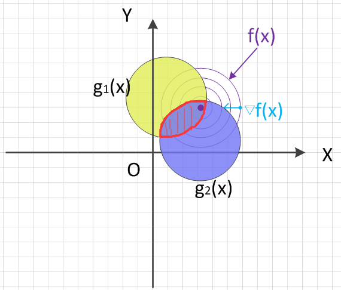
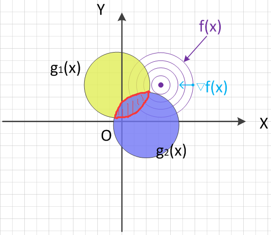

>Lagrange multiplier.

### 1. 概述
#### 1.1 优化问题
&emsp;&emsp;**生**活中总是存在着各种各样的最优化问题，比如出行的时候，不坐地铁的情况下（地铁贵啊！）如何坐车时间最省。工作上时间一定的情况下，如何安排任务能最快的完成。这些问题就是数学里面的约束最优化问题，按照约束类型和约束条件的不同，可以分成以下三大类：
<!--  more -->
&emsp;&emsp;1、零约束（无约束）最优化；
$$
\min \limits\_{} { f(x) } \ \ or \ \ \max \limits\_{} { f(x) } 
$$

&emsp;&emsp;2、一个及以上**等式约束**最优化（其中$h\_i(x)$表示第i个约束条件）；
$$
\min \limits\_{} { f(x) } \ \ or \ \ \max \limits\_{} { f(x) } \\\\
s.t \ \ h_i(x) = 0，i = 1, 2, ···, n
$$

&emsp;&emsp;3、一个及以上**不等式约束**最优化（同时还可以有等式约束）；
$$
\min \limits\_{} { f(x) } \ \ or \ \ \max \limits\_{} { f(x) } \\\\
\begin{split}
\textbf{s.t}\ \ h_i(x) & \geq 0（或h_i(x) \leq 0），i = 1，2，···，n \\\\
g_j(x) &= 0，j = 0，1，···，m
\end{split}
$$

#### 1.2 本文约定
&emsp;&emsp;为了叙述方便，我们仅对两种最优化问题（最大或最小）中的一种进行探讨，另一种其证明过程和原理是完全相同的，如无特殊说明，下文中的最优化问题都是指对目标函数求**最小值**，即：
$$
\min \limits\_{} { f(x) }
$$
#### 1.3 优化求解
&emsp;&emsp;针对以上三种优化问题，对应的求解方法如下：
##### 1.3.1 Fermat引理
&emsp;&emsp;对于第一种情况（零约束优化），高数里面我们就学过，通过求解函数的偏导数（partial derivative）并令其为零，即对函数$f(x\_1, x\_2, ..., x\_n)$，分别另$\frac{\partial f}{\partial x\_i} = 0$即可求得函数的所有**极值点**，再结合Fermat引理：

- $f''(x_0) < 0，x_0为极大值$；
- $f''(x_0) > 0，x_0为极小值$；
- $f''(x_0) = 0，无法判断（可改用列表法）$。

&emsp;&emsp;即可求出最值。

##### 1.3.2 Lagrange Multiplier
&emsp;&emsp;对于第二种情况（带等式约束优化），实际上在高中的时候我们就学过，通过增加拉格朗日系数，构造出拉格朗日函数，并对各个变量求偏导后令其为零并结合约束方程联解方程组，从而求解出各个变量的候选解集，最后回代并验证这些解集，最后求出最优值。这种方法就是广为人知的拉格朗日乘子法（Lagrange Multiplier）！
&emsp;&emsp;举例来说，对含$m$个等式约束$h_i(x) = 0，i = 1, 2, ···, m$的$n$元目标函数$f(x_1, x_2, ..., x_n)$，其拉格朗日函数为：

$$
L(x,\alpha) = f(x) + { \sum\_{i=1}^m \alpha\_i  h\_i(x) }
$$

&emsp;&emsp;对$n$个**优化变量$x_i$**分别求偏导后等于零的等式以及原约束条件等式组成的方程组为：

$$
\begin{cases}
\begin{split}
\frac {\partial L} {\partial x_1} = 0 \\\\
··· \ ··· \\\\
\frac {\partial L} {\partial x_n} = 0 \\\\
h_1(x) = 0 \\\\
··· \ ···\\\\
h_m(x) = 0 \\\\
\end{split}
\end{cases}
$$

&emsp;&emsp;上述方程组一共有$m + n$个待求解变量（$m$个$\alpha\_i$，$n$个$x_i$），也有$m + n$个方程，于是便能解出$\alpha\_i、x_i$，也就求出了所有可能的极值点。
&emsp;&emsp;实际上，含等式约束的最优化问题可以转换为不含等式约束的最优化问题。**因为约束条件$h_i(x)=0$等于拉格朗日函数$L(x,\alpha)$对第$i$个拉格朗日乘子$\alpha\_i$的偏导数！**即有：

$$
h_i(x) = \frac {\partial L(x, \alpha)} {\partial \alpha_i}
$$

&emsp;&emsp;我们把拉格朗日乘子扩展为目标函数的**优化变量**：

$$
f(x_1, x_2, ..., x_n) \ ==> \ f(x_1, x_2, ..., x_n, \alpha_1, ..., \alpha_m)
$$

&emsp;&emsp;这样等式约束的优化问题的求解就和**`1.3.1`**节中不带等式约束的优化问题一模一样了！**带不等式约束的优化问题同样可以转换为不带约束的优化问题**，这个下面会讲。
&emsp;&emsp;有时候只需要稍稍改变一下视角，你就能看到一个全新的世界。
##### 1.3.3 Lagrange Multiplier + KKT Conditions
&emsp;&emsp;对于第三种情况（带不等式约束优化），可能大多数非数学专业的同学都没有接触过，需要结合KKT（Karush–Kuhn–Tucker conditions）条件（KKT Conditions）来求解，这里就涉及到一个新的概念——KKT条件。为了更方便排版叙述，下面新开一个小节来说说这个KKT条件。

#### 1.4 KKT条件
##### 1.4.1 概述
&emsp;&emsp;KKT条件的全称是Karush–Kuhn–Tucker  conditions(也称Kuhn–Tucker conditions)，多应用于数学中的优化问题（非线性最优化）。
&emsp;&emsp;KKT条件的作用就在于：它给出了判断优化问题中某个解$x^\*$是否为最优解的**必要条件！**
&emsp;&emsp;考虑如下的非线性（带不等式约束）最优化问题：

$$
\begin{split}
目标&函数：f(x) \\\\
约束&条件： \\\\
\ \ &g_i(x) \leq 0 \\\\
\ \ &h_j(x) = 0
\end{split}
$$

&emsp;&emsp;其最优解$x^\*$，其必然满足如下的必要条件：

##### 1.4.2 Stationarity
&emsp;&emsp;KKT条件的Stationarity（即平稳性）从最大化和最小化两个优化方向来说，对应如下的式子：
$$
\begin{cases}
最大化f(x)：\nabla f(x^\*) = { \sum\_{i=1}^m \mu\_i \nabla g\_i(x^\*)  + \sum\_{j=1}^l \lambda\_j \nabla h\_j(x^\*) }  \\\\
\\\\
\ 最小化f(x)：-\nabla f(x^\*) = { \sum\_{i=1}^m \mu\_i \nabla g\_i(x^\*)  + \sum\_{j=1}^l \lambda\_j \nabla h\_j(x^\*) }  \\\\
\tag{1 - 1}
\end{cases}
$$

##### 1.4.3 Primal feasibility
&emsp;&emsp;KKT条件的Primal feasibility（原始可行性）是指原始问题的约束条件：
$$
\begin{cases}
\begin{split}
g_i(x^\*) & \leq 0，i = 1，···，m\\\\
h_j(x^\*) &= 0，j = 1，···，l
\end{split}
\tag{1 - 2}
\end{cases}
$$

##### 1.4.4 Dual feasibility
&emsp;&emsp;KKT条件的Dual feasibility（对偶可行性）是指不等式约束条件的拉格朗日乘数应满足条件： 

$$
\mu_i \geq 0 ，i = 1，···，m
\tag{1 - 3}
$$

##### 1.4.5 Complementary slackness
&emsp;&emsp;KKT条件的Complementary slackness（互补松弛）是指如下条件：
$$
\mu_i · g_i(x^\*) = 0 ，i = 1，···，m
\tag{1 - 4}
$$

&emsp;&emsp;上面的$\mu_i、\lambda_j$均称为拉格朗日乘子，**当KKT条件中的$m=0$时，即退化为拉格朗日条件**。
##### 1.4.6 条件整合
&emsp;&emsp;将上述条件整合起来(**求最小化**）就有KKT条件的定义：

$$
\begin{cases}
\begin{split}
-\nabla f(x) &= { \sum\_{i=1}^m \mu\_i \nabla g\_i(x)  + \sum\_{j=1}^l \lambda\_j \nabla h\_j(x) }  \\\\
\mu_i · g_i(x) &= 0 ，i = 1,···，m \\\\
g_i(x) & \leq 0，i = 1, ···, m\\\\
h_j(x) &= 0，j = 1, ···, l \\\\
\mu_i & \geq 0 ，i = 1, ···, m
\end{split}
\end{cases}
$$

&emsp;&emsp;**注意：KKT条件中对等式约束对应的拉格朗日乘子$\lambda \_j$并没有非负性要求！**
#### 1.5 广义拉格朗日函数
##### 1.5.1 表达式
&emsp;&emsp;为了在KKT条件下利用拉格朗日乘子求出最优值，我们需要构造出广义拉格朗日函数(**generalized Lagrange function**)，以上述优化问题为例，其对应的广义拉格朗日函数为：

$$
L(x,\alpha,\beta) = f(x) + { \sum\_{i=1}^k \alpha\_i  g\_i(x) } +  { \sum\_{j=1}^l \beta\_j  h\_j(x) }
\tag{1 - 5}
$$

&emsp;&emsp;式中：

$$
\begin{cases}
\begin{split}
&& \alpha\_i,\beta\_j是拉格朗日乘子; \\\\
&& \alpha\_i \geq 0; 
\end{split}
\end{cases}
$$

##### 1.5.2 极小极大问题
&emsp;&emsp;可以证明（见后文相关部分），若原始问题和对偶问题均存在解，则它们的解是等价的（即有相同的解），上述最优化问题（称为**原始最优化问题**或**原始问题**等价于如下的广义拉格朗日函数的**极小极大问题**：

$$
\min \limits\_{x} {\theta\_P(x)} = \min \limits\_{x} {\max \limits\_{\alpha , \beta : \alpha\_i \geq 0} { L(x , \alpha , \beta) } }
\tag{ 1 - 6}
$$

&emsp;&emsp;这样就把原始最优化问题转换为了广义拉格朗日函数的极小极大问题。同样为了方便叙述，定义原始最优化问题的解为$p^\*$，即有：

$$
p^\* = \min \limits\_{x} {\theta\_P(x)} = \min \limits\_{x} {\max \limits\_{\alpha , \beta : \alpha\_i \geq 0} { L(x , \alpha , \beta) } }
\tag{ 1 - 7}
$$

#### 1.6 对偶问题
##### 1.6.1 定义
&emsp;&emsp;我们记如下广义拉格朗日函数的**极大极大小问题（注意极大、极小两个词语的顺序和1.4节的不同）**为上述最优化问题的对偶问题：

$$
\max \limits\_{\alpha , \beta , \alpha\_i \geq 0} {\theta\_D(\alpha , \beta)} = \max \limits\_{\alpha , \beta , \alpha\_i \geq 0} {\min \limits\_{x} { L(x , \alpha , \beta) } }
\tag{ 1 - 8}
$$

&emsp;&emsp;同时，记上述对偶问题的解为$d^\*$，即有：
$$
d^\* = \max \limits\_{\alpha , \beta , \alpha\_i \geq 0} {\theta\_D(\alpha , \beta)} = \max \limits\_{\alpha , \beta , \alpha\_i \geq 0} {\min \limits\_{x} { L(x , \alpha , \beta) } }
\tag{ 1 - 9}
$$

##### 1.6.2 二者关系
&emsp;&emsp;可以证明（见后文相关部分），若原始问题和对偶问题均存在解，则它们的解是等价的，即有：

$$
p^\* = \min \limits\_{x} {\theta\_P(x)} = \max \limits\_{\alpha , \beta , \alpha\_i \geq 0} {\theta\_D(\alpha , \beta)} = d^\*
\tag{ 1- 10}
$$

### 2. 证明详解
#### 2.1 KKT条件的来源
##### 2.1.1 $\alpha\_i · g\_i(x) = 0$来源
&emsp;&emsp;第1节中我们提到了，KKT条件是用来求解带不等式约束的最优化问题的。那不等式约束的优化问题是如何演变出KKT条件的呢？还是先给出原始问题：

$$
\begin{split}
目标&函数：f(x) \\\\
约束&条件： \\\\
\ \ &g_i(x) \leq 0 \\\\
\ \ &h_j(x) = 0
\end{split}
$$

&emsp;&emsp;因为拉格朗日乘子法只适用于无约束或等式约束的情况，所以对带不等式约束的优化问题如果要应用拉格朗日乘子法，我们就得想办法把不等式转换为等式，转换的方法是引入额外的变量，平衡不等式。
&emsp;&emsp;因为$g_i(x) \leq 0$，所以我们只需要引入一个恒非负的变量$s_i$（称之为**松弛变量**），这里还有个小技巧，为了避免引入额外的约束，引入一个具有天然非负特性的项是比较理想的选择，这里我们使用$s^2\_i，s\_i \in R$来实现。
&emsp;&emsp;引入新变量后，我们有：

$$
g'\_i(x, s\_i) = g\_i(x) + s^2\_i= 0
$$

&emsp;&emsp;由于对任意的$g_i(x) \leq 0$，必能找到对应的$s\_i$使上式成立，因此原不等式约束和新的等式约束的作用是完全等价的，即有：

$$
g_i(x) \leq 0 \ \ <==> \ \ g'\_i(x, s\_i)  = 0
$$

&emsp;&emsp;于是原始不等式约束优化问题可以转化为如下的等式约束问题：

$$
\begin{split}
目标&函数：f(x) \\\\
约束&条件： \\\\
\ \ &g'\_i(x, s\_i)  = 0 \\\\
\ \ &h_j(x) = 0
\end{split}
$$

&emsp;&emsp;这个时候就可以使用拉格朗日乘子法构造拉格朗日函数了：

$$
L(x,s,\alpha,\beta) = f(x) + { \sum\_{i=1}^k \alpha\_i  g'\_i(x, s\_i) } +  { \sum\_{j=1}^l \beta\_j  h\_j(x) }
\tag{2 - 1}
$$

&emsp;&emsp;再按照求约束问题的极值的思路，我们有如下方程组：

$$
\begin{cases}
\begin{split}
\frac {\partial L} {\partial x\_i} &= \frac {\partial f} {\partial x\_i}  + { \sum\_{i=1}^k \alpha\_i  \frac {\partial g'\_i(x, s\_i)} {\partial x\_i} } +  { \sum\_{j=1}^l \beta\_j  \frac {\partial h\_j(x)} {\partial x\_i} } \\\\
\
&= \frac {\partial f} {\partial x\_i}  + { \sum\_{i=1}^k \alpha\_i  \frac {\partial g\_i(x)} {\partial x\_i} } +  { \sum\_{j=1}^l \beta\_j  \frac {\partial h\_j(x)} {\partial x\_i} } = 0\\\\
\
\frac {\partial L} {\partial \alpha\_i} &= g'\_i(x, s\_i) = g\_i(x) + s^2\_i = 0\\\\
\
\frac {\partial L} {\partial \beta\_i} &= h\_i(x) = 0 \\\\\
\
\frac {\partial L} {\partial s\_i} &= \alpha\_i  \frac {\partial g'\_i(x, s\_i)} {\partial s\_i} = 2 \alpha\_i · s_i = 0\\\\\
\end{split}
\tag{2 - 2}
\end{cases}
$$

&emsp;&emsp;利用最后一行的等式来简化上述方程组：
&emsp;&emsp;因为：

$$
2 \alpha\_i · s_i = 0 \\\\
$$

&emsp;&emsp;所以我们有：
&emsp;&emsp;&emsp;&emsp;1.$\alpha\_i =0, \  s_i \neq 0 \ ==> \ g\_i(x) < 0(约束条件不作用于目标函数)$;
&emsp;&emsp;&emsp;&emsp;2.$\alpha\_i \neq 0, \  s_i = 0 \ ==> \ g\_i(x) = 0(约束条件作用于目标函数)$;
&emsp;&emsp;&emsp;&emsp;3.$\alpha\_i =0, \  s_i = 0 \ ==> \ g\_i(x) = 0(约束条件不作用于目标函数)$;
&emsp;&emsp;整合三种情况可得到：

$$
\alpha\_i · g\_i(x) = 0
$$

##### 2.1.2 $\alpha\_i \geq 0$来源
&emsp;&emsp;$\alpha\_i \geq 0$的本质是将移动方向的点的梯度向量限制在由约束条件的梯度向量形成的锥角范围内。这部分的证明稍长，也比较难，下面专门用一小节来证明。
#### 2.2 $\alpha\_i \geq 0$的证明
&emsp;&emsp;要证明$\alpha\_i \geq 0$，需要结合图形来说明。要理解这部分，需要熟悉函数等高线、等值面的含义，这些知识都比较基础，就不多说了，详情可参考相数学教材和资料。

##### 2.2.1 梯度
&emsp;&emsp;梯度是微积分里面多元函数对各个变量求偏导后的表达形式，比如二元函数$f(x,y)的梯度为：grad(x,y)或者\nabla(x,y) =  (\frac {\partial f}{\partial x} , \frac {\partial f} {\partial y})$，梯度的几何意义是：函数**增长最快**的地方。
&emsp;&emsp;梯度向量就是由函数对各个变量求偏导后的值组成的向量，**沿着梯度向量方向$\nabla f(x\_1, x\_2, ... , x\_n)$因为函数增加的最快（山势更陡峭），所以更容易到达函数的最大值处；相反，沿着梯度向量的反方向$-\nabla f(x\_1, x\_2, ... , x\_n)$函数增加的最慢（山势更平缓），则更容易到达函数的极小值处。**

##### 2.2.2 梯度与最优化
&emsp;&emsp;梯度向量的方向由高值等高线指向低值等高线（即由地势低的地方指向地势高的地方）。
&emsp;&emsp;对任意函数$f(x)$，其梯度向量可表示为：

$$
\nabla f(x) =  (\frac {\partial f}{\partial x\_1} , \frac {\partial f} {\partial x\_2}, ···, \frac {\partial f}{\partial x\_k}) ，k \in N^+
\tag{2 - 2}
$$

&emsp;&emsp;以三维坐标系来说，将函数$f(x)$投影到$XOY$平面上（为方便叙述，我们称之为目标区域），并作出其等高线、等高线上某点的梯度如下图所示：

图2-1　　函数等高线投影及梯度示意图
 

&emsp;&emsp;同时，将约束函数$g\_i(x)$也投影到$XOY$平面上（为了让图形简洁明了，我们这里以只绘制两个约束函数，同样的，为方便叙述，我们称为约束区域）。根据投影后约束交叉区域和目标函数全局（在整个定义域上）最优值的关系，我们分两种情况讨论，分别是：包含、不包含。两种情况的映射图如下所示：

图2-2　　约束交叉区域包含全局最优值示意图
 

图2-3　　约束交叉区域不包含全局最优值示意图
 

##### 2.2.3 包含全局最优
&emsp;&emsp;对约束交叉区域包含全局最优的情况（如图2-2所示），这个时候约束相当于不起作用，直接按优化问题的第一种（无约束）求解目标函数$f(x)$的最小值即可。这个时候求出的最优值属于全局最优！
##### 2.2.4 不包含全局最优
&emsp;&emsp;这种情况又要根据约束区域的形状分两种情况来讨论，第一种情况是，约束区域是闭合区域，对应约束函数在$XOY$平面下为下凹的闭口形状，如下图所示：