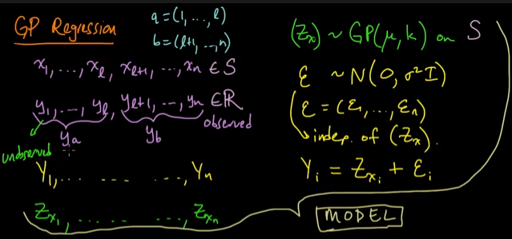
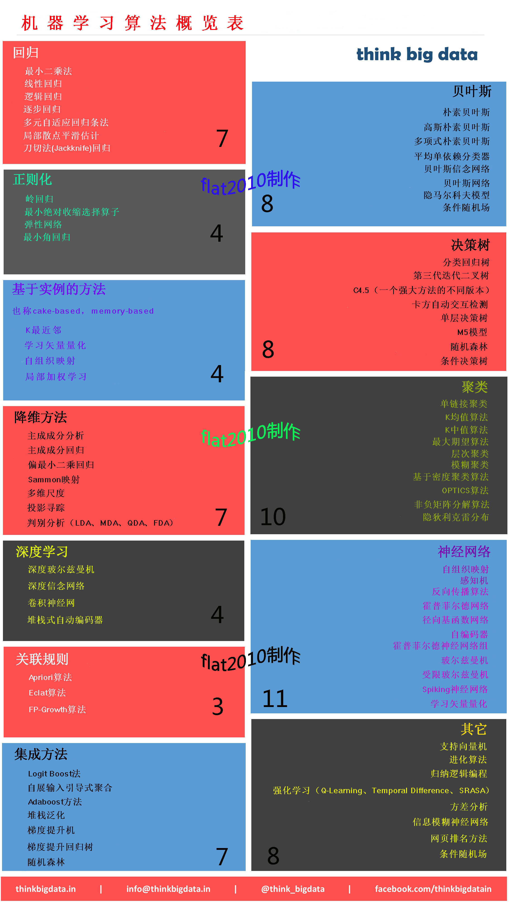

>Machine! Machine! Machine!
***

## 一、前言
### 1.1 发展简史  
&emsp;&emsp;2016的最后一秒（国历）刚刚过去，抢完红包坐在电脑前，忽然心血来潮想要在2017的新的一年，新的一天写点什么，刚好前些日子准备对机器学习的东西做个整理，so，here it is。  
&emsp;&emsp;作为2016互联网的热门关键词汇之一，ML（机器学习）算是出尽了风头。一向盛产黑科技的谷歌，可谓独领风骚。先是其AlphaGo击败了世界顶级围棋起手李世石，后其翻译系统实现了“Zero shot”。而拥有巨大市场优势的百度，则是将其外卖生意做的风生水起，有声有色。先不去吐槽百度了，来简单回顾一下机器学习的发展历程吧。
<!-- more -->

&emsp;&emsp;——1949年Hebb基于神经心理学的学习机制开启了机器学习的第一步，后世称之为“Hebb学习规则”。  
  
&emsp;&emsp;——1950年阿兰·图灵创造了“图灵测试”来判定计算机是否智能。  
  
&emsp;&emsp;——1952年，IBM科学家亚瑟·塞缪尔开发了一个跳棋程序。通过这个程序，塞缪尔驳倒了普罗维登斯提出的机器无法超越人类，像人类一样写代码和学习的模式。  
  
&emsp;&emsp;——1957年，罗森·布拉特设计出了第一个计算机神经网络——**感知机（the perceptron）**，它模拟了人脑的运作方式。  
  
&emsp;&emsp;——1960年，维德罗首次使用Delta学习规则用于感知器的训练步骤。这种方法后来被称为**最小二乘方法**。  
  
&emsp;&emsp;——1967年，**最近邻算法（The nearest neighbor algorithm）出现**，由此计算机可以进行简单的模式识别。  
  
&emsp;&emsp;——1969年，马文·明斯基将感知器兴奋推到最高顶峰。他提出了著名的XOR问题和感知器数据线性不可分的情形。此后，神经网络的研究将处于休眠状态，直到上世纪80年代。  
  
&emsp;&emsp;——**60年代中到70年代末，机器学习的发展步伐几乎处于停滞状态**。  
  
&emsp;&emsp;——1980年，在美国的卡内基梅隆大学(CMU)召开了第一届机器学习国际研讨会，标志着机器学习研究已在全世界兴起。此后，机器归纳学习进入应用。  
  
&emsp;&emsp;——1985年-1986年神经网络研究人员（鲁梅尔哈特，辛顿，威廉姆斯-赫，尼尔森）先后提出了MLP与 BP训练相结合的理念。  
  
&emsp;&emsp;——1986年**昆兰提出“决策树算法”（ID3）**。  
  
&emsp;&emsp;——1990年Schapire 最先构造出一种多项式级的算法（最初的Boosting算法）。  
  
&emsp;&emsp;——1991年Freund提出了一种效率更高Boosting算法。  
  
&emsp;&emsp;——1995年Freund和Schapire改进了Boosting算法,提出了**AdaBoost(Adap tive Boosting)算法**。  
  
&emsp;&emsp;同年，**瓦普尼克和科尔特斯提出支持向量机**。  
  
&emsp;&emsp;——2001年布雷曼博士提出**随机森林（Random Forest）算法**。  
  
&emsp;&emsp;——2006年Hinton提出了神经网络**Deep Learning算法**。  
  
&emsp;&emsp;——同年，机器学习领域的泰斗Hinton和他的学生 Salakhutdinov在顶尖学术刊物《Scince》上发表了一篇文章，开启了深度学习在学术界和工业界的浪潮。  
  
&emsp;&emsp;——2015年，为纪念人工智能概念提出60周年， LeCun、Bengio和Hinton推出了深度学习的联合综述。  
  
&emsp;&emsp;——2016年3月9日下午15点34分，Google的AlphaGo击败韩国世界围棋冠军李世石（九段），称为了人工智能的一个里程碑事件。  
  
&emsp;&emsp;——同年9月，Google翻译系统取得重大突破，实现了“Zero-shot”，再次称为一个里程碑事件。 

&emsp;&emsp;注：以上内容只是一个非常粗略的发展史，更详细的内容请参阅相关资料。

### 1.2 算法概览
&emsp;&emsp;俗话说冰冻三尺非一日之寒，从机器学习曲折而坎坷的发展史可以看出，机器学习领域现在的成就是无数先辈们披荆斩棘，孜孜不倦一手开拓出来的。在此，向他们致以崇高的敬意。在历经半个多世纪的发展后，机器学习领域的算法已经积累了几十种，并且还在不断的发展和完善。这些算法大致可以划分成12大类，下面这张由think big data提供的概览图非常清晰明了的显示了目前应用广泛的机器学习算法及其分类关系，如下图1-1所示： 

图1-1　　现有机器学习算法概览图
   
&emsp;&emsp;为了方便大家阅读，参考网上的一些翻译资料后，我对其进行了汉化和整理，如下图1-2所示： 

图1-2　　现有机器学习算法中文对照图
    
&emsp;&emsp;每张小图的角落标明了该类算法目前共包含多少种，大家可以直观的做一个对比而不用一个个去数啦^--^。小小的感叹一下，光制作这张图，就花了我一个上午的时间，这真是多么庞大的一个家族。贴完这两张图，这个版面已经差不多了，欲知后事如何，且听下回分解——**机器学习算法系列之二：算法概述**。  
&emsp;&emsp;
**flat2010 2017-01-01**</dev>

