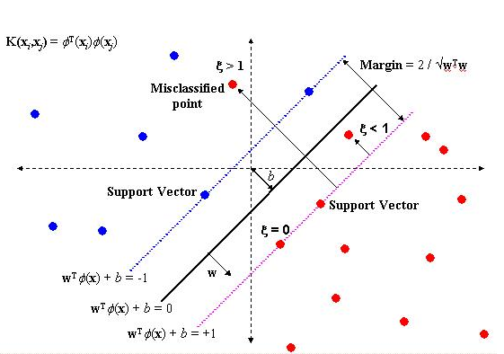
>Give me some data, I can create a new world!
***  

**序**
  

&emsp;&emsp;机器学习算法众多，可以说每一个都是非常经典的。之所以选择先写**SVM（支持向量机）**，一来它是诸多算法中最难懂的之一，二来它是为数不多的把技术上升到了**艺术高度**的算法之一。当你真正理解了SVM背后的那些理论和思想之后，你会为它缜密的逻辑、完美的设计、强大的功能所折服。  

&emsp;&emsp;本文秉持**`机器学习算法系列`**的风格，力求做到逻辑清晰、通俗易懂，让即使是非数学系出身的同学也能彻底理解是本文的终极追求，也是笔者最大的荣幸。本文在写作过程中参阅了大量的资料，包括《支持向量机导论》、《统计学习方法》、《数据挖掘概念与技术》、《Machine Learning》等等，以及大量的网络博客，其中以**`July`**写的[**`理解SVM的三层境界`**](http://www.cnblogs.com/v-July-v/archive/2012/06/01/2539022.html)让我获益最多（July的博文写的非常详细，特别适合像我们这种数学渣），在此向各位大牛致敬。 

&emsp;&emsp;对于各位想要真正理解SVM内幕的同学，我建议在阅读本文的时候准备好纸、笔，跟着文章的思路把涉及的所有数学理论和公式仔细、完整的推演N遍（N视个人情况而定），直到彻底理解（怎样才算彻底理解？这是个好问题！一个很好的检验方法就是，抛开所有资料能在白纸上完整的把SVM推导出来，包括SVM的来龙去脉，所有公式、定理的证明）。是的，攀登高山绝非易事，但是坚持下去，你一定会成为那个站在山顶的人。  

> **`纸上得来终觉浅，绝知此事要躬行`**

&emsp;&emsp;还是那句老话，个人水平有限，欢迎随时不吝赐教，感激之至!   
  
  

**正文**
  

## 一、引子  
&emsp;&emsp;**许**多讲解SVM原理的书籍、博客、论文都非常八股（PS：这里没有任何贬低的意思，也没有说他们内容写的不好），一上来就是一套专业的术语和理论，大多都是偏学术性的东西，没有从实际应用的角度来阐述这个问题，所以让很多新手看完有点云里雾里，似懂非懂。很多资料都只是讲清楚了SVM里面有什么东西，这个东西的原理是什么，却没有讲为什么会用这个，这个东西又是怎么来的。本文尽量从实际应用出发，结合一些小故事或者比喻来引出相关内容，以期提高可读性。  

### 1.1 战与降  
&emsp;&emsp;生活中很多事情的影响因素都不是单一性的，比如一个人的寿命，会受基因、生活环境、生活质量等等诸多因素的影响，这些因素对应到我们的数据中就是数据的属性（特征属性），影响因素的多寡对应的就是我们数据的维度（特征向量维度）高低。以寿命为例，我们要做的就是利用这些因素的实际数据来判断一个人寿命的长短。镜头回转，让我们先来看一看一场决定了无数人生死和中国历史走向的战役——官渡之战。

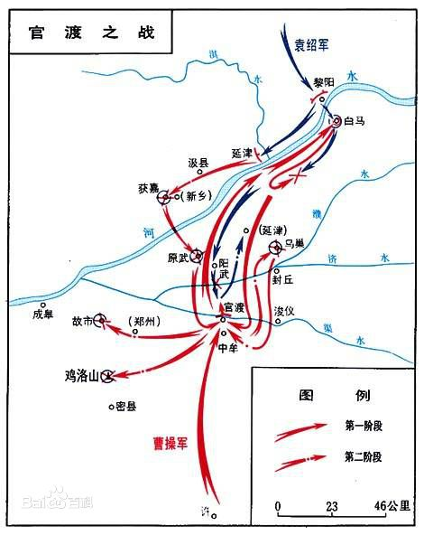   

&emsp;&emsp;建安四年（公元199年）六月，袁绍点校精兵十万，战马万余南下欲攻取曹操的老巢许都，当时兵力上处于绝对劣势（总兵力约三万）的曹操只有两条路可选，战或者降。是战是降，相信当年的曹操阵营肯定有过相当激烈的争论。当时曹操手下主要的谋士有荀彧、郭嘉、贾诩、董昭、毛玠、程昱等，武将有徐晃、关羽、张辽、许褚、夏侯惇等，这些谋士和武将或主战或主降，而曹操则需要根据这些人的意见作出最终的决策。现在我们分别用`Xi`(i=0, 1, 2, ···)表示曹操手下某个谋士或者武将的意见，用`Wj`(j=0, 1, 2, ···)表示该谋士或者武将意见的权重（即重要程度，不同的人发表的意见作用肯定不同，不然也就不存在什么第一谋士或者第一虎将之类的称谓了对吧），如下图1-1所示：  

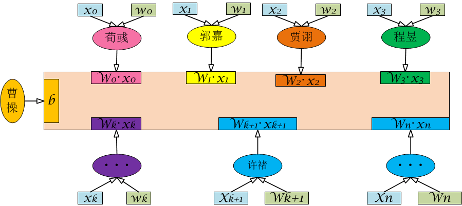 

图1-1　　官渡之战曹操阵营决策示意图
  

### 1.2 决策表达式  
&emsp;&emsp;曹操不是阿斗，有自己的判断力，所以不管他的谋士和武将们都给出什么样的提议，他自己在大脑里面也会有一个权衡，而这个权衡是会影响到最终决策的。所以在上图中我们用了一个数`b`来表示这种影响（PS：至于为什么没加权重，答案很简单，因为曹操是Boss）。根据上图，曹操将自己和他所有手下的意见整合起来后用数学表达式表达可得到如下图1-2所示结果：   

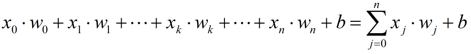 

图1-2　　曹操阵营决策综合值
    

&emsp;&emsp;在上述式子中，`xj·wj`表示任意一个谋士或武将对最终决策的影响程度。如果我们记`xj > 0`表示主战，且`xj`越大，表示其主战意愿越强烈，记`xj < 0`为主降，其绝对值越大则表示其主降的意愿越强烈，而`xj = 0`则表示摇摆不定，见风使舵。由此可知`xj`取值范围为整个实数域，即 `[-∞，+∞]`。而`wj`的取值范围为`[0, 1]`，是一个恒为非负值的系数。根据前面的假定，显然有当上述求和式的值大于零时，表明曹操阵营主战的居多（或者说说话比较有分量的都是主战），而当求和式小于零时，则刚好相反，主降的居多。如果是等于零，那么表明曹操阵营目前主战和主降的达到了一个博弈平衡，互相争执不下，谁也说服不了谁（当然最终结果还是只有战或者降两种，不可能有第三种状态），这个时候曹操自己的决策也就是参数`b`就很重要了。这个很好理解吧？
&emsp;&emsp;好了，现在曹操已经获得了大家整体的意见。但这还不够，还要做一步工作——根据这个值作出判断，战与降（最终输出结果）。这里曹操的大脑就相当于一个映射函数`f(x)`，负责把意见总和（即`[-∞，+∞]`的值）映射为一个二元（战或降）的结果，即有：     
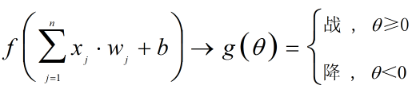 

图1-3　　曹操决策映射示意图
    

&emsp;&emsp;上面说了当求和值等于零的时候，表示曹操阵营达到了博弈平衡，相互争执，但是最终结果只有战与降两种，所以为了方便叙述并引出下文，我们把求和值等于零的这一种**`临界情况`**也划分到主战这一类里面，最终结果即为上图1-3所示。
&emsp;&emsp;上面就是我们想象和模拟出来的曹操阵营在官渡之战前做出最终军事决策的整个过程。之所以写这么一个小故事，是为了引出我们的二类分类模型——Logistic回归，而这个Logistic回归则是我们去理解SVM的第一步。

### 1.3 二分类  
&emsp;&emsp;像上面这样最终结果只有两种的问题在实际应用中是非常多的，比如某些疾病的检测结果呈现的是阴性还是阳性，客户贷款申请审批结果是通过还是不通过等等。**`《机器学习实战》`**一书中提到了疝气病预测病马是否死亡的例子，下图1-4是该例子所用到训练数据集：     
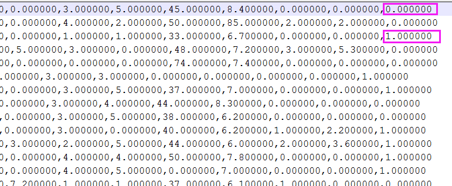 

图1-4　　疝气病预测病马死亡训练数据集部分截图
    

&emsp;&emsp;上图中最后一列的数据`0.000000`和`1.000000`即为最终预测的结果，即图1-3中的`g(θ)`，`0.000000`代表不会死亡，而`1.000000`代表不会死亡，而前面的各列则分别代表了马的各种指标。这也是一个典型的二分类问题，这里的马的各种指标和上面我们提到的曹操阵营各个谋士或者武将的意见值相对应，其预测结果和曹操的决策结果对应。像这种问题我们通常称之为二分类问题，	SVM正是一种二分类模型。

## 二、Logistic回归  
&emsp;&emsp;**逻**辑回归(Logistic Regression)实际上是在线性回归的基础上加了一个逻辑函数(Logistic Funtion，也称Sigmoid Function)，原因在于线性回归在整个实数域内对噪声都非常敏感，导致鲁棒性非常差。
### 2.1 Sigmoid函数  
&emsp;&emsp;既然Logistic回归的核心是Sigmoid函数，那我们就先来看看这个神秘的Sigmoid函数，如下图2-1所示：     
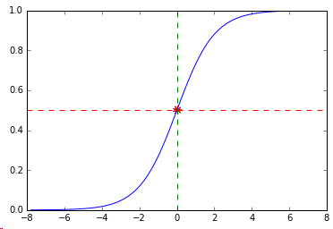 

图2-1　　Sigmoid函数图
     

&emsp;&emsp;由上图可知，Sigmoid是一个值域为**`[0 , 1]` ** 并且相当优雅漂亮的函数，其定义域为**`[-∞，+∞]`**，这里之所以只画了横坐标`[-8 , 8]`的图形是因为它在横坐标为`±8`附近的时候纵坐标值已经接近两个值域极限了。仔细观察这个Sigmoid函数，你会发现它有一个非常明显的分界点（图中红色星号点），当横坐标≥0（绿色虚线右边部分）的时候，其纵坐标恒大于某个值（红色虚线）。相反，当横坐标≤0（绿色虚线左边部分）的时候，其纵坐标恒小于某个值。这个值（**`f(x)=0.5`**）即为我们的**临界值**，而`x=0`即为我们的**临界条件**。另一个重要特性就是Sigmoid整个函数在**`[-∞，+∞]`**上都是单增的。它的函数表达式为：     
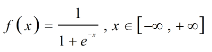 

图2-2　　Sigmoid函数表达式
     

&emsp;&emsp;把临界条件`x=0`代入上述表达式即可求得这个临界值**`f(x)=0.5`**，  如果把纵坐标值`f(x)`看做概率值（概率值的值域范围也正好是**`[0 , 1]` **），这个临界值`P=f(x)=0.5`可以这样去理解：在对疾病是否呈现阳性的检测中，如果根据各个指标最终计算出的结果的概率≥0.5，我们即可以把它判定为阳性，小于这个值则判定为阴性。（这个应该很好理解吧，判定是否为阳性你起码得有50%的把握对吧？）这个也适用于其它任何类似的情况。  
&emsp;&emsp;由上述表达式和函数图形可知，Logistic回归中的Sigmoid函数把线性回归中的值域从**`[-∞，+∞]`**映射到了**`[0 , 1]` **，同时由于指数的存在，大大降低了模型对噪声数据的敏感性。由Sigmoid函数的图形可以看出，Logistic回归特别适合二分类。事实上，正是由于这个Sigmoid函数的存在，使得Logistic回归成为了机器学习领域里一颗耀眼的星星。读到这里，可能很多新手仍然充满疑惑，这个Sigmoid函数又是如何跟二元分类挂钩的呢，别急，马上我们就会讲它是如何实现的。  
### 2.2 Sigmoid函数和二分类
&emsp;&emsp;上面2.1节中我们讲了Sigmoid函数的值域是**`[0 , 1]` **，也就是说其输出结果是一个连续变量，而二分类问题的输出结果是二元离散值。Sigmoid函数的图形中可以看出其输入为一元变量（横坐标值`x`），而二元分类问题的输入可能是多元变量（如1.1中讲到的曹操阵营各个谋士和武将）。二者看起来似乎互不兼容，因为输入和输出都不相同。这点问题是难不倒我们的大牛的，下面就这两个问题分开来说。  
#### 2.2.1 输入变换  
&emsp;&emsp;二元分类问题的输入为一元或者多元变量，而Sigmoid函数的输入通常为一元变量，要解决这个问题，我们只需要把二元分类的输入做一个映射，如下图2-3所示：     
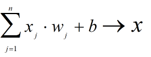 

图2-3　输入映射示意图
   

&emsp;&emsp;映射后的Sigmoid函数表达式如下图2-4所示：     
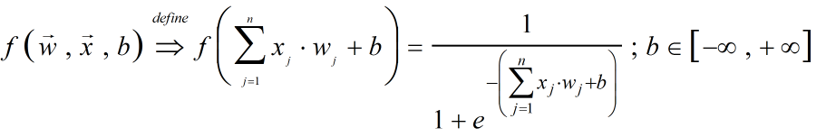 

图2-4　输入映射后Sigmoid函数表达式
  

&emsp;&emsp;输入映射后，原来的`n`维变量被变换成了一个一维的输入变量，映射后的Sigmoid函数是关于向量**`W`**、**`X`**和标量`b`的函数，其中**`W`**是权重系数向量，代表每一个变量的作用权重，对应1.1中曹操每个手下说话的分量，即有：     
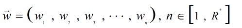 

图2-5　权重系数向量
    

&emsp;&emsp;而**`X`**则是我们的输入值向量，对应1.1中曹操每个手下的意见，即有：     
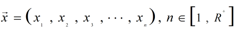 

图2-6　输入值（影响因素）向量
    

&emsp;&emsp;进一步，我们将求和表达式用向量的乘积表示可以得到：   
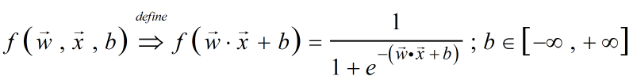 

图2-7　Sigmoid向量乘积形式
  

&emsp;&emsp;相对于图2-4中的形式，上式明显简洁多了，然而这个表达形式仍然不够简单，自变量`x`和系数项`w`、常数项`b`没有分开，写起来也比较繁琐，不利于我们后面的证明过程，再一次通过化简后得到新的表达式如下图2-8所示：     
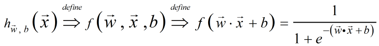 

图2-8　最终简化后Sigmoid表达式
    

&emsp;&emsp;采用`hw,b(x)`这样的形式，能显著的把系数向量和输入向量分开， 并且更加简单易读。至此，输入的变换就完成了。  
#### 2.2.2 输出变换  
&emsp;&emsp;上面提到了二元分类的输出结果是二元离散值（0或1、正或负、阴或阳等等），而Sigmoid函数的输出则是连续值，要完成这种变换，我们就需要将Sigmoid的输出拆分成两部分，一部分对应一个分类，另一部分对应另外一种分类。对于非单增/单减函数来说，这样做可能稍显复杂甚至不可行，但对单增/单减函数来说就非常简单了，从任意横坐标处切一刀就可以了。对于Sigmoid函数，从其图形来说，在横坐标的任意位置作垂直于横坐标轴的直线（比如在`x=2`处），则该直线左右两半部分就可以映射成两种不同的输出结果，如下图2-9所示：    
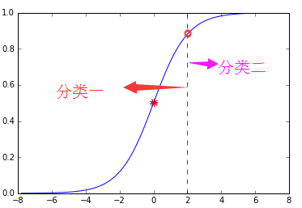 

图2-9　输出拆分成两部分示意图
    

&emsp;&emsp;如上图2-9所示，凡是**绿色虚线**左半部分的都映射为`分类一`，而右半部分则映射为`分类二`。显然这样的拆分方案有无穷多种，我们通常采用在`x=0`处（即二维坐标系的纵坐标轴，图2-1绿色虚线）进行划分，这样做能使左右两部分的输出完全对称，同时由1.2和2.1节所描述的可知，`x=0`正是很多二分类问题的临界条件。
&emsp;&emsp;上面说了，对于二分类的输出结果，即**分类标签**，可以取任意值，为了方便证明同时结合大多数实际应用的情况，我们取**`-1`**和**`1`**，按照上述约定，我们有：    
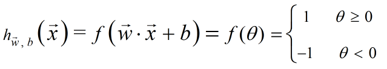 

图2-10　最终约定结果
  

&emsp;&emsp;至此，输入和输出的变换都已完成。
#### 2.2.3 关于参数b  
&emsp;&emsp;关于这个常数b，可不是闲着没事随便添加的，在NN（Neural Network即神经网络），它是作为神经元的bias（偏置系数）存在的。关于参数b，以后有机会写DL（Deep Learning）的时候再讲，现在大家只需要知道的是，在训练分类模型的过程中，这个参数b也是会更新的，以便让我们的模型最优。NN中的参数b如下图2-11所示：  
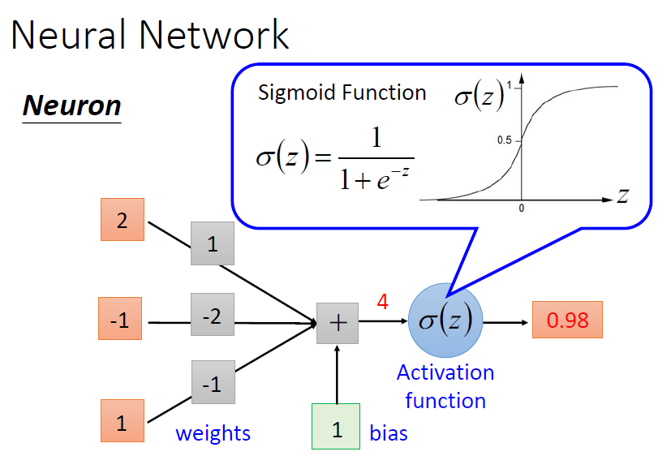 

图2-11　参数b
  

#### 2.2.4   小节备注
&emsp;&emsp;上面的向量乘积有很多资料采用了如下形式的表达式，其本质与我们上面说的并没有差别（整个向量的乘积都是一个标量），也不影响证明过程。    
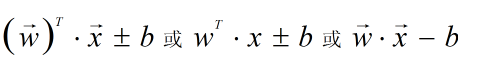 

图2-12　向量乘积其它表达形式
  