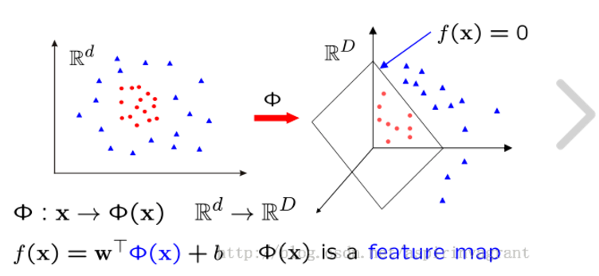
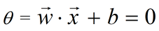
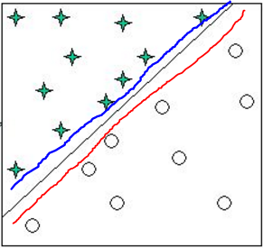
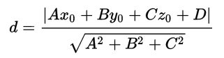
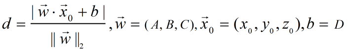

>Hyper plane!
***   

## 一、SVM  
&emsp;&emsp;  &emsp;&emsp;**在**[机器学习算法系列之三：SVM（1）](https://flat2010.github.io/2017/01/29/%E6%9C%BA%E5%99%A8%E5%AD%A6%E4%B9%A0%E7%AE%97%E6%B3%95%E7%B3%BB%E5%88%97%E4%B9%8B%E4%B8%89%EF%BC%9ASVM1/)中我们提到了SVM，但并没有给出它的定义，也没有做过多的介绍。现在，是时候隆重的介绍我们本系列的主角了。在这小节里面，下面就从SVM的定义，用途，优缺点来这些方面来进行叙述。  

### 1.1 定义  
&emsp;&emsp;老规矩，先上维基百科的定义，如下：  

<blockquote2>In machine learning, support vector machines (SVMs, also support vector networks) are supervised learning models with associated learning algorithms that analyze data used for classification and regression analysis. Given a set of training examples, each marked as belonging to one or the other of two categories, an SVM training algorithm builds a model that assigns new examples to one category or the other, making it a non-probabilistic binary linear classifier. An SVM model is a representation of the examples as points in space, mapped so that the examples of the separate categories are divided by a clear gap that is as wide as possible. New examples are then mapped into that same space and predicted to belong to a category based on which side of the gap they fall.</blockquote2>  
<blockquote2> More formally, a support vector machine constructs a hyperplane or set of hyperplanes in a high- or infinite-dimensional space, which can be used for classification, regression, or other tasks. Intuitively, a good separation is achieved by the hyperplane that has the largest distance to the nearest training-data point of any class (so-called functional margin), since in general the larger the margin the lower the generalization error of the classifier.</blockquote2>   

&emsp;&emsp;注意在上述定义中被我标红的关键词，这些是SVM的核心知识点，特别是`gap`、`hyper plane`、`function margin`，当然还有我们后面会讲到的`kernel trick`。对于`kernel trick`，它使得SVM可以被应用于非线性可分的数据集上，并且工作的非常好，大大提高了SVM的通用性，可以说是SVM核心中的核心。关于`kernel trick`的历史，维基百科里面是这样说的：  
<blockquote2> The original SVM algorithm was invented by Vladimir N. Vapnik and Alexey Ya. Chervonenkis in 1963. In 1992, Bernhard E. Boser, Isabelle M. Guyon and Vladimir N. Vapnik suggested a way to create nonlinear classifiers by applying the kernel trick to maximum-margin hyperplanes. The current standard incarnation (soft margin) was proposed by Corinna Cortes and Vapnik in 1993 and published in 1995.</blockquote2>

### 1.2 用途    
#### 1.2.1 文本/超文本分类  
&emsp;&emsp;SVM在文本（Text）及超文本（Hypertext）分类中非常有用，能够显著减少算法对已标记数据的依赖（即只需少量训练数据）。这主要得益于SVM只需要少数关键的支持向量既能确定一个最优的分类超平面。  
#### 1.2.2 图片分类  
&emsp;&emsp;SVM同样被应用于图像分类，实验数据表明，相比于传统的查询细化方案，SVM仅在三到四轮相关性反馈后就拥有较高的搜索精度。  
#### 1.2.3 手写体识别  
&emsp;&emsp;当然，SVM也可以用于手写体识别。
#### 1.2.4 聚类分析  
&emsp;&emsp;虽然SVM的主要用途是用于分类或者回归，但是它仍然可以被用于聚类分析。当然原生态的SVM并不能直接用于聚类，需要对它进行一定的改进，用于聚类的改进SVM算法称为支持向量聚类（support vector cluster）。
#### 1.2.5 其它领域  
&emsp;&emsp;SVM还被广泛的应用于诸如生物学、化学等领域。在生物学中，SVM已被用于蛋白质分类，并且其分类准确率高达90％。

### 1.3 优缺点    
#### 1.3.1 优点 
&emsp;&emsp;①在小样本数据集上表现优异，特别适合某些特殊（不易采集到数据或数据量本身就不大）应用场景。  
&emsp;&emsp;②适合高维数据。SVM利用内积核函数代替向高维空间的非线性映射。  
&emsp;&emsp;③有非常坚实的理论基础。  
&emsp;&emsp;④鲁棒性较强。SVM对非支持向量不敏感，增、删、改非支持向量不影响模型训练，同时在某些应用中，SVM对核的选取并不敏感。  
&emsp;&emsp;⑤泛化能力强。SVM本身的优化是针对结构风险最小化的，而非经验风险最小化，同时通过函数间隔等概念，降低了对数据规模和数据分布的要求，增强了泛化能力。  

#### 1.3.2 缺点 
&emsp;&emsp;①训练样本较大时，时间及空间复杂度均较高，有时候其计算代价甚至无法接受（SVM采用二次规划来求解支持向量，涉及m阶矩阵的运算问题）。  
&emsp;&emsp;②原始SVM只支持二分类。  
&emsp;&emsp;③理论性太强，涉及知识面太广，不如其它机器学习算法（如KNN、决策树等）好懂。  
&emsp;&emsp;④在高维空间映射中，如何确定核函数，目前尚无合适的方法。  

&emsp;&emsp;注：如果现在还不太明白上面提到的这些概念（比如结构风险），没关系，我们会在后面的过程中详细说明，当然也可以先在网上搜索相关资料，补充一点预备知识，这样会更容易的理解本系列教程。
## 二、超平面/临界条件  
&emsp;&emsp;**由**SVM的定义可知，它通常用于分类或回归，并以分类应用最广。上一节我们引出了Sigmoid函数，它可以用于二分类问题，并且提到了所谓的临界条件（`θ = 0`）。凡是`θ > 0`的，划分成一个类，凡是`θ < 0`的划分成另外一个类。那么，给定一组数据（训练数据集），要对其进行分类时，其实就是要找到满足要求的临界条件（该临界条件由权重系数向量**`w`**和参数**`b`**确定）。专业术语称为`Hyperplane（超平面）`，如果你对这个术语感到畏惧或者疑惑的话，就把它理解为一个临界条件吧。它的数学表达式如下图2-1所示：  

图2-1　　临界条件表达式
  

&emsp;&emsp;为什么称它为超平面呢？当其输入参数为2个时，把上图的向量乘积`w·b`展开，可以看出来这是一个直线方程。当输入参数为3个时，展开后就可以看出来这是一个三维坐标中的平面方程。那么输入参数为4、5、6、···时，是什么东西呢？没人知道，因为人类大脑能构建出的图形的最高维度就3维，所以为了方便我们就把它们统称为超平面了。正如本页第一个图所示，图中的蓝色箭头所指的就是我们的超平面，它把红色小圆点和蓝色小三角形分开了，红色小圆点和蓝色小三角形分别代表两个不同的类别（比如阴性和阳性）。  
&emsp;&emsp;注：为叙述方便，本文及后续文章可能会交替使用超平面/临界条件这两个词，其本质并没有区别，请注意。
### 2.1 确定临界条件  
&emsp;&emsp;下面我们以特征向量**维度为2**（即输入参数有2两个）的**线性可分**（非线性可分的处理后面会将）**二分类**为例来说明如何确定临界条件。以如下图2-2所示：  

图2-2　　确定临界条件
  

&emsp;&emsp;上图中星星和圆点为不同类型的数据点，要在图中找出能把这两类点区分开的直线的话，是非常容易的。比如图中的红色、蓝色、浅绿色线都可以满足要求，显然这样的线是在上图中我们是可以画无的，也就是对于上图的数据，有无数个满足要求的临界条件。  
&emsp;&emsp;那么问题就来了，学挖掘机究竟哪家强？（哪个临界条件才是最好的^--^）  
### 2.2 几何、函数间隔
&emsp;&emsp;从上图2-2可以看出来，离分割面/线越远的点，它属于某个类的确定性越高，离分割面/线越近，就越靠近临界值，其确定性就越低。对位于分割面/线上的点，其不确定性是最大的。因此，最好的超平面应该满足：  
&emsp;&emsp;**①所有（两侧）距离超平面面最近的点到该超平面的距离之和有最大值！**  
&emsp;&emsp;同时，好的超平面还应该满足：  
&emsp;&emsp;**②使得尽可能多的数据点被正确分类！**  
&emsp;&emsp;由此，我们引出一个新的概念——`geometrical margin`（几何间隔）。

#### 2.2.1 点到平面距离
&emsp;&emsp;高中时候我们学过关于给定点**(x0,y0,z0)**到平面**`Ax+By+Cz=0`**的距离公式如下图2-3所示：  

图2-3　　点到平面的距离公式
 

&emsp;&emsp;如果以向量方式来表示（记平面方程法向量为**`w=(A,B,C)`**，点坐标**x=(x0,y0,z0)**，**b=D**），则有如下图2-4所示公式：

图2-4　　向量形式点到平面的距离
 

#### 2.2.2 几何间隔
&emsp;&emsp;由上述点到平面距离我们分别定义样本点关于超平面的几何间隔、数据集关于超平面的几何间隔分别为：

$$
\gamma_i = y_i·\frac{\vec w·\vec x_i + b}{||\vec w||}
= y_i\lgroup\frac{\vec w}{||\vec w||}·\vec x_i + \frac{b}{||\vec w||}\rgroup
\tag{2 - 1}
$$

$$
\gamma = \min \limits_{i=1,···,N} \gamma_i
\tag{2 - 2}
$$

&emsp;&emsp;注意式子2-1、2-2中的几何间隔没有像点到平面的距离那样取绝对值，而是可正可负。对于给定的数据集，其几何间隔等于所有样本点到超平面的距离的最小值。且当样本被正确分类时，不管是哪一类样本，都有$\gamma_i \ge 0$（因样本实际类别$y_i$和预测类别$\vec w·\vec x_i + b$同号）。
&emsp;&emsp;对二分类问题，如果我们记样本实际类别$y_i$分别取+1（正类）、-1（负类），由式2-1可知，**`几何间隔`**的**几何意义就是区分正向和反向的点到平面的距离。**

#### 2.2.3 函数间隔
&emsp;&emsp;要理解SVM，有几何间隔就足够了，函数间隔没必要再讲，并且其几何意义远不如几何间隔明晰。但是为了确保整个理论体系的完整性，我们这里还是要介绍下函数间隔的概念及定义式（实际上很多教材和网上的资料都是先讲函数间隔，再引申出几何间隔）。
&emsp;&emsp;**函数间隔实际上是在几何间隔的基础上，扩大了超平面法向量模大小（$||\vec w||$）倍数之后的距离，即：**

$$
\hat{\gamma_i} = ||\vec w||·\gamma_i = y_i\lgroup\vec w·x_i + b\rgroup
\tag{2 - 3}
$$

$$\hat{\gamma} = 
\min \limits_{i=1,···,N} \hat{\gamma_i}
\tag{2 - 4}
$$
