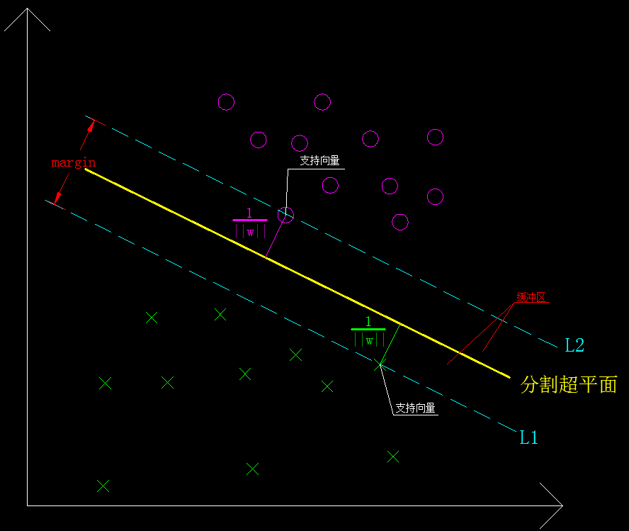

>The road to dreams is not only lonely, but also rugged！
***

## 一、理论证明  
&emsp;&emsp;**在**本系列的前两章主要是对SVM的一些相关概念做了介绍，对于只想简单了解SVM原理的来说，已经足够了。但对于想进一步深入理解SVM的来说，收拾好你的行囊，整理好你的思绪，踏上新的征程吧，前面的路途不但遥远，而且崎岖。
&emsp;&emsp;本章内容主要是SVM的理论证明部分，前方各种公式定理高能预警！**以下内容可能会引起不适，主要表现为犯困、头晕、有暴力冲动，请自行选择是否继续。**
<!-- more -->

### 1.1 支持向量  
&emsp;&emsp;所谓支持向量（Support Vector），是指训练数据集的样本点（线性可分）中与分离超平面距离最近的样本点。在[机器学习算法系列之三：SVM（2）](https://flat2010.github.io/2017/02/17/%E6%9C%BA%E5%99%A8%E5%AD%A6%E4%B9%A0%E7%AE%97%E6%B3%95%E7%B3%BB%E5%88%97%E4%B9%8B%E4%B8%89%EF%BC%9ASVM2/)中我们讲到了分割超平面求解的等价问题，以归一化（函数间隔$\hat{\gamma} = 1$）后的问题来说，求解出的超平面必然使得所有点都满足：

$$
y_i(\vec w · x_i + b) \geq 1
\tag{1 - 1}
$$

&emsp;&emsp;即所有点到分割超平面的距离都不小于1，那么**支持向量就是指这些到超平面的距离刚好等于1的点。**其实决定参数$\vec w、b$的，正是这些点。这也是支持向量机这个称谓的由来，即由一组支持向量控制决定的分类模型。

### 1.2 缓冲带
&emsp;&emsp;请注意，缓冲带这个词并非术语，是我根据它的作用起的一个名字，方便大家理解它的功能。它的专业术语称作**margin**，是由过支持向量并与分割超平面平行的两个平面所围起来的部分，由于支持向量到分割超平面的距离均为1，所以**分割超平面位与这两个平面的中间位置**，如下图所示：

图1-1　　缓冲区、支持向量等示意图
 

&emsp;&emsp;如图上所示，L1、L2上的点就是**支持向量**，黄色粗直线为分割超平面（由$\vec w、b$决定），L1、L2之间的距离就是**margin = $\frac{2}{||w||}$**，L1、L2之间的区域即为缓冲带（缓冲区），L1、L2到分割超平面的距离均为**几何距离 = $\frac{1}{||w||}$**。
&emsp;&emsp;之所以把L1和L2之间的区域称为缓冲带，是因为任意一边的样本点发生抖动时，都不会立即越过分割超平面被误判为另一种类型的样本，这个安全距离就是$\frac{1}{||w||}$，缓冲带的存在确保了SVM的泛化能力和抗噪能力。
&emsp;&emsp;同时由上图可知，**分割超平面只与支持向量有关**，去掉或者移动其它非支持向量（不越过支持向量），并不会影响最终的解。**SVM分类模型训练的本质就是找到这些支持向量。**

### 1.3 存在性和唯一性
&emsp;&emsp;给定数据集T（**线性可分**），则有且仅有一个如上所述的分割超平面存在，使得几何间隔$\gamma$最大。即[机器学习算法系列之三：SVM（2）](https://flat2010.github.io/2017/02/17/%E6%9C%BA%E5%99%A8%E5%AD%A6%E4%B9%A0%E7%AE%97%E6%B3%95%E7%B3%BB%E5%88%97%E4%B9%8B%E4%B8%89%EF%BC%9ASVM2/)中的式**（2-14）**有且仅有一个解，现在分别从存在性和唯一性方面进行证明。为了方便阅读，我把前面提到的公式（2-14）贴在这里。

$$
\begin{cases}
\min \limits\_{w,b}{\frac{1}{2} {||w||}}^2\\\\
y_i \lgroup {\vec w} · \vec x_i + {b} \rgroup - 1  \geq 0, \ \ i = 1,2,···,N
\end{cases}
\tag{\*2 - 14}
$$

#### 1.3.1 存在性
&emsp;&emsp;存在性的证明相对比较简单。因为给定的数据集$T$线性可分（非线性可分其实也有解，后面会讲），所以式（2-14）一定有解。对式子中的最小化问题有：

$$
\min \limits\_{w,b}{\frac{1}{2} {||w||}}^2 = 
\min \limits\_{w,b}{\frac{1}{2} \sqrt{w_1^2 + w_2^2 + ··· + w_n^2}^2}
$$

&emsp;&emsp;设$w\_i^2 \geq w\_k^2，i \neq k，i = 1，2，···，n$，则有：

$$
\min \limits\_{w,b}{\frac{1}{2} {||w||}}^2 \geq
{\frac{1}{2} \sqrt{n·w_k^2}^2} \geq
{\frac{n}{2}} w_k^2
$$
&emsp;&emsp;又因为$n、w\_k$都是有界实数，所以必然有：
$$
\min \limits\_{w,b}{\frac{1}{2} {||w||}}^2 \geq
K，K \in R^+且K \nrightarrow \infty
\tag{1 - 2}
$$

&emsp;&emsp;**即$\min \limits\_{w,b}{\frac{1}{2} {||w||}}^2$必然有解。**记最优解为$(w^\*, b^\*)$，可知$w^\* \neq 0$，注意这点很重要，因为$w^\* = 0$就会导致$||w|| = 0$，也即几何间隔不存在。

#### 1.3.2 唯一性
&emsp;&emsp;对唯一性的证明，我们用反证法。设（2-14）的解存在且不唯一，记$(\vec w\_1^\*，b\_1^\*)、(\vec w\_2^\*，b\_2^\*)$分别为式（2-14）的两个最优解。
&emsp;&emsp;因为$(\vec w\_1^\*，b\_1^\*)、(\vec w\_2^\*，b\_2^\*)$均为最优解，则$(\vec w\_1^\*，b\_1^\*)、(\vec w\_2^\*，b\_2^\*)$必然均满足目标函数：

$$
\min \limits\_{w,b}{\frac{1}{2} {||w||}}^2
\tag{1 - 3}
$$

&emsp;&emsp;因此必有：

$$
\min \limits\_{w,b}{\frac{1}{2} {||w||}}^2 = 
{\frac{1}{2} {||\vec w\_1^\*||}}^2 = 
{\frac{1}{2} {||\vec w\_2^\*||}}^2 = 
m，m \in R^+，常数
$$

&emsp;&emsp;所以必有：

$$
||\vec w\_1^\*|| = ||\vec w\_2^\*|| = c，c \in R^+，常数
\tag{1 - 4}
$$

&emsp;&emsp;取$\vec w^\* = \frac{\vec w\_1^\* + \vec w\_2^\*}{2}，b = \frac{b\_1^\* + b\_2^\*}{2}$，则：

$$
\begin{split}
\min \limits\_{\vec w^\*,b^\*}{\frac{1}{2} {||\vec w^\*||^2 } }
& = 
\min \limits\_{\vec w^\*,b^\*}{\frac{1}{2} {|| \frac{\vec w\_1^\* + \vec w\_2^\*}{2} ||^2}  }\\\\
& =  
\min \limits\_{\vec w^\*,b^\*}{\frac{1}{8} {|| {\vec w\_1^\* + \vec w\_2^\*} ||^2}  }\\\\
\end{split}
$$

&emsp;&emsp;由矢量合成法则可知：

$$
||\vec w\_1^\* + \vec w\_2^\*|| = ||\vec w^\*|| \leq ||\vec w\_1^\*|| + ||\vec w\_2^\*||
\tag{1 - 5}
$$

&emsp;&emsp;**当且仅当$\vec w_1^\*、\vec w_2^\*$同向即$\vec w_1^\* = \lambda · \vec w_2^\*，\lambda \in R^+$时上式取等号。**
&emsp;&emsp;由此有：

$$
\begin{split}
\min \limits\_{\vec w^\*,b^\*}{\frac{1}{2} {||\vec w^\*||^2 } }
& =  
\min \limits\_{\vec w^\*,b^\*}{\frac{1}{8} {|| {\vec w\_1^\* + \vec w\_2^\*} ||^2}  }\\\\
& \leq
\min \limits\_{\vec w^\*,b^\*}{\frac{1}{8} {(|| {\vec w\_1^\*|| + ||\vec w\_2^\*} ||)^2}  } \\\\
&=
\min \limits\_{\vec w^\*,b^\*}{\frac{1}{8} { ( ||\vec w\_1^\*||^2 + ||\vec w\_2^\* ||^2+ 2||\vec w_1^\*||·||\vec w_2^\*|| )} }
\end{split}
$$

&emsp;&emsp;$\because$

$$
||\vec w\_1^\*|| = ||\vec w\_2^\*||
$$

&emsp;&emsp;$\therefore$

$$
\begin{split}
\min \limits\_{\vec w^\*,b^\*}{\frac{1}{2} {||\vec w^\*||^2 } } 
& \leq
\min \limits\_{\vec w^\*,b^\*}{\frac{1}{8} (||\vec w\_1^\*||^2 + ||\vec w\_1^\*||^2 + 2||\vec w\_1^\*||·||\vec w\_1^\*||)} \\\\
&=
\min \limits\_{\vec w^\*,b^\*}{\frac{1}{8} · 4 · ||\vec w\_1^\*||^2} \\\\
& =
\min \limits\_{\vec w^\*,b^\*}{ \frac{1}{2} {||\vec w\_1^\*||^2 } } \\\\
& = 
m
\end{split}
$$

&emsp;&emsp;即$\vec w^\* = \frac {\vec w\_1^\* + \vec w\_2^\*}{2}$也是原始问题的权重系数向量解。
&emsp;&emsp;对不等式约束条件，有：

$$
\begin{split}
y\_i \lgroup {\vec w^\*} · \vec x_i + {b^\*} \rgroup - 1 &=
y\_i \lgroup { \frac{\vec w\_1^\* + \vec w_2^\*}{2}} · \vec x_i + \frac{b\_1^\* + b\_2^\*}{2} \rgroup - 1 \\\\
&=
\frac{1}{2} y\_i \lgroup { \vec w\_1^\*} · \vec x\_i + b\_1^\* + {\vec w_2^\*} + b\_2^\* \rgroup - 1 \\\\
&=
\frac{1}{2} y\_i \lgroup { \vec w\_1^\*} · \vec x\_i + b\_1^\* \rgroup + 
\frac{1}{2} y\_i \lgroup { \vec w\_2^\*} · \vec x\_i + b\_2^\* \rgroup - 1
\end{split}
$$

&emsp;&emsp;又因为$\vec w_1^\*、\vec w_2^\*$满足：

$$
\begin{cases}
y\_i \lgroup {\vec w\_1^\*} · \vec x\_i + {b^\*} \rgroup - 1  \geq 0, \ \ i = 1,2,···,N \\\\
y\_i \lgroup {\vec w\_2^\*} · \vec x\_i + {b^\*} \rgroup - 1  \geq 0, \ \ i = 1,2,···,N
\end{cases}
$$

&emsp;&emsp;所以有：

$$
\begin{split}
y\_i \lgroup {\vec w^\*} · \vec x\_i + {b^\*} \rgroup - 1 &\geq
\frac{1}{2} · 1 + 
\frac{1}{2} · 1 - 1 = 
1 - 1 =
0
\end{split}
$$

&emsp;&emsp;即$\vec w^\* = \frac {\vec w\_1^\* + \vec w\_2^\*}{2}、b^\* = \frac{b_1^\* + b_2^\*}{2}$同时还满足不等式的约束条件。
&emsp;&emsp;综上两点可知$\vec w^\* = \frac {\vec w\_1^\* + \vec w\_2^\*}{2}、b^\* = \frac{b_1^\* + b_2^\*}{2}$也是最优解！

##### 1.3.2.1 $\vec w_1^\* = \vec w_2^\*$证明
&emsp;&emsp;由上可知$\vec w^\*$必然也满足式（1-3）的目标函数的约束，即有：

$$
\min \limits\_{\vec w,b}{\frac{1}{2} {||\vec w^\*||}}^2 = 
{\frac{1}{2} {||\vec w\_1^\*||}}^2 = 
{\frac{1}{2} {||\vec w\_2^\*||}}^2 = 
m，m \in R^+，常数
$$

&emsp;&emsp;因此有式（1-4）的扩展：

$$
||\vec w^\*|| = ||\vec w\_1^\*|| = ||\vec w\_2^\*|| = c，c \in R^+，常数
\tag{1 - 6}
$$

&emsp;&emsp;所以有：

$$
||\vec w^\*|| = || \frac {\vec w\_1^\* + \vec w\_2^\*}{2} || = \frac {|| \vec w\_1^\* + \vec w\_2^\* ||}{2} = ||\vec w\_1^\*|| = ||\vec w\_2^\*||
\tag{1 - 7}
$$

&emsp;&emsp;所以必有：

$$
\vec w\_1^\* = \vec w\_2^\*
\tag{ 1- 8}
$$

&emsp;&emsp;注意，上式（1-8）是两个**向量相等！**相当于之前的限制条件$\vec w_1^\* = \lambda · \vec w_2^\*，\lambda \in R^+$中的$\lambda = 1$时的情况，这种情况下$\vec w_1^\*、 \vec w_2^\*$的关系的限定更为严格和明确。对于式（1-8）的证明如下：

$$
\begin{split}
\frac {|| \vec w\_1^\* + \vec w\_2^\* ||}{2} &= \frac {1}{2} · \sqrt { \sum\_{i=1}^n (w\_{1i} + w\_{2i})^2} \\\\
&= \frac {1}{2} · \sqrt { w\_{11}^2 + w\_{21}^2 + 2·w\_{11}w\_{21} + ··· +w\_{1n}^2 + w\_{2n}^2 + 2·w\_{1n} w\_{2n} } \\\\
&= \frac {1}{2} · \sqrt { (w\_{11}^2 + ··· + w\_{1n}^2) + (w\_{21}^2 + ··· + w\_{2n}^2) + 2·(w\_{11} w\_{21} + ··· +w\_{1n} w\_{2n}) } \\\\
||\vec w\_1^\*|| &= \sqrt { w\_{11}^2 + ··· + w\_{1n}^2 }
\end{split}
$$

&emsp;&emsp;由式（1-7）利用已知条件$||\vec w^\*|| = ||\vec w\_1^\*||$有：

$$
\sqrt { w\_{11}^2 + ··· + w\_{1n}^2 } = \frac {1}{2} · \sqrt { (w\_{11}^2 + ··· + w\_{1n}^2) + (w\_{21}^2 + ··· + w\_{2n}^2) + 2·(w\_{11} w\_{21} + ··· +w\_{1n} w\_{2n}) }
$$

&emsp;&emsp;再对等式两边取平方有：

$$
w\_{11}^2 + ··· + w\_{1n}^2 = \frac {1}{4} [ (w\_{11}^2 + ··· + w\_{1n}^2) + (w\_{21}^2 + ··· + w\_{2n}^2) + 2·(w\_{11} w\_{21} + ··· +w\_{1n} w\_{2n}) ]
$$

&emsp;&emsp;两边同时乘以4，并化简有：

$$
3w\_{11}^2 + ··· + 3w\_{1n}^2 = w\_{21}^2 + ··· + w\_{2n}^2 + 2·(w\_{11} w\_{21} + ··· +w\_{1n} w\_{2n})
\tag{1 - 9}
$$

&emsp;&emsp;同时我们有$||\vec w\_1^\*|| = ||\vec w\_2^\* ||$即：

$$
w\_{11}^2 + ··· + w\_{1n}^2 = w\_{21}^2 + ··· + w\_{2n}^2
$$

&emsp;&emsp;回代入式（1-9）并化简有：

$$
w\_{11}(w\_{11} - w\_{21}) + ··· + w\_{1n}(w\_{1n} - w\_{2n}) = 0
\tag{1 - 10}
$$

&emsp;&emsp;同理，再利用式（1-7）已知条件$||\vec w^\*|| = ||\vec w\_2^\*||$可得到：

$$
w\_{21}(w\_{21} - w\_{11}) + ··· + w\_{2n}(w\_{2n} - w\_{1n}) = 0
\tag{1 - 11}
$$

&emsp;&emsp;将式（1-10）和式（1-11）相加，并提取公因式有：

$$
(w\_{11} - w\_{21})^2 + ··· + (w\_{1n} - w\_{2n})^2 = 0
\tag{1 - 12}
$$

&emsp;&emsp;于是可解得：

$$
\begin{cases}
w\_{11} = w\_{21} \\\\
w\_{12} = w\_{22} \\\\
\cdots \ \ \  \cdots \\\\
w\_{1n} = w\_{2n}
\end{cases}
$$

&emsp;&emsp;即向量$\vec w_1^\* = \vec w_2^\*$，为同一向量。
&emsp;&emsp;**证毕！！！**

##### 1.3.2.2 $b_1^\* = b_2^\*$证明
&emsp;&emsp;上一节我们已经证明了$\vec w_1^\* = \vec w_2^\*$，为了方便下面的证明，我们记$\vec w_1^\* =  \vec w_2^\* = \vec w^\*$。同时我们设$(\vec x_1', 1)、(\vec x_2', 1)$是正样本（$x_i|y_i = +1$）中分别对应于($\vec w^\*, b_1^\*$)、($\vec w^\*, b_2^\*$)的支持向量，而$(\vec x_1'', -1)、(\vec x_2'', -1)$则是负样本（$x_i|y_i = -1$）中分别对应于($\vec w^\*, b_1^\*$)、($\vec w^\*, b_2^\*$)的支持向量，则$(\vec x_1', 1)、(\vec x_2', 1)、(\vec x_1'', -1)、(\vec x_2'', -1)$也必然是使得不等式（1-1）取等号的点，即有：

$$
\begin{cases}
+1·(\vec w^\* · \vec x_1' + b_1^\*) - 1 = 0 \\\\
-1·(\vec w^\* · \vec x_1'' + b_1^\*) - 1 = 0 \\\\
\tag{1 - 13}
\end{cases}
$$

$$
\begin{cases}
+1·(\vec w^\* · \vec x_2' + b_2^\*) - 1 = 0 \\\\
-1·(\vec w^\* · \vec x_2'' + b_2^\*) - 1 = 0 \\\\
\tag{1 - 14}
\end{cases}
$$

&emsp;&emsp;分别将式（1-13）、（1-14）的两个等式相减可求出$b_1^\*、b_2^\*$的表达式如下：

$$
\begin{cases}
b_1^\* = -\frac {1}{2} ( \vec w^\* · \vec x_1' + \vec w^\* · \vec x_1'' ) \\\\
b_2^\* = -\frac {1}{2} ( \vec w^\* · \vec x_2' + \vec w^\* · \vec x_2'' )
\tag{1 - 15}
\end{cases}
$$

&emsp;&emsp;再将式（1-15）的两个等式相减可得：

$$
b_1^\* - b_2^\* = -\frac {1}{2} [ \vec w^\* · (\vec x_1' - \vec x_2') + \vec w^\* · (\vec x_1'' - \vec x_2'')]
\tag{1 - 16}
$$

&emsp;&emsp;由最开始的假设可知，$(\vec x_1', 1)$是超平面($\vec w^\*, b_1^\*$)的支持向量，但$(\vec x_2', 1)$并不一定是该超平面的的支持向量，所以必有：

$$
\vec w^\* · \vec x_2' + b_1^\* \geq 1 = \vec w^\* · \vec x_1' + b_1^\*
$$

&emsp;&emsp;上式的几何意义就是：非支持向量到超平面的距离必然不小于支持向量到超平面的距离。上式化简后可得到：
$$
\vec w^\* · (\vec x_2' - \vec x_1') \geq 0
\tag{1 - 17}
$$

&emsp;&emsp;同理还可得到：

$$
\vec w^\* · \vec x_1' + b_2^\* \geq 1 = \vec w^\* · \vec x_2' + b_2^\*
$$

&emsp;&emsp;即：
$$
\vec w^\* · (\vec x_2' - \vec x_1') \leq 0
\tag{1 - 18}
$$

&emsp;&emsp;结合式（1-17）和（1-18）则有$\vec w^\* · (\vec x_1' - \vec x_2') =  0$，这两个是正样本，再对两个负样本应用相应的公式则可得$\vec w^\* · (\vec x_1'’ - \vec x_2'') =  0$，将这两个等式回代入式（1-16）可得$b_1^\* - b_2^\* =  0$，即有：

$$
b_1^\* = b_2^\*
$$

&emsp;&emsp;结合上一节证明的$\vec w_1^\* = \vec w_2^\*$，可知我们之前假设的两个最优解$(w_1^\*, b_1^\*)$和$(w_2^\*, b_2^\*)$实际上是同一个解，**至此，解的唯一性亦得证！**

#### 1.3.3 本章结语
&emsp;&emsp;本章主要对分割超平面的存在性和唯一性进行了证明，而这也是我们接下来研究内容的基石，纵观这两点的证明，可以说是非常的巧妙和严谨，这也是我在开篇时提到过的，对于SVM，我一直把它当做一件精湛的艺术品。