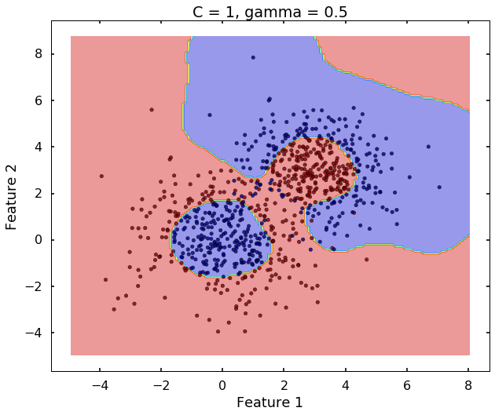

>“你听过的最有哲理，也是你最喜欢的一句话是什么？”，他问。 “我也不知道...”，她淡淡的说道。
***

## 一、对偶算法
&emsp;&emsp;**在**本系列的第（3）篇中，我们证明了分割超平面的存在性和唯一性，这章我们来看看如何求解这个分割超平面。我们先来看看要求解的最优化问题，如下式：

$$
\begin{cases}
\min \limits\_{w,b}{\frac{1}{2} {||w||}}^2\\\\
y_i \lgroup {\vec w} · \vec x_i + {b} \rgroup - 1  \geq 0, \ \ i = 1,2,···,N
\end{cases}
\tag{\*2 - 14}
$$

&emsp;&emsp;为了求解该凸优化问题，先构造出其广义拉格朗日函数（见本博客“拉格朗日对偶问题”专栏），如下式1-1：

$$
L(\vec w, \vec \alpha, b) = {\frac{1}{2} {||w||}}^2 - { \sum\_{i=1}^N \alpha\_i  y\_i (\vec w · \vec x\_i + b) } +  { \sum\_{i=1}^N \alpha\_i }
\tag{1 - 1}
$$

&emsp;&emsp;这里有一点要特别说明：上式中的第二项表明，每一个输入样本都可以成为一个不等式（或等式）约束，**每一个样本对应一个唯一的拉格朗日乘子$\alpha\_i$，请务必牢记这一点，它将有助于你理解下文**。
&emsp;&emsp;由拉格朗日对偶问题（见本博客[“拉格朗日对偶问题”专栏](https://flat2010.github.io/2017/07/02/拉格朗日对偶问题)）可知，原始问题的解转化为如下问题的解：

$$
\max \limits\_{\vec \alpha} \min \limits\_{w,b}{L(\vec w, \vec \alpha, b)}
\tag{1 - 2}
$$

&emsp;&emsp;欲求解该问题，要先求解$L(\vec w, \vec \alpha, b)$对$\vec w, b$的极小值，再求对$\vec \alpha$的极大值。

### 1.1 求极小值
&emsp;&emsp;要求$\min \limits\_{w,b}{L(\vec w, \vec \alpha, b)}$，利用高数的知识，只需要分别对$\vec w, b$求偏导并另其等于零即可求出极小值情况下$\vec w, b, \vec \alpha$这些未知变量需要满足的约束条件，即要求解如下两个方程：

$$
\nabla \_ \vec w L(\vec w, \vec \alpha, b) = 0
\tag{1 - 3}
$$

$$
\nabla \_ b L(\vec w, \vec \alpha, b) = 0
\tag{1 - 4}
$$

&emsp;&emsp;网上几乎所有资料在讲解上式（1 - 3）、(1 - 4)的时候，都是直接给出一个结果，并没有给出详细的证明和求解过程，大多数人在看的时候也是一眼带过，似乎认为得出这种结果是理所当然的，然而数学中从来就没有理所当然。
&emsp;&emsp;我们来看看式（1 - 3），式中要求的偏导是对一个**向量$\vec w$**，注意，$\vec w$是一个**向量**，是我们的权重系数向量$\vec w = (w\_1, \ w\_2, \ \dots)$，**不是一个标量（Scalar）！**我们在高数里面学的函数的极值问题求解，是针对某个标量而言的，非数学专业的同学可以回想下，你们大学学过函数对向量的偏导吗，没有吧？所以我们不能简单的把$\frac{1}{2} ||\vec w||^2$对向量$\vec w$的偏导按照对标量$w$的偏导的求解方法来做。
&emsp;&emsp;设输入的维度为$M$，则我们有权重向量$\vec w = (w\_1, \ w\_2, \ \dots, \ w\_M)$，则：

$$
\frac{1}{2} ||\vec w||^2 = \vec w · \vec w = w\_1^2 + w\_2^2 + \dots + w\_M^2
$$

&emsp;&emsp;于是有广义拉格朗日函数（1 - 1）第一项$\frac{1}{2} ||\vec w||^2$对向量$\vec w$的偏导如下（标量对向量的偏导的求解参见本博客的“概念定义杂记”专栏）：

$$
\begin{split}
\frac {\partial(\frac{1}{2} ||\vec w||^2)} {\partial \vec w} &= (\frac {\partial(\frac{1}{2} ||\vec w||^2)} {\partial w\_1}, \ \frac {\partial(\frac{1}{2} ||\vec w||^2)} {\partial w\_2}, \ \dots, \ \frac {\partial(\frac{1}{2} ||\vec w||^2)} {\partial w\_M}) \\\\
&= (\frac{1}{2} · 2w\_1, \ \frac{1}{2} · 2w_2, \ \dots, \ \frac{1}{2} · 2w\_M) \\\\
&= (w\_1, \ w_2, \ \dots, \ w\_M) \\\\
&= \vec w
\end{split}
\tag{1 - 5}
$$

&emsp;&emsp;我们再来看式（1 - 1）的第二项，${ \sum\_{i=1}^N \alpha\_i  y\_i (\vec w · \vec x\_i + b) }$，该项又可以拆分成两项${ \sum\_{i=1}^N \alpha\_i · y\_i · \vec w · \vec x\_i}$及${ \sum\_{i=1}^N \alpha\_i · y\_i · b}$，后一项因为不包含与$\vec w$相关的内容，因此根据标量对向量的求导法则，该项对向量$\vec w$的偏导恒为零向量，因此我们直接忽略这项，直接看第一项的结果。

$$
\begin{split}
{\sum\_{i=1}^N \alpha\_i · y\_i · \vec w · \vec x\_i} &= \alpha\_1 · y\_1 · \vec w · \vec x\_1 + \alpha\_2 · y\_2 · \vec w · \vec x\_2 + \dots + \alpha\_N · y\_N · \vec w · \vec x\_N \\\\
\end{split}
\tag{1 - 6}
$$

&emsp;&emsp;为了方便书写，我们把上式记作$g(\vec w, \ \vec \alpha)$，于是根据标量对向量的偏导法则有：

$$
\begin{split}
\frac{\partial [g(\vec w, \ \vec \alpha)]}{\partial \vec w} &= \alpha\_1 · y\_1 \frac{\partial (\vec w · \vec x\_1)}{\partial \vec w} + \alpha\_2 · y\_2 \frac{\partial (\vec w · \vec x\_2)}{\partial \vec w} + \dots + \alpha\_N · y\_N  \frac{\partial (\vec w · \vec x\_N)}{\partial \vec w} \\\\
&= \sum\_{i=1}^N \alpha\_i · y\_i \frac{\partial (\vec w · \vec x\_i)}{\partial \vec w} \\\\
&= \sum\_{i=1}^N \alpha\_i · y\_i \frac{\partial (w\_1 · x\_i^1 + w\_2 · x\_i^2 + \dots + w\_M · x\_i^M)}{\partial \vec w} \\\\
&= \sum\_{i=1}^N \alpha\_i · y\_i (x\_i^1 , \ x\_i^2 , \ \dots , \ x\_i^M) \\\\
&= \sum\_{i=1}^N \alpha\_i · y\_i · \vec x\_i
\end{split}
\tag{1 - 7}
$$

&emsp;&emsp;注意：上式中$x\_i^k$表示的是第$i$个样本的第$k$个特征（或属性）的取值，而非$x\_i$的$k$次方。
&emsp;&emsp;我们再来看式（1 - 1）第三项${\sum\_{i=1}^N \alpha\_i }$，该项是由拉格朗日乘子组成的，不含与向量$\vec w$相关的项，同样由标量对向量的偏导法则，该项对向量$\vec w$求偏导后恒为零向量，即有$\frac{\partial ({\sum\_{i=1}^N \alpha\_i })}{\partial \vec w} \equiv 0$，我们同样忽略该项。
&emsp;&emsp;综上，我们有：

$$
\nabla \_ \vec w L(\vec w, \vec \alpha, b) = \vec w - \sum\_{i=1}^N \alpha\_i · y\_i · \vec x\_i
\tag{1 - 8}
$$

&emsp;&emsp;对于式（1 - 4），因为求的是对**标量b**的偏导，与我们在大学时候学的内容契合，这里就不赘述，可得到：

$$
\nabla \_ b L(\vec w, \vec \alpha, b) = \sum\_{i=1}^N \alpha\_i · y\_i
\tag{1 - 9}
$$

&emsp;&emsp;分别另式（1 - 8）、（1 - 9）等于零，即可求解出极值情况未知变量需要满足的约束条件，可得：

$$
\begin{cases}
\vec w = \sum\_{i=1}^N \alpha\_i · y\_i · \vec x\_i \\\\
\sum\_{i=1}^N \alpha\_i · y\_i = 0
\tag{1 - 10}
\end{cases}
$$

&emsp;&emsp;将上式回代入式（1 - 1），可以消掉未知变量$\vec w、b$。

### 1.2 回代化简
&emsp;&emsp;同样的，几乎所有对这部分的讲解都是一笔带过，让有些数学基础不怎么好的同学有点犯晕，不知道是怎么得出来的。这里我给出详细的回代化简过程，我们先来看$\frac{1}{2} ||\vec w||^2$这一项：

$$
\begin{split}
\frac{1}{2} ||\vec w||^2 &= \vec w · \vec w \\\\
&= \frac{1}{2} (\sum\_{i=1}^N \alpha\_i · y\_i · \vec x\_i) · (\sum\_{i=1}^N \alpha\_i · y\_i · \vec x\_i) \\\\
&= \frac{1}{2} (\alpha\_1 · y\_1 · \vec x\_1 + \dots + \alpha\_N · y\_N · \vec x\_N) · (\alpha\_1 · y\_1 · \vec x\_1 + \dots + \alpha\_N · y\_N · \vec x\_N)
\end{split}
\tag{1 - 11}
$$

&emsp;&emsp;上式展开出来后不进行同类项合并的话，一共有$N·N = N^2$项，为了方便书写和分析，我们把这些展开项按顺序放在一个$N·N$的方阵$A$中，矩阵的元素$A\_{ij}$表示上式中第一个括号中的第$i$项与后面括号的第$j$项相乘的结果，可得：

$$
\begin{split}
A &= \frac{1}{2} 
\begin{bmatrix}
\alpha\_1 y\_1 \vec x\_1 · \alpha\_1 y\_1 \vec x\_1 & \alpha\_1 y\_1 \vec x\_1 · \alpha\_2 y\_2 \vec x\_2 & \dots & \alpha\_1 y\_1 \vec x\_1 · \alpha\_N y\_N \vec x\_N \\\\
\alpha\_2 y\_2 \vec x\_2 · \alpha\_1 y\_1 \vec x\_1 & \alpha\_2 y\_2 \vec x\_2 · \alpha\_2 y\_2 \vec x\_2 & \dots & \alpha\_2 y\_2 \vec x\_2 · \alpha\_N y\_N \vec x\_N \\\\
\vdots & \vdots & \vdots & \vdots \\\\
\alpha\_N y\_N \vec x\_N · \alpha\_1 y\_1 \vec x\_1 & \alpha\_N y\_N \vec x\_N · \alpha\_2 y\_2 \vec x\_2 & \dots & \alpha\_N y\_N \vec x\_N · \alpha\_N y\_N \vec x\_N \\\\
\end{bmatrix} \\\\
\\\\
&= \frac{1}{2} 
\begin{bmatrix}
\alpha\_1^2 y\_1^2 \vec x\_1 · \vec x\_1 & \alpha\_1 \alpha\_2 y\_1 y\_2 \vec x\_1 · \vec x\_2 & \dots & \alpha\_1 \alpha\_N y\_1 y\_N \vec x\_1 · \vec x\_N \\\\
\alpha\_1 \alpha\_2 y\_1 y\_2 \vec x\_1 · \vec x\_2 & \alpha\_2^2 y\_2^2 \vec x\_2 · \vec x\_2 & \dots & \alpha\_2 \alpha\_N y\_2 y\_N \vec x\_2 · \vec x\_N \\\\
\vdots & \vdots & \vdots & \vdots \\\\
\alpha\_1 \alpha\_N y\_1 y\_N \vec x\_1 · \vec x\_2 & \alpha\_2 \alpha\_N y\_2 y\_N \vec x\_1 · \vec x\_N & \dots & \alpha\_N^2 y\_N^2 \vec x\_N · \vec x\_N \\\\
\end{bmatrix}
\end{split}
\tag{1 - 12}
$$

&emsp;&emsp;可以看出，这是一个对称阵，矩阵的任意元素为$\alpha\_i \alpha\_j y\_i y\_j (\vec x\_i · \vec x\_j), 其中\ i,j \in [1,N]$，因此有：

$$
\frac{1}{2} ||\vec w||^2 = \frac{1}{2} \sum\_{i=1}^N \sum\_{j=1}^N \alpha\_i \alpha\_j y\_i y\_j (\vec x\_i · \vec x\_j)
\tag{1 - 13}
$$

&emsp;&emsp;再来看第二项的化简，结合式（1 - 10)，如下：

$$
\begin{split}
{\sum\_{i=1}^N \alpha\_i  y\_i (\vec w · \vec x\_i + b) } &= {\sum\_{i=1}^N \alpha\_i  y\_i (\vec w · \vec x\_i) } + b{ \sum\_{i=1}^N \alpha\_i  y\_i} \\\\
&= {\sum\_{i=1}^N \alpha\_i  y\_i ((\sum\_{j=1}^N \alpha\_j · y\_j · \vec x\_j) · \vec x\_i) } + b · 0 \\\\
&= \sum\_{j=1}^N \alpha\_i y\_i(\alpha\_1 y\_1 \vec w · \vec x\_1 + \alpha\_2 y\_2 \vec w · \vec x\_2 + \dots + \alpha\_N y\_N \vec w · \vec x\_N) · \vec x\_i \\\\
&= \sum\_{i=1}^N \sum\_{j=1}^N \alpha\_i \alpha\_j y\_i y\_j (\vec x\_i · \vec x\_j)
\end{split}
\tag{1 - 14}
$$

&emsp;&emsp;最后来看第三项${\sum\_{i=1}^N \alpha\_i }$，该项已是最简形式，保持不变。
&emsp;&emsp;综上，我们有：

$$
\begin{split}
\min \limits\_{\vec w, b} L(\vec w, \vec \alpha, b) &= \frac{1}{2} \sum\_{i=1}^N \sum\_{j=1}^N \alpha\_i \alpha\_j y\_i y\_j (\vec x\_i · \vec x\_j) - \sum\_{i=1}^N \sum\_{j=1}^N \alpha\_i \alpha\_j y\_i y\_j (\vec x\_i · \vec x\_j) + \sum\_{i=1}^N \alpha\_i \\\\
&= -\frac{1}{2} \sum\_{i=1}^N \sum\_{j=1}^N \alpha\_i \alpha\_j y\_i y\_j (\vec x\_i · \vec x\_j) + \sum\_{i=1}^N \alpha\_i
\end{split}
\tag{1 - 15}
$$

### 1.3 求极大值
&emsp;&emsp;更进一步，式（1 - 2）的对偶问题就是上式再对$\vec \alpha$极大化，如下：

$$
\max \limits\_{\vec \alpha} \lbrack -\frac{1}{2} \sum\_{i=1}^N \sum\_{j=1}^N \alpha\_i \alpha\_j y\_i y\_j (\vec x\_i · \vec x\_j) + \sum\_{i=1}^N \alpha\_i \rbrack
\tag{1 - 16}
$$

&emsp;&emsp;当然，上式的$\vec \alpha$还需要满足约束条件：

$$
\begin{cases}
\sum\_{i=1}^N \alpha\_i y\_i = 0 \\\\
\\\\
\alpha\_i \geq 0, \ i=1,2, \dots, N
\end{cases}
\tag{1 - 17}
$$

&emsp;&emsp;上式的求解，也是利用构造拉格朗日函数，然后分别对各个拉格朗日乘子求偏导并令偏导式等于零，即可求解出各个拉格朗日乘子的值，即可以求出$\vec \alpha = {\alpha\_1, \ \alpha\_2, \ \dots, \ \alpha\_N}$，利用$\vec \alpha$以及式（1 - 10），我们就可以求出分割超平面的参数$\vec w^\*$。对于式（1 - 10）：

$$
\begin{split}
\vec w &= \sum\_{i=1}^N \alpha\_i · y\_i · \vec x\_i \\\\
&= \alpha\_1 y\_1 \vec x\_1 + \ \alpha\_1 y\_2 \vec x\_2 + \ \dots + \ \alpha\_N y\_N \vec x\_N
\end{split}
\tag{1 - 18}
$$

&emsp;&emsp;由上式可知，对于$\alpha_i = 0$的拉格朗日乘子（约束不起作用），它对整个式子的贡献值$\equiv 0$，因此无论这些乘子取什么值，都不会影响分割超平面，因此我们再计算的时候也只需要代入$\alpha\_i > 0$的拉格朗日乘子。这里要多说一句，该系列的前一篇[机器学习算法系列之三：SVM3](2017/04/30/机器学习算法系列之三：SVM3)中我们已经证明了$\vec w^\*$的存在性，并且$\vec w^\* = 0$并非问题的解，因此必然存在$\alpha\_j > 0, \ j \in [1, N]$，即至少有一项不等式（或等式）约束是起作用的。
&emsp;&emsp;求出$\vec w$后，结合$\vec \alpha$的值，再根据**KKT条件**的**互补松弛$\alpha\_i [y\_i(\vec w^\* · x\_i + b^\*) - 1] = 0$**，可以求解出分割超平面参数$b^\*$，这样整个分割超平面$H(\vec w, b)$就确定了。对$\vec b^\*$的求解，由互不松弛条件可知：

#### 1.3.1 $\alpha\_i = 0$
&emsp;&emsp;当$\alpha\_i = 0$即对应的第$i$个样本约束不起作用时，则$\vec b^\*$可取任意值而互不松弛条件均能满足，这个时候$\vec b^\*$有任意多个解，因此无法由拉格朗日乘子为零的样本来计算$\vec b^\*$。

#### 1.3.2 $\alpha\_i > 0$
&emsp;&emsp;当$\alpha\_i = 0$即对应的第$i$个样本约束起作用时，要满足互不松弛条件，则必然有：

$$
y\_i(\vec w^\* · x\_i + b^\*) - 1 = 0
\tag{1 - 19}
$$

&emsp;&emsp;此时可以利用不为零的拉个朗日乘子求出$\vec b^\*$，如下：

$$
\begin{split}
y\_i[y\_i(\vec w^\* · x\_i + b^\*) - 1] &= y\_i · 0 \\\\
y\_i^2(\vec w^\* · x\_i + b^\*) - y\_i &= 0
\end{split}
$$

&emsp;&emsp;$\because$
&emsp;&emsp;&emsp;&emsp;$y\_i^2 \equiv 1, \ \vec w^\* = \sum\_{j=1}^N \alpha\_j · y\_j · \vec x\_j$
&emsp;&emsp;$\therefore$

$$
\begin{split}
& (\vec w^\* · x\_i + b^\*) = y\_i \\\\
& b^\* = y\_i - \vec w^\* · x\_i \\\\
& b^\* = y\_i - \sum\_{j=1}^N \alpha\_j · y\_j · \vec x\_j · x\_i
\end{split}
\tag{1 - 20}
$$

&emsp;&emsp;到此，整个超平面的参数$\vec w^\*、b^\*$就解出来了。

### 1.4 求解过程梳理
&emsp;&emsp;SVM的分割超平面的求解就讲完了（严格来说是**线性可分SVM**的分割超平面），**因为这部分内容实在是太重要了，它是我们深入理解SVM精髓的基石**，所以我们重新把分割超平面的求解算法梳理一下，方便大家回顾之前的内容和平滑的切入到下一章的内容。

* 确定样本特征属性维度M，确定样本数量N；
* 根据样本数量确定拉格朗日乘子数量N，并设拉格朗日乘子向量为$\vec \alpha = (\alpha\_1, \ \alpha\_2, \ \dots, \ \alpha\_N)$;
* 求函数$-\frac{1}{2} \sum\_{i=1}^N \sum\_{j=1}^N \alpha\_i \alpha\_j y\_i y\_j (\vec x\_i · \vec x\_j) + \sum\_{i=1}^N \alpha\_i$在给定条件$\sum\_{i=1}^N \alpha\_i y\_i = 0$及$\alpha\_i \geq 0, \ i=1, 2, 3, \dots, N$下的极值点（注意：极值点有可能在边界上取得。）；
* 利用上一步求得的解$\vec \alpha^\* = (\alpha\_1^\*, \ \alpha\_2^\*, \ \dots, \ \alpha\_N^\*$计算$\vec w^\* = \sum\_{i=1}^N \alpha\_i · y\_i · \vec x\_i$；
* 取任意一个**非零拉格朗日乘子$\alpha\_i$**对应的样本$(\vec x\_i , y\_i)$计算$b^\* = y\_i - \sum\_{j=1}^N \alpha\_j · y\_j · \vec x\_j · x\_i$；
* 利用上述结果得出分割超平面方程$\vec w^\* · \vec x + b^\* = 0$。

### 1.5\* 极大转极小转化
&emsp;&emsp;顺便提一句，上述极大化问题还可以转换为如下的极小化问题，本质没有发生任何变化：

$$
\begin{cases}
\min \limits\_{\vec \alpha} \lbrack \frac{1}{2} \sum\_{i=1}^N \sum\_{j=1}^N \alpha\_i \alpha\_j y\_i y\_j (\vec x\_i · \vec x\_j) - \sum\_{i=1}^N \alpha\_i \rbrack \\\\
\\\\
\sum\_{i=1}^N \alpha\_i y\_i = 0 \\\\
\\\\
\alpha\_i \geq 0, \ i=1,2, \dots, N
\end{cases}
\tag{1 - 21}
$$

### 1.6 实例
&emsp;&emsp;理论比较抽象，我们用一个例子来说明上述求解过程，帮助理解消化。注：以下例子选自[李航](http://blog.sina.com.cn/u/2060750830)老师的《统计学习方法》P107的例2，略有改动和补充说明
#### 1.6.1 已知条件
&emsp;&emsp;三个样本点$x\_1 = (3,3)^T, \ x\_2 = (4,3)^T, \ x\_3 = (1,1)^T $，两个正样本$y\_1 = +1, \ y\_2 = +1$，一个负样本$y\_3 = -1$。
#### 1.6.2 解决问题
&emsp;&emsp;利用1.4节的求解算法求出分割超平面。
#### 1.6.3 求解过程
- 特征向量维度$M = 2$，样本数量$N = 3$；

- 设拉格朗日乘子向量$\vec \alpha = (\alpha\_1, \ \alpha\_2, \  \alpha\_3)$;

- 求$\max \limits\_{\vec \alpha} \lbrack -\frac{1}{2} \sum\_{i=1}^3 \sum\_{j=1}^3 \alpha\_i \alpha\_j y\_i y\_j (\vec x\_i · \vec x\_j) + \sum\_{i=1}^3 \alpha\_i \rbrack$在限制条件$\alpha\_1, \ \alpha\_2, \ \alpha\_3 \in [0, \ +\infty) $及$\alpha\_1 · (+1) + \alpha\_2 · (+1)  + \alpha\_3 · (-1)  = \alpha\_1 + \alpha\_2  - \alpha\_3  = 0$下的极值:
  
  $$
  \begin{split}
  & \max \limits\_{\vec \alpha} \lbrack -\frac{1}{2} \sum\_{i=1}^3 \sum\_{j=1}^3 \alpha\_i \alpha\_j y\_i y\_j (\vec x\_i · \vec x\_j) + \sum\_{i=1}^3 \alpha\_i \\\\
  &= -\frac{1}{2} (18 \alpha\_1^2 + 25 \alpha\_2^2 + 2 \alpha\_3^2 + 42 \alpha\_1 \alpha\_2 - 12 \alpha\_1 \alpha\_3 - 14 \alpha\_2 \alpha\_3) - \alpha\_1 - \alpha\_2 - \alpha\_3
  \end{split}
  \tag{1 - 22}
  $$
  ​
  ​&emsp;&emsp;记上式为$f(\alpha\_1 , \alpha\_2 , \alpha\_3)$，将$\alpha\_3 = \alpha\_1 + \alpha\_2$有：
  ​
  $$
  f(\alpha\_1 , \alpha\_2 , \alpha\_3) = -4 \alpha\_1^2 - \frac{13}{2} \alpha\_2^2 - 10 \alpha\_1 \alpha\_2 + 2\alpha\_1 + 2 \alpha\_2
  \tag{1 - 23}
  $$

  ​&emsp;&emsp;求偏导有：
  
  $$
  \begin{split}
  \begin{cases}
  \frac{\partial f(\alpha\_1 , \alpha\_2 , \alpha\_3)}{\partial \alpha\_1} = -8 \alpha\_1 - 10 \alpha\_2 + 2= 0 \\\\
  \frac{\partial f(\alpha\_1 , \alpha\_2 , \alpha\_3)}{\partial \alpha\_2} = -13 \alpha\_2 - 10 \alpha\_1 + 2= 0
  \end{cases}
  \end{split}
  \tag{1 - 24}
  $$
  
  ​&emsp;&emsp;联立上式得唯一解：
  
  $$
  \begin{cases}
  \alpha\_1 = \frac{3}{2} \\\\
  \alpha\_2 = -1
  \end{cases}
  $$
  
  &emsp;&emsp;虽然求出了解，但是该解对应的$\alpha\_2$不满足约束$\alpha\_2$，因此极大值必然在边界处。因为拉个朗日乘子的取值范围都是$[0 , \ +\infty)$，显然拉个朗日乘子不可能取右边界$+\infty$，因此必然在左边界即0处取极值。

- ​若$\alpha\_1 = 0$，则$f(\alpha\_1 , \alpha\_2 , \alpha\_3) = - \frac{13}{2} \alpha\_2^2 + 2 \alpha\_2$，再用该式对$\alpha\_2$求一阶、二阶偏导可求出极大值点为$\alpha\_2 = -\frac{2}{13}$，不符合拉格朗日乘子恒为非负的条件，因此极大值不在此处。

### 1.7 小结
&emsp;&emsp;从上述过程可以看出，SVM分割超平面的求解是先把不易求解的原始**极小极大最优化问题**转换为易于求的**极大极小最优化问题**。
&emsp;&emsp;转换后，通过先求解极小化问题，求解出超平面参数$\vec w, b$与拉格朗日乘子$\vec \alpha$的关系，从而消去原最优化问题中的未知变量$\vec w, b$，只剩下$\vec \alpha$。
&emsp;&emsp;消元后，再求解极大化(也可以转换为求极小化)问题的解，从而求出$\vec \alpha$。
&emsp;&emsp;求出$\vec \alpha$后即可求出分割超平面。

## 二、支持向量
&emsp;&emsp;
&emsp;&emsp;
