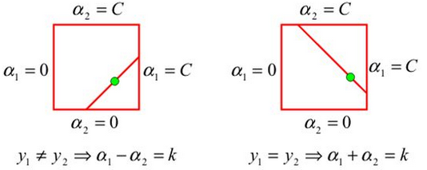
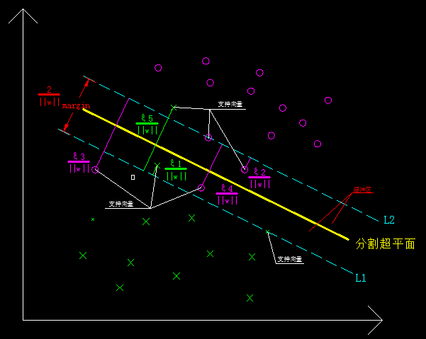
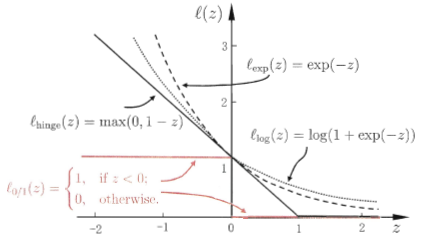
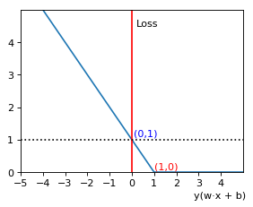

>水至清则无鱼！

***

## 一、线性非可分
### 1.1 可分 *VS* 非可分
&emsp;&emsp;前面章节中我们讨论的分割面的求解均是在数据**线性可分**的条件下进行的，与该条件对应的数学表达式为：

$$
y_i \lgroup {\vec w} · \vec x_i + {b} \rgroup - 1  \geq 0, \ \ i = 1,2,···,N
\tag{1 - 1}
$$

&emsp;&emsp;这个限制条件对应的几何含义就是：**所有数据都能被准确的进行分类。**这个条件对我们简化问题，抽象出数学模型非常有用，但是在面对实际业务的时候却显得非常乏力，因为现实生活中我们所处理的数据几乎都是线性不可分甚至非线性的。这个时候如果不对式（1-1）做调整（改动）的话，会造成两方面的影响：

- 条件过于严格导致方程组在实数域无解，即找不到满足要求的分割面；
- 实数域中求出了分割面（训练数据集线性可分），但是模型泛化能力非常差（使用的时候遇到了线性非可分数据）。

&emsp;&emsp;以上问题，用一句古话总结就是：

> 水至清则无鱼 人至察则无徒

#### 1.1.1 相同点
&emsp;&emsp;线性可分和线性不可分二者建立起来的模型均是线性分类模型。
&emsp;&emsp;数学模型、理论基础是一致的，解决的技术方案（均转换为拉格朗日对偶问题解决）也相同。

#### 1.1.2 不同点
&emsp;&emsp;线性可分模型只能解决线性可分的问题，而线性非可分模型则可以解决所有线性问题（包含了线性可分、线性非可分）。
&emsp;&emsp;线性可分是基础，线性非可分是扩展。
&emsp;&emsp;线性可分使用硬间隔作为优化目标，线性非可分使用软间隔（引入了松弛变量、惩罚系数）作为优化目标。

### 1.2 解决之道
#### 1.2.1 松弛变量
&emsp;&emsp;为了让我们学习出的模型能够处理线性非可分数据，同时增强模型的泛化能力，我们就需要适当的放松间隔的限制条件。**允许少部分数据（噪点、离群点）到分割超平面的几何间隔不等于$\frac{1}{||\vec w||}$（不在间隔边界上），甚至为负（不在本类缓冲区中）。**
&emsp;&emsp;因此，我们针对训练集中的每一个样本点都引入一个调控参数，根据需要来调节数据点到分割超平面的距离，这个参数称为**松弛变量$\xi\_i \geq 0$**。于是原来的不等式约束变为下式：

$$
y\_i(\vec w \cdot \vec x\_i + b) \geq 1 - \xi\_i
\tag{1 - 2}
$$

#### 1.2.2 惩罚参数
&emsp;&emsp;引入松弛变量之后，线性非可分问题倒是解决了，却又引入了新的问题。松弛变量因为放宽了限制条件（允许某些点到分割超平面的距离小于1），其中一个类就很容易把另一个类的离群点（更靠近相反类）纳入自己的版图（因为这样会使得函数间隔最大，同时也能满足不等式约束条件），这样就会导致误分类。
&emsp;&emsp;为了解决这个问题，我们就需要对松弛变量做一些约束，具体办法是对引入的每一个松弛变量，我们都让它支付一个等值的代价（我姑且把它称作**松弛代价**，注意是一个非官方术语。）即$\xi \_i$，同时引入一个称为**惩罚参数$C（C > 0）$**的约束参数，来调节对于误分类的容忍程度。
&emsp;&emsp;把惩罚参数、松弛代价整合到目标函数后有：

$$
\min \limits\_{w,b,\xi}{\frac{1}{2} {||\vec w||}}^2 + C\sum\_{i=1}^N \xi\_i\\\\
\tag{1 - 3}
$$

&emsp;&emsp;上式中第一项的优化目标是使得间隔尽量最大，而第二项的求和式优化目标则是使得误分类的点数目尽量最少（松弛代价最小）。
&emsp;&emsp;很明显，对于线性非可分数据来说，因为存在数据交叉，所以间隔越大，误分类的点越多。误分类点越少，必然要求间隔越小。两者处于一种**鱼和熊掌不可兼得的**矛盾状态。
&emsp;&emsp;C作为一个调和参数，平衡着这两者的矛盾关系。C越大，误分类的惩罚越强（代价越高，越在意误分类），表示我们更偏向于学习出一个分类准确率更高的模型；C越小，误分类的惩罚越弱（代价越低，越在意），表示我们更偏向于学习出一个泛化能力更强的模型。
&emsp;&emsp;另外需要补充的一点是，惩罚系数C是作为**超参数**存在的，因此没有加到目标函数中。

#### 1.2.3 求解目标
&emsp;&emsp;最后，我们的线性非可分问题要求解的即是如下凸二次规划问题：

$$
\begin{cases}
\min \limits\_{w,b,\xi}{\frac{1}{2} {||\vec w||}}^2 + C\sum\_{i=1}^N \xi\_i, \ C > 0\\\\
\\\\
y_i \lgroup {\vec w} · \vec x_i + {b} \rgroup - (1 - \xi\_i) \geq 0, \ \ i = 1,2,···,N \\\\
\\\\
\xi\_i \geq 0, \ i=1,2,\cdots,N \\\\
\end{cases}
\tag{1 - 4}
$$

#### 1.2.4 软间隔
&emsp;&emsp;我们把引入了松弛变量、惩罚参数之后的间隔，称为**软间隔**，它是相对于之前线性可分问题的**硬间隔**而言的，意思就是该间隔相对来说限制条件没那么严格。
&emsp;&emsp;上式（1-4）对应的问题也称为**软间隔最大化问题**，由软件隔最大化学习出来的SVM我们称为**线性支持向量机**。
&emsp;&emsp;需要补充说明的一点是，由硬间隔最大化学习出来的SVM我们称为**线性可分支持向量机**，显然，**线性支持向量机**包含了**线性可分支持向量机**，是一个更综合性的称谓。

### 1.3 求证之路
&emsp;&emsp;
#### 1.3.1 存在性证明
&emsp;&emsp;关于线性非可分问题的存在性证明与线性可分问题类似，这里就不赘述了。

#### 1.3.2 唯一性证明
&emsp;&emsp;关于线性可分问题的唯一性证明，《统计学习方法》一书中一笔带过，并没有给出详细的证明过程，网上也没有找到相应的资料。目前我还没有完全证明出来，后续证明了再来补齐，这里只贴出结论：
- 权重系数向量$\vec w$的值时唯一的；
- 偏置系数**$b$的值可能不唯一，存在于一个区间**。

#### 1.3.3 求解思路
&emsp;&emsp;与线性可分问题的求解思路一致，我们仍然要先利用KKT条件将原始问题转换为等价的对偶问题，然后再对转换后的对偶问题进行求解，即可得到分割超平面 。
##### 1.3.3.1 广义拉格朗日函数
&emsp;&emsp;先根据式（1-4）构造出对应的广义拉格朗日函数如下：

$$
L(\vec w, b, \vec \xi, \vec \alpha, \vec \beta) =  {\frac{1}{2} {||w||}}^2 + C\sum\_{i=1}^N \xi\_i - { \sum\_{i=1}^N \alpha\_i  [y\_i (\vec w · \vec x\_i + b) - (1 - \xi\_i)]} -  { \sum\_{i=1}^N \beta\_i \xi\_i }
\tag{1 - 5}
$$

&emsp;&emsp;式中，$\alpha\_i \geq 0, \ \beta\_i \geq 0$。另外需要补充的是，构造此广义拉个朗日函数后的附加等式条件如下：

$$
\begin{split}
\begin{cases}
& y_i \lgroup {\vec w} · \vec x_i + {b} \rgroup - (1 - \xi\_i) = 0 \\\\
\\\\
& \beta\_i \cdot\xi\_i = 0
\end{cases}
\end{split}
$$

##### 1.3.3.2 对偶问题
&emsp;&emsp;由前面章节的论述可知，原始问题的对偶问题是其广义拉格朗日函数的极大极小问题，即$\max \limits\_{\alpha} \min \limits\_{\vec w, \vec b,\vec \xi} L(\vec w, \vec b,\vec \xi, \vec \alpha, \vec \beta)$。

##### 1.3.3.3 极小值
&emsp;&emsp;先求极小值问题。将广义拉格朗日函数对$\vec w、b、\vec \xi$分别求偏导有：

$$
\begin{cases}
\begin{split}
&\nabla \_{\vec w} L(\vec w, \vec b,\vec \xi, \vec \alpha, \vec \beta) = \vec w - \sum\_{i=1}^N \alpha\_i y\_i \vec x\_i \\\\
&\nabla \_b L(\vec w, \vec b,\vec \xi, \vec \alpha, \vec \beta) = - \sum\_{i=1}^N \alpha\_i y\_i \\\\
&\nabla \_{\vec \xi} L(\vec w, \vec b,\vec \xi, \vec \alpha, \vec \beta) = \vec C - \vec \alpha - \vec \beta
\end{split}
\end{cases}
\tag{1 - 6}
$$

&emsp;&emsp;注意，上式中$\vec C = \underbrace{(C, C, \cdots, C)^T}\_{N}$，是以惩罚系数C为基本元素的N维常数向量。
&emsp;&emsp;然后分别另上式（1-6）的三个偏导数等于零，有：

$$
\begin{cases}
\begin{split}
& \vec w - \sum\_{i=1}^N \alpha\_i y\_i \vec x\_i = \vec 0\\\\
& \sum\_{i=1}^N \alpha\_i y\_i = 0\\\\
& \vec C - \vec \alpha - \vec \beta = \vec 0
\end{split}
\end{cases}
\tag{1 - 7}
$$

&emsp;&emsp;然后我们将上式（1-7）回代到式（1-5）的广义拉格朗日函数中，并对其进行化简，有：

$$
\begin{split}
& L(\vec w, \vec b,\vec \xi, \vec \alpha, \vec \beta)\\\\
&= \underbrace{ {\frac{1}{2} {||w||}}^2 - { \sum\_{i=1}^N \alpha\_i  y\_i (\vec w · \vec x\_i + b) } +  { \sum\_{i=1}^N \alpha\_i }}\_{线性可分情况下的广义拉格朗日函数} + C\sum\_{i=1}^N \xi\_i - \sum\_{i=1}^N \alpha\_i \xi\_i - \sum\_{i=1}^N \beta\_i \xi\_i \\\\
&= \underbrace{ {\frac{1}{2} {||w||}}^2 - { \sum\_{i=1}^N \alpha\_i  y\_i (\vec w · \vec x\_i + b) } +  { \sum\_{i=1}^N \alpha\_i }}\_{线性可分情况下的广义拉格朗日函数} + \sum\_{i=1}^N (C - \alpha\_i - \beta\_i) \xi\_i\\\\
&= \underbrace{ {\frac{1}{2} {||w||}}^2 - { \sum\_{i=1}^N \alpha\_i  y\_i (\vec w · \vec x\_i + b) } +  { \sum\_{i=1}^N \alpha\_i }}\_{线性可分情况下的广义拉格朗日函数} + \underbrace{(\vec C - \vec \alpha - \vec \beta)}\_{\vec 0} \cdot \vec \xi\\\\
&=  -\frac{1}{2} \sum\_{i=1}^N \sum\_{j=1}^N \alpha\_i \alpha\_j y\_i y\_j (\vec x\_i · \vec x\_j) + \sum\_{i=1}^N \alpha\_i
\end{split}
\tag{1 - 8}
$$

&emsp;&emsp;由上式可以看出，**线性非可分情况下的广义拉个朗日函数和线性可分情况下的广义拉格朗日函数的极小值问题求解结果是等价的**，即有如下结果：

$$
\underbrace{\min \limits\_{\vec w, \vec b} L(\vec w, \vec b, \vec \alpha)}\_{线性可分极小值}= \underbrace{\min \limits\_{\vec w, \vec b,\vec \xi} L(\vec w, \vec b,\vec \xi, \vec \alpha, \vec \beta)}\_{线性非可分极小值}= -\frac{1}{2} \sum\_{i=1}^N \sum\_{j=1}^N \alpha\_i \alpha\_j y\_i y\_j (\vec x\_i · \vec x\_j) + \sum\_{i=1}^N \alpha\_i
\tag{1 - 9}
$$

##### 1.3.3.4 极大值
&emsp;&emsp;求出极小值问题后，我们再来求解线性非可分情况下的极大值，即求解下列问题：

$$
\max \limits\_{\vec \alpha} [-\frac{1}{2} \sum\_{i=1}^N \sum\_{j=1}^N \alpha\_i \alpha\_j y\_i y\_j (\vec x\_i · \vec x\_j) + \sum\_{i=1}^N \alpha\_i] \\\\
\tag{1 - 10}
$$

&emsp;&emsp;当然，上式的$\vec \alpha$还必须要满足如下的约束条件：

$$
\begin{split}
\begin{cases}
\sum\_{i=1}^N \alpha\_i y\_i = 0\\\\
\\\\
\vec C - \vec \alpha - \vec \beta = \vec 0, \ C > 0 \\\\
\\\\
\alpha\_i \geq 0, \ \ \beta\_i \geq 0, \ i=1,2, \cdots, N
\end{cases}
\end{split}
\tag{1 - 11}
$$

&emsp;&emsp;因为要求对$\vec \alpha$的极大值问题，所以我们要消去上式中的$\vec \beta$，$C$是一个常数，不用理会。根据上式（1-11）的最后两个式子可求得：

$$
\begin{split}
\begin{cases}
\sum\_{i=1}^N \alpha\_i y\_i = 0\\\\
\\\\
0 \leq \alpha\_i \leq C, \ i=1,2, \cdots, N
\end{cases}
\end{split}
\tag{1 - 12}
$$

&emsp;&emsp;当然，我们如果保留$\beta\_i$而消掉$\alpha\_i$的话，可以得到关于$\beta\_i$的取值范围为：$\beta\_i \in [0, \ C]$。
&emsp;&emsp;从上式可以看出，相比于线性可分SVM（$\alpha\_i \in [0, \ \infty)$），线性非可分SVM的拉格朗日乘子$\alpha\_i$的取值区间多了一个上限约束（$\alpha\_i \in [0, \ C]$），这个上限约束正好是我们的惩罚参数。
&emsp;&emsp;从上式（1-12）可以看出，线性非可分情况下的极大值求解与线性可分情况下的极大值求解思路是一样的，仅仅是其拉格朗日乘子多了一个上限约束而已。利用式（1-12）的约束等式（第一个式子），我们可以用$N$个朗格朗日乘子中的$N-1$个去表示剩下的一个，回代到式（1-10）中，然后分别对$N-1$个拉格朗日乘子求偏导并另其等于零，从而得到$N-1$个等式。于是我们就可以解出所有的拉格朗日乘子，即我们的$\alpha\_i^\*,\  i=1,2, \cdots, N$。

##### 1.3.3.5 $\vec w^\*$求解
&emsp;&emsp;求出$\vec \alpha^\*$后，根据式（1-7）的第一个等式，可求得我们的权重系数向量，如下：

$$
\begin{split}
\vec w^\* &= \sum\_{i=1}^N \alpha\_i^\* · y\_i · \vec x\_i \\\\
&= \alpha\_1^\* y\_1 \vec x\_1 + \ \alpha\_2^\* y\_2 \vec x\_2 + \ \dots + \ \alpha\_N^\* y\_N \vec x\_N
\end{split}
\tag{1 - 13}
$$

&emsp;&emsp;与线性可分情况类似，对于$\vec \alpha^\* = 0$的点，不影响分割超平面的参数$\vec w^\*$。

##### 1.3.3.6 $\vec \beta\_i^\*$求解
&emsp;&emsp;求出$\vec \alpha^\*$后，我们再根据条件$\vec C - \vec \alpha - \vec \beta = \vec 0$可以求得$\beta\_i^\*$如下：

$$
\beta\_i^\* = C - \alpha\_i^\*, \ i=1,2, \cdots, N
\tag{1 - 14}
$$

##### 1.3.3.7 $\xi\_i^\*$求解
&emsp;&emsp;求出$\beta\_i^\*$后，我们再根据构造广义拉个朗日函数时的条件$\beta\_i^\* \cdot \xi\_i^\* = 0$对$\xi\_i^\*$的解讨论如下：
&emsp;&emsp;1. 当$\beta\_i^\* = 0$时，$\xi\_i^\*$可以取任意值（当然还要满足其它约束条件）。
&emsp;&emsp;2. 当$\beta\_i^\* \neq 0$时，$\xi\_i^\* \equiv 0$，这时候只能取0。
&emsp;&emsp;综上，$\xi\_i^\*$的取值如下：

$$
\xi\_i^\* =
\begin{cases}
any,  \ \ \beta\_i^\* = 0 \\\\
\\\\
0,  \ \ \beta\_i^\* \neq 0 \\\\
\end{cases}
\tag{1 - 15}
$$

##### 1.3.3.8 $b^\*$求解
&emsp;&emsp;1. 与线性可分情况下的求解类似，当$\alpha\_i^\* = 0$时，即对应的样本点不起约束作用，此时$b^\*$取任意值都能满足，即有无穷个解。对应的几何含义是：当前点属于非支持向量，不参与分割超平面参数的决策，此时无法利用拉格朗日乘子求解$b^\*$。
&emsp;&emsp;2. 当$\alpha\_i^\* \neq 0 且 \alpha\_i^\* = C $时，有$\beta\_i^\* = 0$，此时$\xi\_i^\*$可取任意值，对应的几何含义是：当前点属于支持向量，并且位于缓冲区内，其松弛代价可根据模型需要选择任意值。此时我们仍然无法解出 $b^\*$，这样的点不受惩罚参数和松弛代价的影响。
&emsp;&emsp;**3. 当$\alpha\_i^\* \neq 0 且 \alpha\_i^\* \neq C $时（即$0 < \alpha\_i^\* < C）$，有$\beta\_i^\* \neq 0$，可知$\xi\_i^\* = 0$，对应的几何含义是：当前样本点在间隔边界上，严格满足最大间隔要求，因此其松弛代价为0。此时我们再根据线性非可分情况下的KKT条件得到：$y_i \lgroup {\vec w} · \vec x_i + {b} \rgroup - (1 - \xi\_i) = 0$，利用该条件可求得 $b^\*$**：

$$
\begin{split}
b^\* &= y\_i(1 - \xi\_i^\*) -  \vec w^\* · \vec x\_i \\\\
&= y\_i(1 - \xi\_i^\*) - \sum\_{j=1}^N \alpha\_j^\* · y\_j · \vec x\_j · \vec x\_i \\\\
&= y\_i - \sum\_{j=1}^N \alpha\_j^\* · y\_j · \vec x\_j · \vec x\_i
\end{split}
\tag{1 - 16}
$$

&emsp;&emsp;由上式可知，这种情况下的偏置参数$b^\*$的求解方法与线性可分的时候相同。不同的地方在于，线性可分情况下求解$b^\*$时，利用的是拉格朗日系数$\alpha\_i \neq 0$的点，而线性非可分情况下的求解，其要求更严格，用来求解的点必须同时满足$\alpha\_i \neq 0 且 \alpha\_i^\* \neq C $。
&emsp;&emsp;另外还需要注意的地方是，在[1.3.2小节](#singleton_prove)中我们提到了，$b^\*$的值可能并不唯一，所以最终计算出来的$b^\*$可能有多个值，**然而根据李航老师的说法，在实际应用中，我们很难遇到这种情况，一般都只会遇到上面所说的唯一解这种。**。
&emsp;&emsp;至此，线性非可分SVM的分割超平面参数$\vec w、b$均求解出来了，分割超平面的方程自然就可以得出了。

#### 1.3.4 再谈$\vec w^\*$
&emsp;&emsp;[1.3.3.5小节](#weight-anchor)中我们提到了，对求解出的拉格朗日乘子$\vec \alpha\_i^\* = 0$的点，它们不参与分割超平面参数$\vec w^\*$的决策。同时我们观察到，$\vec w^\*$的表达式中，并没有包含与松弛代价/松弛变量、惩罚参数有关的项，再结合[1.3.3.8小节](#bias-anchor)中$b^\*$的表达式可以看出，**数据集中存在的不满足最大间隔要求的这些点，并不会影响分割超平面的分布走向和形状，只影响分割超平面在整个空间中的分布位置！**

### 1.4 支持向量
#### 1.4.1 软间隔支持向量
&emsp;&emsp;线性非可分情况下的支持向量与线性可分情况下的略有不同，其支持向量不仅仅位于间隔边界上，还会存在于间隔之中，即我们本系列[第三篇](/2017/04/30/机器学习算法系列之三：SVM3/)文章中就提到过的**缓冲区**中，这种情况下的支持向量如下示意图所示：

图1-1　　线性非可分情况下支持向量示意图
 

#### 1.4.2 距离 VS 几何间隔
&emsp;&emsp;我们记支持向量到分割超平面、间隔边界的距离（绝对值）、几何间隔分别为（下同）$d\_{h}、d\_{b}、m\_{\gamma}$，可知几个参数的计算表达式为：

$$
\begin{cases}
\begin{split}
& d\_{h} = |1 - \xi\_i|\\\\
\\\\
& d\_{b} = \xi\_i \\\\
\\\\
& m\_{\gamma} = \frac{1}{||\vec w||} - \frac{\xi\_i}{||\vec w||} = \frac{1 - \xi\_i}{||\vec w||}
\end{split}
\end{cases}
\tag{1 - 17}
$$

&emsp;&emsp;备注：以上结果均由不等式（1-2）中的函数间隔$1 - \xi\_i$及函数间隔与几何间隔的关系推导而来。

#### 1.4.3 支持向量类型
&emsp;&emsp;如上图所示，线性非可分情况下的支持向量可以分成四种情况：位于间隔边界上、位于本类的缓冲区中、位于另一个类的缓冲区中，位于另一个类的族群中（另一间隔边界之后），下面我们针对这几种情况分类讨论。
##### 1.4.3.1 位于间隔边界
&emsp;&emsp;这种情况下的支持向量与我们之前讲的线性可分情况下的支持向量相同，此时的松弛代价$\xi\_i  \equiv 0$，其到分割超平面的距离为$\frac{1}{||\vec w||}$，上图中虚线L1、L2上的两个点就属于这种。为了方便叙述，我们给这种向量取个名字叫$强约束/标准支持向量^\*$。
&emsp;&emsp;这些右上角带`*`的名字是我们为了方便叙述所命名，仅在本系列文章通用，非官方/权威术语，后文不再说明，请知悉。
##### 1.4.3.2 位于本类缓冲区
&emsp;&emsp;这种情况下的支持向量，不能严格满足最大间隔的约束但偏差不大，此时的松弛代价$ 0 < \xi\_i  \leq 1$，它到分割超平面的距离小于1，同时≥0。我们称这种支持向量为$弱偏差支持向量^\*$，该类型支持向量如上图中$\xi\_1、\xi\_2$对应的点。
##### 1.4.3.3 位于另类缓冲区
&emsp;&emsp;这种情况下的支持向量，不仅不能严格满足最大间隔的约束，并且其偏差较大（但仍然处于缓冲区中，没有越过对面的间隔边界），此时的松弛代价$\xi\_i  > 1$，这时候它到分割超平面的距离为负。我们称这种支持向量为$强偏差支持向量^\*$，该类型支持向量如上图中$\xi\_4$对应的点。
##### 1.4.3.4 位于另类族群
&emsp;&emsp;这种情况下的支持向量，已经越过了对面的间隔边界，跑到另一个分类的族群中去了，此时的松弛代价$\xi\_i  > 2$，这种样本非常容易让模型产生误分类，也是我们训练模型的时候需要重点关注的对象。我们称这种支持向量为$全偏差支持向量^\*$，该类型支持向量如上图中$\xi\_5、\xi\_3$对应的点。

## 二、合页损失
### 2.1 再论原始优化问题
&emsp;&emsp;我们再来看看上述问题中提到的线性非可分支持向量机的求解的原始最优化问题，将其第一、第二项交换顺序后如下式：

$$
\min \limits\_{\vec w, b, \vec \xi} C\sum\_{i=1}^N \xi\_i + {\frac{1}{2}{||\vec w||}}^2
\tag{2 - 1}
$$

&emsp;&emsp;只看其形式，很容易让我们联想到正则化（参见《统计学习方法》$P\_{13} - P\_{14}$），参数向量的$L\_2$范数对应的正则化如下：

$$
\min \limits\_{\vec w, b, \lambda} \frac{1}{N} \sum\_{i=1}^N L[f(\vec x\_i;\vec w), \ y\_i] + \frac{\lambda}{2} ||\vec w||^2
\tag{2 - 2}
$$

&emsp;&emsp;这种相似并非巧合，实际上式（2-1）的第一项就是我们的**经验风险**，第二项就是我们的的**$L\_2$范数正则化项（或罚项）**，**原始优化问题实际上就是结构风险最小化策略的实现**。从而，$\xi\_i$即为我们的**损失函数**，即有：

$$
\xi\_i \sim L(Y, \ f(X))
\tag{2 - 3}
$$

&emsp;&emsp;然而在前面的内容中我们仅仅提到了$\xi\_i$是为了解决线性非可分问题而引入的松弛变量，仅仅讨论了**标准支持向量、强偏差支持向量、全偏差支持向量**所对应的松弛变量得取值情况，但并没有给出计算该参数的具体公式。
&emsp;&emsp;我们都知道，当损失函数具有**凸、连续、可导**这些优秀的数学性质时，其最优化问题才必然有解，并且容易求解。于是我们自然会问，当$\xi\_i$应该具备什么样的数学表达式才是一个优秀的损失函数。
&emsp;&emsp;注意：以下讨论均是以$L\_2$范数为正则化项进行的。

### 2.2 再谈损失函数
&emsp;&emsp;在[《统计学习方法》读书手札第一章](2014/06/20/《统计学习方法》读书手札-第一章/)中我们谈到了几种比较常见的损失函数，包括了0-1损失、平方损失、绝对损失、对数损失，但这几种损失函数除对数损失外都不属于优秀的损失函数，0-1损失非凸、非连续，平方损失非凸，绝对损失非凸、非处处可导。
&emsp;&emsp;除了以上提到的损失函数，另外还有几个比较优秀的，这种具有良好数学性质的损失函数我们通常称为**替代损失(surrogate loss)**。一个是**指数损失**、另一个就是SVM里面用的比较多的**Hinge损失（多译作合页损失）**，三种损失（另附**对率损失**）函数的公式如下：

$$
\begin{cases}
\begin{split}
&L\_{hinge}(Y, \ f(X)) = max \lbrace 0, \ 1 - [y\_i - f(\vec x\_i)] \rbrace \\\\
\\\\
&L\_{exp}(Y, \ f(X)) = exp[-(y\_i - f(\vec x\_i))] = \frac{1}{e^{y\_i - f(\vec x\_i)}} \\\\
\\\\
&L\_{log}(Y, \ f(X)) = log \lbrace 1 + exp[-(y\_i - f(\vec x\_i)] \rbrace = log [1 + \frac{1}{e^{y\_i - f(\vec x\_i)}}]
\end{split}
\end{cases}
\tag{2 - 4}
$$

&emsp;&emsp;注意：对数损失(logarithmic loss)与对率损失(logistic loss)实际上是同一个概念的不同叫法，[网上讨论](https://stats.stackexchange.com/questions/223694/does-log-loss-refer-to-logarithmic-loss-or-logistic-loss)，只是具体用法上略有不同，比如采用不同的底。
&emsp;&emsp;以上损失函数的图像（含0-1损失）如下图所示：

图2-1　　合页等损失函数图形(图片摘自周志华《机器学习》$P\_{131}$)</img>

### 2.3 合页损失函数
&emsp;&emsp;单纯从数学上来讲，上面的三个损失函数都可以作为线性非可分SVM优化问题的损失函数，但合页损失更适合SVM的具体业务，考虑如下三种情况。
#### 2.3.1 正确分类间隔不足
&emsp;&emsp;当样本被正确分类且该样本到分割超平面的间隔不满足最大间隔要求时，我们有$0 < y\_i(\vec w \cdot \vec x\_i + b) < 1$。对于该类样本，如我们前面所述，虽然正确分类了，但是仍然需要支付一个松弛代价，也即当$1 - y\_i(\vec w \cdot \vec x\_i + b) > 0$时，$L(Y, \ f(X)) > 0$。

#### 2.3.2 正确分类间隔满足
&emsp;&emsp;当样本被正确分类且该样本到分割超平面的间隔完全满足最大间隔要求（≥1）时，我们有$1 \leq y\_i(\vec w \cdot \vec x\_i + b) $。对于该类样本，如我们前面所述，因为天然满足最大间隔要求，因此无需支付任何代价，也即当$1 - y\_i(\vec w \cdot \vec x\_i + b) \leq 0$时，$L(Y, \ f(X)) = 0$。

#### 2.3.3 误分类间隔任意
&emsp;&emsp;当样本被误分类且该样本到分割超平面的间隔为任意条件时，我们有$0 < |y\_i(\vec w \cdot \vec x\_i + b)| 及 y\_i(\vec w \cdot \vec x\_i + b) < 0$。对于该类样本，毫无疑问需要支付一个松弛代价，并且通过惩罚参数C对该类行为的惩罚力度进行调整，也即当$1 - y\_i(\vec w \cdot \vec x\_i + b) > 1$时，$L(Y, \ f(X)) > 0$。
&emsp;&emsp;综合上述三种情况，我们可以绘制出满足要求的函数的图像如下所示：

图2-2　　SVM损失函数示意图</img>

&emsp;&emsp;对比图（2-1）和图（2-2）可知，我们理想的SVM损失函数实际上就是Hinge-Loss函数。
#### 2.3.4 SVM合页损失函数
&emsp;&emsp;综合上述三种情况可得线性非可分SVM的合页损失函数表达式为：

$$
L\_{hinge}[Y, \ f(X)] = 
\begin{split}
\begin{cases}
1 - y\_i(\vec w \cdot \vec x\_i + b), \ &y\_i(\vec w \cdot \vec x\_i + b) < 1\\\\
0, \ &y\_i(\vec w \cdot \vec x\_i + b) \geq 1
\end{cases}
\end{split}
\tag{2 - 5}
$$

&emsp;&emsp;为了叙述方便，我们记上述Hinge函数为$[1 - y\_i(\vec w \cdot \vec x\_i + b)]\_{hinge}$。
&emsp;&emsp;从上述函数的性质我们可以看出，合页损失函数不仅仅要求样本进行正确分类，还必须要确保有足够的间隔，其损失才不会为0。相比于0-1损失函数，**合页损失函数对学习更为严格。**
#### 2.3.5 原始问题的Hinge损失表示
&emsp;&emsp;对比式（2-1）、（2-2），再结合式（2-5）可知两个最优化问题要等价必须满足如下条件：

$$
\begin{split}
\begin{cases}
C = \frac{1}{N} \\\\
\lambda = 1 \\\\
\xi\_i = [1 - y\_i(\vec w \cdot \vec x\_i + b)]\_{hinge}
\end{cases}
\end{split}
\tag{2 - 6}
$$

&emsp;&emsp;则线性非可分SVM的最优化问题可表示为如下的等价最优化问题：

$$
\min \limits\_{\vec w, b} \frac{1}{N} \sum\_{i=1}^N [1 - y\_i(\vec w \cdot \vec x\_i + b)]\_{hinge} + \frac{\lambda}{2} ||\vec w||^2
\tag{2 - 7}
$$

&emsp;&emsp;上式相较于式（2-1），少了松弛代价$\xi\_i$，变成了更具体的、定量的合页损失函数，也为最优问题的求解提供了数学基础。

### 2.4 合页之名
&emsp;&emsp;[合页损失函数](https://en.wikipedia.org/wiki/Hinge_loss)这个名字听起来怪怪的，虽然树上说明了其名称来源是因为其函数图像神似我们平常门、窗、衣柜等等上面用到的合页，但是恕我眼拙，真没看出来哪里像^--^。