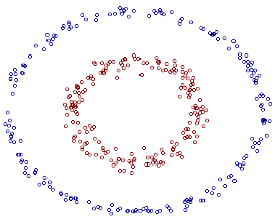

>Nothing is perfect, nothing.

***

## 一、非线性
### 1.1 线性 *VS* 非线性
&emsp;&emsp;在本系列的前面我们已经讨论了线性可分和线性非可分问题的求解，虽然线性非可分的问题复杂了点，但终究还是在线性框架内。然而生活中有很多问题并不是咱们简单画一条或者几条直线就能解决的，比如本文开头的那张图片，你能简单的画几条直线（非折线）就把这两种类型的点区分开吗？
&emsp;&emsp;显然不能！也就是说这个问题在线性框架内并没有解，这就是本文要讲的非线性问题。

> 非线性分类问题是指通过利用非线性模型才能很好的进行分类的问题。

——《统计学习方法》$P\_{115}$

### 1.2 非线性解决方案
&emsp;&emsp;对于非线性问题，其解决思路很简单（然而实现起来却不是那么容易），通过将原始的非线性数据转换成线性数据$\vec x\_i \xrightarrow{f(\vec x\_i)} \vec x\_i'$，从而实现线性分类。这种转换可以看做是一种映射，是一种非线性变换。然而这种转换却存在几个问题：

 - 不容易直接找到满足要求的映射函数；
 - 并非所有的情况下我们都能找到映射函数；
 - 映射后可能会引起维度爆炸（因为我们通常都是将原始数据映射到一个维度更高的空间，从而使得数据线性可分），导致无法计算。

&emsp;&emsp;鉴于上述这些原因，我们通常不去显式的定义映射函数（**将映射函数记为$\phi(x)$**），也就是说我们通常都不会直接去找这个映射函数。转而采用一种“投机取巧”的办法，这种方法我们通常称之为**核技巧（Kernel Trick）**，它的思路是：
&emsp;&emsp;利用一个容易获取的函数，来代替不容易获得的映射函数的作用效果，从而在没有映射函数的情况下，我们也能获得映射后的运算结果。
&emsp;&emsp;具体点来说，对任意两个样本向量，在没有映射函数的情况下，我们也能获得其映射后的向量的内积，而获得的途径就是我们大名鼎鼎的**核函数（Kernel Function），记作$K(x,y)$**。核函数的数学表达式如下：

$$
\underbrace{K(\vec x\_i, \vec x\_j)}\_{核函数} =   \underbrace{\underbrace{\phi(\vec x\_i)}\_{映射后的\vec x\_i} \cdot  \underbrace{\phi(x\_j)}\_{映射后的\vec x\_j}}\_{映射后的\vec x\_i、\vec x\_j的内积}
\tag{1 - 1}
$$

&emsp;&emsp;上式（1-1）的意思就是，我将任意两个样本代入核函数进行计算，其结果与先将这两个样本映射到新空间再点积的结果等价。
&emsp;&emsp;原始的空间（**输入空间，记为$\chi$为欧式空间或离散集合**）中，数据是非线性可分的。原始数据映射后，在映射后的新空间（**特征空间/希尔伯特空间，记为$H$**）中，数据是线性可分的。因为输入空间中数据非线性可分，所以输入空间中的分割面必然是**超曲面**。相反，特征空间中的分割面则是**超平面**。
&emsp;&emsp;以上这些概念暂时不懂没有关系，有个印象就可以了，我们会在后面做详细的介绍。

### 1.3 核函数定义之谜
&emsp;&emsp;那核函数为什么要定义成上述的形式呢？答案其实很简单！但是不管是网上的博客，还是出版的相关书籍，都没有对这点做出说明，Duang！直接就扔出一个东西，然后告诉你，这就是核函数。虽然这只是个很小的问题，对我们理解SVM也不会有太大影响，但就是这么小小的一个问题，对我们的逻辑思维和数学素养影响却非常大。我相信有一部分人甚至都不会想到这个问题。
&emsp;&emsp;为了方便叙述，我们分别记映射前后的样本为$\vec x\_i、\vec x\_i'$，我们有：

$$
\vec x\_i' = \phi(\vec x\_i)
\tag{1 - 2}
$$

&emsp;&emsp;因为映射后的数据$\vec x\_i \in T' = \lbrace (x\_1', y\_1'), \ (x\_2', y\_2'),  \ ..., \ (x\_N', y\_N') \rbrace$已经是线性可分的，根据[机器学习算法系列之三：SVM（4）](2017/07/01/机器学习算法系列之三：SVM4/)中的分析，对于线性可分的数据，我们由其中的式（1-21）可以求出映射后的数据其对偶优化问题为：

$$
\min \limits\_{\vec \alpha} \lbrack \frac{1}{2} \sum\_{i=1}^N \sum\_{j=1}^N \alpha\_i \alpha\_j y\_i y\_j (\vec x\_i' · \vec x\_j') - \sum\_{i=1}^N \alpha\_i \rbrack \\\\
\Updownarrow \\\\
\min \limits\_{\vec \alpha} \lbrack \frac{1}{2} \sum\_{i=1}^N \sum\_{j=1}^N \alpha\_i \alpha\_j y\_i y\_j [\color{red}{\phi(\vec x\_i)} · \color{blue}{\phi(\vec x\_j)}] - \sum\_{i=1}^N \alpha\_i \rbrack\\\\
\tag{1- 3}
$$

&emsp;&emsp;再由其中的式（1- 28）可以求出映射后的数据其分类决策函数为：

$$
\begin{split}
f(x) &= sign \lgroup \sum\_{i=1}^N \alpha\_i^\* · y\_i · (\vec x\_i' \cdot \vec x')  + b^\* \rgroup \\\\
&= sign \lgroup \sum\_{i=1}^N \alpha\_i^\* · y\_i · [\color{red}{\phi(\vec x\_i)} \cdot \color{blue}{\phi(\vec x)}]  + b^\* \rgroup
\end{split}
\tag{1 - 4}
$$

&emsp;&emsp;由上式（1-3）以及（1-4）可以看出，不管是在解最优化问题的时候，还是在求解最后的决策函数的时，我们都要先使用映射函数计算出任意样本在新空间的映射值。而我们在前面[1.2小节](#no_map_reason)中已经说了我们不会去找这个映射函数，更不用说去计算映射值了，而核函数的作用就是为了让我们避开这个坑。至此一切就都明朗了，核函数之所以要定义成式（1-1）的形式，就是为了用来替代$(\vec x\_i' \cdot \vec x') = \color{red}{\phi(\vec x\_i)} \cdot \color{blue}{\phi(\vec x)}$这一坨复杂的东西。
&emsp;&emsp;那么使用核函数替代后，上式（1-3）、（1-4）变成如下形式：

$$
\begin{cases}
\min \limits\_{\vec \alpha} \lbrack \frac{1}{2} \sum\_{i=1}^N \sum\_{j=1}^N \alpha\_i \alpha\_j y\_i y\_j \color{red}{K(\vec x\_i, \vec x\_j)} - \sum\_{i=1}^N \alpha\_i  \\\\
\\\\
sign \lgroup \sum\_{i=1}^N \alpha\_i^\* · y\_i · \color{red}{K(\vec x\_i, \vec x)}  + b^\* \rgroup
\tag{1 - 5}
\end{cases}
$$

&emsp;&emsp;核函数的本质是，通过在输入空间中计算函数$K(\vec x\_i, \vec x\_j)$的值，我们就能获得在特征空间中的向量的内积值$<\phi(\vec x\_i), \ \phi(\vec x\_j)>$，并且完全不需要映射函数。

### 1.4 常用核函数
&emsp;&emsp;虽然有了核函数让我们不必再去苦苦寻觅映射函数，那么如果没有一些较为通用的核函数供我们选择和使用，我们的问题也只是从寻找映射函数变成了寻找核函数，问题的复杂性可能并不会降低。
&emsp;&emsp;由此，我们提供一些比较常用的核函数以供调试、选择（**关于如何选择核函数，目前学术界还没有一个具体的公式能给出答案，大多数情况下还是依赖于我们的经验，结合实际业务来选择。**）。下面就列出一些常用的核函数表达式：

| 名称 |  表达式  |           参数            | 备注 |
| :--: | :--------: | :-----------------------: | :--: |
| 线性核函数 | $K(\vec x\_i, \vec x\_j) = {\vec x\_i}^T \cdot \vec x\_j$ |  |  ——  |
| 多项式核函数 | $K(\vec x\_i, \vec x\_j) = (a \cdot {\vec x\_i}^T \cdot \vec x\_j + c)^d$ |  $a、c、d(d \geq 1)$   $d = 1$时即为线性核函数| 特别适合正交归一化后的数据   |
| 高斯核函数 | $K(\vec x\_i, \vec x\_j) = exp\lgroup - \frac{\Arrowvert \vec x\_i - \vec x\_j \Arrowvert^2}{2 \sigma^2} \ \rgroup$ |  高斯核带宽$\sigma > 0$|  抗噪能力强，对参数敏感  |
| 指数核函数 | $K(\vec x\_i, \vec x\_j) = exp\lgroup - \frac{\Arrowvert \vec x\_i - \vec x\_j \Arrowvert}{2 \sigma^2} \ \rgroup$ |  $\sigma > 0$|  属于高斯核函数变种，对参数敏感性降低，适用范围相对较窄  |
| 拉普拉斯核函数 | $K(\vec x\_i, \vec x\_j) = exp\lgroup - \frac{\Arrowvert \vec x\_i - \vec x\_j \Arrowvert}{\sigma} \ \ \rgroup$ |  $\sigma > 0$|  属于高斯核函数变种，对参数敏感性降低  |
| Sigmoid核函数 | $K(\vec x\_i, \vec x\_j) = tanh\lgroup a \cdot {\vec x\_i}^T \cdot \vec x\_j + c)$ |  $a > 0, c < 0$|  ——  |
| 二次有理核函数 | $K(\vec x\_i, \vec x\_j) = 1 - \frac{\Arrowvert \vec x\_i - \vec x\_j \Arrowvert^2}{\Arrowvert \vec x\_i - \vec x\_j \Arrowvert^2 + \ c}$ | $c$ | 高斯核函数的替代品，作用域广，对参数特别敏感 |
| ANOVA核函数 | $K(\vec x\_i, \vec x\_j) = exp \lgroup -\sigma (\vec x\_i^k - \vec x\_j^k)^2 \rgroup ^d$ |  $\sigma > 0, d \geq 1$|  也属于RBF核函数，适用于多维回归问题  |
| 多元二次核函数 | $K(\vec x\_i, \vec x\_j) = (\Arrowvert \vec x\_i - \vec x\_j \Arrowvert^2 + \ c^2 )^{0.5}$ | $c$ | 可替代二次有理核，非正定核函数 |
| 逆多元二次核函数 | $K(\vec x\_i, \vec x\_j) = (\Arrowvert \vec x\_i - \vec x\_j \Arrowvert^2 + \ c^2 )^{-0.5}$ | $c$ | 不会导致核相关矩阵奇异 |
| 对数核函数 | $K(\vec x\_i, \vec x\_j) = -log(1 \ + \ \Arrowvert \vec x\_i - \vec x\_j \Arrowvert^d)$ | $d$ | 图像分割上经常使用 |
| 字符串核函数 | $K(s, t) = \sum{u \in \Sigma^n} \sum_{s(i)=t(j)=u} \lambda^{l(i)} \lambda^{l(j)}$ | $d$ | 文本分类，信息检索广泛使用 |

&emsp;&emsp;参考链接：
- 1\. [总结一下遇到的各种核函数](https://blog.csdn.net/wsj998689aa/article/details/47027365)；
- 2\. [SVM的常见核函数及其选取](https://blog.csdn.net/u011746554/article/details/70941587)；
- 3\. [理解字符串核函数](https://blog.csdn.net/shijing_0214/article/details/51134802);

### 1.5 非线性支持向量机
&emsp;&emsp;针对非线性数据，利用核函数学习出来的分类决策模型即为非线性支持向量机。训练样本中，参与了分割超平面决策的这些我们称为非线性支持向量。
&emsp;&emsp;**非线性支持向量机的分类决策函数**表达式如下：

$$
\begin{split}
f(x) &= sign \lgroup \sum\_{i=1}^N \alpha\_i^\* · y\_i · K(\vec x\_i, \vec x)  + b^\* \rgroup \\\\
&= sign \lgroup \underbrace{\sum\_{i=1}^N \alpha\_i^\* · y\_i · K(\vec x\_i, \vec x)}_{\vec w \cdot \vec x}  + \underbrace{\lgroup y\_j - \sum\_{i=1}^N \alpha\_i^\* \cdot y\_i \cdot K(\vec x\_i, \vec x\_j)\rgroup}\_{b^\*} \rgroup
\end{split}
\tag{1 - 6}
$$

&emsp;&emsp;由上式可以看出，对于$b^\*$的求解，我们也换成了核函数。同线性可分情况一样，要求解$b^\*$，只需要选择一个由上式（1-5）第一个式子求解出来的满足$0 < \alpha\_j^\* < C$的拉格朗日乘子计算即可。
&emsp;&emsp;非线性分类决策函数的求解过程与线性可分情况下的求解是一样的，只不过目标函数里面相应的内积替换成了核函数。另外有一点需要特别说明的是，对于非线性支持向量机的求解，我们通常都不会去求$\vec w^\*$的表达式，因为其求解需要利用映射后的样本，如下所示：

$$
\begin{split}
\vec w^\* &= \sum\_{i=1}^N \alpha\_i^\* \cdot y\_i \cdot \vec x\_i' \\\\
&= \sum\_{i=1}^N \alpha\_i^\* \cdot y\_i \cdot \phi(\vec x\_i)
\end{split}
\tag{1 - 7}
$$

&emsp;&emsp;因此我们通常都是直接利用核函数求解出式（1-6）的分类决策函数。