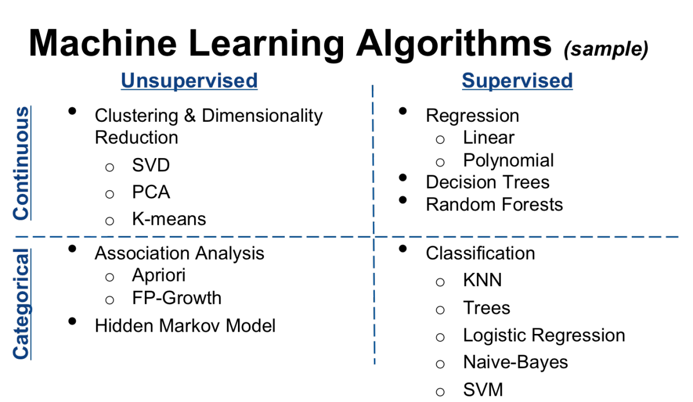
>Live and Learn!
***

## 一、综述
### 1.1 算法分类  
&emsp;&emsp;要对前面这些算法进行一个严格的分类，是很困难的事，有些算法往往二者兼顾，因此这里的分类仅供参考，不具有绝对性。所谓形醉而意不醉，不拘泥于一招一式，融会贯通，人算合一，才是那最高的境界（PS：我也在路上）。闲话休絮，对于算法的分类，详述如下（分类准则参考了大部分网上资料）。

### 1.1.1 学习模型 
&emsp;&emsp;按照学习模型可以分为监督学习(Supervised Learning)、无监督学习(Unsupervised Learning)、半监督(Semi-Supervised Learning)、强化学习(Reinforcement Learning)，如下1-1所示：  
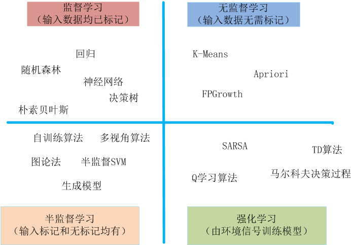

图1-1　　按学习模型分类
  
<!-- more -->

### 1.1.2 算法相似性 
&emsp;&emsp;如果按照算法功能的相似性来分类，就是我们在[机器学习算法系列之一：简介](https://flat2010.github.io/2017/01/01/%E6%9C%BA%E5%99%A8%E5%AD%A6%E4%B9%A0%E7%AE%97%E6%B3%95%E7%B3%BB%E5%88%97%E4%B9%8B%E4%B8%80%EF%BC%9A%E7%AE%80%E4%BB%8B/)中整理出来的那些，这里就不再赘述。

## 二、常用算法介绍
### 1.1 回归和分类
### 1.1.1 回归 
&emsp;&emsp;回归通常是用来做一些预测，比如股票走势、商品价格走势等，其特点是**输出变量属于连续值类型**，多用于**定量**分析。  
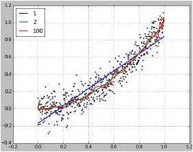
### 1.1.1 分类
&emsp;&emsp;分类从它的字面意思就能知道它是用来做什么的，比如明天的天气情况，火车是否晚点等，其特点是**输出变量属于离散值类型**，多用于**定性**分析。  
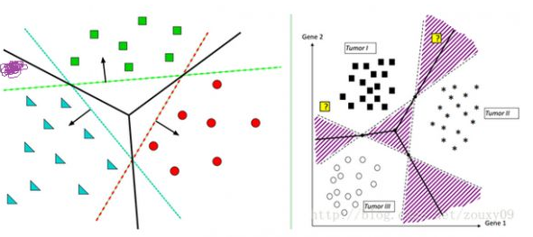  

### 1.2 正则化
&emsp;&emsp;正则化通俗点来将，是用来对模型进行约束的，防止**过拟合**。按照《统计学习方法》中所述，正则化是**结构风险最小化**的实现，它是经验风险加了一个正则项（或称罚项）。模型越复杂，正则化值越大，也就是说惩罚越重。  
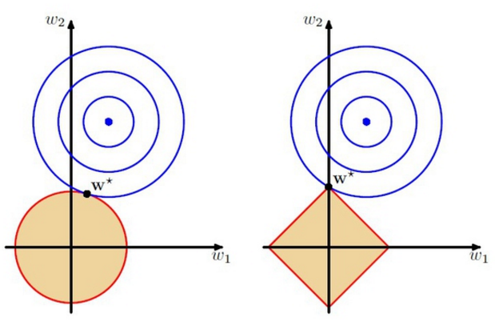 

### 1.3 决策树
&emsp;&emsp;决策树是根据数据的特征属性构建起来的一种树结构，从而实现类似人的决策过程。使用不同的决策树算法，可以实现不同的功能。总体来说，决策树算法可以实现1.1节中所说的分类和回归（预测）功能。  
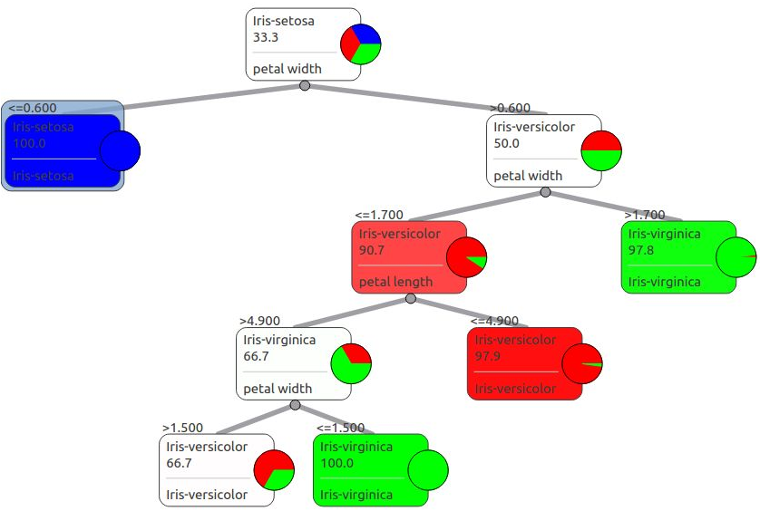     

### 1.4 贝叶斯
&emsp;&emsp;贝叶斯方法是基于贝叶斯理论的一类算法，它利用先验及后验概率建立分析模型，从而实现1.1节中说的分类和回归功能。  
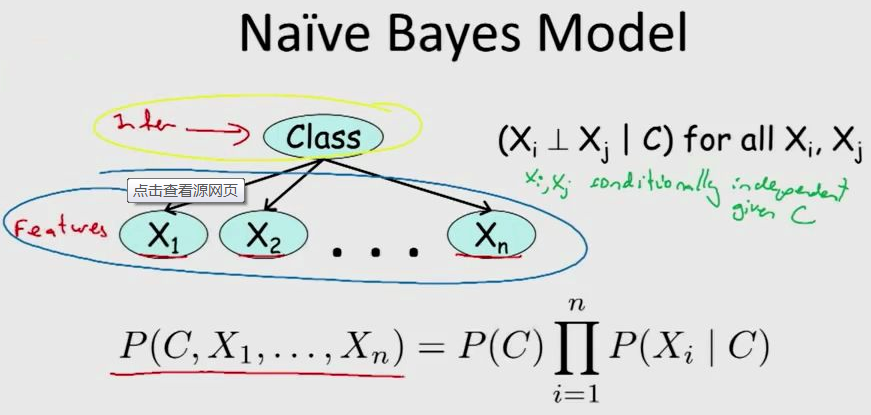 

### 1.5 降维
&emsp;&emsp;降维算法常用于高纬度的数据集，它将原来高维空间中的数据点映射到低纬度空间，避免维数灾难。 原始数据经过降维处理后，能大大减少最终需要处理的数据量，也更方便人类理解。
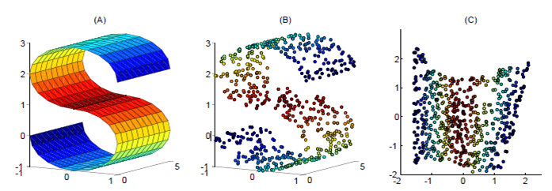  

### 1.6 神经网络
&emsp;&emsp;神经网络是模仿人脑神经元网络的工作原理而构建起来的一种运算和抽象模型。近年来，神经网络得到了极大的发展和应用。
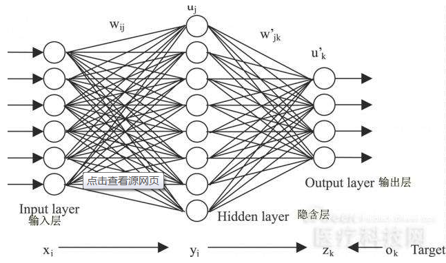  

### 1.7 关联规则
&emsp;&emsp;关联规则是数据挖掘中最活跃的研究方法之一，常用来分析事务之间的一些相关关系，近年来大数据的走热让这类算法得到了广泛的应用。
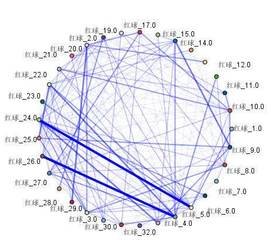   

### 1.8 聚类
&emsp;&emsp;聚类算法常用来对输入的数据进行分组/族，也就是古语说的，`物以类聚，人以群分`，具有某种相似性的样本会被划分到同一个组/族，不同的则被划分到不同的组/族。
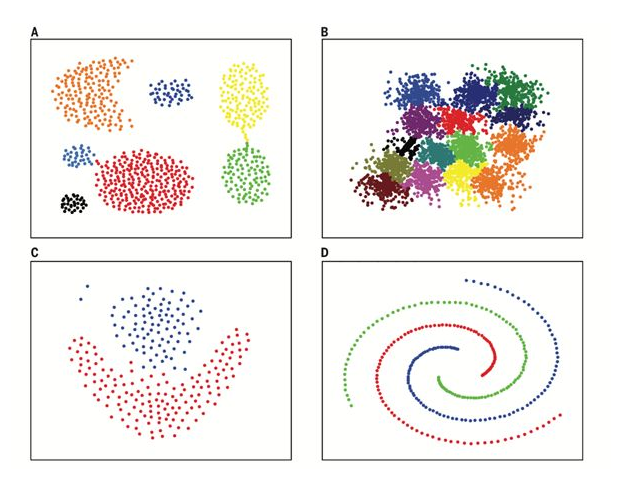  