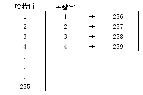

>N % M = P

***

## 一、正文
&emsp;&emsp;模运算想必大家都不陌生了，在看《算法导论》中字符串匹配的**Rabin-Karp**算法的时候，里面提到了对要匹配的字符串计算出一个整型值之后，使用一个**较大的素数**进行模运算，并以模运算的结果作为匹配值。这里让我产生了两个疑问，第一是：取余为何非要用一个素数进行模运算呢？第二是：为何还要把这个素数取得非常大？
&emsp;&emsp;下面就这两点分别说明。
### 1.1 为何要用素数
&emsp;&emsp;首先我们来看，取余实际上相当于一种映射。比如我们给定一个整数的集合$A = \lbrace a\_0, a\_1, a\_2, ..., a\_i \rbrace$，我们要对该集合里面的所有元素对数字$j$取余，那么A中所有元素取余后的值的集合$B=\lbrace 0, 1, 2, ..., j \rbrace$，取余实际上就是将集合A映射到集合B，即$A \stackrel{f(x)}{\longrightarrow} B$，这么说比较抽象，我们举例来讲。

#### 1.1.1 例1
&emsp;&emsp;现取$i=12,\  j=8$，则有：

$$
A\_0 = \lbrace 1, 2, 3, 4, 5, 6, 7, 8, 9, 10, 11, 12 \rbrace \rbrace \\\\
{\downarrow}{f(a\_i)}=a\_i \ \% \ j \\\\
A\_0^f=\lbrace 1, 2, 3, 4, 5, 6, 7, 0, 1, 2, 3, 4  \rbrace \\\\
\Downarrow \\\\
\color{\red}{\lbrace 0, 1, 2, 3, 4, 5, 6, 7 \rbrace} \\\\
\Large{vs} \\\\
B\_0^{j=8}=\lbrace 0, 1, 2, 3, 4, 5, 6, 7\rbrace
$$

#### 1.1.2 例2
&emsp;&emsp;再举个栗子，仍然取$i=12, \ j=8$，有：

$$
A\_1 = \lbrace 10, 8, 12, 4, 16, 32, 20, 24, 26, 32, 34, 28 \rbrace \\\\
{\downarrow}{f(a\_i)}=a\_i \ \% \ j  \\\\
 A\_1^f=\lbrace 2, 0, 4, 4, 0, 0, 4, 0, 2, 0, 2, 4\rbrace \\\\
\Downarrow \\\\
\color{\purple}{\lbrace 0, 2, 4 \rbrace} \\\\
\Large{vs} \\\\
B\_0^{j=8}=\lbrace 0, 1, 2, 3, 4, 5, 6, 7\rbrace
$$

&emsp;&emsp;这两个例子差别在哪呢？后面这个例子虽然映射前集合A的元素数量仍然是12个，但是映射后的元素只出现了0、2、4，也就是说集合B中的元素，有$8 - 3 = 5 > \frac{1}{2} \cdot 8 = 4$即超过一半多的元素根本就没有用上！

#### 1.1.3 例3
&emsp;&emsp;集合A不变，我们把模换成素数试试，取$i=12, \ j=7$，有：

$$
A\_1 = \lbrace 10, 8, 12, 4, 16, 32, 20, 24, 26, 32, 34, 28 \rbrace \\\\
{\downarrow}{f(a\_i)}=a\_i \ \% \ j  \\\\
 A\_1^f=\lbrace 3, 1, 5, 4, 2, 4, 6, 3, 5, 4, 6, 0\rbrace \\\\
\Downarrow \\\\
\color{\green}{\lbrace 0, 1, 2, 3, 4, 5, 6 \rbrace} \\\\
\Large{vs} \\\\
B\_1^{j=7}=\lbrace 0, 1, 2, 3, 4, 5, 6, 7\rbrace
$$

&emsp;&emsp;这里为了避免因模数改变过大而造成取余后的值分布范围增大，我们取了跟8最接近并且比它小的一个素数7。可以看出，模数换成素数后，原来的集合A并没有改变，但是最终映射的结果却100%的利用了新的余数空间（而新的余数空间和旧余数空间大小只相差1）。
&emsp;&emsp;**也就是说，使用素数作为模数，可以提高余数空间的利用率！**
&emsp;&emsp;当然，如果原集合中的元素属于均匀分布或者接近均匀分布的话（元素间的值差均匀且较小），模数用素数和非素数的差距并不大（第一个例子）。
&emsp;&emsp;我知道几个精心构造的例子是说服不了睿智的你的，下面上数学证明！

### 1.2 数学证明
&emsp;&emsp;设有原集合$A = \lbrace a\_0, a\_1, a\_2, ..., a\_i \rbrace, \ a\_i \in N^0$，取$p \in A$以及模数$q(q \in N^+)$，$p、q$的最大公约数为$k(k \in N^+)$，分别记：

$$
\begin{cases}
\begin{split}
&p = k \cdot m , \quad m \in N^0\\\\
&q = k \cdot n , \quad n \in N^+
\end{split}
\end{cases}
\tag{1 - 1}
$$

&emsp;&emsp;再设模运算后的**商为$d$**，**余数为$r$**（即$p \ \% \ q = r$），则有：

$$
\begin{split}
p = q \cdot \color{blue}d + \color{red}r, \quad r \in N^0, \ d \in N^0
\end{split}
\tag{1 - 2}
$$

&emsp;&emsp;将上式（1-1）入式（1-2）有：

$$
\begin{split}
k \cdot m = k \cdot n \cdot d + r
\end{split}
\tag{1 - 3}
$$

&emsp;&emsp;化简后可得到余数$r$的表达式为：

$$
r = k(m - nd), \quad k \in N^+, \ m \in N^0, \ n \in N^+, \ d \in N^0
\tag{1 - 4}
$$

&emsp;&emsp;由$r \in N^0$可知$(m - nd) \in N^0$，即$m - nd$也是整数，我们令$(m - nd) = c$，则有：

$$
\begin{cases}
\begin{split}
&r = k \cdot c, \quad c=0,\ 1, \ 2,... \\\\
&c = m - nd
\end{split}
\end{cases}
\tag{1 - 5}
$$

#### 1.2.1 q为非素数
&emsp;&emsp;当模数$q$为非素数时，若此时集合中的元素$p$为素数，则必有$k = 1$（素数和非素数的最大公约数为1），也就是说此时余数可以遍取余数空间的所有值：
$$
r = 0, \ 1, \ 2, ...
$$

&emsp;&emsp;当模数$q$为非素数，且集合中的元素$p$也为非素数（且$q \neq q）$时，则必有$k = 2, \ 3, ...$（两个非素数的最大公约数必然大于1, $p = 0$除外。），也就是说此时余数只能取余数空间中的部分值：
$$
r = 0, \ 2, \ 4, ... \quad k = 2 \\\\
r = 0, \ 3, \ 6, ... \quad k = 3 \\\\
...
$$

&emsp;&emsp;总结上述两点来说，当模数$q$取非素数时，如果原集合A中的非素数较多时，会导致大量的余数空间被浪费，这种情况的另一个不利影响是加剧了余数之间的碰撞（重叠）。

#### 1.2.2 q为素数
&emsp;&emsp;当模数$q$为素数时，不管原集合A中的元素$p$取什么值，只要有$p \neq q$，则必有$k = 1$（素数的性质），也就是说此时余数可以遍取余数空间的所有值：
$$
r = 0, \ 1, \ 2, ...
$$

&emsp;&emsp;也就是说，只要我们的模数为素数，不管原集合A中的素数和非素数的组成情况如何，都能充分利用余数空间。这就解释了为什么我们做模运算的时候，模数要选择素数。

### 1.3 为何要用大素数
&emsp;&emsp;这个原因就比较简单了，使用大的素数，可以尽量减小余数之间的碰撞。仍以前面的[例3](#example3)来说，原集合大小为12，余数空间大小为7，也就是说原集合中有$12 - 7 = 5$个元素因为余数空间的限制，跟其他元素的余数发生了碰撞（重叠）。

### 1.4 补充
&emsp;&emsp;前面我们提到了，当原集合中元素的分布属于或者接近于均匀分布的话，模数取素数和非素数差距不大，但是在我们的实际应用中均匀分布这种情况很少见，因此使用大素数作为模运算的模数往往会取得较好的效果。
&emsp;&emsp;最后，本文主要参考了以下博客，在此附上以供查阅，感谢他们细致的讲解：
 - [Hash时取模一定要模质数吗？](https://www.zhihu.com/question/20806796);
 - [为什么求模运算要用素数（质数）—— 哈希表设计](https://blog.csdn.net/wangchong_fly/article/details/47442265);