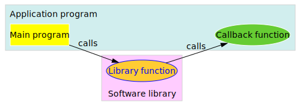

---

title: 深入理解回调函数
date: 2017-01-10 01:23:08
tags: 回调函数
categories: 编程笔记 
comments: true 
---

>Just call me back!
***

## 一、综述
### 1.1 废话  

&emsp;&emsp;写这篇博客是因为一个朋友最近在问我关于回调函数的事情，虽然之前也看过不少这方面的资料，但一来当时只是“看”懂了，二来平时很少用到，所以对于回调函数的理解只是在一个很肤浅的层面上，知道有这么个东西，大概知道怎么用。刚好借这个机会去深入的理解它——积跬步以至千里！写之前在网上搜索了很久，关于回调函数的资料还是挺多的，只是国内的博客鱼目混珠，质量参差不齐。抄来抄去也就算了，很多连抄都懒得抄全，搞的新手晕头转向，不知所云。所以本文会最大限度的保持原创，并力争做到条理清晰，简洁易懂。

### 1.2 定义  

&emsp;&emsp;国内对于“回调函数”的解释很多，但个人感觉还是不如维基百科的专业和简洁，本文采用维基百科的定义。其原文如下： 
<blockquote2>In computer programming, a **callback**1 is a piece of executable code that is passed as an argument to other code, which is expected to call back(execute) the argument at some convenient time. The invocation may be immediate as in a **synchronous callback**2, or it might happen at a later time as in an **asynchronous callback**3. In all cases, the intention is to specify a function or subroutine as an entity that is, depending on the language, more or less similar to a variable.  
&emsp;&emsp;Programming languages support callbacks in different ways, often implementing them with subroutines, lambda expressions, blocks, or function pointers.</blockquote2>  

&emsp;&emsp;翻译如下（为了语句通顺，稍微做了修改，能力有限，欢迎指正。）：
<blockquote2>在计算机编程中，**回调**1是一段以参数形式传递给其它代码的可执行代码，期望调用代码（其它代码）在某个方便的时候回来调用它。按照调用方式不同分为**同步回调**2（如果调用是立即生效的，也称为**阻塞回调**）和**异步回调**3（如果调用将在稍后生效，也称**非阻塞回调**）。不管是什么情况，其目的都是要指定一个函数或者子程序为实体，具体情况则取决于编程语言，其作用或多或少的有点类似于变量。  
&emsp;&emsp;不同的编程语言以不同的形式提供回调功能，较为常见的实现方式有子程序，lambda表达式，代码块或者函数指针。</blockquote2>  

&emsp;&emsp;本文第一幅图（摘自维基百科，为了便于阅读对其原图进行了配色）简洁明了的阐明了这种调用关系。图中<code>Main program</code>作为调用发起者（**主调方/调用者**），去调用了<code>Library function</code>中的某个函数（**被调方/被调用者**），而被调方在执行的时候又回过来调用了主调方提供的<code>Callback function</code>函数（**回调函数**）。图中的**红色箭头**即代表**回调**这个过程。  
&emsp;&emsp;**为了方便后面的叙述，本文约定，凡是主动发起调用请求的称为主调方，被调用的称为被调方。请读者务必注意，后面不再说明。**  
&emsp;&emsp;调用和被调用是一个相对关系，并不是绝对的。仍然以第一幅图为例，从函数层面来说：  
&emsp;&emsp;**刚开始时：** 
&emsp;&emsp;
**主调方**&emsp;&emsp;&emsp;&emsp;&emsp;&emsp;==>&emsp;&emsp;&emsp;&emsp;&emsp;&emsp;**被调方**

&emsp;&emsp;
<code>Main program</code>&emsp;&emsp;==>&emsp;&emsp;<code>Library function</code>
 
 
&emsp;&emsp;**Library function回调时**：  
&emsp;&emsp;
**主调方**&emsp;&emsp;&emsp;&emsp;&emsp;&emsp;==>&emsp;&emsp;&emsp;&emsp;&emsp;&emsp;**被调方**

&emsp;&emsp;
<code>Library function</code>&emsp;&emsp;==>&emsp;&emsp;<code>Callback function</code>

&emsp;&emsp;再往上走，我们将会得到更清晰的认识，即从框架层面来说：  
&emsp;&emsp;**刚开始时**：
&emsp;&emsp;
**主调方**&emsp;&emsp;&emsp;&emsp;&emsp;&emsp;==>&emsp;&emsp;&emsp;&emsp;&emsp;&emsp;**被调方**

&emsp;&emsp;
<code>Application program</code>&emsp;&emsp;==>&emsp;&emsp;<code>Software library</code>
  
&emsp;&emsp;**回调发生时**：  
&emsp;&emsp;
**主调方**&emsp;&emsp;&emsp;&emsp;&emsp;&emsp;==>&emsp;&emsp;&emsp;&emsp;&emsp;&emsp;**被调方**

&emsp;&emsp;
<code>Software library</code>&emsp;&emsp;==>&emsp;&emsp;<code>Application program</code>
  
### 1.3 回调机制 *VS* 回调函数  

&emsp;&emsp;**注意：本节是笔者在搜索大量资料后整理出来的，某些概念并没有权威的定义，读者请自行斟酌是否采纳，纰漏之处请指正。**
&emsp;&emsp;使用关键字“回调机制”进行搜索时，得到的大多数是都是关于回调函数的，也就是说大部分的博客在讲解中并没有把回调机制和回调函数区别开。然而这两者并不完全等价。  
#### 1.3.1 回调机制  
&emsp;&emsp;回调机制有广义回调和狭义回调之分。