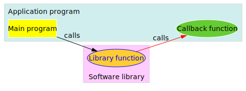

---


title: 深入理解回调函数
date: 2017-01-10 01:23:08
tags: 回调函数
categories: [编程笔记, 回调函数]
comments: true 
---



><font color=#0000FF face="微软雅黑" size=4>Just call me back!</font>
***

## 一、综述
### 1.1 废话  

&emsp;&emsp;写这篇博客是因为一个朋友最近在问我关于回调函数的事情，虽然之前也看过不少这方面的资料，但一来当时只是“看”懂了，二来平时很少用到，所以对于回调函数的理解只是在一个很肤浅的层面上，知道有这么个东西，大概知道怎么用。刚好借这个机会去深入的理解它——积跬步以至千里！写之前在网上搜索了很久，关于回调函数的资料还是挺多的，只是国内的博客鱼目混珠，质量参差不齐。抄来抄去也就算了，很多连抄都懒得抄全，搞的新手晕头转向，不知所云。所以本文会最大限度的保持原创，并力争做到条理清晰，简洁易懂。

### 1.2 定义  

&emsp;&emsp;国内对于“回调函数”的解释很多，但个人感觉还是不如维基百科的专业和简洁，本文采用维基百科的定义。其原文如下： 
<blockquote2>In computer programming, a **callback**<sub>1</sub> is a piece of executable code that is passed as an argument to other code, which is expected to call back(execute) the argument at some convenient time. The invocation may be immediate as in a **synchronous callback**<sub>2</sub>, or it might happen at a later time as in an **asynchronous callback**<sub>3</sub>. In all cases, the intention is to specify a function or subroutine as an entity that is, depending on the language, more or less similar to a variable.  
&emsp;&emsp;Programming languages support callbacks in different ways, often implementing them with subroutines, lambda expressions, blocks, or function pointers.</blockquote2>  

&emsp;&emsp;翻译如下（为了语句通顺，稍微做了修改，能力有限，欢迎指正。）：
<blockquote2>在计算机编程中，**回调**<sub>1</sub>是一段以参数形式传递给其它代码的可执行代码，期望调用代码（其它代码）在某个方便的时候回来调用它。按照调用方式不同分为**同步回调**<sub>2</sub>（如果调用是立即生效的，也称为**阻塞回调**）和**异步回调**<sub>3</sub>（如果调用将在稍后生效，也称**非阻塞回调**）。不管是什么情况，其目的都是要指定一个函数或者子程序为实体，具体情况则取决于编程语言，其作用或多或少的有点类似于变量。  
&emsp;&emsp;不同的编程语言以不同的形式提供回调功能，较为常见的实现方式有子程序，lambda表达式，代码块或者函数指针。</blockquote2>  

&emsp;&emsp;本文第一幅图（摘自维基百科，为了便于阅读对其原图进行了配色）简洁明了的阐明了这种调用关系。图中<code>Main program</code>作为调用发起者（**主调方/调用者**），去调用了<code>Library function</code>中的某个函数（**被调方/被调用者**），而被调方在执行的时候又回过来调用了主调方提供的<code>Callback function</code>函数（**回调函数**）。图中的**红色箭头**即代表**回调**这个过程。  
&emsp;&emsp;<font color=#ff0000>**为了方便后面的叙述，本文约定，凡是主动发起调用请求的称为主调方，被调用的称为被调方。请读者务必注意，后面不再说明。**</font>  
&emsp;&emsp;调用和被调用是一个相对关系，并不是绝对的。仍然以第一幅图为例，从函数层面来说：  
&emsp;&emsp;**刚开始时：** 
&emsp;&emsp;<div align='center'><font color=#0000ff>**主调方**</font>&emsp;&emsp;&emsp;&emsp;&emsp;&emsp;==>&emsp;&emsp;&emsp;&emsp;&emsp;&emsp;<font color=#ff0000>**被调方**</font></div>
&emsp;&emsp;<div align='center'><code>Main program</code>&emsp;&emsp;==>&emsp;&emsp;<code>Library function</code></div> 
 
&emsp;&emsp;**Library function回调时**：  
&emsp;&emsp;<div align='center'><font color=#0000ff>**主调方**</font>&emsp;&emsp;&emsp;&emsp;&emsp;&emsp;==>&emsp;&emsp;&emsp;&emsp;&emsp;&emsp;<font color=#ff0000>**被调方**</font></div>
&emsp;&emsp;<div align='center'><code>Library function</code>&emsp;&emsp;==>&emsp;&emsp;<code>Callback function</code></div>

&emsp;&emsp;再往上走，我们将会得到更清晰的认识，即从框架层面来说：  
&emsp;&emsp;**刚开始时**：
&emsp;&emsp;<div align='center'><font color=#0000ff>**主调方**</font>&emsp;&emsp;&emsp;&emsp;&emsp;&emsp;==>&emsp;&emsp;&emsp;&emsp;&emsp;&emsp;<font color=#ff0000>**被调方**</font></div>
&emsp;&emsp;<div align='center'><code>Application program</code>&emsp;&emsp;==>&emsp;&emsp;<code>Software library</code></div>  
&emsp;&emsp;**回调发生时**：  
&emsp;&emsp;<div align='center'><font color=#0000ff>**主调方**</font>&emsp;&emsp;&emsp;&emsp;&emsp;&emsp;==>&emsp;&emsp;&emsp;&emsp;&emsp;&emsp;<font color=#ff0000>**被调方**</font></div>
&emsp;&emsp;<div align='center'><code>Software library</code>&emsp;&emsp;==>&emsp;&emsp;<code>Application program</code></div>  
### 1.3 回调机制 *VS* 回调函数  

&emsp;&emsp;<font color=#ff0000 size=3>**注意：本节是笔者在搜索大量资料后整理出来的，某些概念并没有权威的定义，读者请自行斟酌是否采纳，纰漏之处请指正。**</font>
&emsp;&emsp;使用关键字“回调机制”进行搜索时，得到的大多数是都是关于回调函数的，也就是说大部分的博客在讲解中并没有把回调机制和回调函数区别开。然而这两者并不完全等价。  
#### 1.3.1 回调机制  
&emsp;&emsp;回调机制有**广义回调**和**狭义回调**之分。  
&emsp;&emsp;所谓**广义回调**，泛指任何采用了回调这种机制的方法或者技术，比如Windows系统的<block>**消息机制**</block>（详细信息可参考相关资料）。而广义回调的实现方式也不仅仅局限于回调函数，比如**消息队列**。  
&emsp;&emsp;所谓**狭义回调**，则特指某种具体回调机制，一般来说，都是指采用了回调函数的回调机制（网上大部分资料也都是关于这种机制的讲解和介绍），其本质是让**上层提供代码**。  
&emsp;&emsp;<font color=#aa66ff size=3>由此可知，**回调函数仅仅是回调机制的一种特定实现。**</font>  
#### 1.3.2 钩子函数  
&emsp;&emsp;按照网上的资料，钩子函数仅仅是回调函数的一个特例。比如Windows系统利用钩子函数，可以实现Windows事件的过滤或处理。笔者对Windows系统编程不太熟悉，无法提供更详尽的解释，需要深入了解的请自行参考相关资料。 
## 二、进阶讲义
### 2.1 通俗理解  
&emsp;&emsp;假定我们现在有三个函数A、B、C，在A调用B的时候，把C的地址（整个函数的地址，即函数的入口）作为了参数传递给B，那么C就是我们的回调函数。  
&emsp;&emsp;<font color=#ff0000 size=3>**请牢记这三个函数的对应关系，为方便叙述，下面的讲解都会以A、B、C来代称。**</font>
&emsp;&emsp;通俗来讲，假设你（A）电脑现在有问题了，你搞不定，就打电话给你一个同学（B）求助，要让他给你充分解决问题，你总得提供大量有用的信息或者必要的帮助吧，比如开个远程（C）啥的。  
&emsp;&emsp;所谓同步回调（阻塞回调），就是C函数一定会在A函数返回之前被（B）调用。而异步回调（非阻塞回调），则C函数可能会在A返回之前被（B）调用，也可能是在A返回之后被调用。  
&emsp;&emsp;通俗来讲（接上个例子），你打电话给你同学之后需要出门办事（A函数返回），同步回调就是，在你出门之前，你同学一定会使用你开的远程控制来操作你的电脑，试图给你解决问题（B函数调用C函数）。而异步回调就是，他可能会在你还没出门前使用（远程），也可能会在你出门后使用（远程）。  
### 2.2 代码篇  
### 2.2.1 Python(同步调用)      
```python
#函数你，对应A函数
def you():
    print("A函数启动.      ==>  你用电脑，遇到了问题.\n")
    msg = "我的电脑出了点问题XXX，你帮我看看，给你开个远程."
    print("A函数调用B函数.  ==>  你向你朋友发起求助，同时提供 ***远程控制*** 给他.\n")
    yourFriend(msg, remoteControl)
    print("A函数返回.    ==>  你出门办事.\n")
    return None

#函数你的朋友，对应B函数    
def yourFriend(msg, call_back):
    print("B函数被调用.    ==>  你朋友收到你的求助.\n")
    actions = ["右键计算机",
               "选择属性",
               "选择高级系统设置",
               "... ...",
              ]
    call_back(actions)
    print("B函数返回.    ==>  你朋友向你反馈处理结果.\n")
 
#函数QQ远程控制，对应C函数   
def remoteControl(actions):
    print("C函数被调用.    ==>  你朋友通过你开的 ***远程控制*** 操作你的电脑.\n")
    for action in actions:
        print(">> %s" % action)
    print("\nC函数返回.    ==>  处理完毕，退出远程的使用.\n")
   
you()

```
&emsp;&emsp;程序运行结果为：
    
```python
Output:
A函数启动.      ==>  你用电脑，遇到了问题.
A函数调用B函数.  ==>  你向你朋友发起求助，同时提供 ***远程控制*** 给他.
B函数被调用.    ==>  你朋友收到你的求助.
C函数被调用.    ==>  你朋友通过你开的 ***远程控制*** 操作你的电脑.
>> 右键计算机
>> 选择属性
>> 选择高级系统设置
>> ... ...
C函数返回.    ==>  处理完毕，退出远程的使用.
B函数返回.    ==>  你朋友向你反馈处理结果.
A函数返回.    ==>  你出门办事.
```
&emsp;&emsp;从上述输出结果可知，该调用属于**同步回调**。A函数在调用B函数后，自身返回之前，其传入的回调函数C被B调用。注意代码第6行：  
    
```python
    yourFriend(msg, remoteControl)
```
&emsp;&emsp;第二个参数<block>**remoteControl**</block>是一个函数的名字而非普通变量名。这就是前面2.1节中提到的**函数的地址**，B函数正是通过这个地址获得了C函数的入口，从而实现了回调。   

### 2.2.2 Python(异步调用)   
&emsp;&emsp;    
```python  
# -*- coding: utf-8 -*-
import threading
#你，对应A函数
def you():
    print("A函数启动.      ==>  你用电脑，遇到了问题.\n")
    msg = "我的电脑出了点问题XXX，你帮我看看，给你开个远程."
    print("A函数调用B函数.  ==>  你向你朋友发起求助.\n")
    cb_thead = threading.Thread(target=yourFriend, args=(msg, remoteControl))
    cb_thead.start()
    print("A函数返回.    ==>  你出门办事.\n")
    return None

#你的朋友，对应B函数
def yourFriend(msg, call_back):
    print("B函数被调用.    ==>  你朋友收到你的求助.\n")
    actions = ["右键计算机",
               "选择属性",
               "选择高级系统设置",
               "... ...",
              ]
    call_back(actions)
    print("B函数返回.    ==>  你朋友向你反馈处理结果.\n")

#QQ远程控制，对应C函数
def remoteControl(actions):
    print("C函数被调用.    ==>  你朋友通过你开的QQ远程操作你的电脑.\n")
    for action in actions:
        print(">> %s" % action)
    print("\nC函数返回.    ==>  处理完毕，退出远程的使用.\n")

you()
```
&emsp;&emsp;其中一次的程序运行结果如下图2-1所示：  

<div align='center'>图2-1　　异步回调python版运行结果图</div>  

&emsp;&emsp;<font color=#FF0000 face="微软雅黑" >注意：这里A、B函数的返回顺序并不确定（取决于两个线程对CPU时间片的竞争结果，下同！），上图只是展示了其中的一种运行结果。该部分代码在Python 2.7中能编译运行出上述结果，在3.4中存在一点问题，加了sleep函数也无法实现延迟调用，原因暂未知。</font>

### 2.2.3 Java(同步调用)   
```java
/*主类，为了方便代码阅读，我把你和你朋友这两个类放在同一个.java中*/
package io.github.flat2010;

public class CallbackDemo {
    public static void main(String[] args){
        CallbackInterface callback = new RemoteControl();
        You.call_for_help(msg, callback);
    }
    private static String msg = "我的电脑出了点问题XXX，你帮我看看，给你开个远程.";
}
//你的类
class You{
    //向朋友发起求助，对应A函数。
    static int call_for_help(String msg, CallbackInterface callback){
        System.out.println("A函数启动.      ==>  你用电脑，遇到了问题.\n");
        System.out.println("A函数调用B函数.  ==>  你向你朋友发起求助，同时提供 ***远程控制*** 给他.\n");
        YourFriend.resolve_problem(msg, callback);
        System.out.println("A函数返回.    ==>  你出门办事.\n");
        return 0;
    }
	
}
//你的朋友类
class YourFriend{
    //解决问题，对应B函数
    static int resolve_problem(String msg, CallbackInterface callback){
        System.out.println("B函数被调用.    ==>  你朋友收到你的求助.\n");
        callback.do_remote_actions(actions);
        System.out.println("B函数返回.    ==>  你朋友向你反馈处理结果.\n");
        return 0;
    }
    private static String[] actions = {"右键计算机",
                                       "选择属性",
                                       "选择高级系统设置",
                                       "... ..."
                                       };
}
```
```java
/*回调接口文件，远程控制类实现了其中的remoteControl方法。*/
package io.github.flat2010;

//回调接口，定义了一个远程控制方法。
public interface CallbackInterface {
    public int do_remote_actions(String[] actions);
}

class RemoteControl implements CallbackInterface{
    @Override
    public int do_remote_actions(String[] actions) {
        // TODO Auto-generated method stub
        System.out.println("C函数被调用.    ==>  你朋友通过你开的 ***远程控制*** 操作你的电脑.\n");
        for(String action : actions){
            System.out.println(action);
        }
        System.out.println("C函数返回.    ==>  处理完毕，退出远程的使用.\n");
        return 0;
    }
}
```
&emsp;&emsp;程序运行结果如下图2-2所示：  

<div align='center'>图2-2　　同步回调java版运行结果图</div>  


### 2.2.4 Java(异步调用)   
```java
package io.github.flat2010;

public class CallbackDemo {
    public static void main(String[] args){
        CallbackInterface callback = new RemoteControl();
        You.call_for_help(msg, callback);
	}
    private static String msg = "我的电脑出了点问题XXX，你帮我看看，给你开个远程.";
}

class You{
	static int call_for_help(String msg, CallbackInterface callback){
        System.out.println("A函数启动.      ==>  你用电脑，遇到了问题.\n");
        System.out.println("A函数调用B函数.  ==>  你向你朋友发起求助，同时提供 ***远程控制*** 给他.\n");
        //创建新的线程执行，实现延迟回调。
        YourFriend yourFriend = new YourFriend(msg, callback);
        yourFriend.start();
        System.out.println("A函数返回.    ==>  你出门办事.\n");
        return 0;
    }
}

//你的朋友类
class YourFriend extends Thread{
	public YourFriend(String msg, CallbackInterface callback) {
    super();
    this.msg = msg;
    this.callback = callback;
    }
    //解决问题，对应B函数
    int resolve_problem(String msg, CallbackInterface callback){
        System.out.println("B函数被调用.    ==>  你朋友收到你的求助.\n");
        callback.do_remote_actions(actions);
        System.out.println("B函数返回.    ==>  你朋友向你反馈处理结果.\n");
        return 0;
    }
    @Override
    /*重写run方法，让你的朋友可以稍后调用。*/
    public void run() {
        try {
            Thread.sleep(1000);
        } catch (InterruptedException e) {
            // TODO Auto-generated catch block
            e.printStackTrace();
        }
        resolve_problem(this.msg, this.callback);
    }
    private static String[] actions = {"右键计算机",
                                       "选择属性",
                                       "选择高级系统设置",
                                       "... ..."
                                       };
}
```
&emsp;&emsp;程序运行结果如下图2-3所示：  

<div align='center'>图2-3　　异步回调java版运行结果图</div>  

&emsp;&emsp;Java版本的实现与python大同小异，因为用到了OOP，所以做了些必要的改动。

### 2.2.5 C(同步调用)   
```cpp
#include <stdio.h>
#include <string.h>

/*C(回调)函数*/
int remote_control(char *actions[], int actions_len){
    printf("C函数被调用.    ==>  你朋友通过你开的 ***远程控制*** 操作你的电脑.\n");
    for(int i = 0; i < actions_len; i++){
        printf(">> %s\n", actions[i]);
    }
    printf("C函数返回.       ==>  处理完毕，退出远程的使用.\n");
    return 0;
}

/*B函数*/
int your_friend(int rc(char *actions[], int actions_len)){
    char *actions[] = {"右键计算机",
                     "选择属性",
                     "选择高级系统设置",
                     "... ..."
                    };
    printf("B函数被调用.    ==>  你朋友收到你的求助.\n");
    rc(actions, 4);
    printf("B函数返回.      ==>  你朋友向你反馈处理结果.\n");
    return 0;
}

/*A函数*/
int you(){
    printf("A函数启动.      ==>  你用电脑，遇到了问题.\n");
    printf("A函数调用B函数.  ==>  你向你朋友发起求助，同时提供 ***远程控制*** 给他.\n");
    your_friend(remote_control);
    printf("A函数返回.    ==>  你出门办事.\n");
    return 0;
}

int main(void){
    char *msg[] = {"Hello", "world"};
    you();
    return 0;
}
```
&emsp;&emsp;程序运行结果如下图2-4所示(上述代码在`gentoo-r3-2.6.39`，`gcc-4.5.3`上编译运行通过。）：  

<div align='center'>图2-4　　同步回调c版运行结果图</div>  

### 2.2.6 C(异步调用)

```cpp
#include <stdio.h>
#include <string.h>
#include <pthread.h>
#include <unistd.h>

/*C(回调)函数*/
int remote_control(char *actions[], int actions_len){
    printf("C函数被调用.     ==>  你朋友通过你开的 ***远程控制*** 操作你的电脑.\n");
    for(int i = 0; i < actions_len; i++){
        printf(">> %s\n", actions[i]);
    }
    printf("C函数返回.       ==>  处理完毕，退出远程的使用.\n");
    return 0;
}

/*B函数*/
int your_friend(int rc(char *actions[], int actions_len)){
    char *actions[] = {"右键计算机",
                     "选择属性",
                     "选择高级系统设置",
                     "... ..."
                    };
    printf("B函数被调用.     ==>  你朋友收到你的求助.\n");
    rc(actions, 4);
    printf("B函数返回.       ==>  你朋友向你反馈处理结果.\n");
    pthread_exit(0);
}

/*A函数*/
int you(){
    printf("A函数启动.       ==>  你用电脑，遇到了问题.\n");
    printf("A函数调用B函数.  ==>  你向你朋友发起求助，同时提供 ***远程控制*** 给他.\n");
    pthread_t id;
    int thread_ret;
    thread_ret = pthread_create(&id, NULL, (void *)your_friend, remote_control);
    if(thread_ret){
        printf("Create pthread error!");
        return -1;
    }
    pthread_detach(id);
    printf("A函数返回.       ==>  你出门办事.\n");
    //为了在标准输出看到B函数打印的信息，先不返回.
    sleep(3);
    return 0;
}

int main(void){
    char *msg[] = {"Hello", "world"};
    you();
    return 0;
}
```
&emsp;&emsp;程序运行结果如下图2-5所示(上述代码在`gentoo-r3-2.6.39`，`gcc-4.5.3`上加入`-lpthread`编译通过。）：  

<div align='center'>图2-5　　异步回调c版运行结果图</div>  

### 2.2.7 GDB跟踪  
&emsp;&emsp;<font color=#FF0000 face="微软雅黑" >注意：该调试信息基于2.2.5节的C（同步调用）部分代码，由于调试代码没有注释信息，所以截图中的行号可能跟2.2.5中的有差异。</font>。
&emsp;&emsp;使用`b 行号`命令在调用A(you)函数处下断点，然后使用`run`命令执行，并用`bt`查看堆栈信息如下图2-6所示：  


<div align='center'>图2-6　　A(you)函数处调用后堆栈信息</div>  

&emsp;&emsp;此时程序还在main函数中执行，A(you)函数尚未被调用，栈中只压入了main函数。如下图2-7所示： 

<div align='center'>图2-7　　单步进入A(you)函数后堆栈信息</div>  

&emsp;&emsp;可以看到A(you)函数已经被压入了栈顶，main函数相关执行信息被压栈保存。当前正在A(you)函数体内执行。使用`n`执行到B(your_friend)函数被调用处，并用`s`命令单步进去，查看栈信息，如下图2-8所示：  

<div align='center'>图2-8　　单步进入B(your_friend)函数后堆栈信息</div>  

&emsp;&emsp;从上图可以看到，在调用B(your_friend)函数时，给它传递了一个参数，该参数形参名为"rc"，内存地址"0x4005c4"，并且在尾部给出了注释，指出该参数传递进来的实际参数是"remote_control"，如果没有全部代码，你可能会以为这个"remote_control"只是个普通变量。我们使用`p remote_control`打印我们定义的C(remote_control)函数的相关信息来确认这里传递的的确是C函数的地址，如下图2-9所示：  

<div align='center'>图2-9　　C(remote_control)函数信息</div>  

&emsp;&emsp;从上图可知道，传递的这个参数就是我们定义的回调函数C的入口地址。这里还给出了这个函数的形参新详细信息及返回值类型。继续往下执行，直到B函数调用C函数处，单步进入并打印栈信息如下图2-10所示： 

<div align='center'>图2-10　　C函数被B函数调用后的栈信息</div>  

&emsp;&emsp;函数返回后出栈顺序与压栈刚好相反，在这个例子中压栈顺序为main => A => B => C，出栈顺序则为C => B => A => main。从上面跟踪来看，被调方B函数确确实实是调用了主调方A函数提供的回调函数C，并且主调函数A提供给B函数的也的确是回调函数C的地址。关系如下图2-11所示：   

<div align='center'>图2-11　　调用关系图示意图</div>  

### 2.2.8 函数指针 
&emsp;&emsp;上面2.2.5和2.2.6中，主调方A函数在调用被调方B函数时，传递的回调函数C我们是直接使用的函数名称，后面还要跟上回调函数的形参信息，这样做会导致代码书写繁琐，程序健壮性差，易出错，阅读起来也不易懂。  
&emsp;&emsp;设计回调函数时应当尽量让主调方和被调方低耦合，被调方在使用主调方提供的回调接口时，它只需要知道使用这个接口需要提供什么参数，以及使用该接口可以实现什么样的功能（返回值、执行的任务等）。在OOP中，我们有设计模式，可以通过接口来实现。但是在面向过程编程里面，就要用到函数指针这个东西了。  
&emsp;&emsp;还是直接用代码来说吧。先来看看函数的声明：
```cpp
void function();//函数原型
```
&emsp;&emsp;上述代码声明了一个无参数、返回值为void的函数。函数指针的声明与函数的声明非常类似：
```cpp
void (*) ();//函数指针声明
```  
&emsp;&emsp;上述代码中，void是函数的返回类型，`(*)`则是函数指针声明的关键部分，最后的`()`是函数的参数，这里为空。上面代码只是声明了一个函数指针，还没有创建函数指针变量，通常我们会使用`typedef`来声明函数指针，以便简化代码，使用如下代码：  

```cpp
typedef void (*fcp) ();
```  
&emsp;&emsp;上述代码将`fcp`声明为了一个函数的指针，该函数返回值为`void`，无参数。已2.2.5、2.2.6的代码来说，`remote_control`函数指针应该声明为：  

```cpp
typedef int (*rc) (char *actions[], int actions_len);
```  

&emsp;&emsp; B函数在调用回调函数时，只需要使用函数指针`rc`即可，代码如下：

```cpp
/*B函数*/
int your_friend(rc rcp){
    char *actions[] = {"右键计算机",
                       "选择属性",
                       "选择高级系统设置",
                       "... ..."
                      };
    printf("B函数被调用.    ==>  你朋友收到你的求助.\n");
    rcp(actions, 4);
    printf("B函数返回.      ==>  你朋友向你反馈处理结果.\n");
    return 0;
}
```  

&emsp;&emsp; 其余的代码都相同，这样每次修改remote_action时，只需要修改`typedef`这部分即可，所有的调用代码都保持不变。但即便做了这样的简化，仍然存在问题，`typedef`中，关于函数指针的声明，其参数类型和个数都是指定的，如果现在有另外一个回调函数`share_screen`，参数类型与`remote_control`不相同，我们要使用`share_screen`的话，就还得另外使用一个`typedef`语句来定义回调函数，然后使用新的函数指针才能成功调用。最好的办法就是在定义回调函数时，其参数类型指定为`void *`，  这样在调用回调函数时，传递给回调函数的参数由回调函数去解释和操作，代码如下：
```cpp
typedef int (*callback) (void *);
```  

&emsp;&emsp; 上述代码定义了一个返回值为`int`，参数为`void *`的回调函数指针`callback`。为了更一般的表达这种回调关系，下面用我们将分别用A、B、Cx来分别命名主调方、被调方、回调函数。同时添加`C1`、`C2`两个回调函数后，删除原来的回调函数`remote_control`。 `C1`的功能是计算给定整形数组的所有元素的和并打印，`C2`的功能是分别打印给定字符串数组的内容。 修改后的完整代码如下：
```cpp
<<<<<<< HEAD
/*第二个回调函数*/
int sum_of_array(void *param){
  printf("C函数被调用.     ==>  此处不再是你朋友使用远程控制操作你电脑.\n");
  int index = 0;
  int sum = 0;
  while(((int *)param)[index] != '\0'){
    sum += ((int *)param)[index];
    index++;
  }
  printf(">> 给定数组的所有元素之和为: %d.\n" , sum);
  printf("C函数返回.       ==>  回调结束.\n");
  return 0;
}
```  

&emsp;&emsp; 相应的调用代码也要改变，加入第二个回调函数及修改B函数调用它后的所有代码如下：  
```cpp
#include <stdio.h>
#include <string.h>
typedef int (*rc) (void *);

/*第二个回调函数（C函数）*/
int sum_of_array(void *param){
	printf("C函数被调用.     ==>  此处不再是你朋友使用远程控制操作你电脑.\n");
=======
#include <stdio.h>
#include <string.h>
typedef int (*rc) (void *);
/*第一个回调函数*/
int C1(void *param){
    printf("C函数被调用.\n");
>>>>>>> 7b6d06a1cfaa0676f4c62f996ff8117bf2619400
    int index = 0;
    int sum = 0;
    while(((int *)param)[index] != '\0'){
        sum += ((int *)param)[index];
        index++;
    }
<<<<<<< HEAD
    printf(">> 给定数组的所有元素之和为: %d.\n" , sum);
	printf("C函数返回.       ==>  回调结束.\n");
	return 0;
}

/*第一个回调函数（C函数）*/
int remote_control(char *actions[], int actions_len){
    printf("C函数被调用.     ==>  你朋友通过你开的 ***远程控制*** 操作你的电脑.\n");
    for(int i = 0; i < actions_len; i++){
        printf(">> %s\n", actions[i]);
    }
    printf("C函数返回.       ==>  处理完毕，退出远程的使用.\n");
    return 0;
}

/*B函数*/
int your_friend(rc rcp){
    char *actions[] = {"右键计算机",
                     "选择属性",
                     "选择高级系统设置",
                     "... ..."
                    };
    int param[] = {1,2,3};
    printf("B函数被调用.     ==>  你朋友收到你的求助.\n");
    rcp(param);
    printf("B函数返回.       ==>  你朋友向你反馈处理结果.\n");
    return 0;
}

/*A函数*/
int you(){
    printf("A函数启动.       ==>  你用电脑，遇到了问题.\n");
    printf("A函数调用B函数.  ==>  你向你朋友发起求助，同时提供 ***远程控制*** 给他.\n");
    your_friend(sum_of_array);
    printf("A函数返回.       ==>  你出门办事.\n");
    return 0;
}

int main(void){
    you();
=======
    printf("Sum of given array: %d.\n" , sum);
    printf("C函数返回.\n");
    return 0;
}
/*第二个回调函数*/
int C2(void *param){
    printf("C函数被调用.\n");
    int char_len = atoi((char *)param);
    param += char_len;
    int loop = atoi((char *)param);
    param += char_len;
    for(int i=0; i < loop; i++){
        printf("debug>> %s\n", (char *)param);
        param += char_len;
    }
    printf("C函数返回.\n");
    return 0;
}
/*被调方*/
int B(rc rcp, void *param){
    printf("B函数被调用.\n");
    rcp(param);
    printf("B函数返回.\n");
>>>>>>> 7b6d06a1cfaa0676f4c62f996ff8117bf2619400
    return 0;
}
/*主调方*/
int A(){
    /*4个操作，每个操作用一个128长度数组存放*/
    char actions[][128] = {"128",
                           "4",
                           "右键计算机",
                           "选择属性",
                           "选择高级系统设置",
                           "... ..."
                          };
    int param[] = {1,2,3};
    printf("A函数启动.\n");
    printf("A函数调用B函数.\n");
    B(C2, (void *)actions);
    printf("A函数返回.\n");
    return 0;
}
int main(void){
    A();
    return 0;
}
```  
&emsp;&emsp; 上述代码的输出结果如下图2-12所示： 

<div align='center'>图2-12　　泛化后输出结果1</div>  

&emsp;&emsp; 修改之后，每次想要使用不同的回调函数时，只需要修改主调方`A`函数中的一行代码：
```cpp
B(C2, (void *)actions);
```  
&emsp;&emsp; 把回调函数名称`C2`及要传递的参数`actions`替换成对应的即可。比如我们把`C2`替换成`C1`，把`actions`替换成`param`，即使用第一个回调函数，修改后代码为：
```cpp
B(C1, (void *)param);
```  
&emsp;&emsp; 而其它代码均不变，则其输出结果如下图2-13所示：  

<div align='center'>图2-13　　泛化后输出结果2</div>  

&emsp;&emsp; 也就是说，<font color=#FF0000 face="微软雅黑" >**整个回调过程对于被调方B函数来说是透明的，回调的是什么函数，回调参数如何处理，B函数一概不知，只是起到了一个传递的作用。主调方A函数负责参数和回调函数的配对。从代码的可重用性来说这样是最理想的，主调方在调用被调方时传了一些参数过去，希望被调方在合适的时机使用主调方指定的回调函数来处理，那么对这些参数的解释和具体操作就理当由主调方来负责。**</font>当然现实中可能并不是所有的情况都这么理想，有时候被调方B函数在使用回调函数时，还要给它传递一些参数，对于这种情况，就不得不做一些相应的改动了。 
&emsp;&emsp; 此外，A函数中定义`actions`参数的代码：
```cpp
    char actions[][128] = {"128",
                           "4",
                           "右键计算机",
                           "选择属性",
                           "选择高级系统设置",
                           "... ..."
                          };
```  
&emsp;&emsp; 在数组前面加了两个参数`128`、`4`是为了方便`C2`中打印整个数组而不需要额外用一个参数来传递整个数组长度。


