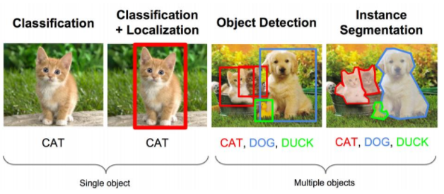
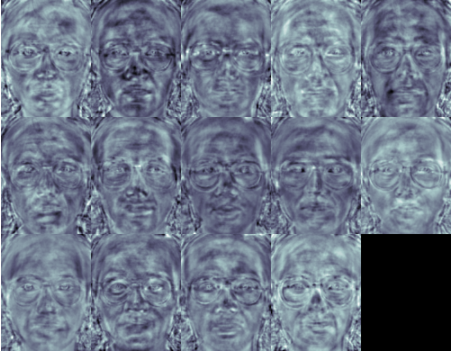
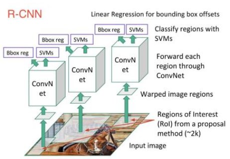
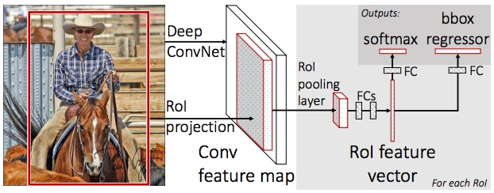
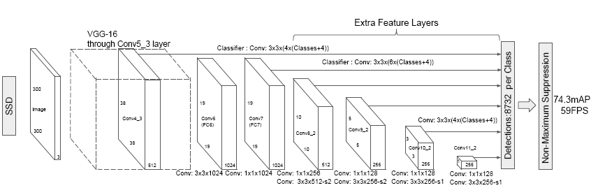
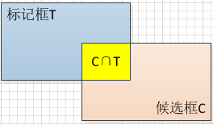

title: 深度学习：目标检测之一（基础篇）
date: 2018-02-16 16:57:43
tags: [深度学习, 目标检测]
categories: [深度学习] 
comments: true
toc: true
---

><font color=#0000FF face="微软雅黑" size=4>Deeper is better?</font>
***

## 一、概述
&emsp;&emsp;目标检测属于计算机视觉的范畴，它在深度学习这一概念还没有提出来之前就存在了。在没有深度神经网络之前，目标检测实现的主要方式还是基于统计或知识的方法。深度学习流行起来之后，鉴于深度神经网络的惊人表现，使得业界对目标检测的研究基本都转移到了以深度神经网络为基础的方向上。

<div  style="text-align:center;">Fisher线性判别人脸识别<font color="red">(图片来源于网络)</font></img></div>

&emsp;&emsp;目标检测按照使用的技术来分，大体范围上可以分成两个时代：

- 传统目标检测；
- 基于深度学习的目标检测。

### 1.1 传统目标检测
&emsp;&emsp;传统目标检测多基于统计或知识，其特征属性多依靠人工设计，检测对象也相对比较局限，以人脸、车牌为主。算法以Cascade + Harr / SVM + HOG / DPM 及其改进、优化算法为主。
&emsp;&emsp;传统目标检测算法的大致流程如下：
>- Step1：确定滑动窗口；
- Step2：利用滑动窗口提取出候选区域；
- Step3：对候选区域进行特征提取；
- Step4：使用分类器（事先已经训练好）进行分类，判断候选区域是否包含有效目标；
- Step5：对所有包含有效目标的候选区域进行合并；
- Step6：作图，绘制出检测目标轮廓框。

&emsp;&emsp;上述步骤对应的流程图如下：

```flow
st=>start: 确定滑动窗口
op1=>operation: 提取候选区域
op2=>operation: 特征提取
op3=>operation: 分类器分类
op4=>operation: 提出包含目标的区域
op5=>operation: 合并选出的候选区域
end=>end: 作图，绘制轮廓框
st->op1(right)->op2(right)->op3->op4->op5->end
```

&emsp;&emsp;本系列文章主要集中于**`基于深度学习的目标检测`**，因此关于传统目标检测的详细信息请参考相关资料，这里列出几篇我阅读过的。
- ①[视觉目标检测和识别之过去，现在及可能](https://zhuanlan.zhihu.com/p/27546796?from=groupmessage&isappinstalled=0)；
- ②[基于深度学习的目标检测研究进展](http://blog.csdn.net/timeflyhigh/article/details/52015163);


#### 1.1.1 基于知识的方法
&emsp;&emsp;对于基于知识的检测方法，其核心思想是模块化。以人脸检测为例，它将人脸划分成眼、鼻、嘴等各个模块的组合。利用先验知识来识别各个模块，同时基于各个模块之间的距离来进行人脸的识别。

#### 1.1.2 基于统计的方法
&emsp;&emsp;基于统计的检测方法则扎根于统计学习。它将整个待检测图片看做一个像素矩阵，利用其统计特性结合一些机器学习的算法进行识别。之前虽然没有去学习过这方面的知识，但是那会儿有实验室的同学是做这个方向的，所以或多或少也了解了一些，只不过现在还能记得的就只有`Fisher线性判别`这么个算法了。

### 1.2 深度学习目标检测
&emsp;&emsp;鉴于深度神经网络强大的逻辑抽象能力、特征提取能力，目前的目标检测几乎都是基于深度学习框架的。基于深度学习的目标检测其检测对象更为广泛，涵盖了生活中各种各样的物体，如自行车、动物、人、车等等。

<div  style="text-align:center;">R-CNN结构图<font color="red">(图片来源于网络)</font></img></div>

&emsp;&emsp;基于深度学习的目标检测又可以分为两大类：
- **深度学习分类算法**；
- **深度学习回归算法**。

#### 1.2.1 深度学习分类算法目标检测
&emsp;&emsp;该类算法首先对待检测的图片进行**Region Proposal(候选区)提取**，与滑动窗口所不同的是，`Region Proposal`利用了图像中的纹理、颜色等等信息，因此其产生的候选窗口数量更少，质量更高。相对于传统的目标检测算法，这类算法**并没有完全抛弃`Region Proposal`**这个设计理念，只不过使用相应的算法大大减少了`Region Proposal`的数量。
&emsp;&emsp;`Region Proposal`提取出候选窗口后，剩下的就是利用深度神经网络对这些候选窗口自动提取特征并进行分类。然后合并包含相同目标的区域，最后输出我们要检测的目标区域。
&emsp;&emsp;这类算法以**`RCNN | Fast-RCNN | Faster-RCNN | SPP-net | R-FCN`**为代表。

<div  style="text-align:center;">Fast-RCNN网络结构图<font color="red">(图片来源于网络)</font></img></div>

&emsp;&emsp;我们对以上算法的特性做一个简单点的汇总，如下表所示：

| 算法 | 特性 | 缺点 |
| :---: | :---: | :---: |
| R-CNN |1.每张图生成1K~2K个候选区域；</br>2.使用CNN自动提取特征；</br>3.使用SVM作为分类器；</br>4.使用回归器精修候选框的位置。| 1.保留了`候选区域`这一理念；</br>2.步骤繁琐（候选+分类+回归）；</br>3.时间及空间复杂度都较高； |
| Fast-RCNN | 1.使用多任务损失函数；</br>2.边框回归放到CNN中训练；</br>3.引入`ROI pooling layer`； | 1. `selective search`算法是瓶颈；</br>2.非`end-to-end`模型；</br>3. Region Proposal使用CPU完成；</br>4.不能满足实际应用需求； |
| Faster-RCNN | 1.更少、质量更高的候选框；</br>2.Region Proposal由卷积层产生；</br>3.真正的end-to-end模型；</br>4.速度和精度均有所提升；</br>5.多尺度anchor； | 1. 仍然不能满足实际应用需求；</br>2.Region Proposal分类计算量偏大； |
| SPP-Net | 1.每张图只提一次卷积层特征；</br>2.输入图像尺寸可变（弹性尺度）； | 1.步骤繁琐；</br>2.只能tune全连接层； |
| R-FCN | 1.使用共享卷积层；</br>2. Regional Proposal后面的卷积层移至共享卷积层；</br>3.不再对每一个ROI镜像卷积计算； | 待补充 |

#### 1.2.2 深度学习回归算法目标检测
&emsp;&emsp;相较于`R-CNN`等基于`Regional Proposal`的分类算法而言，以`SOLO、SSD`等为代表的目标检测算法**抛弃了**生成`Regional Proposal`的过程，直接在**输出层回归出`Bounding Box`的位置和类别**，极大提高了检测速度。

<div  style="text-align:center;">SSD网络结构图<font color="red">(图片来源于网络)</font></img></div>

&emsp;&emsp;我们对以上算法的特性做一个简单点的汇总，如下表所示：

| 算法名称 | 特性 | 缺点 |
| :---: | :---: | :---: |
| YOLO |1.输入图片转换成7\*7网格；</br>2.每个网格预测2个边框；</br>3.使用**NMS**去除冗余窗口；</br>4.`False Positive`大幅降低。| 1.7\*7网格进行回归较为粗糙；</br>2.定位不太准确；</br>3.检测精度不高； |
| SSD | 1.整合了YOLO及FAST-RCNN思想；</br>2.使用局部特征做位置预测；| 待补充|

## 二、入门
&emsp;&emsp;建议读者在阅读本系列之前先了解一些关于**`DNN`**、**`DL`**的相关知识，本文只对**`目标检测`**这个方向的一些术语做介绍。
### 2.1 <a name="anchor"></a>术语
&emsp;&emsp;基于深度学习的目标检测的常用术语罗列如下：
#### 2.1.1  Regional Proposal
&emsp;&emsp;**Regional Proposal（候选区域）**，提取出所有可能包含识别目标的那些候选区域，相比于传统的滑动窗口而言，`Regional Proposal`数量上会更少（通常1K~2K个），质量更高。

#### 2.1.2 NMS
&emsp;&emsp;**NMS（Non-maximum Suppression即非极大值抑制）**，是图像处理中用来消除多余（有交叉或重复）的框，找到最佳的物体检测位置的一个算法。
&emsp;&emsp;<font color="red">备注：</font>
- [1. Paper链接](https://arxiv.org/pdf/1705.02950.pdf)
- [2. 参考博客1](http://blog.csdn.net/qq_14845119/article/details/52064928)
- [3. 参考博客2](http://blog.csdn.net/u011534057/article/details/51235718)


#### 2.1.3 Anchor Box
&emsp;&emsp;**Anchor Box（候选框）**，从原始或卷积后的图片中提取出来，然后用来判断是否存在要识别的目标的小的图片块。

#### 2.1.4 mAP
&emsp;&emsp;**mAP（mean average precision即平均准度）**，用来度量目标检测算法效果的一个指标。
&emsp;&emsp;<font color="red">备注：</font>
- [1. 参考博客1](http://blog.csdn.net/Lu597203933/article/details/41802155)
- [2. 参考博客2](https://www.zhihu.com/question/41540197)

#### 2.1.5 Selective Search
&emsp;&emsp;**Selective Search（选择性搜索）**，利用**颜色、纹理、尺寸、空间交叠**来生成候选区域的算法，相比于传统的滑动窗口算法，`Selective Search`避免了穷举所产生的海量候选区域及其所造成的低效。
&emsp;&emsp;<font color="red">备注：</font>
- [1. Paper链接](https://ivi.fnwi.uva.nl/isis/publications/2013/UijlingsIJCV2013/UijlingsIJCV2013.pdf)
- [2. Python实现](https://github.com/AlpacaDB/selectivesearch)

#### 2.1.6 IoU
&emsp;&emsp;**IoU（Intersection-over-Union即交并比或重叠率）**，是用来度量候选框的有效性的一个指标，目标检测与我们单纯的回归/分类/聚类任务不同，它提取出来的候选框可能没办法与我们事先标记的完全重叠（这是最最理想的情况），实际应用中也没有必要这样苛求。
&emsp;&emsp;于是，我们将两个框相交部分的面积比上两个框并集面积（各自面积之和）作为评价指标，如下图所示：

<div  style="text-align:center;">IoU定义示意图</img></div>

&emsp;&emsp;计算公式为：

$$
\begin{split}
IoU &= \frac{两框交集面积} {两框并集面积} \\\\
&= \frac{S\_{area(T) \bigcap area(C)}} {S\_{area(T) \bigcup area(C)}}\\\\
\end{split}
\tag{ 2 - 1}
$$

#### 2.1.7 ground-truth
&emsp;&emsp;**ground-truth（暂无中文翻译）**是指标定的真实数据。

#### 2.1.7 grid-search
&emsp;&emsp;**grid-search（网格搜索）**通常用来寻找最优超参数，在`R-CNN`的论文中提到，其IoU阈值（**这个值非常关键，直接影响mAP**）的确定就是通过`grid-search`完成的。
&emsp;&emsp;`grid-search`实际上是一种暴力搜索算法，给定一组需要调参的参数的候选值，`grid-search`会穷举各个参数的各种组合，然后根据预设的评分机制找到最优的组合。
&emsp;&emsp;`scikit-learn`包中提供了这个算法，[点此了解详情](http://scikit-learn.org/stable/modules/grid_search.html)。

#### 2.1.8 hard negative mining method
&emsp;&emsp;**hard negative mining method（难分样本挖掘方法）**，根据我们已有的经验可以知道，要训练处一个非常好的模型，你必须要有适量的正样本和负样本，缺一不可。但是有些情况下我们的正样本数量远少于负样本数量（比如目标检测中包含背景的候选框数量远多于包含识别目标的数量），这个时候就需要用到`hard negative mining method`，即挑选出负样本中比较**有代表性的那些（而不是使用全部的负样本集）参与训练**，这些代表性的负样本就称作**`hard negative`**。
&emsp;&emsp;<font color="red">备注：</font>
- [1. Reddit上关于这个问题的答复。](https://www.reddit.com/r/computervision/comments/2ggc5l/what_is_hard_negative_mining_and_how_is_it/)

### 2.2 学习方法
&emsp;&emsp;同样作为深度学习目标检测方向的新手，以我自身的情况做如下建议：
#### 2.2.1 基础准备
&emsp;&emsp;建议先学习了解一些深度学习的基础知识（比如卷积、池化等等。），能对深度神经网络的框架有个大致的了解。

#### 2.2.2 通读
&emsp;&emsp;**通读**一些关于目标检测的经典论文（比如R-CNN、Fast-RCNN、YOLO等等），这个阶段没必要去咬文嚼字，大致了解一下作者的思路，同时懂一些术语（包括但不限于[上小节](#anchor)提到的那些）。

#### 2.2.3 精读
&emsp;&emsp;**精读**相关论文，把之前读过的论文翻出来认真阅读，仔细推敲，做到对论文的每个细节都了然于心。

#### 2.2.4 代码
&emsp;&emsp;找一些开源的（论文作者提供的最好）代码来读，看看别人的具体实现。这个阶段不仅可以加深理解，**还可能发现一些之前读论文没有注意到的问题。**

#### 2.2.5 动手
&emsp;&emsp;读别人千行代码不如自己写十行，这个阶段就自己多练习练习了，如果有实际项目或者大腿抱是最好不过的了。

#### 2.2.6 附件
&emsp;&emsp;最后，附上相关论文链接地址（成稿时均为最新，论文后续不排除会继续更新，可移步至[arxiv.org](https://arxiv.org)搜索最新版），方便查看：
- 1. [R-CNN](https://arxiv.org/pdf/1311.2524.pdf);
- 2. [Fast R-CNN](https://arxiv.org/pdf/1504.08083.pdf);
- 3. [Faster R-CNN](https://arxiv.org/pdf/1506.01497.pdf);
- 4. [SPP-NET](https://arxiv.org/pdf/1406.4729.pdf);
- 5. [R-FCN](https://arxiv.org/pdf/1605.06409.pdf);
- 6. [YOLO](https://arxiv.org/pdf/1506.02640.pdf);
- 7. [SSD](https://arxiv.org/pdf/1512.02325.pdf);