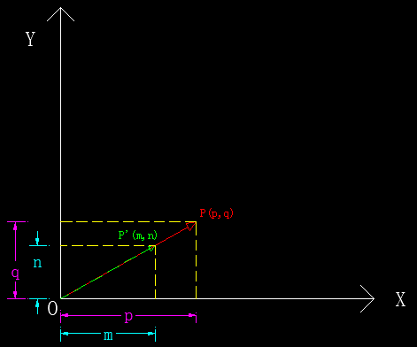
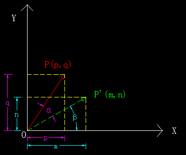

><font color=#0000FF face="微软雅黑" size=4>All in matrix.</font>

### 1. 概述
&emsp;&emsp;最近项目中用到了PCA，并且想基于PCA做一些新的尝试。PCA可以用来**降维**，这是大家都熟知的，也没有人觉得有什么问题。随着项目实际应用的深入，发现自己对特征值和特征向量的理解原来一直很肤浅，应该说我（其实多数从大学量产出来的学生都存在这个问题）只是学会了怎么玩弄数字（**记住了公式**），却没能从根本上去理解为什么要这样做，为什么能这样做。对于理工科学生来说，这是一个相当严重的问题，连最起码的严谨、求实、质疑的精神都没有，恐怕有点贻笑大方。 
&emsp;&emsp;那么问题就来了，这个锅真的就该学生来背吗？    
&emsp;&emsp;我认为这个锅应该甩给高校，国内高等教育的古板与僵化是罪魁祸首。在我的记忆力，能够把书本上的大部分公式用自己的方式（而不是照本宣科）完整的证明和板书一遍的老师，已经算是可遇而不可求了。
<!-- more -->
&emsp;&emsp;本文的主旨就是为了更为形象（几何意义）的去解读特征值**（eigenvalue）**和特征向量**（eigenvector）**，当然不会一上来就开始扯这两个东东，先从一些较为基础的概念扒起，力求做到概念上的平滑过渡。 
&emsp;&emsp;在本文写作之前，也在网上搜索过大量的相关资料（包括群英荟萃的**知乎**），然而并没有一篇真正从源头解释清楚这两个词语的文章（可能是有些问题太过基础，大神们都不太想讲）。    
&emsp;&emsp;本文力图让非数学专业的同学也能非常容易的理解特征值和特征向量。**文章有点长（有些东西远非三言两语能解释清楚的），如果你能耐心的看完，相信一定会有所收获。**    
&emsp;&emsp;OK，我们先从最基本的概念开始。

### 2. 基础概念
#### 2.1 向量
&emsp;&emsp;提到向量，最早接触这个东西应该是在高中的时候，那个时候的定义很简单：一条有起点、有终点、有方向（箭头指示）的线段，比如下面这样：  

<div align='center'>图2-1　　二维平面中的向量</div>


<div align='center'>图2-2　　三维空间中的向量</div>  

&emsp;&emsp;是的，就是这么简单直白。似乎高中那会儿所有的事情都是挺简单的。上了大学，很多事就不再那么简单了，就连向量也有了新的玩法，主要是在工科的计算机和理科的数学领域做了概念的延伸和扩展。下面我们分别从物理、计算机、数学三个角度来介绍向量。
##### 2.1.1 物理学的向量
&emsp;&emsp;物理学里面的向量，不太关注它的起点，更侧重于其**方向、大小（箭头长度）**。只要这两个参数相同，不管如何移动，我们始终认为它们是同一个向量。这个时候的向量通常是有着非常明确而清晰的几何意义的，比如带电粒子受到的洛伦兹力：

<div align='center'>图2-3　　带电粒子的洛伦兹力</div>  

##### 2.1.2 计算机中的向量
&emsp;&emsp;而对于计算机领域来说，向量其实是一组**有序**的数字列表（C/C++以及Java中的数组、Python中的列表等）， 比如：
```python
# python tuple
vector1 = (3, 5, 2, 9, 7)
# python list
vector2 = [2, 4, 0.6, 3, 1.3]
```
&emsp;&emsp;特别是在机器学习领域，每一个向量通常对应了一个具体的样本，而向量的每个元素，则表示相应的特征属性的取值。这个时候的向量通常并没有具体的几何含义与之对应。

##### 2.1.3 数学的向量
&emsp;&emsp;数学中的向量则是兼具了物理学的概念清晰和计算机的通用性优点，并且对向量的定义和运算进行了严格的规定及数学证明，比如：

<div align='center'>图2-4　　数学中的向量</div>  

##### 2.1.4 向量的表达形式
&emsp;&emsp;如上所述，向量在不同的领域其表达形式也不尽相同，甚至大相径庭，在几何学中，向量通常用一对圆括号包裹，并且是横着书写，如：
$$
\vec w = (3, 2, 5)
\tag {向量的几何表达形式}
$$
&emsp;&emsp;而向量在线性代数中的矩阵表达式则为：
$$\vec w = 
\begin{bmatrix}
3\\\\
2\\\\
5
\end{bmatrix} 或 \ 
\begin{bmatrix}
3\ \ 2\ \ 5
\end{bmatrix}^T
\tag {向量的矩阵表达形式}
$$
##### 2.1.5 注意
&emsp;&emsp;上面只是比较粗略的对向量的概念做了一个分类，务必注意不要割裂了来看，因为实际中三者的概念往往是相互交叉融合的，比如你向量的定义和证明要从数学角度来保证其严谨性，但是在涉及大量运算的时候，往往又需要借助计算机的矩阵运算来实现。
&emsp;&emsp;本文则以几何概念为主，方便大家更直观、本质的去理解向量。
#### 2.2 基
&emsp;&emsp;基这个词语，也是被大家玩坏了。不得不说明，本文中的基纯粹是数学和几何学上的含义，请勿做不必要的联想。
##### 2.2.1 概念
&emsp;&emsp;根据维基百科的解释，基（也称为基底）是描述、刻画向量空间的基本工具。向量空间的基是它的一个特殊的子集，基的元素称为基向量。向量空间中任意一个元素，都可以唯一地表示成基向量的线性组合。基的本质就是一组（一个或多个）n（n≥0)维向量，以二维平面坐标系为例，我们通常会采用基<font color='green'>$\vec i(1, 0)$</font>和<font color=#FF33CC>$\vec j(0, 1)$</font>，如下图所示：

<div align='center'>图2-5　　二维平面中的基及向量</div> 

&emsp;&emsp;定义了两个基后，二维平面坐标系中的其它任意向量都可以表示为这两个基的线性组合，比如上图2-5中的向量$\overrightarrow{OP}=(3,2)$，可以表示为$\overrightarrow{OP}=3\vec i + 2\vec j$，其含义非常明确，即①先往$X(基向量i)$正向移动**<font color='green' size=4>3<font>**个单位②再往$Y(基向量j)$正向移动**<font color=#FF33CC size=4>2</font>**个单位。这也是向量在给定坐标系（这里是$X-Y$）下的坐标值最本质的含义——把向量看做物体的运动。
&emsp;&emsp;**<font color='red' >注意：基向量可以是任意向量（比如$\vec i=(2,1)$），并不一定是单位向量，上面只是举了一个非常特殊的例子（为了方便下文的一些概念的叙述和证明）。</font>**

##### 2.2.2 <a name="vector_transform"></a>向量的基变换
&emsp;&emsp;正如我在2.2.1中提到的，在二维坐标系中我们通常都会采用<font color='green'>$\vec i(1, 0)$</font>和<font color=#FF33CC>$\vec j(0, 1)$</font>作为基向量，这样简洁、直观，所见即所得（坐标值），但是有时候我们需要以指定的向量（可能是任意值）来作为基去表示其它向量，这就涉及到**向量的基变换**。
&emsp;&emsp;比如现在要以<font color='green'>$\vec a(1, 3)$</font>和<font color=#FF33CC>$\vec b(-1, 2)$</font>作为基来表示$\overrightarrow{OP}$，如下图所示：

<div align='center'>图2-6　　基变换示意图</div> 

&emsp;&emsp;给出了变换后的基向量，如何求解任意向量变换后的坐标呢？很多教科书上都给出了转换公式，但是没有从几何的角度去解释清楚转换的过程以及公式的推导。推荐大家去看看[3Blue1Brown](https://www.youtube.com/playlist?list=PLZHQObOWTQDPD3MizzM2xVFitgF8hE_ab)的视频，讲的非常好，国内很多所谓的教授看了这个视频可以找个自习室好好蹲墙角了。
&emsp;&emsp;作者在视频中提到了基变换的核心点，那就是**变换前后的物体运动的本质（方向、大小）是不变的**，只要牢牢记住这一点，就能掌握整个变换的脉络。以上面的数据来说，变换后的基向量$\vec a$和$\vec b$的坐标值分别为$(1,3)、(-1,2)$，不管基如何变换，向量的本质（物体的运动）是不应该改变的，即变换后的向量$\vec P'$相对变换后的基的运动也是：
&emsp;&emsp;<font color=#FF9900>①先沿着基向量$\vec a$移动3个单位（因为变换前的$\vec i$对应变换后的$\vec a$)；</font>
&emsp;&emsp;<font color=#FF6600>②再沿着基向量$\vec b$移动2个单位。</font>
&emsp;&emsp;知道了变换后的运动情况，就可以推导出每一步运动后的坐标值，如下：
&emsp;&emsp;<font color=#0000FF>①沿$\vec a$移动3个单位，即$3\vec a$，到达$P'_a=(0,0) + (3,9)=(3,9)$；</font>
&emsp;&emsp;<font color=#9933FF>②再沿$\vec b$移动2个单位，即$2\vec b$，到达最终点$P'=(3,9) + (-2,4)=(1,13)$。</font>
&emsp;&emsp;变换的详细图解如下所示：

<div align='center'>图2-7　　变换后的向量OP'</div> 

&emsp;&emsp;图中蓝色箭头即为基变换后的向量$OP'$，根据图中的距离标注数据可以看出我们推导出的变换后的坐标值和实测值**（使用AutoCAD2010版自动标注）**完全吻合！
&emsp;&emsp;其实上述变换还可以分作**四步**来看待，即把沿$\vec a$和$\vec b$方向的移动分别拆分成沿X轴和Y轴的移动：
&emsp;&emsp;①沿X轴正方向移动3（3·$a_x$）个单位长度，到达点(3,0)；
&emsp;&emsp;②沿Y轴正方向移动9（3·$a_y$）个单位长度，到达点(3,9)（到这一步相当于完成了沿$\vec a$方向移动3个单位长度）；
&emsp;&emsp;③沿X轴负方向移动2（2·$b_x$）个单位长度，到达点(1,9)；
&emsp;&emsp;④沿Y（2·$b_y$）轴正方向移动4个单位长度，到达终点(1,13)（到这一步相当于完成了沿$\vec b$方向移动2个单位长度）；
##### 2.2.3 向量基变换的矩阵式
&emsp;&emsp;2.2.2中虽然推到出了任意向量在基变换后的坐标表达式，但是显然还没有跟线性代数（矩阵、矩阵运算）衔接起来，在坐标表达式的两步计算中，我们也只看到一堆数字在进行运算，并不能清晰的反映出基向量是如何参与变换的（虽然为了大家更容易理解我已经加了不少说明文字），而矩阵可以很好地解决这些问题。
&emsp;&emsp;对于变换后的基的矩阵表达式，因为每一个基向量都是二维（分别对应X、Y坐标值）的，所以该矩阵有两行(m=2)，又由于有两个基向量（即$\vec a$和$\vec b$），所以矩阵有两列(n=2)，则变换后基的矩阵表达式为：
<font color="blue">
$$
\vec w = 
\begin{bmatrix}
a\ \ b
\end{bmatrix} = 
\begin{bmatrix}
1\ \ -1\\\\
3\ \ \ \ \ \ 2
\end{bmatrix}
\tag{2-1}
$$
</font>
&emsp;&emsp;需要变换的向量$\overrightarrow{OP}$的矩阵表达式则为：
<font color=#9933CC>
$$
\overrightarrow{OP} = 
\begin{bmatrix}
3\\\\
2
\end{bmatrix}
\tag{2-2}
$$
</font>
&emsp;&emsp;基变换后的向量$\overrightarrow{OP'}$的矩阵表达式则为：
<font color="red">
$$
\begin{split}
\overrightarrow{OP'} = 
3·\vec a + 2·\vec b &= 
3·\begin{bmatrix}
1\\\\
3
\end{bmatrix} +  2·
\begin{bmatrix}
-1\\\\
2
\end{bmatrix} \\\\
&= 
\begin{bmatrix}
1\ \ -1\\\\
3\ \ \ \ \ \ 2
\end{bmatrix} \cdot
\begin{bmatrix}
3\\\\
2
\end{bmatrix} = 
\begin{bmatrix}
1\\\\
13
\end{bmatrix} = 
\vec w \cdot
\overrightarrow{OP} \\\\
\end{split}
\tag{2-3}
$$
</font>

&emsp;&emsp;由此我们可以得出一个重要结论：<font color="red">**进行基变换后的向量等于变换后要使用的基向量矩阵左乘要变换的向量。换个角度来讲，对一个向量左乘一个矩阵，在某些情况下也可以理解为是在进行基变换（但并非所有左乘都是基变换）。
&emsp;&emsp;这里有非常重要的一点需要强调，要注意将数学运算和几何含义对应起来的充分和必要性。比如，基变换对应的数学运算一定是左乘一个矩阵，但左乘一个矩阵的几何意义却并非一定是基变换。这个道理跟“唐僧骑的一定是白马，但骑白马的却并不一定是唐僧”是一样的，后面的很多概念也与此类似。**</font>
&emsp;&emsp;<font color="blue">也就是说，原来以$(\vec i, \ \vec j)$为基，且坐标值为$(3,2)$的点，在新基$(\vec a, \ \vec b)$下的坐标为$(1, 13)$。</font>
&emsp;&emsp;更一般的，假设变换后的基、要变换的向量分别为：
$$
\vec w =
\begin{bmatrix}
 \vec {i'}\ \ \vec {j'}
\end{bmatrix} = 
\begin{bmatrix}
i'_1\ \ i'_2\\\\
j'_1\ \ j'_2
\end{bmatrix}
\ \ ，\ \ 
\overrightarrow{OP} = 
\begin{bmatrix}
 x_0\\\\
y_0
\end{bmatrix}
$$
&emsp;&emsp;则基变换后的向量为：
$$
\overrightarrow{OP'} =
\begin{bmatrix}
i'_1\ \ i'_2\\\\
j'_1\ \ j'_2
\end{bmatrix} \cdot
\begin{bmatrix}
 x_0\\\\
y_0
\end{bmatrix}
$$
##### 2.2.4 基变换
&emsp;&emsp;在[上小节](#vector_transform)中我们讲了对任意向量进行基变换的几何意义及口算方法，那么基之间相互切换的时候如何计算呢（即基变换）？我们仍以上小节提到的两组基为例，分别记两组基$(\vec i, \vec j)、(\vec a, \vec b)$为新基和旧基，并用$\vec B\_{old}、\vec B\_{new}$来加以区分，即有：
$$
\vec B\_{old} = 
\begin{bmatrix}
\vec i\ \ \vec j
\end{bmatrix} = 
\begin{bmatrix}
1\ \ \ \ \ 0 \\\\
0\ \ \ \ \ \ 1
\end{bmatrix} \\\\
\vec B\_{new} = 
\begin{bmatrix}
\vec a\ \ \vec b
\end{bmatrix} = 
\begin{bmatrix}
1\ \ -1\\\\
3\ \ \ \ \ \ 2
\end{bmatrix}
\tag{2-4}
$$
&emsp;&emsp;<font color="red">注意：这里的**基变换**是强调两组基之间的相互转化，而不是上小节中的任意一个向量从一组基切换到另一组基后的新向量。</font>
&emsp;&emsp;我们的目标是$\vec B\_{old} \to \vec B\_{new}$以及$\vec B\_{new} \to \vec B\_{old}$，因为两组基都是一个$2\*2$的矩阵，所以它们之间要相互转换，需要左乘或右乘一个$2\*2$的矩阵，所乘的这个矩阵有个专用名词叫做**过渡矩阵**，非常形象，从一组基过渡到另一组基，你就得借助这个矩阵。那么究竟该如何求出这个过渡矩阵呢？
&emsp;&emsp;要求得这个答案并且从几何的角度去揭开这个神秘术语的面纱，我们还需要一些基础知识。因此我们暂且先跳过这一个坑，等讲完2.3节的线性变换后再回来填坑。

#### 2.3 线性变换
&emsp;&emsp;线性变换在（或线性映射），**有的书籍把这两个词语作为同义词使用，而有些书籍则不然。**这里我们采纳[wikipedia](https://en.wikipedia.org/wiki/Linear_map)词条，其数学定义为：
$$
\begin{split}
f(\vec u + \vec v) &= f(\vec u) + f(\vec v) \\\\
f(c\vec u) &=c f(\vec u)
\end{split}
\tag{2 - 5}
$$
&emsp;&emsp;式中$\vec u、\vec v$分别属于$\vec V、\vec W$两个向量空间。<font color="red">特别的，当$\vec V = \vec W$即两者为同一个向量空间时，我们称之为**`Linear Operator或者Endomorphism（保留wikipedia上的原话，不做翻译）`**。</font>上式也可以整合到一个式子里面，如下所示：
$$
f(m\vec u +n \vec v) = mf(\vec u) + nf(\vec v)
\tag{2 - 6}
$$
&emsp;&emsp;它的数学含义是：其运算由两种基本操作即**向量加法和标量乘法**所组成，并且保证了这两种运算的封闭性。
&emsp;&emsp;然而，我不是数学专业的学生，也没有成为高斯、欧几里得这类神人的追求（智商），对这些一套一套的咬文爵字的东西不感兴趣，我只喜欢直观的，简单的。对于众多像我这样的同学来说，你只需要记住下面的几点就可以了，以二维平面向量空间为例（**敲黑板！！！**）：
- 线性变换前后，坐标系**原点保持不动**；
- 线性变换前后，坐标系中任意一条直线必须**保持其直线特性，不能弯曲**；
- 线性变换前后，坐标系中任意两条平行的直线，必须**保持其平行特性**。

&emsp;&emsp;这就是线性变换最简洁、明了的几何特性。当然，上面三条也可以简化为[3Blue1Brown](https://www.youtube.com/watch?v=kYB8IZa5AuE)所总结成的一条：**变换前后，坐标系中的网格线两两保持等距且平行**。

##### 2.3.1 线性变换类型
&emsp;&emsp;线性变换按照其对原图形所产生的影响，分为：**旋转、缩放、投影、镜像、剪切、复合**。而按照变换前后图形是否可完全恢复，又分为：**可逆变换、不可逆变换。**下面我们会对这些变换逐一进行介绍。
&emsp;&emsp;要特别注意的一点是，有一种变换看起来像极了线性变换，但并不满足线性变换的条件，那就是**平移**，参见上面的线性变换几何特性的第一条。

##### 2.3.2 <a name="transform_scale"></a>缩放
&emsp;&emsp;缩放应该是线性变换里面最简单、最容易理解的。**缩放（这里指的是各方向缩放引子均相同的均匀缩放）仅仅改变了图形的尺寸大小，但是并没有改变图形的内部结构关系，也没有改变图形与坐标轴的夹角！**线性变换中的缩放的图示如下：
<div  style="text-align:center;">图2-8    线性变换之缩放示意图</img></div>
&emsp;&emsp;由图我们有：
$$
\begin{cases}
\frac{m}{p} = \frac{||\vec P\_{new}||}{||\vec P\_{old}||} \\\\
\frac{n}{q} = \frac{||\vec P\_{new}||}{||\vec P\_{old}||}
\end{cases}
\tag{2 - 7}
$$
&emsp;&emsp;记$\frac {||\vec P\_{new}|| } {||\vec P\_{old}||} = k$，称为缩放系数，于是我们有：
$$
\begin{cases}
m = k \cdot p + 0 \cdot q \\\\
n = 0 \cdot p + k \cdot q
\end{cases}
\tag{2 - 8}
$$
&emsp;&emsp;写成矩阵表达式为：
$$
\begin{bmatrix}
m\ \\\\
n
\end{bmatrix} = 
\begin{bmatrix}
k & 0\\\\
0 & k
\end{bmatrix}
\begin{bmatrix}
p \\\\
q
\end{bmatrix}
\tag{2 - 9}
$$
&emsp;&emsp;也即缩放前后旧向量和新向量的关系为：
$$
\begin{cases}
\vec P\_{old} =
\begin{bmatrix}
\frac{1}{k} & 0\\\\
0 & \frac{1}{k}
\end{bmatrix}
\vec P\_{new}  = A \cdot \vec P\_{new}\\\\
\vec P\_{new} =
\begin{bmatrix}
k & 0 \\\\
0 & k
\end{bmatrix} 
\vec P\_{old}  = A^{-1} \cdot \vec P\_{old}
\end{cases}
\tag{2 - 10}
$$
&emsp;&emsp;由上可知，对一个向量左乘一个**主对角线上元素相同的对角矩阵**，其几何意义就是缩放。我们称这个为缩放矩阵。记住**缩放矩阵的特性**：
- 主对角元素相等（同值、同号）；
- 非主对角线上元素均为0（对角矩阵）。

&emsp;&emsp;怎么样，够简单吧，那是不是该介绍下一个线性变换了？先别着急往下走，这里面要讨论的东西还多呢。对于非主对角线上的元素为0这一点，我们是从数学公式推导出来的，那么单就这一特性，代表的几何含义又是什么？三维及更高为空间的缩放矩阵又是什么样的？
&emsp;&emsp;先来看第一点，要揭开这个谜团其实也很简单。回顾下我们[2.2.2](#vector_transform)小节中讲的向量的基变换，我们把缩放也看做是对已知向量的基变换，变换后的新基为$\vec e\_1 = [k, 0]^T、\vec e\_2 = [0, k]^T$，变换后的新基与原来的旧基$\vec i = [1, 0]^T、\vec j = [0, 1]^T$方向重合，唯一的差异仅仅只是**尺度**上有所放大/缩小，比例为$k$，而基变换的本质又是沿着基向量方向的运动，<font color="red">因此当我们用新基去度量旧基中的图形时，运动的方向并没有改变，而只是运动的距离有所变化。</font>
&emsp;&emsp;而如果非主对角线上的元素不为0，新基相对于旧基不仅有尺寸上的改变，还有方向（相对于坐标轴的夹角）的改变，用这样的新基去表示一个向量时其对应的运动方向、尺寸均已改变。
&emsp;&emsp;再来看第二点，有了上面说的这些内容，这个问题也很容易了。仍然把缩放变换视作向量的基变换，要保持向量变换前后只有尺度上的改变，那么变换后的新基的基向量应该与原来的基向量方向一致。了解了这一店，对于n维坐标系，其缩放矩阵我们也能随手写下来，如下所示：
$$
A = 
\underbrace{
n \begin{cases}
\begin{bmatrix}
k & 0 & 0 & \cdots & 0 \\\\
0 & k & 0 & \cdots & 0 \\\\
\vdots & \ddots & \ddots & \ddots & \vdots \\\\
0 & 0 & 0 & \cdots & k
\end{bmatrix}
\end{cases}} \_{n}
\tag{2 - 11}
$$
##### 2.3.3 旋转
&emsp;&emsp;我们仍先以二维向量为例，旋转前的向量为$\vec P\_{old} = (p, q)$（图中的点P），旋转后的向量$\vec P\_{new} = (m, n)$（图中的点P'）。由下图可知，旋转最直观的几何概念就是，只改变了向量（图形）与坐标轴的夹角，而没有改变它的形状。旋转前后向量的情况如下图所示：
<div  style="text-align:center;">图2-9 线性变换之旋转示意图</img></div>
&emsp;&emsp;由图可知，新向量相对于原向量顺时针旋转了$\alpha^°，\alpha \neq 0$，旋转后的新向量与**X**轴的夹角为$\beta^°$，由图可得到下列方程组：
$$
\begin{split}
\begin{cases}
||\vec P\_{old}|| \cdot cos(\alpha + \beta) = p \\\\
||\vec P\_{old}|| \cdot sin(\alpha + \beta) = q \\\\
||\vec P\_{new}|| \cdot cos(\beta) = m \\\\
||\vec P\_{new}|| \cdot sin(\beta) = n \\\\
||\vec P\_{old}|| = ||\vec P\_{new}||
\end{cases}
\end{split}
\tag{2 - 12}
$$
&emsp;&emsp;为方便讨论，我们记$||\vec P\_{old}|| = ||\vec P\_{new}|| = R$，它表示向量的长度值（二范数），则将上述方程组展开有：
$$
\begin{cases}
R \cdot cos(\alpha)cos(\beta) - R \cdot sin(\alpha)sin(\beta) = p \\\\
R \cdot sin(\alpha)cos(\beta) + R \cdot cos(\alpha)sin(\beta) = q \\\\
R \cdot cos(\beta) = m \\\\
R \cdot sin(\beta) = n \\\\
\end{cases}
\tag{2 - 13}
$$
&emsp;&emsp;将上式(2 - 13)的最后两个式子分别代入第一、第二个式子有：
$$
\begin{cases}
p = m \cdot cos(\alpha) - n \cdot sin(\alpha) \\\\
q = m \cdot sin(\alpha) + n \cdot cos(\alpha)\\\\
\end{cases}
\tag{2 - 14}
$$
&emsp;&emsp;上式(2 - 14)即为旋转后原向量坐标值关于新向量的坐标值的表达式，写成矩阵的形式如下：
$$
\begin{bmatrix}
p\ \\\\
q
\end{bmatrix} = 
\begin{bmatrix}
cos(\alpha)\ \ \ \ \ -sin(\alpha) \\\\
sin(\alpha)\ \ \ \ \ \ cos(\alpha)
\end{bmatrix}
\begin{bmatrix}
m \\\\
n
\end{bmatrix}
\tag{2 - 15}
$$
&emsp;&emsp;也即旋转后旧向量和新向量的关系为：
$$
\begin{cases}
\vec P\_{old} =
\begin{bmatrix}
cos(\alpha)\ \ \ \ \ -sin(\alpha) \\\\
sin(\alpha)\ \ \ \ \ \ cos(\alpha)
\end{bmatrix}
\vec P\_{new}  = A \cdot \vec P\_{new}\\\\
\vec P\_{new} =
\begin{bmatrix}
cos(\alpha)\ \ \ \ \ \ sin(\alpha) \\\\
-sin(\alpha)\ \ \ \ \ cos(\alpha)
\end{bmatrix} 
\vec P\_{old}  = A^{-1} \cdot \vec P\_{old}
\end{cases}
\tag{2 - 16}
$$
&emsp;&emsp;<font color="red">由上式可知，对一个向量左乘一个**关于角度的三角函数矩阵**，其几何意义就是**旋转**。我们称这个矩阵为**旋转矩阵**。</font>当然，大多数时候旋转矩阵并不会以三角函数的形式表达，而是一个普通的实数矩阵。因此我们要记住二维平面上的**旋转矩阵的特征**：
- 对角线上元素相同，均为旋转角度的**余弦值**；
- 处于对称位置的非对角线元素互为相反数，其值为旋转角度的**正弦值**；
- 非对角线元素符号的正负与选取的方向有关。

&emsp;&emsp;记住上述三个特性后，给定旋转角度我们就能随手写出二维平面内的旋转矩阵，这样有利于我们马上要讲的高维空间的旋转矩阵的求解。
<div align="center"><font color="blue">以下部分需要自行脑补的知识点较多，建议作为选读内容。</font>
***
&emsp;&emsp;对于三维及更高纬度空间中的的旋转问题，其旋转矩阵的求解更复杂一些，不过在几何意义上并没有太大的本质区别。
&emsp;&emsp;对于三维空间$XYZ$来说，任意一次旋转，我们都可以拆分为在平面$XOY（Yaw角）、XOZ（Pitch角）、YOZ（Roll角）$的旋转的合成（本来复合变换这部分是在本节最后讲的，但这里为了求解高维空间的旋转矩阵，不得不提前讲一些。），并记这三个旋转的角度值为$\alpha、\beta、\gamma$，有了我们刚才讲的旋转矩阵的特性，随手就能写出这三个平面内的旋转矩阵（均为顺时针旋转）来，如下所示：
$$
\begin{cases}
R\_{XOY} = 
\begin{bmatrix}
cos(\alpha) & -sin(\alpha) &\boxed{\color{blue}0}\\\\
sin(\alpha) & cos(\alpha) &\boxed{\color{blue}0} \\\\
\boxed{\color{blue}0} &\boxed{\color{blue}0} &\boxed{\color{red}1}
\end{bmatrix} 
\stackrel{define}{\longrightarrow} Yaw角（绕Z轴）
\\\\
\\\\
R\_{XOZ} = 
\begin{bmatrix}
cos(\beta) &\boxed{\color{blue}0} &sin(\beta) \\\\
\boxed{\color{blue}0} &\boxed{\color{red}1} &\boxed{\color{blue}0} \\\\
-sin(\beta) &\boxed{\color{blue}0} &cos(\beta)
\end{bmatrix}
\stackrel{define}{\longrightarrow} Pitch角（绕Y轴）
\\\\
\\\\
R\_{YOZ} = 
\begin{bmatrix}
\boxed{\color{red}1} & \boxed{\color{blue}0} & \boxed{\color{blue}0} \\\\
\boxed{\color{blue}0} & cos(\gamma) & -sin(\gamma) \\\\
\boxed{\color{blue}0} & sin(\gamma) & cos(\gamma)
\end{bmatrix}
\stackrel{define}{\longrightarrow} Roll角（绕X轴）
\end{cases}
\tag{2 - 17}
$$
&emsp;&emsp;注意：[wiki](https://en.wikipedia.org/wiki/Rotation_matrix#Ambiguities)词条的三维空间中，绕Z、X轴的旋转均以逆时针为正，为保持与wiki的一致性，这里我们不再使用上面二维平面中的逆时针旋转为正。因此式（2-17）中的第一、三个矩阵中的正弦值符号有所不同。
&emsp;&emsp;只要记住了前面讲的旋转矩阵的特性，这三个矩阵很轻松的就能写出来，只是有两个地方容易弄错。第一个是矩阵中带框的绿色数字部分，第二个是矩阵中带框的蓝色数字部分。以$R\_{XOY}$来说，因为是在平面**XOY**内进行的旋转，所以旋转前后其**Z**坐标值不会发生变化。因此矩阵中**对角线上**该坐标轴位置处的系数应该为**1（而不是0）**，而**非对角线**凡是与不变的坐标轴有关的位置处的系数应该为**0（而不是1）**，至于原因，我们已经在[2.3.2](#transform_scale)小节中讲了。
&emsp;&emsp;有了这三个旋转矩阵，我们就可以进行复合（合成）了。这里需要特别值得注意的是，三个旋转矩阵的复合顺序是有讲究的，因为这三个旋转矩阵都不是对称阵，因此最后的矩阵乘法运算结果与相乘的顺序严格相关。对这一现象的解释就是，仍然把每一次旋转当做向量的基变换，每一次基变换都是基于前一次操作后的新基的，而每一次旋转后，基变量的大小、方向已经发生了改变（而不再是原本的$(\vec i, \vec j)$）。
&emsp;&emsp;**按照Z-Y-X（<font color="red">这里我们采用Z-Y-X旋转顺序的[Tait-Bryan角](https://en.wikipedia.org/wiki/Euler_angles)</font>）**的旋转顺序，我们的旋转矩阵作用顺序及作用结果如下：
$$
\begin{split}
\vec P\_{new} &= \underbrace{ R\_{XOY}
\underbrace{ (R\_{XOZ}
\underbrace{ (R\_{YOZ} \vec P\_{old}) } \_{绕X轴旋转}
} \_{绕Y轴旋转}) } \_{绕Z轴旋转} \\\\
&= (R\_{XOY} R\_{XOZ} R\_{YOZ})  \vec P\_{old} \\\\
&=
\begin{bmatrix}
cos(\alpha) cos(\beta) & - sin(\alpha) cos(\gamma) +  cos(\alpha) sin(\beta) sin(\gamma) &  sin(\alpha) sin(\gamma) + cos(\alpha) sin(\beta) cos(\gamma) \\\\
sin(\alpha) cos(\beta) & cos(\alpha) cos(\beta)  +  sin(\alpha)sin(\beta) sin(\gamma) &  -cos(\alpha)sin(\gamma) + sin(\alpha) sin(\beta) cos(\gamma) \\\\
-sin(\beta) & cos(\beta)sin(\gamma) &  cos(\beta) cos(\gamma) \\\\
\end{bmatrix} 
\vec P\_{old}
\end{split}
\tag{2 - 18}
$$

&emsp;&emsp;<font color="red">**注意：选取不同的顺序会得出完全不同的旋转矩阵表达式，这里仅做演示用，并非唯一结果。**</font>
&emsp;&emsp;对于四维及以上空间，去讨论其几何意义已经是不可能也不具备实际价值的了（反正我是想象不出四维空间长什么样）。其旋转矩阵资料参见[Givens rotation](https://zh.wikipedia.org/wiki/%E5%90%89%E6%96%87%E6%96%AF%E6%97%8B%E8%BD%AC)。本部分选读内容由于涉及的知识点太多，这里就不深入去探讨了，写这部分的目的也仅仅是为了方便理解我们后面要讲的内容，感兴趣的请自行查阅资料。
&emsp;&emsp;附上本小节所参考的一些网络资料如下：
- 1. [旋转矩阵与四元数](http://insaneguy.me/2015/03/25/rotation_matrix_and_quaternions/);
- 2. [Yaw, pitch, and roll rotations](http://planning.cs.uiuc.edu/node102.html);

***
&emsp;&emsp;作为最基本的线性变换之一的操作，掌握旋转矩阵的特性也是非常重要的。
### 3. 后记
#### 3.1 结语
&emsp;&emsp;本系列才开了个头就写结语似乎有点怪怪的，但我觉得有必要这样。看到各位的留言，实在惭愧。因为平时工作较忙，博客这边就有点力不从心，不过请各位放心，我一定把本系列写好、写完。你们的批评和支持将是我最诚挚的动力！
#### 3.1 修改记录
&emsp;&emsp;1. <font color="red">**2018-03-04** </font>修改2.2.2节的标题**“基变换”**为**“向量的基变换”**，原标题可能会误导读者，**线性代数**中的**`基变换`**更侧重于两组不同的基之间如何进行转换，涉及到**`过渡矩阵`**，而我在这节中讲的则更侧重于给定坐标系中任意向量在新、旧基之间转换时如何计算。
&emsp;&emsp;2. <font color="red">**2018-03-04**</font> 修改2.2.3节的标题**“基变换的矩阵式”**为**“向量基变换的矩阵式”**，原因同上。