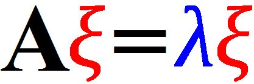
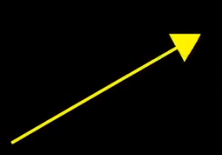
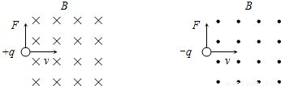
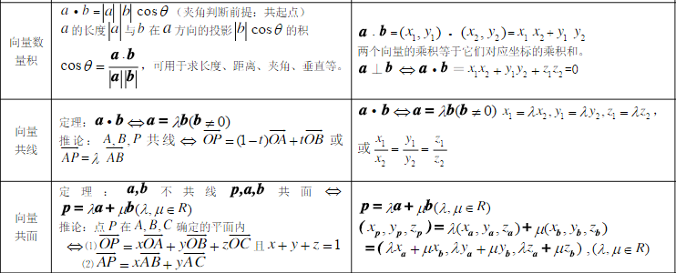
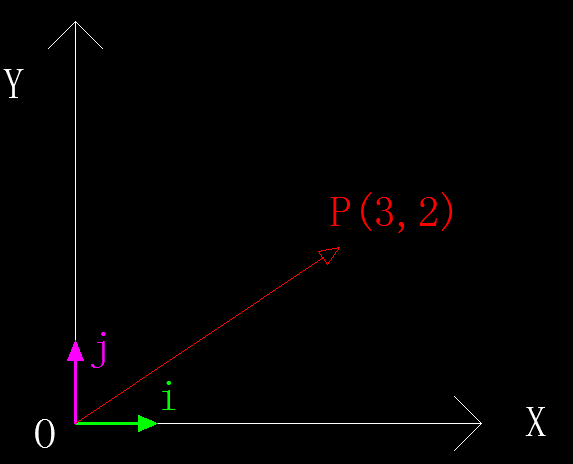
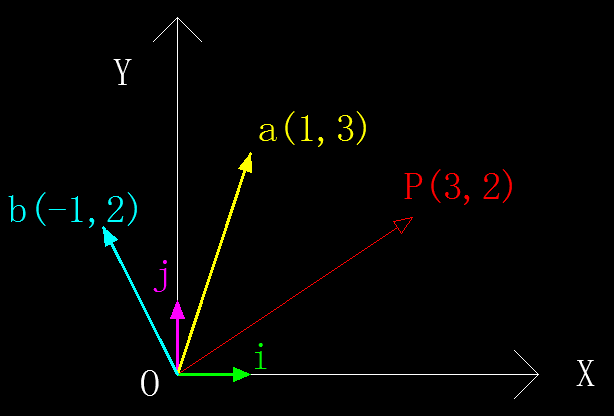
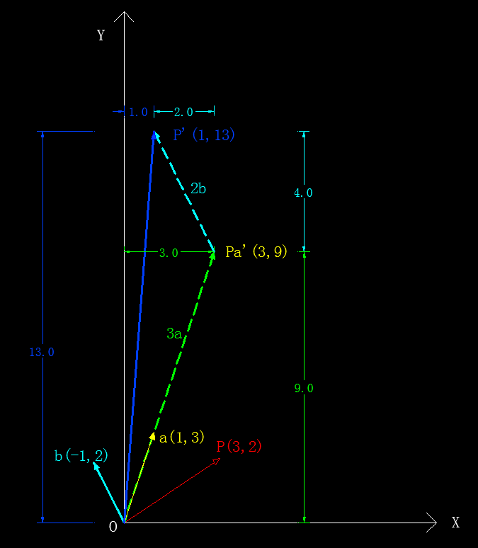

><font color=#0000FF face="微软雅黑" size=4>All in matrix.</font>

### 1. 概述
&emsp;&emsp;最近项目中用到了PCA，并且想基于PCA做一些新的尝试。PCA可以用来**降维**，这是大家都熟知的，也没有人觉得有什么问题。随着项目实际应用的深入，发现自己对特征值和特征向量的理解原来一直很肤浅，应该说我（其实多数从大学量产出来的学生都存在这个问题）只是学会了怎么玩弄数字（**记住了公式**），却没能从根本上去理解为什么要这样做，为什么能这样做。对于理工科学生来说，这是一个相当严重的问题，连最起码的严谨、求实、质疑的精神都没有，恐怕有点贻笑大方。 
&emsp;&emsp;那么问题就来了，这个锅真的就该学生来背吗？    
&emsp;&emsp;我认为这个锅应该甩给高校，国内高等教育的古板与僵化是罪魁祸首。在我的记忆力，能够把书本上的大部分公式用自己的方式（而不是照本宣科）完整的证明和板书一遍的老师，已经算是可遇而不可求了。  
&emsp;&emsp;本文的主旨就是为了更为形象（几何意义）的去解读特征值**（eigenvalue）**和特征向量**（eigenvector）**，当然不会一上来就开始扯这两个东东，先从一些较为基础的概念扒起，力求做到概念上的平滑过渡。 
&emsp;&emsp;在本文写作之前，也在网上搜索过大量的相关资料（包括群英荟萃的**知乎**），然而并没有一篇真正从源头解释清楚这两个词语的文章（可能是有些问题太过基础，大神们都不太想讲）。    
&emsp;&emsp;本文力图让非数学专业的同学也能非常容易的理解特征值和特征向量。**文章有点长（有些东西远非三言两语能解释清楚的），如果你能耐心的看完，相信一定会有所收获。**    
&emsp;&emsp;OK，我们先从最基本的概念开始。

### 2. 基础概念
#### 2.1 向量
&emsp;&emsp;提到向量，最早接触这个东西应该是在高中的时候，那个时候的定义很简单：一条有起点、有终点、有方向（箭头指示）的线段，比如下面这样：  

<div align='center'>图2-1　　二维平面中的向量</div>
   

<div align='center'>图2-2　　三维空间中的向量</div>  

&emsp;&emsp;是的，就是这么简单直白。似乎高中那会儿所有的事情都是挺简单的。上了大学，很多事就不再那么简单了，就连向量也有了新的玩法，主要是在工科的计算机和理科的数学领域做了概念的延伸和扩展。下面我们分别从物理、计算机、数学三个角度来介绍向量。
##### 2.1.1 物理学的向量
&emsp;&emsp;物理学里面的向量，不太关注它的起点，更侧重于其**方向、大小（箭头长度）**。只要这两个参数相同，不管如何移动，我们始终认为它们是同一个向量。这个时候的向量通常是有着非常明确而清晰的几何意义的，比如带电粒子受到的洛伦兹力：

<div align='center'>图2-3　　带电粒子的洛伦兹力</div>  

##### 2.1.2 计算机中的向量
&emsp;&emsp;而对于计算机领域来说，向量其实是一组**有序**的数字列表（C/C++以及Java中的数组、Python中的列表等）， 比如：
```python
# python tuple
vector1 = (3, 5, 2, 9, 7)
# python list
vector2 = [2, 4, 0.6, 3, 1.3]
```
&emsp;&emsp;特别是在机器学习领域，每一个向量通常对应了一个具体的样本，而向量的每个元素，则表示相应的特征属性的取值。这个时候的向量通常并没有具体的几何含义与之对应。

##### 2.1.3 数学的向量
&emsp;&emsp;数学中的向量则是兼具了物理学的概念清晰和计算机的通用性优点，并且对向量的定义和运算进行了严格的规定及数学证明，比如：

<div align='center'>图2-4　　数学中的向量</div>  

##### 2.1.4 向量的表达形式
&emsp;&emsp;如上所述，向量在不同的领域其表达形式也不尽相同，甚至大相径庭，在几何学中，向量通常用一对圆括号包裹，并且是横着书写，如：
$$
\vec w = (3, 2, 5)
\tag {向量的几何表达形式}
$$
&emsp;&emsp;而向量在线性代数中的矩阵表达式则为：
$$\vec w = 
\begin{bmatrix}
3\\\\
2\\\\
5
\end{bmatrix} 或 \ 
\begin{bmatrix}
3\ \ 2\ \ 5
\end{bmatrix}^T
\tag {向量的矩阵表达形式}
$$

##### 2.1.5 注意
&emsp;&emsp;上面只是比较粗略的对向量的概念做了一个分类，务必注意不要割裂了来看，因为实际中三者的概念往往是相互交叉融合的，比如你向量的定义和证明要从数学角度来保证其严谨性，但是在涉及大量运算的时候，往往又需要借助计算机的矩阵运算来实现。
&emsp;&emsp;本文则以几何概念为主，方便大家更直观、本质的去理解向量。
#### 2.2 基
&emsp;&emsp;基这个词语，也是被大家玩坏了。不得不说明，本文中的基纯粹是数学和几何学上的含义，请勿做不必要的联想。
##### 2.2.1 概念
&emsp;&emsp;根据维基百科的解释，基（也称为基底）是描述、刻画向量空间的基本工具。向量空间的基是它的一个特殊的子集，基的元素称为基向量。向量空间中任意一个元素，都可以唯一地表示成基向量的线性组合。基的本质就是一组（一个或多个）n（n≥0)维向量，以二维平面坐标系为例，我们通常会采用基<font color='green'>$\vec i(1, 0)$</font>和<font color=#FF33CC>$\vec j(0, 1)$</font>，如下图所示：

<div align='center'>图2-5　　二维平面中的基及向量</div> 

&emsp;&emsp;定义了两个基后，二维平面坐标系中的其它任意向量都可以表示为这两个基的线性组合，比如上图2-5中的向量$\overrightarrow{OP}=(3,2)$，可以表示为$\overrightarrow{OP}=3\vec i + 2\vec j$，其含义非常明确，即①先往$X(基向量i)$正向移动**<font color='green' size=4>3<font>**个单位②再往$Y(基向量j)$正向移动**<font color=#FF33CC size=4>2</font>**个单位。这也是向量在给定坐标系（这里是$X-Y$）下的坐标值最本质的含义——把向量看做物体的运动。
&emsp;&emsp;**<font color='red' >注意：基向量可以是任意向量（比如$\vec i=(2,1)$），并不一定是单位向量，上面只是举了一个非常特殊的例子（为了方便下文的一些概念的叙述和证明）。</font>**

##### 2.2.2 基变换
&emsp;&emsp;正如我在2.2.1中提到的，在二维坐标系中我们通常都会采用<font color='green'>$\vec i(1, 0)$</font>和<font color=#FF33CC>$\vec j(0, 1)$</font>作为基向量，这样简洁、直观，所见即所得（坐标值），但是有时候我们需要以指定的向量（可能是任意值）来作为基去表示其它向量，这就涉及到**基变换**。
&emsp;&emsp;比如现在要以<font color='green'>$\vec a(1, 3)$</font>和<font color=#FF33CC>$\vec b(-1, 2)$</font>作为基来表示$\overrightarrow{OP}$，如下图所示：

<div align='center'>图2-6　　基变换示意图</div> 

&emsp;&emsp;给出了变换后的基向量，如何求解任意向量变换后的坐标呢？很多教科书上都给出了转换公式，但是没有从几何的角度去解释清楚转换的过程以及公式的推导。推荐大家去看看[3Blue1Brown](https://www.youtube.com/playlist?list=PLZHQObOWTQDPD3MizzM2xVFitgF8hE_ab)的视频，讲的非常好，国内很多所谓的教授看了这个视频可以找个自习室好好蹲墙角了。
&emsp;&emsp;作者在视频中提到了基变换的核心点，那就是**变换前后的物体运动的本质（方向、大小）是不变的**，只要牢牢记住这一点，就能掌握整个变换的脉络。以上面的数据来说，变换后的基向量$\vec a$和$\vec b$的坐标值分别为$(1,3)、(-1,2)$，不管基如何变换，向量的本质（物体的运动）是不应该改变的，即变换后的向量$\vec P'$相对变换后的基的运动也是：
&emsp;&emsp;<font color=#FF9900>①先沿着基向量$\vec a$移动3个单位（因为变换前的$\vec i$对应变换后的$\vec a$)；</font>
&emsp;&emsp;<font color=#FF6600>②再沿着基向量$\vec b$移动2个单位。</font>
&emsp;&emsp;知道了变换后的运动情况，就可以推导出每一步运动后的坐标值，如下：
&emsp;&emsp;<font color=#0000FF>①沿$\vec a$移动3个单位，即$3\vec a$，到达$P'_a=(0,0) + (3,9)=(3,9)$；</font>
&emsp;&emsp;<font color=#9933FF>②再沿$\vec b$移动2个单位，即$2\vec b$，到达最终点$P'=(3,9) + (-2,4)=(1,13)$。</font>
&emsp;&emsp;变换的详细图解如下所示：
<div align='center'>图2-7　　变换后的向量OP'</div> 

&emsp;&emsp;图中蓝色箭头即为基变换后的向量$OP'$，根据图中的距离标注数据可以看出我们推导出的变换后的坐标值和实测值**（使用AutoCAD2010版自动标注）**完全吻合！
&emsp;&emsp;其实上述变换还可以分作**四步**来看待，即把沿$\vec a$和$\vec b$方向的移动分别拆分成沿X轴和Y轴的移动：
&emsp;&emsp;①沿X轴正方向移动3（3·$a_x$）个单位长度，到达点(3,0)；
&emsp;&emsp;②沿Y轴正方向移动9（3·$a_y$）个单位长度，到达点(3,9)（到这一步相当于完成了沿$\vec a$方向移动3个单位长度）；
&emsp;&emsp;③沿X轴负方向移动2（2·$b_x$）个单位长度，到达点(1,9)；
&emsp;&emsp;④沿Y（2·$b_y$）轴正方向移动4个单位长度，到达终点(1,13)（到这一步相当于完成了沿$\vec b$方向移动2个单位长度）；
##### 2.2.3 基变换的矩阵式
&emsp;&emsp;2.2.2中虽然推到出了任意向量在基变换后的坐标表达式，但是显然还没有跟线性代数（矩阵、矩阵运算）衔接起来，在坐标表达式的两步计算中，我们也只看到一堆数字在进行运算，并不能清晰的反映出基向量是如何参与变换的（虽然为了大家更容易理解我已经加了不少说明文字），而矩阵可以很好地解决这些问题。
&emsp;&emsp;对于变换后的基的矩阵表达式，因为每一个基向量都是二维（分别对应X、Y坐标值）的，所以该矩阵有两行(m=2)，又由于有两个基向量（即$\vec a$和$\vec b$），所以矩阵有两列(n=2)，则变换后基的矩阵表达式为：
<font color="blue">
$$
\vec w = 
\begin{bmatrix}
a\ \ b
\end{bmatrix} = 
\begin{bmatrix}
1\ \ -1\\\\
3\ \ \ \ \ \ 2
\end{bmatrix}
\tag{2-1}
$$
</font>
&emsp;&emsp;需要变换的向量$\overrightarrow{OP}$的矩阵表达式则为：
<font color=#9933CC>
$$
\overrightarrow{OP} = 
\begin{bmatrix}
3\\\\
2
\end{bmatrix}
\tag{2-2}
$$
</font>
&emsp;&emsp;基变换后的向量$\overrightarrow{OP'}$的矩阵表达式则为：
<font color="red">
$$
\overrightarrow{OP'} = 
3·\vec a + 2·\vec b = 
3·\begin{bmatrix}
1\\\\
3
\end{bmatrix} +  2·
\begin{bmatrix}
-1\\\\
2
\end{bmatrix} = 
\begin{bmatrix}
1\ \ -1\\\\
3\ \ \ \ \ \ 2
\end{bmatrix} \cdot
\begin{bmatrix}
3\\\\
2
\end{bmatrix} = 
\begin{bmatrix}
1\\\\
13
\end{bmatrix} = 
\vec w \cdot
\overrightarrow{OP}
\tag{2-3}
$$
</font>

&emsp;&emsp;由此我们可以得出一个重要结论：<font color="red">**基变换后的向量等于变换的基矩阵左乘原向量。换个角度来讲，对一个向量左乘一个矩阵，在某些情况下也（并非所有左乘都是基变换）可以理解为是在进行基变换。**</font>
&emsp;&emsp;更一般的，假设变换后的基、要变换的向量分别为：
$$
\vec w =
\begin{bmatrix}
 i'\ \ j'
\end{bmatrix} = 
\begin{bmatrix}
 x_1\ \ x_2\\\\
y_1\ \ y_2
\end{bmatrix}
\ \ ，\ \ 
\overrightarrow{OP} = 
\begin{bmatrix}
 x_0\\\\
y_0
\end{bmatrix}
$$
&emsp;&emsp;则基变换后的向量为：
$$
\overrightarrow{OP'} =
\begin{bmatrix}
 x_1\ \ x_2\\\\
y_1\ \ y_2
\end{bmatrix} \cdot
\begin{bmatrix}
 x_0\\\\
y_0
\end{bmatrix}
$$


#### 2.3 线性变换