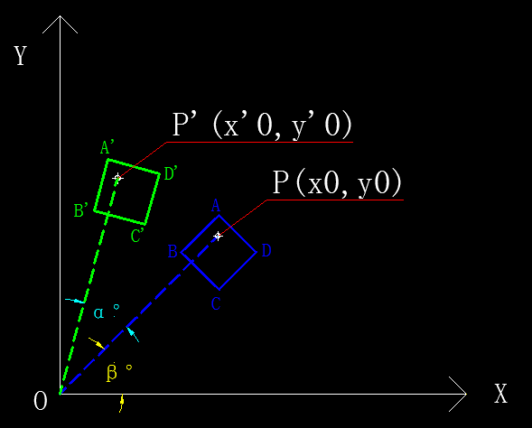

>All in matrix.

### 1. 概述
&emsp;&emsp;之所以写这篇文章，主要是因为长期以来对于特征值(
**eigenvalue**) 和特征向量(**eigenvector**)总是一种似懂非懂、不甚了了的感觉。应该说我（其实多数从大学量产出来的学生都存在这个问题）只是学会了怎么玩弄数字（**记住了公式**），却没能从根本上去理解为什么要这样做，为什么能这样做。对于理工科学生来说，这是一个相当严重的问题，连最起码的严谨、求实、质疑的精神都没有的学生不是一个合格的理工学生！    
&emsp;&emsp;那么问题就来了，这个锅真的就该学生来背吗？    
&emsp;&emsp;我认为这个锅应该甩给高校，国内高等教育的古板与僵化是罪魁祸首。在我的记忆力，能够把书本上的大部分公式用自己的方式（而不是照本宣科）完整的证明和板书一遍的老师，已经算是可遇而不可求了。    
&emsp;&emsp;在本文写作之前，也在网上搜索过大量的相关资料（包括群英荟萃的**知乎**），然而并没有一篇真正从源头解释清楚这两个词语的文章（**可能是有些问题太过基础，大神们都不太想讲**）。    
&emsp;&emsp;本文力图让非数学专业的同学也能非常容易的理解特征值和特征向量。    
&emsp;&emsp;OK，我们先从高中数学的坐标变换开始。

### 2. 图形变换
#### 2.1 图形旋转

图2-1　　图形旋转示意图

   
&emsp;&emsp;图中，蓝色菱形`ABCD`为原始图形（旋转前），绿色菱形`A'B'C'D'`为旋转后图形，它是在原图的基础上绕着坐标轴原点`O`逆时针旋转α°后得到的。同时记原图`ABCD`与`X`轴的夹角为β°。    

##### 2.1.1 几何表达式
&emsp;&emsp;对菱形中任意点，设其旋转前后的坐标分别为$P(x_0 , y_0)$、$P'(x_0' , y_0')$。则由图有：    
&emsp;&emsp;① $x_0'$ = $|OP'|·cos(α + β)$ = $|OP'|·cosα·cosβ - |OP'|·sinα·sinβ$$\tag{2-1}$

&emsp;&emsp;② $y_0'$ = $|OP'|·sin(α + β)$ = $|OP'|·sinα·cosβ + |OP'|·cosα·sinβ$$\tag{2-2}$

&emsp;&emsp;③ $x_0$ = $|OP|·cos(β)$$\tag{2-3}$

&emsp;&emsp;④ $y_0$ = $|OP|·sin(β)$$\tag{2-4}$   

&emsp;&emsp;⑤ $|OP'|$ = $|OP|$$\tag{2-5}$

&emsp;&emsp;将式2-3、2-4、2-5分别代入2-1、2-2整理后有：
&emsp;&emsp;⑥ $x_0'$ = $cosα·x_0 - sinα·y_0$$\tag{2-6}$

&emsp;&emsp;⑦ $y_0'$ = $sinα·x_0 + cosα·y_0$$\tag{2-7}$

##### 2.1.2 矩阵表达式
&emsp;&emsp;上式2-6、2-7用矩阵的形式可表示为：  

$$\begin{bmatrix}
x_0'\\\\
y_0'
\end{bmatrix} = 
\begin{bmatrix}
cosα\\quad 
-sinα\\\\
sinα\\quad  
cosα
\end{bmatrix} · 
\begin{bmatrix}
x_0\\\\
y_0
\end{bmatrix}
\tag{2-8}
$$

&emsp;&emsp;**或：**

$$
\begin{bmatrix}
cosα\\quad 
-sinα\\\\
sinα\\quad  
cosα
\end{bmatrix} · 
\begin{bmatrix}
x_0\\\\
y_0
\end{bmatrix} = 
\begin{bmatrix}
x_0'\\\\
y_0'
\end{bmatrix}
\tag{2-9}
$$

&emsp;&emsp;分别记：
$$
X' = \begin{bmatrix}
x_0'\\\\
y_0'
\end{bmatrix} , T = 
\begin{bmatrix}
cosα\\quad 
-sinα\\\\
sinα\\quad  
cosα
\end{bmatrix} , X = 
\begin{bmatrix}
x_0\\\\
y_0
\end{bmatrix}
$$

&emsp;&emsp;则上式2-8可简记为：
$$
X' = T · X
\tag{2-10}
$$

##### 2.1.3 重要结论
&emsp;&emsp;从上式可以看出，图形的逆时针旋转只需要在原始图形基础上左乘一个`旋转系数`矩阵`T`即可。仔细观察`T`，可以看出它是一个对角元素值相同，对称位置元素互为相反数的矩阵。
&emsp;&emsp;同理我们可求得图形沿顺时针旋转α°的`旋转系数`矩阵`T'`为：
$$
T' = 
\begin{bmatrix}
cosα\\quad 
sinα\\\\
-sinα\\quad  
cosα
\end{bmatrix}
\tag{2-11}
$$

&emsp;&emsp;即有如下关系式：
$$\begin{bmatrix}
x_0\\\\
y_0
\end{bmatrix} = 
\begin{bmatrix}
cosα\\quad 
sinα\\\\
-sinα\\quad  
cosα
\end{bmatrix} · 
\begin{bmatrix}
x_0'\\\\
y_0'
\end{bmatrix}
\tag{2-12}
$$

&emsp;&emsp;**或：**

$$
\begin{bmatrix}
cosα\\quad 
sinα\\\\
-sinα\\quad  
cosα
\end{bmatrix} · 
\begin{bmatrix}
x_0'\\\\
y_0'
\end{bmatrix} = 
\begin{bmatrix}
x_0\\\\
y_0
\end{bmatrix}
\tag{2-13}
$$

&emsp;&emsp;可以看出`T`和`T'`互为**转置矩阵**和**逆矩阵**，即有：
$$
T^T = T^{-1} = T'\tag{2-14}
$$$$
(T')^T = (T')^{-1} = T\tag{2-15}
$$

&emsp;&emsp;同时可以看出`旋转系数`矩阵`T`和`T'`中的元素与原图形和`X`轴的夹角大小（β）无关，只取决于原始图形和旋转后的图形之间的夹角大小（α）。**顺时针旋转就使用矩阵`T'`**，**逆时针旋转就使用矩阵`T`**。
&emsp;&emsp;**也就是说，类似`T`和`T'`这样的矩阵，能够对给定坐标系（这里是`X-Y`）中的任意向量进行旋转（整体上则表现为图形的旋转）。**

#### 2.2 图形压缩

