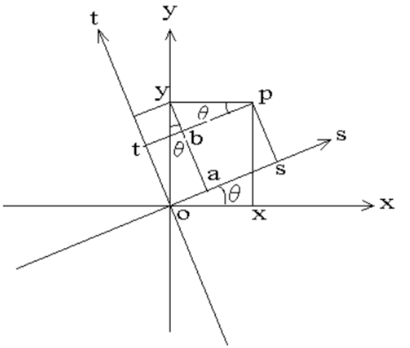

>All in matrix.

### 1. 概述
&emsp;&emsp;之所以写这篇文章，主要是因为长期以来对于特征值(
**eigenvalue**) 和特征向量(**eigenvector**)总是一种似懂非懂、不甚了了的感觉。应该说我（其实多数从大学量产出来的学生都存在这个问题）只是学会了怎么玩弄数字（**记住了公式**），却没能从根本上去理解为什么要这样做，为什么能这样做。对于理工科学生来说，这是一个相当严重的问题，连最起码的严谨、求实、质疑的精神都没有的学生不是一个合格的理工学生！    
&emsp;&emsp;那么问题就来了，这个锅真的就该学生来背吗？    
&emsp;&emsp;我认为这个锅应该甩给高校，国内高等教育的古板与僵化是罪魁祸首。在我的记忆力，能够把书本上的大部分公式用自己的方式（而不是照本宣科）完整的证明和板书一遍的老师，已经算是可遇而不可求了。    
&emsp;&emsp;在本文写作之前，也在网上搜索过大量的相关资料（包括群英荟萃的**知乎**），然而并没有一篇真正从源头解释清楚这两个词语的文章（**可能是有些问题太过基础，大神们都不太想讲**）。    
&emsp;&emsp;本文力图让非数学专业的同学也能非常容易的理解特征值和特征向量。    
&emsp;&emsp;OK，我们先从高中数学的坐标变换开始。

### 2. 坐标变换
#### 2.1 几何表示形式

图2-1　　原坐标系及坐标转换示意图

   
&emsp;&emsp;图中，`X-Y`组成的坐标系为原坐标系统，`S-T`组成的坐标系为新坐标系统（要转换的坐标系），而新坐标系`S-T`是从原坐标系`X-Y`逆时针旋转θ°后得到的。    
&emsp;&emsp;设原坐标系`X-Y`中有一点P(x0, y0)，坐标系旋转后，点P名称没变，坐标变为P(x'0, y'0)。则由图有：    
&emsp;&emsp;① $x_0^{'}$ = $os$ = $oy·sinθ + yp·cosθ$ =  $cosθ·x_0 + sinθ·y_0$$\tag{2-1}$

&emsp;&emsp;② $y_0^{'}$ = $ot$ = $oy·cosθ - yp·sinθ$ = $-sinθ·x_0 + cosθ·y_0$$\tag{2-2}$

&emsp;&emsp;③ $x_0$ = $ox$ = $\frac{os -oa}{cosθ}$ = $(x_0^{'} -y_0^{'}·tanθ)·cosθ$ = $cosθ·x_0^{'} - sinθ·y_0^{'}$$\tag{2-3}$

&emsp;&emsp;④$y_0$  = $oy$ = $\frac{ay}{cosθ}$ = $(x_0^{'} -y_0^{'}·tanθ)·cosθ$ = $sinθ·x_0^{'} + cosθ·y_0^{'}$$\tag{2-4}$    

&emsp;&emsp;上式①、②是从坐标系`X-Y`到`S-T`的转换关系，③、④式是从坐标系`S-T`到`X-Y`的转换关系。    

#### 2.2 矩阵表示
&emsp;&emsp;上式①、②用矩阵的形式可表示为：  

$$\begin{bmatrix}
x_0^{'}\\\\
y_0^{'}
\end{bmatrix} = 
\begin{bmatrix}
cosθ\\quad 
sinθ\\\\
-sinθ\\quad  
cosθ
\end{bmatrix} · 
\begin{bmatrix}
x_0\\\\
y_0
\end{bmatrix}\tag{2-5}$$

&emsp;&emsp;③、④用矩阵的形式可表示为：  

$$\begin{bmatrix}
x_0\\\\
y_0
\end{bmatrix} = 
\begin{bmatrix}
cosθ\\quad 
-sinθ\\\\
sinθ\\quad  
cosθ
\end{bmatrix} · 
\begin{bmatrix}
x_0^{'}\\\\
y_0^{'}
\end{bmatrix}\tag{2-6}$$

&emsp;&emsp;分别记：
$$
X = \begin{bmatrix}
x_0\\\\
y_0
\end{bmatrix} , T = 
\begin{bmatrix}
cosθ\\quad 
sinθ\\\\
-sinθ\\quad  
cosθ
\end{bmatrix} , X^{'} = 
\begin{bmatrix}
x_0^{'}\\\\
y_0^{'}
\end{bmatrix} , T^{'} = 
\begin{bmatrix}
cosθ\\quad 
-sinθ\\\\
sinθ\\quad  
cosθ
\end{bmatrix}
$$

&emsp;&emsp;则上式2-5、2-6可分别记作：
$$
X^{'} = T · X
\tag{2-7}
$$

$$
X = T^{'} · X^{'}
\tag{2-8}
$$

&emsp;&emsp;且有T、T‘互为逆矩阵，即`T·T' = E`。

