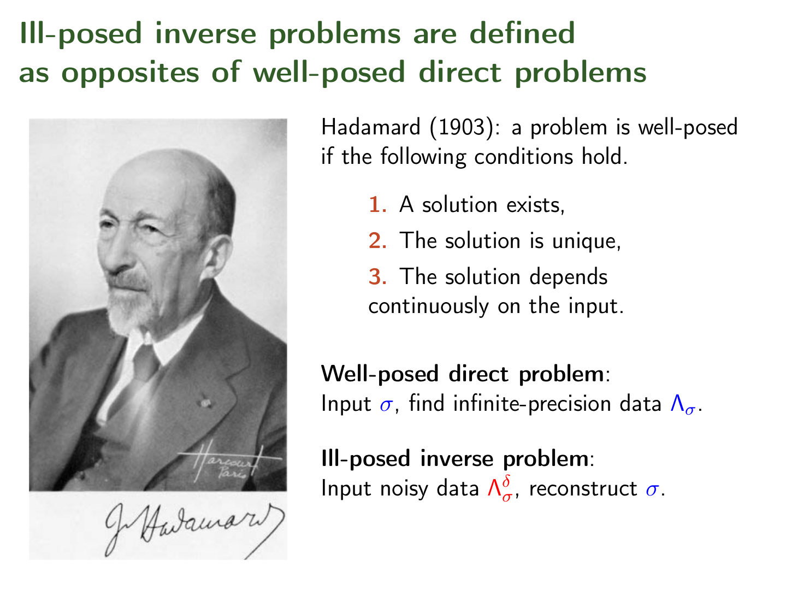

>Nothing is perfect, nothing.

***

## 一、概念定义
### 1.1 良态 *VS* 病态问题
&emsp;&emsp;**病态问题（ill-conditioned problem）**是指输出结果相对于输入非常敏感的问题，输入数据中哪怕是极少（或者极微妙）的噪声也会导致输出的较大改变（该术语并没有严格的官方定义）。
&emsp;&emsp;相反的，对于输入不敏感的问题，我们就称为**良态问题（well-conditioned problem）**。

### 1.2 条件数
&emsp;&emsp;**[条件数](https://en.wikipedia.org/wiki/Condition_number)（condition-number）**是用来衡量输出相对于输入敏感度的指标，良态问题和病态问题就是靠这个指标来进行区分的。

### 1.3 良态系统
&emsp;&emsp;注：以下两个概念（良态系统、病态系统）是我为方便叙述提出的，非官方术语。
&emsp;&emsp;我们把良态问题的内涵做一个延伸，对于任意一个系统，系统的输入和输出属于良态问题，我们称之为良态系统（或者这个系统是**良态的**）。
&emsp;&emsp;这里的**系统**的概念非常广泛，可以涵盖各种各样的类型。比如，以人体神经系统来说，一个良态的神经系统（身体健康的人），在外界环境温度（**输入**）发生微小改变时，它对人体温度的调节（**输出**）也应该是微小的。再比如，一个良态的汽车动力系统，当输入（油门大小）发生微小改变时，输出（动力的加减）也应该是微小的。
&emsp;&emsp;当然，我们主要还是围绕机器学习来讲。一个良态的分类/聚类/回归系统（模型），当输入数据中存在噪声时，其输出与没有噪声时相比，变化不应该太大，否则这个系统的鲁棒性就很差。存在过拟合的系统，因为泛化能力非常差，因此它必然是非良态（病态）的。

### 1.4 病态系统
&emsp;&emsp;如上所述，一般情况下，非良态的系统就是病态的（除去那些本身就要求输出对输入敏感的系统）。

### 1.5 适定问题 *VS* 不适定问题
&emsp;&emsp;注意要把病态/良态系统和[适定](https://en.wikipedia.org/wiki/Well-posed_problem)（well-posed problem）/不适定（ill-posed problem）问题区分开来。适定问题既可以是良态的，也可以是病态的，不适定问题同样如此，不要混为一谈。
&emsp;&emsp;这里贴一下**适定问题（well-posed problem）**的定义：

>  1. 必然存在解；
>  2. 解唯一；
>  3. 解随着初始条件改变而连续改变。

### 1.6 良态/病态矩阵
&emsp;&emsp;因为接下来的内容涉及到矩阵，因此需要对相应的概念做个介绍。对于线性方程组**A**$\vec x = \vec b$，其中**A**为m\*n矩阵，$\vec x、\vec b$均为n\*1的列向量。我们定义方程组关于**A**的条件数为：

$$
k(\textbf{A})= ||\textbf{A}|| \cdot ||\textbf{A}^{-1}||
\tag{1 - 1}
$$

&emsp;&emsp;上式中的范数也可以取其他范数（比如0、$\infty$范数）。当然上式成立的条件是**A**的逆矩阵$\textbf{A}^{-1}$存在（即**A**为非奇异矩阵）。当$k(\textbf{A})$较小时，$\vec b$的微小改变不会造成方程组解$\vec x$的改变，我们称**A**为良态矩阵，反之则成为病态矩阵。

&emsp;&emsp;条件数的定义推导如下，假定$\vec b$的变化量为$\Delta \vec b$，对应的解的变化为$\Delta \vec b$，则有：

$$
\textbf{A} (\vec x + \Delta \vec x) = \vec b + \Delta \vec b 
\tag{1 - 2}
$$

&emsp;&emsp;展开后有：

$$
\textbf{A} \vec x + \textbf{A} \cdot \Delta \vec x = \vec b + \Delta \vec b 
\tag{1 - 3}
$$

&emsp;&emsp;因为$\textbf{A} \vec x = \vec b$，代入式（1-3）有：

$$
\textbf{A} \cdot \Delta \vec x = \Delta \vec b 
\tag{1 - 4}
$$

&emsp;&emsp;同时我们假定了$\textbf{A}^{-1}$存在，所以有：

$$
\Delta \vec x = \textbf{A}^{-1} \cdot \Delta \vec b 
\tag{1 - 5}
$$

&emsp;&emsp;对等式两边取范数并根据[范数的特性](https://en.wikipedia.org/wiki/Norm_(mathematics\))有：

$$
||\Delta \vec x|| = ||\textbf{A}^{-1} \cdot \Delta \vec b || \leq ||\textbf{A}^{-1}|| \cdot ||\Delta \vec b ||
\tag{1 - 6}
$$

&emsp;&emsp;同时对$\textbf{A} \vec x = \vec b$两边取二范数有：

$$
||\textbf{A}|| \cdot ||\vec x|| \ge ||\textbf{A} \vec x|| = ||\vec b||
\tag{1 - 7}
$$

&emsp;&emsp;结合上式（1-6）、（1-7）有：

$$
\frac{||\Delta \vec x||}{||\textbf{A}|| \cdot ||\vec x||} \leq \frac{||\textbf{A}^{-1}|| \cdot ||\Delta \vec b ||}{||\vec b||}
\tag{1- 8}
$$

&emsp;&emsp;根据上式进一步有：

$$
\underbrace{\frac{||\Delta \vec x||}{||\vec x||}}_{输入的改变率} \leq \underbrace{||\textbf{A}|| \cdot ||\textbf{A}^{-1}||}_{输入输出改变率比系数} \cdot \underbrace{\frac{||\Delta \vec b ||}{||\vec b||}}_{输出改变率}
\tag{1- 9}
$$

&emsp;&emsp;由上式，我们定义输入改变率和输出改变率的这个系数为条件数，即有：

$$
\begin{cases}
\begin{split}
k(\textbf{A}) &= ||\textbf{A}|| \cdot ||\textbf{A}^{-1}|| \geq ||\textbf{A} \cdot \textbf{A}^{-1}|| = 1 \\\\
\frac{||\Delta \vec x||}{||\vec x||} &\leq  k(\textbf{A}) \cdot \frac{||\Delta \vec b ||}{||\vec b||}
\end{split}
\end{cases}
\tag{1 -10}
$$

&emsp;&emsp;**由上可知，条件数实际上是输出相对于输入变化的灵敏度系数。**

### 1.7 二范数条件数
&emsp;&emsp;如果我们取的是二范数，即$||\cdot||_2$，则其条件数为：

$$
k(\textbf{A}) = \frac{\sigma_{max}(\textbf{A})}{\sigma_{min}(\textbf{A})}
\tag{1 - 11}
$$

&emsp;&emsp;上式中的$\sigma_{max}(\textbf{A})、\sigma_{min}(\textbf{A})$分别指矩阵**A**的最大、最小奇异值。

#### 1.7.1 正规阵条件数
&emsp;&emsp;特别的，当**A**为[正规阵](https://en.wikipedia.org/wiki/Normal_matrix)时：

$$
k(\textbf{A}) = \frac{|\lambda_{max}(\textbf{A})|}{|\lambda_{min}(\textbf{A})|}
\tag{1 - 12}
$$

&emsp;&emsp;式中$\lambda_{max}(\textbf{A})、\lambda_{min}(\textbf{A})$分别为矩阵**A**的最大、最小特征值。

#### 1.7.2 酉矩阵条件数
&emsp;&emsp;特别的，当**A**为[酉矩阵](https://en.wikipedia.org/wiki/Unitary_matrix)时：

$$
k(\textbf{A}) = 1
\tag{1 - 13}
$$

&emsp;&emsp;**即当且仅当A为酉矩阵时，条件数取得最小值1。**

#### 1.7.3 奇异矩阵条件数
&emsp;&emsp;特别的，当**A**为[奇异矩阵](http://mathworld.wolfram.com/SingularMatrix.html)时，**A**的逆矩阵不存在：

$$
k(\textbf{A}) \rightarrow \infty
\tag{1 - 14}
$$

### 1.8 机器学习和条件数
&emsp;&emsp;矩阵的条件数是针对一般方程组而言的，对于机器学习，还需要做一些说明。因为在线性方程组中，$\vec b$是输入，而$\vec x$才是我们的输出（要求解的），这点和机器学习模型有所差异，我们要在这两个问题之间做一个转换，以方便接下来的讨论。
&emsp;&emsp;对于机器学习模型而言，神经网络的参数矩阵通常用**W**表示，输入样本用$\vec x$表示，而输出用$\vec y$表示。三者的关系为：

$$
\textbf{W} \cdot \underbrace{\vec x}_{输入} = \underbrace{\vec y}_{输出} \\\\
\tag{1 - 15}
$$

&emsp;&emsp;线性方程组的关系为：

$$
\textbf{A}^{-1} \cdot \underbrace{\vec b}_{输入} = \underbrace{\vec x}_{输出}
\tag{1 - 16}
$$

&emsp;&emsp;模型训练好了之后，**W**是不会改变的，然后将样本$\vec x$作为输入（自变量），去生成输出$\vec y$（因变量）。因此有如下对应关系：
$$
\begin{cases}
\begin{split}
\textbf{W} & \iff \textbf{A}^{-1} \\\\
\vec x & \iff \vec b \\\\
\vec y & \iff \vec x
\end{split}
\end{cases}
\tag{1 -17}
$$

&emsp;&emsp;则有机器学习模型的条件数：

$$
\begin{split}
k(\textbf{W}) &= ||\textbf{W}|| \cdot ||(\textbf{W}^{-1})^{-1}||\\\\
&= ||\textbf{W}^{-1}|| \cdot ||\textbf{W}||
\end{split}
\tag{1 - 18}
$$

## 二、应用

### 2.2 病态的根源
&emsp;&emsp;既然已经定义了条件数，定义了什么是病态，什么是良态，我们不禁会想，引起病态的根源是什么，或者说什么样的矩阵具备病态特征。
&emsp;&emsp;当然，你可能会说，前面不是定义了条件数较大的矩阵属于病态矩阵吗，这不是多此一问吗？
&emsp;&emsp;过大的条件数会导致矩阵病态只是我们的结论，并不是根本的原因。最根本的原因在于**矩阵的列之间的相关性过大**。

&emsp;&emsp;为了说明这个问题，我们举一个最简单的二维方阵来说明。

#### 2.2.1 示例
&emsp;&emsp;给定如下条件：

$$
\textbf{W} = 
\begin{bmatrix}
   1333 & -131 \\
   331 & -31 \\
\end{bmatrix} \quad , \quad
\vec x = 
\begin{bmatrix}
   1 \\
   11 \\
\end{bmatrix}
$$

&emsp;&emsp;可以解出：

$$
\vec y = 
\begin{bmatrix}
   -120 \\
   -13 \\
\end{bmatrix}
$$

&emsp;&emsp;现在我们分别对输入做细微的调整，并计算输出结果，如下所示：

$$
\begin{cases}
\begin{split}
\vec x_1 &= 
\begin{bmatrix}
   1.0097 \\
   11.001 \\
\end{bmatrix} \Longrightarrow 
\vec y_1 &= 
\begin{bmatrix}
   -95.2 \\
   -6.82 \\
\end{bmatrix} \Longrightarrow
\Delta \vec y_1 &= 
\begin{bmatrix}
   20.67\% \\
   47.54\% \\
\end{bmatrix} \\\\
\vec x_2 &= 
\begin{bmatrix}
   1.0024 \\
   11.010 \\
\end{bmatrix} \Longrightarrow 
\vec y_2 &= 
\begin{bmatrix}
   -106.11 \\
   -9.52 \\
\end{bmatrix} \Longrightarrow
\Delta \vec y_2 &= 
\begin{bmatrix}
   11.58\% \\
   26.92\% \\
\end{bmatrix}
\end{split}
\end{cases}
\tag{2 - 1}
$$

&emsp;&emsp;由上可知，即使输入的微小改变，也会引起输出的大幅变动。比如上面的$\vec x_1$对应的输出$\vec y_1$分量最高变动率高达近50%。

&emsp;&emsp;我们来看看其列之间的相关性，有：

$$
\vec w_1/ \vec w_2 =
\begin{bmatrix}
   1333/(-131) \\
   331/(-31) \\
\end{bmatrix} = \begin{bmatrix}
   10.1756 \\
   10.6774 \\
\end{bmatrix}
\tag{2 - 2}
$$

&emsp;&emsp;可以看出，矩阵**W**的列之间的线性相关性非常高！

#### 2.2.2 特征值和特征向量
&emsp;&emsp;与此同时，虽然上面两个输入$\vec x_1、\vec x_2$与原始输入$\vec x$改变的绝对值不一样，但实际上在其两个特征向量方向上的改变率却是一样的，换句话说，不同特征向量方向上相同的改变率，其输出的改变率是不同的。

&emsp;&emsp;利用**Numpy**内置的函数`numpy.linalg.eig()`我们可以非常方便的求解出$\textbf{W}$的特征值及其特征向量如下：

$$
\begin{cases}
\begin{split}
\vec \xi_1 &\approx 
\begin{bmatrix}
   0.97 \\
   0.10 \\
\end{bmatrix} \quad , \quad \lambda_1 \approx 1300\\\\
\vec \xi_2 &\approx 
\begin{bmatrix}
   0.24 \\
   1.00 \\
\end{bmatrix}  \quad , \quad \lambda_2 \approx 1.57
\end{split}
\end{cases}
\tag{2 - 3}
$$

&emsp;&emsp;可以看出，输入$\vec x$分别沿着两个特征向量$\vec \xi_1、\vec \xi_2$方向增加1%后，即为式（2-1）中的$\vec x_1、\vec x_2$，而特征向量$\vec \xi_1$对应的特征值（$\lambda_1 = 1300$）远大于特征向量$\vec \xi_2$对应的特征值（$\lambda_1 = 1.57$）。

&emsp;&emsp;**因此，当矩阵的特征值差异过大时，即使输入沿着较大特征值的方向有微小的改变，也会导致最终的输出结果的较大改变。**原因很简单，较大的特征值意味着对应特征方向上较大的自由度。

### 2.3 机器学习中应用
&emsp;&emsp;现在我们换个思路，我们手里已经有了大量的样本，要训练一个机器学习的模型，即已知$\vec x、\vec y$，要求**W**，考虑SGD（随机梯度下降）算法，因为每次送进去的样本数量$N > 1$，所以上式（1-14）就变成了：

$$
\textbf{W} \cdot \textbf{X} = \textbf{Y} \\\\
\tag{2 - 4}
$$

&emsp;&emsp;我们对上式做一个变形：

$$
\underbrace{\textbf{X}}_{A} \cdot \underbrace{\textbf{Y}^{-1}}_{\vec x} = \underbrace{\textbf{W}^{-1}}_{\vec b} \\\\
\tag{2 - 5}
$$

&emsp;&emsp;这个时候我们把输入的样本**X**视作参数矩阵，把要求解的参数**W**矩阵视作输出。由之前的结论可知，如果**X**为病态矩阵，即样本之间的相关性过大，可能会导致训练的收敛过程非常慢，甚至不收敛。因为整个训练过程中，相似样本之间的标签即使存在微小的差异，也会导致**W**的较大波动，导致解的不稳定性。

&emsp;&emsp;正是由于解的这种不稳定性，训练过程结束后，我们很难保证求解出来的模型能够足够优秀。另一方面，病态矩阵从另一个角度揭示了**过拟合**现象产生的原因，即通过解的大幅波动，去拟合我们的训练数据。

&emsp;&emsp;无论是数据的生成还是采集过程中，我们都很难保证没有噪声，因此一般我们都会对样本进行一些预处理，比如异常点检测、离群点检测等等，或者将解集限定在一组正交基的空间内（正交意味着不相关，求解出的参数矩阵就是一个良态矩阵）。无论采取什么措施，最终的目的都只有一个，那就是**获得一个良态参数矩阵**。

&emsp;&emsp;病态矩阵为我们提供了很多理论上的指导，同时也启发我们去思考其它很多问题。

### 2.4 参考资料
 - [机器学习中的矩阵方法(附录A）： 病态矩阵与条件数](https://www.cnblogs.com/daniel-D/p/3219802.html);
 - [病态问题与不适定问题是否等价？](https://www.zhihu.com/question/20854319);
 - [大家对病态矩阵是怎么理解的啊](http://muchong.com/html/201303/5573801.html);
 - [机器学习（十三）——机器学习中的矩阵方法（3）病态矩阵、协同过滤的ALS算法（1）](https://blog.csdn.net/antkillerfarm/article/details/53579368);
 - [机器学习中的矩阵方法](https://blog.csdn.net/antkillerfarm/article/details/53579368);